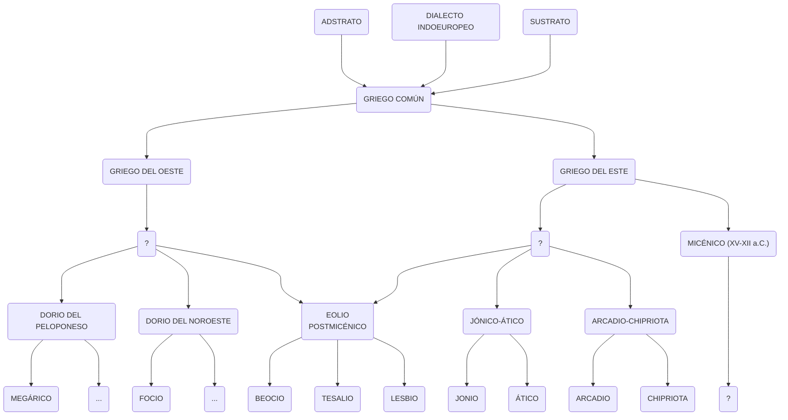
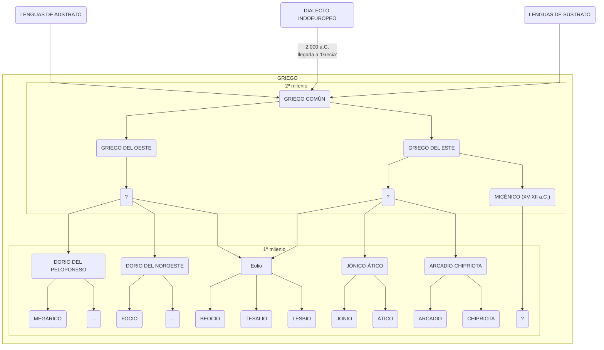

# Gráficos

## Gráfico 1

```mermaid

graph TB


Adstr("ADSTRATO")

IndoE("DIALECTO INDOEUROPEO")

Sustr("SUSTRATO")


GrCom("GRIEGO COMÚN")

West("GRIEGO DEL OESTE")
West1("?")

DorPel("DORIO DEL PELOPONESO")
DorNW("DORIO DEL NOROESTE")
Meg("MEGÁRICO")
DorPelEtc("...")
Foc("FOCIO")
DorNWEtc("...")

Eolio("EOLIO<br>POSTMICÉNICO")
Beo("BEOCIO")
Tes("TESALIO")
Les("LESBIO")

East("GRIEGO DEL ESTE")
East1("?")

JonAt("JÓNICO-ÁTICO")
ArcChip("ARCADIO-CHIPRIOTA")
Jon("JONIO")
At("ÁTICO")
Arc("ARCADIO")
Chip("CHIPRIOTA")

Mic("MICÉNICO (XV-XII a.C.)")
MicEtc("?")


Adstr--->GrCom
IndoE--->GrCom
Sustr--->GrCom


West--->West1

West1--->DorPel
DorPel--->Meg
DorPel--->DorPelEtc

West1--->DorNW
DorNW--->Foc
DorNW--->DorNWEtc

West1--->Eolio
East1--->Eolio

East--->East1
East--->Mic

East1--->JonAt
East1--->ArcChip

Eolio--->Beo
Eolio--->Tes
Eolio--->Les

Mic----->MicEtc
GrCom--->West
GrCom--->East

ArcChip--->Arc
ArcChip--->Chip

JonAt--->Jon
JonAt--->At

```

---

### 1.2. Del Indoeuropeo a los dialectos del s. V

```mermaid

%%{ init : { "theme" : "default", "flowchart" : { "curve" : "linear" }}}%%
%%                                ^^^^^^^^^^^^^^^^^^^^^^^^^^^^^^^^^^^^

graph TB

IndoE("DIALECTO INDOEUROPEO")

Adstr("LENGUAS DE ADSTRATO")
Sustr("LENGUAS DE SUSTRATO")

Adstr--->GrCom
IndoE--->|"2.000 a.C.<br>llegada a 'Grecia'"|GrCom
Sustr--->GrCom


subgraph id0 ["GRIEGO"]


subgraph id1 ["2º milenio"]

GrCom("GRIEGO COMÚN")

East("GRIEGO DEL ESTE")
West("GRIEGO DEL OESTE")

East--->Mic

East--->East1("?")
West--->West1("?")

Mic("MICÉNICO (XV-XII a.C.)")

end 

subgraph id2 ["1º milenio"]

West1--->DorPel
West1--->DorNW

West1--->Eolio
East1--->Eolio

East1--->JonAt
East1--->ArcChip


DorPel("DORIO DEL PELOPONESO")
DorNW("DORIO DEL NOROESTE")
Meg("MEGÁRICO")
DorPelEtc("...")
Foc("FOCIO")
DorNWEtc("...")

Beo("BEOCIO")
Tes("TESALIO")
Les("LESBIO")

Eolio--->Beo
Eolio--->Tes
Eolio--->Les

JonAt("JÓNICO-ÁTICO")
ArcChip("ARCADIO-CHIPRIOTA")
Jon("JONIO")
At("ÁTICO")

Arc("ARCADIO")
Chip("CHIPRIOTA")

Mic----->MicEtc("?")

end

GrCom--->West
GrCom--->East

ArcChip--->Arc
ArcChip--->Chip

JonAt--->Jon
JonAt--->At

DorPel--->Meg
DorPel--->DorPelEtc
DorNW--->Foc
DorNW--->DorNWEtc

end

```
