<!-- _class: title -->

# LA LENGUA DE HOMERO

---

## 1. Transmisión

1. **Fases de transmisión**

   1. Transmisión oral.
   2. Transcripción: paso de la transmisión oral a la escrita:
   3. Alfabetos locales arcaicos, que no notan: (i) división de paalbra; (ii) dobles consonantes; (iii) ε/η/ει, ο/ω/ου.
   4. Transcripción posterior al alfabeto reformado/jonio introducido en Atenas (s. V a.C.)
   5. Ediciones personales y públicas.
   6. Editores alejandrinos (s. II a.C.).
   7. Manuscritos.
   8. Editores modernos

---

B. **Conclusión**:

1. Modificaciones a lo largo de todas las fases.
2. Imposibilidad de 'reconstruir' el texto 'original'.

---

## 2. Origen del griego y sus dialectos

---

### 2.0. Del Indoeuropeo a los dialectos del s. IV B

---

### 2.1. Del Indoeuropeo a los dialectos del s. IV

---

### 2.2. Neolítico y edad de bronce en Grecia

---

### 2.3. Neolítico y edad de bronce en el Egeo

---

### 2.4. El mundo homérico continental

---

### 2.5. El mundo homérico

---

### 2.6. Dialectos en época clásica

_en.svg)

---

## 3. Características de la lengua homérica

---

### 3.1. Componentes

1. Lengua artificial (*Kuntsprache*)
   1.1. Jonio.
   1.2. Eolio.
   1.3. Griego NO.
   1.4. Aticismos.
   1.5. Relación con el micénico.
   1.6. Arcaísmos.
   1.7. Formas mixtas e incoherencias.

---

<!-- class: jonio -->

### 3.2. Rasgos jonios

1. \*ᾱ > η (incluso tras ε/ι/ρ): βί**η**, χώρ**η**.
2. Metátesis de cantidad:
   1. \*-ᾱο > (-ηο-)> -εω- (Πηληιάδ**εω**).
3. -ν Efeltística.
4. Infinitivos atemáticos en -ναι
5. 3ª pl. aor. -σαν (ἔθε-**σαν**, ἦ-**σαν**) en vez de la antigua -ν.
6. Partícula ἄν en vez κε.
7. **ἤν** (<ἐάν) por **ἐάν** (<εἰ + ἄν).
8. **ἡμεῖς**/**ὑμεῖς** en vez de lesbio **ἄμμες**/**ὔμμες** (< ns-sm/\*us-sm).
9. Nombres de agente en -**της** en vez de -**τηρ**/-**τωρ**.
10. Alargamiento compensatorio: ξεῖνος, μοῦνος en vez de XXX.

---

<!-- class: eolio -->

### 3.3. Rasgos eolios

**Algunos pueden ser reinterpretados como arcaísmos**.

1. Reflejos labiales de labio-velares heredadas incluso ante vocal delantera (i/e)
   1. πίσυρες, πελώριον.
   2. Micénico: conserva kw, gw, khw.
2. Infinitivos **temáticos** en -**εμεν**: tesalio, beocio y lesbio (1x) ἀκού**εμεν**.
3. Infinitivos **atemáticos** en -**μεν**, -**μεναι**: tesalio, beocio y lesbio (originalmente) θε**μεν**, θε**μεναι**.
4. Participios perfectos en -ων/-οντος:
   1. κε-κλήγ-**οντες** (μ256)
   2. Escondido quizá bajo participios extraños de vocal larga: μεμα-ῶτες (Β473) = μεμα-οντες.
5. Duplicación analógica de -σ- a partir de formas originales con -σσ-: ἐ-τέλε**σ**-**σ**α > (ἐ)κάλε**σσ**α.

---

<!-- class: eolio -->

1. Generalización del singular al plural en los aoristos atemáticos.
   1. Tesalio y lesbio: 1sg. ἔ-θηκα > 3pl. ἔ-θη**καν**.
   2. Jonio: 1sg. ἔ-θηκα > 3pl. ἔ-θε-**σαν**.
   3. Forma original: ἔ-θε-**ν**.
1. Dativo plural 3ªdecl. consonante: -εσσιν.
1. Infinitivos atemáticos: lesbio -**μεναι**: ¿protoeolio -μεν + jonio -ναι?

---

<!-- _class: eolio -->

**Clasificación de los rasgos** (García Ramón 1973):

1. Las formas 1-5: arcaísmos heredados o innovaciones anteriores al 1125 a.C.
2. Las formas 6-7: entre 1125 y 1.000 a.C.
3. La forma 8: innovaciones lesbias bajo influencia jonia (emigraciones eolias post 1.000 a.C.).

**Posición métrica**: solo aparecen donde ofrecen alternativas métricas a las formas jonias equivalentes:

1. ἄμμες/ὔμμες son métricamente equivalentes a ἡμεῖς/ὑμεῖς ante consonantes.
2. ἔμμεν/ἐμμέναι (¯¯/¯˘¯) y las degeminadas artificiales ἔμεν/ἐμέναι (¯¯/¯˘¯) frente a εἶναι (¯¯).
3. Eolio (ἐ)κάλε**σσ**α. (˘˘¯˘) frente a jonio (ἐ)κάλε**σ**α. (˘˘˘¯˘)
4. Eolio (nom./voc) θεά (ᾱ) (˘¯) frente a jonio nom. θεός (˘˘/˘¯) y voc. θεέ (˘˘) 'diosa'.

---

### 3.4. Griego Noroeste

<!-- _class: GriegoNO -->

1. Preposición: Hom. προτί: πρότ᾽ (arg.), πόρτι (cret.)
2. Pron. 2ª pers.: Hom. τύνη, τεοῖο, τεΐν: τύνει (beoc.), τούνη (lac.).
3. Hom. ἑέ, ἑοῖ (reflexivo): ἑοῦς, ἑΐν (Corinna).
4. Posesivo: Hom. ἁμός (ᾱ) (‘mío’), ὑμός (‘tuyo’): ἁμός.
5. Futuro: Hom. ἐσσεῖται (‘será’)

West, Martin. 1998. Homeri Ilias, vol. 1. Stuttgart and Leipzig.

---

<!-- class: atico -->

### 3.5. Ático

**Recensión ática** (Haslan 1997: 82-84):

   1. Supuesta recensión en Atenas:
      1. Pisístrato o su hijo Hiparco.
      2. Recitación en orden de las partes.
      3. Panatenaicas.
   2. Efecto en las obras:
      1. Definitiva formación de los poemas.
      2. Solo adquisición de rasgos áticos (pocos).
   3. Certeza única: los poemas pasaron por Atenas en forma escrita en su camino a Alejandría.

---

<!-- class: atico -->

**Rasgos áticos**:

   1. κρ**εί**σσων/μ**εί**ζων en vez de jonio κρ**έ**σσων/μ**έ**ζων.
   2. Ausencia de psilosis: (i) psilosis (jonio oriental); (ii) espíritu áspero (jonio occidental y ático).
   3. Plural πόλεις.
   4. Δέχομαι por δεκομαι.

---

<!-- _class: micenico -->

### 3.6. Micénico

#### 3.6.1. Consecuencias

1. Algunos rasgos homéricos considerados dialectales ya se encuentran en micénico:
   1. mic. pa-ka-na = hom. φάσγανα ('espadas').
   2. mic. -pi = hom. -φι.
2. Algunos rasgos homéricos muestran formas más antiguas que el micénico (West 1988):
   1. Homero: ṛ sin vocalizar: ἀνδ**ρ**οτῆτα καὶ ἥβην /an**ṛ**tāta idè yēgwān/.
   2. Micénico: ṛ vocalizada en **ro** o **or**: to-pe-za (τρόπεζα).
   3. Uso adverbial de preposiciones:
      1. Tmesis: Hom. **λιπὼν κάτα** πατρίδα γαῖαν
      2. Micénico: funcionan como prefijo inseparable del verbo: át. **καταλείπω**.
3. conclusión de 2: existencia de una tradición poética de la Edad del Bronce previa y posterior a la época micénica (Horrocks 1997: 201-203).

---

<!-- _class: normal -->

### 3.7. Arcaísmos

#### 3.7.1. Arcaísmos morfológicos

1. PIE -phi: -φι.
2. Prepo.+verbo
   1. Antiguo: Tmesis
   2. Nuevo: Prefijo
3. Subj. 3ª sg.*ēti > \*ēsi: φέρησι, δῶσιν.
4. \*-us masc/fem.
   1. ἡδὺς ἀυτμή (Od.12.369)
   2. jon-/át. ἡδεῖα ἀυτμή
5. acc. pl. masc. πολύς (ῡ).
6. υἱός temas u.
7. Aumento opcional: 1. aumento 2. ø: (injuntivo).
8. Dat.sg. 3ª decl. -ῑ. (< \*ēi?).
9. Ζῆν (final de verso) frente a Ζῆνα, Δία (posición interna).

---

<!-- _class: normal -->

#### 3.7.2. Arcaísmos sintácticos

1. \*so, \*sā, \*tod:
   1. artículo definido no usado con referentes conocidos.
   2. Uso como pronombre.

---

<!-- _class: normal -->

### 3.8. Visión dialectal global

[Rasgos](docs/Charlas/Lengua_Homer/../../../content-unit-1.xhtml)

---

<!-- _class: normal -->

### 3.9. Formas mixtas e incoherencias

Cambio lingüístico y heterogeneidad

1. Metátesis de cantidad: las nuevas formas no encajan en el verso: ἧος (¯˘) > ἕως (˘¯).
2. Digamma: no se nota por escrito, pero su antigua pronunciación se puede trastrear en los versos.
3. Formas contractas que dan resultados métricos erróneos: Αἰόλ**οιο**/Αἰόλ**ου**.
4. Correptio: abreviación de vocales, diptongos y triptongos en hiato.
5. Diéctasis: a. ὁρ**άο**-ντες (˘¯). b. ὁρ**ῶ**ντες (¯). c. ὁρ**όω**ντες (˘¯).
6. Muta + liquida en inicial de palabra no hace posición.
7. Asimilación de /s/ inicial + consonante (n, m, l): a. sn- b. nn- c. n-.
8. Diferencias dialectales en la misma línea o en la misma palabra: Λαερτιάδεω
   1. **Λαερτιάδης**: patronímico > eolio.
   2. Sufijo -**εω**: metátesis de cantidad jonia.
9. Silabificación de y: /i/ > /y/.
10. Variantes morfológicas de la misma palabra.

---

<!-- _class: normal -->

## 4. Surgimiento de la tradición

1. **Teoría de la fase eolia**

   1. Creación de una tradición oral eolia postmicénica en áreas donde estaba emergiendo el eolio (Grecia continental).
   2. Paso de esa tradición a Jonia en época posterior (eolios que migraron a Asia Menor) y absorción de esa tradición por hablantes del jonio.
   3. El dialecto eolio en los poemas sobrevivió donde no había formas paralelas (métricamente) en el jonio que pudieran sustituirlas.

2. **Teoría de la difusión**

   1. Herencia común de las tradiciones orales postmicénica eolia y jonia con influencias mutuas hasta que la tradición jonia eclipsó la eolia (quizá con la composición de la *Ilíada* y la *Odisea*).
   2. Paso de esa tradición a Jonia en época posterior, donde las tradiciones eolia y jonia habría confluido.

3. **Teoría aquea**
   1. Tradición mantenida por una forma de Arcado-chipriota en la zona sur micénica.
   2. Paso a áreas habitadas por hablantes del eolio.

---

<!-- _class: foto -->

_en.svg)

---

<!-- _class: normal -->

## 5. Bibliografía

- Garcia Ramón, José Luis. 1975. Les origines postmıceeniennes du groupe dialectal éolien. Etude linguistique. Salamanca.
- Garcia Ramón, José Luis. 2004. "Greek dialects'. In: Brill's New Pauly V:1011-—1017.
- Gschnitzer, Fritz. 2002. 'Aeolians". In: Brill's New Pauly I-226-229.
- Haslan, M.  1997. 'Homeric Papyri and Transmission of The Text'. In Morris & Powell (eds.), 55-100
- Horrocks, G. 1997. 'Homer's Dialect'. En Morris & Powell (eds.) *A new companion to Homer*, 191-217.
- Horrocks, G. 2014. Greek: *A History of the Language and its Speakers*. John Wiley & Sons.
- Morris, I., & Powell, B. B. (Eds.) 2011. *A new companion to Homer*. Brill.
- Tsagalis, C. 2014. 'Epic Diction'. In G. K. Giannakis & V. Bubeník (Eds.), Encyclopedia of Ancient Greek language and linguistics (pp. 548-557). Brill.
- West, Martin 1997. 'Homer's Meter'. En Morris & Powell (eds.) *A new companion to Homer*, 218-237.
- West, Martin. 1998. *Homeri Ilias*, vol. 1. Stuttgart and Leipzig.
- [Marpit](https://marpit.marp.app/directives)
