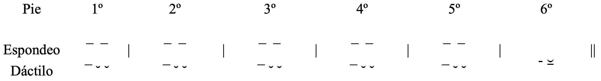

<!-- _class: title -->

# MÉTRICA GRIEGA

---

## 1. Verso

1. Combinaciones de metros o pies.
2. Metro o pie: combinaciones de sílabas largas y breves
3. Hexámetro dactílico: combinaciones de seis (hexa) metros o pies.
4. Pies o metros:
   1. Espondeo: ¯ ¯ (larga + larga)
   2. Dáctilo:  ¯ ˘ ˘ (larga + breve + breve)
5. Modelo de hexámetro

---

## 2. Cantidad silábica

1. Breve:
   1. Sílaba con vocal breve o terminada en vocal breve: ε (τρ**έ**-φω), ο (τρ**ό**-πος), ᾰ (Ἀ-γα-μέμ-νον-**α**),ῠ (γλυ-κ**ύ**), ῐ (ἐλ-πί-δ**ι**).
2. Larga:
   1. Por naturaleza (φύσει):
      1. Vocal larga: ω (τρέ-φ**ω**), η (μ**ή**-τηρ), ᾰ (ὅρ**ᾱ**).
      2. Diptongo: ἀν-θρώ-π**ου**ς
    2. Por posición/convención (θέσει)
      1. Breve + 2 consonantes (incluidas ζ, ξ, ψ): ἐ-ρί-σ**αν**-**τ**ε.

---

## 3. Encuentro de vocales

### 3.1. Elisión 

1. Pérdida de vocal final breve de palabra ante palabra comenzando por vocal:
2. Excepciones: 
   1. ἅ, τά, τί, τι, ὅτι, ἄχρι, μέχρι, περί.
   2. -ι (vocativo y dativo); adv. -ί.
3. Elisión de diptongos con restricciones:
   1. -αι: desinencias medias y pasivas, infnintivos activos.
   2. -οι: dativo de pronombres enclíticos (μοι, σοι).

---

### 3.2. Correptio

1. Abreviatura de vocal larga o diptongo a **final de palabra** ante palabra que comienza por vocal: ἄνδρα μ**οῐ ἔ**ννεπε Μοῦσα.
2. Abreviatura de vocal larga o diptongo en **interior de palabra** 
   1. Τρωΐα > Τροΐα, νῆες > νέες, οἷος (˘˘), υἱός (˘˘), δηΐων (˘˘¯)
Consonantalization of ι and υ

---

### 3.3. Sinecfónesis, sinícesis, sinalefa, crasis

1. Dos vocales seguidas (que no forman diptongo) pronunciadas como una única sílaba.
   1. Dentro de la mismas palabra.
      1. Particularmente frecuente con primera vocal ε: θ**εό**ς, **ἔα**σον, πόλ**εω**ς, **ἔα**ρι.
   2. Entre palabras (menos frecuente).
2. ante palabra que comienza por vocal: ἄνδρα μ**οῐ ἔ**ννεπε Μοῦσα.
3. Abreviatura de vocal larga o diptongo en **interior de palabra**
   1. Τρωΐα > Τροΐα, νῆες > νέες, οἷος (˘˘), υἱός (˘˘), δηΐων (˘˘¯)

---

### 3.4. Hiatus

1. Es raro.
2. Suele darse en contextos donde había una wau/digamma ϝ.

---

### 3.5. Consonantes

1. Es raro.
2. Suele darse en contextos donde había una wau/digamma ϝ.

---

## 4. Fenómenos ± irregulares (se dan o no)

### 4.1. Sinicesis

1. Dos vocales que no forman diptongo se funden en una sola sílaba:
   1. Πη-λη-ϊ-ά-δ**εω**
   2. θ**εοί**
   3. δ**ὴ οὕ**-τως

---

### 4.2. Muta (oclusiva) cum liquida (λ, ρ, μ, ν,)

1. Límite silábico entre las consonantes (la primera puede alargar vocal precedente breve):
   1. Ἀ**τ**-**ρ**είδης.
2. Ambas consonantes pertenecen a la misma sílaba (λ, ρ):
   1. Permiten que la vocal anterior no alargue
   2. 201 πτερό-εν-τ**ᾰ** **πρ**ο-σηύ-δα.

---

### 4.3. Hiato o elisión

1. El hiato (encuentro de dos vocales entre palabras) suele evitarse.
2. Elisión de **vocales breves** (ᾰ, ε, ο, ῐ, ῠ): ἄλγε**α ἔ**θηκε > ἄλγ**ε' ἔ**θηκε
3. Elisión de algunos **diptongos**:
   1. βούλομ(αι), μ(οι), σ(οι), τ(οι)

---

## 5. Diferencias métricas inconsistente debidas arcaísmos

### 5.1. Digamma

1. Palabras que la incluían etimologicamente. Antes de quese perdiera funcionaba como una consonante y produce efectos
   1. **Hiatos** en vez de elisión que se explican como existencia de una digamma antigua: τε (ϝ)ἄναξ.
   2. **Evitación de abreviación** de una breve o diptongo final: δόμεν**αι** ῾(**ϝ**)ελικώπιδα.
   3. Sílaba final breve **alarga por posición**: Ἀπόλλων**ος** ῾(**ϝ**)εκατηβελέταο
2. Palabras que no tienen gamma etimológica. Utilización artificial por parte de los aedos que lo entendían como una licencia:
   1. **Hiatos** o **falta de elisión** donde no debería haber: δ**έ έ**λώρια.
   2. Larga o diptongo final que **no abrevia**: 24 Ἀτρείδ**ῃ Ἀ**γαμέμνονι, 30 ἡμετέρ**ῳ ἑ**νί.
   3. Alargamiento de sílaba breve final ante vocal inicial: 19 πόλ**ιν ε**ὖ, 85 θεοπρόπι**ον ὅ** τι.

---

### 5.2. Silbante inicial (σ) ante líquidas (λ, ρ) y nasales (μ, ν) sílaba inicial: σλ-, σρ-, σμ-, σν-

1. Palabras que presente etimológicamente este grupo: hacía posición y alargaba la breve anterior.
2. Reinterpretación de los aedos:
   1. Alargan la anterior en casos de ausencia de σ- inicial etimológica.
   2. No alargan en caso de σ- inicial etimológica.

---

## 6. Elementos del hexámetro

### 6.1. Cesura

---

## 7. Información deducible de la métrica

### 7.1. Lengua

1. Las formas dialectales que son incompatibles métricamente deben considerarse auténticas.
2. Hy formas dialectales que no han sido sustituidas por formas más modernas o de otros dialectos porque ocupan huecos métricos no sustituibles.

---

### 7.2. Fórmulas

1. Las fórmulas no solo son combinaciones de palabras frecuentes.
2. Ocupan una posición métrica determinada.

---

## 8. Ejemplos de versos medidos

[Versos medidos y con explicaciones:](Versos_Medidos.pdf)