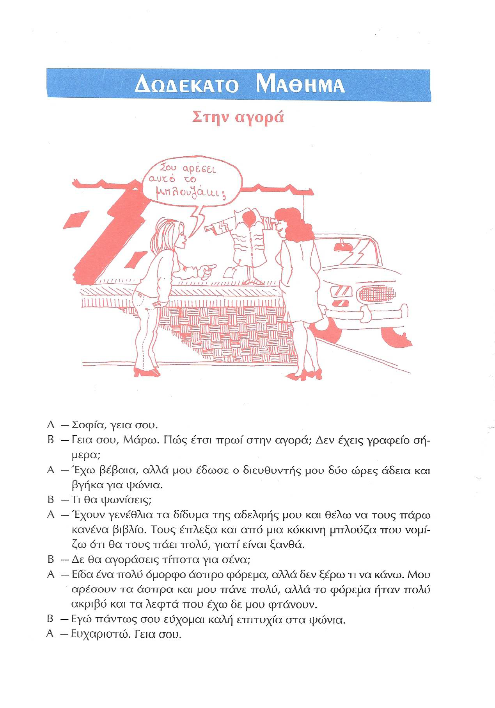
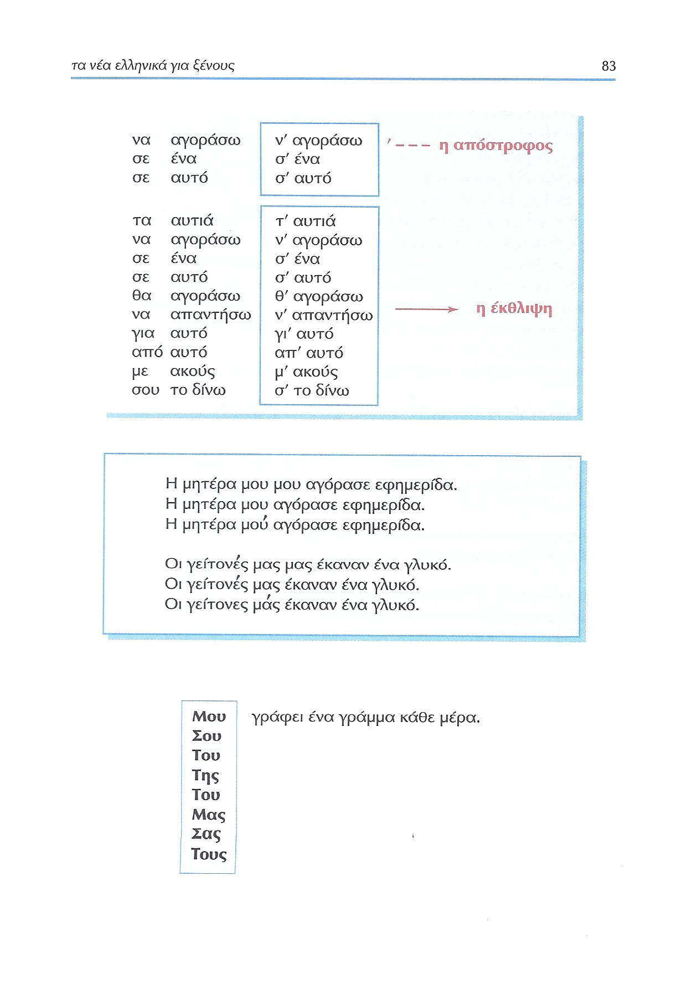
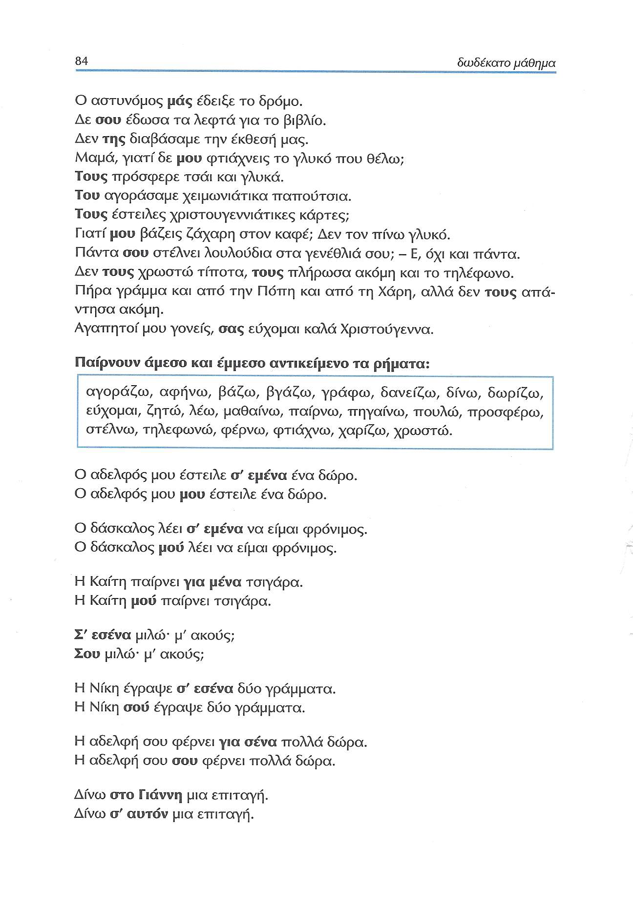
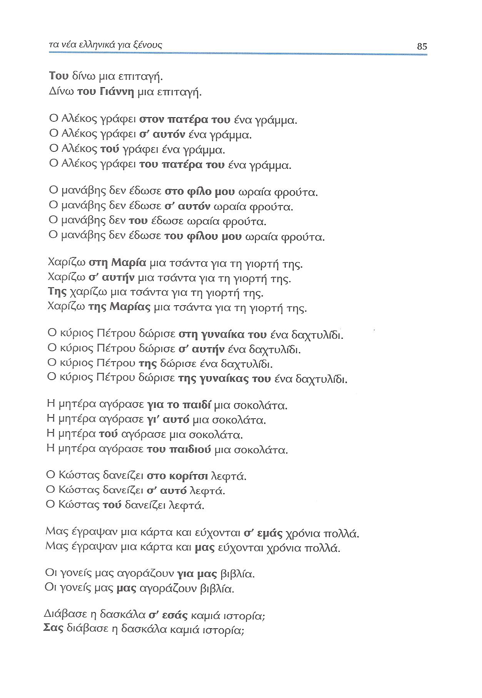
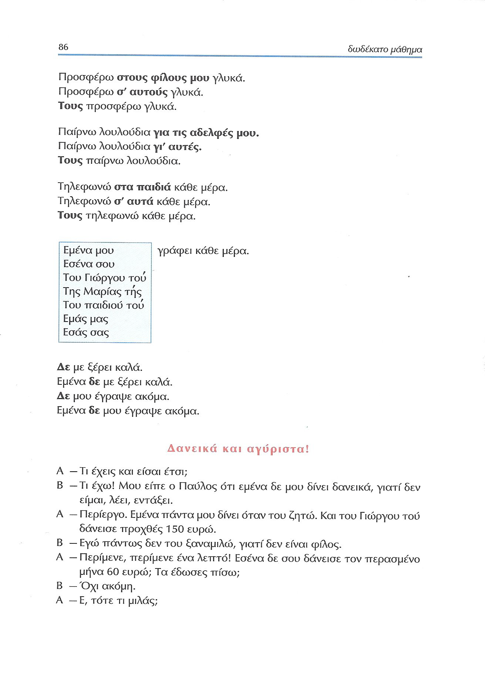
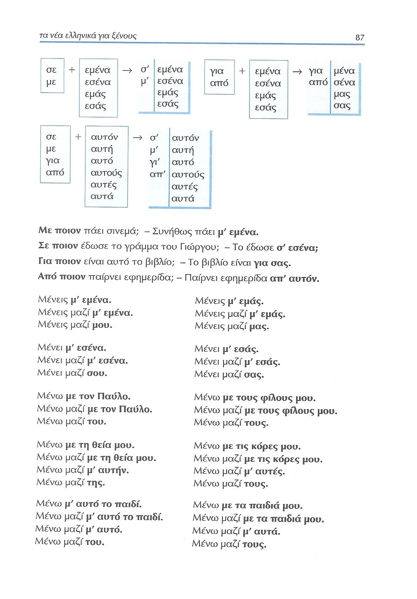
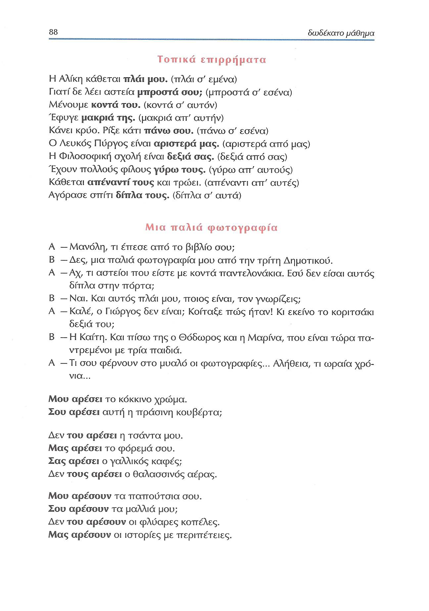
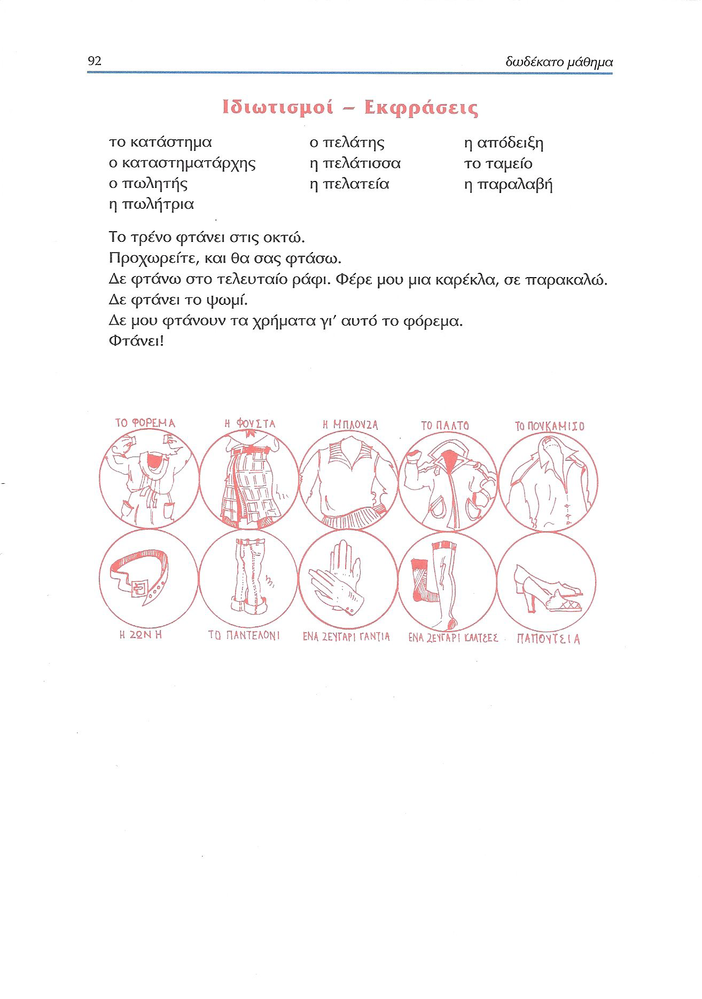

# Lección 12

---

## 82: 'Στην αγορά'

<audio controls="controls">
  <source type="audio/mpeg" src="../GM_Audios/12_Sten_agora.mp3"></source>
</audio>

---

---

## 83: Elisión/genitivo posesivo/indirecto

| Sujeto           |   CI    |  Verbo  |   Otros    |
|------------------|:-------:|:-------:|:----------:|
| Η μητέρα **μου** | **μου** | αγόρασε | εφημερίδα. |
| Η μητέρα **μου** |         | αγόρασε | εφημερίδα. |
| Η μητέρα         | **μού** | αγόρασε | εφημερίδα. |

---

## 84: Objeto (in)directo

### Formas del CI

| **EJEMPLO**                                                 | **Clít. gen.** | **σε+ ac.** | **για + ac.** | **SN gen.** |
|-------------------------------------------------------------|:--------------:|:-----------:|:-------------:|:-----------:|
| Ο αδελφός µου έστειλε **σ' εμένα ένα** δώρο                 |                |      +      |               |             |
| Ο αδελφός µου **µου** έστειλε ένα δώρο.                     |       +        |             |               |             |
| ..........                                                  |   Clít. gen.   |   σε+ ac.   |   για + ac.   |   SN gen.   |
| Ο δάσκαλος λέει **σ' εμένα** να είµαι φρόνιµος              |                |      +      |               |             |
| Ο δάσκαλος **μού** λέει να είμαι φρόνιµος                   |       +        |             |               |             |
| ..........                                                  |   Clít. gen.   |   σε+ ac.   |   για + ac.   |   SN gen.   |
| Η Καίτη παίρνει **για µένα** τσιγάρα                        |                |             |       +       |             |
| Η Καίτη **μού** παίρνει τσιγάρα                             |       +        |             |               |             |
| ..........                                                  |   Clít. gen.   |   σε+ ac.   |   για + ac.   |   SN gen.   |
| Η Νίκη έγραψε **σ' εσένα** δύο γράµµατα                     |                |      +      |               |             |
| Η Νίκη **σού** έγραψε δύο γράµµατα                          |       +        |             |               |             |
| ..........                                                  |   Clít. gen.   |   σε+ ac.   |   για + ac.   |   SN gen.   |
| Η αδελφή σου φέρνει **για σένα** πολλά δώρα                 |                |             |       +       |             |
| Η αδελφή σου **σου** φέρνει πολλά δώρα                      |       +        |             |               |             |
| ..........                                                  |   Clít. gen.   |   σε+ ac.   |   για + ac.   |   SN gen.   |
| Δίνω **στο Γιάννη** µια επιταγή                             |                |      +      |               |             |
| Δίνω **σ' αυτόν** µια επιταγή                               |                |      +      |               |             |
| **Του** δίνω µια επιταγή                                    |       +        |             |               |             |
| Δίνω **του Γιάννη** µια επιταγή                             |       +        |             |               |      +      |
| ..........                                                  |   Clít. gen.   |   σε+ ac.   |   για + ac.   |   SN gen.   |
| Ο Αλέκος γράφει **στον πατέρα** του ένα γράμμα              |                |      +      |               |             |
| Ο Αλέκος γράφει **σ' αυτόν** ένα γράµµα                     |                |      +      |               |             |
| Ο Αλέκος **τού** γράφει ένα γράµµα                          |       +        |             |               |             |
| Ο Αλέκος γράφει **του πατέρα του** ένα γράµµα               |                |             |               |      +      |
| ..........                                                  |   Clít. gen.   |   σε+ ac.   |   για + ac.   |   SN gen.   |
| Ο µανάβης δεν έδωσε **στο φίλο µου** ωραία φρούτα           |                |      +      |               |             |
| Ο µανάβης δεν έδωσε **σ' αυτόν** ωραία φρούτα               |                |      +      |               |             |
| Ο µανάβης δεν **του** έδωσε ωραία φρούτα                    |       +        |             |               |             |
| Ο µανάβης δεν έδωσε **του φίλου µου** ωραία φρούτα          |                |             |               |      +      |
| ..........                                                  |   Clít. gen.   |   σε+ ac.   |   για + ac.   |   SN gen.   |
| Χαρίζω **στη Μαρία** µια τσάντα για τη γιορτή της           |                |      +      |               |             |
| Χαρίζω **σ' αυτήν** µια τσάντα για τη γιορτή της            |                |      +      |               |             |
| **Της** χαρίζω µια τσάντα για τη γιορτή της                 |       +        |             |               |             |
| Χαρίζω **της Μαρίας** µια τσάντα για τη γιορτή της          |                |             |               |      +      |
| ..........                                                  |   Clít. gen.   |   σε+ ac.   |   για + ac.   |   SN gen.   |
| Ο κύριος Πέτρου δώρισε **στη γυναίκα του** ένα δαχτυλίδι    |                |      +      |               |             |
| Ο κύριος Πέτρου δώρισε **σ' αυτήν** ένα δαχτυλίδι           |                |      +      |               |             |
| Ο κύριος Πέτρου **της** δώρισε ένα δαχτυλίδι                |       +        |             |               |             |
| Ο κύριος Πέτρου δώρισε **της γυναίκας του** ένα δαχτυλίδι   |                |             |               |      +      |
| ..........                                                  |   Clít. gen.   |   σε+ ac.   |   για + ac.   |   SN gen.   |
| Η µητέρα αγόρασε **για το παιδί** µια σοκολάτα              |                |             |       +       |             |
| Η μητέρα αγόρασε **γι' αυτό** µια σοκολάτα                  |                |             |       +       |             |
| Η μητέρα **τού** αγόρασε µια σοκολάτα                       |       +        |             |               |             |
| Η μητέρα αγόρασε **του παιδιού** µια σοκολάτα               |                |             |               |      +      |
| ..........                                                  |   Clít. gen.   |   σε+ ac.   |   για + ac.   |   SN gen.   |
| Ο Κώστας δανείζει **στο κορίτσι** λεφτά                     |                |      +      |               |             |
| Ο Κώστας δανείζει **σ' αυτό** λεφτά                         |                |      +      |               |             |
| Ο Κώστας **τού** δανείζει λεφτά                             |       +        |             |               |             |
| ..........                                                  |   Clít. gen.   |   σε+ ac.   |   για + ac.   |   SN gen.   |
| Μας έγραψαν µια κάρτα και εύχονται **σ' εµάς** χρόνια πολλά |                |      +      |               |             |
| Μας έγραψαν µια κάρτα και **µας** εύχονται χρόνια πολλά     |       +        |             |               |             |
| ..........                                                  |   Clít. gen.   |   σε+ ac.   |   για + ac.   |   SN gen.   |
| Οι γονείς µας αγοράζουν **για µας** βιβλία                  |                |             |       +       |             |
| Οι γονείς µας **µας** αγοράζουν βιβλία                      |       +        |             |               |             |
| ..........                                                  |   Clít. gen.   |   σε+ ac.   |   για + ac.   |   SN gen.   |
| Διάβασε η δασκάλα **σ' εσάς** καµιά ιστορία;                |                |      +      |               |             |
| **Σας** διάβασε η δασκάλα καμιά ιστορία;                    |       +        |             |               |             |
| ..........                                                  |   Clít. gen.   |   σε+ ac.   |   για + ac.   |   SN gen.   |
| Προσφέρω **στους φίλους µου** γλυκά                         |                |      +      |               |             |
| Προσφέρω **σ' αυτούς** γλυκά                                |                |      +      |               |             |
| **Τους** προσφέρω γλυκά                                     |       +        |             |               |             |
| ..........                                                  |   Clít. gen.   |   σε+ ac.   |   για + ac.   |   SN gen.   |
| Παίρνω λουλούδια **για τις αδελφές µου**.                   |                |             |       +       |             |
| Παίρνω λουλούδια **γι' αυτές**                              |                |             |       +       |             |
| **Τους** παίρνω λουλούδια                                   |       +        |             |               |             |
| ..........                                                  |   Clít. gen.   |   σε+ ac.   |   για + ac.   |   SN gen.   |
| Τηλεφωνώ **στα παιδιά** κάθε µέρα                           |                |      +      |               |             |
| Τηλεφωνώ **σ' αυτά** κάθε µέρα                              |                |      +      |               |             |
| **Τους** τηλεφωνώ κάθε μέρα                                 |       +        |             |               |             |
| ..........                                                  |   Clít. gen.   |   σε+ ac.   |   για + ac.   |   SN gen.   |

---

## 85: Objeto (in)directo

---

## 86: OI/reduplicación de clítico

### Reduplicación de clítico

En griego el pronombre clítico en genitivo puede repetir el CI expresado (i) por un **pronombre tónico en genitivo** (εμένα, εσένα, εμάς, εσάς, etc.) o (ii) por un **SN en genitivo** (του Γιώργου, της Μαρίας, του παιδιού), cuando se coloca en **posición inicial** de oración, como en español.

| EJEMPLO                              | Pron/SN gen. | Clít. gen. | σε+ac. | για+ac. | SN gen. |
|--------------------------------------|:------------:|:----------:|:------:|:-------:|:-------:|
| **Εμένα µου** γράφει κάθε µέρα       |      +       |     +      |        |         |         |
| **Εσένα σου** γράφει κάθε µέρα       |      +       |     +      |        |         |         |
| **Του Γιώργου τού** γράφει κάθε µέρα |      +       |     +      |        |         |         |
| **Της Μαρίας τής** γράφει κάθε µέρα  |      +       |     +      |        |         |         |
| **Του παιδιού τού** γράφει κάθε µέρα |      +       |     +      |        |         |         |
| **Εμάς µας** γράφει κάθε µέρα        |      +       |     +      |        |         |         |
| **Εσάς σας** γράφει κάθε µέρα        |      +       |     +      |        |         |         |
| ............................         |              |            |        |         |         |

### Orden

Como en español, (i) el clítico va entre la negación y el verbo, (ii) mientras que la forma tónica precede a la negación, tanto en el caso del CD como del CI.

| EJEMPLO                   | Pron/SN gen. | Negación | Clítico | Verbo  | Otros |
|---------------------------|:------------:|:--------:|:-------:|:------:|:-----:|
| Δε µε ξέρει καλά          |              |    Δε    |   µε    | ξέρει  | καλά  |
| Εμένα δε µε ξέρει καλά    |    Εμένα     |    δε    |   µε    | ξέρει  | καλά  |
| Δε µου έγραψε ακόµα       |              |    Δε    |   µου   | έγραψε | ακόµα |
| Εμένα δε µου έγραψε ακόµα |    Εμένα     |    δε    |   µου   | έγραψε | ακόµα |

Σ' εσένα μιλώ: μ' ακούς;
Σου μιλώ' μ' ακούς;

Ο µανάβης δεν **του** έδωσε ωραία φρούτα

---

## 87: Elisión en preposiciones

| Pronombre |      σε       |      με       |      για       |      από       |
|-----------|:-------------:|:-------------:|:--------------:|:--------------:|
| εμένα     | **σ'** εμένα  | **μ'** εμένα  |  για **μένα**  |  από **μένα**  |
| εσένα     | **σ'** εσένα  | **μ'** εσένα  |  για **σένα**  |  από **σένα**  |
| εμάς      |  **σ'** εμάς  |  **μ'** εμάς  |  για **μάς**   |  από **μάς**   |
| εσάς      |  **σ'** εσάς  |  **μ'** εσάς  |  για **σάς**   |  από **σάς**   |
| αυτόν     | **σ'** αυτόν  | **μ'** αυτόν  | **γι'** αυτόν  | **απ'** αυτόν  |
| αυτή      |  **σ'** αυτή  |  **μ'** αυτή  |  **γι'** αυτή  |  **απ'** αυτή  |
| αυτό      |  **σ'** αυτό  |  **μ'** αυτό  |  **γι'** αυτό  |  **απ'** αυτό  |
| αυτούς    | **σ'** αυτούς | **μ'** αυτούς | **γι'** αυτούς | **απ'** αυτούς |
| αυτές     | **σ'** αυτές  | **μ'** αυτές  | **γι'** αυτές  | **απ'** αυτές  |
| αυτά      |  **σ'** αυτά  |  **μ'** αυτά  |  **γι'** αυτά  |  **απ'** αυτά  |

---

## 88: Adverbios/diálogo/μ᾽αρέσει

Minuto 1:49

<audio controls="controls">
  <source type="audio/mpeg" src="../GM_Audios/12_Sten_agora.mp3"></source>
</audio>

### Adverbios => preposiciones (compuestas)

| Adverbio   |         Adv + SP         |       Adv + SP       | Adv + clítico gen. |
|------------|:------------------------:|:--------------------:|:------------------:|
| Esp. lejos |    lejos **de Pedro**    |   lejos **de mí**    |                    |
| Gr. μακριά | μακριά **από τον Πέτρο** | μακριά **από εμένα** |   μακριά **του**   |
| Esp. cerca |    cerca **de Pedro**    |   cerca **de mí**    |                    |
| Gr. κοντά  |   κοντά **στον Πέτρο**   |  κοντά **σ' εμένα**  |   κοντά **μου**    |

| EJEMPLO               | Adv + clítico (gen) | Prep (από/σε) + tónico |       Prep (από/σε) + SN       |
|-----------------------|:-------------------:|:----------------------:|:------------------------------:|
| Η Αλίκη κάθεται       |    πλάι **µου**     |   πλάι **σ' εμένα**    |      πλάι **στον Πέτρο**       |
| Γιατί δε λέει αστεία  |  μπροστά **σου**;   |  μπροστά **σ' εσένα**  |     μπροστά **στον Πέτρο**     |
| Μένουμε               |    κοντά **του**    |   κοντά **σ' αυτόν**   |      κοντά **στον Πέτρο**      |
| Έφυγε                 |   μακριά **της**    |  μακριά **απ' αυτήν**  |    μακριά **από τον Πέτρο**    |
| Κάνει κρύο. Ρίξε κάτι |    πάνω **σου**     |   πάνω **σ' εσένα**    |    πάνω **στο κεφάλι σου**     |
| Ο Λευκός Πύργος είναι |  αριστερά **μας**   |  αριστερά **από μας**  |   αριστερά **από τον Πέτρο**   |
| Έχουν πολλούς φίλους  |    γύρω **τους**    |  γύρω **απ' αυτούς**   |   γύρω **απ' τους φοιτητές**   |
| Κάθεται               |  απέναντί **τους**  | απέναντι **απ' αυτές** | απέναντι **από τους φοιτητές** |
| Αγόρασε σπίτι         |   δίπλα **τους**    |   δίπλα **σ' αυτά**    |   δίπλα **στους φίλους του**   |

---

## 89: μ'αρέσει/μου πάει

---

## 90: Ejercicios

[12Α](docs/../../reveal.js-master/GMod_Leccion_12_Exerc.html#/0/0/0), [12Β](docs/../../reveal.js-master/GMod_Leccion_12_Exerc.html#/1/0/0)

---

## 91: Ejercicios

[12Γ](docs/../../reveal.js-master/GMod_Leccion_12_Exerc.html#/2/0/0), [12Δ](docs/../../reveal.js-master/GMod_Leccion_12_Exerc.html#/3/0/0)

---

## 92: Expresiones idiomáticas

