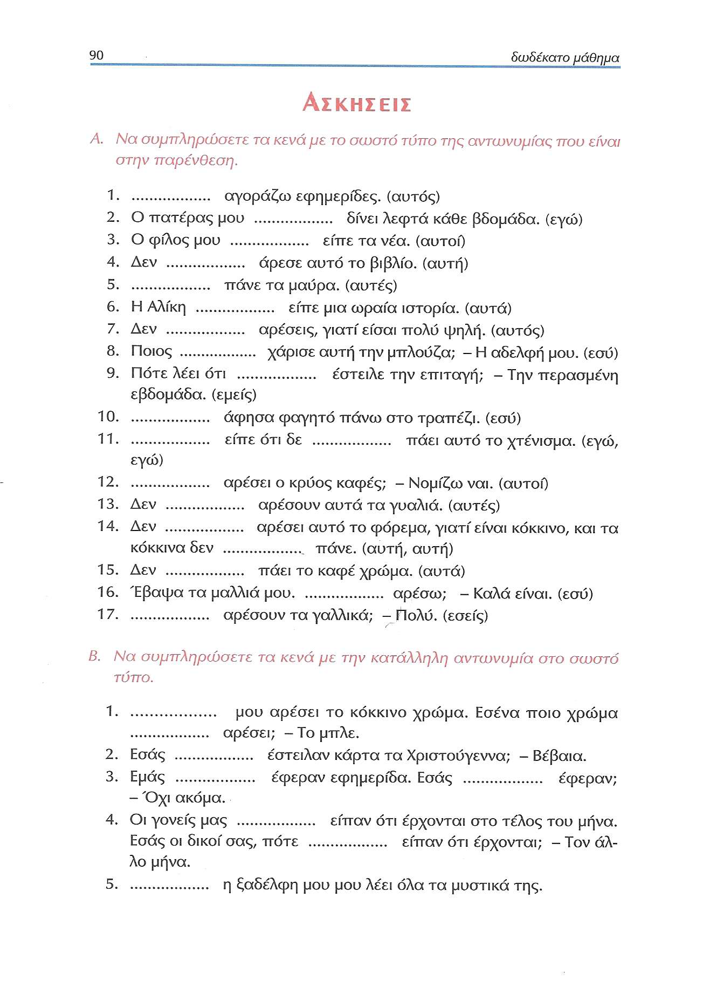

# Lección 12

---

## 82: 'Στην αγορά'

<audio controls="controls">
  <source type="audio/mpeg" src="../GM_Audios/12_Sten_agora.mp3"></source>
</audio>

---

---

## 83: Elisión/genitivo posesivo/indirecto

---

## 84: Objeto (in)directo

---

## 85: Objeto (in)directo

---

## 86: OI/reduplicación de clítico

---

## 87: Elisión en preposiciones

---

## 88: Adverbios/diálogo/μ᾽αρέσει

---

## 89: μ'αρέσι/μου πάει

---

## 90: Ejercicios

---

## 91: Ejercicios

---

---

## 92: Expresiones idiomáticas

