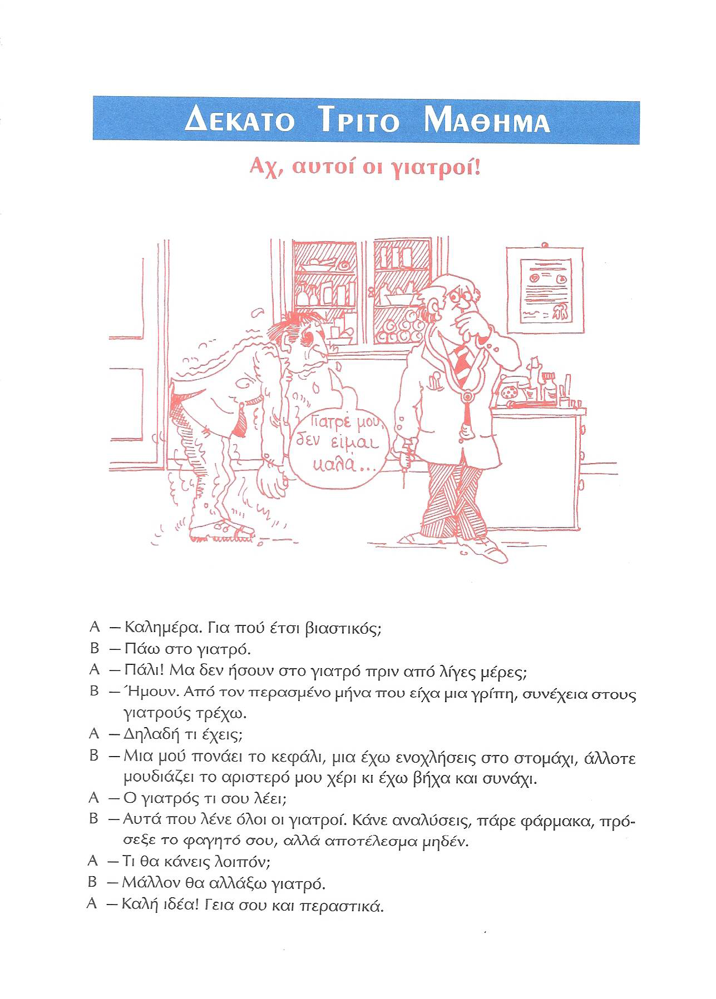
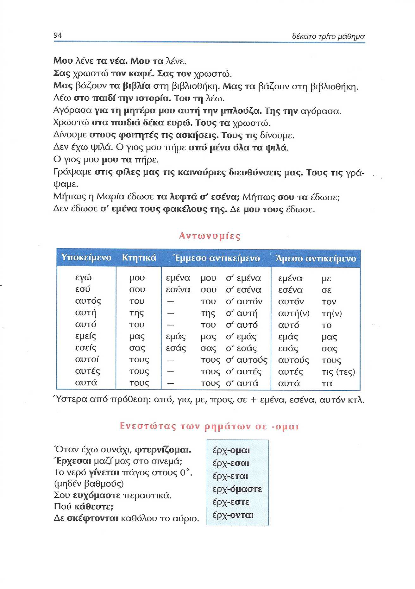
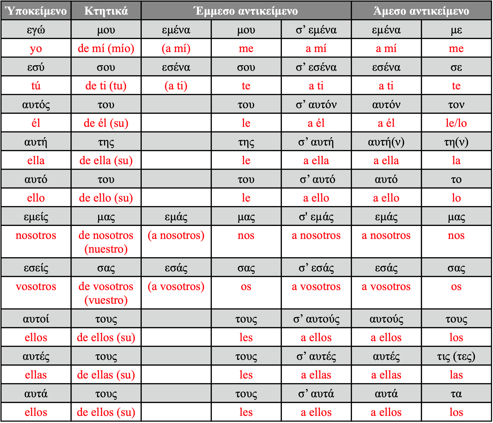
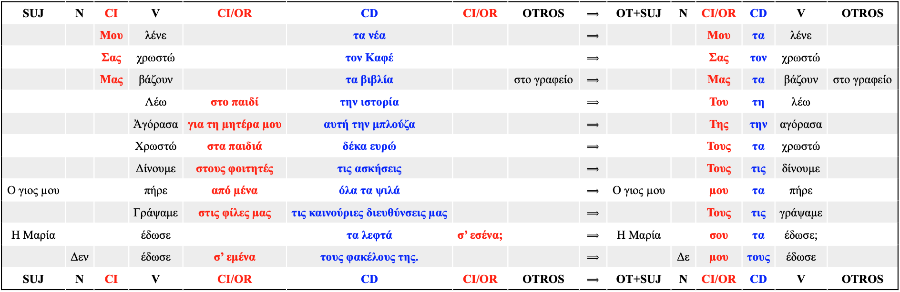
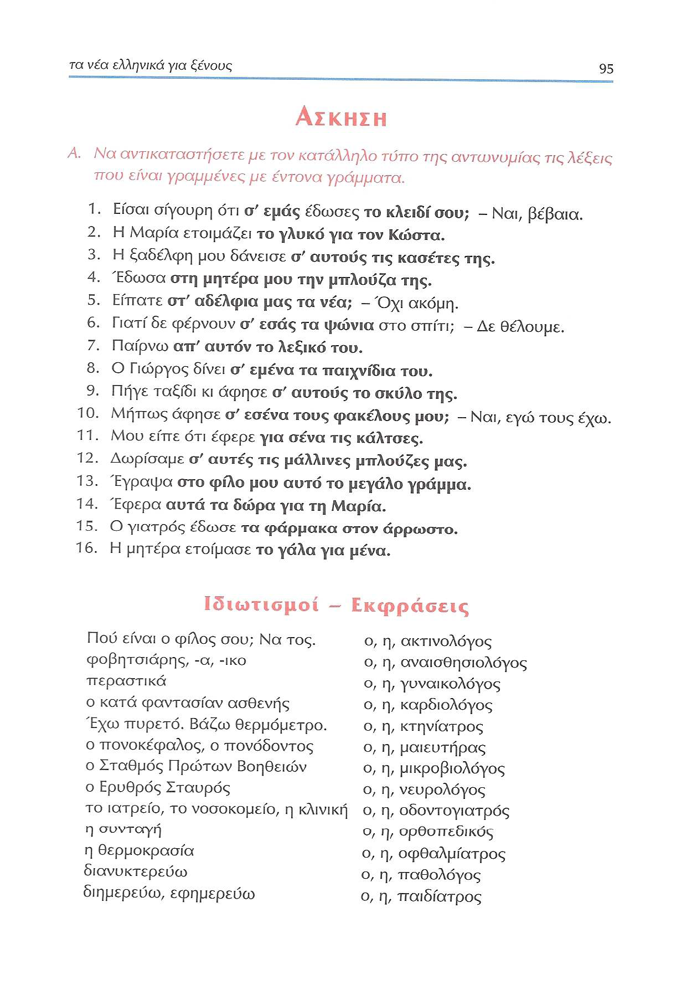
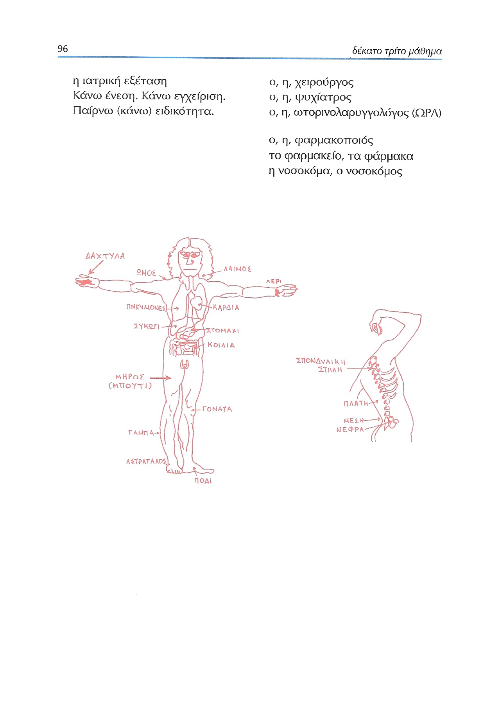

# Lección 13

---

## 93: 'Αχ, αυτοί οι γιατροί!' (audio)

<audio controls="controls" style="width: 100%;">
  <source type="audio/mpeg" src="../GM_Audios/13_Akh_avtoi_hoi_giatroi.mp3"></source>
</audio>

---

## 93: 'Αχ, αυτοί οι γιατροί!' (texto)

---

## 94: Pronombres personales (CD/CI)/έρχομαι

### Pronombres pesonales: nom., ac. y gen.

### Pronombres clíticos

---

## 95: Ejercicios/expresiones idiomáticas

---

## 96: Expresiones idiomáticas

