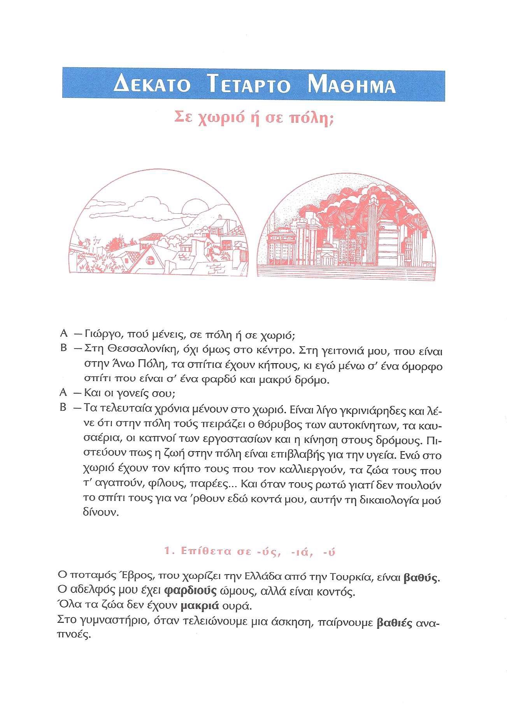
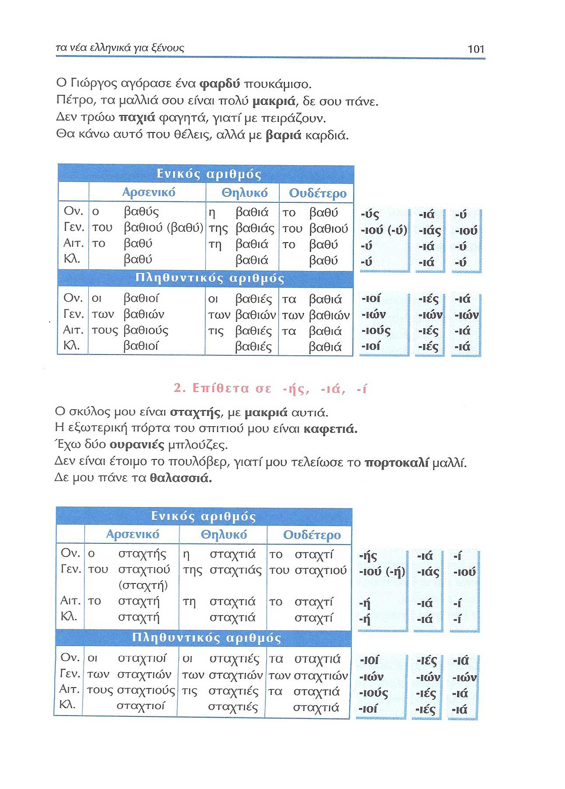
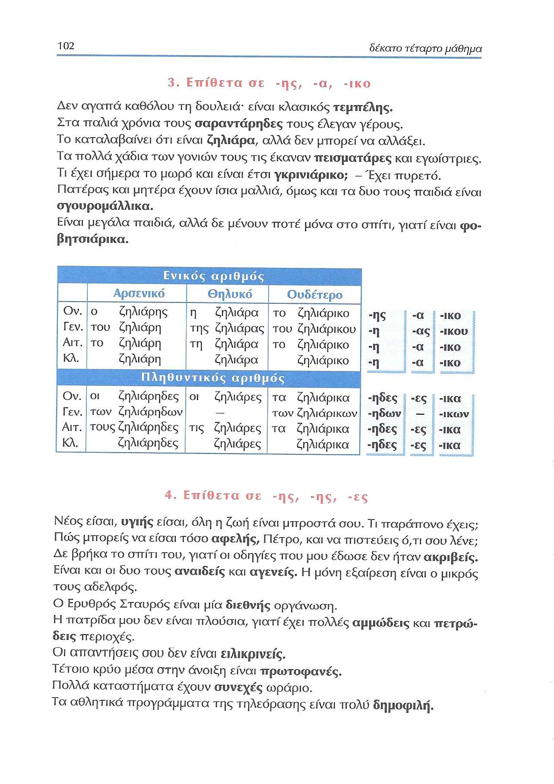
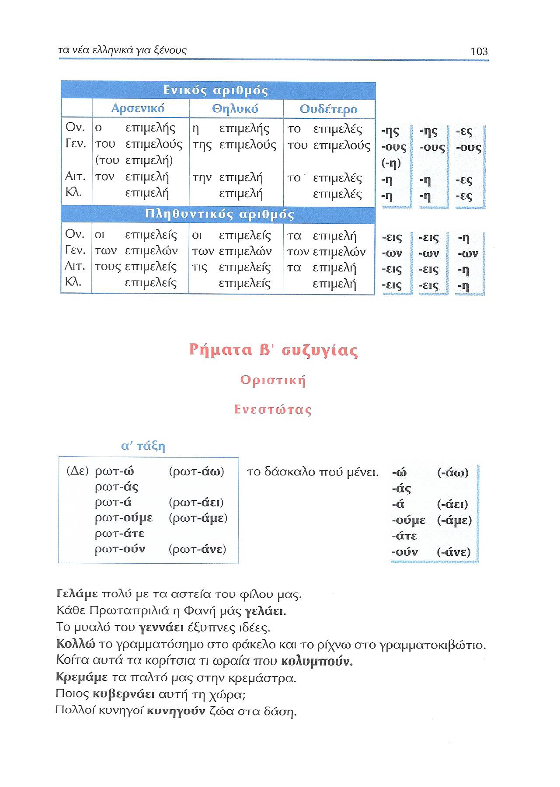
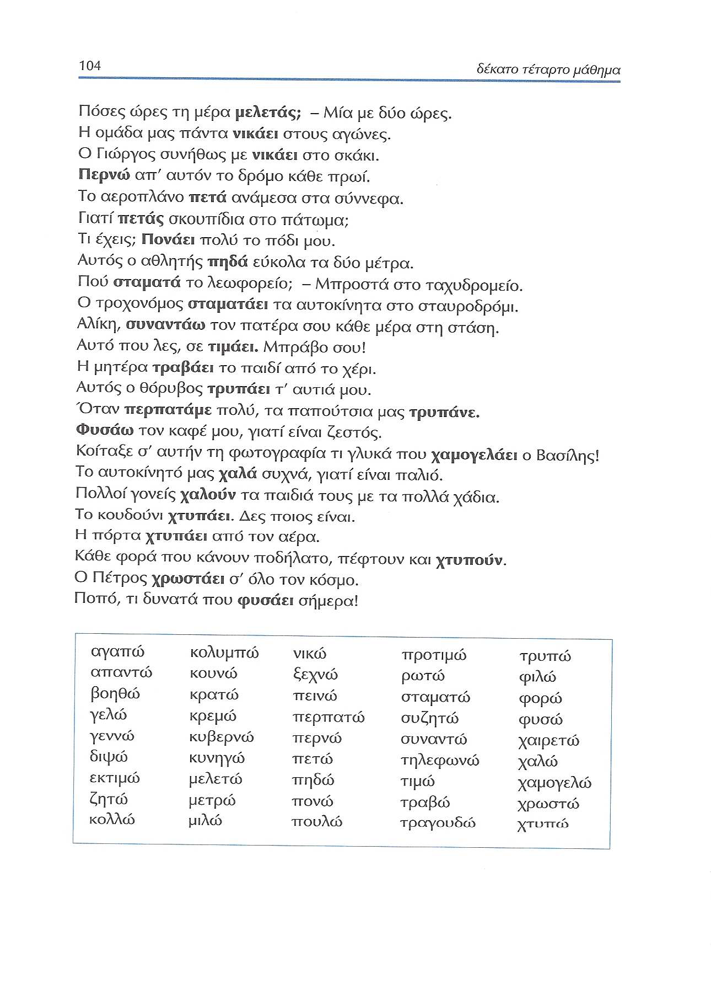
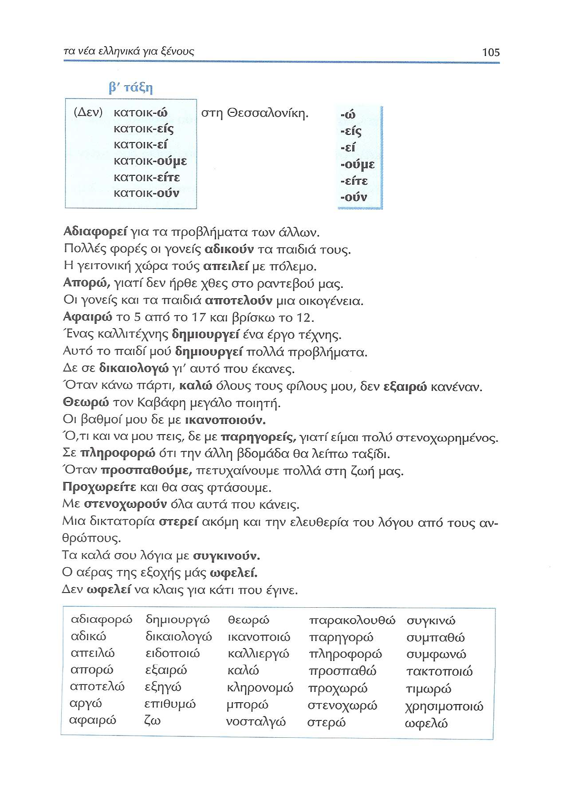
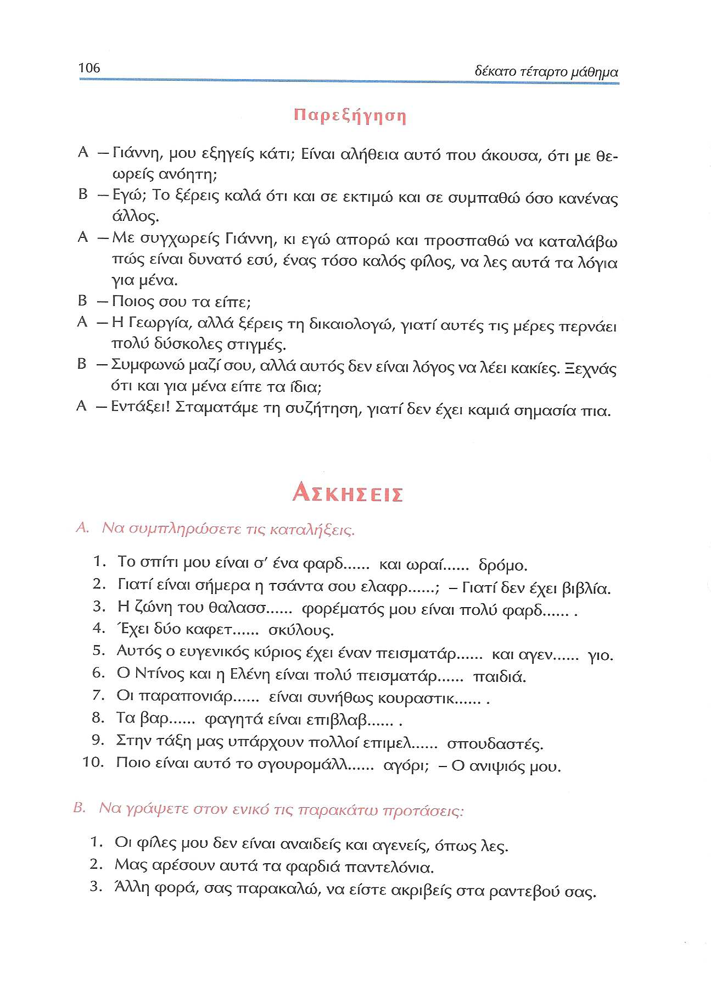
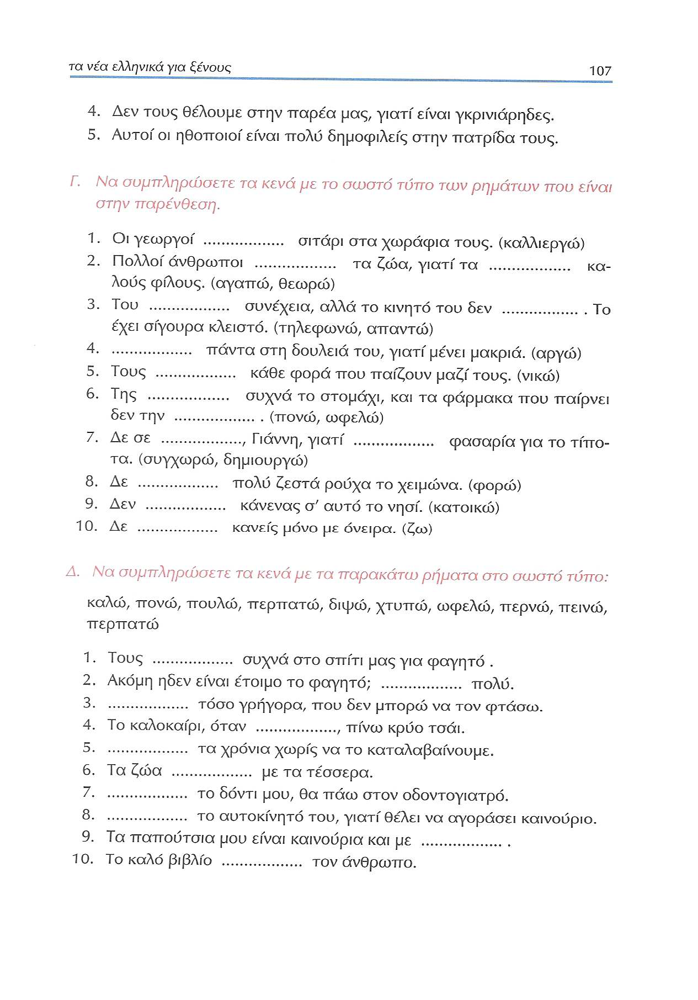
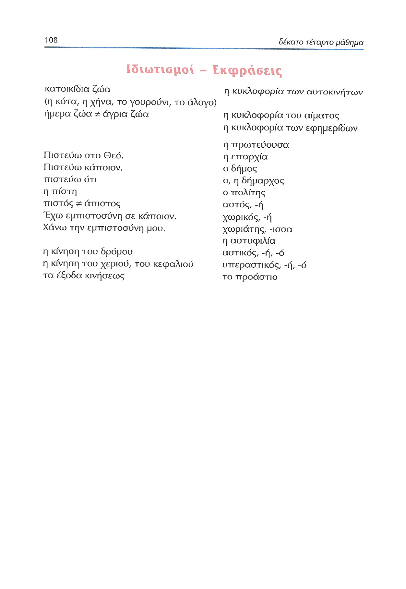

# Lección 14

---

## 93: 'Σε χωριό ή σε πόλη;' (audio)

<audio controls="controls">
  <source type="audio/mpeg" src="../GM_Audios/14_Se_khorio_e_se_poli.mp3"></source>
</audio>

---

## 100: 'Σε χωριό ή σε πόλη;' (texto)

---

## 101 βαθύς, ιά ύ/σταχτής ιά ί

---

## 102 ζηλιάρης α ικο/επιμελής ής ές

---

## 103 επιμελής ής ές/ρωτάω, άς

---

## 104 ρωτάω, άς

---

## 105 κατοικώ, είς

---

## 106 Παρεξήγηση/ασκήσεις

<audio controls="controls">
  <source type="audio/mpeg" src="../GM_Audios/14_Se_khorio_e_se_poli.mp3"></source>
</audio>

---

## 107 Ασκήσεις

---

## 108 Ιδιωτισμοί - Εκφράσεις

