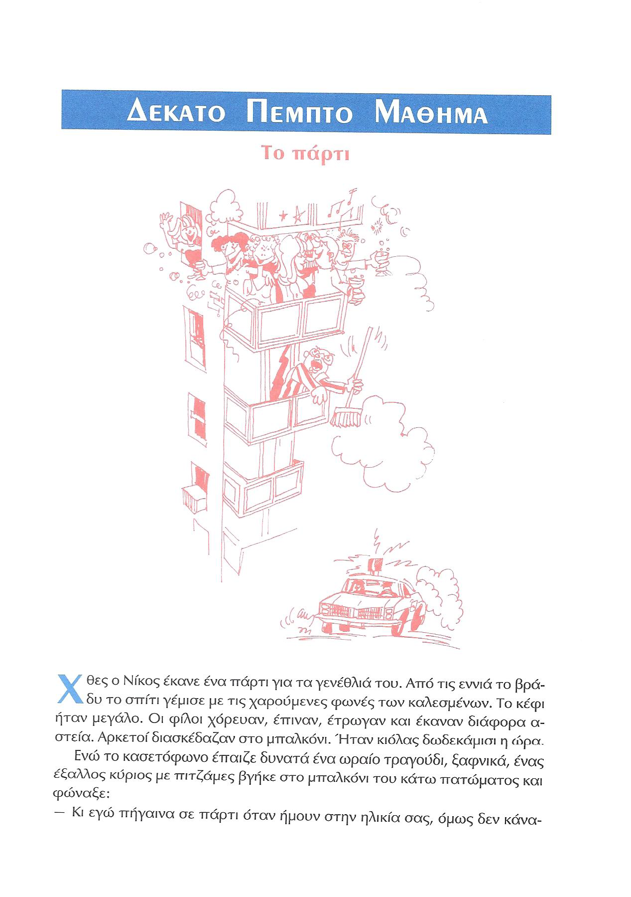
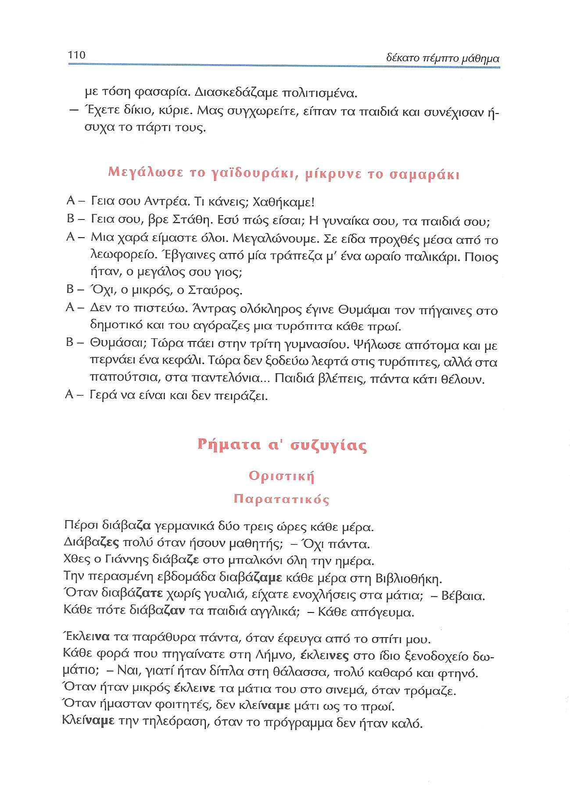
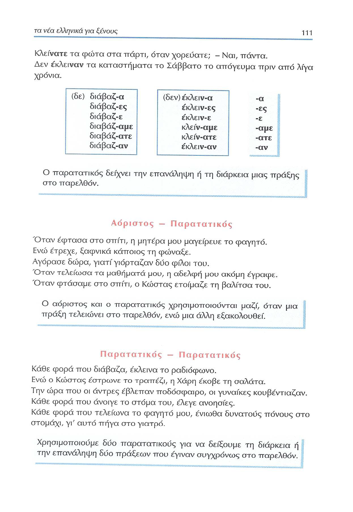
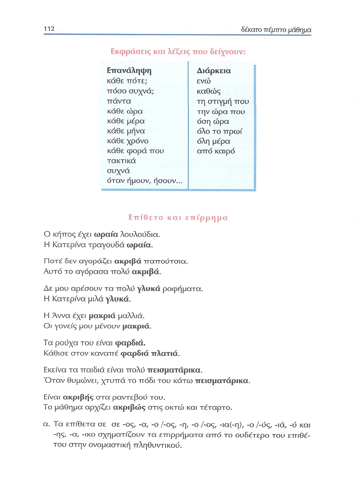
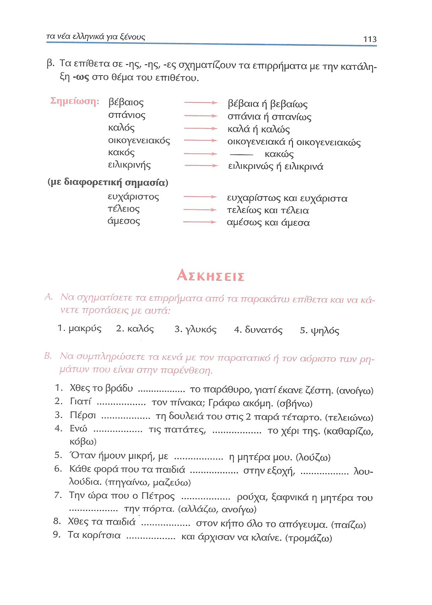
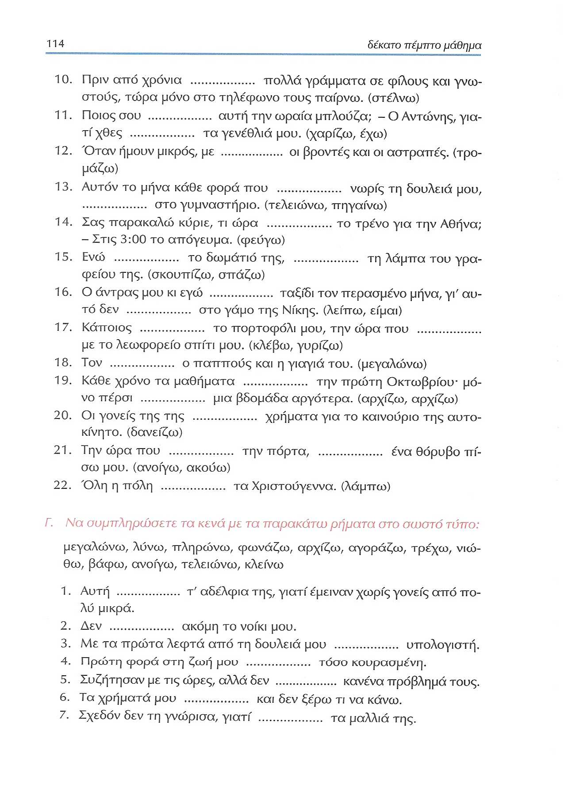
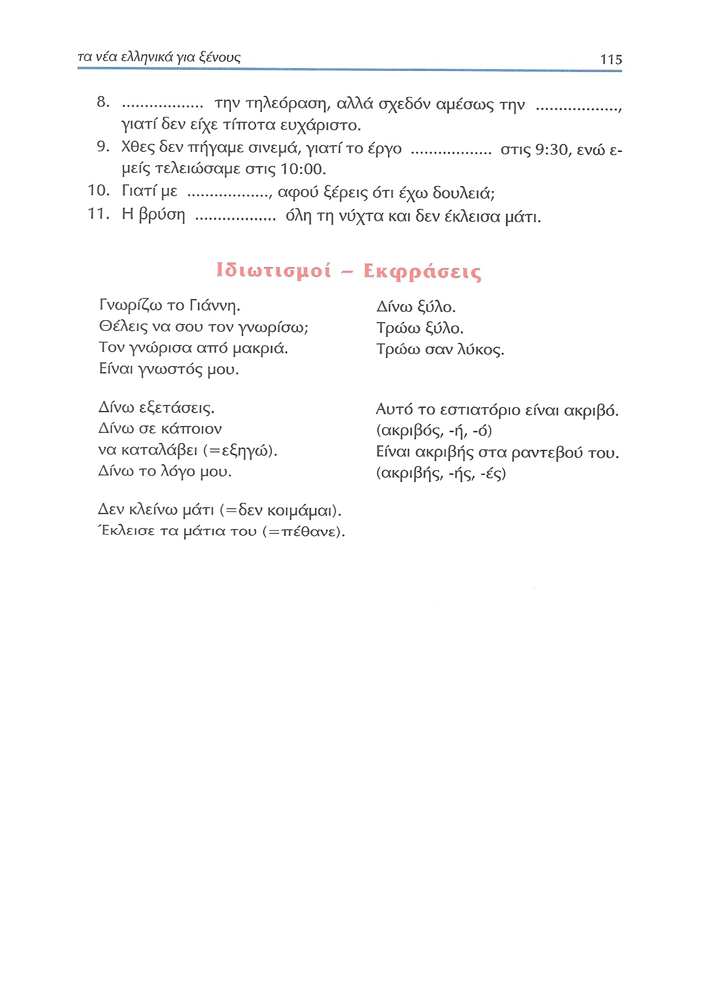

# Lección 15

---

## 109: 'Το πάρτι' (audio)

<audio controls="controls">
  <source type="audio/mpeg" src="../GM_Audios/15_To_party.mp3"></source>
</audio>

---

## 109: 'Το πάρτι' (texto)

---

## 110 'Μεγάλωσε το γαιδουράκι, μίκρυνε το σαμαράκι'

---

## 111 Παρατατικός (imperfecto)

---

## 112 Επανάληψη/διάρκεια, επιθετα/επιρρήματα

---

## 113 Επιθετα/επιρρήματα, ασκήσεις

---

## 114 Ασκήσεις

---

## 115 Ασκήσεις, ιδιωτισμοί-εκφράσεις

