# Lección 16

---

## 116: 'Ένα ζευγάρι ετοιμάζει το σπίτι τους' (audio)

<audio controls="controls">
  <source type="audio/mpeg" src="../GM_Audios/16_Hena_zevgari_hetoimazei_to_spiti_tou.mp3"></source>
</audio>

---

## 116: 'Ένα ζευγάρι ετοιμάζει το σπίτι τους' (texto)

<audio controls="controls">
  <source type="audio/mpeg" src="../GM_Audios/16_Hena_zevgari_hetoimazei_to_spiti_tou.mp3"></source>
</audio>

Ένα ζευγάρι ετοιμάζει το σπίτι του

Ο Στέφανος και η Χριστίνα παντρεύονται και γι' αυτό χτίζουν σπίτι. Το σπίτι τους **θα έχει** δύο κρεβατοκάμαρες, μια σαλοτραπεζαρία, μια κουζίνα, μπάνιο και ένα  πρόχειρο δωμάτιο. **Θα τελειώσει** σε έξι μήνες. Όμως, άρχισαν κιόλας **να αγοράζουν** τα έπιπλα. Της Χριστίνας της αρέσει **να τριγυρίζει** στα μικρά μαγαζιά κοι **να ψάχνει** για παλιά τραπέζια, καρέκλες, κομοδίνα. Πιστεύει ότι αυτά δίνουν χρώμα και προσωπικότητα σ' ένα σπίτι. Θέλει **να** το **επιπλώσει** **μόνη της**, με το προσωπτικό της γούστο. Αύριο **θα πάνε** μαζί με το Στέφανο σ' ένα παλαιοπωλείο **να διαλέξουν** μερικά κομμάτια. Είναι πραγματική απόλαυση **να αγοράζει** κανείς πράγματα για το σπίτι του. Και ο Στέφανος και η Χριστίνα, κάθε φορά που ψωνίζουν κάτι, κάνουν σαν μικρά παιδιά από τη χαρά τους.

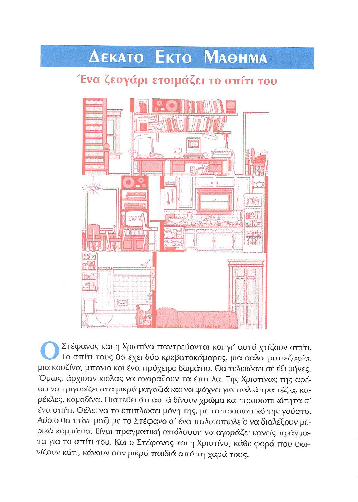

<audio controls="controls">
  <source type="audio/mpeg" src="../GM_Audios/16_Hena_zevgari_hetoimazei_to_spiti_tou.mp3"></source>
</audio>

---

## 117: 'Οι πρώτες δυσκολίες' (texto)/Μέλλοντας 

<audio controls="controls">
  <source type="audio/mpeg" src="../GM_Audios/16_Hena_zevgari_hetoimazei_to_spiti_tou.mp3"></source>
</audio>

Οι πρώτες δυσκολίες

Α —Αλίκη, οι μέρες περνούν, ο γάμος πλησιάζει και νομίζω ότι **πρέπει να αποφασίσουμε** τι μας είναι εντελώς απαραίτητο και τι **μπορούμε να αγοράσουμε** αργότερα.

Β —Ένα λεπτό, **να τελειώσω** τη δουλειά μου κι έρχομαι.

Α —Λοιπόν, άκου τι λέω. Προς το παρόν **να μην αγοράσουμε** τίποτα για τη σαλοτραπεζαρία. **Θα φέρω** εγώ το γραφείο μου, **θα φέρεις** εσύ τη βιβλιοθήκη σου, και με δύο τρία μαξιλάρια στο πάτωμα **θα είμαστε** εντάξει.

Β —Ο θείος Πέτρος ρωτάει, τι δώρο **θέλουμε να** μας **κάνει**.

Α —**Πες** του **να μας πάρει** μια λάμπα για το γραφείο, **για να δουλεύουμε** πιο άνετα.

Β —Για την κρεβατοκάμαρα ένα διπλό κρεβάτι φτάνει.

Α —Σύμφωνοι. Μένει η κουζίνα. Θέλουμε οπωσδήποτε ψυγείο και ηλεκτρική κουζίνα.

Β —Και πλυντήριο για τα ρούχα. Δεν **μπορώ να πλένω** στο χέρι.

Α —Καμία αντίρρηση. **Ελπίζω** μόνο **να μας φτάσουν** τα λεφτά.

Β —Ε, στην ανάγκη υπάρχουν και οι δόσεις και οι πιστωτικές κάρτες.

<audio controls="controls">
  <source type="audio/mpeg" src="../GM_Audios/16_Hena_zevgari_hetoimazei_to_spiti_tou.mp3"></source>
</audio>

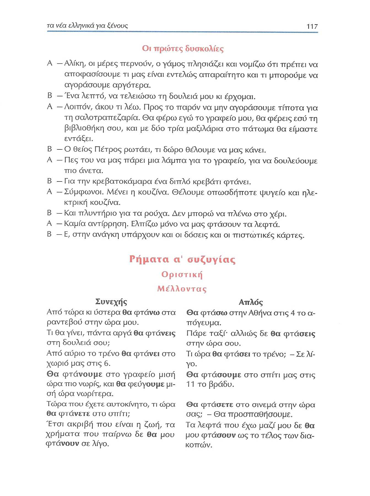

---

## 118 Μέλλοντας

### Παραδείγματα

|Συνεχής|Απλός|
|:---:|:---:|
|<ins>Από τώρα κι ύστερα</ins> **θα φτάνω** στα ραντεβού στην ώρα μου.|**Θα φτάσω** στην Αθήνα στις 4 το απόγευμα.|
|Τι θα γίνει, <ins>πάντα</ins> αργά **θα φτάνεις** στη δουλειά σου;|Πάρε ταξί αλλιώς δε **θα φτάσεις** στην ώρα σου.|
|<ins>Από αύριο</ins> το τρένο **θα φτάνει** στο χωριό μας στις 6.|— Τι ώρα **θα φτάσει** το τρένο; —Σε λίγο.|
|**Θα φτάνουμε** στο γραφείο μισή ώρα πιο νωρίς, και **θα φεύγουμε** μισή ώρα νωρίτερα.|**Θα φτάσουμε** στο σπίτι μας στις 11 το βράδυ.|
|<ins>Τώρα που έχετε αυτοκίνητο</ins>, τι ώρα **θα φτάνετε** στο σπίτι;|— **Θα φτάσετε** στο σινεμά στην ώρα σας; — **Θα προσπαθήσουμε**.|
|Έτσι ακριβή που είναι η ζωή, τα χρήματα που παίρνω δε **θα** μου **φτάνουν** σε λίγο.|Τα λεφτά που έχω μαζί μου δε **θα** μου **φτάσουν** <ins>ως το τέλος των διακοπών</ins>.|
|<ins>Από αύριο</ins> **θα δουλεύω** στο γραφείο του πατέρα μου.|<ins>Αύριο</ins> **θα δουλέψω** στο γραφείο του πατέρα μου.|
|— <ins>Τώρα που έχεις κινητό</ins>, **θα** μας **στέλνεις** μηνύματα; — Βέβαια.|— **Θα στείλεις** τώρα μήνυμα στο Σταύρο; — Όχι τώρα.|
|Ο καθηγητής **θα εξετάζει** αύριο <ins>όλο το πρωί</ins>.|Ο καθηγητής **θα εξετάσει** αύριο μόνο <ins>μία ώρα</ins>.|
|**Θα λείπουμε** από το σπίτι μας <ins>όλο το καλοκαίρι</ins>.|**Θα λείψουμμε** από το σπίτι μας <ins>την άλλη Κυριακή</ins>.|
|Τι μικρή κουζίνα! Πώς **θα μαγειρεύετε** εδώ;|— Δε **θα μαγειρέψετε** <ins>σήμερα</ins>; — Όχι, **θα φάμε** έξω.|
|— **Θα παίζουν** αυτό το έργο <ins>όλη τη βδομάδα</ins>; — Μόνο ὡς την Πέμπτη.|— **Θα παίξουν** <ins>ξανά</ins> αυτό το έργο; — Ίσως.|

### Κλίση

Από το θέμα του **ενεστώτα** σχηματίζουμε τους **συνεχείς χρόνους**.
Από το θέμα του **αορίστου** σχηματίζουμε τους **απλούς χρόνους**.

|(δε +) θα+ θέμα ενεστώτα φτά**ν**ω|(δε+) θα+θέμα αορίστου έ-φτα**σ**α| Κατάληξη|
|:---:|:---:|  :---:|
|(δε) θα φτά**ν**-ω|(δε) θα φτά**σ**-ω|  -ω|  
|(δε) θα φτά**ν**-εις|(δε) θα φτά**σ**-εις|  -εις|  
|(δε) θα φτά**ν**-ει|(δε) θα φτά**σ**-ει|  -ει|  
|(δε) θα φτά**ν**-ουμε|(δε) θα φτά**σ**-ουμε|  -ουμε|  
|(δε) θα φτά**ν**-ετε|(δε) θα φτά**σ**-ετε|  -ετε|  
|(δε) θα φτά**ν**-ουν|(δε) θα φτά**σ**-ουν|  -ουν|  

### Χρήση

| Συνεχής | Απλός |
| :---: | :---: |
| Ο συνεχής μέλλοντας δείχνει τη **διάρκεια** ή την **επανάληψη** μιας πράξης στο μέλλον. | Ο απλός μέλλοντας δείχνει ότι μια πράξη **θα γίνει** και **θα τελειώσει** στο μέλλον και παρουσιάζει την πράξη στο **σύνολό** της, συνοπτικά, σαν να ολοκληρώνεται σε **μια στιγμή**. |

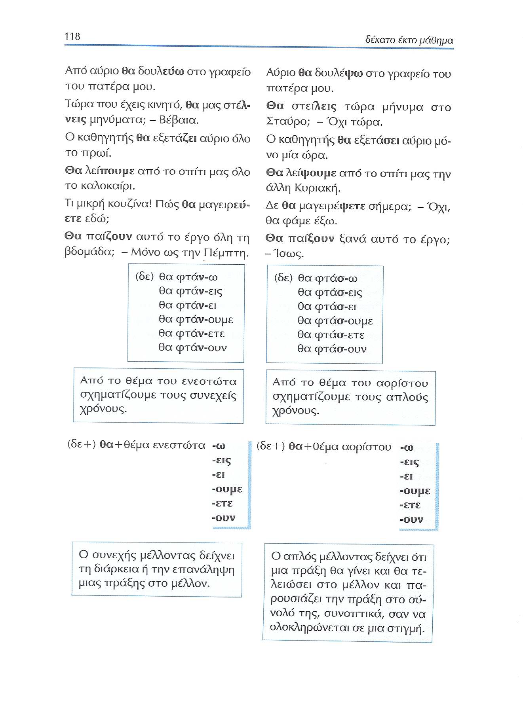

---

### 119 Μέλλοντας με αντικείμενα αντωνυμίες

|Παράδειγμα|Suj|Neg|Θα|OI|OD|Verbo|OI|OD|
|---|:---:|:---:|:---:|:---:|:---:|:---:|:---:|:---:|
|**1a** Θα επιτλώσουμε το σαλόνι μας|  |(δε)|Θα|  |  |επιτλώσουμε|  |το σαλόνι μας|
|**1b** Θα το επιπλώσουμε|  |(δε)|Θα|  |το|επιπλώσουμε|  |  |
|**2a** Θα βάψετε την πόρτα σας;|  |(δε)|Θα|  |  |βάψετε|  |την πόρτα σας;|
|**2b** Θα τη βάψετε;|  |(δε)|Θα|  |τη|βάψετε|  |  |
|**3a** Τα παιδιά θα φέρουν τις φωτογραφίες.|Τα παιδιά|(δε)|θα|  |  |φέρουν|  |τις φωτογραφίες.|
|**3b** Θα τις φέρουν.|Τα παιδιά|(δε)|θα|  |τις|φέρουν|  |  |
|**4a** Θα γράψω στους φίλους μου τη διεύθυνσή μου.|  |(δε)|Θα|  |  |γράψω|στους φίλους μου|τη διεύθυνσή μου.|
|**4b** Θα τους γράψω τη διεύθυνσή μου.|  |(δε)|Θα|τους|  |γράψω|  |τη διεύθυνσή μου.|
|**4c** Θα τους τη γράψω.|  |(δε)|Θα|τους|τη|γράψω|  |  |
|**5a** Θα αγοράσεις στη Μαρία τα παπούτσια;|  |(δε)|Θα|  |  |αγοράσεις|στη Μαρία|τα παπούτσια;|
|**5b** Θα αγοράσεις τα παπούτσια;|  |(δε)|Θα|της|  |αγοράσεις|  |τα παπούτσια;|
|**5c** Θα της τα αγοράσεις;|  |(δε)|Θα|της|τα|αγοράσεις|  |  |
|**6a** Η Ελένη θα διαβάσει στον παππού της τα νέα.|Η Ελένη|(δε)|θα|  |  |διαβάσει|στον παππού της|τα νέα.|
|**6b** Η Ελένη θα του διαβάσει τα νέα.|Η Ελένη|(δε)|θα|του|  |διαβάσει|  |τα νέα.|
|**6c** Η Ελένη θα του τα διαβάσει.|Η Ελένη|(δε)|θα|του|τα|διαβάσει|  |  |

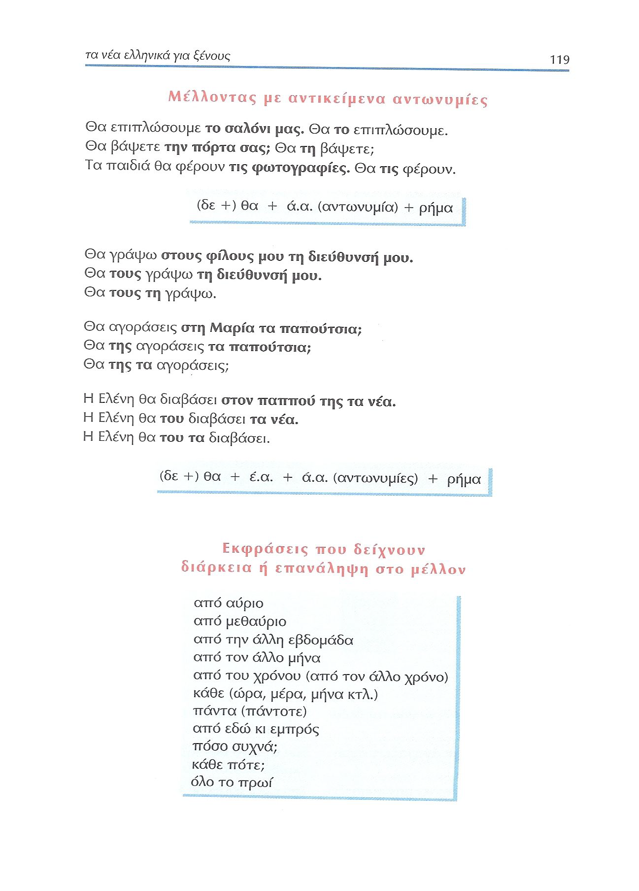

---

### Εκφράσεις διάρκειας ή επανάληψης

Εκφράσεις που δείχνουν διάρκεια ή επανάληψη στο μέλλον:

- από αύριο
- από μεθαύριο
- από την άλλη εβδομάδα
- από τον άλλο μήνα
- από του χρόνου (από τον άλλο χρόνο)
- κάθε (ώρα, μέρα, μήνα κτλ.)
- πάντα (πάντοτε)
- από εδώ κι εμπρός
- πόσο συχνά;
- κάθε πότε;
- όλο το πρωί

---

## 120 Υποτακτική

### Παραδείγματα2

|Συνεχής|Απλή|
|:---:|:---:|
|Οι εξετάσεις θα είναι δύσκολες. <ins>Πρέπει</ins> **να διαβάζω** πολύ.|Μού <ins>είπαν</ins> **να διαβάσω** αυτό το άρθρο για την οικονομία.|
|<ins>Πρέπει</ins> **να διαβάζεις** και κανένα βιβλίο, όχι μόνο περιοδικά.| <ins>Πρέπει</ins> **να διαβάσεις** νωρίς, για να πάμε σινεμά.|
| <ins>Θέλει</ins> **να διαβάζει** πάντα πρώτος την εφημερίδα.| <ins>Θέλει</ins> **να διαβάσει** πρώτος την εφημερίδα.|
| Πάντα μας <ins>αρέσει</ins> **να διαβάζουμε** πολλά βιβλία, αλλά δεν έχουμε καιρό.|<ins>Θέλουμε</ins> **να διαβάσουμε** πολλά βιβλία αυτό το καλοκαίρι.|
|— <ins>Έχετε καιρό</ins>^1^ **να διαβάζετε** εφημερίδα κάθε πρωί; — Όχι.|— <ins>Έχετε καιρό</ins>^1^ **να διαβάσετε** την εφημερίδα τώρα; —Όχι.|
|Τα παιδιά <ins>πρέπει</ins> **να διαβάζουν** και εξωσχολικά βιβλία.|Τα παιδιά <ins>πρέπει</ins> **να διαβάσουν** αυτό το ωραίο βιβλίο οπωσδήποτε.|

^1^<ins>Έχω (πολύ/λίγο)καιρό</ins> **να κάνω** κάτι 'hace (mucho/poco) tiempo que **no** hago algo'

### Κλίση2

|να + θέμα ενεστώτα διαβά**ζ**-ω|να + θέμα αορίστου διαβά**σ**-α|Κλίση|
|:---:|:---:|:---:|
|να διαβά**ζ**-ω|να διαβά**σ**-ω|-ω|
|να διαβά**ζ**-εις|να διαβά**σ**-εις|-εις|
|να διαβά**ζ**-ει|να διαβά**σ**-ει|ω|
|να διαβά**ζ**-ουμε|να διαβά**σ**-ουμε|-ουμε|
|να διαβά**ζ**-ετε|να διαβά**σ**-ετε|-ετε|
|να διαβά**ζ**-ουν|να διαβά**σ**-ουν|-ουν|

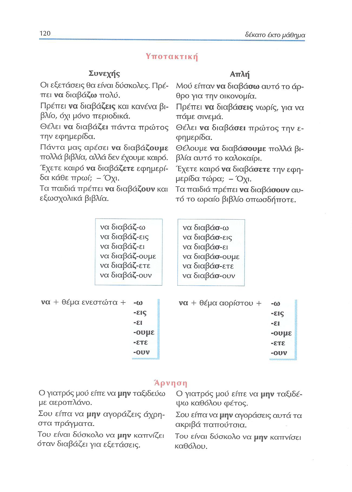

---

### 120-121 Άρνηση

|Συνεχής|Απλός|
|:---:|:---:|
|Ο γιατρός μού είπε <ins>να **μην** ταξιδεύω</ins> με αεροπλάνο.|Ο γιατρός μού είπε <ins>να **μην** τοαξιδέψω</ins> καθόλου φέτος.|
|Σου είπα <ins>να **μην** αγοράζεις</ins> άχρηστα πράγματα.|Σου είπα <ins>να **μην** αγοράσεις</ins> αυτά τα ακριβά παπούτσια.|
|Του είναι δύσκολο <ins>να **μην** καπνίζει</ins> όταν διαβάζει για εξετάσεις.|Του είναι δύσκολο <ins>να **μην** καπνίσει</ins> καθόλου.|
|Ο γιατρός μάς είπε <ins>να **μην** ταξιδεύουμε</ins> με αεροπλάνο.|Ο γιατρός μάς είπε <ins>να **μην** ταξιδέψουμμε</ins> ξανά με αεροπλάνο.|
|Σας είπα <ins>να **μην** αγοράζετε</ins> άχρηστα πράγματα.|Σας είπα <ins>να **μην** αγοράσετε</ins> αυτά τα ακριβά παπούτσια.|
|Τους είναι δύσκολο <ins>να **μην** καπνίζουν</ins> όταν διαβάζουν για εξετάσεις.|Τους είναι δύσκολο <ins>να **μην** καπνίσουν</ins> καθόλου.|

|να + **μη(ν)** + θέμα ενεστώτα διαβά**ζ**-ω|να + **μη(ν)** + θέμα αορίστου διαβά**σ**-α|Κλίση|
|:---:|:---:|:---:|
|να **μη** διαβά**ζ**-ω|να **μη** διαβά**σ**-ω|-ω|
|να **μη** διαβά**ζ**-εις|να **μη** διαβά**σ**-εις|-εις|
|να **μη** διαβά**ζ**-ει|να **μη** διαβά**σ**-ει|ω|
|να **μη** διαβά**ζ**-ουμε|να **μη** διαβά**σ**-ουμε|-ουμε|
|να **μη** διαβά**ζ**-ετε|να **μη** διαβά**σ**-ετε|-ετε|
|να **μη** διαβά**ζ**-ουν|να **μη** διαβά**σ**-ουν|-ουν|

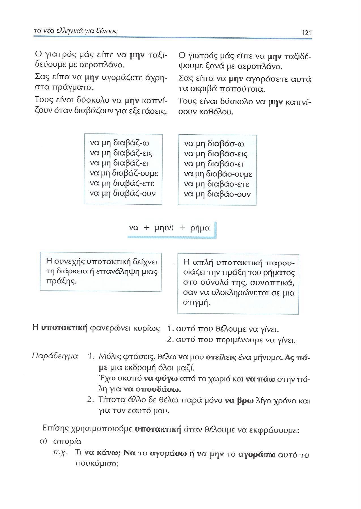

---

### 121-122 Χρήση

#### Άποψη (aspecto)

|συνεχής υποτακτική| απλή υποτακτική |
| :---:|:---: |
|Ἡ συνεχής υποτακτική δείχνει τη **διάρκεια** ή **επανάληψη** μιας πράξης.| Η απλή υποτακτική παρουσιάζει την πράξη του ρήματος στο **σύνολό** της, **συνοπτικά**, σαν να ολοκληρώνεται σε **μια στιγμή**.|

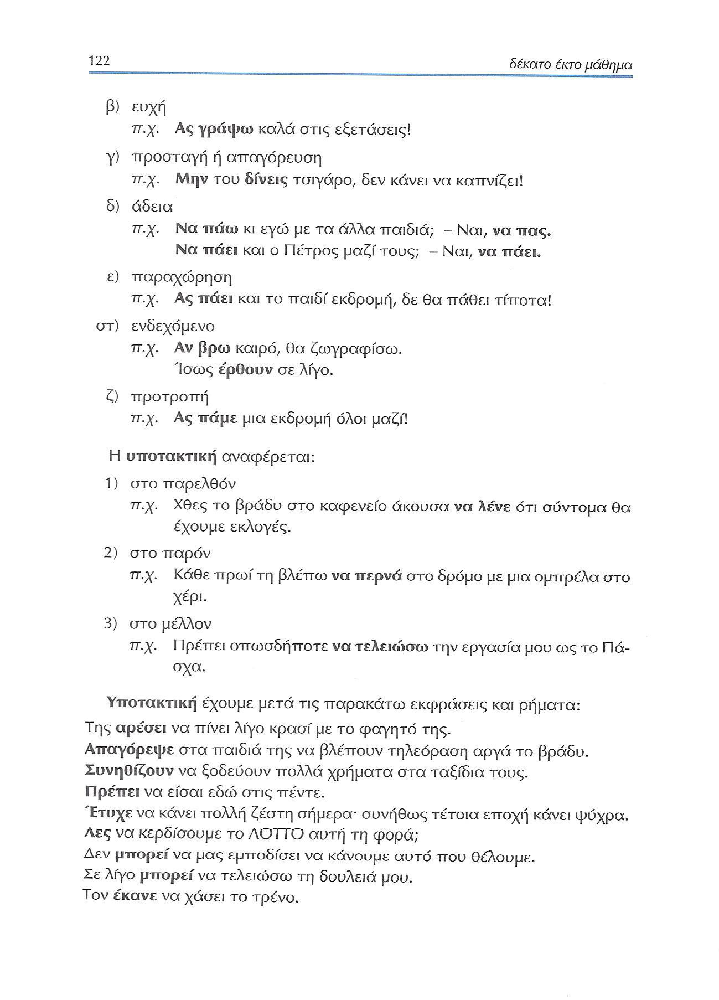

#### Σήμασία

|Σημασία|Παράδειγμα|
|:---|:---|
|1. αυτό που **θέλουμε** να γίνει.|1. Μόλις φτάσεις, <ins>θέλω **να** μου **στείλεις**</ins> ένα μήνυμα. 'En cuanto llegues, quiero que me envíes un mensaje' |
|  | <ins>Ας **πάμε**</ins> μια εκδρομή όλοι μαζί. Vayamos de excursión todos juntos|
|  | <ins>Έχω σκοπό **να φύγω**</ins> από το χωριό και <ins>**να πάω**</ins> στην πόλη για να σπουδάσω. 'Tengo intención de irme del pueblo e ir a la ciudad para estudiar'|
|2. αυτό που **περιμένουμε** να γίνει.|Τίπτοτα άλλο δε <ins>θέλω παρά μόνο **να βρω**</ins> λίγο χρόνο και για τον εαυτό μου. 'No quiero nada más que encontrar un poco de tiempo también para mí mismo'|
|(α) **απορία** duda|<ins>Τι **να κάνω**;</ins> <ins>**Να** το **αγοράσω**</ins> ή <ins>να μην το αγοράσω</ins> αυτό το πουκάμισο; ¿Qué debo hacer? ¿Debo comprar o no debo comprar esta camisa?|
|(β) **ευχή** deseo|<ins>Ας **γράψω**</ins> καλά στις εξετάσεις! ¡(Ojalá) que haga bien los exámenes!|
|(γ) **προσταγή ή απαγόρευση** orden|<ins>Μην του **δίνεις**</ins> τσιγάρο, δεν κάνει <ins>**να καπνίζει**!</ins> 'No le des cigarrillo, no está bien que fume'|
|(δ) **άδεια** permiso|— **Να πάω** κι εγώ με τα άλλα παιδιά; —Ναι, **να πας**. '— ¿Puedo ir yo también con los otros niños? — Sí, puedes ir.'|
|  |— <ins>**Να πάει**</ins> και ο Πέτρος μαζί τους; — Ναι, <ins>**να πάει**</ins>. '— ¿Puede ir también Pedro con ellos? — Sí, que vaya.'|
|(ε) **παραχώρηση** concesión|<ins>Ας **πάει**</ins> και το παιδί εκδρομή, δε θα πάθει τίποτα! '¡Que vaya también el niño de excursión, no le va a pasar nada!'|
|(στ) **ενδεχόμενο** posibilidad|<ins>Αν **βρω**</ins> καιρό, θα ζωγραφίσω. Si encuentro tiempo, dibujaré.|
|  |<ins>Ίσως **έρθουν**</ins> σε λίγο. 'Quizá vengan dentro de poco'|
|(ζ) **προτροπή** exhortación|<ins>Ας **πάμε**</ins> μια εκδρομή όλοι μαζί 'Vayamos de excursión todos juntos'|

|Combinación |Σημασία|Παράδειγμα|
|:---|:---|:---|
| να+Subj subordinado OD|1. αυτό που **θέλουμε** να γίνει.|1. Μόλις φτάσεις, <ins>θέλω **να** μου **στείλεις**</ins> ένα μήνυμα. 'En cuanto llegues, quiero que me envíes un mensaje' |
| να+Subj subordinado|2. αυτό που **περιμένουμε** να γίνει.|Τίπτοτα άλλο δε <ins>θέλω παρά μόνο **να βρω**</ins> λίγο χρόνο και για τον εαυτό μου. 'No quiero nada más que encontrar un poco de tiempo también para mí mismo'|
| να+Subj subordinado CN|  | <ins>Έχω σκοπό **να φύγω**</ins> από το χωριό και <ins>**να πάω**</ins> στην πόλη για να σπουδάσω. 'Tengo intención de irme del pueblo e ir a la ciudad para estudiar'|
| για να+Subj Final|  | <ins>Έχω σκοπό **να φύγω**</ins> από το χωριό και <ins>**να πάω**</ins> στην πόλη **για να** σπουδάσω. 'Tengo intención de irme del pueblo e ir a la ciudad para estudiar'|
| να+Subj principal Interrogativa 1ªpers.|(α) **απορία** duda|<ins>Τι **να κάνω**;</ins> <ins>**Να** το **αγοράσω**</ins> ή <ins>να μην το αγοράσω</ins> αυτό το πουκάμισο; ¿Qué debo hacer? ¿Debo comprar o no debo comprar esta camisa?|
| να+Subj Principal|(δ) **άδεια** permiso|— **Να πάω** κι εγώ με τα άλλα παιδιά; —Ναι, **να πας**. '— ¿Puedo ir yo también con los otros niños? — Sí, puedes ir.'|
| να+Subj principal|(δ) **άδεια** permiso|— <ins>**Να πάει**</ins> και ο Πέτρος μαζί τους; — Ναι, <ins>**να πάει**</ins>. '— ¿Puede ir también Pedro con ellos? — Sí, que vaya.'|
| ας+Subj  |(ζ) **προτροπή** exhortación|<ins>Ας **πάμε**</ins> μια εκδρομή όλοι μαζί 'Vayamos de excursión todos juntos'|
| ας+Subj Principal|(β) **ευχή** deseo|<ins>Ας **γράψω**</ins> καλά στις εξετάσεις! ¡(Ojalá) que haga bien los exámenes!|
| ας+Subj Subordinado|(ε) **παραχώρηση** concesión|<ins>Ας **πάει**</ins> και το παιδί εκδρομή, δε θα πάθει τίποτα! '¡Que vaya también el niño de excursión, no le va a pasar nada!'|
| μη(ν)+Subj Prohibición|(γ) **προσταγή ή απαγόρευση** orden|<ins>Μην του **δίνεις**</ins> τσιγάρο, δεν κάνει <ins>**να καπνίζει**!</ins> 'No le des cigarrillo, no está bien que fume'|
| αν+Subj |(στ) **ενδεχόμενο** posibilidad|<ins>Αν **βρω**</ins> καιρό, θα ζωγραφίσω. Si encuentro tiempo, dibujaré.|
| ίσως (+να) +Subj |  |<ins>Ίσως **έρθουν**</ins> σε λίγο. 'Quizá vengan dentro de poco'|

#### Χρόνος

|Χρόνος|Παρἀδειγμα|
|:---|:---|
|(1) στο παρελθόν|Χθες το βράδυ στο καφενείο <ins>άκουσα **να λένε**</ins> ότι σύντομα θα έχουμε εκλογές.|
|(2) στο παρόν|Κάθε πρωί <ins>τη βλέπω **να περνά**</ins> στο δρόμο με μια ομπρέλα στο χέρι.|
|(3) στο μέλλον|<ins>Πρέπει οπωσδήποτε **να τελειώσω**</ins> την εργασία μου ως το Πάσχα.|

#### Ρήματα

- Υποτακτική έχουμε μετά τις παρακάτω εκφράσεις και ρήματα:

|Función|Ejemplo|
|:---|:---|
|**1: Suj**|Της <ins>αρέσει</ins> **να πίνει** λίγο κρασί με το φαγητό της.|
|1: Suj|<ins>Πρέπει</ins> **να είσαι** εδώ στις πέντε.|
|1: Suj|<ins>Έτυχε</ins> **να κάνει** πολλή ζέστη σήμερα: συνήθως τέτοια επτοχή κάνει ψύχρα.|
|1: Suj|Σε λίγο <ins>μπορεί</ins> **να τελειώσω** τη δουλειά μου.|
|1: Suj|Δεν <ins>πρέπει</ins> ποτέ **να τρως** με άπλυτα χέρια.|
|1: Suj|<ins>Είναι ευχάριστο</ins> **να παίρνεις** γράμμα από την οικογένειά σου.|
|1: Suj|<ins>Είναι δυσάρεστο</ins> **να μην έχεις** αρκετά χρήματα.|
|1: Suj|<ins>Είναι καλό</ins> **να κάνεις** γυμναστική το πρωί.|
|1: Suj|<ins>Είναι κακό</ins> **να αδικείς** τους άλλους.|
|1: Suj|<ins>Είναι εύκολο</ins> **να δίνεις** συμβουλές.|
|1: Suj|<ins>Είναι δύσκολο</ins> **να λέει** κανείς πάντα την αλήθεια.|
|1: Suj|<ins>Είναι χρήσιμο</ins> **να ξέρεις** να κάνεις ενέσεις.|
|1: Suj|<ins>Είναι ωφέλιμο</ins> για τα φυτά **να βρέχει** τον Οκτώβριο.|
|1: Suj|<ins>Είναι βλαβερό</ins> **να τρώει** κανείς πολλά γλυκά.|
|1: Suj|Σήμερα <ins>είναι δυνατό</ins> **να βλέπεις** το φίλο σου στο κινητό, όταν του μιλάς.|
|1: Suj|<ins>Είναι αδύνατο</ins> **να δουλέψω** άλλο.|
|1: Suj|Μου <ins>κάνει καλό</ins> **να τρώω** ελαφρά το βράδυ.|
|1: Suj|<ins>Κάνει κακό</ins> **να μένει** κανείς πολλές ώρες στον ήλιο.|
|1: Suj|<ins>Είναι πιθανό</ins> **να πάω** ταξίδι αυτόν το μήνα.|
|1: Suj|Για να το λες αυτό, κάτι <ins>πρέπει</ins> **να ξέρεις**.|
|**2: OD**|<ins>Απαγόρεψε</ins> στα παιδιά της **να βλέπουν** τηλεόραση αργά το βράδυ.|
|2: OD|<ins>Λες</ins> **να κερδίσουμε** το ΛΟΤΤΟ αυτή τη φορά;|
|2: OD|Δεν <ins>μπορεί</ins> **να μας εμποδίσει** **να κάνουμε** αυτό πτου θέλουμε.|
|2: OD|Σου <ins>εύχομαι</ins> **να γράψεις** καλά στις εξετάσεις.|
|2: OD|Μου <ins>επιτρέπετε</ins>, κύριε, **να ανοίξω** το παράθυρο;|
|2: OD|<ins>Πρόσεχε</ins> **να μην πέσεις**.|
|2: OD|Δεν <ins>πιστεύω</ins> **να βρέξει** αύριο.|
|2: OD|<ins>Σκοπεύω</ins> **να πάω** στην Κρήτη το καλοκαίρι.|
|2: OD|<ins>Επιμένει</ins> **να καπνίζει**, αν και ο γιατρός τού είπε **να κόψει** το κάπνισμα.|
|2: OD|<ins>Λέω</ins> **να φύγω** νωρίς σήμερα.|
|2: OD|<ins>Θέλω</ins> **να ποτίσω** τα λουλούδια, αλλά δεν έχει νερό.|
|2: Perífrasis|<ins>Έχω</ins> **να διαβάσω** απόψε, γι' αυτό θα κοιμηθώ αργά.|
|**3: 3º**|Τον <ins>έκανε</ins> **να χάσει** το τρένο.|
|3: NS|<ins>Συνηθίζουν</ins> **να ξοδεύουν** πολλά χρήματα στα ταξίδια τους.|
|3: NS|<ins>Κουράζομαι</ins> **να** τους **εξηγώ** συνέχεια τα ἴδια πράγματα.|
|**4: CN**|<ins>Είναι ώρα</ins> **να πας** για ύπνο.|
|**5: Adv**|<ins>Ακόμα</ins> **να βγεις** από το Ίντερνετ, Βασίλη;|
|**6: Perífrasis**|<ins>Έχω</ins> **να** τον **δω** από πέρσι.|

- Συνεχή υποτακτική έχουμε με:

|Función|Ejemplo|
|:---|:---|
|**1: Sujeto**|Μας <ins>αρέσει</ins> **να πηγαίνουμε** εκδρομές.|
|1: Sujeto|Γιατί <ins>πρέπει</ins> πάντα εγώ **να πλένω** τα πιάτα;|
|1: Sujeto|Δεν <ins>πρέπει</ins> **να** τον **παίρνεις** στο τηλέφωνο όλη την ώρα, γιατί εκνευρίζεται.|
|**2: CD**|Του <ins>έμαθε</ins> **να μπαίνει** στο Ίντερνετ.|
|**2: NS**|<ins>Αρχίζω</ins> **να καταλαβαίνω** τα ελληνικά.|
|2: NS|<ins>Συνηθίζω</ins> **να ταξιδεύω** με τρένο.|
|2: NS|<ins>Έπαψα</ins> **να** τον **βλέπω** από τότε που άλλαξα γειτονιά.|
|2: NS|<ins>Συνεχίζει</ins> **να πίνει**, αν και δεν επιτρέπεται.|
|2: NS|Δε <ins>σταματά</ins> **να μιλά** για τα παιδιά της.|
|2: NS|Τέλος Νοεμβρίου, αλλά αυτός <ins>εξακολουθεί</ins> **να κολυμπάει**.|
|**3: Predicativo**|Τον <ins>ακούω</ins> **να κουβεντιάζει** συνέχεια στο τηλέφωνο.|
|3: Predicativo|<ins>Βλέπω</ins> τα παιδιά μου **να μεγαλώνουν** και χαίρομαι.|

- Απλή υποτακτική έχουμε με:

|**0: Principal**|**Να μη φας** ποτέ ξανά άπλυτα λαχανικά.|
|**1: Suj**|<ins>Μπορεί</ins> **να φύγω**, πριν (προτού) (να) γυρίσεις.|
|**2: 2º NS**|<ins>Κόντεψα</ins> **να μη** σε **γνωρίσω**.|
|2: 2º NS|Επειδή <ins>άργησε</ins> **να έρθει**, φύγαμε.|
|**2: OD**|<ins>Περιμένω</ins> **να τελειώσει** η βροχή, για να φύγω.|
|**3: CAdj**|<ins>Είμαι έτοιμος</ins> **να φωνάξω** την αστυνομία, αν συνεχίσετε τη φασαρία.|
|**3: 3º final**|Λίγο <ins>έλειψε</ins> **να χάσω** το αεροπλάνο.|
|**4: CN**|Είναι <ins>ώρα</ins> **να φύγω**.|
|4: CN|Είναι <ins>η σειρά</ins> σου **να πλύνεις** τα πιάτα.|
|**5: CAdv**|<ins>Ακόμα</ins> **να γυρίσει** ο πατέρας!|
|5: CAdv|Ποτέ δεν <ins>είναι αργά</ins> **να αλλάξεις** ζωή.|
|5: CAdv|<ins>Παραλίγο</ins> **να χάσω** την αρχή του έργου.|
|5: CAdv|<ins>Παρά τρίχα</ins> **να μην ξυπνήσω** για το μάθημα το πρωί.|
|**5: Conj**|<ins>Μέχρι</ins> **να καταλάβεις** τι σου λέω, θα νυχτώσει.|
|5: Conj|Περίμενα <ins>ώσπου</ins> **να γυρίσουν** τα παιδιά μου, για να πάω για ύπνο.|
|**6: Perífrasis**|<ins>Έχει</ins> **να** μου **γράψει** από πέρσι.|

---

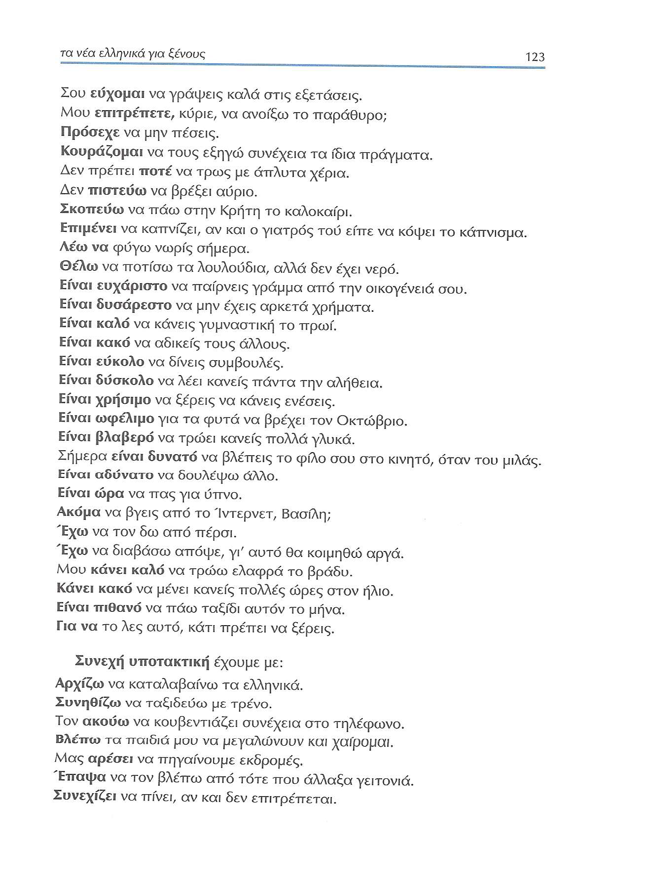
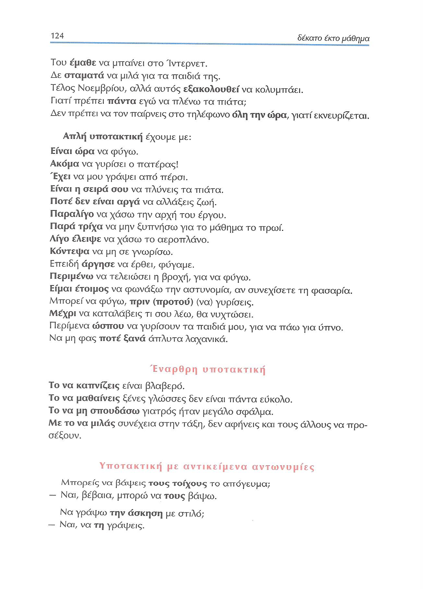

---

### 124 Έναρθρη υποτακτική

Έναρθρη υποτακτική

- <ins>Το **να καπνίζεις**</ins> είναι βλαβερό.

- <ins>Το **να μαθαίνεις**</ins> ξένες γλώσσες δεν είναι πάντα εύκολο.

- <ins>Το **να μη σπουδάσω**</ins> γιατρός ήταν μεγάλο σφάλμα.

- <ins>Με το **να μιλάς**</ins> συνέχεια στην τάξη, δεν αφήνεις και τους άλλους να προσέξουν.

---

### 124-125 Υποτακτική με αντικείμενα αντωνυμίες

|Ejemplo|Resto|Verbo| να/ας|μη(ν)|OI/OD|Verbo|Resto|
|:---------------|:---|:---:|:---:|:---:|:---:|:---:|:---:|
|— Μπορείς να βάψεις τους τοίχους το απόγευμοι; |  |Μπορείς|να |  |    |βάψεις|τους τοίχους το απόγευμοι; |
|— Ναι, βέβαια, μπορώ να τους βάψω.|Ναι, βέβαια|μπορώ|να|  |  τους|βάψω|  |
|— Να γράψω την άσκηση με στιλό;|  |  |Να|  |    |γράψω|την άσκηση με στιλό;|
|— Ναι, να τη γράψεις.|Ναι,|  |να|  |  τη|γράψεις|  |
|— Να ετοιμάσω τα πράγματά μου αμέσως; Φεύγουμε;|  |  |Να|  |   |ετοιμάσω|τα πράγματά μου αμέσως; Φεύγουμε;|
|— Ναι, να τα ετοιμάσεις.|Ναι, |  |να|  |  τα|ετοιμάσεις|αμέσως|
|— Να μαλώσω τα κορίτσια που κάνουν φασαρία;|  |  |Να|  |    |μαλώσω|τα κορίτσια που κάνουν φασαρία;|
|— Όχι, να μην τα μαλώσεις. Παιδιά είναι, δεν πειράζει.|Όχι, |  |να|μην|  τα|μαλώσεις.|Παιδιά είναι, δεν πειράζει.|
|— Να σβήσει ο Μιχάλης το φούρνο;|  |  |Να|  |   |σβήσει|ο Μιχάλης το φούρνο;|
|— Ναι, βέβαια, να τον σβήσει.|Ναι, βέβαια,|  |να|  |  τον|σβήσει|  |
|— Να ανάψει η Κατερίνα την τηλεόραση;|  |  |Να|  |    |ανάψει|η Κατερίνα την τηλεόραση;|
|— Ναι, την ανάψει.|Ναι, |  |ας|  |  |την|ανάψει|  |
|— Θέλετε να σας αλλάξω τα σεντόνια; Να σας τα αλλάξω;|  |Θέλετε|να|  |σας  |αλλάξω|τα σεντόνια; Να σας τα αλλάξω;|
|— Ναι, να μας τα αλλάξετε, σας παρακαλώ.|Ναι, |  |να|  |μας τα|αλλάξετε, |σας παρακαλώ.|
|— Να του νοικιάσω το διαμέρισμα; Να του το νοικιάσω;|  |  |Να|  |του   |νοικιάσω|το διαμέρισμα; Να του το νοικιάσω;|
|— Όχι, να μην του νοικιάσεις το διαμέρισμα.|Όχι, |  |να|μην|του   |νοικιάσεις|το διαμέρισμα.|
|— Όχι, να μην του το νοικιάσεις.|Όχι, |  |να|μην|του|το|νοικιάσεις|  |
|— Να σας φέρω τα βιβλία που θέλετε; Να σας τα φέρω;|  |  |Να|  |σας   |φέρω|τα βιβλία που θέλετε; Να σας τα φέρω;|
|— Ναι, να μας τα φέρεις.|Ναι, |  |να|  |μας τα|φέρεις.|  |
|— Να τους διαβάσει το παραμύθι;|  |  |Να|  |τους  |διαβάσει|το παραμύθι;|
|— Να τους το διαβάσει;|  |  |Να|  |τους το|διαβάσει;|  |
|— Ναι, ας τους το διαβάσει.|Ναι, |  |ας|  |τους το|διαβάσει.|  |

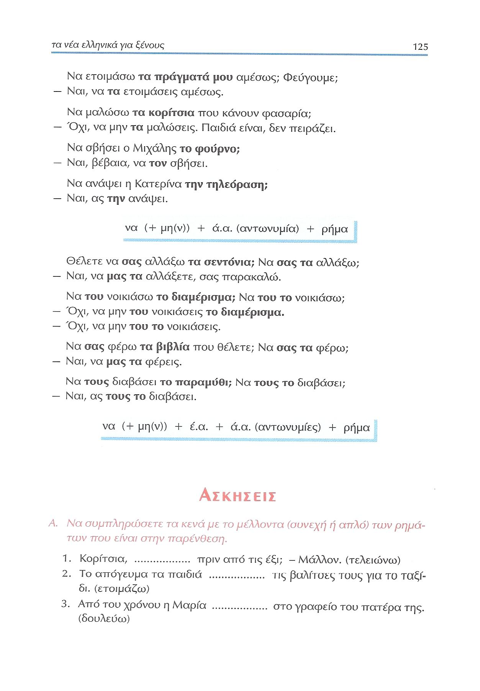

---

## 125 Ασκήσεις

---

## 126 Ασκήσεις

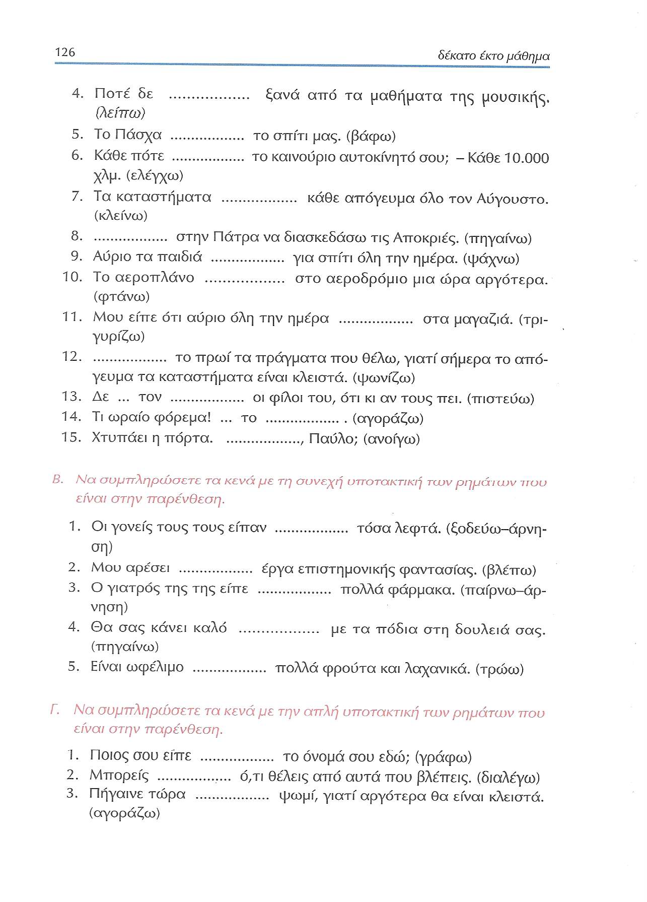

---

## 127 Ασκήσεις

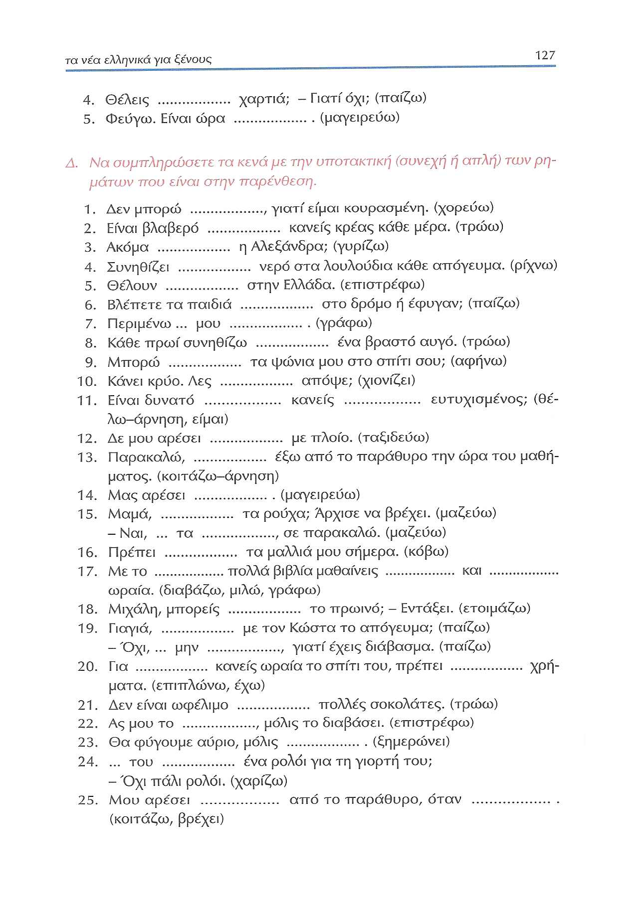

---

## 128 Ασκήσεις/ιδιωτισμοί-εκφράσεις

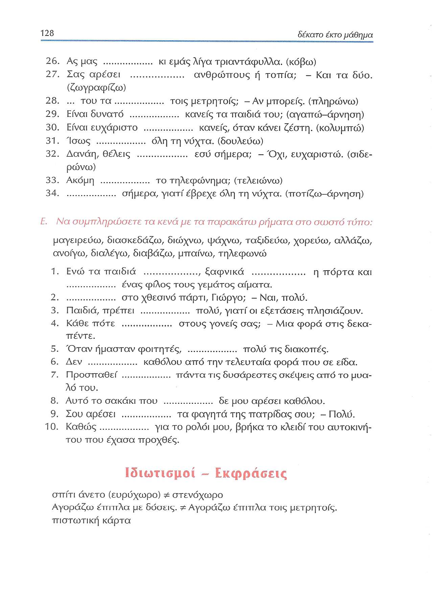

---

## 129 Ιδιωτισμοί-εκφράσεις

[Página 129](Metodo/Textbook_Pagina_129.png)
