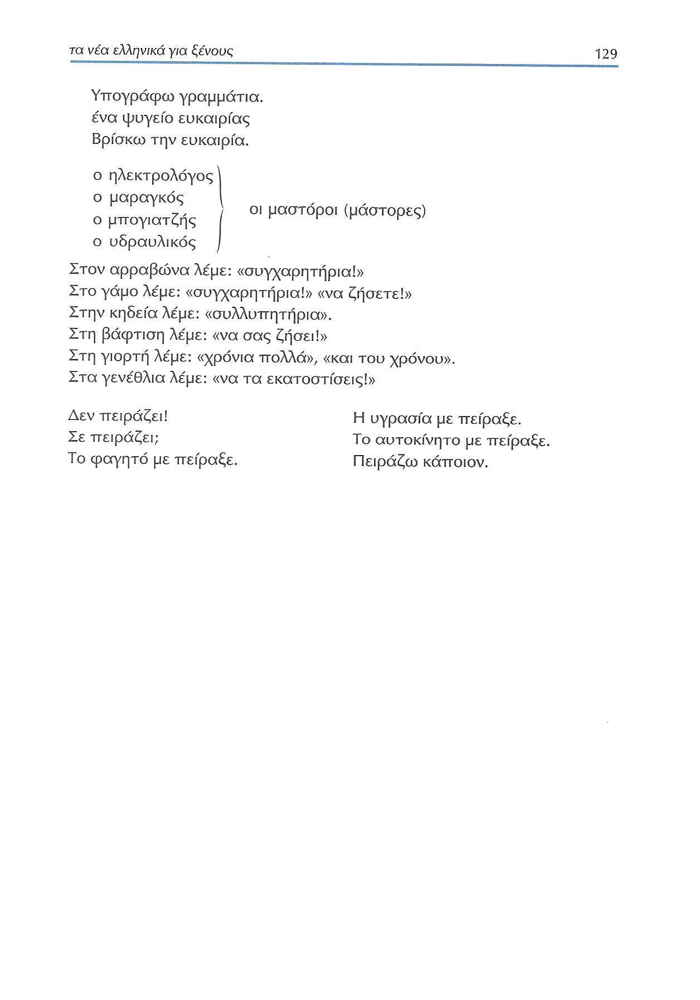

# Lección 16

---

## 116: 'Ένα ζευγάρι ετοιμάζει το σπίτι τους' (audio)

<audio controls="controls">
  <source type="audio/mpeg" src="../GM_Audios/16_Hena_zevgari_hetoimazei_to_spiti_tou.mp3"></source>
</audio>

---

## 116: 'Ένα ζευγάρι ετοιμάζει το σπίτι τους' (texto)

<audio controls="controls">
  <source type="audio/mpeg" src="../GM_Audios/16_Hena_zevgari_hetoimazei_to_spiti_tou.mp3"></source>
</audio>

<audio controls="controls">
  <source type="audio/mpeg" src="../GM_Audios/16_Hena_zevgari_hetoimazei_to_spiti_tou.mp3"></source>
</audio>

---

## 117: 'Οι πρώτες δυσκολίες' (texto)/Μέλλοντας 

---

## 118 Μέλλοντας

---

## 119 Μέλλοντας με αντικείμενα αντωνυμίες

---

## 119 Εκφράσεις που δείχνουν διάρκεια ή επανάληψη στο μέλλον

---

## 120 Υποτακτική

---

## 120-121 Άρνηση

---

## 121-122 Valores del subjuntivo

---

## 122-124 Εκφράσεις με υποτακτική

---

## 124 Έναρθρη υποτακτική

---

## 124-125 Υποτακτική με αντικείμενα αντωνυμίες

---

## 125 Ασκήσεις

---

## 126 Ασκήσεις

---

## 127 Ασκήσεις

---

## 128 Ασκήσεις/ιδιωτισμοί-εκφράσεις

---

## 129 Ιδιωτισμοί-εκφράσεις

