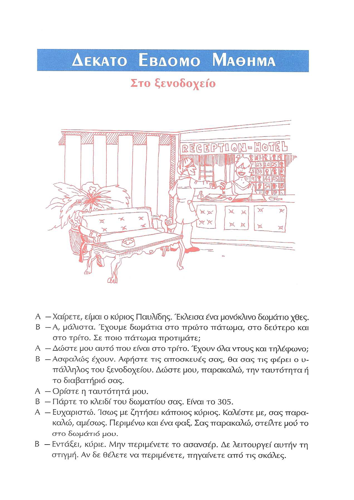
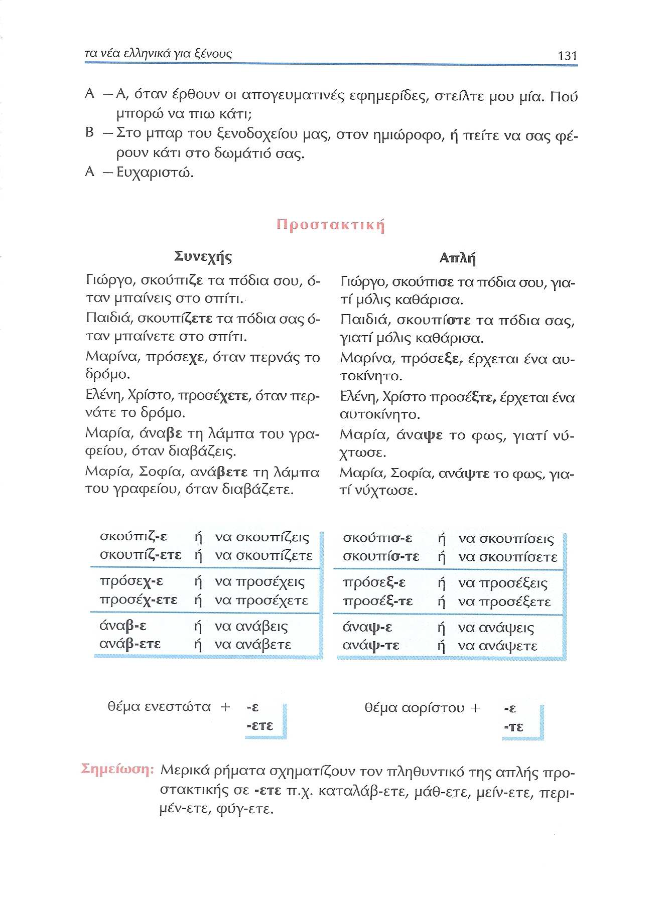
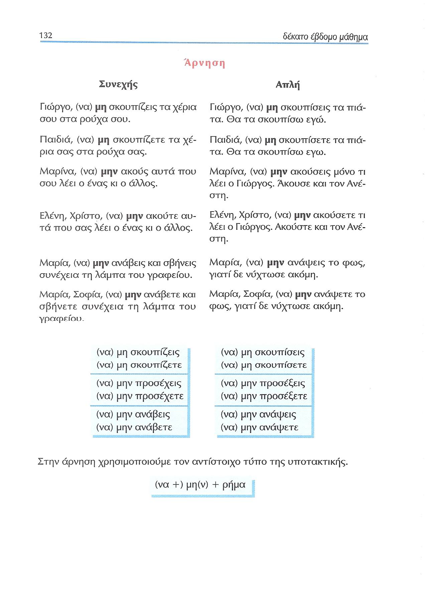
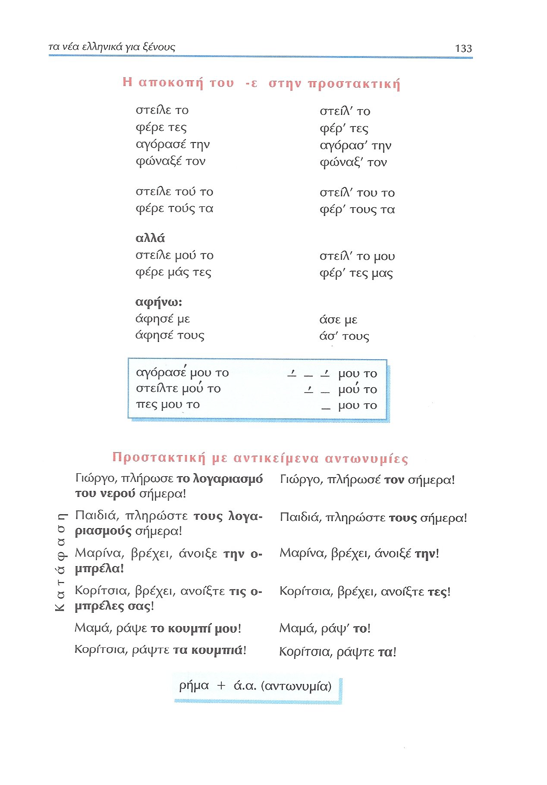
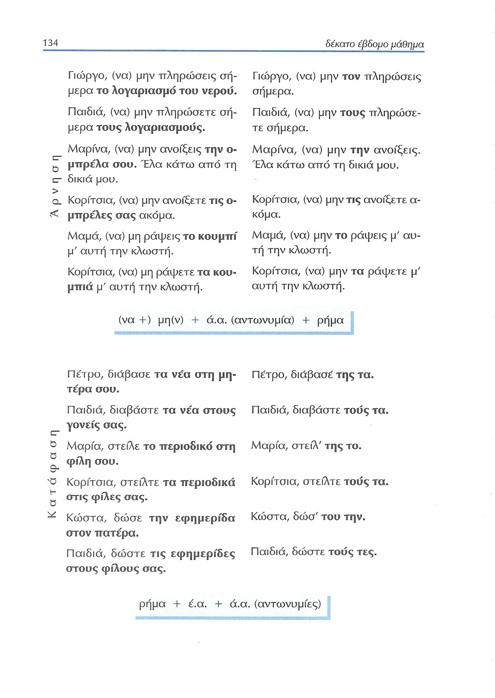
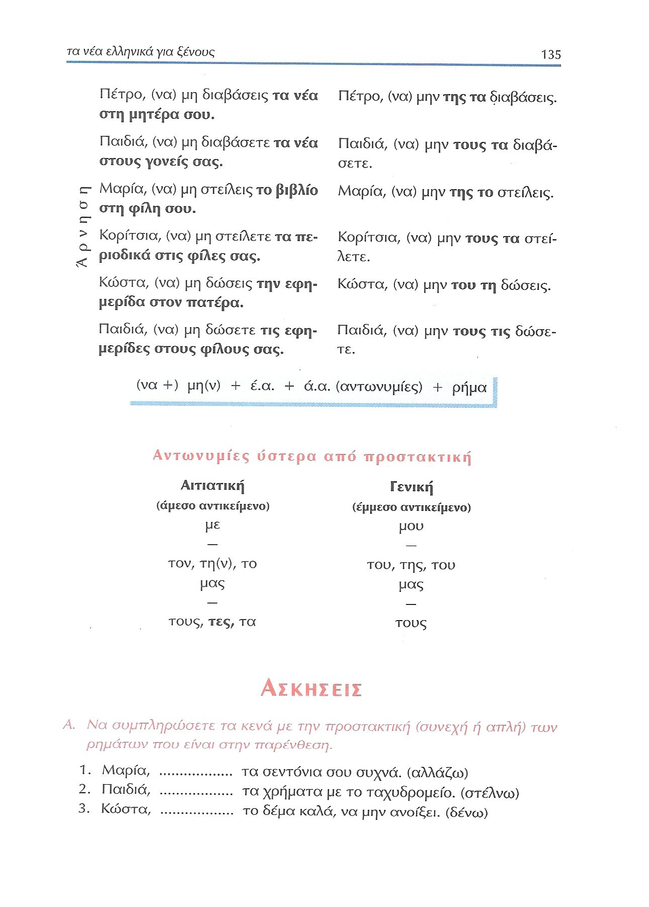
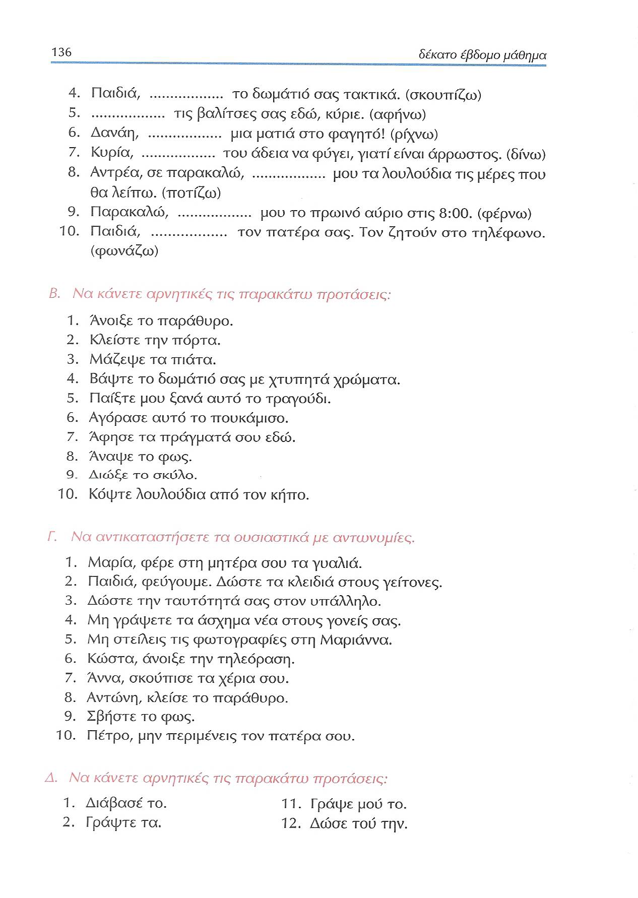
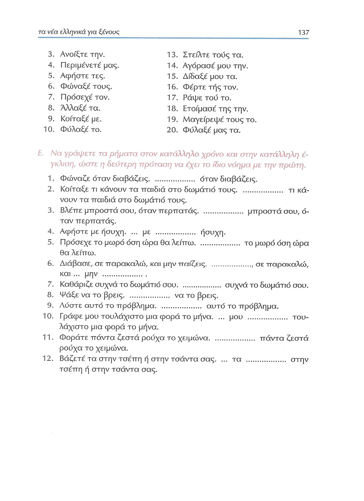
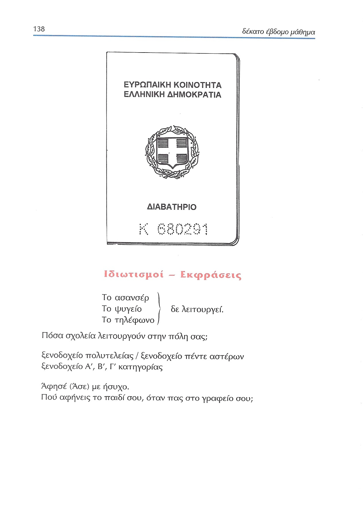

# Lección 17

---

## 130 'Στο ξενοδοχεία'

### Ηχογράφηση

  <audio class="fragmented-audio" controls style="width: 100%;>
    <source type="audio/mpeg" src="../GM_Audios/17_Audio.mp3">
    Tu navegador no soporta el elemento de audio.
  </audio>
 
  <button data-segment="0-4">⏯ 1</button> 
  <button data-segment="4-6">⏯ 2</button> 
  <button data-segment="7-10">⏯ 3</button> 
  <button data-segment="10-12">⏯ 4</button> 
  <button data-segment="13-18">⏯ 5</button> 
  <button data-segment="19-21">⏯ 6</button> 
  <button data-segment="22-24">⏯ 7</button> 
  <button data-segment="24-27">⏯ 8</button> 
  <button data-segment="27-28">⏯ 9</button> 
  <button data-segment="29-33">⏯ 10</button> 
  <button data-segment="33-37">⏯ 11</button> 
  <button data-segment="37-40">⏯ 12</button> 
  <button data-segment="39-42">⏯ 13</button> 
  <button data-segment="42-44">⏯ 14</button> 
  <button data-segment="45-46">⏯ 15</button> 
  <button data-segment="46-48">⏯ 16</button> 
  <button data-segment="49-51">⏯ 17</button> 
  <button data-segment="51-52">⏯ 18</button> 
  <button data-segment="53-58">⏯ 19</button> 
  <button data-segment="58-59">⏯ 20</button> 
  <button data-segment="59-61">⏯ 21</button> 
  <button data-segment="61-63">⏯ 22</button> 
  <button data-segment="63-67">⏯ 23</button> 
  <button data-segment="67-72">⏯ 24</button> 
  <button data-segment="73-75">⏯ 25</button> 
  <button data-segment="75-78">⏯ 26</button> 
  <button data-segment="78-82">⏯ 27</button> 
  <button data-segment="82-83">⏯ 28</button> 

### Κείμενο

Στο ξενοδοχείο

Α —Χαίρετε, είμαι ο κύριος Παυλίδης. Έκλεισα ένα μονόκλινο δωμάτιο χθες.

Β —Α, μάλιστα. Έχουμε δωμάτια στο πρώτο πάτωμα, στο δεύτερο και στο τρίτο. Σε ποιο πάτωμα προτιμάτε;

Α —Δώστε μου αυτό που είναι στο τρίτο. Έχουν όλα ντους και τηλέφωνο;

Β —Ασφαλώς έχουν. Αφήστε τις αποσκευές σας, θα σας τις φέρει ο υπάλληλος του ξενοδοχείου. Δώστε μου, παρακαλώ, την ταυτότητα ή το διαβατήριό σας.

Α —Ορίστε η ταυτότητά μου.

Β —Πάρτε το κλειδίτου δωματίου σας. Είναι το 305.

Α —Ευχαριστώ. Ίσως με ζητήσει κάποιος κύριος. Καλέστε με, σας παρακαλώ, αμέσως. Περιμένω και ένα φαξ. Σας παρακαλώ, στείλτε μού το στο δωμάτιό μου.

Β —Εντάξει, κύριε. Μην περιμένετε το ασανσέρ. Δε λειτουργεί αυτήν τη στιγμή. Αν δε θέλετε να περιμένετε, πηγαίνετε από τις σκάλες.

Α —Α, όταν έρθουν οι απογευματινές εφημερίδες, στείλτε μου μία. Πού μπορώ να πιω κάτι;

Β —Στο μπαρ του ξενοδοχείου μας, στον ημιώροφο, ή πείτε να σας φέρουν κάτι στο δωμάτιό σας.

Α —Ευχαριστώ.

### Ηχογράφηση & κέιμενο

 <audio class="fragmented-audio" controls style="width: 100%;">
 <source src="../GM_Audios/17_Audio.mp3" type="audio/mpeg" >
 Tu navegador no soporta el elemento de audio.
 </audio>
 
<table>
<tr><td > <button data-segment="0-6"> ⏯ </button> </td> <td> <button data-segment="0-4"> ⏯ </button> Δέκατο έβδομο μάθημα</td></tr> 
<tr><td> </td> <td> <button data-segment="4-6"> ⏯ </button> Στο ξενοδοχείο </td></tr> 
<tr><td> <button data-segment="7-12"> ⏯ </button> </td> <td> <button data-segment="7-10"> ⏯ </button> Α. —Χαίρετε, είμαι ο κύριος Παυλίδης. 
 <button data-segment="10-12"> ⏯ </button> Έκλεισα ένα μονόκλινο δωμάτιο χθες. </td></tr> 
<tr><td> <button data-segment="13-21"> ⏯ </button> </td> <td> <button data-segment="13-18"> ⏯ </button> Β —Α, μάλιστα. Έχουμε δωμάτια στο πρώτο πάτωμα, στο δεύτερο και στο τρίτο. 
 <button data-segment="19-21"> ⏯ </button> Σε ποιο πάτωμα προτιμάτε; </td></tr> 
<tr><td> <button data-segment="22-27"> ⏯ </button> </td> <td> <button data-segment="22-24"> ⏯ </button> Α —Δώστε μου αυτό που είναι στο τρίτο. 
 <button data-segment="24-27"> ⏯ </button> Έχουν όλα ντους και τηλέφωνο; </td></tr> 
<tr><td> <button data-segment="27-37"> ⏯ </button> </td> <td> <button data-segment="27-29"> ⏯ </button> Β —Ασφαλώς έχουν. 
 <button data-segment="29-33"> ⏯ </button> Αφήστε τις αποσκευές σας, θα σας τις φέρει ο υπάλληλος του ξενοδοχείου. 
 <button data-segment="33-37"> ⏯ </button> Δώστε μου, παρακαλώ, την ταυτότητα ή το διαβατήριό σας. </td></tr> 
<tr><td> <button data-segment="37-40"> ⏯ </button> </td> <td> <button data-segment="37-40"> ⏯ </button> Α —Ορίστε η ταυτότητά μου. </td></tr> 
<tr><td> <button data-segment="39-44"> ⏯ </button> </td> <td> <button data-segment="39-42"> ⏯ </button> Β —Πάρτε το κλειδί του δωματίου σας. 
 <button data-segment="42-44"> ⏯ </button> Είναι το 305. </td></tr> 
<tr><td> <button data-segment="45-58"> ⏯ </button> </td> <td> <button data-segment="45-46"> ⏯ </button> Α —Ευχαριστώ. 
 <button data-segment="46-48"> ⏯ </button> Ίσως με ζητήσει κάποιος κύριος. 
 <button data-segment="49-51"> ⏯ </button> Καλέστε με, σας παρακαλώ, αμέσως. 
 <button data-segment="51-52"> ⏯ </button> Περιμένω και ένα φαξ. 
 <button data-segment="53-58"> ⏯ </button> Σας παρακαλώ, στείλτε μού το στο δωμάτιό μου. </td></tr> 
<tr><td> <button data-segment="58-67"> ⏯ </button> </td> <td> <button data-segment="58-59"> ⏯ </button> Β —Εντάξει, κύριε. 
 <button data-segment="59-61"> ⏯ </button> Μην περιμένετε το ασανσέρ. 
 <button data-segment="61-63"> ⏯ </button> Δε λειτουργεί αυτήν τη στιγμή. 
 <button data-segment="63-67"> ⏯ </button> Αν δε θέλετε να περιμένετε, πηγαίνετε από τις σκάλες. </td></tr> 
<tr><td> <button data-segment="67-75"> ⏯ </button> </td> <td> <button data-segment="67-72"> ⏯ </button> Α —Α, όταν έρθουν οι απογευματινές εφημερίδες, στείλτε μου μία. 
 <button data-segment="73-75"> ⏯ </button> Πού μπορώ να πιω κάτι; </td></tr>
<tr><td> <button data-segment="75-82"> ⏯ </button> </td> <td> <button data-segment="75-78"> ⏯ </button> Β —Στο μπαρ του ξενοδοχείου μας, στον ημιώροφο, 
 <button data-segment="78-82"> ⏯ </button> ή πείτε να σας φέρουν κάτι στο δωμάτιό σας. </td></tr> 
<tr><td> <button data-segment="82-83"> ⏯ </button> </td> <td> <button data-segment="82-83"> ⏯ </button> Α —Ευχαριστώ. </td></tr> 
</table>

---

<audio class="fragmented-audio" controls style="width:100%;">
<source type="audio/mpeg" src="../GM_Audios/17_Audio.mp3">Tu navegador no soporta el elemento de audio.</audio>
 
<table>
<tr><td> <button data-segment="0-6"> ⏯ </button> </td> <td> <button data-segment="0-4"> ⏯ Δέκατο έβδομο μάθημα</button> </td></tr> 
<tr><td> </td> <td> <button data-segment="4-6"> ⏯ Στο ξενοδοχείο</button>  </td></tr> 
<tr><td> <button data-segment="7-12"> ⏯ </button> </td> <td> <button data-segment="7-10"> ⏯  Α. —Χαίρετε, είμαι ο κύριος Παυλίδης. </button>
 <button data-segment="10-12"> ⏯  Έκλεισα ένα μονόκλινο δωμάτιο χθες. </button></td></tr> 
<tr><td> <button data-segment="13-21"> ⏯ </button> </td> <td> <button data-segment="13-18"> ⏯  Β —Α, μάλιστα. Έχουμε δωμάτια στο πρώτο πάτωμα, στο δεύτερο και στο τρίτο. </button>
 <button data-segment="19-21"> ⏯ Σε ποιο πάτωμα προτιμάτε; </button></td></tr> 
<tr><td> <button data-segment="22-27"> ⏯ </button> </td> <td> <button data-segment="22-24"> ⏯  Α —Δώστε μου αυτό που είναι στο τρίτο. </button>
 <button data-segment="24-27"> ⏯  Έχουν όλα ντους και τηλέφωνο; </button></td></tr> 
<tr><td> <button data-segment="27-37"> ⏯ </button> </td> <td> <button data-segment="27-28.75"> ⏯  Β —Ασφαλώς έχουν. </button>
 <button data-segment="29-33"> ⏯  Αφήστε τις αποσκευές σας, θα σας τις φέρει ο υπάλληλος του ξενοδοχείου. </button>
 <button data-segment="33-37"> ⏯  Δώστε μου, παρακαλώ, την ταυτότητα ή το διαβατήριό σας. </button></td></tr> 
<tr><td> <button data-segment="37-40"> ⏯ </button> </td> <td> <button data-segment="37-40"> ⏯  Α —Ορίστε η ταυτότητά μου. </button></td></tr> 
<tr><td> <button data-segment="39-44"> ⏯ </button> </td> <td> <button data-segment="39-42"> ⏯  Β —Πάρτε το κλειδί του δωματίου σας. </button>
 <button data-segment="42-44"> ⏯  Είναι το 305. </button></td></tr> 
<tr><td> <button data-segment="45-58"> ⏯ </button> </td> <td> <button data-segment="45-46"> ⏯  Α —Ευχαριστώ. </button>
 <button data-segment="46-48"> ⏯  Ίσως με ζητήσει κάποιος κύριος. </button>
 <button data-segment="49-51"> ⏯  Καλέστε με, σας παρακαλώ, αμέσως. </button>
 <button data-segment="51-52"> ⏯  Περιμένω και ένα φαξ. </button>
 <button data-segment="53-58"> ⏯ Σας παρακαλώ, στείλτε μού το στο δωμάτιό μου. </button></td></tr>
<tr><td> <button data-segment="59-67"> ⏯ </button> </td> <td> <button data-segment="58-59"> ⏯  Β —Εντάξει, κύριε. </button>
 <button data-segment="59-61"> ⏯  Μην περιμένετε το ασανσέρ. </button>
 <button data-segment="61-63"> ⏯  Δε λειτουργεί αυτήν τη στιγμή. </button>
 <button data-segment="63-67"> ⏯  Αν δε θέλετε να περιμένετε, πηγαίνετε από τις σκάλες. </button></td></tr> 
<tr><td> <button data-segment="67-75"> ⏯ </button> </td> <td> <button data-segment="67-72"> ⏯  Α —Α, όταν έρθουν οι απογευματινές εφημερίδες, στείλτε μου μία. </button>
 <button data-segment="73-75"> ⏯  Πού μπορώ να πιω κάτι; </button></td></tr>
<tr><td> <button data-segment="75-82"> ⏯ </button> </td> <td> <button data-segment="75-78"> ⏯  Β —Στο μπαρ του ξενοδοχείου μας, στον ημιώροφο, </button>
 <button data-segment="78-82"> ⏯  ή πείτε να σας φέρουν κάτι στο δωμάτιό σας. </button></td></tr> 
<tr><td> <button data-segment="82-83"> ⏯ </button> </td> <td> <button data-segment="82-83"> ⏯  Α —Ευχαριστώ. </button></td></tr> 
</table>

---

## 131 Προστακτική

### 131 Παραδείγματα

|Συνεχής|Απλή|
|:---: | :---: |
|Γιώργο, **σκούπιζε** τα πόδια σου, όταν μπαίνεις στο σπίτι.|Γιώργο, **σκούπισε** τα πόδια σου, γιατί μόλις καθάρισα.|
|Παιδιά, **σκουπίζετε** τα πόδια σας όταν μπαίνετε στο σπίτι.|Παιδιά, **σκουπίστε** τα πόδια σας, γιατί μόλις καθάρισα.|
|Μαρίνα, **πρόσεχε**, όταν περνάς το δρόμο.|Μαρίνα, **πρόσεξε**, έρχεται ένα αυτοκίνητο.|
|Ελένη, Χρίστο, **προσέχετε**, όταν περνάτε το δρόμο.|Ελένη, Χρίστο **προσέξτε**, έρχεται ένα ουτοκίνητο.|
|Μαρία, **άναβε** τη λάμπα του γραφείου, όταν διαβάζεις.|Μαρία, **άναψε** το φως, γιατί νύχτωσε.|
|Μαρία, Σοφία, **ανάβετε** τη λάμπα του γραφείου, όταν διαβάζετε.|Μαρία, Σοφία, **ανάψτε** το φως, γιατί νύχτωσε.|

### 131 Μορφολογία

|Συνεχής|Απλή|
|:---|:---|
|θέμα ενεστώτα|θέμα αορίστου|
|1. θέμα ενεστώτα + -**ε**/-**ετε** 2. να + υποτακτική (-**ε**/-**ετε**)|(A) 1. θέμα αορίστου + -**ε**/-**τε** 2. να + υποτακτική (-**ε**/-**ετε**)|
|1. σκούπιζ-**ε** 2. **να** σκουπίζ**εις**|1. σκούπι**σ**-**ε** 2. **να** σκουπί-**σ**-**εις**|
|1. σκουπίζ-**ετε** 2. **να** σκουπίζετε|1. σκουπί-**σ**-**τε** 2. **να** σκουπί-**σ**-**ετε**|
|1. πρόσεχ-**ε** 2. **να** προσέχ-εις|1. πρόσε**ξ**-**ε** . **να** προσέ**ξ**-**εις**|
|1. προσέχ-**ετε** 2. **να** προσέχ-ετε|1. προσέ**ξ**-**τε** 2. **να** προσέ**ξ**-**ετε**|
|1. άναβ-ε 2. **να** ανάβ-εις|1. άνα**ψ**-**ε** 2. **να** ανά**ψ**-**εις**|
|1. ανάβ-**ετε** 2. να ανάβ-**ετε**|1. ανά**ψ**-**τε** 2. **να** ανά**ψ**-**ετε**|
|  |  |
|  |(B) θέμα αορίστου + -**ε**/-**ετε** // **να** + υποτακτική|
|  |-**ε**/-**ετε** (-**~~σ~~**-**~~τε~~**)|
| (καταλαβ-αίν-ω) |(καταλαβ-α) καταλάβ-**ετε**|
| (μαθ-αίν-ω) |(έ-μαθ-α) μάθ-**ετε**|
| (μέν-ω) |(έ-μειν-α) μείν-**ετε**|
| (περιμέν-ω) |(περίμεν-α) περι-μέν-**ετε**|
| (φεύγ-ω) |(έ-φυγ-α) φύγ-**ετε**|

---

### 132 Άρνηση

|Συνεχής|Απλή|
|:---|:---|
|Γιώργο, (**να**) **μη** σκουπίζ-**εις** τα χέρια σου στα ρούχα σου.|Γιώργο, (**να**) **μη** σκουπί-**σ**-**εις** τα πιάτα. Θα τα σκουπίσω εγώ.|
|Παιδιά, (**να**) **μη** σκουπίζ-**ετε** τα χέρια σας στα ρούχα σας.|Παιδιά, (**να**) **μη** σκουπί**σ**-**ετε** τα πιάτα. Θα τα σκουπίσω εγω.|
|Μαρίνα, (**να**) **μην** ακού-**ς** αυτά που σου λέει ο ένας κι ο άλλος.|Μαρίνα, (**να**) **μην** ακού-**σ**-**εις** μόνο τι λέει ο Γιώργος. Άκου-**σ**-**ε** και τον Ανέστη.|
|Ελένη, Χρίστο, (**να**) **μην** ακού-**τε** αυτά που σας λέει ο ένας κι ο άλλος.|Ελένη, Χρίστο, (**να**) **μην** ακού-**σ**-**ετε** τι λέει ο Γιώργος. Ακού-**σ**-**τε** και τον Ανέστη.|
|Μαρία, (**να**) **μην** ανάβ-**εις** και σβήν-**εις** συνέχεια τη λάμπα του γραφείου.|Μαρία, (**να**) **μην** ανά**ψ**-**εις** το φως, γιατί δε νύχτωσε ακόμη.|
|Μαρία, Σοφία, (**να**) **μην** ανάβ-**ετε** και σβήν-**ετε** συνέχεια τη λάμπα του γραφείου.|Μαρία, Σοφία, (**να**) **μην** ανά**ψ-ετε** το φως, γιατί δε νύχτωσε ακόμη.|

|Συνεχής|Απλή|
|:---|:---|
|(**να**) **μη** + υποτακτική ενεστώτα|(**να**) **μη** + υποτακτική αόριστου|
|(**να**) **μη** σκουπίζ-**εις**|(**να**) **μη** σκουπί-**σ**-**εις**|
|(**να**) **μη** σκουτίζ-**ετε**|(**να**) **μη** σκουπί-**σ**-**ετε**|
|(**να**) **μην** προσέχ-**εις**|(**να**) **μην** προσέ**ξ**-**εις**|
|(**να**) **μην** προσέχ-**ετε**|(**να**) **μην** προσέ**ξ**-**ετε**|
|(**να**) **μην** ονάβ-**εις**|(**να**) **μην** ανά**ψ**-**εις**|
|(**να**) **μην** ανάβ-**ετε**|(**να**) **μην** ανά**ψ**-**ετε**|

---

### 133 Αποκοπή

||Προστακτική + αντωνυμίες|Ρήμα|γενική|αιτιατική|γενική|
|:---|:---|:---:|:---:|:---:|:---:|
|1a|στείλ**ε** το|στείλε|  |το|  |
|1b|^2^στείλ**'** **τ**ο|στείλ'|  |το|  |
|2a|φέρε **τες**^1^|φέρε|  |τες|  |
|2b|^2^φέρ**'** **τες**^1^|φέρ'|  |τες|  |
|3a|αγόρασ**έ** **τ**ην|αγόρασέ|  |την|  |
|3b|^2^αγόρασ**'** **τ**ην|αγόρασ'|  |την|  |
|4a|Φώναξ**έ** **τ**ον|Φώναξέ|  |τον|  |
|4b|^2^φώναξ**'** **τ**ον|φώναξ'|  |τον|  |
|  |  |  |  |  |
|5a|στείλ**ε** τού το|στείλε|τού|το|  |
|5b|^2^στείλ**'** **τ**ου το|στείλ'|του|το|  |
|6a|φέρ**ε** τούς τα|φέρε|τούς|τα|  |
|6b|^2^φέρ**'** **τ**ους τα|φέρ'|τους|τα|  |
|7a|στείλ**ε** μού το |στείλε |μού |το|  |
|7b|^2^στείλ**'** **τ**ο μου ^3^|στείλ'|  |το|μου|
|8a|Φέρ**ε** **μ**άς **τες**^1^|Φέρε|μάς| τες ||
|8b|^2^φέρ**'** **τ**ες^1^ μας^3^|φέρ'|  |τες|μας|
|  |  |  |  |  |
|αφήνω|  |  |  |  |
|9a|ά**φη**σέ με|άφησέ|  |με|  |
|9b|^4^άσε με|άσε|  |με|  |
|10a|ά**φη**σ**έ** τους|άφησέ|  |τους|  |
|10b|^2^ ^4^άσ**'** **τ**ους|άσ'|  |τους|  |

- ^1^Ac. pl. fem. τις > τες
- ^2^Apócope ante τ-: pérdida de la última vocal del verbo
- ^3^Orden CD+CI
- ^4^Apócope especial: pérdida de una sílaba completa (-φη-)

---

### 133 Τόνος

|Συνδυασμός|Συλλαβές των ρημάτων|Τόνος των αντωνυμιών|
|:---:|:---:|:---:|
|<ruby>α-<rt>0</rt></ruby><ruby>γ**ό**-<rt>1</rt></ruby><ruby>ρα-<rt>2</rt></ruby><ruby>σ**έ**<rt>3</rt></ruby> <ruby>μου<rt>4</rt></ruby> <ruby>το<rt>5</rt></ruby>|α-γό-ρα-σέ (**3 o más**)| <ruby>—<rt>/</rt></ruby> — <ruby>—<rt>/</rt></ruby>   μου το|
|<ruby>στ**εί**λ-<rt>1</rt></ruby><ruby>τε<rt>2</rt></ruby> <ruby>μ**ού**<rt>3</rt></ruby> <ruby>το<rt>4</rt></ruby>|στείλ-τε (**2**)|<ruby>—<rt>/</rt></ruby> — μ**ού** το|
|<ruby>πες<rt>1</rt></ruby> <ruby>μου<rt>2</rt></ruby> <ruby>το<rt>3</rt></ruby>|πες (**1**)| — μου το|

### 133 Προστακτική με αντωνυμίες

| |να|μη(ν)|CI|CD|Ρήμα|CI|CD|Αιτιατική|CI|
|:---|:---:|:---:|:---:|:---:|:---:|:---:|:---:|:---:|:---:|
|Γιώργο, πλήρωσε το λογαριασμό του νερού σήμερα!|  |  |  |  |πλήρωσε|  |  |τον λογαριασμό|  |
|Γιώργο, πλήρωσέ τον σήμερα!|  |  |  |  |πλήρωσε|  |τον|  |  |
|Παιδιά, πληρώστε τους λογαριασμούς σήμερα!|  |  |  |  |πληρώστε|  |  |τους λογαριασμούς|  |
|Παιδιά, πληρώστε τους σήμερα!|  |  |  |  |πληρώστε|  |τους|  |  |
|Μαρίνα, βρέχει, άνοιξε την ομπρέλα!|  |  |  |  |άνοιξε|  |  |την ομπρέλα!|  |
|Μαρίνα, βρέχει, άνοιξέ την!|  |  |  |  |άνοιξέ|  |την!|  |  |
|Κορίτσια, βρέχει, ανοίξτε τις ομπρέλες σας!|  |  |  |  |ανοίξτε|  |  |τις ομπρέλες σας!|  |
|Κορίτσια, βρέχει, ανοίξτε τες!|  |  |  |  |ανοίξτε|  |τες!|  |  |
|Μαμά, ράψε το κουμπί μου! |  |  |  |  |ράψε |  |  |το κουμπί μου! |  |
|Μαμά, ράψ' το!|  |  |  |  |ράψ'|  |το!|  |  |
|Κορίτσια, ράψτε τα κουμπιά!|  |  |  |  |ράψτε|  |  |τα κουμπιά!|  |
|Κορίτσια, ράψτε τα!|  |  |  |  |ράψτε|  |τα!|  |  |
|Γιώργο, (να) μην πληρώσεις σήμερα το λογαριασμό του νερού.|(να)|μην|  |  | πληρώσεις|  |  |τον λογαριασμό|  |
|Γιώργο, (να) μην τον πληρώσεις σήμερα.|(να)|μην|  |τον|πληρώσεις|  |  |  |  |
|Παιδιά, (να) μην πληρώσετε σήμερα τους λογαριασμούς.|(να)|μην|  |  |πληρώσετε|  |  |τους λογαριασμούς|  |
|Παιδιά, (να) μην τους πληρώσετε σήμερα.|(να)|μην|  |τους|πληρώσετε|  |  |  |  |
|Μαρίνα, (να) μην ανοίξεις την ομπρέλα σου. Έλα κάτω από τη δικιά μου.|(να)|μην|  |  |ανοίξεις|  |  |την ομπρέλα σου|  |
|Μαρίνα, (να) μην την ανοίξεις. Έλα κάτω από τη δικιά μου.|(να)|μην|  |την|ανοίξεις|  |  |  |  |
|Κορίτσια, (να) μην ανοίξετε τις ομπρέλες σας ακόμα.|(να)|μην|  |  |ανοίξετε|  |  |τις ομπρέλες σας|  |
|Κορίτσια, (να) μην τις ανοίξετε ακόμα.|(να)|μην|  |τις|ανοίξετε|  |  |  |  |
|Μαμά, (να) μη ράψεις το κουμπί μ' αυτή την κλωστή.|(να)|μη|  |  |ράψεις|  |  |το κουμπί|  |
|Μαμά, (να) μην το ράψεις μ΄' αυτή την κλωστή.|(να)|μην|  |το|ράψεις|  |  |  |  |
|Κορίτσια, (να) μη ράψετετα κουμπιά μ΄ αυτή την κλωστή.|(να)|μη|  |  |ράψετε|  |  |τα κουμπιά|  |
|Κορίτσια, (να) μην τα ράψετε μ' αυτή την κλωστή.|(να)|μην|  |τα|ράψετε|  |  |  |  |
|Πέτρο, διάβασε τα νέα στη μητέρα σου.|  |  |  |  |διάβασε|  |  |τα νέα|στη μητέρα σου|
|Πέτρο, διάβασέ της τα.|  |  |  |  |διάβασέ|της|τα|  |  |
|Παιδιά, διαβάστε τα νέα στους γονείς σας.|  |  |  |  |διαβάστε|  |  |τα νέα|στους γονείς σας.|
|Παιδιά, διαβάστε τούς τα.|  |  |  |  |διαβάστε|τούς|τα|  |  |
|Μαρία, στείλε το περιοδικό στη φίλη σου.|  |  |  |  |στείλε|  |  |το περιοδικό|στη φίλη σου|
|Μαρία, στείλ' της το.|  |  |  |  |στείλ'|της|το|  |  |
|Κορίτσια, στείλτε τα περιοδικά στις φίλες σας.|  |  |  |  |στείλτε|  |  |τα περιοδικά|στις φίλες σας|
|Κορίτσια, στείλτε τούς τα.|  |  |  |  |στείλτε|τούς|τα|  |  |
|Κώστα, δώσε την εφημερίδα στον πατέρα.|  |  |  |  |δώσε|  |  |την εφημερίδα|στον πατέρα|
|Κώστα, δώσ' του την.|  |  |  |  |δώσ'|του|την|  |  |
|Παιδιά, δώστε τις εφημερίδες στους φίλους σας.|  |  |  |  |δώστε|  |  |τις εφημερίδες|στους φίλους σας|
|Παιδιά, δώστε τούς τες.|  |  |  |  |δώστε|τούς|τες|  |  |
|Πέτρο, (να) μη διαβάσεις τα νέα στη μητέρα σου.|(να)|μη|  |  |διαβάσεις|  |  |τα νέα|στη μητέρα σου|
|Πέτρο, (να) μην της τα διαβάσεις.|(να)|μην|της|τα|διαβάσεις|  |  |  |  |
|Παιδιά, (να) μη διαβάσετε τα νέα στους γονείς σας.|(να)|μη|  |  |διαβάσετε|  |  |τα νέα|στους γονείς σας|
|Παιδιά, (να) μην τους τα διαβάσετε.|(να)|μην|τους|τα|διαβάσετε|  |  |  |  |
|Μαρία, (να) μη στείλεις το βιβλίο στη φίλη σου.|(να)|μη|  |  |στείλεις|  |  |το βιβλίο|στη φίλη σου|
|Μαρία, (να) μην της το στείλεις.|(να)|μην|της|το|στείλεις|  |  |  |  |
|Κορίτσια, (να) μη στείλετε τα περιοδικά στις φίλες σας.|(να)|μη|  |  |στείλετε|  |  |τα περιοδικά|στις φίλες|
|Κορίτσια, (να) μην τους τα στείλετε.|(να)|μην|τους|τα|στείλετε|  |  |  |  |
|Κώστα, (να) μη δώσεις την εφημερίδα στον πατέρα.|(να)|μη|  |  |δώσεις|  |  |την εφημερίδα|στον πατέρα|
|Κώστα, (να) μην του τη δώσεις.|(να)|μην|του |τη|δώσεις|  |  |  |  |
|Παιδιά, (να) μη δώσετε τις εφημερίδες στους φίλους σας.|(να)|μην|του|τη|δώσετε|  |  |τις εφημερίδες|στους φίλους σας|
|Παιδιά, (να) μην τους τις δώσετε.|(να)|μην|τους|τις|δώσετε|  |  |  |  |

|να|μη(ν)|CI|CD|Ρήμα|CI|CD|Αιτιατική|CI|
|:---:|:---:|:---:|:---:|:---:|:---:|:---:|:---:|:---:|
|  |  |  |  |άνοιξε|  |  |την ομπρέλα!|  |
|  |  |  |  |άνοιξέ|  |**την**!|  |  |
|(να)|μην|  |  |ανοίξεις|  |  |την ομπρέλα σου|  |
|(να)|μην|  |την|ανοίξεις|  |  |  |  |
|  |  |  |  |ανοίξτε|  |  |τις ομπρέλες σας!|  |
|  |  |  |  |ανοίξτε|  |τες!|  |  |
|(να)|μην|  |  |ανοίξετε|  |  |τις ομπρέλες σας|  |
|(να)|μην|  |τις|ανοίξετε|  |  |  |  |
|  |  |  |  |πλήρωσε|  |  |τον λογαριασμό|  |
|  |  |  |  |πλήρωσε|  |τον|  |  |
|(να)|μην|  |  | πληρώσεις|  |  |τον λογαριασμό|  |
|(να)|μην|  |τον|πληρώσεις|  |  |  |  |
|  |  |  |  |πληρώστε|  |  |τους λογαριασμούς|  |
|  |  |  |  |πληρώστε|  |τους|  |  |
|(να)|μην|  |  |πληρώσετε|  |  |τους λογαριασμούς|  |
|(να)|μην|  |τους|πληρώσετε|  |  |  |  |
|  |  |  |  |ράψε |  |  |το κουμπί μου! |  |
|  |  |  |  |ράψ'|  |το!|  |  |
|(να)|μη|  |  |ράψεις|  |  |το κουμπί|  |
|(να)|μην|  |το|ράψεις|  |  |  |  |
|  |  |  |  |ράψτε|  |  |τα κουμπιά!|  |
|  |  |  |  |ράψτε|  |τα!|  |  |
|(να)|μη|  |  |ράψετε|  |  |τα κουμπιά|  |
|(να)|μην|  |τα|ράψετε|  |  |  |  |
|  |  |  |  |διάβασε|  |  |τα νέα|στη μητέρα σου|
|  |  |  |  |διάβασέ|της|τα|  |  |
|(να)|μη|  |  |διαβάσεις|  |  |τα νέα|στη μητέρα σου|
|(να)|μην|της|τα|διαβάσεις|  |  |  |  |
|  |  |  |  |διαβάστε|  |  |τα νέα|στους γονείς σας.|
|  |  |  |  |διαβάστε|τούς|τα|  |  |
|(να)|μη|  |  |διαβάσετε|  |  |τα νέα|στους γονείς σας|
|(να)|μην|τους|τα|διαβάσετε|  |  |  |  |
|  |  |  |  |στείλε|  |  |το περιοδικό|στη φίλη σου|
|  |  |  |  |στείλ'|της|το|  |  |
|(να)|μη|  |  |στείλεις|  |  |το βιβλίο|στη φίλη σου|
|(να)|μην|της|το|στείλεις|  |  |  |  |
|  |  |  |  |στείλτε|  |  |τα περιοδικά|στις φίλες σας|
|  |  |  |  |στείλτε|τούς|τα|  |  |
|(να)|μη|  |  |στείλετε|  |  |τα περιοδικά|στις φίλες|
|(να)|μην|τους|τα|στείλετε|  |  |  |  |
|  |  |  |  |δώσε|  |  |την εφημερίδα|στον πατέρα|
|  |  |  |  |δώσ'|του|την|  |  |
|(να)|μη|  |  |δώσεις|  |  |την εφημερίδα|στον πατέρα|
|(να)|μην|του |τη|δώσεις|  |  |  |  |
|  |  |  |  |δώστε|  |  |τις εφημερίδες|στους φίλους σας|
|  |  |  |  |δώστε|τούς|τες|  |  |
|(να)|μην| | |δώσετε|  |  |τις εφημερίδες|στους φίλους σας|
|(να)|μην|τους|τις|δώσετε|  |  |  |  |

---

### 134 Προστακτική με αντωνυμίες

|Αιτιατική|Γενική|
|:---:|:---:|
|(άμεσο αντικείμενο)|(έμμεσο αντικείμενο)|
|με|μου|
|ø|ø|
|τον, τη(ν), το|του, της, του|
|μας|μας|
|ø|ø|
|τους, τες, τα|τους|

---

### 135 Αντωνυμίες/Ασκήσεις

### 135 Προστακτική με αντωνυμίες

### Ασκήσεις Α

---

## 136 Ασκήσεις Α-Δ

---

## 137 Ασκήσεις Δ-Ε

---

## 138 Ιδιωτισμοί-Εκφράσεις

