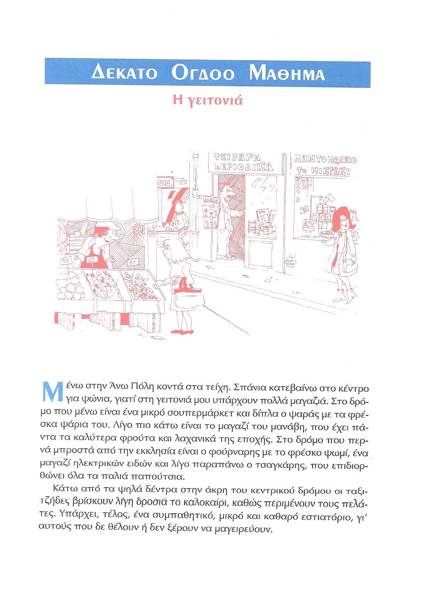
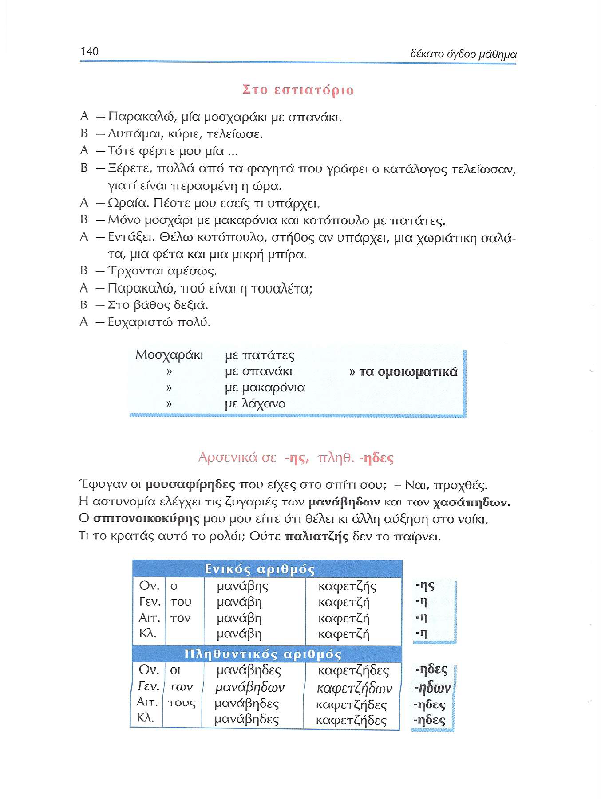
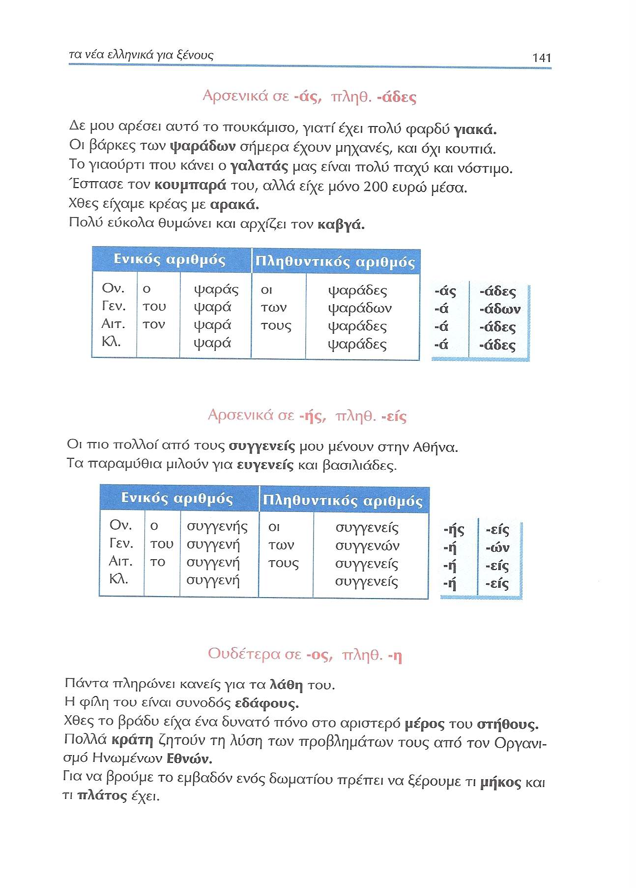
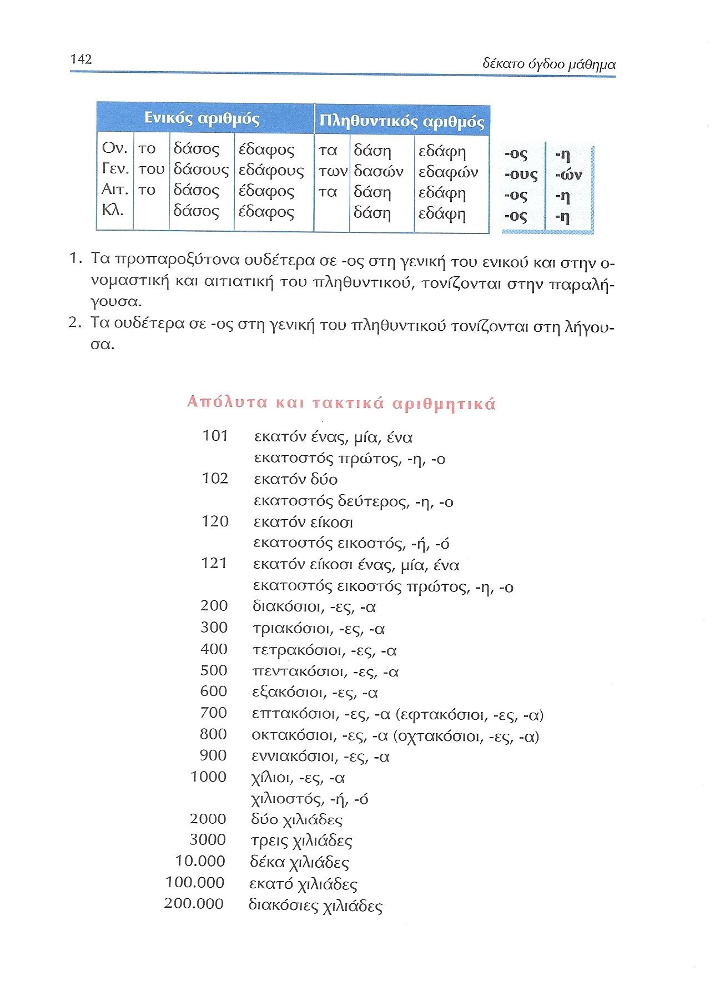
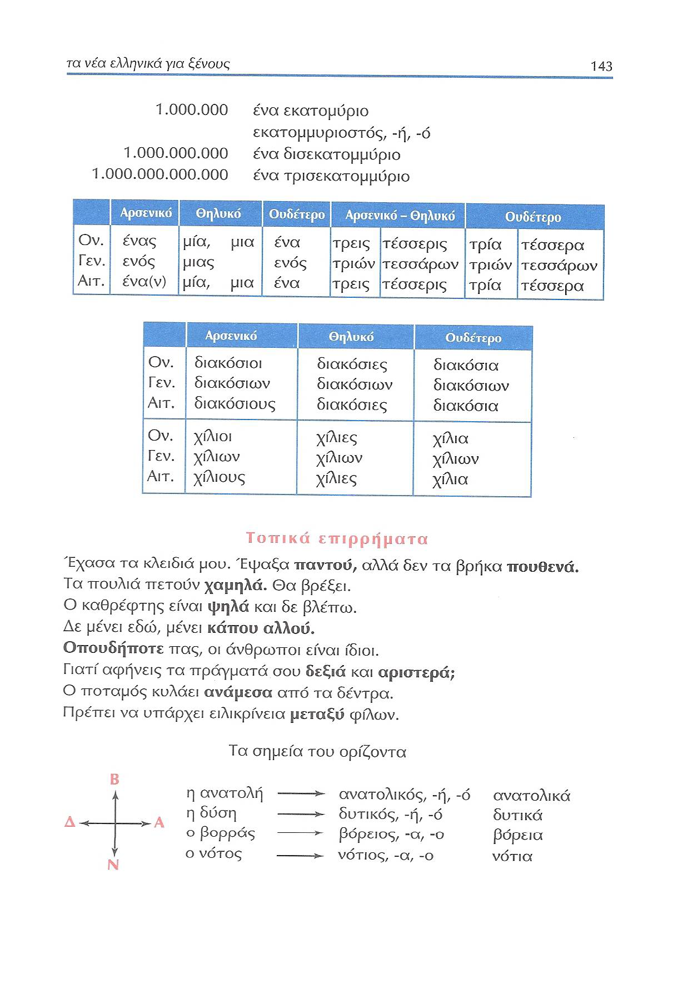
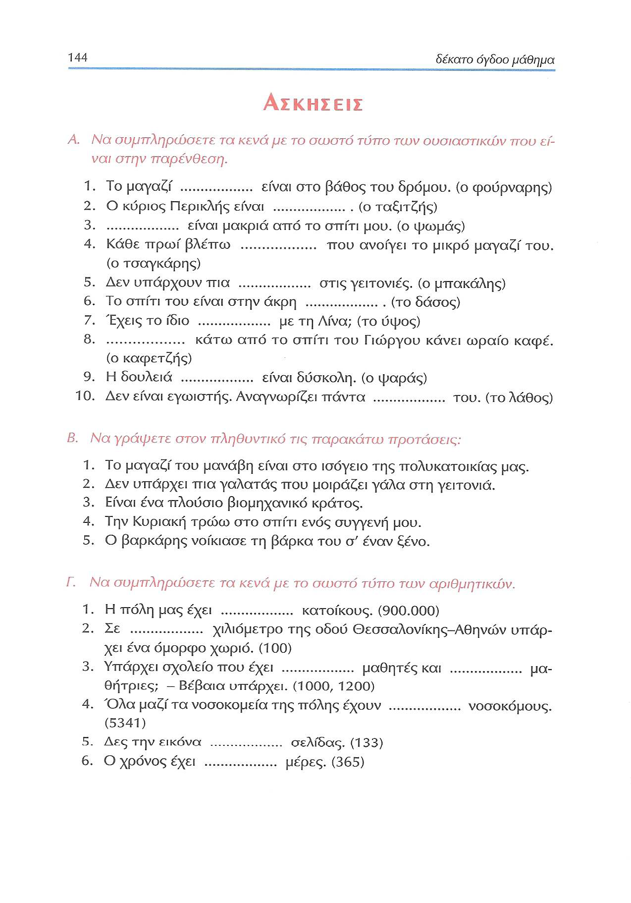
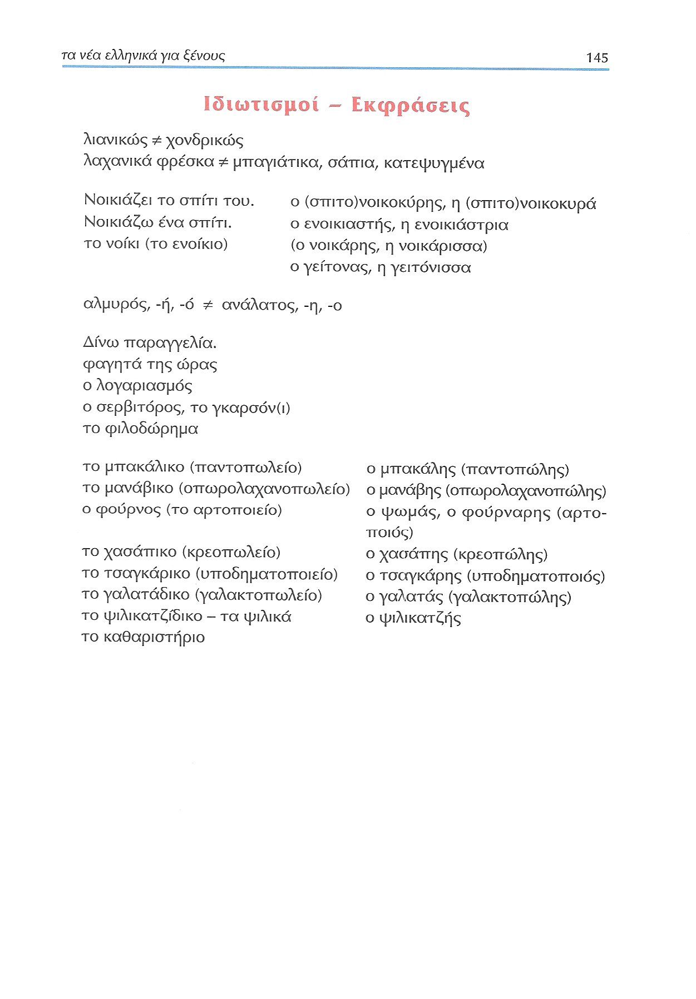

# Lección 18

---

## 139 'Η γειτονιά'

<audio controls="controls">
  <source type="audio/mpeg" src="../GM_Audios/18_He_geitonia.mp3"></source>
</audio>

---

## 140 'Στο εστιατόριο'/-ής -ήδες

---

## 141 Αρσενικά -άς -άδες/-ής -είς, ουδέτερα -ος -η

---

## 142 Απόλυτα και τακτικά αριθμητικά

---

## 143 Απόλυτα και τακτικά αριθμητικά/τοπικά επιρρήματα

---

## 144 Ασκήσεις Α-Γ

---

## 145 Ιδιωτισμοί-Εκφράσεις

