# Lección 19

---

## 146 'Η διασκέδαση στην Ελλάδα'

<audio controls="controls">
  <source type="audio/mpeg" src="../GM_Audios/19_He_diaskedasi_sten_Hellada.mp3"></source>
</audio>

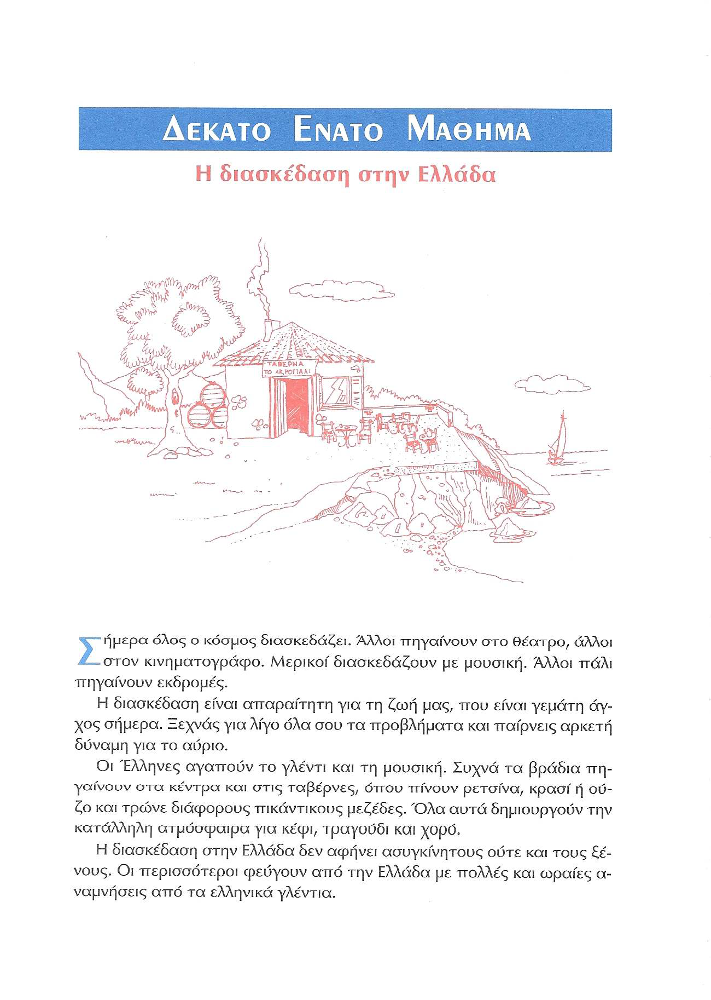

---

## 147 'Τι θα κάνουμε απόψε'/Αντωνυμίες A

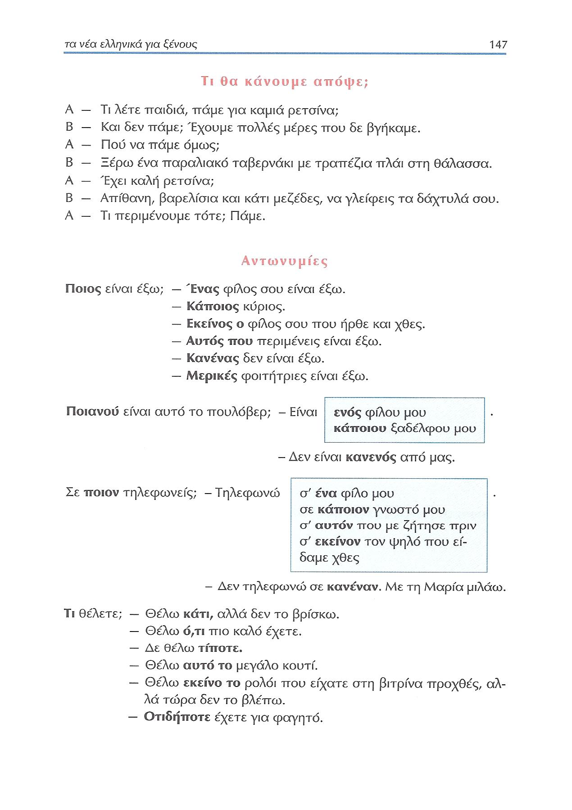

---

## 148 Αντωνυμίες B

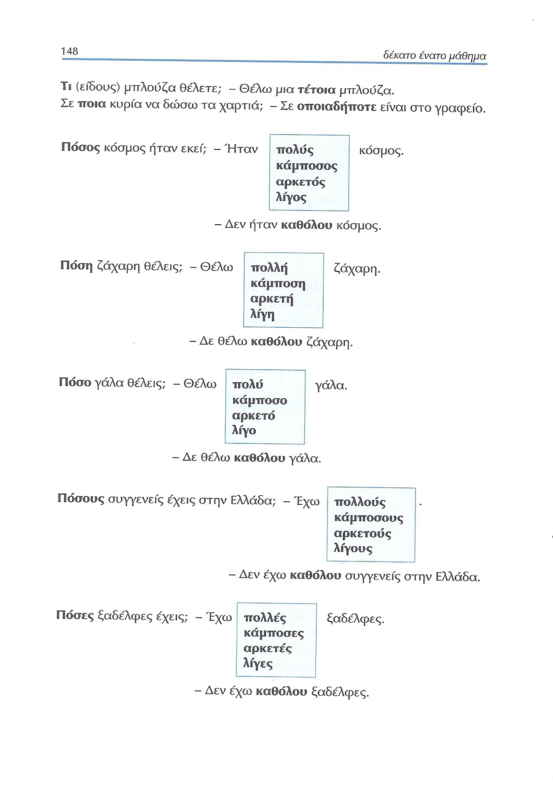

---

## 149 Αντωνυμίες Γ

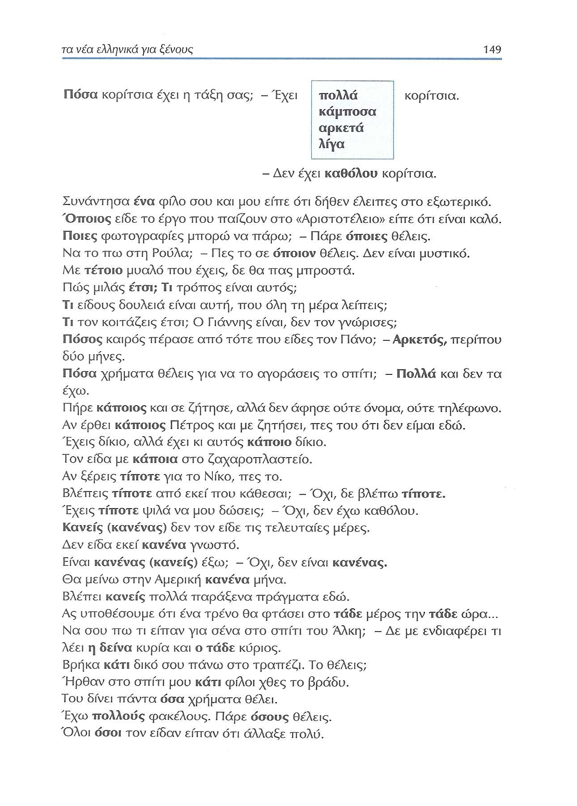

---

## 150  Αντωνυμίες Δ/επιρρήματα Α

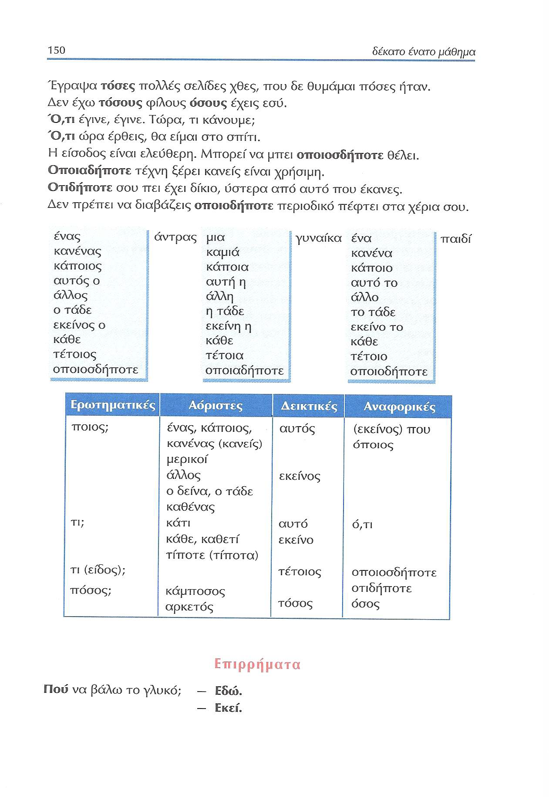

---

## 151 Επιρρήματα Β

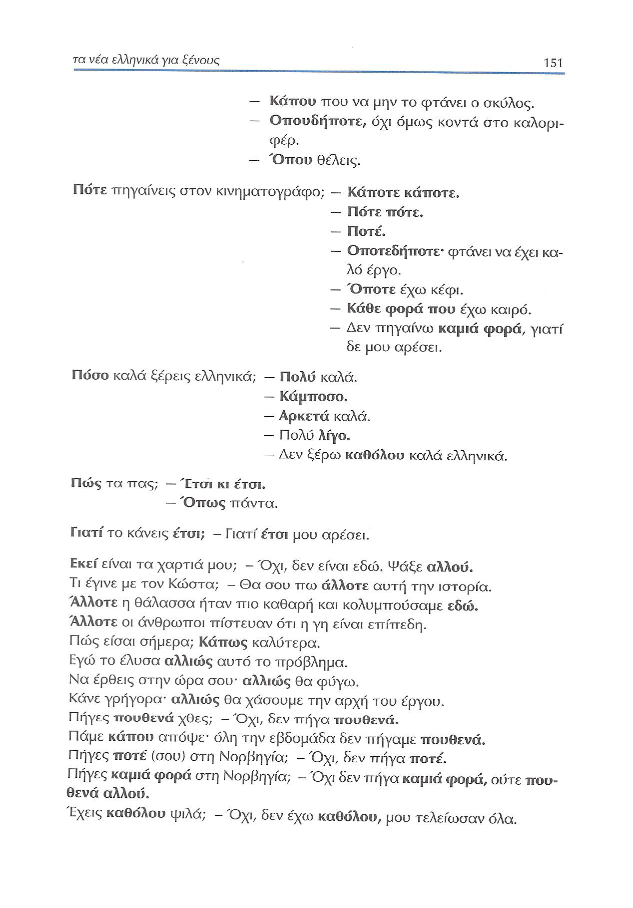

---

## 152  Επιρρήματα Γ

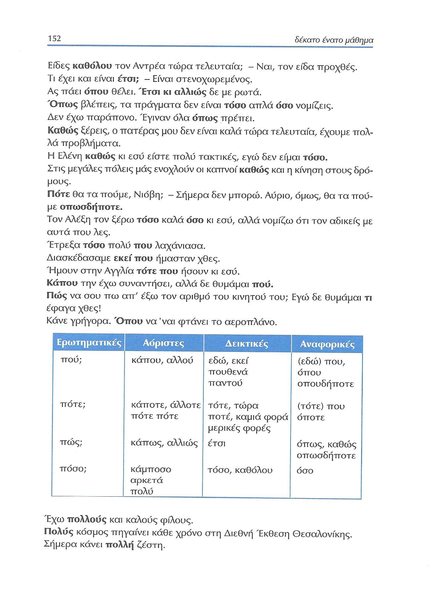

---

## 153 πολύς πολλή πολύ/προσοχή Α

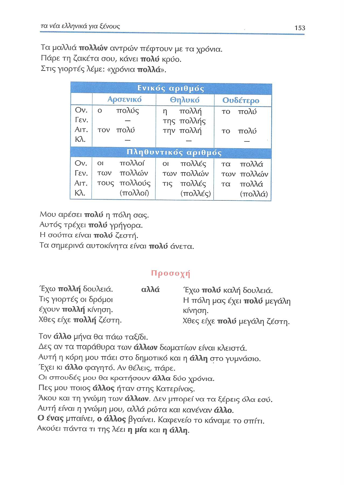

---

## 154 Προσοχή Β/Ασκήσεις Α

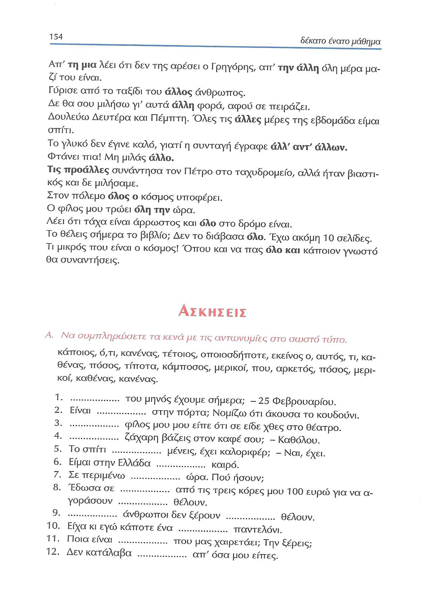

---

## 155 Ασκήσεις Α-Δ

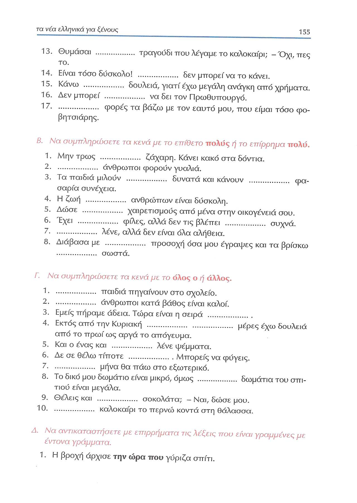

---

## 156 Ασκήσεις Δ-Ε

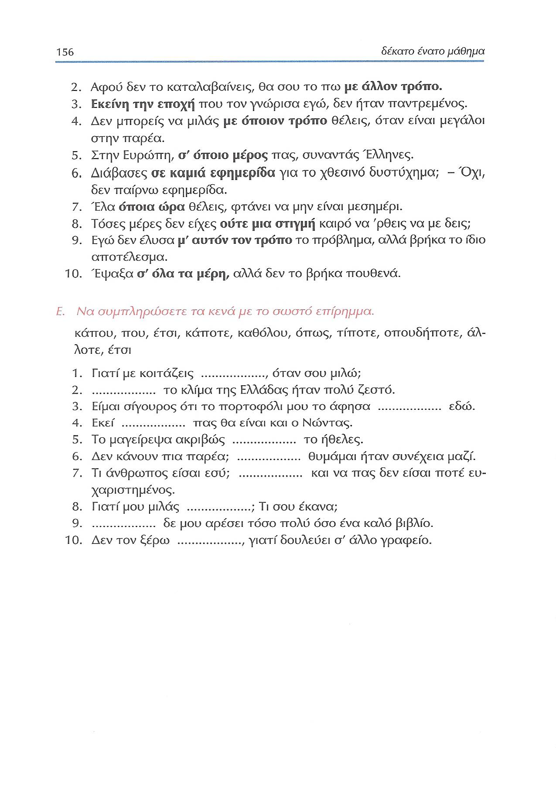

---

## 157 Ιδιωτισμοί-Εκφράσεις

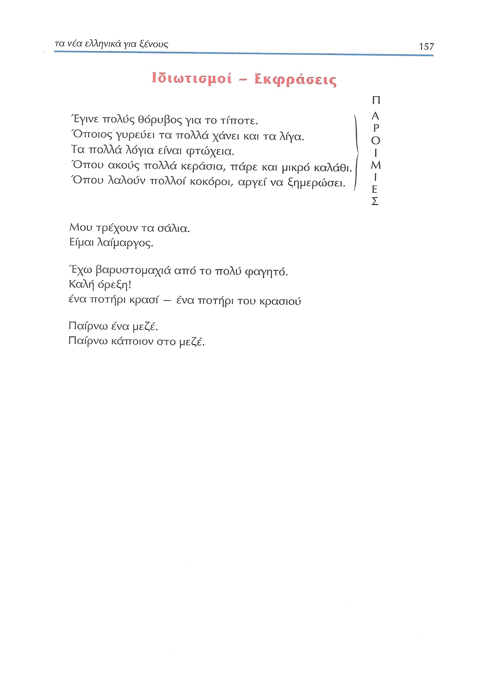
