# Lección 19

---

## 146 'Η διασκέδαση στην Ελλάδα'

<audio controls="controls">
  <source type="audio/mpeg" src="../GM_Audios/19_He_diaskedasi_sten_Hellada.mp3"></source>
</audio>

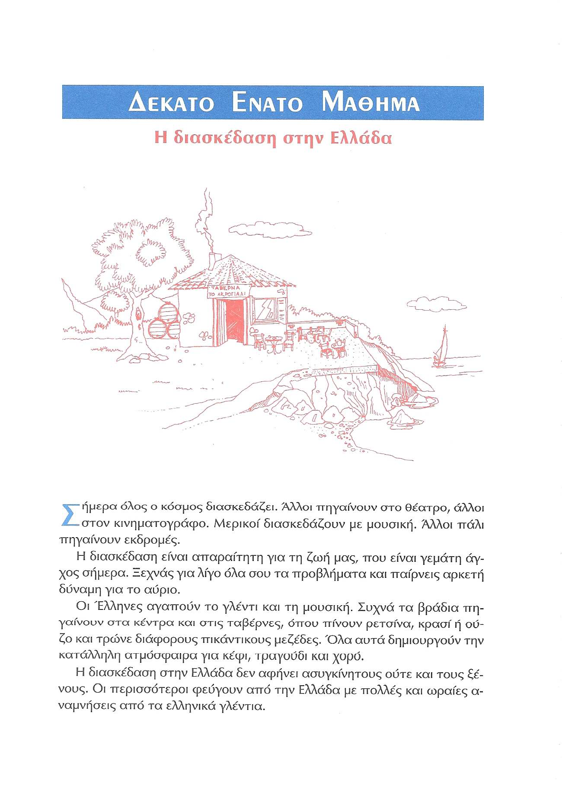

---

## 147 'Τι θα κάνουμε απόψε'/Αντωνυμίες A

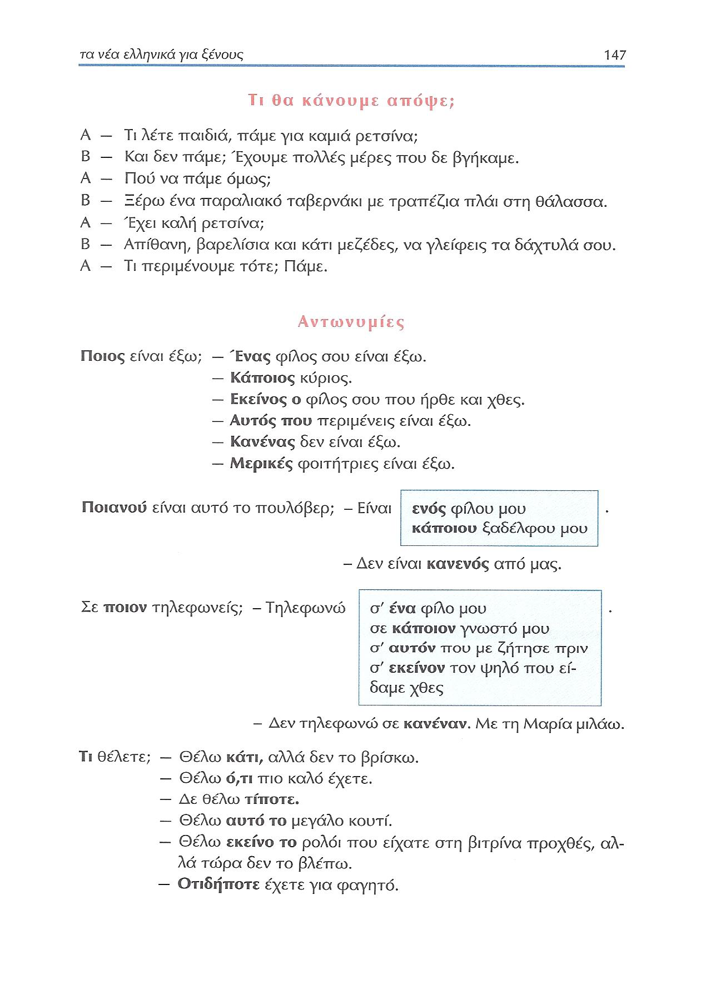

---

## 148 Αντωνυμίες B

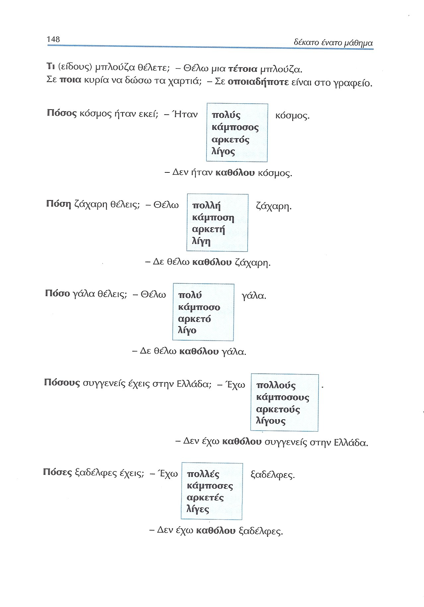

---

## 149 Αντωνυμίες Γ

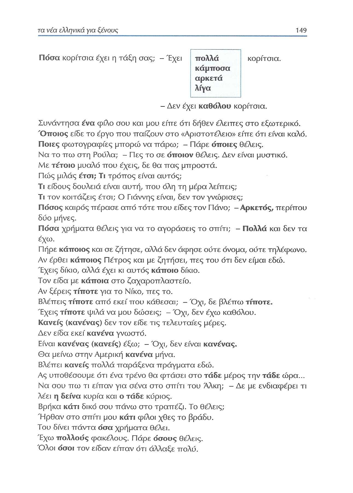

---

## 150  Αντωνυμίες Δ/επιρρήματα Α

| FUNCIÓN |    Suf    |     INTERROGATIVOS     |              INDEFINIDOS               |             DEMOSTRATIVOS              |                      RELATIVOS                      |
| :-----: | :-------: | :--------------------: | :------------------------------------: | :------------------------------------: | :-------------------------------------------------: |
|         | **ποιος** |  **ποιος**; '¿quién?'  |     κά**ποιος** 'alguien, alguno'      |                                        |                 ό**ποιος** 'quien'                  |
|         |           |                        |                                        |                                        |   ό**ποιοσ**δήποτε 'quien quiera que/cualquiera'    |
|         | **ένας**  |                        |         **ένας** 'uno, un(a)'          |                                        |                                                     |
|         |           |                        |     καν**ένας** '¿alguien?/nadie'      |                                        |                                                     |
|         |           |                        |      καν**είς** '¿alguien?/nadie'      |                                        |                                                     |
|         |           |                        |     καθ**ένας** '¿alguien?/nadie'      |                                        |                                                     |
|         |           |                        |                                        |                                        |                                                     |
|         |           |                        |           μερικοί 'algunos'            |                                        |                                                     |
|         |           |                        |                 άλλος                  |                                        |                                                     |
|         |           |                        |                                        |            εκείνος 'aquel'             |          εκείνος που 'aquel que', 'el que'          |
|         |           |                        |                                        |              αυτός 'este'              |           αυτός που 'este que', 'el que'            |
|         |           |                        |          ο δείνα    'fulano'           |                                        |                                                     |
|         |           |                        |          ο τάδε     'mengano'          |                                        |                                                     |
|         |  **τι**   |        **τι**;         |       κά**τι**    'algo, alguno'       |                                        |                  ό,**τι** 'lo que'                  |
|         |           |                        |               κάθε**τι**               |                                        | ό,**τι**δήποτε 'cualquier cosa, cualquier cosa que' |
|         |           |                        |              κάθε 'cada'               |                                        |                                                     |
|         |           |                        | **τί**ποτε/**τί**ποτα '¿algo?', 'nada' |                                        |                                                     |
|         |           |     **τι** (είδος)     |                                        | τέ**το**ιος 'tal, semejante, como ese' |                                                     |
|         |           |                        |                                        |                                        |                                                     |
|         | **πόσος** | **πόσος**;  '¿cuánto?' |          κάμ**ποσος** 'algo'           |           τ**όσος** 'tanto'            |                  **όσος** 'cuanto'                  |
|         |           |                        |                                        |                                        |                                                     |

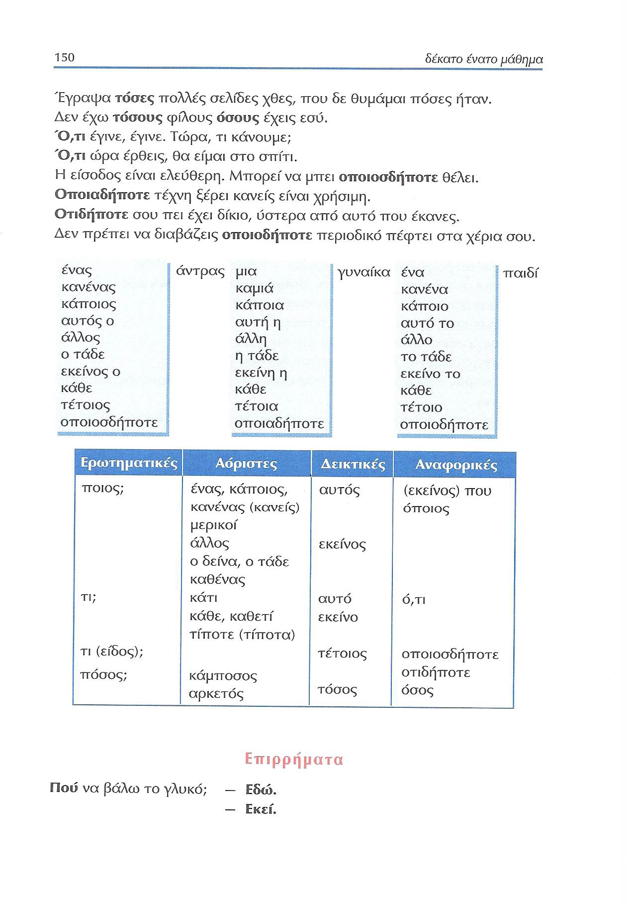

---

## 151 Επιρρήματα Β

|   FUNCIÓN    |   Suf   |    INTERROGATIVOS    |             INDEFINIDOS              |            DEMOSTRATIVOS            |                            RELATIVOS                            |
|:------------:|:-------:|:--------------------:|:------------------------------------:|:-----------------------------------:|:---------------------------------------------------------------:|
|  **LUGAR**   | -**οῦ** |  π**οῦ** '¿dónde?'   |      κάπ**ου** 'en algún lugar'      | π**ου**θενά 'en algún/ningún lugar' |              εδώ π**ου** 'ahora que' ('aquí que')               |
|              |         |                      |      αλλ**ού** 'en otro lugar'       |         παντ**οῦ** 'dónde'          |                        όπ**ου** 'dónde'                         |
|              |         |                      |                                      |                                     |                                                                 |
|              |    ø    |                      |              εδώ 'aquí'              |                                     |      οπ**ου**δήποτε 'dónde quiera que, en cualquier lugar'      |
|              |         |                      |             εκεί 'allí'              |                                     |                                                                 |
|              |         |                      |                                      |                                     |                                                                 |
|  **TIEMPO**  | -**τε** | πό**οτε** '¿cuándo?' |       κάπο**τε** 'alguna vez'        |        τό**τε**  'entonces'         |          τό**τε** που 'justo cuando' ('entonces que')           |
|              |         |                      |  άλλο**τε** 'en algún otro momento'  |  πο**τέ** 'en algún momento/nunca'  |                    όπο**τε** 'cada vez que'                     |
|              |         |                      | πό**τε** πό**τε** 'de vez en cuando' |                                     | οπο**τε**δήποτε 'cuando quiera que', 'en cualquier momento que' |
|              |         |                      | πό**τε** πό**τε** 'de vez en cuando' |                                     |                                                                 |
|              |    ø    |                      |      καμιά φορά   'alguna vez'       |                τώρα                 |                                                                 |
|              |         |                      |    μερικές φορές  'algunas veces'    |                                     |                                                                 |
|              |         |                      |                                      |                                     |                                                                 |
|  **MANERA**  | -**ως** |  π**ώς**   '¿cómo?'  |      κάπ**ως** 'de algún modo'       |                                     |            όπ**ως**  'como' ('de la manera en que')             |
|              |         |                      |      αλλι**ώς** 'de otro modo'       |                                     |              καθ**ώς** 'según' ('porque, cuando')               |
|              |         |                      |                                      |                                     |              οπ**ωσ**δήποτε  'de cualquier manera'              |
|              |    ø    |                      |                                      |          έτσι   'así, tan'          |                                                                 |
|              |         |                      |                                      |                                     |                                                                 |
| **CANTIDAD** | -**σο** | πό**σο**  '¿cuánto?' |     κάμπο**σο** 'algo, un poco'      |       τό**σο**   'tan, tanto'       |                       ό**σο**   'cuanto'                        |
|              |         |                      |                                      |                                     |                                                                 |
|              |    ø    |                      |         αρκετά    'bastante'         |                                     |                                                                 |
|              |         |                      |          πολύ 'muy, mucho'           |                                     |                                                                 |

**Combinaciones**:

- πουθενά αλλού 'en ningún (πουθενά) otro sitio (αλλού)'
- κάπου αλλού  'en algún (κάπου) otro sitio (αλλού)'
- τόσο ... όσο ... 'tanto como', 'tan  {Adv | Adj.} .. como ...' (comparativa)
- έτσι και αλλιώς: 'en cualquier caso'
- τόσο ... που ... 'tanto/tan {Adv | Adj.} ... que ...' (consecutiva)
- εκεί που 'allí donde' (lugar)/'justo cuando' (tiempo)
- τότε που 'cuando' (tiempo> lit. 'entonces cuando')

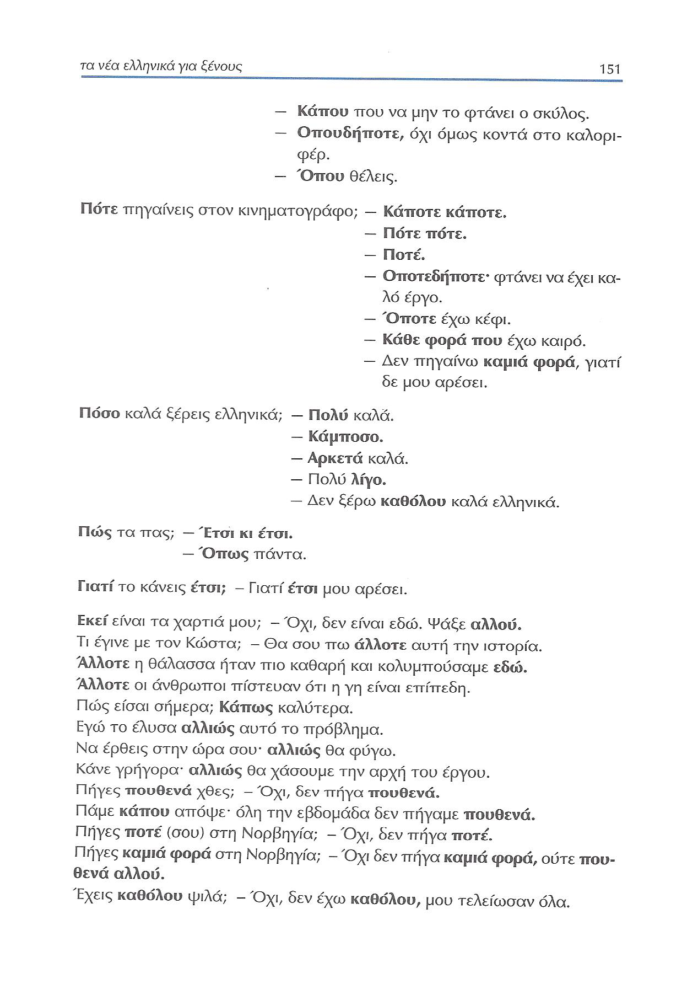

---

## 152  Επιρρήματα Γ

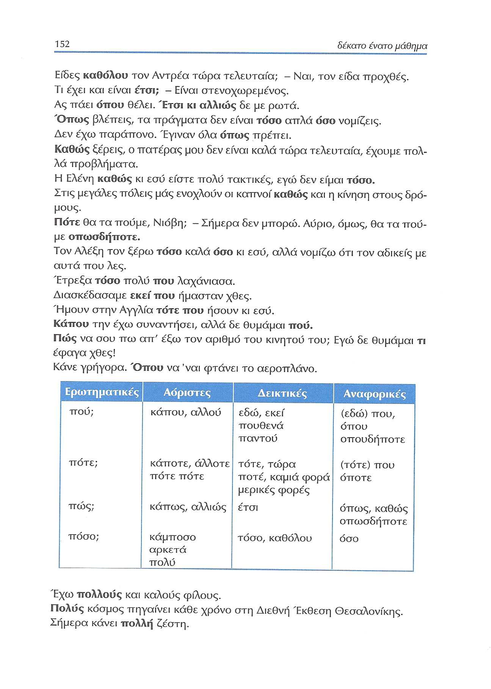

---

## 153 πολύς πολλή πολύ/προσοχή Α

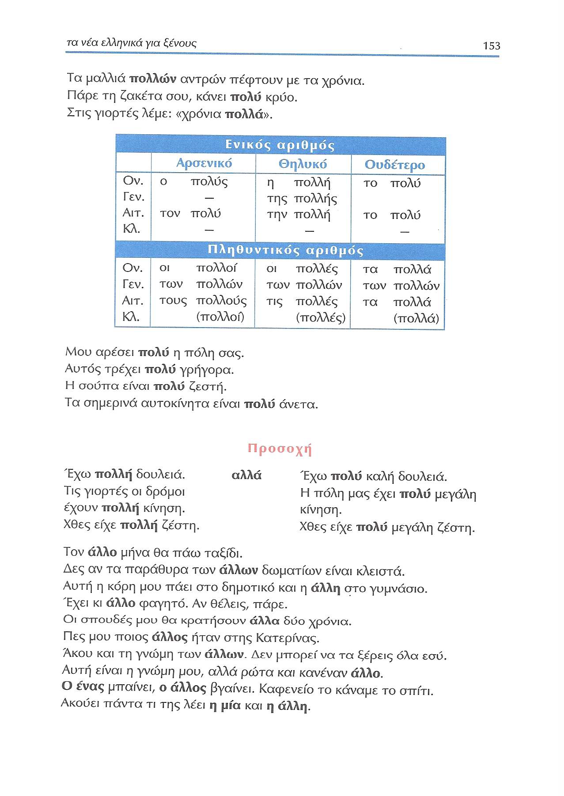

---

## 154 Προσοχή Β/Ασκήσεις Α

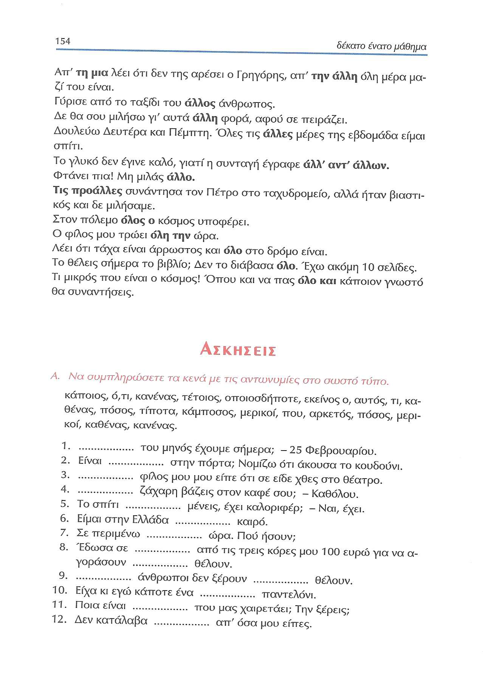

---

## 155 Ασκήσεις Α-Δ

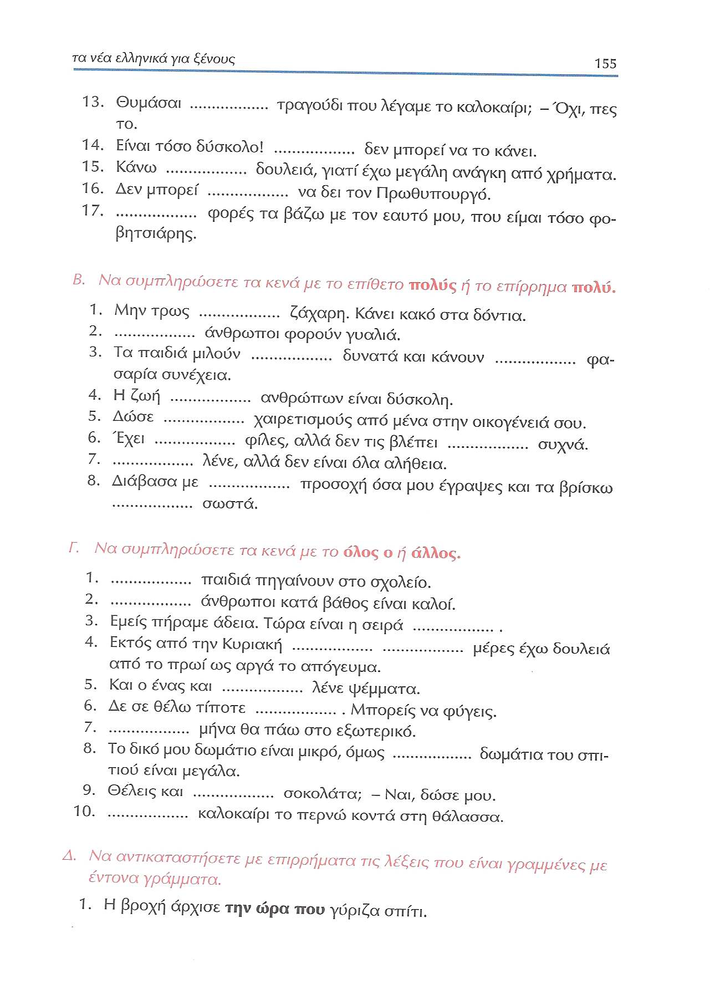

---

## 156 Ασκήσεις Δ-Ε

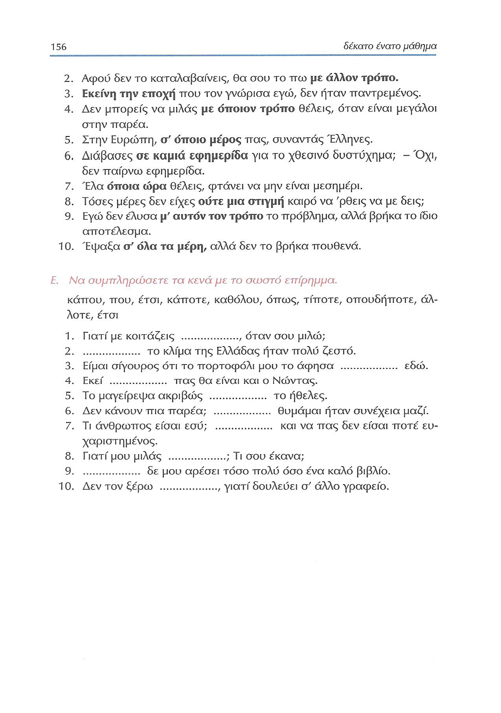

---

## 157 Ιδιωτισμοί-Εκφράσεις

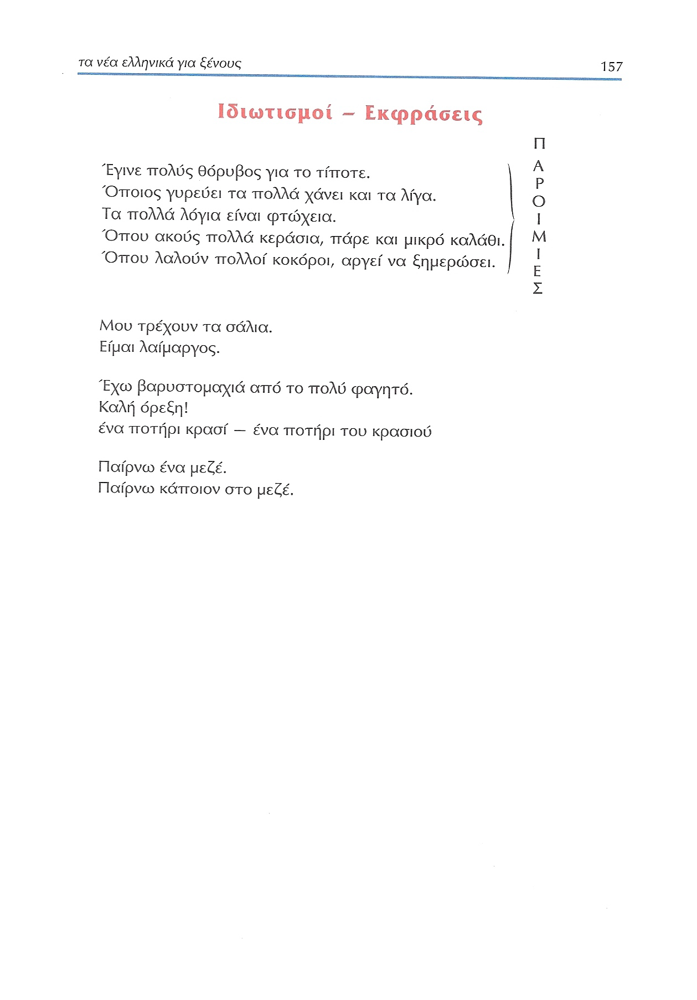
