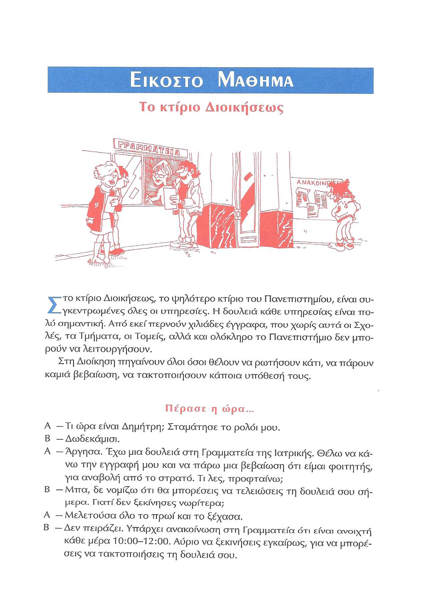
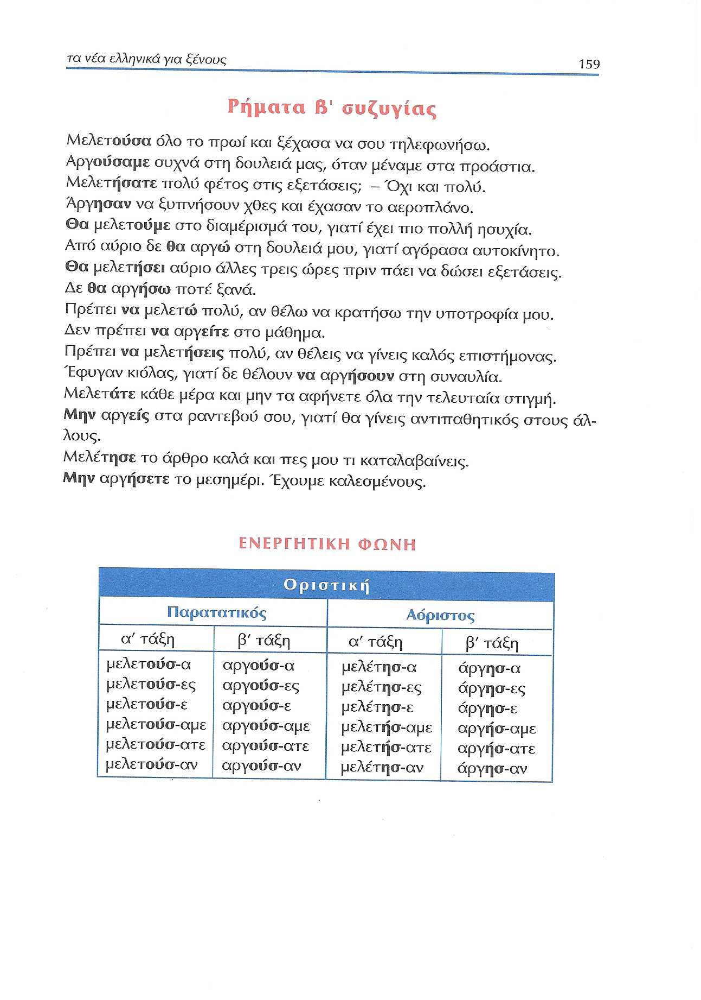
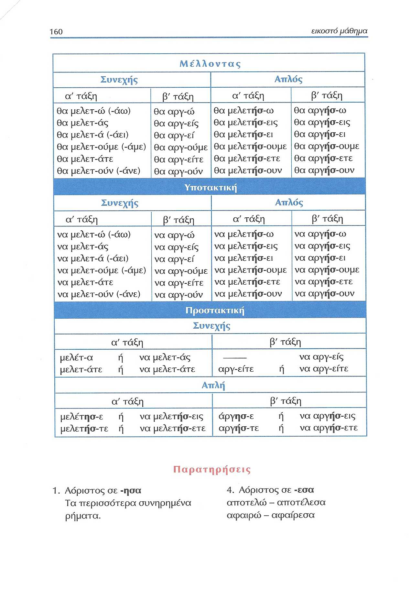
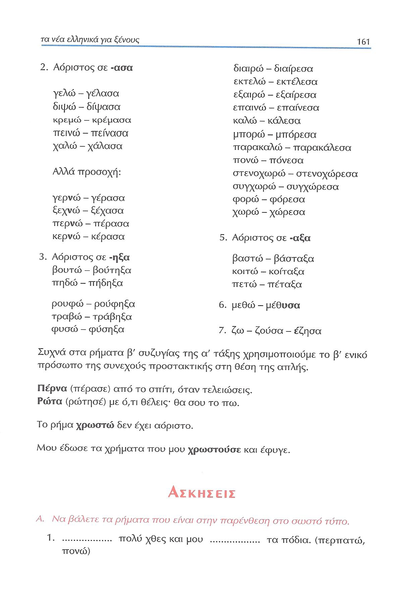
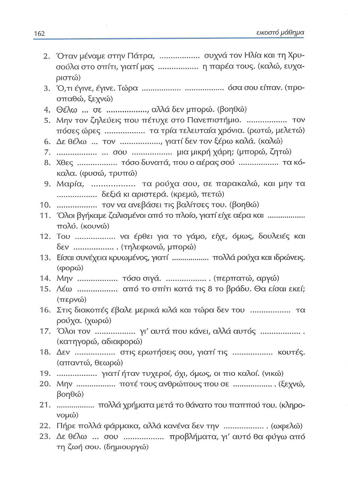
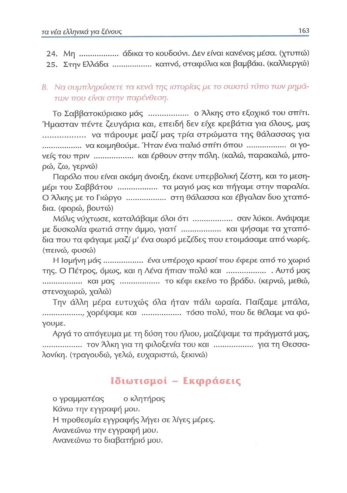
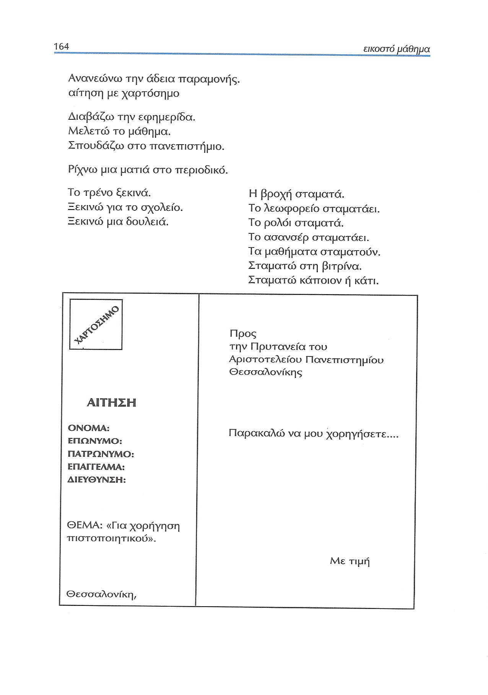

# Lección 20

---

## 158 'Το κτίριο Διοικήσεως'

<audio controls="controls">
  <source type="audio/mpeg" src="../GM_Audios/20_To_kterio_dioikeseos.mp3"></source>
</audio>

---

## 159 Ρήματα Β' συζυγίας (ενεργητική φωνή)

---

## 160 Ρήματα Β' συζυγίας (ενεργητική φωνή): παρατηρήσεις

---

## 161 Ρήματα Β' συζυγίας (ενεργητική φωνή): παρατηρήσεις/ασκήσεις

παρατηρήσεις

---

## 162 Ασκήσεις: Α

παρατηρήσεις

---

## 163 Ασκήσεις: Α-Β/Ιδιωτισμοί-Εκφράσεις

παρατηρήσεις

---

## 164 Ιδιωτισμοί-Εκφράσεις

παρατηρήσεις
