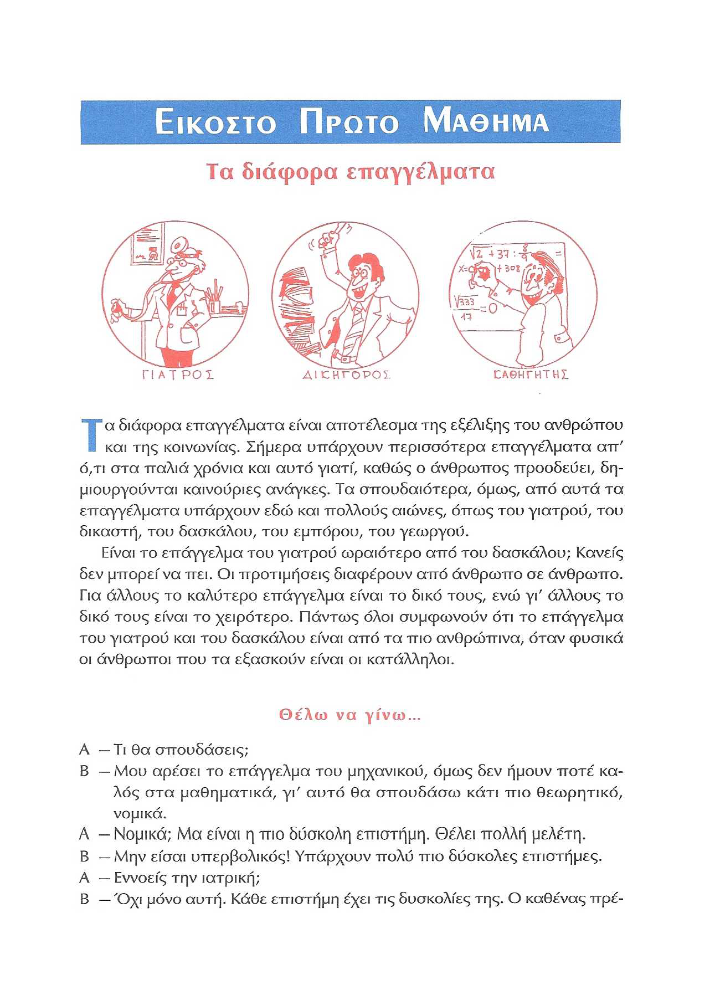
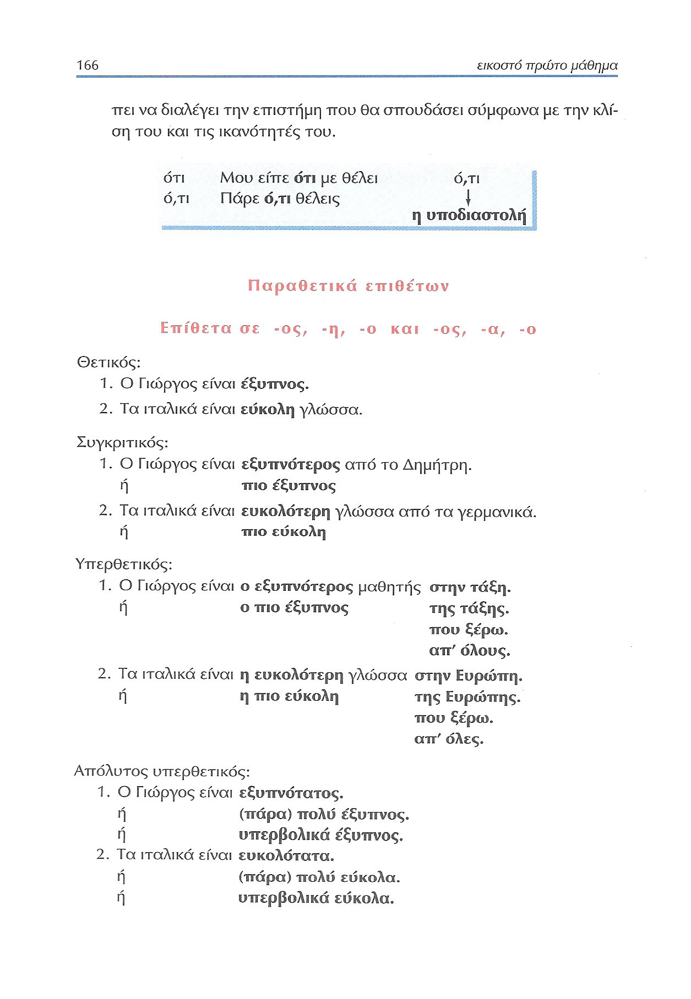
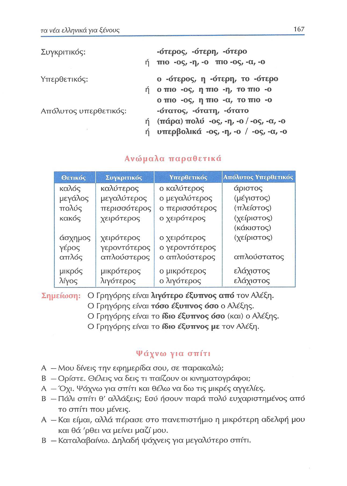
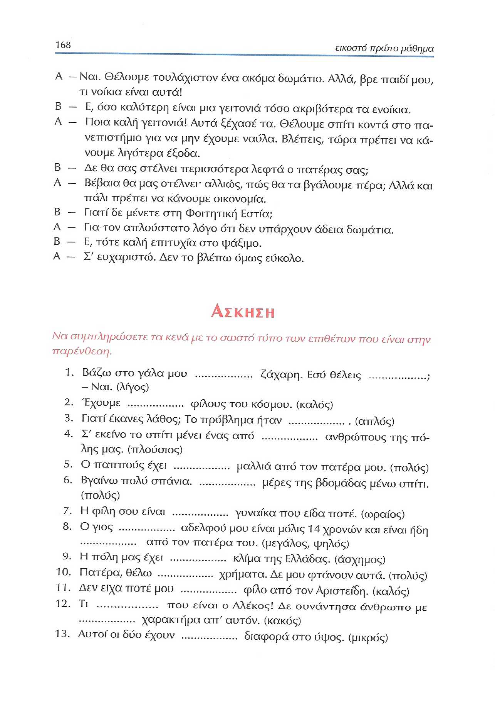
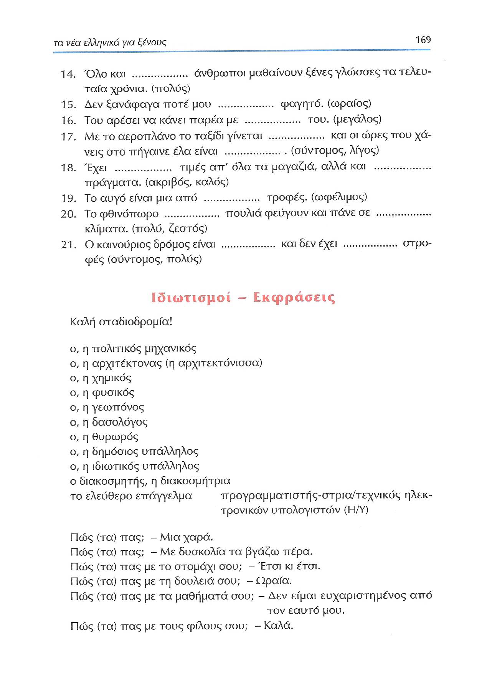

# Lección 21

---

## 165 'Τα διάφορα επαγγέλματα'/'Θέλω να γίνω'

<audio controls="controls">
  <source type="audio/mpeg" src="../GM_Audios/21_Ta_diaphora_epangelmata.mp3"></source>
</audio>

---

## 166 ο(,)τι/Παραθετικά επιθέτων

---

## 167 Ανώμαλα παραθετικά/'Ψάχνω για σπίτι'

---

## 168 'Ψάχνω για σπίτι'/Ασκήσεις

---

## 169 Ασκήσεις/Ιδιωτισμοί-Εκφράσεις

