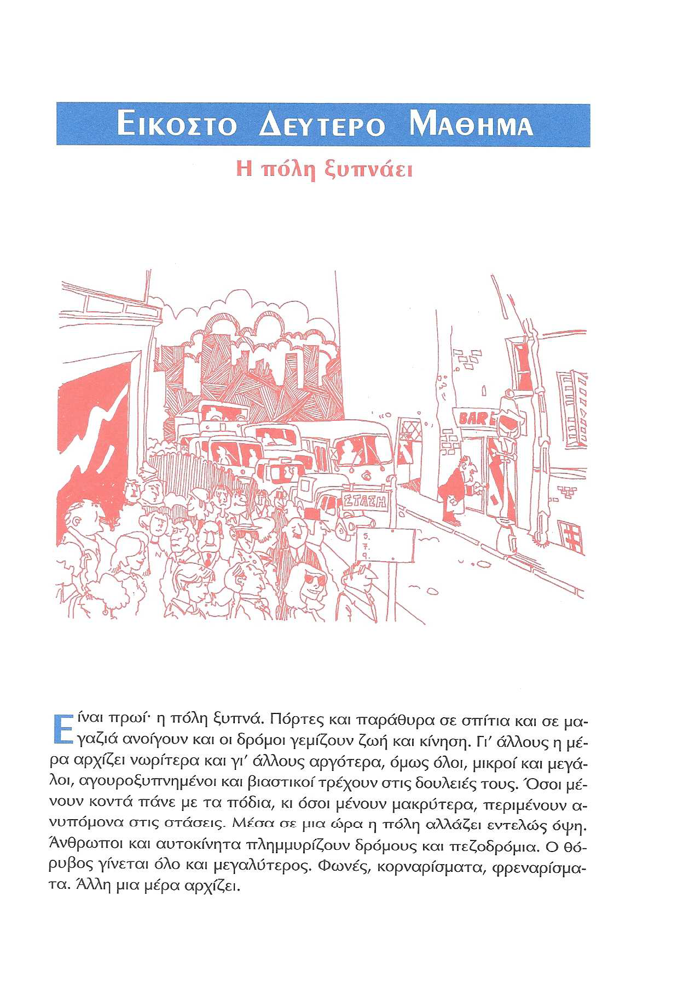
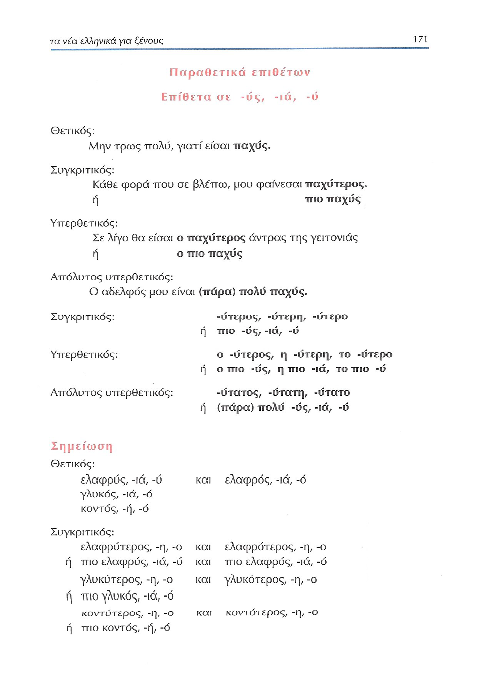
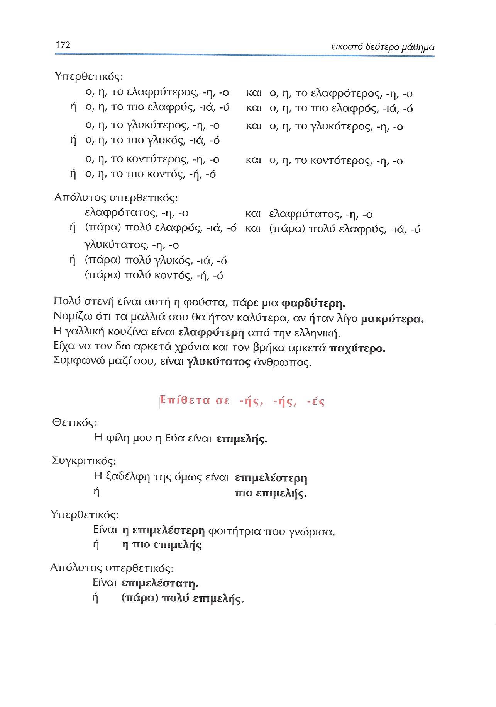
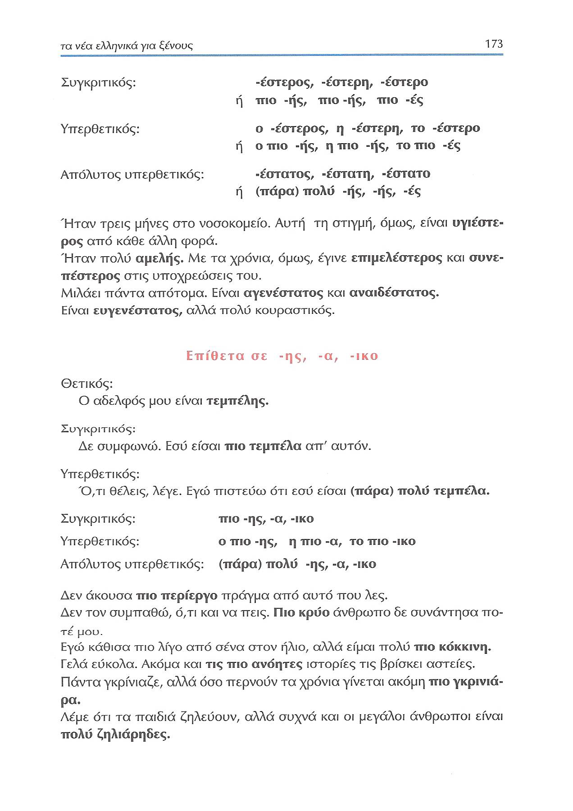
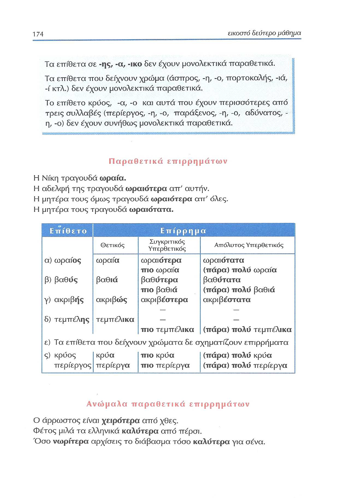
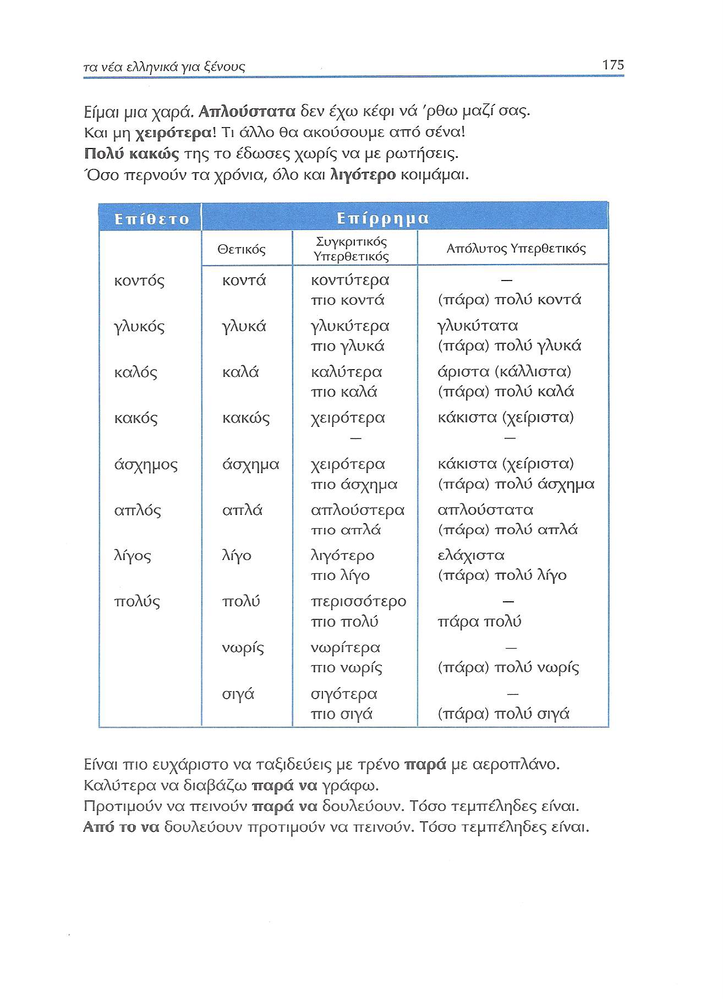
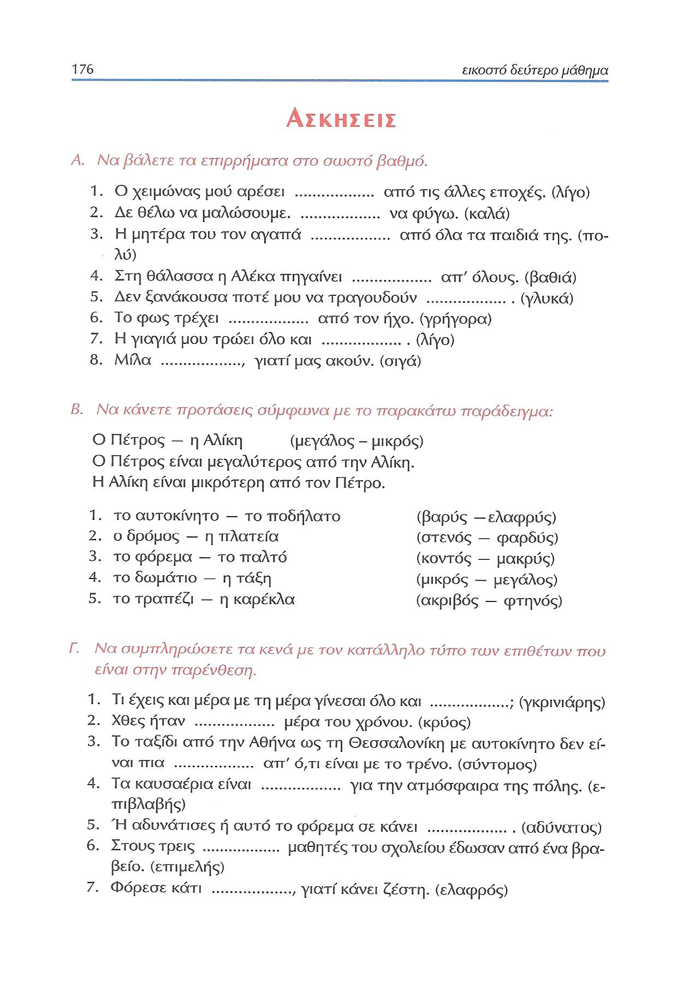
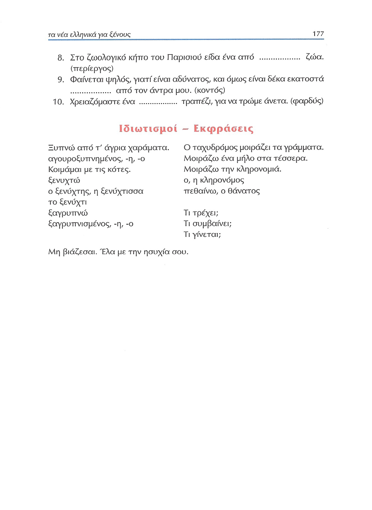

# Lección 22

---

## 170 'Η πόλη ξυπνάει'

<audio controls="controls">
  <source type="audio/mpeg" src="../GM_Audios/22_He_poli_ksypnaei.mp3"></source>
</audio>

---

## 171 Παραθετικά επιθέτων -ύς -ιά -ύ

---

## 172 Παραθετικά επιθέτων -ής -ής -ές

---

## 173 Παραθετικά επιθέτων -ης -α -ικο

---

## 174 Παραθετικά επιρρημάτων

---

## 175 Ανώμαλα παραθετικά επιρρημάτων

---

## 176 Ασκήσεις Α-Γ

---

## 177 Ασκήσεις Γ/Ιδιωτισμοί-Εκφράσεις

