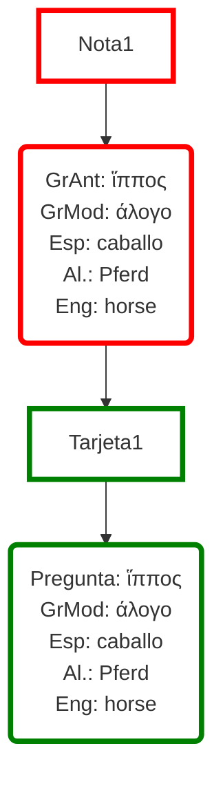
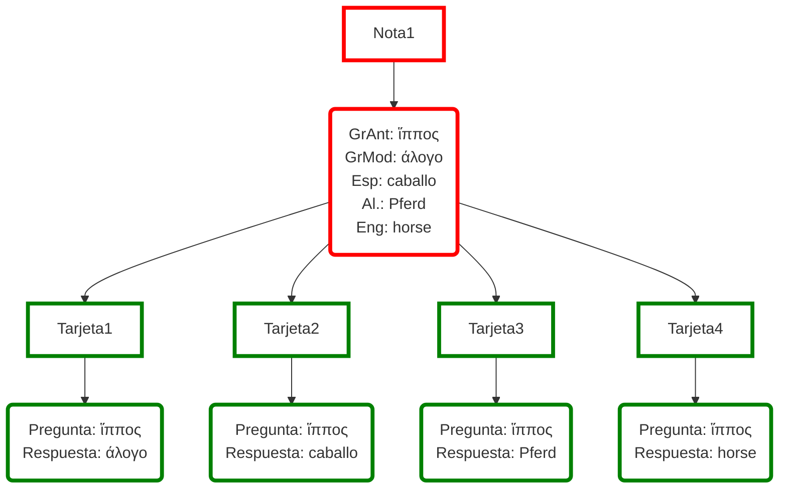
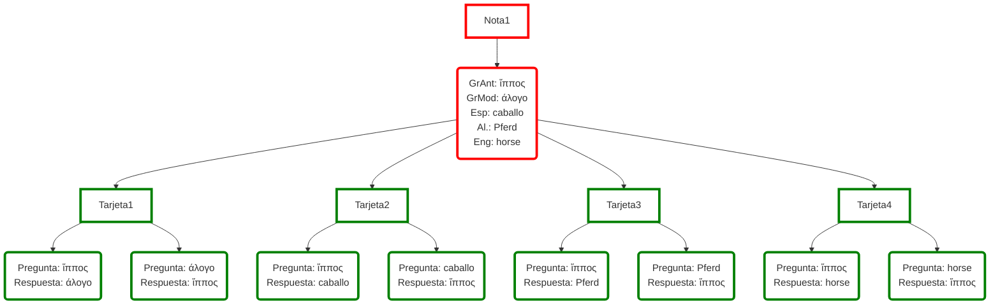

# Anki (<ruby>暗記<rt>memoria</rt></ruby>)

## 1. Información previa

### 1.1. Página central

Esta es la página central de [Anki](https://apps.ankiweb.net). 

!!! warning "Advertencia"
    Otros creadores y empresas han copiado el nombre y logo de este programa y han creado otras webs y aplicaciones (mayoritariamente de pago): no bajéis nada que no proceda o sea mencionado en esta página central. Anki es totalmente gratuito salvo en su versión para iOS (iPhone y iPad), que es la única fuente de ingresos del creador.

### 1.2. Descarga

Hay versiones para diferentes [plataformas](https://apps.ankiweb.net/#downloads): MacOS, Linux, Windows, Android, iOS.

### 1.3. Guía

Página con la [guía](https://docs.ankiweb.net/intro.html) completa. Es muy importante leerla aunque no se entienda todo. La lectura superficial de la guía permite hacerse una idea general de todo lo que se puede hacer con Anki. Posteriormente se puede consultar de manera más detalla para aprender alguna funcionalidad determinada.

### 1.4. Ankiweb

Tenéis que crearos una cuenta en [Ankiweb](https://ankiweb.net) y vincularla con vuestra aplicación en el ordenador y en los dispositivos móviles. Esta cuenta os permitirá (i) sincronizar vuestros dispositivos, (ii) bajaros cursos de otros usuarios e (iii) incluso estudiar vuestros cursos simplemente con un navegador desde cualquier dispositivo.

1. [Sincronización 1](https://docs.ankiweb.net/preferences.html#syncing)
2. [Sincronización 2](https://docs.ankiweb.net/syncing.html)

!!! warning "¡Atención!"
    1. Si estudiáis con cualquier dispositivo, antes de salir de la aplicación, realizad una sincronización con Ankiweb: de esta manera vuestra sesión será compartida con el resto de dispositivos. En las preferencias se puede establecer que el programa sincronice automáticamente cuando se cierre.
    2. Puede haber casos de inconsistencias y el programa os preguntará si deseáis conservar los datos de vuestro dispositivo y subirlos a Ankiweb o bajar la versión de Ankiweb.
    3. Si tenéis el programa para sincronizarse al salir, pero no habéis salido de él, no se sincronizará con Ankiweb. Si comenzáis sesión desde otro dispositivo, los cambios no estarán registrados y trabajaréis sobre datos antiguos.

### 1.5. Cursos compartidos 

Los cursos creados individualmente pueden ser [compartidos](https://ankiweb.net/shared/decks) con otros usuarios, si así se desea (no es obligatorio).

Buscad el curso que queráis, bajadlo a vuestro ordenador y desde allí subidlo a vuestra aplicación pulsando dos veces sobre el archivo. Una vez se abra en la aplicación del ordenador, se sincronizará con vuestra cuenta de Ankiweb y, por tanto, con todos los dispositivos en los que tengáis instalado el programa.

Usar cursos de otras personas no solo tiene la ventaja de que nos permite ahorrar tiempo a la hora de crear tarjetas, sino que se puede aprender nuevas formas de crear tarjetas y copiar automáticamente su formato: en cuanto os descarguéis ese curso, todos los formatos de tarjetas serán añadidos a vuestra versión de Anki.

### 1.6. Recursos

El autor del programa tiene también una página con una recopilación de [recursos](https://docs.google.com/document/d/1xWnF_r0z4cRNOHDeXGYOuUH3FsDAzdab8VUjx4lnzL4/edit?tab=t.0#heading=h.m2bqvnhbwfs6).

### 1.7. Tutoriales en Youtube:

1. [Vídeos del creador](https://docs.ankiweb.net/getting-started.html#videos)
2. https://youtu.be/6BJgxHC3Yuc?si=V88vflKrOICT-2yJ
3. https://youtube.com/playlist?list=PLfQ7n_Tfs4mvzYYrke9zk7vlSr5txovwC&si=_du5kwn4YtOaBf6b
4. https://youtu.be/AjdUxCnAXJw?si=nuxsazpNeLeVOTOV

### 1.8. Tipología de preguntas

#### 1.8.1. Ejemplos

Estos son algunos tipos de preguntas que pueden hacerse para comprobar los conocimientos adquiridos. 

!!! question "Tipo 1"
    - Pregunta: ¿Qué significa ἵππος?
    - Respuesta: 'caballo'.

!!! question "Tipo 2"
    - Pregunta: ¿Cómo se dice 'caballo' en griego antiguo?
    - Respuesta: 'ἵππος'.

!!! question "Tipo 3"
    - Pregunta: ¿Cuál es el nom. sg. de ἵππο-?
    - Respuesta: 'ἵππος'.

!!! question "Tipo 4"
    - Pregunta: ¿Dime el caso y número de la palabra ἵππος?
    - Respuesta: acusativo singular.

!!! question "Tipo 5"
    - Pregunta: Elige la forma adecuada del lema ἵππος en la frase 'εἶδόν τινα _____ πόρρωθεν'
      -  ἵππος
      -  ἵππον
      -  ἵππε
      -  ἵππου
      -  ἵππῳ
      -  ἵπποι
      -  ἵππους
      -  ἵππων
      -  ἵπποις
      -  ἵππω
      -  ἵπποιν
    - Respuesta: ἵππον.

!!! question "Tipo 6"
    - Pregunta: escribe la forma adecuada del lema ἵππος en la frase 'εἶδόν τινα _____ πόρρωθεν'
    - Respuesta: ἵππον.

!!! question "Tipo n"

#### 1.8.2. Parámetros

Los parámetros para realizar preguntas son los siguientes:

1. El tipo de componente gramatical que se quiere poner a prueba:
    1. Vocabulario.
    2. Fonética.
    3. Morfología fléxiva.
    4. Morfología derivativa y composicional.
    5. Sintaxis.

2. Si se tiene en cuenta el aspecto activo o pasivo del lenguaje.
    1. El estudiante tiene que reconocer formas.
    2. El estudiante tiene que producir.

3. La simplicidad o complejidad de la pregunta.
    1. Se pregunta por un solo factor: '¿cuál es el ac. sg. de ἵππο-?'. Solo se hace una pregunta: el caso concreto.
    2. Se pregunta por varios factores: 'pon la forma adecuada de ἵππο- (caso y número) en la oración 'εἶδόν τινα _____ πόρρωθεν'. Aquí el alumno no solo debe saber la forma ἵππον, sino que debe saber que el acusativo es el caso del complemento directo.

#### 1.8.3. Adición de preguntas

Cread más tipos de preguntas para cubrir todos los aspectos que se estudian al aprender una lengua.

Intentad ordenar la tipología que creéis por grado de dificultad.

Podéis inspiraros en los métodos de latín, griego o cualquier lengua moderna que tengáis a vuestra disposición.

## 2. Datos y razonamientos

### 2.1. Repetición espaciada

Hermann Ebbinghaus
[Curva del olvido](/Vocabulario/Vocab_Intro/#415-repeticion-espaciada)

### 2.2. Métodos de estudio

[Diferentes posibilidades](/Vocabulario/Vocab_Intro/#4-metodos-de-estudio)

## 3. Guía de Anki

### 3.1. Interfaz gráfica

- Mazos

- Añadir

- Explorar

- Estadísticas

- Sincronizar

- Descargar mazos compartidos

https://ankiweb.net/shared/decks

- Crear mazos

- Importar mazos

---

### 3.2. Mazos: estudio

#### 3.2.1. Selección del curso

Podemos (i) seleccionar un curso que ya tengamos, (ii) descargarnos un curso creado por otros usuarios y puesto a disposición libre; (iii) crear un curso nuevo.
Vamos a bajarnos un curso:

(i) Curso de griego moderno: https://ankiweb.net/shared/info/778641525
(ii) Lo descargamos en nuestro ordenador.
(iii) Cliqueamos el botón "Importar archivo" y lo añadimos a nuestro listado de cursos.

#### 3.2.2. Página de inicio

Seleccionamos el curso que deseemos y aparece esta pantalla:

Nos indica los siguientes datos:

- **Nuevas: 50**. En las opciones yo he establecido que quiero estudiar 50 nuevas palabras cada día.
- **Aprendiendo: 3**. Hay 3 tarjetas que no sé bien.
- **A repasar: 219**. Tengo que repasar 219.

Anki no solo presenta tarjetas nuevas cada día (de acuerdo con nuestras opciones), sino que nos hace repasar todas las vistas anteriormente con una frecuencia inversamente proporcional a lo bien que las sabemos: las que mejor sabemos, con menor frecuencia; las que peor sabemos, con mayor frecuencia.

#### 3.2.3. Estudio

Anki nos presenta el anverso de la tarjeta que queremos estudiar:

Dependiendo del tipo de tarjeta que tengamos (básica, cloze, type, etc.), tendremos que reaccionar con una acción determinada. Una vez que hayamos respondido a la pregunta, comprobamos la respuesta correcta pulsando "Mostrar respuesta":

El usuario debe ahora decidir si se sabe o no el contenido de la tarjeta y puntuar el resultado: "Otra vez" (mal), "Difícil" (algo mejor), "Bien" ("mejor") y "Fácil". Hay otras posibilidades.
El programa **no puntúa** el conocimiento del usuario **automáticamente**.
De acuerdo con la puntuación adjudicada Anki muestra de nuevo las tarjetas con una frecuencia determinada.
Si se detecta algún error, el usuario puede corregir la tarjeta.
Hay otras opciones:

Yo no me complico la vida: si me la sé, marco "Bien". Si no, marco "Otra vez". Si la palabra es demasiado fácil y se quiere dejar de estudiar para que no incremente el número de repasos, se puede "Enterrar" o "Suspender".

### 3.3. Añadir

Se pueden añadir notas y tarjetas una a una mediante la pantalla "Añadir":

Hay que comprobar que se añade al mazo de tarjetas deseado y que el tipo de nota es el que se pretende. Como se verá más adelante, la misma nota puede tener más de un tipo de tarjeta.
Aparte de introducir el texto en los campos "Texto" y "Extra" (otros tipos de notas tienen otros campos), hay que pulsar el botón "Añadir" para que se efectúe la introducción de datos.
Esta manera de introducir los datos es lenta y pesada. Es mejor crear una tabla en (i) un procesador de texto, (ii) una hoja de cálculo (Excel o semejantes), o (iii) base de datos, e importar los datos desde ellos.

### 3.4. Explorar

La pantalla "Explorar" permite ver todos los elementos que forman parte de Anki:

1. Búsquedas guardadas.
2. Hoy.
3. Banderas.
4. Estado de tarjetas.
5. Mazos.
6. Tipos de notas.
7. Etiquetas.

El apartado "Mazos" contiene un listado de todos los mazos y se puede ver dentro de ellos las "Notas" y las "Tarjetas".

El apartado contiene los tipos de notas: básico, básico

Anki tiene diferentes tipos de notas. Estos tipos se pueden modificar para crear otros nuevos.

#### Notas vs. tarjetas

Un concepto muy importante es diferenciar entre "Notas" y "Tarjetas". Imaginemos que tenemos una única nota en la que tenemos las traducciones a diferentes lenguas de la palabra ἵππος:

Esta nota única está compuesta de diferentes campos, uno por cada lengua.
A partir de esta única nota se podrían crear diferentes tarjetas. Por ejemplo se podría crear una única tarjeta en la que se presenta al usuario la palabra en griego antiguo y este tiene que aprender su significado en las restantes lenguas:

Sin embargo, lo mejor es tener tarjetas lo más simples posible para que el usuario se centre solo en un aspecto concreto: cuanto más elementos tenga que memoriza por tarjeta, más difícil le será lograrlo. Es mejor muchas tarjetas simples que una sola muy compleja.
Por ejemplo, se podría crear una tarjeta por cada pareja de lengua. Podemos reducirlas para simplificar al emparejamiento del griego antiguo con cada una de las demás lenguas modernas

Pero esto permitiría tan solo estudiar desde el griego antiguo a otras lenguas (conocimiento) pasivo, pero sería mejor tener el doble de tarjetas para estudiar en el sentido inverso:

El poder de Anki es la separación entre notas y tarjetas. Mediante los "Tipos de tarjetas" Anki puede generar automáticamente un **gran número** de tarjetas **diferentes** a partir de una única nota.

#### Tipos de tarjetas

##### Básico

##### Cloze

##### Type

##### Image occlusion

Este tipo de tarjeta es muy útil para memoriar objetos complejos con muchas partes o para crear numerosas tarjetas a partir de tablas (paradigmas, por ejemplo).
Se importa una imagen con letreros que indican el nombre de partes de un objeto y se ocultan por medio de figuras. Estas figuran son mostradas y ocultadas por el sistema.

#### MCQ

#### Otros

Con conocmientos de JavaScript se pueden crear nuevos tipos a partir de los antiguos.
También es posible escribir módulos que creen nuevos tipos de tarjetas. Esos módulos (Add-ons) se pueden desgargar de Anki e instalar en la aplicación. Sin embargo, el creador no responde por ellos.

### 3.5. Estadísticas

### 3.6. Sincronizar

### 3.7. Descargar mazos compartidos

https://ankiweb.net/shared/decks

### 3.8. Crear mazos

### 3.9. Importar mazos

