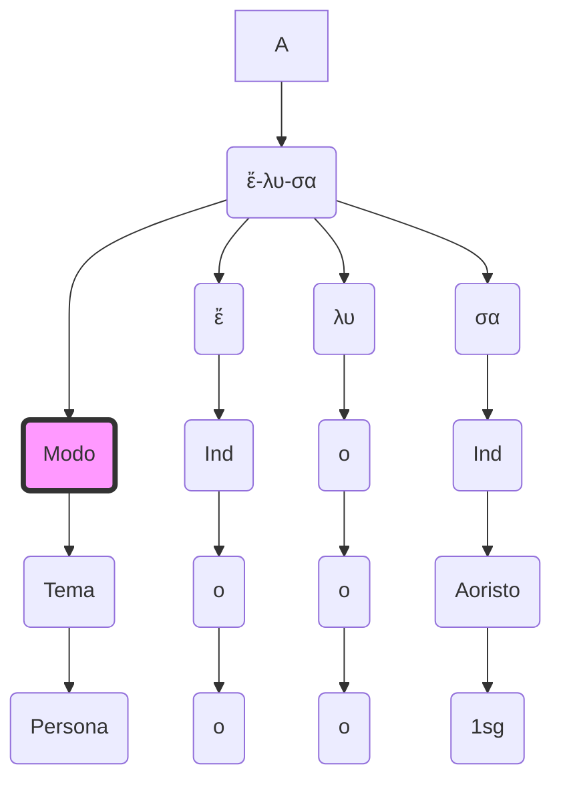

# Pruebas de morfología

```mermaid
graph TB

B--->Modo("Modo")
Modo:::Mod

A-->B("ἔ-λυ-σα")
B-->B1("ἔ")
B-->B2("λυ")
B-->B3("σα")

B1-->Modo1("Ind")
B2-->Modo2("o")
B3-->Modo3("Ind")

Modo-->Tema("Tema")-->Persona("Persona")
Modo1-->Tema1("o")-->Persona1("o")
Modo2-->Tema2("o")-->Persona2("o")
Modo3-->Tema3("Aoristo")-->Persona3("1sg")

style Modo fill:#f9f,stroke:#333,stroke-width:4px

```
