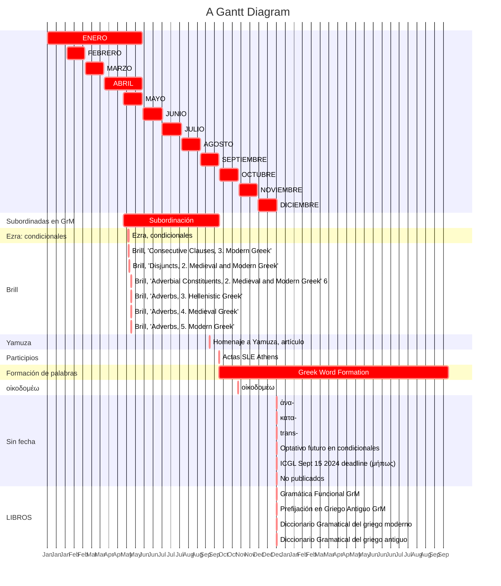
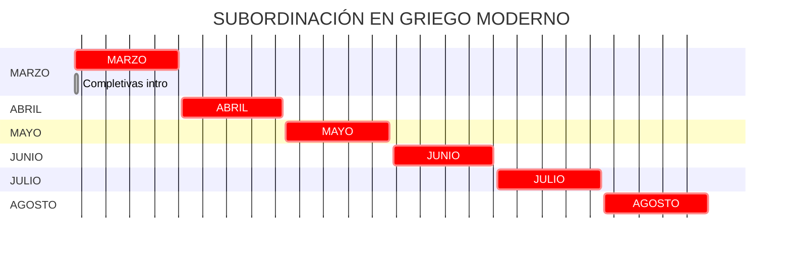
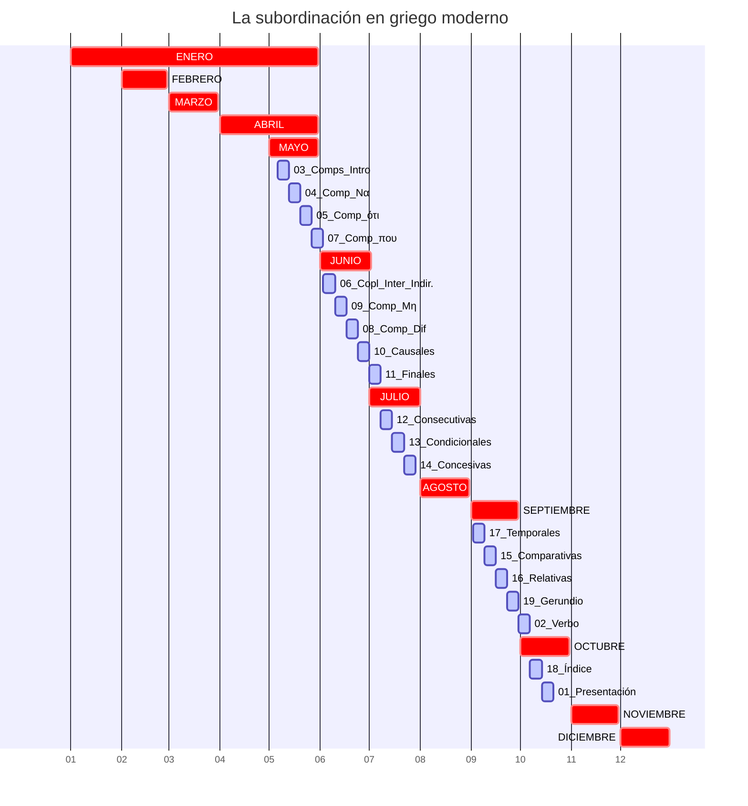
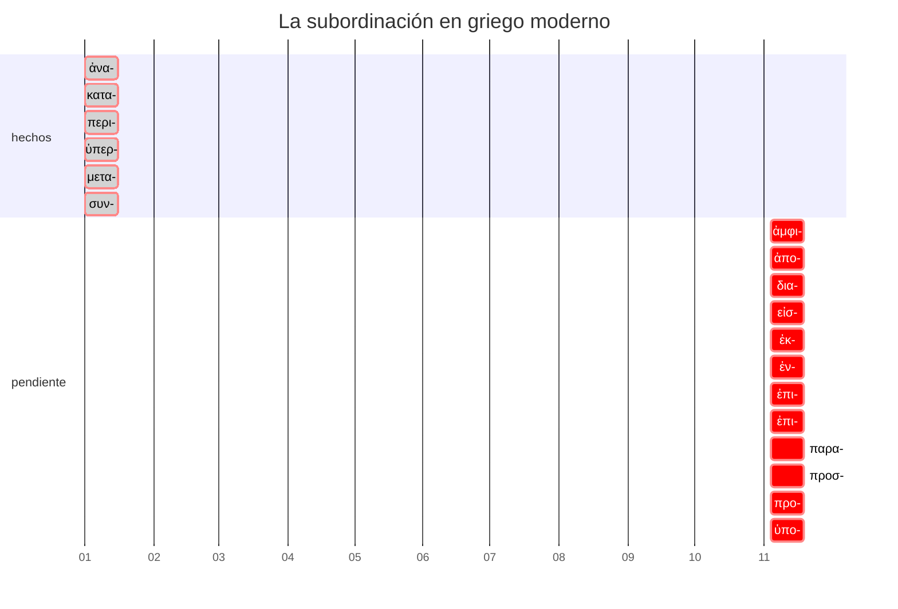
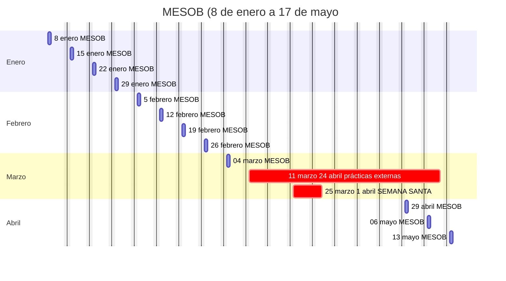
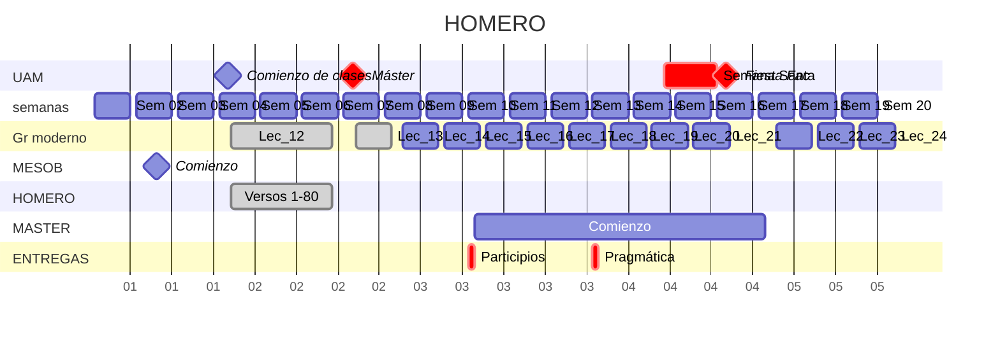
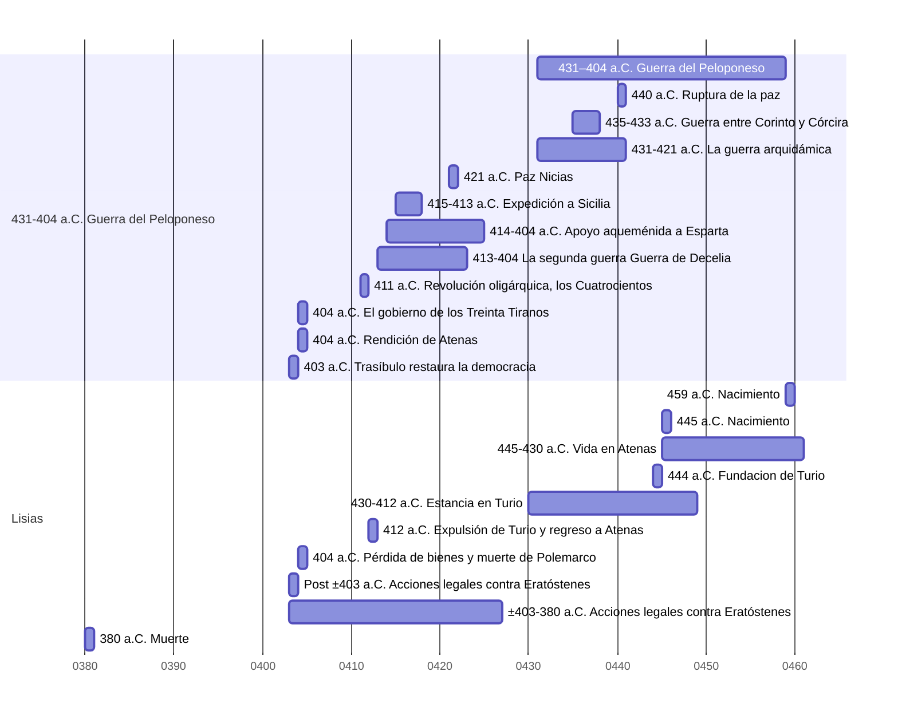
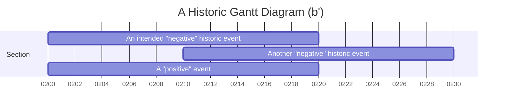

# 1. Organización

---

## 1.1. Año 2024

### 1.1. Un nivel más

```mermaid
---
title: ACTIVIDADES 2023-2024,
config:
  "theme": base,
  "themeCSS": ".taskText {fill: white; text-anchor: middle;
  }, .grid .tick line {stroke: darkgray !important; stroke-dasharray: 0 ; opacity: 0.5 !important;}"
---
gantt

    title ACTIVIDADES 2023-2024
    dateFormat DD-MM-YYYY
 axisFormat %m 
 tickInterval 1m

 
section DICIEMBRE-23
%%DICIEMBRE%%
%%12 DIC:crit, a1, 01-12-2023, 31-12-2023
Navidades (22DIC-07ENERO): done, a2, 22-12-2023, 07-01-2024
Brill:crit, b1, 22-12-2023, 15-01-2024
Wortbildung:crit, a4, 22-12-2023, 31-12-2024
Subordinación Gr.Mod.:crit, a5, 22-12-2023, 31-07-2024
Artículo participios:crit, a6, 22-12-2023, 31-07-2024

section ENERO-24
%%ENERO%%
%%01 ENER:crit, a2, 01-01-2024, 31-01-2024, 
Regalo para Vassilis (2-enero): active, a1, 02-01-2024, 1d

Exámenes Lisias (5-enero):  done,  a1, 05-01-2024, 1d
EXÁMENES (8-19):   done,  a1, 08-01-2024, 19-01-2024
MESOB (8 de enero a 17 de mayo): crit, a1, 08-01-2024, 17-05-2024
Gr.Mod. (10-enero-0900, III-202):  done,  a1, 10-01-2024, 1d
Neumólogo (10-enero-1215):  done,  a1, 10-01-2024, 1d
Lisias (11-enero-0900, III-102):  done,  a1, 11-01-2024, 1d
Hospital análisis 09,30 (21 enero):  done,  a1, 21-01-2024, 1d
PROYECTO MEC (22 enero):  done,  a1, 22-01-2024, 1d
Hospital pruebas 09,30 (24 enero): done, a1, 24-01-2024, 1d

2º SEMESTRE :a2, 30-01-2024, 30-05-2024
Homero: crit, a2, 30-01-2024, 30-05-2024

section FEBRERO-24
%%FEBRERO%%
%% 02 FEB:crit, a2, 01-02-2024, 29-02-2024

Condicionales (Ezra) (7-febrero): done, a1, 01-02-2024, 15-02-2024
CIERRE ACTAS (7Feb): done, a2, 07-02-2024, 1d

Reunión área (16-febrero-10 h.): done, a3, 16-02-2024, 1d



Reunión departamento (23-febrero-10 h): done, a5, 23-02-2024, 1d

AMGL44 Summary(29/2/2024): crit, a4, 29-02-2024, 1d

Homenaje a Yamuza, resumen (29Feb): done, a3, 29-02-2024, 1d


section MARZO-24
%%MARZO%%
MARZO:crit, a2, 01-03-2024, 31-03-2024
Colegio griego (1 MARZO):done, a2, 01-03-2024, 1d
Cumpleaños Mamen (2 MARZO):done, a2, 02-03-2024, 1d

Condicionales (Ezra) (7-febrero): crit, a1, 21-03-2024, 1d

SEMANA SANTA (25 marzo-1 abril): a5, 25-03-2024,01-04-2024

section ABRIL-24
%%ABRIL%%
ABRIL: crit, a2, 01-04-2024, 30-04-2024

Julián Festschrift (1April): done, a1, 01-04-2024, 1d
CIVIS On-Line (8-12April): done, a1, 08-04-2024, 12-04-2024
ESCANER TORAX Hospital Santa Cristina Maestro Vives 2 (16Abril, 0830): done, 16-04-2024, 1d
Fiesta facultad (26Abril): done, a4, 26-04-2024, 1d

section MAYO-24
%%MAYO%%
MAYO: crit, a2, 01-05-2024, 30-05-2024


Exámenes KEG (14/16-5-2024): done, a1, 14-05-2024, 16-05-2024
Examen Homero III-106 22.05.24 (12 h.): done, a1, 22-05-2024, 1d
Reunión Olga Batiukova 22.05.24 (16,30 h.): done, a1, 22-05-2024, 1d
CONSEJO DEPARTAMENTO 23.05.24 (12 h.): done, a1, 23-05-2024, 1d

AMGL44 Congreso (31May): done, crit, a1, 31-05-2024, 1d
Actas MESOB (31May): done, a1, 31-05-2024, 1d

section JUNIO-24
%%JUNIO%%
JUNIO: crit, a2, 01-06-2024, 30-06-2024


EXAM2 (04-06/28-06): done, a3, 04-06-2024, 28-06-2024
CIERRE ACTAS (6junio): done, 06-06-2024, 1d
EXAM LISIAS III-102 13.06.24 (1200): done, crit, a2, 13-06-2024, 1d

MESOB TFM: done, crit, a2, 14-06-2024, 1d
PET-TAC (17-06/28-06): done, crit, 17-06-2024,  1d

Innova solicitud: done, crit, a1, 14-05-2024, 13-06-2024 


Examen Homero III-106 19.06.24 (12 h.): done, crit, a1, 24-06-2024, 1d
OTORRINO 26_06_2024_Otorrino  (26-06/28-06, 09,45 PRINCESA): done, a3, 26-06-2024, 1d

MESOB, tribunal: done, a3, 26-06-2024, 1d

section JULIO-24
%%JULIO%%
JULIO: crit, a2, 01-07-2024, 31-07-2024

RENTA 3 abril 1 julio de 2024: a4, 03-04-2024, 01-07-2024
CIERRE ACTAS2 (3 julio): a4, 03-07-2024, 1d

Innovación facturas/memoria 1 enero 15 julio [URL](https://innovaciondocente.uam.es): crit, 01-01-2024, 15-07-2024

Neurólogo 19 julio 11,45: crit, a1, 19-07-2024, 1d

CIVIS Naxos (25-31July): crit, a1, 25-07-2024, 31-07-2024



section AGOSTO-24
%%AGOSTO%%
AGOSTO: crit, a2, 01-08-2024, 31-08-2024

VACACIONES (Agosto): a4, 01-08-2024, 31-08-2024

section SEPTIEMBRE-24
%%SEPTIEMBRE%%
SEPT: crit, a2, 01-09-2024, 30-09-2024
Homenaje a Yamuza, artículo: crit, a3, 15-09-2024, 1d
September 15 2024 latin deadline: done, 15-09-2024, 1d 


section OCTUBRE-24
%%OCTUBRE%%
OCTUB: crit, a2, 01-10-2024, 30-10-2024

section NOVIEMBRE-24
%%NOVIEMBRE%%
NOV: crit, a2, 01-11-2024, 30-11-2024
November 1st, 2024 Deadline for submitting paper proposals: crit, a2, 01-11-2024, 1d
Noviembre 15, 2024 latin summary: crit, 15-11-2024, 1d 

section DICIEMBRE25
%%DICIEMBRE%%
DIC: crit, a2, 01-12-2024, 31-12-2024

Actas SLE Athens: crit, a1, 15-12-2024, 1d
Navidades (23-diciembre): a1, 23-12-2024, 07-01-2025

section ENERO25

section FEBRERO25

Genres, text types, influential texts: crit, 28-02-2025, 1d

section JUNIO 25
JUNIO25: crit, 01-06-2025, 30-06-2025
Latin Linguistics June 9–13, 2025: crit, 09-06-2025, 13-06-2025
ICAGL 11, Niza, June 25th–27th, 2025: crit, 25-06-2025, 27-06-2025 

section SEPTIEMBRE 25
SEPT25: crit, 01-09-2025, 30-09-2025
ICGL17 23-26 Sept 2025: 23-09-2025, 26-09-2025

```

---

## 1.2. Proyectos

---

### 1.2.1. Participios

- [ ] Gerundios: leer bibliografía
- [ ] Participios: leer bibliografía
  - [ ] RAE (Bosque&Demonte)
- [ ] Completivas: leer bibliografía
  - [ ] Paso del participio a να.
- [ ] Converbios.
- [ ] Corpus
  - [ ] Añadir NT
  - [ ] Añadir Jenofonte.
  - [ ] GrMod > Español
  - [ ] Español > GrMod
    - [ ] Javier Marías: enamoramientos
- [ ] Traducir capítulos de gramática RAE

---

### 1.2.2. Gramática GrAnt: pragmática

---

### 1.2.3. Luciano

---

### 1.2.4. Trabajos pendiente

---

### 1.2.5. Ezra: artículo
  
#### 1.2.5.1. Tareas

- [ ] Corpus.
- [ ] Bibliografía.
  - [ ] Ediciones de Aristófanes (Leeuwen, Soomerstein), Sophocles (Jebb), etc.
- [ ] Artículo: boceto.
- [ ] Leer a Ezra.

#### 1.2.5.2. Corpus

|     Sistemas     | Notas | xml | búsquedas simultáneas | traducciones | crear/editar | solo ver |
|----------------|:-----:|:---:|:---------------------:|:------------:|:------------:|:--------:|
|    Filemaker     |   +   |  +  |           +           |      +       |      +       |          |
|      Mellel      |   +   |  +  |           ø           |      +       |      +       |          |
|     AntConc      |   ø   |  +  |           +           |      ø       |      ø       |          |
| BD condicionales |   +   |  +  |           +           |      +       |      +       |          |
|      Chrome      |   +   |  +  |           +           |      +       |      +       |          |

---

### 1.2.6. LA SUBORDINACIÓN EN GRIEGO MODERNO

#### 1.2.6.1. TAREAS

- [ ] Capítulos
  - [x] 03. Completivas introducción.
    - [x] Leer
    - [ ] Bibliografía
    - [ ] ⁠Matriz con rasgos de las completivas.
  - [ ] 04. Completivas: να.
    - [ ] Bibliografía
    - [x] Leído.
  - [ ] 05. Completivas: ότι/πως.
    - [ ] Bibliografía.
    - [x] Leído.
    - [ ] Το γεγονός οτι
  - [ ] 06. Completivas: που.
    - [x] Bibliografía
    - [x] Leído
    - [ ] Haciendo tabla de MPs
  - [ ] 07. Completivas: μήπως.
    - [x] Bibliografía
    - [x] Leído
    - [ ] Haciendo tabla de MPs

  - [ ] 06. Interrogativas indirectas.
    - [ ] Bibliografía
    - [x] Leído
    - [ ] Haciendo tabla de MPs
    - [ ] Mejoras: es demasiado complejo

  - [ ] 09. Completivas: diferencias
    - [ ] Bibliografía
    - [±] Leído
    - [ ] Haciendo tabla de MPs

  - [ ] 10. Causales
    - [ ] Bibliografía
    - [ ] Leído

  - [ ] 11. Finales
    - [x] Bibliografía
    - [x] Leído

  - [ ] 12. Consecutivas.
    - [ ] Bibliografía
      - [x] Mellel
      - [x] Carpeta
      - [ ] Triandafilidis
    - [x] Leído

  - [ ] 13. Condicionales
    - [x] Bibliografía
    - [x] Leído

  - [ ] 14. Concesivas
    - [x] Bibliografía
    - [x] Leído

  - [ ] 15. Comparativas
    - [x] Bibliografía
    - [ ] Leído

- [ ] Recopilar bibliografía
  - [ ] Ver gramáticas
  - [ ] Ver la sección de imágenes de los ordenadores antiguos
  - [ ] Ver ICGL
  - [ ] Ver SIGL
  - [ ] Ver Journal of Greek Linguistcs
  - [ ] Ver Γλωσσολογία
  - [ ] Ver Lingua
  - [ ] Ver Greek Linguistics
  - [ ] Ver DB Manolis Triandafilidis
- [ ] Redactar artículos
- [ ] Actualizar índice
- [ ] Escribir introducción.
- [ ] Base de datos de verbos + completivas
- [ ] Base de datos de construcciones: tengo una en Filemaker.
- [ ] Simplificar ejemplos

#### 1.2.6.2. CRONODIAGRAMA

---

### 1.2.7. Libro sobre Prefijación

---

### 1.2.8. Gramática práctica del Griego Antiguo

---

### 1.2.9. CIVIS: 8-12 April 2024 + 25-31 July 2024

[CIVIS](https://civis.eu/en/learn/civis-courses/languages-in-europe-and-their-diachronies-2)

#### 1.2.9.1. [Spring programme](https://conferences.uoa.gr/event/81/page/583-spring-school)

[Spring](https://conferences.uoa.gr/event/81/page/583-spring-school)

---

### 1.2.10. Brill

---

## 1.3. Clases

---

### 1.3.1. Griego moderno

---

### 1.3.2. Máster: Plutarco

---

### 1.3.3. MESOB

---

### 1.3.4. Homero

- [ ] Temario
  - [ ] Creación:  analísticos vs. unitarios
  - [ ] Lengua: dialectos y lenguas literarias
  - [ ] Fonética
  - [ ] Morfología
  - [ ] Sintaxis
  - [ ] Métrica
  - [ ] Cavafy
  - [ ] Narrativa de la Ilíada
  - [ ] Narrativa de la Odisea
  - [ ] Textos seleccionados
    - [ ] Textos vistos en clase
    - [ ] Textos discutidos por los alumnos
- [ ]  Bibliografía
  - [ ]  Ediciones
  - [ ]  Traducciones
  - [ ]  Introducciones
  - [ ]  Antologías
- [ ]  Periodización
- [ ]  Herramientas
  - [ ]  Ruipérez
    - [ ]  Notas: archivo de Ruipérez
    - [ ]  Notas: añadir notas a los textos
    - [ ]  Nombres propios
    - [ ]  Conceptos
    - [ ]  Métrica

---

### 1.3.5. Gráfico de asignaturas

---

## 1.4. Semanas

### 1.4.1. Semana 08 enero 14 enero

```mermaid
---
displayMode: compact
---
gantt

    title SEMANA 08 ENERO 2024
    dateFormat HH:mm
    axisFormat %H:%M

 tickInterval 1h
 
section LUNES
09-Leva: a1, 09:00, 09:59
10-XXX: a1, 10:00, 10:59
11-XXX: a1, 11:00, 12:00
12-XXX: a1, 12:00, 13:00
MESOB: crit, a1, 12:40, 14:00
13-comer: crit, a1, 13:00, 14:00
14-XXX: a1, 14:00, 15:00
15-XXX: a1, 15:00, 16:00
16-XXX: a1, 16:00, 17:00
17-XXX: a1, 17:00, 18:00
18-XXX: a1, 18:00, 19:00
19-XXX: a1, 19:00, 20:00
20-XXX: a1, 20:00, 21:00

section MARTES
09-Leva: a1, 09:00, 10:00
10-XXX: a1, 10:00, 11:00
11-XXX: a1, 11:00, 12:00
12-XXX: a1, 12:00, 13:00
13-comer: crit, a1, 13:00, 14:00
14-XXX: a1, 14:00, 15:00
15-XXX: a1, 15:00, 16:00
PORTELA: crit, a1, 16:00, 17:00
17-XXX: a1, 17:00, 18:00
18-XXX: a1, 18:00, 19:00
19-XXX: a1, 19:00, 20:00
20-XXX: a1, 20:00, 21:00

section MIÉRCOLES
09-Leva: a1, 09:00, 10:00
10-XXX: a1, 10:00, 11:00
11-XXX: a1, 11:00, 12:00
12-XXX: a1, 12:00, 13:00
13-comer: crit, a1, 13:00, 14:00
14-XXX: a1, 14:00, 15:00
15-XXX: a1, 15:00, 16:00
16-XXX: a1, 16:00, 17:00
17-XXX: a1, 17:00, 18:00
18-XXX: a1, 18:00, 19:00
19-XXX: a1, 19:00, 20:00
20-XXX: a1, 20:00, 21:00

section JUEVES
09-Leva: a1, 09:00, 10:00
10-XXX: a1, 10:00, 11:00
11-XXX: a1, 11:00, 12:00
12-XXX: a1, 12:00, 13:00
13-comer: crit, a1, 13:00, 14:00
14-XXX: a1, 14:00, 15:00
15-XXX: a1, 15:00, 16:00
16-XXX: a1, 16:00, 17:00
17-XXX: a1, 17:00, 18:00
18-XXX: a1, 18:00, 19:00
19-XXX: a1, 19:00, 20:00
20-XXX: a1, 20:00, 21:00

section VIERNES
09-Leva: a1, 09:00, 10:00
10-XXX: a1, 10:00, 11:00
11-XXX: a1, 11:00, 12:00
12-XXX: a1, 12:00, 13:00
13-comer: crit, a1, 13:00, 14:00
14-XXX: a1, 14:00, 15:00
15-XXX: a1, 15:00, 16:00
16-XXX: a1, 16:00, 17:00
17-XXX: a1, 17:00, 18:00
18-XXX: a1, 18:00, 19:00
19-XXX: a1, 19:00, 20:00
20-XXX: a1, 20:00, 21:00

section SÁBADO
09-Leva: a1, 09:00, 10:00
10-XXX: a1, 10:00, 11:00
11-XXX: a1, 11:00, 12:00
12-XXX: a1, 12:00, 13:00
13-comer: a1, 13:00, 14:00
14-XXX: a1, 14:00, 15:00
15-XXX: a1, 15:00, 16:00
16-XXX: a1, 16:00, 17:00
17-XXX: a1, 17:00, 18:00
18-XXX: a1, 18:00, 19:00
19-XXX: a1, 19:00, 20:00
20-XXX: a1, 20:00, 21:00

section DOMINGO
09-Leva: a1, 09:00, 10:00
10-XXX: a1, 10:00, 11:00
11-XXX: a1, 11:00, 12:00
12-XXX: a1, 12:00, 13:00
13-comer: a1, 13:00, 14:00
14-XXX: a1, 14:00, 15:00
15-XXX: a1, 15:00, 16:00
XXX: a1, 16:00, 17:00
17-XXX: a1, 17:00, 18:00
18-XXX: a1, 18:00, 19:00
19-XXX: a1, 19:00, 20:00
20-XXX: a1, 20:00, 21:00

```

## 1.5. Innnovación docente

### 1.5.1. Informe

### 1.5.2. Nuevo

[URL](https://innovaciondocente.uam.es)

---

## 1.6. Médicos

- 26-06/28-06, 09:45 PRINCESA:   
- 16-04-2024: 08:30: ESCANER TORAX Hospital Santa Cristina Maestro Vives 2: 

## 1.7. Tiempo pasado

---

## 1.8. Your code

