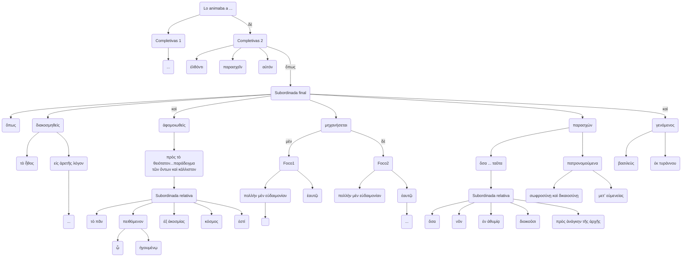

# Análisis 10.2

ἐλθόντι δὲ παρασχεῖν2 αὑτόν, ὅπως διακοσμηθεὶς τὸ ἦθος εἰς ἀρετῆς λόγον, καὶ πρὸς τὸ θειότατον ἀφομοιωθεὶς παράδειγμα τῶν ὄντων καὶ κάλλιστον, ᾧ3 τὸ πᾶν ἡγουμένῳ4 πειθόμενον1 ἐξ ἀκοσμίας κόσμος ἐστί, 3 πολλὴν μὲν εὐδαιμονίαν ἑαυτῷ μηχανήσεται, πολλὴν δὲ τοῖς πολίταις, ὅσα νῦν ἐν ἀθυμίᾳ διοικοῦσι πρὸς ἀνάγκην τῆς ἀρχῆς, ταῦτα σωφροσύνῃ καὶ δικαιοσύνῃ μετʼ εὐμενείας πατρονομούμενα παρασχών5 καὶ γενόμενος βασιλεὺς ἐκ τυράννου.

