# Estructura del Dion de Plutarco

## Diacronía

```mermaid

    gantt

    title Historia de Sicilia
    dateFormat   X
    axisFormat   %s
    
    
section Bloque 1
    La influencia de un maestro (1): -398, -398, 1s
    Fortunas comunes ¿malos espíritus? (2): -388, -388, 1s
    Las dos esposas de Dionisio I (3):  -388, -388, 1s

    section 1 Viaje
    Primer viaje de Platón a Sicilia (388 a.C.) El alumno del filósofo (4): crit, -388, -388, 1s

    section Bloque 2
        Dionisio I rechaza la filosofía (5): -388, -388, 1s
        La sucesión de la tiranía (6):  -388, -388, 1s
        La corte del joven tirano (7):  -388, -388, 1s
        Juicio de Dión (8):  -388, -388, 1s
        El legado de Dionisio I. Padre sobreprotector y tiranía suspicaz (9):  -388, -388, 1s

    section 2ª viaje
        Dión guía a Dionisio II (10):  -388, -388, 1s
        Segundo viaje de Platón a Silicia (367 aC) (11): crit, -367, -367, 1s

    section bloque 3
        Platón versus Filisto. El plan de Dión (12): -362, -367, 5s
        Llegada de Platón (13):  -362, -367, 5s
        Exilio de Dión. Aislamiento de Platón  (14):  -362, -367, 5s
        El resultado del exilio de Dión (15):  -362, -367, 5s
        Dionisio II interés exclusivo por Platón  (16):  -362, -367, 5s
        La reputación de Dión en Grecia (17):  -362, -367, 5s

    section 3º viaje 
        Tercer viaje de Platón a Silicia (361 a.C.), celos de Dionisio II (18): crit, -361, -361, 1s

    section bloque 4
        La fascinación de la tercera vez  (19):  -357, -361, 4s
        La rápida despedida de Platón  (20): -357, -361, 4s

    section bloque
        Expedición de Dión contra Dionisio (357 a.C.)  La mujer de Dión (21): -357, -357, 1s
        Dión se dirige a la guerra  (22):  -354, -357, 3s
        El ejército se reúne  (23):   -354, -357, 3s
        Presagios en ambos bandos (24):   -354, -357, 3s
        El viaje de Dión  (25):   -354, -357, 3s
        Mensajes  (26):   -354, -357, 3s
        Dión presiona a Siracusa  (27):   -354, -357, 3s
        Dión entra en Siracusa  (28):   -354, -357, 3s
        Primer discurso y generalo de Dión  (29):   -354, -357, 3s
        Negociaciones y batalla  (30):   -354, -357, 3s
        Cartas de la familia de Dión  (31):   -354, -357, 3s
        Maniobras de Heraclides. El rival de Dión  (32):  -354, -357, 3s
        La resistencia de Heraclides  (33):  -354, -357, 3s
        El testimonio de Sosis  (34):  -354, -357, 3s
        El final de Sosis y Filisto (35):  -354, -357, 3s
        Excurso de Plutarco sobre sus fuentes  Huida de Dionisio (36):  -354, -357, 3s
        Dionisio II se marcha. Heraclides ataca a Dión  (37):  -354, -357, 3s
        Dión es reemplezado y rechazado  (38):  -354, -357, 3s
        Retirada de Dión a Leontinos  La elección de Dión  (39):  -354, -357, 3s
        Leontino frente a Siracusa  (40):  -354, -357, 3s
Saqueo de Siracusa  Un nuevo cambio de la marea  (41):  -354, -357, 3s
Llamad a Dión  (42):  -354, -357, 3s
La decisión de Dión  (43):  -354, -357, 3s
Siracusa es saqueada: mensajes mixtos  (44):  -354, -357, 3s
Dión llega finalmente Regreso de Dión a Siracusa  (45):  -354, -357, 3s
El precio de la victoria  (46):  -354, -357, 3s
La virtud de Dión frente a sus ultrajadores  (47):  -354, -357, 3s
El nuevo resentimiento de Heraclides  (48):  -354, -357, 3s
Más perfidias por parte de Heraclides  (49):  -354, -357, 3s
Dión recupera la ciudadela de Siracusa  La tiranía se marcha: la familia del tirano se reúne  (50):  -354, -357, 3s
La familia de Dión se reúne  (51):  -354, -357, 3s
Un miembro de la Academia en Siracusa  (52):  -354, -357, 3s
Heraclides finalmente asesinado  (53):  -354, -357, 3s
Conjura contra Dión La conspiración de Calipo  (54):  -354, -357, 3s
La tragedia comienza  (55):  -354, -357, 3s
Conspiración completada  (56):  -354, -357, 3s
La muerte de Dión  (57):  -354, -357, 3s
El final para Calipo, pero no para Siracusa (58): crit, -354, -354, 1s

```

    

## Otro

1. La influencia de un maestro 
2. Fortunas comunes: ¿malos espíritus? 
3. Las dos esposas de Dionisio I 
4. Primer viaje de Platón a Sicilia (388 a.C.) El alumno del filósofo 
5. Dionisio I rechaza la filosofía (5)
6. La sucesión de la tiranía (6)
7. La corte del joven tirano (7)
8. Juicio de Dión (8)
9. El legado de Dionisio I: padre sobreprotector y tiranía suspicaz (9)
Dión guía a Dionisio II (10):  -388, -388, 1s
Segundo viaje de Platón a Silicia (367 a.C.) (11):  -388, -388, 1s
Platón vs. Filisto  El plan de Dión  (12):  -388, -388, 1s
Llegada de Platón  (13):  -388, -388, 1s
Exilio de Dión; aislamiento de Platón  (14):  -388, -388, 1s
El resultado del exilio de Dión  (15):  -388, -388, 1s
Dionisio II interés exclusivo por Platón  (16):  -388, -388, 1s
La reputación de Dión en Grecia  (17):  -388, -388, 1s
Tercer viaje de Platón a Silicia (361 a.C.)  Los celos de Dionisio II  (18):  -388, -388, 1s
La fascinación de la tercera vez  (19):  -388, -388, 1s
La rápida despedida de Platón  (20):  -388, -388, 1s
Expedición de Dión contra Dionisio (357 a.C.)  La mujer de Dión: la última gota (21):  -388, -388, 1s
Dión se dirige a la guerra  (22):  -388, -388, 1s
El ejército se reúne  (23):  -388, -388, 1s
Presagios en ambos bandos (24):  -388, -388, 1s
El viaje de Dión  (25):  -388, -388, 1s
Mensajes  (26):  -388, -388, 1s
Dión presiona a Siracusa  (27):  -388, -388, 1s
Dión entra en Siracusa  (28):  -388, -388, 1s
Primer discurso y generalo de Dión  (29):  -388, -388, 1s
Negociaciones y batalla  (30):  -388, -388, 1s
Cartas de la familia de Dión  (31):  -388, -388, 1s
Maniobras de Heraclides. El rival de Dión  (32):  -388, -388, 1s
La resistencia de Heraclides  (33):  -388, -388, 1s
El testimonio de Sosis  (34):  -388, -388, 1s
El final de Sosis y Filisto (35):  -388, -388, 1s
Excurso de Plutarco sobre sus fuentes  Huida de Dionisio (36):  -388, -388, 1s
Dionisio II se marcha: Heraclides ataca a Dión  (37):  -388, -388, 1s
Dión es reemplezado y rechazado  (38):  -388, -388, 1s
Retirada de Dión a Leontinos  La elección de Dión  (39):  -388, -388, 1s
Leontino frente a Siracusa  (40):  -388, -388, 1s
Saqueo de Siracusa  Un nuevo cambio de la marea  (41):  -388, -388, 1s
Llamad a Dión  (42):  -388, -388, 1s
La decisión de Dión  (43):  -388, -388, 1s
Siracusa es saqueada: mensajes mixtos  (44):  -388, -388, 1s
Dión llega finalmente Regreso de Dión a Siracusa  (45):  -388, -388, 1s
El precio de la victoria  (46):  -388, -388, 1s
La virtud de Dión frente a sus ultrajadores  (47):  -388, -388, 1s
El nuevo resentimiento de Heraclides  (48):  -388, -388, 1s
Más perfidias por parte de Heraclides  (49):  -388, -388, 1s
Dión recupera la ciudadela de Siracusa  La tiranía se marcha: la familia del tirano se reúne  (50):  -388, -388, 1s
La familia de Dión se reúne  (51):  -388, -388, 1s
Un miembro de la Academia en Siracusa  (52):  -388, -388, 1s
Heraclides finalmente asesinado  (53):  -388, -388, 1s
Conjura contra Dión La conspiración de Calipo  (54):  -388, -388, 1s
La tragedia comienza  (55):  -388, -388, 1s
Conspiración completada  (56):  -388, -388, 1s
La muerte de Dión  (57):  -388, -388, 1s
El final para Calipo, pero no para Siracusa (58):  -388, -388, 1s
