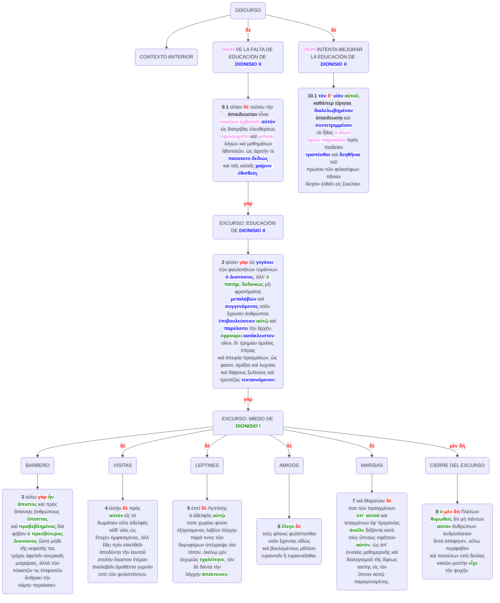
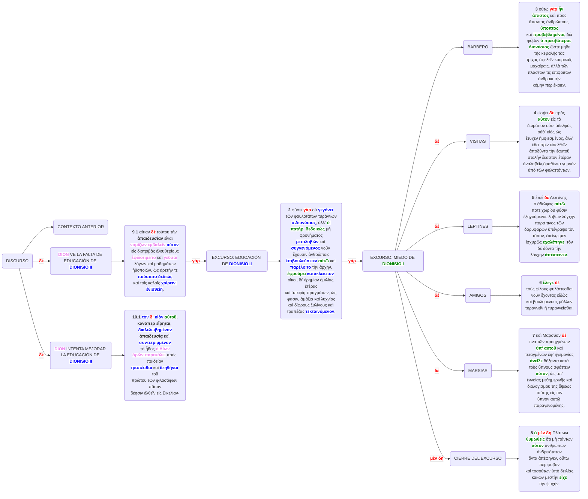

# Fragmento 9.1-10.1

```mermaid
graph TB

A("DISCURSO")

A-->B("CONTEXTO ANTERIOR")

A-->|"<b style="background-color: white;color: red;">δέ</b>"|C("<b style="background-color: white;color: violet;">DION</b> VE LA FALTA DE EDUCACIÓN DE <b style="background-color: white;color: blue;">DIONISIO II</b>")

C-->C1("<b>9.1</b> αἰτίαν <b style="background-color: white;color: red;">δέ</b> τούτου τὴν <b>ἀπαιδευσίαν</b> εἶναι<br><b style="background-color: white;color: violet;">νομίζων ἐμβαλεῖν</b> <b style="background-color: white;color: blue;">αὐτὸν</b> εἰς διατριβὰς ἐλευθερίους<br><b style="background-color: white;color: violet;">ἐφιλοτιμεῖτο</b> καὶ <b style="background-color: white;color: violet;">γεῦσαι</b> λόγων καὶ μαθημάτων<br> ἠθοποιῶν, ὡς ἀρετήν τε <b style="background-color: white;color: blue;">παύσαιτο</b> <b style="background-color: white;color: blue;">δεδιὼς</b><br>καὶ τοῖς καλοῖς <b style="background-color: white;color: blue;">χαίρειν ἐθισθείη</b>.")

C1-->|"<b style="background-color: white;color: red;">γάρ</b>"|C2("EXCURSO: EDUCACIÓN DE <b style="background-color: white;color: blue;">DIONISIO II</b>")

C2-->C3("<b>2</b> φύσει <b style="background-color: white;color: red;">γὰρ</b> οὐ <b style="background-color: white;color: blue;">γεγόνει</b> τῶν φαυλοτάτων τυράννων<br><b style="background-color: white;color: blue;">ὁ Διονύσιος</b>, ἀλλʼ <b style="background-color: white;color: green;">ὁ πατὴρ</b>, <b style="background-color: white;color: green;">δεδοικώς</b> μὴ φρονήματος<br><b style="background-color: white;color: blue;">μεταλαβὼν</b> καὶ <b style="background-color: white;color: blue;">συγγενόμενος</b> νοῦν ἔχουσιν ἀνθρώποις<br><b style="background-color: white;color: blue;">ἐπιβουλεύσειεν</b> <b style="background-color: white;color: green;">αὐτῷ</b> καὶ <b style="background-color: white;color: blue;">παρέλοιτο</b> τὴν ἀρχήν,<br><b style="background-color: white;color: green;">ἐφρούρει</b> <b style="background-color: white;color: blue;">κατάκλειστον</b> οἴκοι, διʼ ἐρημίαν ὁμιλίας ἑτέρας<br>καὶ ἀπειρίᾳ πραγμάτων, ὥς φασιν, ἁμάξια καὶ λυχνίας<br>καὶ δίφρους ξυλίνους καὶ τραπέζας <b style="background-color: white;color: blue;">τεκταινόμενον</b>.")

C3-->|"<b style="background-color: white;color: red;">γάρ</b>"|D("EXCURSO: MIEDO DE <b style="background-color: white;color: green;">DIONISIO I</b>")

D-->D1("BARBERO")-->D11("<b>3</b> οὕτω <b class="particl"><b style="background-color: white;color: red;">γὰρ</b></b> <b style="background-color: white;color: green;">ἦν</b><br><b style="background-color: white;color: green;">ἄπιστος</b> καὶ πρὸς<br>ἅπαντας ἀνθρώπους <b style="background-color: white;color: green;">ὕποπτος</b><br>καὶ <b style="background-color: white;color: green;">προβεβλημένος</b> διὰ<br>φόβον <b style="background-color: white;color: green;">ὁ πρεσβύτερος</b><br><b style="background-color: white;color: green;">Διονύσιος</b> ὥστε μηδὲ<br>τῆς κεφαλῆς τὰς<br>τρίχας ἀφελεῖν κουρικαῖς<br>μαχαίραις, ἀλλὰ τῶν<br>πλαστῶν τις ἐπιφοιτῶν<br>ἄνθρακι τὴν<br>κόμην περιέκαιεν.")

D-->|"<b style="background-color: white;color: red;">δέ</b>"|D2("VISITAS")-->D21("<b>4</b> εἰσῄει <b style="background-color: white;color: red;">δὲ</b> πρὸς<br><b style="background-color: white;color: green;">αὐτὸν</b> εἰς τὸ<br>δωμάτιον οὔτε ἀδελφὸς<br>οὔθʼ υἱὸς ὡς<br>ἔτυχεν ἠμφιεσμένος, ἀλλʼ<br>ἔδει πρὶν εἰσελθεῖν<br>ἀποδύντα τὴν ἑαυτοῦ<br>στολὴν ἕκαστον ἑτέραν<br>ἀναλαβεῖν,ὁραθέντα γυμνὸν<br>ὑπὸ τῶν φυλαττόντων.")

D-->|"<b style="background-color: white;color: red;">δέ</b>"|D3("LEPTINES")-->D31("<b>5</b> ἐπεὶ <b style="background-color: white;color: red;">δὲ</b> Λεπτίνης<br>ὁ ἀδελφὸς <b style="background-color: white;color: green;">αὐτῷ</b><br>ποτε χωρίου φύσιν<br>ἐξηγούμενος λαβὼν λόγχην<br>παρά τινος τῶν<br>δορυφόρων ὑπέγραψε τὸν<br>τόπον, ἐκείνῳ μὲν<br>ἰσχυρῶς <b style="background-color: white;color: green;">ἐχαλέπηνε</b>, τὸν<br>δέ δόντα τὴν<br>λόγχην <b style="background-color: white;color: green;">ἀπέκτεινεν</b>.")

D-->|"<b style="background-color: white;color: red;">δέ</b>"|D4("AMIGOS")-->D41("<b>6</b> <b style="background-color: white;color: green;">ἔλεγε</b> <b style="background-color: white;color: red;">δέ</b><br>τοὺς φίλους φυλάττεσθαι<br>νοῦν ἔχοντας εἰδὼς<br>καὶ βουλομένους μᾶλλον<br>τυραννεῖν ἢ τυραννεῖσθαι.")

D-->|"<b style="background-color: white;color: red;">δέ</b>"|D5("MARSIAS")-->D51("<b>7</b> καὶ Μαρσύαν <b style="background-color: white;color: red;">δέ</b><br>τινα τῶν προηγμένων<br><b style="background-color: white;color: green;">ὑπʼ αὐτοῦ</b> καὶ<br>τεταγμένων ἐφʼ ἡγεμονίας<br><b style="background-color: white;color: green;">ἀνεῖλε</b> δόξαντα κατὰ<br>τοὺς ὕπνους σφάττειν<br><b style="background-color: white;color: green;">αὐτόν</b>, ὡς ἀπʼ<br>ἐννοίας μεθημερινῆς καὶ<br>διαλογισμοῦ τῆς ὄψεως<br>ταύτης εἰς τὸν<br>ὕπνον αὐτῷ παραγενομένης.")

D-->|"<b style="background-color: white;color: red;">μὲν δὴ</b>"|D6("CIERRE DEL EXCURSO")-->D61("<b>8</b> <b style="background-color: white;color: green;">ὁ</b> <b style="background-color: white;color: red;">μὲν δὴ</b> Πλάτωνι<br><b style="background-color: white;color: green;">θυμωθείς</b> ὅτι μὴ πάντων<br><b style="background-color: white;color: green;">αὐτὸν</b> ἀνθρώπων ἀνδρειότατον<br>ὄντα ἀπέφηνεν, οὕτω περίφοβον<br>καὶ τοσούτων ὑπὸ δειλίας<br>κακῶν μεστὴν <b style="background-color: white;color: green;">εἶχε</b><br>τὴν ψυχήν.")

A-->|"<b style="background-color: white;color: red;">δέ</b>"|E("<b style="background-color: white;color: violet;">DION</b> INTENTA MEJORAR LA EDUCACIÓN DE <b style="background-color: white;color: blue;">DIONISIO II</b>")-->E1("<b>10.1</b> <b style="background-color: white;color: blue;">τὸν</b> <b style="background-color: white;color: red;">δʼ</b> <b style="background-color: white;color: blue;">υἱὸν</b> <b style="background-color: white;color: green;">αὐτοῦ</b>,<br><b>καθάπερ εἴρηται</b>, <b style="background-color: white;color: blue;">διαλελωβημένον</b><br><b>ἀπαιδευσίᾳ</b> καὶ <b style="background-color: white;color: blue;">συντετριμμένον</b><br>τὸ ἦθος <b style="background-color: white;color: violet;">ὁ Δίων</b><br><b style="background-color: white;color: violet;">ὁρῶν παρεκάλει</b> πρὸς παιδείαν<br><b style="background-color: white;color: blue;">τραπέσθαι</b> καὶ <b style="background-color: white;color: blue;">δεηθῆναι</b> τοῦ<br>πρώτου τῶν φιλοσόφων πᾶσαν<br>δέησιν ἐλθεῖν εἰς Σικελίαν·")

```

```mermaid
graph LR

A("DISCURSO")

A-->B("CONTEXTO ANTERIOR")

A-->|"<b style="background-color: white;color: red;">δέ</b>"|C("<b style="background-color: white;color: violet;">DION</b> VE LA FALTA DE EDUCACIÓN DE <b style="background-color: white;color: blue;">DIONISIO II</b>")

C-->C1("<b>9.1</b> αἰτίαν <b style="background-color: white;color: red;">δέ</b> τούτου τὴν <b>ἀπαιδευσίαν</b> εἶναι<br><b style="background-color: white;color: violet;">νομίζων ἐμβαλεῖν</b> <b style="background-color: white;color: blue;">αὐτὸν</b> εἰς διατριβὰς ἐλευθερίους<br><b style="background-color: white;color: violet;">ἐφιλοτιμεῖτο</b> καὶ <b style="background-color: white;color: violet;">γεῦσαι</b> λόγων καὶ μαθημάτων<br> ἠθοποιῶν, ὡς ἀρετήν τε <b style="background-color: white;color: blue;">παύσαιτο</b> <b style="background-color: white;color: blue;">δεδιὼς</b><br>καὶ τοῖς καλοῖς <b style="background-color: white;color: blue;">χαίρειν ἐθισθείη</b>.")

C1-->|"<b style="background-color: white;color: red;">γάρ</b>"|C2("EXCURSO: EDUCACIÓN DE <b style="background-color: white;color: blue;">DIONISIO II</b>")

C2-->C3("<b>2</b> φύσει <b style="background-color: white;color: red;">γὰρ</b> οὐ <b style="background-color: white;color: blue;">γεγόνει</b> τῶν φαυλοτάτων τυράννων<br><b style="background-color: white;color: blue;">ὁ Διονύσιος</b>, ἀλλʼ <b style="background-color: white;color: green;">ὁ πατὴρ</b>, <b style="background-color: white;color: green;">δεδοικώς</b> μὴ φρονήματος<br><b style="background-color: white;color: blue;">μεταλαβὼν</b> καὶ <b style="background-color: white;color: blue;">συγγενόμενος</b> νοῦν ἔχουσιν ἀνθρώποις<br><b style="background-color: white;color: blue;">ἐπιβουλεύσειεν</b> <b style="background-color: white;color: green;">αὐτῷ</b> καὶ <b style="background-color: white;color: blue;">παρέλοιτο</b> τὴν ἀρχήν,<br><b style="background-color: white;color: green;">ἐφρούρει</b> <b style="background-color: white;color: blue;">κατάκλειστον</b> οἴκοι, διʼ ἐρημίαν ὁμιλίας ἑτέρας<br>καὶ ἀπειρίᾳ πραγμάτων, ὥς φασιν, ἁμάξια καὶ λυχνίας<br>καὶ δίφρους ξυλίνους καὶ τραπέζας <b style="background-color: white;color: blue;">τεκταινόμενον</b>.")

C3-->|"<b style="background-color: white;color: red;">γάρ</b>"|D("EXCURSO: MIEDO DE <b style="background-color: white;color: green;">DIONISIO I</b>")

D-->D1("BARBERO")-->D11("<b>3</b> οὕτω <b class="particl"><b style="background-color: white;color: red;">γὰρ</b></b> <b style="background-color: white;color: green;">ἦν</b><br><b style="background-color: white;color: green;">ἄπιστος</b> καὶ πρὸς<br>ἅπαντας ἀνθρώπους <b style="background-color: white;color: green;">ὕποπτος</b><br>καὶ <b style="background-color: white;color: green;">προβεβλημένος</b> διὰ<br>φόβον <b style="background-color: white;color: green;">ὁ πρεσβύτερος</b><br><b style="background-color: white;color: green;">Διονύσιος</b> ὥστε μηδὲ<br>τῆς κεφαλῆς τὰς<br>τρίχας ἀφελεῖν κουρικαῖς<br>μαχαίραις, ἀλλὰ τῶν<br>πλαστῶν τις ἐπιφοιτῶν<br>ἄνθρακι τὴν<br>κόμην περιέκαιεν.")

D-->|"<b style="background-color: white;color: red;">δέ</b>"|D2("VISITAS")-->D21("<b>4</b> εἰσῄει <b style="background-color: white;color: red;">δὲ</b> πρὸς<br><b style="background-color: white;color: green;">αὐτὸν</b> εἰς τὸ<br>δωμάτιον οὔτε ἀδελφὸς<br>οὔθʼ υἱὸς ὡς<br>ἔτυχεν ἠμφιεσμένος, ἀλλʼ<br>ἔδει πρὶν εἰσελθεῖν<br>ἀποδύντα τὴν ἑαυτοῦ<br>στολὴν ἕκαστον ἑτέραν<br>ἀναλαβεῖν,ὁραθέντα γυμνὸν<br>ὑπὸ τῶν φυλαττόντων.")

D-->|"<b style="background-color: white;color: red;">δέ</b>"|D3("LEPTINES")-->D31("<b>5</b> ἐπεὶ <b style="background-color: white;color: red;">δὲ</b> Λεπτίνης<br>ὁ ἀδελφὸς <b style="background-color: white;color: green;">αὐτῷ</b><br>ποτε χωρίου φύσιν<br>ἐξηγούμενος λαβὼν λόγχην<br>παρά τινος τῶν<br>δορυφόρων ὑπέγραψε τὸν<br>τόπον, ἐκείνῳ μὲν<br>ἰσχυρῶς <b style="background-color: white;color: green;">ἐχαλέπηνε</b>, τὸν<br>δέ δόντα τὴν<br>λόγχην <b style="background-color: white;color: green;">ἀπέκτεινεν</b>.")

D-->|"<b style="background-color: white;color: red;">δέ</b>"|D4("AMIGOS")-->D41("<b>6</b> <b style="background-color: white;color: green;">ἔλεγε</b> <b style="background-color: white;color: red;">δέ</b><br>τοὺς φίλους φυλάττεσθαι<br>νοῦν ἔχοντας εἰδὼς<br>καὶ βουλομένους μᾶλλον<br>τυραννεῖν ἢ τυραννεῖσθαι.")

D-->|"<b style="background-color: white;color: red;">δέ</b>"|D5("MARSIAS")-->D51("<b>7</b> καὶ Μαρσύαν <b style="background-color: white;color: red;">δέ</b><br>τινα τῶν προηγμένων<br><b style="background-color: white;color: green;">ὑπʼ αὐτοῦ</b> καὶ<br>τεταγμένων ἐφʼ ἡγεμονίας<br><b style="background-color: white;color: green;">ἀνεῖλε</b> δόξαντα κατὰ<br>τοὺς ὕπνους σφάττειν<br><b style="background-color: white;color: green;">αὐτόν</b>, ὡς ἀπʼ<br>ἐννοίας μεθημερινῆς καὶ<br>διαλογισμοῦ τῆς ὄψεως<br>ταύτης εἰς τὸν<br>ὕπνον αὐτῷ παραγενομένης.")

D-->|"<b style="background-color: white;color: red;">μὲν δὴ</b>"|D6("CIERRE DEL EXCURSO")-->D61("<b>8</b> <b style="background-color: white;color: green;">ὁ</b> <b style="background-color: white;color: red;">μὲν δὴ</b> Πλάτωνι<br><b style="background-color: white;color: green;">θυμωθείς</b> ὅτι μὴ πάντων<br><b style="background-color: white;color: green;">αὐτὸν</b> ἀνθρώπων ἀνδρειότατον<br>ὄντα ἀπέφηνεν, οὕτω περίφοβον<br>καὶ τοσούτων ὑπὸ δειλίας<br>κακῶν μεστὴν <b style="background-color: white;color: green;">εἶχε</b><br>τὴν ψυχήν.")

A-->|"<b style="background-color: white;color: red;">δέ</b>"|E("<b style="background-color: white;color: violet;">DION</b> INTENTA MEJORAR LA EDUCACIÓN DE <b style="background-color: white;color: blue;">DIONISIO II</b>")-->E1("<b>10.1</b> <b style="background-color: white;color: blue;">τὸν</b> <b style="background-color: white;color: red;">δʼ</b> <b style="background-color: white;color: blue;">υἱὸν</b> <b style="background-color: white;color: green;">αὐτοῦ</b>,<br><b>καθάπερ εἴρηται</b>, <b style="background-color: white;color: blue;">διαλελωβημένον</b><br><b>ἀπαιδευσίᾳ</b> καὶ <b style="background-color: white;color: blue;">συντετριμμένον</b><br>τὸ ἦθος <b style="background-color: white;color: violet;">ὁ Δίων</b><br><b style="background-color: white;color: violet;">ὁρῶν παρεκάλει</b> πρὸς παιδείαν<br><b style="background-color: white;color: blue;">τραπέσθαι</b> καὶ <b style="background-color: white;color: blue;">δεηθῆναι</b> τοῦ<br>πρώτου τῶν φιλοσόφων πᾶσαν<br>δέησιν ἐλθεῖν εἰς Σικελίαν·")

```
