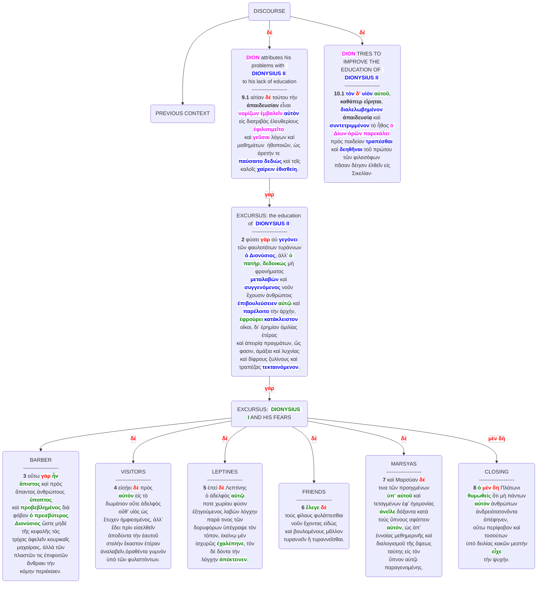

# Fragmento 9.1-10.1

## Complete



## Short
```mermaid
graph TB

A("DISCOURSE")

<<<<<<< HEAD
A-->B("PREVIOUS CONTEXT")-->B1("...")

A-->|"<b style="background-color: white;color: red;">δέ</b>"|C("<b style="background-color: white;color: Fuchsia;">DION</b> ATTRIBUTES HIS PROBLEMSVWITH <b style="background-color: white;color: blue;"> DIONYSIUS II</b> <br> TO HIS LACK OF EDUCATION <br> -------------------- <br> <b>9.1</b> αἰτίαν <b style="background-color: white;color: red;">δέ</b> τούτου τὴν <b>ἀπαιδευσίαν</b> εἶναι <br> <b style="background-color: white;color: Fuchsia;">νομίζων ἐμβαλεῖν</b> <b style="background-color: white;color: blue;">αὐτὸν</b>  εἰς διατριβὰς ἐλευθερίους <br> <b style="background-color: white;color: Fuchsia;">ἐφιλοτιμεῖτο</b>  καὶ <b style="background-color: white;color: Fuchsia;">γεῦσαι</b> λόγων καὶ μαθημάτων  ἠθοποιῶν, <br> ὡς ἀρετήν τε  <b style="background-color: white;color: blue;">παύσαιτο</b> <b style="background-color: white;color: blue;">δεδιὼς</b> καὶ τοῖς καλοῖς <br> <b style="background-color: white;color: blue;">χαίρειν ἐθισθείη</b>.")
=======
A-->B("PREVIOUS CONTEXT")

A-->|"<b style="background-color: white;color: red;">δέ</b>"|C("<b style="background-color: white;color: Fuchsia;">DION</b> attributes his problems with <b style="background-color: white;color: blue;"> DIONYSIUS II</b> <br> to his lack of education <br> -------------------- <br> <b>9.1</b> αἰτίαν <b style="background-color: white;color: red;">δέ</b> τούτου τὴν <b>ἀπαιδευσίαν</b> εἶναι <br> <b style="background-color: white;color: Fuchsia;">νομίζων ἐμβαλεῖν</b> <b style="background-color: white;color: blue;">αὐτὸν</b>  εἰς διατριβὰς ἐλευθερίους <b style="background-color: white;color: Fuchsia;">ἐφιλοτιμεῖτο</b> <br> καὶ <b style="background-color: white;color: Fuchsia;">γεῦσαι</b> λόγων καὶ μαθημάτων  ἠθοποιῶν, ὡς ἀρετήν τε <br> <b style="background-color: white;color: blue;">παύσαιτο</b> <b style="background-color: white;color: blue;">δεδιὼς</b> καὶ τοῖς καλοῖς <b style="background-color: white;color: blue;">χαίρειν ἐθισθείη</b>.")
>>>>>>> 5b8beac22e7b524dad844cc4faa2ab699b0ff74c

C-->|"<b style="background-color: white;color: red;">γάρ</b>"|C1("EXCURSUS: the education of <b style="background-color: white;color: blue;"> DIONYSIUS II</b> <br> -------------------- <br> <b>2</b> φύσει <b style="background-color: white;color: red;">γὰρ</b> οὐ <b style="background-color: white;color: blue;">γεγόνει</b> τῶν φαυλοτάτων τυράννων<br><b style="background-color: white;color: blue;">ὁ Διονύσιος</b>, ἀλλʼ <b style="background-color: white;color: green;">ὁ πατὴρ</b>, <b style="background-color: white;color: green;">δεδοικώς</b> μὴ φρονήματος<br><b style="background-color: white;color: blue;">μεταλαβὼν</b> καὶ <b style="background-color: white;color: blue;">συγγενόμενος</b> νοῦν ἔχουσιν ἀνθρώποις<br><b style="background-color: white;color: blue;">ἐπιβουλεύσειεν</b> <b style="background-color: white;color: green;">αὐτῷ</b> καὶ <b style="background-color: white;color: blue;">παρέλοιτο</b> τὴν ἀρχήν,<br><b style="background-color: white;color: green;">ἐφρούρει</b> <b style="background-color: white;color: blue;">κατάκλειστον</b> οἴκοι, διʼ ἐρημίαν ὁμιλίας ἑτέρας<br>καὶ ἀπειρίᾳ πραγμάτων, ὥς φασιν, ἁμάξια καὶ λυχνίας<br>καὶ δίφρους ξυλίνους καὶ τραπέζας <b style="background-color: white;color: blue;">τεκταινόμενον</b>.")

C1-->|"<b style="background-color: white;color: red;">γάρ</b>"|D("EXCURSUS: <b style="background-color: white;color: green;"> DIONYSIUS I</b> AND HIS FEARS")

<<<<<<< HEAD
D-->D1("BARBER")

D-->|"<b style="background-color: white;color: red;">δέ</b>"|D2("VISITORS")

D-->|"<b style="background-color: white;color: red;">δέ</b>"|D3("LEPTINES")

D-->|"<b style="background-color: white;color: red;">δέ</b>"|D4("FRIENDS")

D-->|"<b style="background-color: white;color: red;">δέ</b>"|D5("MARSYAS")

D-->|"<b style="background-color: white;color: red;">μὲν δὴ</b>"|D6("CLOSING")

A-->|"<b style="background-color: white;color: red;">δέ</b>"|E("<b style="background-color: white;color: Fuchsia;">DION</b> TRIES TO IMPROVE THE EDUCATION OF <b style="background-color: white;color: blue;"> DIONYSIUS II</b> <br> -------------------- <br> <b>10.1</b> <b style="background-color: white;color: blue;">τὸν</b> <b style="background-color: white;color: red;">δʼ</b> <b style="background-color: white;color: blue;">υἱὸν</b> <b style="background-color: white;color: green;">αὐτοῦ</b>, <b>καθάπερ εἴρηται</b>, <b style="background-color: white;color: blue;">διαλελωβημένον</b> <br> <b>ἀπαιδευσίᾳ</b> καὶ  <b style="background-color: white;color: blue;">συντετριμμένον</b> τὸ ἦθος <b style="background-color: white;color: Fuchsia;">ὁ Δίων</b> <b style="background-color: white;color: Fuchsia;">ὁρῶν </b> <br> παρεκάλει πρὸς παιδείαν <b style="background-color: white;color: blue;">τραπέσθαι</b>  καὶ <b style="background-color: white;color: blue;">δεηθῆναι</b> τοῦ πρώτου <br> τῶν φιλοσόφων πᾶσαν δέησιν ἐλθεῖν εἰς Σικελίαν·")
=======
D-->D1("BARBER<br> -------------------- <br><b>3</b> οὕτω <b class="particl"><b style="background-color: white;color: red;">γὰρ</b></b> <b style="background-color: white;color: green;">ἦν</b><br><b style="background-color: white;color: green;">ἄπιστος</b> καὶ πρὸς<br>ἅπαντας ἀνθρώπους <b style="background-color: white;color: green;">ὕποπτος</b><br>καὶ <b style="background-color: white;color: green;">προβεβλημένος</b> διὰ<br>φόβον <b style="background-color: white;color: green;">ὁ πρεσβύτερος</b><br><b style="background-color: white;color: green;">Διονύσιος</b> ὥστε μηδὲ<br>τῆς κεφαλῆς τὰς<br>τρίχας ἀφελεῖν κουρικαῖς<br>μαχαίραις, ἀλλὰ τῶν<br>πλαστῶν τις ἐπιφοιτῶν<br>ἄνθρακι τὴν<br>κόμην περιέκαιεν.")

D-->|"<b style="background-color: white;color: red;">δέ</b>"|D2("VISITORS<br> -------------------- <br><b>4</b> εἰσῄει <b style="background-color: white;color: red;">δὲ</b> πρὸς<br><b style="background-color: white;color: green;">αὐτὸν</b> εἰς τὸ<br>δωμάτιον οὔτε ἀδελφὸς<br>οὔθʼ υἱὸς ὡς<br>ἔτυχεν ἠμφιεσμένος, ἀλλʼ<br>ἔδει πρὶν εἰσελθεῖν<br>ἀποδύντα τὴν ἑαυτοῦ<br>στολὴν ἕκαστον ἑτέραν<br>ἀναλαβεῖν,ὁραθέντα γυμνὸν<br>ὑπὸ τῶν φυλαττόντων.")

D-->|"<b style="background-color: white;color: red;">δέ</b>"|D3("LEPTINES<br> -------------------- <br><b>5</b> ἐπεὶ <b style="background-color: white;color: red;">δὲ</b> Λεπτίνης<br>ὁ ἀδελφὸς <b style="background-color: white;color: green;">αὐτῷ</b><br>ποτε χωρίου φύσιν<br>ἐξηγούμενος λαβὼν λόγχην<br>παρά τινος τῶν<br>δορυφόρων ὑπέγραψε τὸν<br>τόπον, ἐκείνῳ μὲν<br>ἰσχυρῶς <b style="background-color: white;color: green;">ἐχαλέπηνε</b>, τὸν<br>δέ δόντα τὴν<br>λόγχην <b style="background-color: white;color: green;">ἀπέκτεινεν</b>.")

D-->|"<b style="background-color: white;color: red;">δέ</b>"|D4("FRIENDS<br> -------------------- <br><b>6</b> <b style="background-color: white;color: green;">ἔλεγε</b> <b style="background-color: white;color: red;">δέ</b><br>τοὺς φίλους φυλάττεσθαι<br>νοῦν ἔχοντας εἰδὼς<br>καὶ βουλομένους μᾶλλον<br>τυραννεῖν ἢ τυραννεῖσθαι.")

D-->|"<b style="background-color: white;color: red;">δέ</b>"|D5("MARSYAS<br> -------------------- <br><b>7</b> καὶ Μαρσύαν <b style="background-color: white;color: red;">δέ</b><br>τινα τῶν προηγμένων<br><b style="background-color: white;color: green;">ὑπʼ αὐτοῦ</b> καὶ<br>τεταγμένων ἐφʼ ἡγεμονίας<br><b style="background-color: white;color: green;">ἀνεῖλε</b> δόξαντα κατὰ<br>τοὺς ὕπνους σφάττειν<br><b style="background-color: white;color: green;">αὐτόν</b>, ὡς ἀπʼ<br>ἐννοίας μεθημερινῆς καὶ<br>διαλογισμοῦ τῆς ὄψεως<br>ταύτης εἰς τὸν<br>ὕπνον αὐτῷ παραγενομένης.")

D-->|"<b style="background-color: white;color: red;">μὲν δὴ</b>"|D6("CLOSING<br> -------------------- <br><b>8</b> <b style="background-color: white;color: green;">ὁ</b> <b style="background-color: white;color: red;">μὲν δὴ</b> Πλάτωνι<br><b style="background-color: white;color: green;">θυμωθείς</b> ὅτι μὴ πάντων<br><b style="background-color: white;color: green;">αὐτὸν</b> ἀνθρώπων <br> ἀνδρειότατονὄντα ἀπέφηνεν, <br> οὕτω περίφοβον καὶ τοσούτων <br> ὑπὸ δειλίας κακῶν μεστὴν <b style="background-color: white;color: green;">εἶχε</b><br>τὴν ψυχήν.")

A-->|"<b style="background-color: white;color: red;">δέ</b>"|E("<b style="background-color: white;color: Fuchsia;">DION</b> TRIES TO IMPROVE THE EDUCATION OF <b style="background-color: white;color: blue;"> DIONYSIUS II</b> <br> -------------------- <br> <b>10.1</b> <b style="background-color: white;color: blue;">τὸν</b> <b style="background-color: white;color: red;">δʼ</b> <b style="background-color: white;color: blue;">υἱὸν</b> <b style="background-color: white;color: green;">αὐτοῦ</b>, <b>καθάπερ εἴρηται</b>, <b style="background-color: white;color: blue;">διαλελωβημένον</b> <br> <b>ἀπαιδευσίᾳ</b> καὶ  <b style="background-color: white;color: blue;">συντετριμμένον</b> τὸ ἦθος <b style="background-color: white;color: Fuchsia;">ὁ Δίων</b> <b style="background-color: white;color: Fuchsia;">ὁρῶν παρεκάλει</b> <br> πρὸς παιδείαν <b style="background-color: white;color: blue;">τραπέσθαι</b>  καὶ <b style="background-color: white;color: blue;">δεηθῆναι</b> τοῦ πρώτου τῶν φιλοσόφων <br> πᾶσαν δέησιν ἐλθεῖν εἰς Σικελίαν·")
>>>>>>> 5b8beac22e7b524dad844cc4faa2ab699b0ff74c

```
