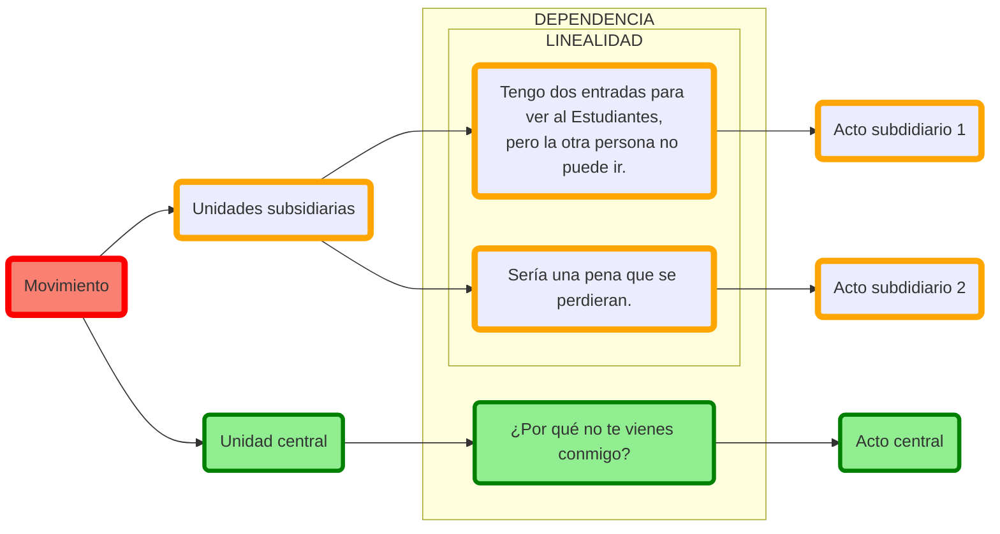

# 1. Introducción al discurso

## 1.1. Discurso

El término discurso se utiliza aquí no para referirse a un género literario, sino a la unidad superior a la oración (simple o compleja) subyacente a diferentes tipos de actos de comunicación humana(monólogos, diálogos, hablados, escritos) pertenecientes a diferentes géneros literarios (tragedias, discursos, prosa histórica, comedia, épica, etc.). Por tanto, una tragedia de Sófocles, la obra histórica de Tucídides, un discurso político de Demóstenes, o un fragmento de estas, son por igual «discursos» en este sentido del término. Este apartado trata, por tanto, de la sintaxis más allá de la oración (simple o compuesta) y se emplearán nuevos conceptos que requieren una lectura más atenta. La idea fundamental que recorre toda esta sección es que el hecho de hablar no consiste simplemente en emitir oraciones (simples o compuestas), sino que estas unidades están organizadas de una manera coherente para formar una unidad mayor con un propósito comunicativo definido.

## 1.2. Tipos de discurso

<!--
|                                       COMBINACIONES                                       |              Dialogal/monologal              | dialógico/monológico |
|:-----------------------------------------------------------------------------------------:|:--------------------------------------------:|:---------------------------------------------------------------------------------------:|
|                  **dialogal** dialógico                  |                 **dialogal**                 |                       dialógico                        |
|                 **dialogal** monológico                 |                 **dialogal**                 |                      monológico                       |
|  monologal dialógico  | monologal |                       dialógico                        |
| monologal monológico | monologal |                      monológico                       |

-->

|                COMBINACIONES                 |                      <b>Dialógico</b>                      |                     <b> Monológico </b>                      |
|:--------------------------------------------:|:-------------------------------------------------------------------------------------------:|:----------------------------------------------------------------------------------------------:|
|               <b>Dialogal</b>                |                   (1) dialogal dialógico                   |                   (2) dialogal monológico                    |
| Monologal | (3) monologal dialógico | (4) monologal monológico |

<ol class="parentesis">
<li>—A: No me funciona el ordenador. —B: ¿Has intentado encenderlo y apagarlo?</li>
<li>—A: Quien bien te quiere … —B: … te hará sufrir.</li>
<li>Tú dirás que lo has intentado todo, pero yo te digo que te falta mucho por probar antes de rendirte.</li>
<li>No me funciona el ordenador.</li>
</ol>

## 1.3. Niveles

### 1.3.1. Nivel representativo

### 1.3.2. Nivel interactivo

## 1.4. Unidades

1. Actos: la unidad más simple.
2. Movimientos: combinaciones de actos.

No está clara la diferencia entre oración y acto.

## 1.5. Coherencia y cohesión

<ol class="parentesis continuar" start="">
<li>Tengo dos entradas para ver al Estudiantes, pero la otra persona no puede ir. Sería una pena que se perdieran. ¿Por qué no te vienes conmigo?
</li>
</ol>
<ol class="parentesis continuar" start="">
<li>Tengo dos entradas para ver al Estudiantes, pero la otra persona no puede ir. Sería una pena que se perdieran. <b>Así que</b>, ¿por qué no te vienes conmigo?
</li>
</ol>

Medios de cohesión:

1. Expresiones metadiscursivas.
2. Partículas, conectores, o marcadores del discurso.
3. Disposición (icónica) del texto (discurso escrito).

### 1.5.1. 'Partículas, conectores, o marcadores del discurso'

- Partículas en el sentido más tradicional: γάρ, οὖν, ἀλλά, δέ, μέν, δή, μέντοι, καίτοι.
- Adverbios conjuntivos: ὅμως.
- SSPP: πρὸς τούτοις, πρὸς τούτῳ, ἔτι, χωρὶς τούτων.

### 1.5.2. Expresiones metalingüísticas

<ol class="parentesis continuar">
<li>τοῦτο <b>μέν νυν</b> τοιοῦτό ἐστι, <b>ἀναβήσομαι</b> δὲ <b>ἐς τὸν κατ᾿ ἀρχὰς ἤια λέξων λόγον</b>. Παρασκευαζομένου Δαρείου ἐπὶ τοὺς Σκύθας καὶ περιπέμποντος… («Pues bien, eso es así, pero <ins>voy a regresar a la narración que iba a contar al principio</ins>. Mientras Darío hacía sus preparativos contra los escitas y enviaba…», Hdt. 4.82.1).
</li>
<li>ἀλλὰ <b>ταῦτα</b> μὲν <b>εἰς ἄλλον ἀνακείσθω λόγον</b>. ἐν τούτῳ δέ, δωδεκάτῳ τῶν παραλλήλων ὄντι βίων, <b>τὸν τοῦ πρεσβυτέρου προεισαγάγωμεν</b>.</li>
<li>ταῦτα μὲν οὖν οὐκ ἄχρηστον ἔχει <b>τὴν παρέκβασιν</b>. («Esto es una digresión, pero no es inútil», 21.9)</li>
</ol>

### 1.5.3. Otros medios

- Oraciones comparativas:
<ol class="parentesis continuar">
<li>9.1 αἰτίαν δέ τούτου τὴν <ins>ἀπαιδευσίαν</ins> εἶναι νομίζων ἐμβαλεῖν αὐτὸν εἰς διατριβὰς ἐλευθερίους ἐφιλοτιμεῖτο καὶ γεῦσαι λόγων καὶ μαθημάτων ἠθοποιῶν, ὡς ἀρετήν τε παύσαιτο δεδιὼς καὶ τοῖς καλοῖς χαίρειν ἐθισθείη. 
... (excurso sobre los miedos de Dionisio I) ...
 
10.1 τὸν δʼ υἱὸν αὐτοῦ, <b>καθάπερ εἴρηται</b>, διαλελωβημένον <ins>ἀπαιδευσίᾳ</ins> καὶ συντετριμμένον τὸ ἦθος ὁ Δίων ὁρῶν παρεκάλει πρὸς παιδείαν τραπέσθαι καὶ δεηθῆναι τοῦ πρώτου τῶν φιλοσόφων πᾶσαν δέησιν ἐλθεῖν εἰς Σικελίαν·
</li>
</ol>

## 1.6. Relaciones estructurales

### 1.6.1. Lineales

### 1.6.2. Jerárquicas

- Subsidiarias
- Principales

## 1.7. Relaciones semánticas

### 1.7.1. Argumentación

|      Unidad introducida por el conector      |           Español           |                         Griego                          |
|:--------------------------------------------:|:---------------------------:|:-------------------------------------------------------:|
|                **Argumento**                 |  en efecto, efectivamente   |                      γάρ, γε, γοῦν                      |
| **Argumento / contraargumento adicional** |           además            | πρὸς τούτῳ/τούτοις, ἔτι, εἶτα, ἔπειτα, **χωρὶς τούτων** |
|             **Contraargumento**              |  sin embargo, no obstante   |                         καίτοι                          |
|                **Conclusión**                | por tanto, por consiguiente |                   οὖν, ἄρα, τοιγαροῦν                   |
|             **Tesis contraria**              |    pero lo cierto es que    |                        ἀλλὰ γάρ                         |

### 1.7.2. Topicalidad

| Tipo de tópico | Nuevo |      Cambio      |                  Subtópico                  |   Retomado    |        Resumido/cierre        |    Excurso    |
|:--------------:|:-----:|:----------------:|:-------------------------------------------:|:-------------:|:-----------------------------:|:-------------:|
| **Entidades**  |   A   |    A … **B**     | A … **A**1 … **A**2 … | A … B … **A** |           A … **A**           | A … **B** … A |
| **Conectores** | ἰδού  | αὖ, αὖτε, γε μήν |                  αὖ, αὖτε                   |      οὖν      | μέν, μὲν οὖν, μὲν δή, μέν νυν |      γάρ      |

1. Tópico nuevo
2. Subtópico
3. Cierre de tópico (μέν, μὲν δέ, μὲν οὖν)

### 1.7.3. Estructuras retóricas

1. Elaboración.
2. Resumen o recapitulación.

