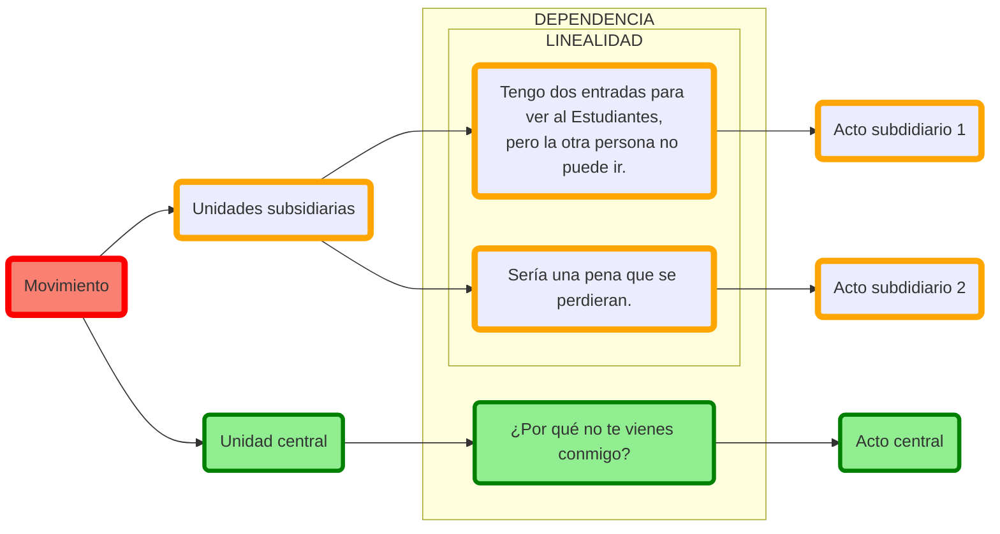

# 1. Introducción al discurso

## Discurso

El término discurso se utiliza aquí no para referirse a un género literario, sino a la unidad superior a la oración (simple o compleja) subyacente a diferentes tipos de actos de comunicación humana(monólogos, diálogos, hablados, escritos) pertenecientes a diferentes géneros literarios (tragedias, discursos, prosa histórica, comedia, épica, etc.). Por tanto, una tragedia de Sófocles, la obra histórica de Tucídides, un discurso político de Demóstenes, o un fragmento de estas, son por igual «discursos» en este sentido del término. Este apartado trata, por tanto, de la sintaxis más allá de la oración (simple o compuesta) y se emplearán nuevos conceptos que requieren una lectura más atenta. La idea fundamental que recorre toda esta sección es que el hecho de hablar no consiste simplemente en emitir oraciones (simples o compuestas), sino que estas unidades están organizadas de una manera coherente para formar una unidad mayor con un propósito comunicativo definido.

## 1.1. Coherencia y cohesión

<ol class="parentesis" start="1">
<li>Tengo dos entradas para ver al Estudiantes, pero la otra persona no puede ir. Sería una pena que se perdieran. ¿Por qué no te vienes conmigo?
</li>
</ol>
<ol class="parentesis continuar" start="">
<li>Tengo dos entradas para ver al Estudiantes, pero la otra persona no puede ir. Sería una pena que se perdieran. <b>Así que</b>, ¿por qué no te vienes conmigo?
</li>
</ol>

Medios de cohesión:

1. Expresiones metadiscursivas.
2. Partículas, conectores, o marcadores del discurso.
3. Disposición (icónica) del texto (discurso escrito).

## 1.2. Unidades

## 1.3. Relaciones estructurales

### 1.3.1. Lineales

### 1.3.2. Jerárquicas

- Subsidiarias
- Principales

## Niveles

### Nivel representativo

### Nivel interactivo

## Relaciones semánticas

### Argumentación

|Unidad introducida por el conector | Español | Griego |
| :---: | :---: | :---: |
| **Argumento** | en efecto, efectivamente | γάρ, γε, γοῦν |
| **Argumento / contraargumento adicional** | además | πρὸς τούτῳ/τούτοις, ἔτι, εἶτα, ἔπειτα, **χωρὶς τούτων**|
| **Contraargumento**| sin embargo, no obstante| καίτοι|
| **Conclusión**| por tanto, por consiguiente| οὖν, ἄρα, τοιγαροῦν|
| **Tesis contraria**| pero lo cierto es que| ἀλλὰ γάρ| 

### Topicalidad

| Nuevo |      Cambio      |       Subtópico       |   Retomado    |        Resumido/cierre        |    Excurso    |
|:-----:|:----------------:|:---------------------:|:-------------:|:-----------------------------:|:-------------:|
|   A   |    A … **B**     | A … **A**1 … **A**2 … | A … B … **A** |           A … **A**           | A … **B** … A |
| ἰδού  | αὖ, αὖτε, γε μήν |       αὖ, αὖτε        |      οὖν      | μέν, μὲν οὖν, μὲν δή, μέν νυν |      γάρ      |

1. Tópico nuevo
2. Subtópico
3. Cierre de tópico (μέν, μὲν δέ, μὲν οὖν)

### Estructuras retóricas

1. Elaboración.
2. Resumen o recapitulación.

## 1.4. 'Partículas'

## 1.6. Expresiones metalingüísticas

<ol class="parentesis continuar">
<li>τοῦτο <b>μέν νυν</b> τοιοῦτό ἐστι, <b>ἀναβήσομαι</b> δὲ <b>ἐς τὸν κατ᾿ ἀρχὰς ἤια λέξων λόγον</b>. Παρασκευαζομένου Δαρείου ἐπὶ τοὺς Σκύθας καὶ περιπέμποντος… («Pues bien, eso es así, pero <ins>voy a regresar a la narración que iba a contar al principio</ins>. Mientras Darío hacía sus preparativos contra los escitas y enviaba…», Hdt. 4.82.1).
</li>
<li>ἀλλὰ <b>ταῦτα</b> μὲν <b>εἰς ἄλλον ἀνακείσθω λόγον</b>. ἐν τούτῳ δέ, δωδεκάτῳ τῶν παραλλήλων ὄντι βίων, <b>τὸν τοῦ πρεσβυτέρου προεισαγάγωμεν</b>.</li>
<li>ταῦτα μὲν οὖν οὐκ ἄχρηστον ἔχει <b>τὴν παρέκβασιν</b>. («Esto es una digresión, pero no es inútil», 21.9)</li>
</ol>

## 1.7. Otros dispositivos
