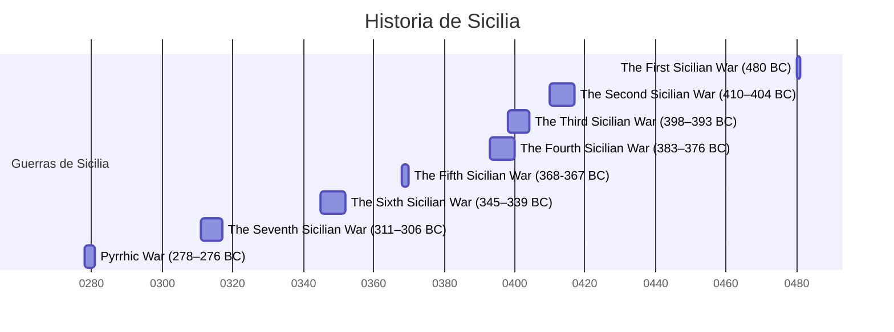

# Geografía de Sicilia

```mermaid

gantt

    title Historia de Sicilia
    dateFormat YYYY
    axisFormat %Y
    
    section Guerras de Sicilia
        The First Sicilian War (480 BC) : -0480, 1y
        The Second Sicilian War (410–404 BC): -0410, 7y
        The Third Sicilian War (398–393 BC): -0398, 6y
        The Fourth Sicilian War (383–376 BC): -0393, 7y
        The Fifth Sicilian War (368-367 BC): -0368, 2y
        The Sixth Sicilian War (345–339 BC): -0345, 7y
        The Seventh Sicilian War (311–306 BC): -0311, 6y
        Pyrrhic War (278–276 BC): -0278, 3y


```

## Colonias griegas

## Sicilia bajo el dominio de los Deinomidas (485-465 a.C.)

