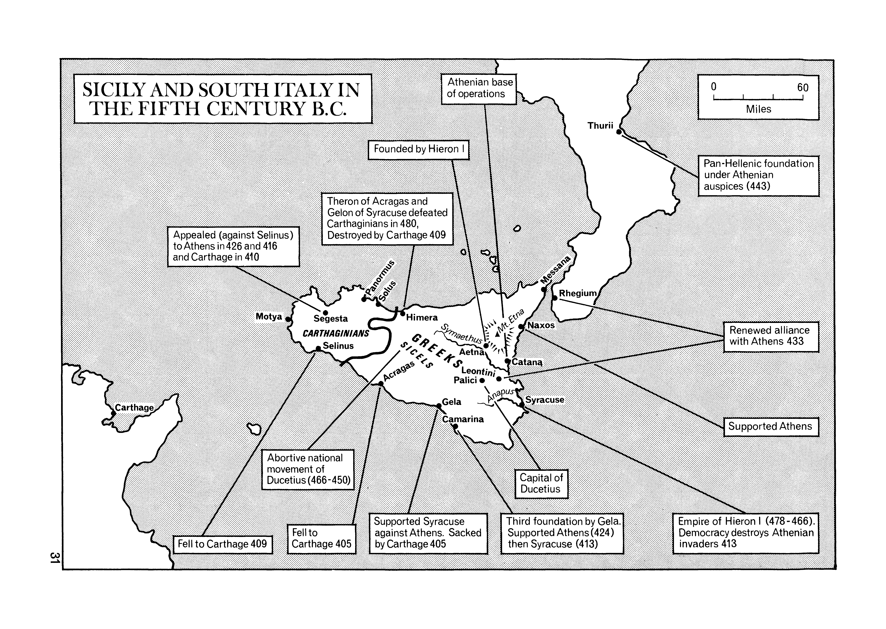
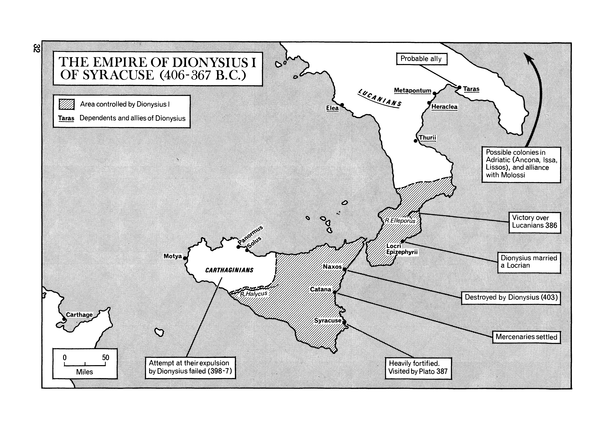

# Geografía de Sicilia

## Timeline

## Colonias griegas

## Sicilia bajo el dominio de los Dinoménidas (485-465 a.C.)

## Dialectos griegos de Sicilia

## Sitio de Siracusa por los Atenienses (415-413 a.C.)

## Sicilia y sur de Italia (s. V a.C.)

## Reino de Dionisio I (406-367 a.C.)

## Origen de los grandes escritores griegos

|||
|---|---|
| | |

## Asedio cartaginés de Siracusa 397 a.C

## Sicilia: 2ª batalla de Himera 409 a.C

| || |
|---:||:---|
|  | |

## Colonias griegas2

<table>
<tr><td></td><td>
</td><tr>
</table>

<table>
<tr><td></td><td>
</td><tr>
</table>
