# 1. Guía para el máster

## 1.1. Traducción de textos

*Dion* de Plutarco.

## 1.2. Prosa: Dion de Plutarco

### 1.2.1. Traducción

Comparación de las traducciones:

- Traducciones proporcionadas.
- Otras traducciones empleadas por los alumnos.

### 1.2.2. Ediciones

Comparación de las ediciones, particularmente en los puntos más conflictivos.

- Flacelière, R., & Chambry, E. (1978). Plutarque. Vies. Tome XIV. Dion- Brutus. Les Belles Lettres.
- Lindskog, C., Ziegler, K. & Gärtner, H. (1993). Plutarchus. Volumen II/Fasc. 1 Vitae parallelae. Phocion et Cato minor, Dion et Bruttus, Aemilius Paulus et Timoleon, Sertotius et Eumenes. Berlín, Boston: De Gruyter.
- Perrin, Bernadotte (2001). Plutarch's Lives. 6: Dion and Brutus, Timoleon and Aemilius Paulus / Plutarch. Harvard University Press.
- Sánchez Hernández, J. P., & González González, M. (2009). Plutarco: Vidas paralelas. Demetrio-Antonio, Dión-Bruto, Arato-Artajerjes-Galba-Otón. Editorial Gredos.

### 1.2.3. Contexto histórico

Ejes básicos:

- Relaciones entre Dion y los tiranos de Siracusa.
- Viajes de Platón a la ciudad (385, 367 y 361 a.C.).
- Relaciones entre griegos y cartagineses en la isla de Sicilia.
- Relaciones entre los griego de la isla y sus metropolis.

Bibliografía:
- De Angelis, F. (2016). Archaic and classical Greek Sicily: A social and economic history. Oxford University Press.
- Evans, R. (2016). Ancient Syracuse. Routledge.
- Lewis D.M. (1994). "Sicily, 413–368 B.C." En Lewis DM, Boardman J, Hornblower S, Ostwald M, eds. The Cambridge Ancient History. Volume 6: The Fourth Century BC. Cambridge University Press; 1994:120-155.
- Lewis D.M., Boardman J., Hornblower S., Ostwald M. (eds.) (1994): The Cambridge Ancient History. 2nd ed. Cambridge University Press.

### 1.2.4. Contexto geográfico

- Sicilia entre Italia y África.
- Sicilia y Grecia.

Bibliografía:
- Talbert, R. J. A. (2002). Atlas of Classical History. Routledge

### 1.2.5. Contexto filosófico

- Platonismo.
    - Teoría política.
    - El rey filósofo.
- Pitagorismo.

Bibliografía:

- Estudios generales

    - Guthrie, W. K. C. (1993). A history of Greek philosophy. 4: Plato: the man and his dialogues: earlier period. Cambridge University Press.
    - Guthrie, W. K. C. (2001). A history of Greek philosophy. 5: The later Plato and the academy. Cambridge University Press.
    - Rowe, C. J. (2003). Plato. Bristol Classical Press.
    - Waterfield, R. (2023). Plato of Athens: A Life in Philosophy. Oxford University Press.

- Platón en Siracusa

    - Reid, Heather L. & Mark Ralkowski (2019). Plato at Syracuse: Essays on Plato in Western Greece. Edited by. Translated by Jonah Radding. Sioux City, Iowa: Parnassos Press.

### 1.2.6. Contexto literario

#### 1.2.6.1. Fuentes

- Platón (427-347 a. C.): Cartas.
- Plutarco (Queronea, c. 46 o 50-Delfos, c. 120): Vidas paralelas. Dion y Bruto.
- Nepote (Galia Cisalpina, c. 100 a. C.-¿Roma?, c. 25 a. C.): De viris illustribus, (Sobre los hombres ilustres): Dion de Siracusa.
- Diodoro Sículo (s. I a.C.): Biblioteca Histórica.
- Atanis de Siracusa (s. IV a.C.): Σικελικά. Compañero de Heraclides. Sucesos 362-357 a.C.
- Filisto de Siracusa (c. 432–356 a.C.).
    1. Περὶ Διονυσίου (4 libros sobre el Reino de Dionisio I desde el 367 al 362).
    2. Τὰ περὶ τὸν Διονυσἰον τὸν νεώτερον (dos libros Reino de Dionisio II desde el 367 al 362).
- Timónides de Leucas (s. IV a.C.). Cartas a Espeusipo.
- Éforo de Cime/Cumas (400-330 a.C.). Historia universal (29 libros).
- Teopompo (Quíos, 380 a. C.-323 a. C.).
- Timeo de Tauromenium (356/350-260 a.C.)

```mermaid
---
displayMode: compact
---
gantt


    title Fuentes históricas sobre Dion de Siracusa
    dateFormat X
    axisFormat %s
    tickInterval 100second

section Dion

Dion de Siracusa (408 - 354 a. C.): -354, -408, 100s

section s. IV a.C.

IV a.C.: crit, -301, -400, 100s
III a.C.: -201, -300, 100s
II a.C.: crit, -101, -200, 100s
I a.C.: -001, -100, 100s
I: crit, 1, 100s
II: 101, 100s

section Filisto

Filisto de Siracusa (c. 432–356 a.C.): done, -356, -432, 74s

section Platón

Platón (427-347 a. C.): -347, -427, 90s

section Timónides

Timónides de Leucas (s. IV a.C.): done, -301, -400, 100s

section Atanis
Atanis de Siracusa (s. IV a.C.): done, -301, -400, 100s

section Éforo

Éforo de Cime/Cumas (400-330 a.C.): done, -330, -400, 70s

section Teopompo

Teopompo  (Quíos, 380 a. C.-323 a. C.): done, -323, -380, 57s

section Timeo 

Timeo de Tauromenium (356/350-260 a.C.): done, -260, -350, 90s

section Diodoro Sículo
Diodoro Sículo (s. I a.C.): -001, -100, 100s

section Nepote
Nepote (Galia Cisalpina, c. 100 a. C.-¿Roma?, c. 25 a. C.): -25, -100, 75s

section Plutarco

Plutarco (Queronea, c. 46 o 50-Delfos, c. 120): 120, 50, 70s

```

- Sanders, Jehuda Lionel (2008): *The legend of Dion*. Dundurn Group.
- Eggers Lan, C. (1988). Platón. Diálogos IV. República (Vol. 94). Gredos.
- Torres Guerra, J. B. (1993). Platón. Cartas. Akal.
- Zaragoza, J. & P. Gómez Cardó: (1992). Platón. Diálogos: VII. Dudosos, Apócrifos, Cartas. Gredos.

#### 1.2.6.2. Plutarco

- Beck, M. (Ed.). (2014). A Companion to Plutarch. Wiley Blackwell.
- Fernández Delgado, J. A. & Pordomingo Pardo, Fca. (eds.). Estudios sobre Plutarco. Aspectos formales de la obra de Plutarco. Ediciones Clásicas.
- Pérez Jiménez, A. (1985). Plutarco. Vidas paralelas: I. Teseo-Rómulo, Licurgo-Numa. Gredos. Véase la «Introducción general».
- Titchener, F. B., & Zadorojnyi, A. V. (Eds.). (2023). The Cambridge Companion to Plutarch. Cambridge University Press.

### 1.2.7. Recepción

- Renault, Mary: *The mask of Apollo*.
- Manfredi, Valerio Massimo: *El Tirano*.

## 1.3. Métodos y herramientas

### 1.3.1. Ediciones bilingües

1. Tablas.
2. [Perseus](https://www.perseus.tufts.edu/hopper/text?doc=Perseus%3Atext%3A2008.01.0112%3Achapter%3D1%3Asection%3D1)
3. [Scaiffe](https://scaife.perseus.org/reader/urn:cts:greekLit:tlg0007.tlg060.perseus-grc2:1.1?q=Plutarch%20dion&qk=form&right=perseus-eng2)

### 1.3.2. Vocabulario

1. [Perseus](https://www.perseus.tufts.edu/hopper/vocablist)
2. [TLG](https://stephanus.tlg.uci.edu)
3. [Anki](https://apps.ankiweb.net)

### 1.3.3. Concordancias

1. [AntConc](https://www.laurenceanthony.net/software/antconc/)
2. [SketchEngine](https://www.sketchengine.eu)
3. [Diogenes](https://d.iogen.es/web)

### 1.3.4. Gramática

1. Bibliografía:
    - Emde Boas, E. van, Rijksbaron, A., Huitink, L., & Bakker, M. de. (2021). The Cambridge grammar of classical Greek. Cambridge University Press.
    - Jiménez López, M. D. (Ed.). (2020a). Sintaxis del griego antiguo. 1. Introducción, sintaxis nominal, preposiciones, adverbios y partículas. Consejo Superior de Investigaciones Científicas.
    - Jiménez López, M. D. (Ed.). (2020b). Sintaxis del griego antiguo. 2. Sintaxis verbal, coordinación, subordinación, orden de palabras. Consejo Superior de Investigaciones Científicas.

2. Diccionario gramatical:
    - [Griego](https://pajaro1966.github.io/Diccionario-Gramatical-GrAnt/Dicc_Gr/)
    - [Español](https://pajaro1966.github.io/Diccionario-Gramatical-GrAnt/Dicc_Esp/)

### 1.3.5. Discurso: estructura discursiva

- [Estructura de la obra](https://pajaro1966.github.io/Asignaturas/Plutarch_Dion/Discurso/Dion_Discurso.html)
- [Introducción a la teoría del discurso](https://pajaro1966.github.io/Asignaturas/Plutarch_Dion/Discurso/Discurso_Intro/)

## 1.4. Contacto

### 1.4.1. Whatsapp

### 1.4.2. Dropbox

- Están todos dados de alta.
- Direcciones de los alumnos: email a antonio.revuelta@uam.es con asunto "Alta en Dropbox".

## 1.5. Tareas

1. Leer en español la obra de Plutarco. Es necesario leerla al menos dos o tres veces.
2. Traducir todos los días.
3. Revisar las ediciones para comprobar en qué puntos difieren de la versión digital.
4. Revisar las traducciones para comprobar posibles discrepancias e interpretaciones.
5. Revisar la morfología.
6. Revisar la formación de palabras.
7. Revisar sintaxis.
8. Comparar con otras obras:
    1. Platón: cartas (7ª).
    2. Platón: República (descripción de la tiranía).
    3. Nepote: Dion.
    4. Diodoro Sículo.
9. Sacar un listado de los nombres propios.
