# Bibliografía

## Plutarco

### Ediciones y traducciones de la vida de Dión

- Flacelière, R., & Chambry, E. (1978). Plutarque. Vies. Tome XIV. Dion- Brutus. Les Belles Lettres.
- Lindskog, C., Ziegler, K. & Gärtner, H. (1993). Plutarchus. Volumen II/Fasc. 1 Vitae parallelae. Phocion et Cato minor, Dion et Bruttus, Aemilius Paulus et Timoleon, Sertotius et Eumenes. Berlín, Boston: De Gruyter.
- Perrin, Bernadotte (2001). Plutarch’s Lives. 6: Dion and Brutus, Timoleon and Aemilius Paulus / Plutarch. Harvard University Press.
- Sánchez Hernández, J. P., & González González, M. (2009). Plutarco: Vidas paralelas. Demetrio-Antonio, Dión-Bruto, Arato-Artajerjes-Galba-Otón. Editorial Gredos.

### Estudios sobre Plutarco

- Beck, M. (Ed.). (2014). A Companion to Plutarch. Wiley Blackwell.
- Fernández Delgado, J. A. & Pordomingo Pardo, Fca. (eds.). Estudios sobre Plutarco. Aspectos formales de la obra de Plutarco. Ediciones Clásicas.
- Pérez Jiménez, A. (1985). Plutarco. Vidas paralelas: I. Teseo-Rómulo, Licurgo-Numa. Gredos. Véase la «Introducción general».
- Titchener, F. B., & Zadorojnyi, A. V. (Eds.). (2023). The Cambridge Companion to Plutarch. Cambridge University Press.

## Platón

### Estudios generales

- Guthrie, W. K. C. (1993). A history of Greek philosophy. 4: Plato: the man and his dialogues: earlier period. Cambridge University Press.
- Guthrie, W. K. C. (2001). A history of Greek philosophy. 5: The later Plato and the academy. Cambridge University Press.
- Rowe, C. J. (2003). Plato. Bristol Classical Press.
- Waterfield, R. (2023). Plato of Athens: A Life in Philosophy. Oxford University Press.

### Platón en Siracusa

- Reid, Heather L. & Mark Ralkowski (2019). Plato at Syracuse: Essays on Plato in Western Greece. Edited by. Translated by Jonah Radding. Sioux City, Iowa: Parnassos Press.

## Textos

- Eggers Lan, C. (1988). Platón. Diálogos IV. República (Vol. 94). Gredos.
- Torres Guerra, J. B. (1993). Platón. Cartas. Akal.
- Zaragoza, J. & P. Gómez Cardó: (1992). Platón. Diálogos: VII. Dudosos, Apócrifos, Cartas. Gredos.

## Sicilia y Siracusa

- De Angelis, F. (2016). Archaic and classical Greek Sicily: A social and economic history. Oxford University Press.
- Evans, R. (2016). Ancient Syracuse. Routledge.
- Lewis D.M. (1994). ‘Sicily, 413–368 B.C.’ En Lewis DM, Boardman J, Hornblower S, Ostwald M, eds. The Cambridge Ancient History. Volume 6: The Fourth Century BC. Cambridge University Press; 1994:120-155.
- Lewis D.M., Boardman J., Hornblower S., Ostwald M. (eds.) (1994): The Cambridge Ancient History. 2nd ed. Cambridge University Press.

## Dion

- Sanders, Jehuda Lionel (2008): *The legend of Dion*. Dundurn Group.

## Fuentes

- Platón (427-347 a. C.): Cartas.
- Plutarco (Queronea, c. 46 o 50-Delfos, c. 120): Vidas paralelas. Dion y Bruto.
- Nepote (Galia Cisalpina, c. 100 a. C.-¿Roma?, c. 25 a. C.): De viris illustribus, (Sobre los hombres ilustres): Dion de Siracusa.
- Diodoro Sículo (s. I a.C.): Biblioteca Histórica.
- Atanis de Siracusa (s. IV a.C.): Σικελικά. Compañero de Heraclides. Sucesos 362-357 a.C.
- Filisto de Siracusa (c. 432–356 a.C.). a) Περὶ Διονυσίου (4 libros sobre el Reino de Dionisio I desde el 367 al 362). b) Τὰ περὶ τὸν Διονυσἰον τὸν νεώτερον (dos libros Reino de Dionisio II desde el 367 al 362).
- Timónides de Leucas (s. IV a.C.). Cartas a Espeusipo.
- Éforo de Cime/Cumas (400-330 a.C.). Historia universal (29 libros).
- Teopompo (Quíos, 380 a. C.-323 a. C.). 
- Timeo de Tauromenium (356/350-260 a.C.) 

Platón (427-347 a. C.)
Timónides de Leucas (s. IV a.C.)
Filisto de Siracusa (c. 432–356 a.C.)
Atanis de Siracusa (s. IV a.C.)
Diodoro Sículo (s. I a.C.)
Nepote (Galia Cisalpina, c. 100 a. C.-¿Roma?, c. 25 a. C.)
Plutarco (Queronea, c. 46 o 50-Delfos, c. 120)

```mermaid
---
displayMode: compact
---
gantt


    title Fuentes históricas sobre Dion de Siracusa
    dateFormat X
    axisFormat %s
    tickInterval 60second

section Dion

Dion de Siracusa (408 - 354 a. C.): -354, -408, 100s

section s. IV a.C.

s.IV a.C.: crit, -301, -400, 100s
s.III a.C.: -201, -300, 100s
s.II a.C.: crit, -101, -200, 100s
s.I a.C.: -001, -100, 100s
s.I: crit, 1, 100s
s.II: 101, 100s

section Filisto

Filisto de Siracusa (c. 432–356 a.C.): done, -356, -432, 74s

section Platón

Platón (427-347 a. C.): -347, -427, 90s

section Timónides

Timónides de Leucas (s. IV a.C.): done, -301, -400, 100s

section Atanis
Atanis de Siracusa (s. IV a.C.): done, -301, -400, 100s

section Éforo

Éforo de Cime/Cumas (400-330 a.C.): done, -330, -400, 70s

section Teopompo

Teopompo  (Quíos, 380 a. C.-323 a. C.): done, -323, -380, 57s

section Timeo 

Timeo de Tauromenium (356/350-260 a.C.): done, -260, -350, 90s

section Diodoro Sículo
Diodoro Sículo (s. I a.C.): -001, -100, 100s

section Nepote
Nepote (Galia Cisalpina, c. 100 a. C.-¿Roma?, c. 25 a. C.): -25, -100, 75s

section Plutarco

Plutarco (Queronea, c. 46 o 50-Delfos, c. 120): 120, 50, 70s

```

## Geografía

- Talbert, R. J. A. (2002). Atlas of Classical History. Routledge.

## Gramática

- Emde Boas, E. van, Rijksbaron, A., Huitink, L., & Bakker, M. de. (2021). The Cambridge grammar of classical Greek. Cambridge University Press.
- Jiménez López, M. D. (Ed.). (2020a). Sintaxis del griego antiguo. 1. Introducción, sintaxis nominal, preposiciones, adverbios y partículas. Consejo Superior de Investigaciones Científicas.
- Jiménez López, M. D. (Ed.). (2020b). Sintaxis del griego antiguo. 2. Sintaxis verbal, coordinación, subordinación, orden de palabras. Consejo Superior de Investigaciones Científicas.

## Literatura

- Renault, Mary (1966): _The mask of Apollo_. Longmans, Green & Co, London; Pantheon, New York

## Online

- [Dion, podcast](https://grammaticus.co/podcast/dion/)
