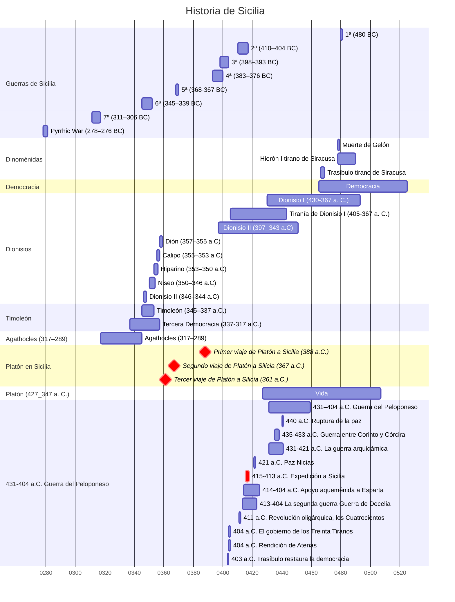

```mermaid
---
displayMode: 
---

%%{
  init: {
  
    'theme': 'base',
    'themeVariables': {
    'fontSize': '52'
    primaryTextColor
    secondaryColor
    }
  }
}%%


gantt

    title Historia de Sicilia
    dateFormat YYYY
    axisFormat %Y
    tickInterval 1y
    
    section Guerras de Sicilia
        1ª (480 BC) : -0480, 1y
        2ª (410–404 BC): -0410, 7y
        3ª (398–393 BC): -0398, 6y
        4ª (383–376 BC): -0393, 7y
        5ª (368-367 BC): -0368, 2y
        6ª (345–339 BC): -0345, 7y
        7ª (311–306 BC): -0311, 6y
        Pyrrhic War (278–276 BC): -0278, 3y

    section Dinoménidas
    
        Muerte de Gelón: -0478, -0478, 1y
        Hierón I tirano de Siracusa: -0467, -0478, 12y
        Trasibulo tirano de Siracusa: -0465, -0466, 3y

    section Democracia
    
        Democracia: -0405, -0465, 60y

    section Dionisios
        Dionisio I (430-367 a. C.): -0367, -0430, 63y
        Tiranía de Dionisio I (405-367 a. C.): -0367, -0405, 38y
        Dionisio II (397_343 a.C): -0343, -0397, 54y
        Dión (357–355 a.C): -0355, -0357, 2y
        Calipo (355–353 a.C): -0353, -0355, 2y
        Hiparino (353–350 a.C): -0350, -0353, 3y
        Niseo (350–346 a.C): -0346, -0350, 4y
        Dionisio II (346–344 a.C): -0344, -0346, 2y

    section Timoleón
        Timoleón (345–337 a.C.): -0337, -0345, 8y
        Tercera Democracia (337-317 a.C.): -0317, -0337, 20y

    section Agathocles (317–289)
        Agathocles (317–289): -0289, -0317, 28y

    section Platón en Sicilia
        Primer viaje de Platón a Sicilia (388 a.C.): crit, milestone, -0388, -0388, 1d
        Segundo viaje de Platón a Silicia (367 a.C.): crit, milestone, -0367, 1d
        Tercer viaje de Platón a Silicia (361 a.C.): crit, milestone, -0361, 1d
    
    section Platón (427_347 a. C.)
        Vida: -0347, -0427, 80y

    section 431-404 a.C. Guerra del Peloponeso
        431–404 a.C. Guerra del Peloponeso: a0, -0431, 28y
        440 a.C. Ruptura de la paz: rebelión de Samos contra Atenas:a1, -0440, 1y
        435-433 a.C. Guerra entre Corinto y Córcira: a6, -0435, 3y
        431-421 a.C. La guerra arquidámica :a2, -0431, 10y
        421 a.C. Paz Nicias :a3, -0421, 1y
        415-413 a.C. Expedición a Sicilia : crit, -0415, 3y
        414-404 a.C. Apoyo aqueménida a Esparta: a5, -0414, 11y
        413-404 La segunda guerra Guerra de Decelia: a5, -0413, 10y
        411 a.C. Revolución oligárquica, los Cuatrocientos: a7, -0411, 1y
        404 a.C. El gobierno de los Treinta Tiranos: a7, -0404, 1y
        404 a.C. Rendición de Atenas: a6, -0404, 1y
        403 a.C. Trasíbulo restaura la democracia: a7, -0403, 1y

```
