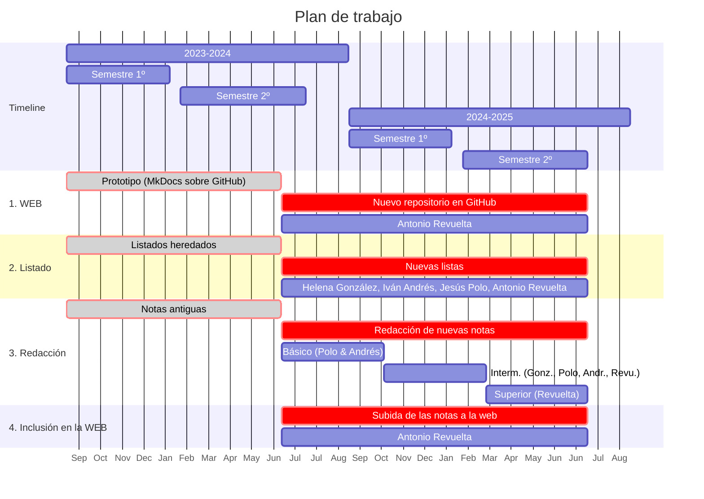

# Cronodiagrama

```mermaid

---
title: ACTIVIDADES 2023-2024,
config:
 "theme": base,
 "themeCSS": ".taskText {fill: white; text-anchor: middle;}, .grid .tick line {stroke: blue !important; stroke-dasharray: 0 ; opacity: 0.5 !important; }, .todayMarker {stroke-width:5px,stroke:#0f0,opacity:0.5}"
displayMode: 

---
gantt
title Plan de trabajo
dateFormat  DD-MM-YYYY
axisFormat %b
tickInterval 4week
todayMarker stroke-width:3px,stroke:black,opacity:1
weekday monday

section Timeline

2023-2024: 09-09-2023, 08-09-2024
Semestre 1º: 09-09-2023, 20-01-2024
Semestre 2º: 03-02-2024, 15-07-2024

2024-2025: 09-09-2024, 08-09-2025
Semestre 1º: 09-09-2024, 20-01-2025
Semestre 2º: 03-02-2025, 15-07-2025


section 1. WEB
Prototipo (MkDocs sobre GitHub): done, crit, 09-09-2023, 13-06-2024

Nuevo repositorio en GitHub: crit, 14-06-2024, 15-07-2025
Antonio Revuelta: 14-06-2024, 15-07-2025

section 2. Listado
Listados heredados: done, crit, 09-09-2023, 13-06-2024

Nuevas listas: crit, 14-06-2024, 15-07-2025
Helena González, Iván Andrés, Jesús Polo, Antonio Revuelta: 14-06-2024, 15-07-2025

section 3. Redacción
Notas antiguas: done, crit, 09-09-2023, 13-06-2024

Redacción de nuevas notas: crit, 14-06-2024, 15-07-2025
Básico (Polo & Andrés): a1, 14-06-2024, 132d
Interm. (Gonz., Polo, Andr., Revu.): a2, after a1, 132d
Superior (Revuelta): a3, after a2, 132d 

section 4. Inclusión en la WEB

Subida de las notas a la web: crit, 14-06-2024, 15-07-2025
Antonio Revuelta: 14-06-2024, 15-07-2025

```
