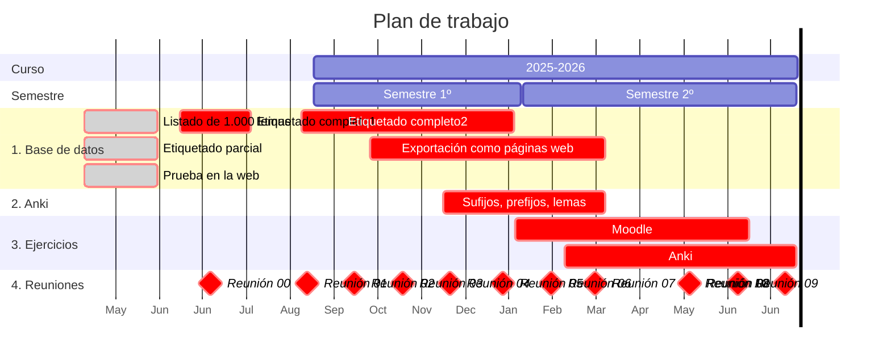

# Cronodiagrama

```mermaid

---
title: ACTIVIDADES 2025-2026,
config:
 "theme": base,
 "themeCSS": ".taskText {fill: white; text-anchor: middle;}, .grid .tick line {stroke: blue !important; stroke-dasharray: 0 ; opacity: 0.5 !important; }, .todayMarker {stroke-width:5px,stroke:#0f0,opacity:0.5}"
displayMode: compact

---
gantt
title Plan de trabajo
dateFormat  DD-MM-YYYY
axisFormat %b
tickInterval 4week
todayMarker stroke-width:3px,stroke:black,opacity:1
weekday monday

section Curso

2025-2026: 09-09-2025, 16-07-2026

section Semestre

Semestre 1º: 09-09-2025, 20-01-2026
Semestre 2º: 21-01-2026, 15-07-2026

section 1. Base de datos

Listado de 1.000 lemas: done, crit, 15-04-2025, 01-06-2025
Etiquetado parcial: done, crit, 15-04-2025, 01-06-2025
Prueba en la web: done, crit, 15-04-2025, 01-06-2025
Etiquetado completo1: crit, 15-06-2025, 31-07-2025
Etiquetado completo2: crit, 01-09-2025, 15-01-2026
Exportación como páginas web: crit, 15-10-2025, 15-03-2026

section 2. Anki
Sufijos, prefijos, lemas: crit, 01-12-2025, 15-03-2026

section 3. Ejercicios
Moodle: crit, 16-01-2026, 15-06-2026
Anki: crit, 17-02-2026, 15-07-2026

section 4. Reuniones
Reunión 00: crit, milestone, 05-07-2025, 05-07-2025
Reunión 01: crit, milestone, 05-09-2025, 05-09-2025
Reunión 02: crit, milestone, 05-10-2025, 05-10-2025
Reunión 03: crit, milestone, 05-11-2025, 05-11-2025
Reunión 04: crit, milestone, 05-12-2025, 05-12-2025
Reunión 05: crit, milestone, 08-01-2026, 08-01-2026
Reunión 06: crit, milestone, 08-02-2026, 08-02-2026
Reunión 07: crit, milestone, 08-03-2026, 08-03-2026
Reunión 08: crit, milestone, 08-05-2026, 08-05-2026
Reunión 09: crit, milestone, 08-06-2026, 08-06-2026
Reunión 10: crit, milestone, 08-07-2026, 08-07-2026

```