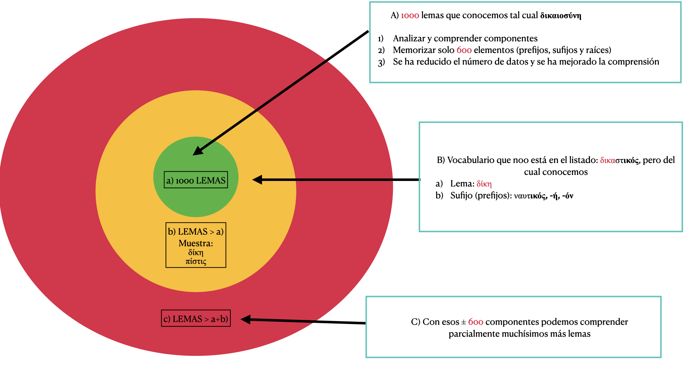
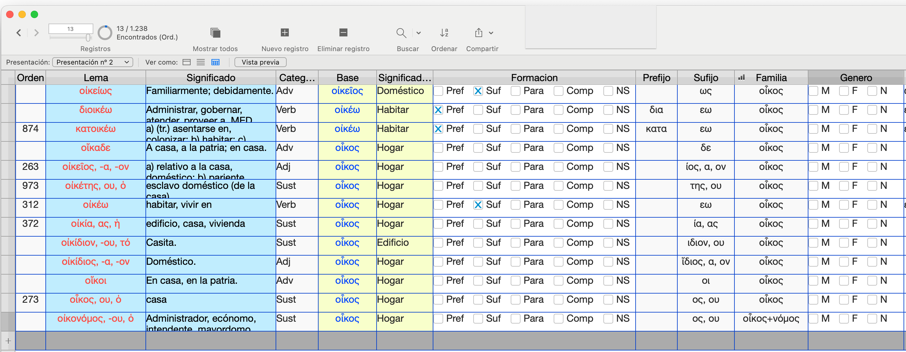
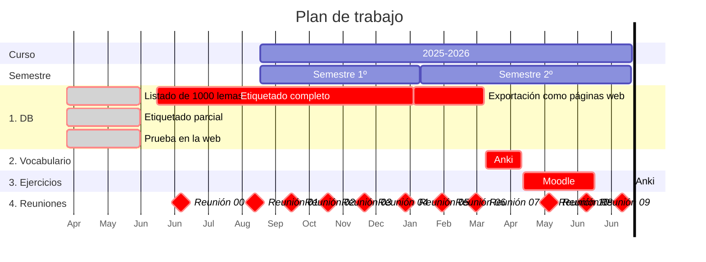

# Solicitud

---

FYL_028.25_INN Formación de palabras en griego antiguo: vocabulario, gramática y ejercicios

## 1. Financiación

|**TIPO**|**DESCRIPCIÓN**|**CUANTÍA**|
|---|---|---|
|Aplicaciones|3 licencias de Filemaker|1268,00 €|
|Servicios|1. GitHub Enterprise; 2. servicios de hosting|400,00 €|
|Materiales| | |

---

## 2. Resumen del proyecto en 300 palabras máximo

El presente proyecto tiene como objetivo la creación de un manual práctico de formación de palabras del griego antiguo para el uso de los alumnos de los grados impartidos por el Departamento de Filología Clásica: Grado en Estudios Clásicos y de la Antigüedad y Doble grado en Historia del Arte y Estudios Clásicos y de la Antigüedad. 
Dicho manual incluirá no solo las reglas más importantes de la derivación y composición de palabras en griego antiguo, sino también las reglas fonéticas ligadas a dichos procesos y estará aplicado al estudio y comprensión del vocabulario de frecuencia empleado en este departamento desde hace varios años. 
El material creado estará a disposición libre de los alumnos a través de un repositorio  online creado en GitHub con Material para MkDocs.
Aunque inicialmente el resultado de este proyecto estará alojado en GitHub con MkDocs, el siguiente paso será su publicación —en formato impreso, epub o ambos— para uso por parte de estudiantes universitarios y de secundaria.
El objetivo de este proyecto es solucionar las dificultades del aprendizaje del vocabulario de las lenguas clásicas y evitar la dependencia excesiva del diccionario por parte de los alumnos. En proyectos anteriores creamos un vocabulario de frecuencia de mil (1000) lemas que cubre más de un 72% de cualquier texto en griego. Asimismo creamos una infraestructura en Memrise y Anki para el estudio del mismo por parte de los alumnos utilizando el método de la repetición espaciada. En este proyecto el objetivo es descomponer el significado de ese vocabulario esencial en sus componenentes básicos (lexemas, prefijos, sufijos, infijos, etc.) de manera que se consigan una serie de beneficios: (i) los alumnos tendrán más facilidad para aprender el significado de los lemas a través del conocimientos de sus elementos compositivos; (ii) podrán utilizar el conocimiento de lexemas, sufijos, prefijos, etc., para deducir el significado de un número mucho mayor de lemas más allá de esos 1000 iniciales (el diccionario LSJ del griego antiguo contiene más de 116.000 lemas).

---

## 3. Objetivos

### 3.1. Descripción de la situación a mejorar

Existe un doble vacío en el estudio de la formación de palabras en griego antiguo: no existen manuales actuales y completos al alcance de los estudiantes; el material existente no está vinculado a la comprensión del vocabulario de frecuencia empleado por los estudiantes.
Las obras de Chantraine (2002), Debrunner (1917), Risch (1937) y Schwyzer (1939) son de difícil consulta para los alumnos. Las más accesibles de Alfageme (1988) y Emde Boas et alii (2019) son demasiado incompletas. Unas y otras adolecen de un problema común: sus explicaciones no resultan útiles para los alumnos. Nuestro propósito es abordar este problema dirigiendo el estudio de la formación de palabras a la comprensión del vocabulario de frecuencia que los alumnos se van a encontrar durante todos sus años de estudio. De esta manera conseguiremos un doble beneficio: los alumnos comprenderán mejor las reglas estudiadas porque el material con que se ejemplifica lo conocen y usan dariamente; por otro lado, las reglas de formación de palabras les permitirán comprender mejor la estructura y significado de ese vocabulario y mejorará también su memorización del mismo.
Por otro lado, las reglas aprendidas les permitirán poder ampliar su conocimiento de vocabulario más allá del vocabulario básico de frecuencia que aprenden de manera memorística (unos mil lemas).
Aunque este proyecto es claramente diferente de los dos últimos solicitados por el equipo de trabajo está claramente relacionado con ellos, como no puede ser de otra forma. En el proyecto "Vocabulario básico de frecuencia del griego antiguo" (FYL_019.23_INN) se creó un vocabulario de frecuencia de mil (1.000) lemas y se puso a disposición de los alumnos para su estudio mediante el método de la repetición espaciada en diferentes plataformas (cf. https://pajaro1966.github.io/Asignaturas/Vocabulario/Vocab_Intro/). En el proyecto "Gramática práctica online del griego antiguo" (FYL_065.24_INN) se ha creado una gramática de la lengua griega adaptada a las necesidades generales de los alumnos de los grados del Departamento de Filología Clásica. Con el presente proyecto se pretende vincular la comprensión y memorización del vocabulario con el conocmiento de la formación de palabras.
El estudio y conocimiento del vocabulario es una tarea esencial y normalmente descuidada en el aprendizaje de las lenguas, y más aun en el caso de las lenguas clásicas. El bajo nivel de vocabulario dificulta el progreso y convierte el estudio en una tarea difícil, frustrante y muy aburrida. Sin embargo, el conocimiento de un vocabulario de frecuencia facilita enormemente el proceso de aprendizaje y ese es el motivo de que hayan proliferado en los últimos años diversas obras al respecto, como sucede con la serie de la editorial Routledge "Frequency Dictionaries":

https://www.routledge.com/Routledge-Frequency-Dictionaries/book-series/RFD?publishedFilter=alltitles&pd=published,forthcoming&pg=1&pp=12&so=pub&view=list

Con este proyecto vamos a dotar a los alumnos de los conocimientos teóricos necesarios para que comprendan el vocabulario básico del griego antiguo, puedan extender su vocabulario más allá de los límites actuales y puedan reducir su dependencia del diciconario.

- Alfageme, I. R. (1988). Nueva gramática griega. Coloquio.
- Chantraine, P. (2002). Morphologie historique du grec (Reprint of the 2nd edition Paris 1961). Klincksieck.
- Debrunner A. (1917). Griechische Wortbildungslehre. C. Winter.
- Emde Boas E. van. (2019). The Cambridge Grammar of Classical Greek. Cambridge University Press.
- Risch E. (1937). Wortbildung der Homerischen Sprache. W. de Gruyter.
- Schwyzer, Eduard. 1939. Griechische Grammatik. Vol. 1. München: Beck. I: 415-ff.

### 3.2. Objetivos generales y específicos

El objetivo se puede dividir en dos subtareas fundamentales: (i) la creación de un manual online de reglas morfológicas y fonéticas que expliquen el vocabulario básico inicial (1000 lemas) y (ii) una serie de ejercicios en las plataformas Anki y Moodle que permitan comprobar que los alumnos adquieren los conocimientos que se les va a ir impartiendo. 
Para conseguir el primer objetivo partimos de una base de datos que contiene los 1000 lemas más frecuentes (proyecto FYL_019.23_INN). Vamos a etiquetar dicha base de datos a fin de obtener la información básica de todos los lemas (el signo '+' indica que la tarea ya está completada): lema (+), significado (+), clase de palabra, género, declinación/conjugación, sufijo, prefijo, infijo, familia de palabra, etc. Una vez etiquetada la base de datos podremos obtener listados de los fenómenos que debemos explicar y listados de su representación en dicho corpus. 
El material se pondrá online en una web creada en Github y tendrás las siguientes secciones (se ha creado una web meramente indicativa):

- El listado del vocabulario completo en formato de tabla que se podrá ordenar por diferentes criterios empleando javascript: el lema, la base de la que deriva, su frecuencia, su sufijo, su prefijo, su categoría, etc. Actualmente el listado completo se encuentra ya en formato de tabla en la siguiente dirección:
  https://pajaro1966.github.io/Asignaturas/Proyecto_Innova_2025_2026/Vocabulario_Mil.html
- El listado completo de los sufijos y de las palabras que los presentan:
https://pajaro1966.github.io/Asignaturas/Proyecto_Innova_2025_2026/Sufijos.html
- El listado completo de los prefijos y de los lemas en que aparecen.
https://pajaro1966.github.io/Asignaturas/Proyecto_Innova_2025_2026/Prefijos.html
- El listado de las familias de palabras, sus componentes y las relaciones entre ellos.
https://pajaro1966.github.io/Asignaturas/Proyecto_Innova_2025_2026/Familias.html
- El listado de los infijos.
- Las reglas fonéticas que aplican en los diferentes casos.
- ....

Todas las páginas y los datos que contienen estarán indexadas de manera que los alumnos puedan pasar de una representación a otras de los lemas y sus diversos componentes. 
La idea es que no solo se presente información teórica a los alumnos sobre los diferentes aspectos de la formación de palabras en griego antiguo, sino que la constaten en el vocabulario que deben aprender a fin de que (i) puedan memorizar este con mayor facilidad y (ii) puedan extender estas reglas a otras palabras fuera de la lista de referencia inicial. Por ejemplo, aunque la palabra δικαστικός no figura entre esos 1000 lemas, su significado puede ser conjeturado por el estudiante porque conoce el lexema δικα/η- (δίκη 'justicia' > δικάζω 'juzgar' > δικαστής 'juez') del que deriva, y el sufijo -ικός presente en ναυτ-ικός (ναῦς 'nave' > ναύτης 'marinero' > ναυτικός 'relativo a los marineros') y en otras palabras del vocabulario de referencia del que se parte: δικασ-τ-ικός ή όν 'relativo (-ικός ή όν) a la persona (δικαστής) que juzga (δικάζω)'. Por otro lado,

### 3.3. Posibilidades de éxito

Tenemos a nuestra disposición tanto el material como los procedimientos para llevar a cabo el proyecto.

**(1) Material disponible, personal y recursos**. No partimos de cero en este proyecto, sino que disponemos de material creado previamente: el listado de vocabulario del que vamos a analizar. El grupo de trabajo tiene experiencia en la impartición de griego antiguo y moderno como L2 y lleva años detectando el desconocimiento de vocabulario como uno de los problemas capitales en la enseñanza de esta lengua. Por otro lado, como muestran las webs donde hemos subido el modelo online del proyecto, los miembros del proyecto poseen los conocimientos técnicos para llevar a cabo las tareas.

**(2) Método probado**. El método que se va a aplicar en este proyecto (publicación en GitHub mediante Material para MkDocs) ha sido utilizado este año en una asignatura y ha permitido dotar de mayor organización y claridad a todos los materiales empleados en la misma:

- Sitio web de la asignatura 17784 'Lengua Griega IV':
https://pajaro1966.github.io/Asignaturas/textos_02/

### 3.4. Justificación bibliográfica

**(1) Griego antiguo.** Es imposible dar una bibliografía básica mínima sobre la gramática y léxico del griego antiguo. Mencionamos dos de las obras más recientes, en las que se puede encontrar referencia a un gran número de obras básicas (Emde Boas et alii 2019) y en la página web del proyecto deinvestigación al respecto de uno de los coordinadores.

- Chantraine, P. (2002). Morphologie historique du grec (Reprint of the 2nd edition Paris 1961). Klincksieck.
- Debrunner A. (1917). Griechische Wortbildungslehre. C. Winter.
- Emde Boas E. van. (2019). The Cambridge Grammar of Classical Greek. Cambridge University Press.
- Risch E. (1937). Wortbildung der Homerischen Sprache. W. de Gruyter.
- Web del proyecto de investigación "Word Formation in Ancient Greek" (Antonio Revuelta): https://github.com/pajaro1966/GreekWordFormation?tab=readme-ov-file#word-formation-in-ancient-greek

**(2) Lingüística general y otras lenguas**

- Booij, Geert, Christian Lehmann and Joachim Mugdan, eds. 2000. Morphologie: ein internationales Handbuch zur Flexion und Wortbildung. Berlin - New York.
- Štekauer, Pavol and Rochelle Lieber, eds. 2005. Handbook of word-formation. Dordrecht.
- Štekauer, Pavol, Salvador Valera and Lívia Körtvélyessy, eds. 2012. Word-formation in the world's languages: a typological survey. Cambridge - New York.
- Varela Ortega, S. (2005). Morfología léxica: La formación de palabras. Madrid: Gredos.

**(3) L2**

- Nation, I. S. P. (2022). Learning Vocabulary in Another Language (3rd ed). Cambridge University Press.

**(4) Herramientas y conocimientos informáticos empleados**

- Filemaker: <https://www.claris.com>
- GitHub: <https://github.com>
- Markdown: <https://www.markdownguide.org>
- Material for MkDocs: https://squidfunk.github.io/mkdocs-material/
- MkDocs: <https://www.mkdocs.org>
- Obsidian: <https://obsidian.md>
- Pandoc: <https://pandoc.org>, <https://pandoc.org/try/>
- Python 3.10 (versión usada por MkDocs): <https://www.python.org>
- JavaScript
- Visual Studio Code: <https://code.visualstudio.com>

---

## 4. Diseño del proyecto

### 4.1. Metodología

Como en otros proyectos solicitados por el coordinador, se cuenta ya con un modelo del proyecto que se puede encontrar en la siguiente URL y que se utilizará en las siguientes explicaciones:

- Modelo de la formación de palabras en griego online: (https://pajaro1966.github.io/Asignaturas/Proyecto_Innova_2025_2026/Solicitud_2025_2026/)

En caso de que por cuestiones técnicas los avaluadores no puedan acceder a él, diríjanse, por favor, al coordinador para solventar el problema (<antonio.revuelta@uam.es>).

Se trata de una página web creada desde un repositorio de Github que permitirá no solo presentar a los eestudiantes la gramática en formato de website, sino que nos permitirá a los miembros del equipo compartir información y corregirla empleando Git.

### 4.2. Descripción de las tareas

Las tareas son, por tanto, las siguientes:

**(1) Nuevo repositorio exclusivo**. La creación de un nuevo repositorio en GitHub con Material para MkDocs para albergar la gramática sobre formación de palabras. El prototipo mostrado se ha alojado en la página de una asignatura, pero creemos que el proyecto debe tener su propio sitio.

**(2) Etiquetado de la base de datos**. El listado de los mil (1000) lemas se encuentran ya en una base de datos y es necesario etiquetar cada lema, como se muestra en la siguiente captura de pantalla.

**(3) Exportación de los resultados**. La base de datos nos permitirá exportarlos como páginas html con CSS y los Javacripts neecesarios para integrarlas en el sitio web.

**(4) Creación de pilas de Anki**. Con los mil lemas tal y como estarán analizados en la base de datos se creará un "Deck" (pila de tarjetas de memorización) en Anki para que los alumnos puedan estudiar el significado de las palabras no solo memorizando este, sino el significado de sus componentes (lexemas, prefijos, sufijos, etc.). 

**(5) Creación de ejercicios**. Se crearán asismismo ejercicios en Anki y Moodle para comprobar el nivel de comprension adquirido por los alumnos tanto de los mil lemas originales como de palabras nuevas, pero compuestas total o parcialmente por los constituyentes del vocabulario básico.

### 4.3. Plan de trabajo y plazos de desarrollo

El siguiente cronodiagrama da una idea de las tareas realizadas hasta el momento, las que están pendientes, las personas encargadas de ellas y los plazos de ejecución aproximada. La línea vertical negra señala el día actual, a la izquierda se encuentran las tareas realizadas (en gris) y a la derecha las que están pendientes (rojo) separadas por clase y ordenadas temporalmente. También se indica el profesor encargado de cada tarea (azul). El coordinador se encargará tanto de la creación del nuevo repositorio (1) como de la inclusión en él del material creado (4). Los tes miembros del proyecto se encargarán conjuntamente de la creación del material. La base de datos se etiquetará teniendo en cuenta las asignaturas impartidas: primero se editaran los lemas que aparezcan antes en los textos y material empleados en las clases; este orden es esperable que sea muy parecido al orden de frecuencia de los propios lemas. La inclusión de la información sobre cada lema en el repositorio se realizará inmediatamente después de su etiquetado, de manera que los alumnos puedan acceder a ella lo antes posible. De esta forma los alumnos dispondrán de datos que estudiar en la web y nosotros podremos recibir su retroalimentación desde el inicio y modificar la presentación de datos y las explicaciones para adecuarlas lo más posible a sus necesidades. Es decir, la web para su uso existirá desde principios de septiembre del 2025.
Esta metodología exige la coordinación continua de los miembros del equipo de trabajo. Tenemos planteadas pequeñas reuniones online cada semana y una más larga cada mes para discutir a fondo el proyecto y modificar cualquier aspecto que mejore el resultado. En el cronograma solo se señalan las reuniones mensuales. Por supuesto, se ha creado ya un chat en Whatsapp para poder coordinarnos. Esta comunicación continua será esencial para la fase de etuqetado de la base de datos.

### 4.4. Recursos

El equipo de trabajo cuenta con los conocimientos, recursos materiales y técnicos, y solo se necesita financiación para la suscripción anual a (i) GitHub, (ii) Filemaker y (iii) chatgpt para acelerar la programación. Durante este año hemos estado usando esta IA para programar y permite crear código que está totalmente fuera de nuestras capacidades. 

Esta disponibilidad de conocimiento (knowhow) y recursos técnicos queda demostrada en la web donde se aloja copia de esta solicitud. Esta web se ha creado para reunir el material de la asignatura 'Lengua griega IV' (17784, Grupo 310), dedicada a la traducción y comentario de textos épicos, principalmente de la Ilíada y la Odisea.

### 4.5. Resultados esperados

**(1) Mejor comprensión y memorización**. Uno de los problemas de la memorización es que aprender datos puros supone un gasto de energía y tiempo enormes, incluso tratándose solo de 1000 lemas. En cambio, si las palabras se descomponen en sus elementos básicos, se reduce el número de entidades que hay que memorizar y se mejora la compresión de muchas de ellas porque son análogas a otras ya conocidas.

**(2) Extensión del conocimiento**. El proyecto que se presenta proporciona a los estudiantes los conocimients teóricos mínimo para comprender mil unidades léxicas. Sin embargo, las reglas y los componentes que aprenderán les permitirán comprender un numero mucho mayor de lemas, probablemente varios miles más y deducir, al menos, pacialmente el significado de otros tantos.

**(3) Reutilización**. El material que se presenta será aplicado a las asignaturas que impartimos, pero se pondrá a disposición pública para que lo puedan emplear otros profesores de la UAM y de la universidad de Murcia, aparte de todos aquellos que encuentren el recurso en internet. Con esto esperamos que el estudio del vocabulario se incentive en todos los crusos de los grados en los que participa el Departamento de Filología Clásica.

---

## 5. Justificación de la relevancia y pertinencia de la innovación docente

### 5.1. Alcance

Como en otros proyectos de los miembros del equipo de trabajo, el alcance de la mejora no se limita a una única asignatura ni a las cinco (5) impartidas por los miembros del proyecto en los dos grados principales en que participa el Departamento de Filología Clásica, sino que se extiende a todos los grados y másteres del Departamento de Filología Clásica en los que se imparte griego antiguo (al menos 12 asignaturas): se trata de un proyecto totalmente transversal y no centrado en una asignatura concreta, aunque parte y está ligado a las asignaturas específicas de los miembros del proyecto. Supondrá, por tanto, una mejora en todos los cursos de los títulos de grado y posgrado impartidos por nuestro departamento: (a) Grado en Estudios Clásicos y de la Antigüedad (Antes Grado en Ciencias y Lenguas de la Antigüedad); (b) Doble Grado en Historia del Arte y Estudios Clásicos y de la Antigüedad (Antes Doble Grado en Historia del Arte y Ciencias y Lenguas de la Antigüedad); (c) Máster Universitario en Estudios Clásicos. Hay que tener además en cuenta que uno de los miembros, Iván Andrés, es profesor honorario del Departamento de Filología Griega y antiguo alumno, pero en la actualidad es profesor ayudante de la Universidad de Murcia, y, por tanto, la experiencia se extenderá a dos universidades.
Sin embargo, dado que el material estará disponible online libremente, el impacto puede ser mucho mayor. Este objetivo de extensión del resultado fuera de la UAM se verá incrementado con la publicación planeada como libro del material presentado en la web, en formato impreso, epub o ambos. Como MkDocs es un generador de documentación en formato de sitio estático, se puede transformar fácilmente an diversos formatos electrónicos empleando diversos plugins. Asimismo, los archivos se pueden convertir en epub empleando SIGIL (creación de epub), Calibre (conversión a cualquier formato) o Pandoc. El coordinador tiene experiencia en la creación de libros electrónicos para las asignaturas de griego moderno.

- [Calibre](https://calibre-ebook.com)
- [MkDocs](https://www.mkdocs.org):
      - [Configuración de plugins](https://www.mkdocs.org/dev-guide/plugins/)
      - [Catálogo de plugins](https://github.com/mkdocs/catalog)
      - [Listado de plugins que convierten Mkdocs a diferentes formatos (pdf)](https://github.com/mkdocs/catalog?tab=readme-ov-file#-site-conversion-pdfepubetc)
- [Pandoc](https://pandoc.org)
- [SIGIL](https://sigil-ebook.com)

### 5.2. Posible impacto

El impacto esperado es doble. Por un lado, pretendemos simplificar, unificar y hacer accesible a nuestros alumnos el conocimiento gramatical del griego antiguo y asegurarnos de que acceden fácilmente a él y que las explicaciones les resultan útiles para sus necesidades y comprensibles para su nivel. En la actualidad el estudio gramatical del griego (como el de cualquier lengua en general en esta o cualquier otra universidad) está atomizado en diversas asignaturas prácticas (traducción de textos griegos) y teóricas (lingüística griega) impartidas por numeros profesores a lo largo de cuatro (4) cursos.
Por otro lado, pretendemos crear material que solucione las dudas que tienen nuestros alumnos y que no aparecen resueltas en los libros de consulta y de las que en algunos casos no somos conscientes los propios profesores hasta que los alumnos preguntan. Se va a tener en cuenta la retroalimentación por parte de los alumnos y se van a crean entradas en la gramática para explicar esas dudas específicas.
El resultado final esperado es disminuir la curva de aprendizaje y contribuir a que los alumnos aprendan más invirtiendo menos tiempo y esfuerzo.

### 5.3. Replicabilidad

El proyecto que se presenta está dirigido al griego antiguo, pero es fácilmente replicable y aplicable a otras lenguas. De hecho, los profesores Iván Andrés y Antonio Revuelta imparten clases de griego moderno y han creado abundante material para esta lengua y en concreto para el estudio del vocabulario, como se puede comprobar:
- Página web de griego moderno: https://pajaro1966.github.io/Asignaturas/Griego_Moderno/Examen_Preguntas/
- Listado de vocabulario: https://pajaro1966.github.io/Asignaturas/Griego_Moderno/Vocabulario/Leccion_TODAS_Vocab.html
- Curso de vocabulario en Anki: https://ankiweb.net/shared/info/778641525

Nuestro propósito es procesar esas listas de vocabulario de la misma manera que se describe en esta solicitud para enseñar a los alumnos los procedimientos de la formación de palabras en esta lengua e acelerar su aprendizaje de vocabulario. La experiencia se puede extender fácilmente al latín (compartiremos el proyecto con nuestros compañeros del área de latín) y a cualquier otra lengua. De hecho, las bases de datos y los scripts para la generación de materiales se puede reutilizar fácilmente y solo será necesario importar los datos de otras lenguas a estas herramientas y procesarlos: toda la infraestructura que emplearemos —y ya estamos utilizando en este proyecto— es reutilizable.

---

## 6. Justificación del equipo

En el punto § 4.3 se detallan las tareas asignadas a cada miembro del equipo. En este apartado describiremos su idoneidad para el proyecto que se está describiendo.

**(1) Asignaturas impartidas**. Los tres miembros del proyecto imparten y han impartido asignaturas de griego antiguo en todos los niveles y cursos de  diferentes grados en las universidades Autónoma de Madrid y Murcia, y en concreto el próximo años impartirán las siguientes:

- 1º curso 1º semestre: Lengua griega I (20101): Jesús Polo
- 1º curso 2º semestre: Lengua griega II (20105): Jesús Polo
- 2º curso 1º semestre: Lectura y traducción de texto griegos I (20109): Jesús Polo
- 2º curso 2º semestre: Introducción a las lenguas de la antigüedad (31960): Jesús Polo
- 3º/4º curso 2º semestre: Textos griegos II: épica (20120): Antonio Revuelta.
- Máster de posgrado: Comentario avanzado de textos griegos (33557): Antonio Revuelta.
- 3º: Lingüística griega I (1671): Iván Andrés Alba (Universidad de Murcia).
- 3º: Segunda lengua II (griego moderno) (3303): Iván Andrés Alba (Universidad de Murcia).

**(2) Dedicación a la lingüística y a la enseñanza del griego**. Los tres compartimos nuestra dedicación e interés no solo por la lingüística del griego antiguo, sino que impartimos asignaturas de todos los niveles, y el profesor Iván Andrés Alba dispone además del Título de Experto en Metodología Docente Universitaria (UAM), obtenido tras defender un proyecto de cambio docente sobre el griego antiguo como lengua hablada en el aula universitaria.

- Iván Andrés Alba: <https://uam.academia.edu/IvanAndresAlba>
- Jesús Polo Arrondo: <https://uam.academia.edu/JesusFPoloArrondo>
- Antonio R. Revuelta Puigdollers: <https://uam.academia.edu/antoniorevuelta>

En particular el coordinador es autor de seis (6) capítulos (286 páginas) de una nueva sintaxis del griego antiguo aparecida en la editorial del CSIC (cf. Jiménez López 2020) y es docente del seminario sobre bases de datos en el Máster de Formación Permanente en Lenguaje e Inteligencia Artificial:

https://www.uam.es/CentroFormacionContinua/nuevo_MFP_Lenguaje_e_Inteligencia_Artificial/1446843114424.htm?language=es_ES

**(3) Enseñanza del griego antiguo como lengua activa**. Tanto el coordinador como el profesor Andrés Alba llevan tiempo dedicado a la enseñanza del griego antiguo como lengua hablada y han organizado, entre otras actividades, un curso online con este objetivo y han participado en diversos proyectos de innovación docente dedicados a la creación de materiales didácticos para la enseñanza del griego antiguo y del griego moderno:

- Vocabulario básico de frecuencia del griego antiguo FYL_019.23_INN 2023/2024 INNOVA.
- Zero Dramas: Grupo de Teatro Grecolatino FYL_004.23_INN 2023/2024 INNOVA.
- Uso docente del sistema de consulta y gestión de corpus Sketch Engine en asignaturas de posgrado con orientación lingüística y filológica FYL_018.22_INN 2022/2023 INNOVA.
- Audiolibros en griego y latín FYL_008.22_INN 2022/2023 INNOVA Coordinador.
- Curso SPOC de Griego Antiguo como Lengua Activa FYL_005.21_INN 2021/2022 INNOVA Coordinador.
- Preparación para los exámenes oficiales de griego moderno del KEG: A1-A2 FYL_008.19_INN 2019/2020 INNOVA Coordinador Ver certificado Ver certificado
- Textos interlineales griegos FYL_032.18_INN 2018/2019 INNOVA Coordinador.
- Kybernetes 'Curso 0' de Griego Clásico FyL-L1/9.14 2014/2015 IMPLANTA Miembro.
- Kybernetes 'Curso 0' de Griego Clásico FyL_7.15 2015/2016 IMPLANTA Miembro.
- Kybernetes. Introducción al Griego Clásico FYL_012.16 2016/2017 IMPLANTA Miembro.

---

## 7. Impacto de la mejora

Para medir el impacto de la mejora se va a tener en cuenta los resultados académicos de los alumnos, las estadísticas de uso del sitio web, la retroalimentación específica de los alumnos, y un sistema de encuestas.

**(1) Resultados de los alumnos**. El impacto de mejora se va a poder visualizar en los resultados de las múltiples asignaturas que los docentes imparten en los diversos grados. Los miembros del equipo de trabajo llevan impartiendo las mismas asignaturas varios años y tienen un registro estadístico de los resultados que se compararán con los del próximo año, sobre todo con los del segundo semestre, que será cuando los alumnos tendrán a su disposición una versión más completa en red de la gramática de formación de palabras. El profesor Iván Andrés realizó su proyecto de cambio docente «Fundamentos de la Lengua Griega como lengua activa» y este incluye numerosos datos estadísticos sobre la evolución de los alumnos durante varios años.

**(3) Retroalimentación de los alumnos**. MkDocs permite incorporar al sitio creado la retroalimentación por parte de los alumnos de diferentes maneras. Se puede dotar al sitio de caraterísticas de blogging o se puede habilitar en cada nota la opción de ser comentada por el usuario. El uso de la retroalimentación específica a cada nota resultará muy útil, ya que nos permitirá corregir y mejorar las notas de manera que se adapten a las necesidades de los alumnos y a su nivel de comprensión.

- [Material for MkDocs: feedback](https://squidfunk.github.io/mkdocs-material/setup/setting-up-site-analytics/#custom-site-feedback-docsjavascriptsfeedbackjs)

**(4) Encuestas a los alumnos**. Se realizarán encuestas a los alumnos para saber el grado de satisfacción con el sitio web creado y su opinión sobre su utilidad para resolver las dudas que les surjan y sobre su facilidad de manejo.
