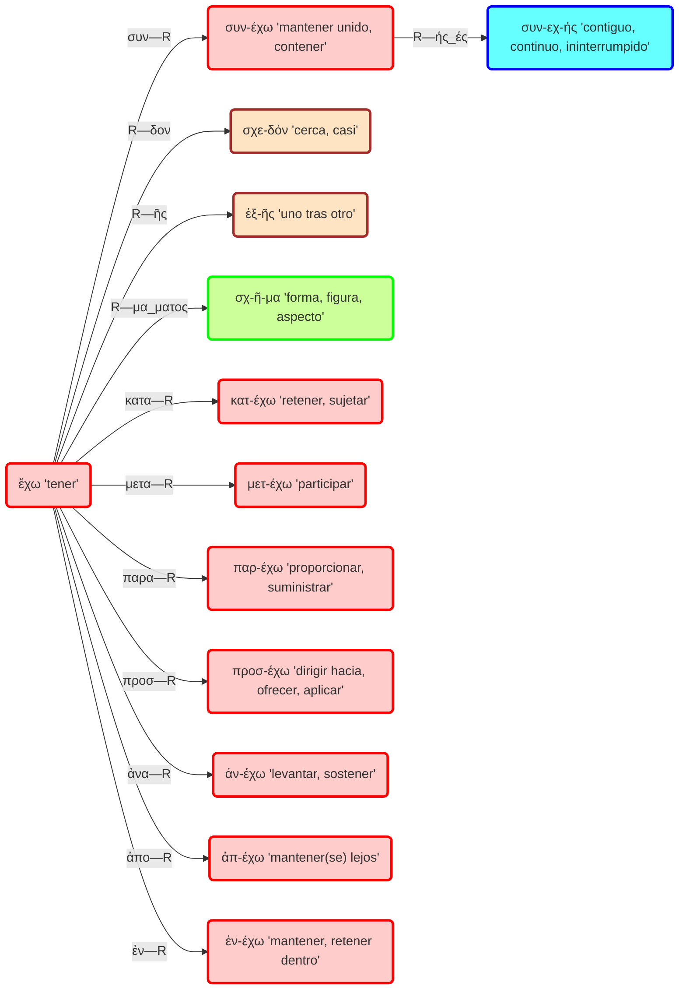
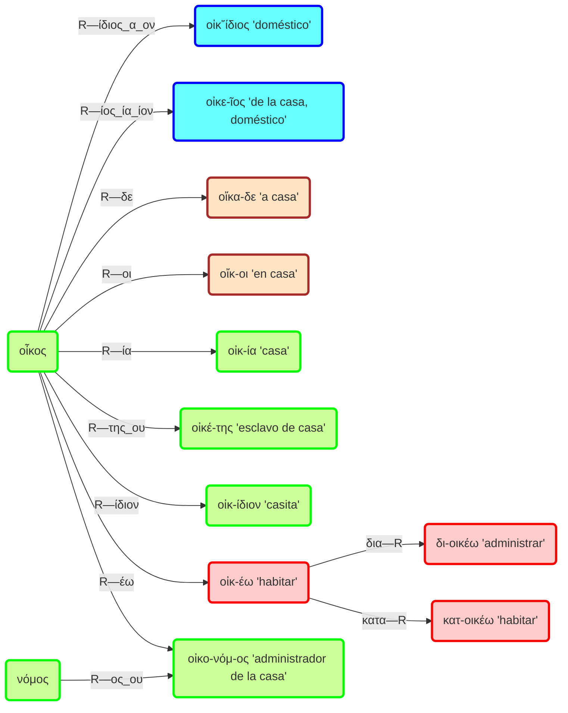
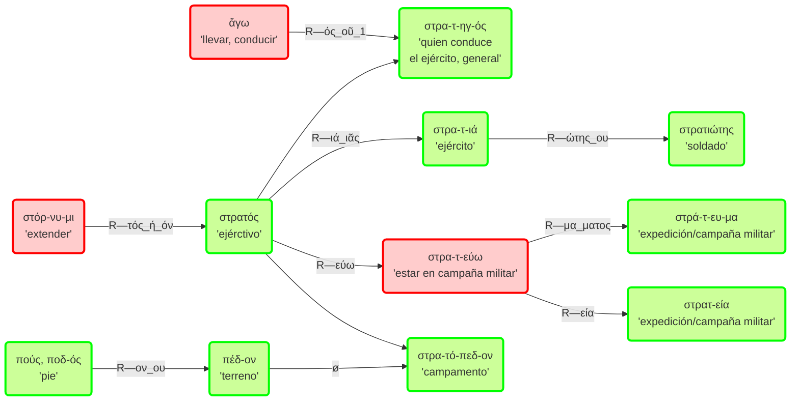
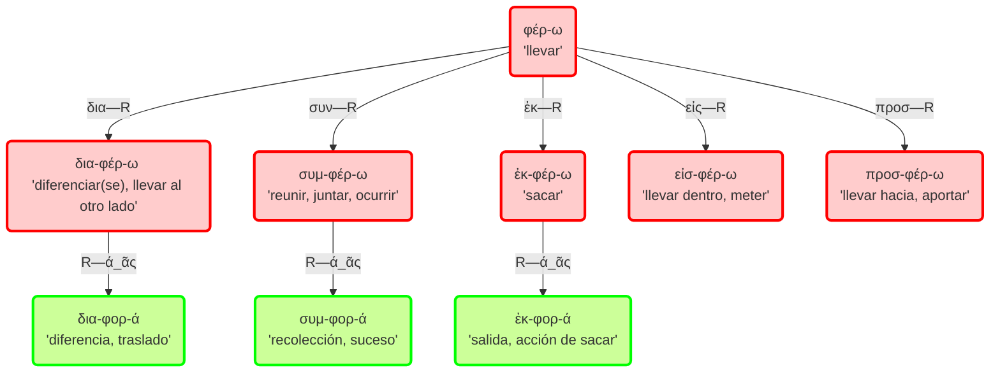

# Gráficos mermaid

[[_TOC_]] 

## Ἔχω

```mermaid

flowchart LR


συνέχω(συνέχω)-->|"R—ής_ές"|συνεχής("συν-εχ-ής 'contiguo, continuo, ininterrumpido'")

συνεχής:::Adj

ἔχω1(ἔχω1)-->|"R—δον"|σχεδόν("σχε-δόν 'cerca, casi'")

σχεδόν:::Adv

ἔχω1(ἔχω1)-->|"R—ῆς"|ἑξῆς("ἑξ-ῆς 'uno tras otro'")

ἑξῆς:::Adv

ἔχω1(ἔχω1)-->|"R—μα_ματος"|σχῆμα("σχ-ῆ-μα 'forma, figura, aspecto'")

σχῆμα:::Sust

ἔχω1(ἔχω1)-->|"κατα—R"|κατέχω("κατ-έχω 'retener, sujetar'")

κατέχω:::Verb

ἔχω1(ἔχω1)-->|"μετα—R"|μετέχω("μετ-έχω 'participar'")

μετέχω:::Verb

ἔχω1(ἔχω1)-->|"παρα—R"|παρέχω("παρ-έχω 'proporcionar, suministrar'")

παρέχω:::Verb

ἔχω1(ἔχω1)-->|"προσ—R"|προσέχω("προσ-έχω 'dirigir hacia, ofrecer, aplicar'")

προσέχω:::Verb

ἔχω1(ἔχω1)-->|"συν—R"|συνέχω("συν-έχω 'mantener unido, contener'")

συνέχω:::Verb

ἔχω1(ἔχω1)-->|"ἀνα—R"|ἀνέχω("ἀν-έχω 'levantar, sostener'")

ἀνέχω:::Verb

ἔχω1(ἔχω1)-->|"ἀπο—R"|ἀπέχω("ἀπ-έχω 'mantener(se) lejos'")

ἀπέχω:::Verb

ἔχω1(ἔχω1)-->|"ἐν—R"|ἐνέχω("ἐν-έχω 'mantener, retener dentro'")

ἐνέχω:::Verb

ἔχω1("ἔχω 'tener'")

ἔχω1:::Verb

classDef Verb stroke:#f00, stroke-width:3px
classDef Sust stroke:#0f0, stroke-width:3px
classDef Adj stroke:#00f, stroke-width:3px
classDef Adv stroke:brown, stroke-width:3px
classDef Nada stroke:#000000, stroke-width:2px
classDef Raíz stroke:#000000, stroke-width:3px

classDef Prep stroke:black, stroke-width:3px

classDef Prep stroke:yellow, stroke-width:3px
classDef SP stroke:yellow, stroke-width:3px

classDef Inf stroke-width:1px, stroke-dasharray: 10, 5
classDef Verb fill:#ffCCCC
classDef Sust fill:#CCff99
classDef Adj fill:#66FFFF
classDef Adv fill:Bisque
classDef Nada fill:#ffffff
classDef Raíz fill:#ffffff

classDef Pref fill:LightGray

classDef Prep fill:LemonChiffon
classDef SP fill:#CCff99

```

## οἶκος

```mermaid

flowchart LR


οἶκος(οἶκος)-->|"R—ίδιος_α_ον"|οἰκίδιος("οἰκ῎ίδιος 'doméstico'")

οἰκίδιος:::Adj

οἶκος(οἶκος)-->|"R—ίος_ία_ίον"|οἰκεῖος("οἰκε-ῖος 'de la casa, doméstico'")

οἰκεῖος:::Adj

οἶκος(οἶκος)-->|"R—δε"|οἴκαδε("οἴκα-δε 'a casa'")

οἴκαδε:::Adv

οἶκος(οἶκος)-->|"R—οι"|οἴκοι("οἴκ-οι 'en casa'")

οἴκοι:::Adv

οἶκος(οἶκος)-->|"R—ία"|οἰκία("οἰκ-ία 'casa'")

οἰκία:::Sust

νόμος("νό-ος 'ley, nomra, '")

νόμος:::Sust

οἶκος(οἶκος)-->|"R—της_ου"|οἰκέτης("οἰκέ-της 'esclavo de casa'")

οἰκέτης:::Sust

οἶκος(οἶκος)-->|"R—ίδιον"|οἰκίδιον("οἰκ-ίδιον 'casita'")

οἰκίδιον:::Sust


οἶκος("οἶκ-ος 'casa'")

οἶκος:::Sust

οἰκέω(οἰκέω)-->|"δια—R"|διοικέω("δι-οικέω 'administrar'")

διοικέω:::Verb

οἰκέω(οἰκέω)-->|"κατα—R"|κατοικέω("κατ-οικέω 'habitar'")

κατοικέω:::Verb

οἶκος(οἶκος)-->|"R—έω"|οἰκέω("οἰκ-έω 'habitar'")

οἰκέω:::Verb

οἶκος(οἶκος)-->οἰκονόμος
νόμος(νόμος)-->|"R—ος_ου"|οἰκονόμος("οἰκο-νόμ-ος 'administrador de la casa'")

οἰκονόμος:::Sust

classDef Verb stroke:#f00, stroke-width:3px
classDef Sust stroke:#0f0, stroke-width:3px
classDef Adj stroke:#00f, stroke-width:3px
classDef Adv stroke:brown, stroke-width:3px
classDef Nada stroke:#000000, stroke-width:2px
classDef Raíz stroke:#000000, stroke-width:3px

classDef Prep stroke:black, stroke-width:3px

classDef Prep stroke:yellow, stroke-width:3px
classDef SP stroke:yellow, stroke-width:3px

classDef Inf stroke-width:1px, stroke-dasharray: 10, 5
classDef Verb fill:#ffCCCC
classDef Sust fill:#CCff99
classDef Adj fill:#66FFFF
classDef Adv fill:Bisque
classDef Nada fill:#ffffff
classDef Raíz fill:#ffffff

classDef Pref fill:LightGray

classDef Prep fill:LemonChiffon
classDef SP fill:#CCff99


```

## στρατός

```mermaid

flowchart LR

ἄγω("ἄγω<br>'llevar, conducir'")-->|"R—ός_οῦ_1"|στρατηγός("στρα-τ-ηγ-ός<br>'quien conduce<br>el ejército, general'")
στρατός(στρατός)-->στρατηγός

ἄγω:::Verb
στρατηγός:::Sust


στρατεύω("στρατεύω")-->|"R—μα_ματος"|στράτευμα("στρά-τ-ευ-μα<br>'expedición/campaña militar'")

στράτευμα:::Sust

στρατεύω(στρατεύω)-->|"R—εία"|στρατεία("στρατ-εία<br>'expedición/campaña militar'")

στρατεία:::Sust


στρατός(στρατός)-->|"R—ιά_ιᾶς"|στρατιά("στρα-τ-ιά<br>'ejército'")

στρατιά:::Sust

στρατιά-->|"R—ώτης_ου"|στρατιώτης("στρατιώτης<br>'soldado'")

στρατιώτης:::Sust


στόρνυμι(στόρνυμι)-->|"R—τός_ή_όν"|στρατός("στρα-τός<br>'ejército'")

στρατός:::Sust


στρατός(στρατός)-->|"R—εύω"|στρατεύω("στρα-τ-εύω<br>'estar en campaña militar'")

στρατεύω:::Verb

στόρνυμι("στόρ-νυ-μι<br>'extender'")

στόρνυμι:::Verb

στρατός(στρατός)-->στρατόπεδον
πέδον(πέδον)-->|"ø"|στρατόπεδον("στρα-τό-πεδ-ον<br>'campamento'")
στρατόπεδον:::Sust

πούς("πούς, ποδ-ός<br>'pie'")-->|"R—ον_ου"|πέδον("πέδ-ον<br>'terreno'")

πούς:::Sust
πέδον:::Sust

στρατός("στρατός<br>'ejérctivo'")

classDef Verb stroke:#f00, stroke-width:3px
classDef Sust stroke:#0f0, stroke-width:3px
classDef Adj stroke:#00f, stroke-width:3px
classDef Adv stroke:brown, stroke-width:3px
classDef Nada stroke:#000000, stroke-width:2px
classDef Raíz stroke:#000000, stroke-width:3px

classDef Prep stroke:black, stroke-width:3px

classDef Prep stroke:yellow, stroke-width:3px
classDef SP stroke:yellow, stroke-width:3px

classDef Inf stroke-width:1px, stroke-dasharray: 10, 5
classDef Verb fill:#ffCCCC
classDef Sust fill:#CCff99
classDef Adj fill:#66FFFF
classDef Adv fill:Bisque
classDef Nada fill:#ffffff
classDef Raíz fill:#ffffff

classDef Pref fill:LightGray

classDef Prep fill:LemonChiffon
classDef SP fill:#CCff99

```

## φέρω

```mermaid

flowchart TB


διαφέρω(διαφέρω)-->|"R—ά_ᾶς"|διαφορά("δια-φορ-ά <br>'diferencia, traslado'")

διαφορά:::Sust

συμφέρω(συμφέρω)-->|"R—ά_ᾶς"|συμφορά("συμ-φορ-ά <br>'recolección, suceso'")

συμφορά:::Sust

ἐκφέρω(ἐκφέρω)-->|"R—ά_ᾶς"|ἐκφορά("ἐκ-φορ-ά <br>'salida, acción de sacar'")

ἐκφορά:::Sust

φέρω(φέρω)-->|"δια—R"|διαφέρω("δια-φέρ-ω <br>'diferenciar(se), llevar al otro lado'")

διαφέρω:::Verb

φέρω(φέρω)-->|"εἰς—R"|εἰσφέρω("εἰσ-φέρ-ω <br>'llevar dentro, meter'")

εἰσφέρω:::Verb

φέρω(φέρω)-->|"προσ—R"|προσφέρω("προσ-φέρ-ω <br>'llevar hacia, aportar'")

προσφέρω:::Verb

φέρω(φέρω)-->|"συν—R"|συμφέρω("συμ-φέρ-ω <br>'reunir, juntar, ocurrir'")

συμφέρω:::Verb

φέρω("φέρ-ω <br>'llevar'")

φέρω:::Verb

φέρω-->|"ἐκ—R"|ἐκφέρω("ἐκ-φέρ-ω <br>'sacar'")

ἐκφέρω:::Verb

classDef Verb stroke:#f00, stroke-width:3px
classDef Sust stroke:#0f0, stroke-width:3px
classDef Adj stroke:#00f, stroke-width:3px
classDef Adv stroke:brown, stroke-width:3px
classDef Nada stroke:#000000, stroke-width:2px
classDef Raíz stroke:#000000, stroke-width:3px

classDef Prep stroke:black, stroke-width:3px

classDef Prep stroke:yellow, stroke-width:3px
classDef SP stroke:yellow, stroke-width:3px

classDef Inf stroke-width:1px, stroke-dasharray: 10, 5
classDef Verb fill:#ffCCCC
classDef Sust fill:#CCff99
classDef Adj fill:#66FFFF
classDef Adv fill:Bisque
classDef Nada fill:#ffffff
classDef Raíz fill:#ffffff

classDef Pref fill:LightGray

classDef Prep fill:LemonChiffon
classDef SP fill:#CCff99


```