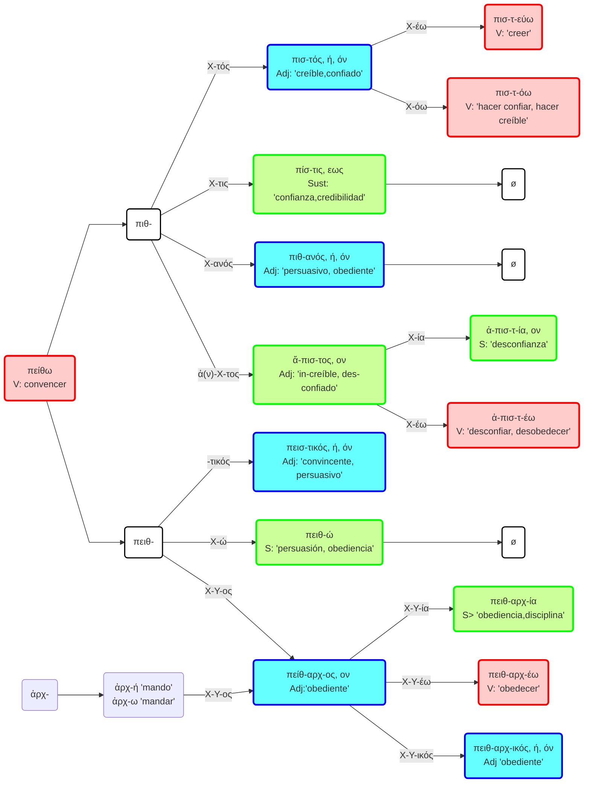

```mermaid
%%{ init : { "theme" : "default", "flowchart" : { "curve" : "linear" }}}%%

graph LR


A("πείθω<br>V: convencer ") --> B("πιθ-")
A:::Verb
B:::Nada

B-->|"X-τός"| C("πισ-τός, ή, όν<br>Adj: 'creíble,confiado'")
C:::Adj
C -->|"X-έω"|E("πισ-τ-εύω<br>V: 'creer'")
E:::Verb
C -->|"X-όω"|D("πισ-τ-όω<br>V: 'hacer confiar, hacer creíble' ")
D:::Verb
B-->|"X-τις"|F("πίσ-τις, εως<br>Sust: 'confianza,credibilidad'") -->F1("ø")
F:::Sust
F1:::Nada

B-->|"X-ανός"|G("πιθ-ανός, ή, όν<br>Adj: 'persuasivo, obediente'") -->G1("ø")
G:::Adj
G1:::Nada
A-->H("πειθ- ")
H-->|"X-ώ"| I("πειθ-ώ<br>S: 'persuasión, obediencia'") -->I1("ø")
I:::Sust
I1:::Nada
H -->|"-τικός"| Q("πεισ-τικός, ή, όν<br>Adj: 'convincente, persuasivo'")
Q:::Adj
H-->|"X-Y-ος"| J("πείθ-αρχ-ος, ον Adj:'obediente'")
H:::Nada

J-->|"X-Y-ία"| Ñ("πειθ-αρχ-ία<br>S> 'obediencia,disciplina'")
J:::Adj
Ñ:::Sust
J-->|"X-Y-έω"| O("πειθ-αρχ-έω<br>V: 'obedecer'")
O:::Verb

J-->|"X-Y-ικός"| P("πειθ-αρχ-ικός, ή, όν<br>Adj 'obediente'")
P:::Adj
k1("ἀρχ-")-->K("ἀρχ-ή 'mando'<br>ἀρχ-ω 'mandar'")-->|"X-Y-ος"| J

B-->|"ἀ(ν)-X-τος"| L("ἄ-πισ-τος, ον<br>Adj: 'in-creíble, des-confiado'")
L-->|"X-ία"| M("ἀ-πισ-τ-ία, ον<br>S: 'desconfianza'")
L:::Sust
M:::Sust
L-->|"X-έω"| N("ἀ-πισ-τ-έω<br>V: 'desconfiar, desobedecer'")
N:::Verb

classDef Verb stroke:#f00, stroke-width:3px
classDef Sust stroke:#0f0, stroke-width:3px
classDef Adj stroke:#00f, stroke-width:3px
classDef Nada stroke:#000000, stroke-width:2px

classDef Verb fill:#ffCCCC
classDef Sust fill:#CCff99
classDef Adj fill:#66FFFF
classDef Nada fill:#ffffff

```
