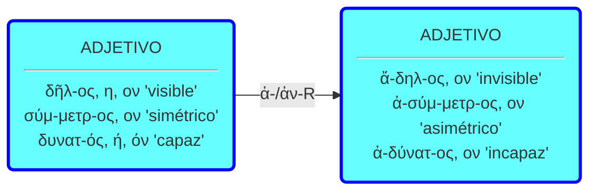
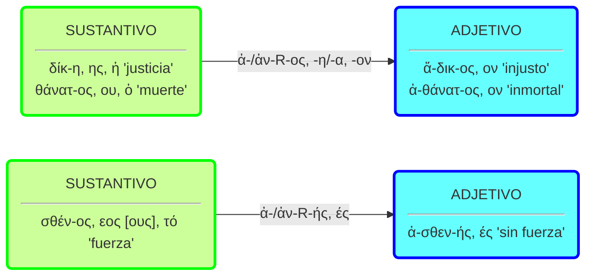
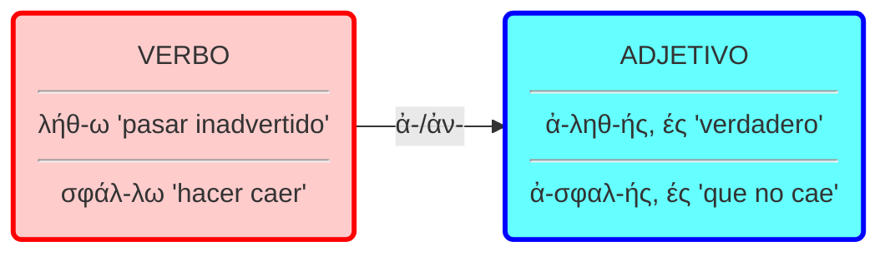

# Prefijo ἀ-/ἀν-

El prefijo ἀ-/ἀν- tiene valor negativo. El adjetivo derivado que forma es de dos terminaciones.

## 1. Adjetivo > Adjetivo

El sufijo ἀ-/ἀν- permite formar adjetivos negativos a partir de otros adjetivos.

## 2. Sustantivo > Adjetivo

También permite formar adjetivos negativos a partir de sustantivos. El derivado indica que el sustantivo modificado por el adjetivo carece de la propiedad que indica la base.
Los sufijos pueden ser -ος, -η/-α, -ον o -ής, -ές:

## 3. Verbo > Adjetivo

También se pueden formar derivados negativos a partir de verbos.

