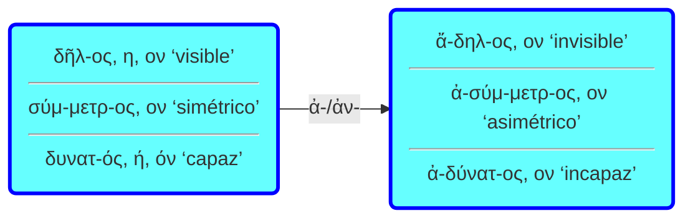
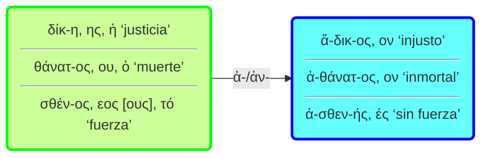

# Prefijo ἀ-ἀν-

## Adjetivo > Adjetivo

```mermaid
graph LR


A("δῆλ-ος, η, ον ‘visible’<hr>σύμ-μετρ-ος, ον ‘simétrico’<hr>δυνατ-ός, ή, όν ‘capaz’")-->|"ἀ-/ἀν-"|B("ἄ-δηλ-ος, ον ‘invisible’<hr>ἀ-σύμ-μετρ-ος, ον ‘asimétrico’<hr>ἀ-δύνατ-ος, ον ‘incapaz’")

A:::Adj
B:::Adj

classDef Verb stroke:#f00, stroke-width:3px
classDef Sust stroke:#0f0, stroke-width:3px
classDef Adj stroke:#00f, stroke-width:3px
classDef Adv stroke:brown, stroke-width:3px
classDef Nada stroke:#000000, stroke-width:2px
classDef Raíz stroke:#000000, stroke-width:3px

classDef Prep stroke:black, stroke-width:3px

classDef Prep stroke:yellow, stroke-width:3px
classDef SP stroke:yellow, stroke-width:3px

classDef Inf stroke-width:1px, stroke-dasharray: 10, 5
classDef Verb fill:#ffCCCC
classDef Sust fill:#CCff99
classDef Adj fill:#66FFFF
classDef Adv fill:Bisque
classDef Nada fill:#ffffff
classDef Raíz fill:#ffffff

classDef Pref fill:LightGray

classDef Prep fill:LemonChiffon
classDef SP fill:#CCff99

```

## Sustantivo > Adjetivo

```mermaid
graph LR

A2("δίκ-η, ης, ἡ ‘justicia’<hr>θάνατ-ος, ου, ὁ ‘muerte’<hr>σθέν-ος, εος [ους], τό ‘fuerza’")-->|"ἀ-/ἀν-"|B2("ἄ-δικ-ος, ον ‘injusto’<hr>ἀ-θάνατ-ος, ον ‘inmortal’<hr>ἀ-σθεν-ής, ές ‘sin fuerza’")

A2:::Sust
B2:::Adj

classDef Verb stroke:#f00, stroke-width:3px
classDef Sust stroke:#0f0, stroke-width:3px
classDef Adj stroke:#00f, stroke-width:3px
classDef Adv stroke:brown, stroke-width:3px
classDef Nada stroke:#000000, stroke-width:2px
classDef Raíz stroke:#000000, stroke-width:3px

classDef Prep stroke:black, stroke-width:3px

classDef Prep stroke:yellow, stroke-width:3px
classDef SP stroke:yellow, stroke-width:3px

classDef Inf stroke-width:1px, stroke-dasharray: 10, 5
classDef Verb fill:#ffCCCC
classDef Sust fill:#CCff99
classDef Adj fill:#66FFFF
classDef Adv fill:Bisque
classDef Nada fill:#ffffff
classDef Raíz fill:#ffffff

classDef Pref fill:LightGray

classDef Prep fill:LemonChiffon
classDef SP fill:#CCff99

```
