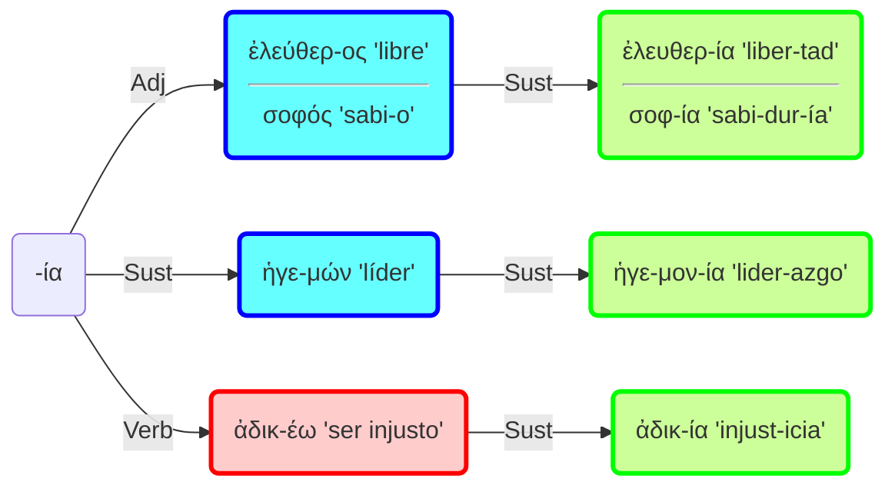
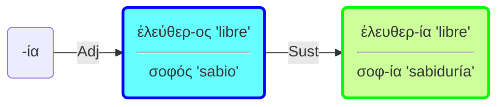
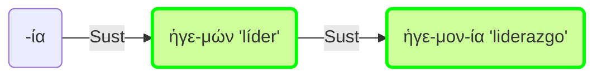
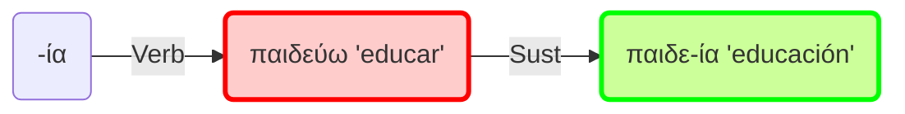
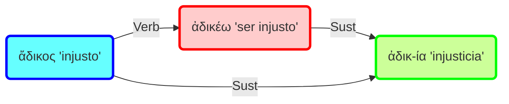

# Sufijo -ία

El sufijo -ία sirve para formar sustantivos abstractos.

## Resumen

### 1. Abstractos de adjetivos

Forma sustantivos abstractos a partir de adjetivos. Indica la cualidad correspondiente al adjetivo:

### 2. Abstractos de sustantivos

También permite formar abstractos a partir de sustantivos de agente derivados de verbos:

### 3. Abstractos de verbos

Puede aparecer para formar sustantivos abstractos derivados de verbos. Alterna en este caso con el sufijo -σις.

### 4. Casos dudosos

En algunos casos es difícil determinar si procede del adjetivo o del verbo que deriva de ese adjetivo:

