# Vocabulario en las lenguas clásicas

antonio.revuelta@uam.es

## 1.1. Objetivo

Probablemente uno de los mayores problemas de los estudiantes de Filología Clásica es su bajo nivel de vocabulario. Esa situación hace que, pese a tener en muchas ocasiones mayores conocimientos de gramática que estudiantes de otras filologías, su capacidad para enfrentarse a textos en griego (para comprenderlos, leerlos o traducirlos) sea mucho menor.

El propósito de esta charla es establecer unas pautas básicas para la creación del material preciso para remediar esa situación y facilitar que el progreso de los alumnos en el aprendizaje de esta lengua sea más fácil.

## 1.2. ¿Por qué estudiar vocabulario?

(1) kara köpek gördüm

!!! note "Información sintáctica"
    ```mermaid
    flowchart TB

    O-->Sujeto("Sujeto")

    Sujeto-->Adj("Adj")-->kara("kara")

    Sujeto-->Sust("Sust")-->köpek("köpek")

    O-->SV
    
    SV-->Verbo("Verbo")-->gördüm("gördüm")

    ```

!!! note "Información semántica"
    ```mermaid
    flowchart TB

    kara("kara")-->negro("'negro'")

    köpek("köpek")-->perro("'perro'")

    görmek("görmek")-->ver("'ver'")

    ```
    
    ```mermaid
    flowchart LR

    Int1("Interpretación 1")-->Sign1("'X vio/ve/verá un/el perro negro'")

    Int2("Interpretación 2")-->Sign2("'un/el perro negro fue/es/será visto por X'")

    Int3("Interpretación 3")-->Sign3("'un/el perro negro vio/ve/verá X'")

    Int4("Interpretación 4")-->Sign4("'X fue/es/será visto por un/el perro negro'")

    ```

!!! info "El vocabulario es previo a cualquier información gramatical"

---

## 1.3. ¿Qué vocabulario estudiar?

### 1.3.1. 2.1 Vocabulario de frecuencia

Según Nation (2001) el porcentaje de texto cubierto por cada millar de lemas más frecuentes en el Brown Corpus (inglés) es el indicado en la siguiente tabla.

Como se puede observar, el porcentaje de texto cubierto por cada millar va disminuyendo. Mientras que el primer millar cubre un 72% de cualquier texto, el segundo cubre solamente un 7,7,%, el tercero un 4,3% y así sucesivamente hasta que el 10,1% del texto es cubierto por entre 6.000 y 20.000 lemas.

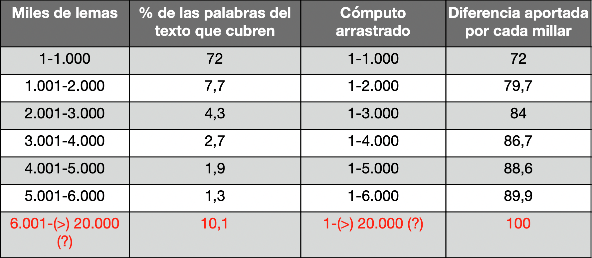

La siguiente tabla muestra el crecimiento marginal del rendimiento:

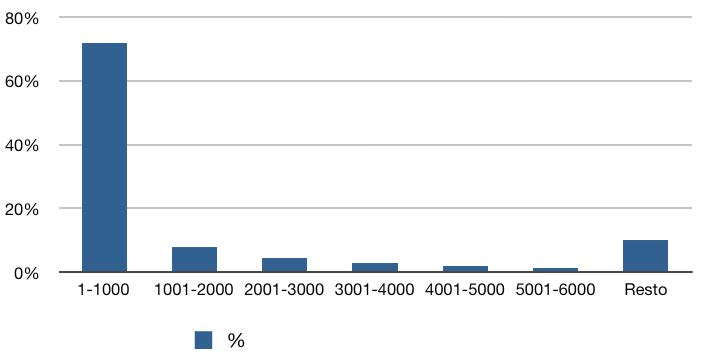

Esas estadísticas son aplicables aproximadamente a cualquier lengua. Eso supone que la memorización de los 1.000 lemas más frecuente del griego antiguo permitirían que una alumno pudiera entender el 72% de cualquier texto, como se puede observar en la siguiente figura:

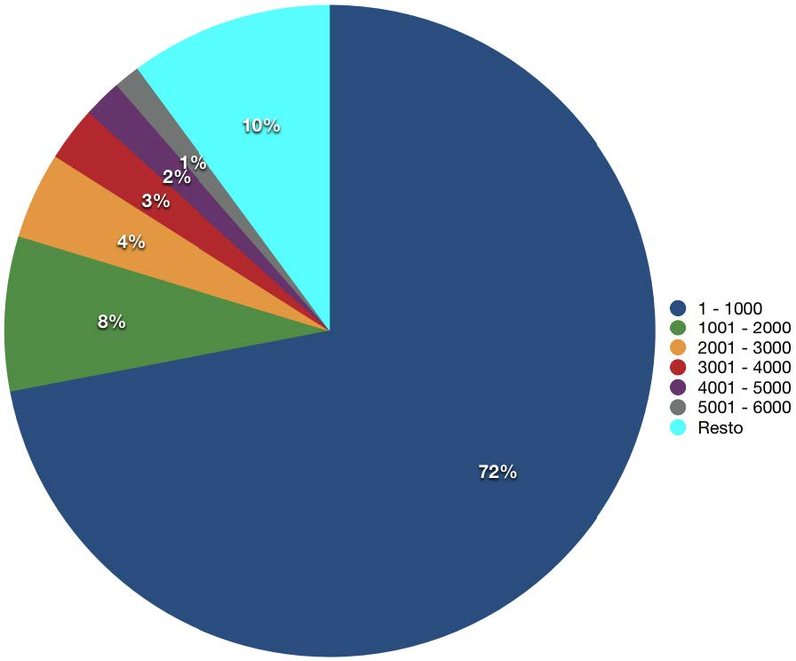

La siguiente imagen ofrece una representación gráfica de lo que supondría este porcentaje en un texto cualquiera de griego antiguo:

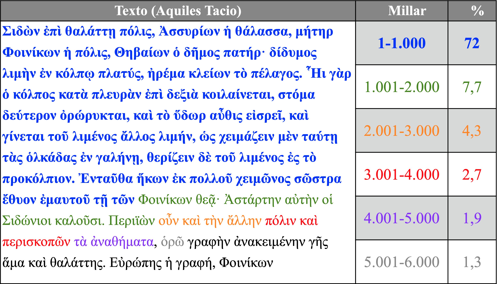

El objetivo del presente proyecto de innovación docente se centra en ese primer millar de lemas cuyo conocimiento proporciona al estudiante un buen control de una gran extensión de cualquier texto que traduzca y supone una empresa factible. Sin duda se trata de una inversión en tiempo y esfuerzo (la memorización la requiere), pero centrada en el segmento de vocabulario que proporciona al estudiante un mayor rendimiento.

En los siguientes apartados se describirá cómo se ha recopilado ese listado de lemas y cómo se ha procesado para que sea estudiado por los alumnos de la manera más efectiva posible.

### 1.3.2. ¿Cuál es?

Eso depende de nuestros propósitos:

1. Si queremos ser capaces de leer en general cualquier texto, necesitaremos un vocabulario de frecuencia de un corpus con muchos textos.
    1. 1000 lemas más frecuentes del griego antiguo XXXX.
    2. 
2. Si estamos empezando a aprender o enseñar una lengua, lo más práctico sería estudiar el vocabulario de nuestro  método.
    1. Vocabulario de τα ελληνικά για ξενογλώσσους XXXXX: griego moderno.
    2. Vocabulario de *Familia romana* XXXXX: latín.

### 1.3.3. ¿Cómo averiguar la frecuencia?

- [Logeion](https://github.com/helmadik/LSJLogeion) (editado por Helma Dik).

En la siguiente captura de Logeion (versión web) se puede observar que el LSJ incluye la frecuencia de los lemas griegos que hemos empleado:

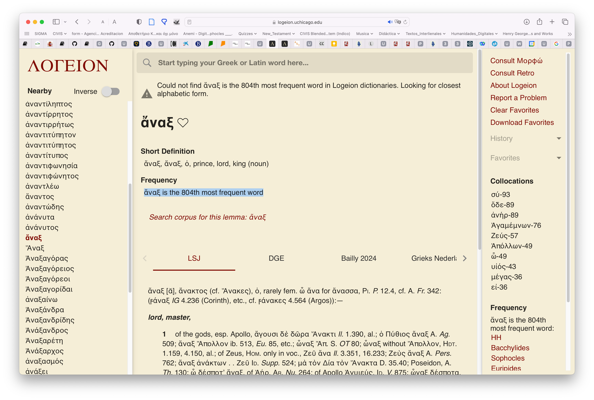

- [Perseus: Lemma list](https://vocab.perseus.org/lemma/?page=1)

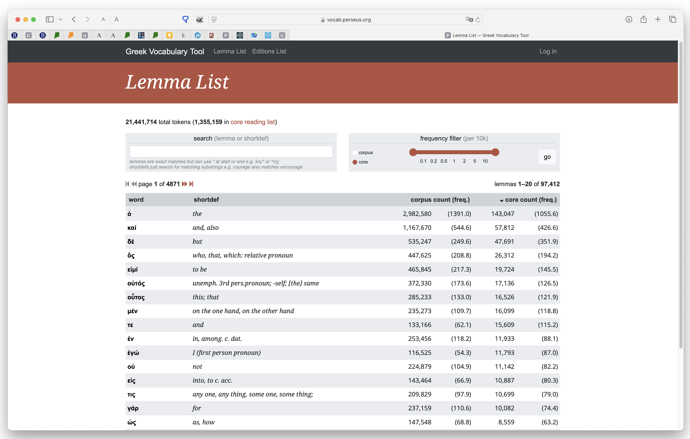

### 1.3.4. Dispersión

| Autores/Corpora | καί   | ἄναξ    | αὐτόφορος | ἀπαμείβομαι | τριήερης  | ὕστερος   |
|-----------------|-------|---------|-----------|-------------|-----------|-----------|
| Logeion         | **2** | **759** | 5.045     | 2760        | **604**   | **209**   |
| Homero          | **5** | **160** | ø         | **1.000**   | ø         | 1411      |
| Jenofonte       | **2** | **658** | 7.361     | 10.092      | 1.211     | **1.000** |
| Demóstenes      | **3** | 2.564   | 3.327     | ø           | **1.000** | **579**   |

(Los datos específicos pueden variar según se mejora Logeion)

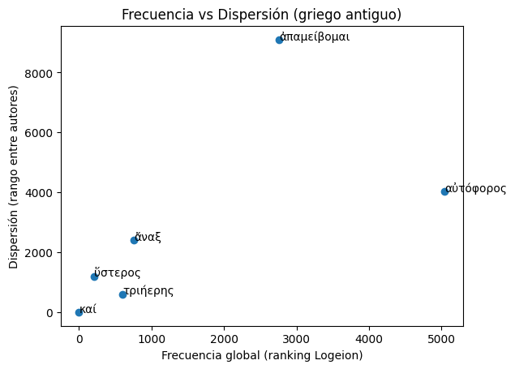

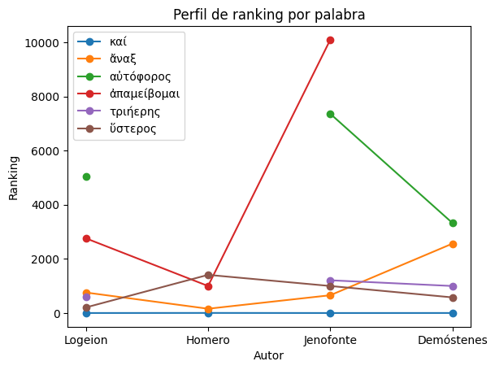

📊 1. Frecuencia vs dispersión

Qué estás viendo:

1. Eje X → frecuencia global (ranking Logeion)
2. Eje Y → dispersión (cuánto varía entre autores)

🧠 Interpretación de los datos:

- 🟢 καί
    - Extremadamente a la izquierda
    - Dispersión casi 0
    - 👉 palabra funcional universal
- 🟡 τριήερης / ὕστερος
    - Frecuencia media
    - Dispersión moderada
    - 👉 vocabulario relativamente estable pero no universal
- 🔴 ἄναξ
    - Frecuencia media
    - Dispersión alta
    - 👉 dependiente de género (épico vs oratorio)
- 🔥 αὐτόφορος y ἀπαμείβομαι
    - Frecuencia baja (muy a la derecha)
    - Dispersión altísima
    - 👉 vocabulario altamente especializado o restringido

📈 2. Perfil por autor (líneas)

Este gráfico te muestra la “firma” de cada palabra.

🧠 Lectura rápida
καί → línea plana → estabilidad absoluta
ἄναξ → línea irregular → variación por autor
ἀπαμείβομαι → pico brutal en Jenofonte → marca estilística
💡 Lo más interesante (insight lingüístico real)

Tu ejemplo muestra perfectamente tres tipos de léxico:

1. Léxico funcional (καί)
    - alta frecuencia
    - baja dispersión
    - → núcleo de la lengua
2. Léxico general (ὕστερος, τριήερης)
    - frecuencia media
    - dispersión media
    - → lengua común con matices
3. Léxico marcado (ἄναξ, αὐτόφορος, ἀπαμείβομαι)
    - frecuencia baja o media
    - alta dispersión
    - → dependiente de:
        - género (épica vs oratoria)
        - autor
        - registro

---

## 1.4. Métodos de estudio


### 1.4.1. Repetición espaciada

Memrise está basado en los sistemas de repetición espaciada cuyo impulsor fue Hermann Ebbinghaus (1850-1909) y que se siguen empleando en la actualidad para la memorización de datos puros.

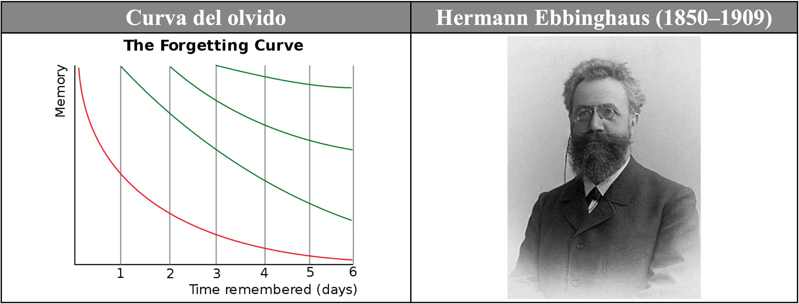

El recuerdo de los datos (memoria) se degrada a lo largo del tiempo, como muestra la línea roja descendente en el gráfico precedente. Sin embargo, si esos datos se repasan de manera espaciada y repetida a lo largo del tiempo (dejando un período entre repaso y repaso), la degradación de su recuerdo disminuye (líneas verdes) hasta que los datos son incorporados en gran parte a la memoria a largo plazo.

Memrise incorpora un algoritmo optimizado para favorecer dicha memorización y lo aplica de manera automática, de modo que el estudiante no necesita preocuparse de organizar el material: Memrise lo hace por él, y además de la manera más efectiva.

El listado de los mil (1.000) lemas más frecuentes se ha exportado a diferentes formatos para que sea estudiado por los estudiantes de diferentes maneras de acuerdo con sus intereses y sus necesidades. En las siguientes secciones se describirán algunos de ellos. En el futuro el material se convertirá a otros formatos según sea necesario.

---

### 1.4.2. Releer los textos


| **V**  | **Original**                                | **Traducción**                                                     |
|----|-----------------------------------------|----------------------------------------------------------------|
| 1  | ὦ τέκνα, Κάδμου τοῦ πάλαι νέα τροφή,    | ¡Oh hijos, descendencia nueva del antiguo Cadmo                |
| 2  | τίνας ποθʼ ἕδρας τάσδε μοι θοάζετε      | ¿Por qué estáis en actitud sedente ante mí,                    |
| 3  | ἱκτηρίοις κλάδοισιν ἐξεστεμμένοι;       | coronados con ramos de suplicantes?                            |
| 4  | πόλις δʼ ὁμοῦ μὲν θυμιαμάτων γέμει,     | La ciudad está llena de incienso,                              |
| 5  | ὁμοῦ δὲ παιάνων τε καὶ στεναγμάτων·     | a la vez que de cantos de súplica y de gemidos,                |
| 6  | ἁγὼ δικαιῶν μὴ παρʼ ἀγγέλων, τέκνα,     | y yo, porque considero justo no por mensajeros                 |
| 7  | ἄλλων ἀκούειν αὐτὸς ὧδʼ ἐλήλυθα,        | otros enterarme, he venido en persona,                         |
| 8  | ὁ πᾶσι κλεινὸς Οἰδίπους καλούμενος.     | yo, el llamado Edipo, famoso entre todos.                      |
| 9  | ἀλλʼ ὦ γεραιέ, φράζʼ, ἐπεὶ πρέπων ἔφυς  | Así que, oh anciano, ya que por tu condición te corresponde    |
| 10 | πρὸ τῶνδε φωνεῖν, τίνι τρόπῳ καθέστατε, | hablar en nombre de todos, dime:  ¿por qué estáis así ante mí? |
| 11 | δείσαντες ἢ στέρξαντες; ὡς θέλοντος ἂν  | ¿El temor, o el ruego? Piensa que yo querría                   |
| 12 | ἐμοῦ προσαρκεῖν πᾶν· δυσάλγητος γὰρ ἂν  | ayudaros en todo. Sería insensible,                            |
| 13 | εἴην τοιάνδε μὴ οὐ κατοικτίρων ἕδραν.   | si no me compadeciera ante semejante actitud.                  |

---

### 1.4.3. Lemas

- Listados de palabras.
- Fichas individuales. 

### 1.4.4. Listados

Listados en formato excel, doc, pdf.

#### 1.4.4.1. Excel

Uno de los problemas a la hora de utilizar este vocabulario es que los alumnos, pese a que se les explica que van a estudiar palabras que se encontrarán frecuentemente, no son realmente conscientes de ello y no encuentran en ocasiones la motivación interna necesaria para estudiar el vocabulario.

Con el objetivo de que ellos mismos comprueben la utilidad de este vocabulario, se ha creado un archivo en Excel que les permitirá (i) comprobar la utilidad del listado y (ii) estudiarlo por el orden en que los lemas les aparezcan en los textos que lean y traduzcan, como se puede observar en la siguiente captura de pantalla:

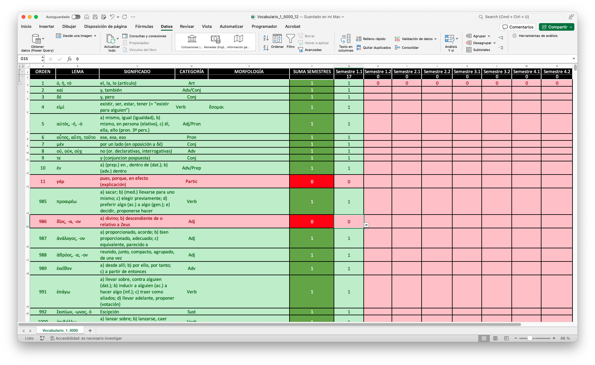

El archivo incluye columnas para el orden de frecuencia (A), el lema (B), los significados (C), la clase de palabra (D) y su morfología irregular (E).

Las columnas G a N están reservadas para cada uno de los semestres en que los alumnos estudian griego: ocho semestres de 1º a 4º curso de cada grado. Cuando el alumno se encuentra un lema, va a la columna del semestre actual e introduce un 1. De manera automática la celda correspondiente se pone en verde, al igual que las celdas A-G donde aparecen los datos correspondientes a ese lema. Asimismo, en la cabecera de cada columna puede ver el número total de palabras que le han aparecido en cada semestre de entre los mil (1.000) estudiados. Todas estos datos se actualizan automáticamente.

En la columna F aparece el cómputo de todos los semestres en que el alumno se ha encontrado cada lema y, por tanto, esta columna puede tener un valor de 0 a 8 y proporciona al estudiante una idea muy clara de la importancia de esa palabra para su propio estudio.

Dado que el archivo se puede ordenar por diferentes criterios, el alumno puede ordenar los registros por (i) orden de frecuencia absoluto (A), para estudiar por este criterio los lemas, (ii) por aparición en el semestre en que se encuentre (columnas G-N, según el autor que estén estudiando los órdenes de frecuencia pueden variar), (iii) o por la frecuencia de aparición en todos los semestres que lleva estudiados (columna F).

La presentación del material en un archivo Excel no solo permite mayor flexibilidad para que el alumno estudie el vocabulario según sus preferencias, sino también que estudie específicamente el subconjunto de ese vocabulario que sea más adecuado para los textos que está traduciendo en un semestre concreto. Sobre todo, lo importante de este formato de presentación es que gracias a él el alumno es más consciente —por su propia experiencia— de la importancia de este vocabulario y, por tanto, de la necesidad y ventajas de estudiarlo.

El archivo se puede encontrar en este enlace: [vocabulario de frecuencia (Excel)](../Vocabulario/Vocabulario_1_1000_Estudiantes.xlsx).

### 1.4.5. PDF/DOC

El material también se ofrece como listados en formato de tabla para que los alumnos puedan estudiarlos como deseen: pueden estudiarlos sobre el propio archivo o imprimirlo en papel.

- [Listado en formato PDF](../Vocabulario/Vocabulario_1_1000_Alumnos.pdf).
- [Listado en formato Word](../Vocabulario/Vocabulario_1_1000_Alumnos.docx).

---

### 1.4.6. Lemas individuales

#### 1.4.6.1. Tarjetas de papel

Para los alumnos más tecnófobos o que tengan dificultades para utilizar dispositivos electrónicos (carencia de medios, falta de conexión, etc.), una propuesta alternativa es la utilización de tarjetas de papel: en el anverso presentan el lema y en el reverso la traducción y restante información descrita en las secciones anteriores.

El uso de papel tiene una serie de desventajas: (i) las tarjetas se deterioran con el tiempo, (ii) solo cabe en ellas una cantidad fija de información, (iii) no son tan claras (según la caligrafía del estudiante), (iv) son más difíciles de estudiar de una manera ordenada, (v) no siempre están disponibles (el estudiante no puede llevarlas a todas partes consigo).

---

##### 1.4.6.1.1. Formato

El formato más conveniente para estas tarjetas es el A8, que se puede comprar en cualquier papelería u online:


---

##### 1.4.6.1.2. Impresión

Otra opción es formatear los archivos de Word de manera que la tabla tenga solamente dos columnas (izquierda, lema griego, y, derecha, traducción e información) de un tamaño parecido al A8, tal y como se muestra en la imagen:

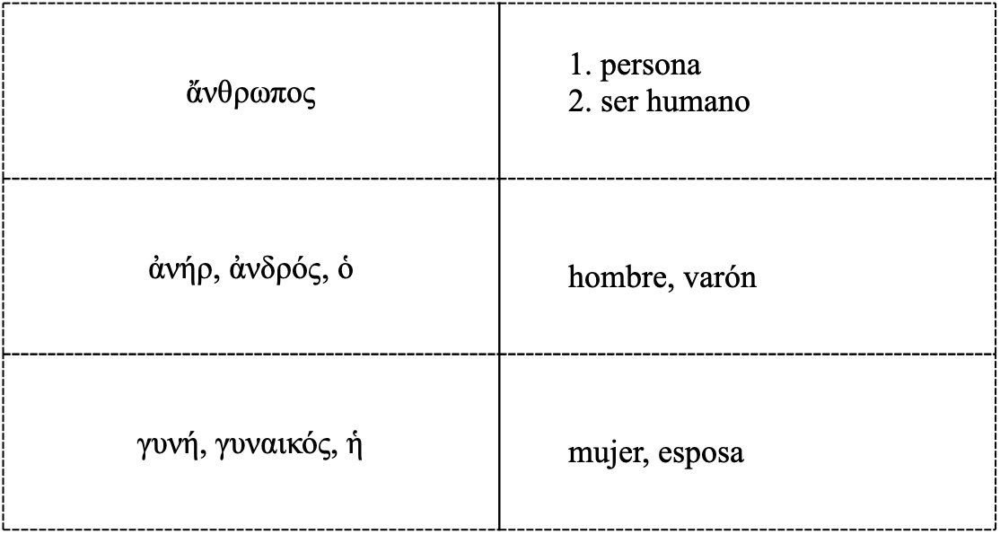

Las páginas se imprimen, se recortan por la línea de puntos y se dobla cada pieza resultante por la línea continua, de manera que se obtiene una tarjeta con mucho menor esfuerzo que haciéndola a mano.

---

##### 1.4.6.1.3. Almacenamiento

Estas tarjetas se pueden almacenar en cajas de cualquier tipo o en tarjeteros específicos al efecto:

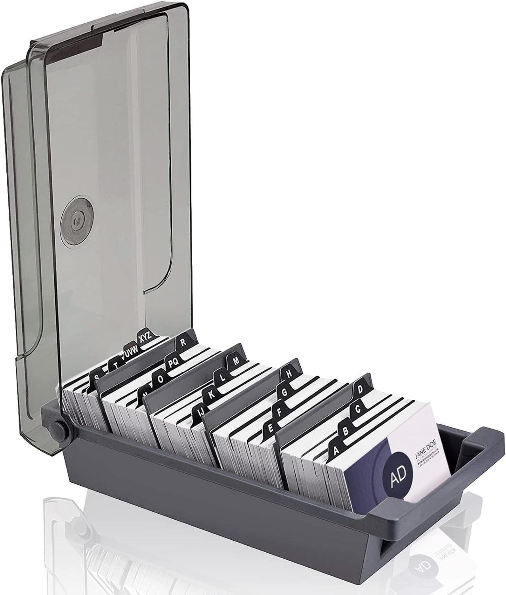

---

##### 1.4.6.1.4. Gestión

A diferencia de los programas de las plataformas que tienen un algoritmo que presenta al estudiante todas las tarjetas para su repaso, pero con más frecuencia las que peor se sabe, las tarjetas en papel es necesario procesarlas siguiendo un método para que el estudio sea más efectivo, como se muestra en la siguiente imagen:

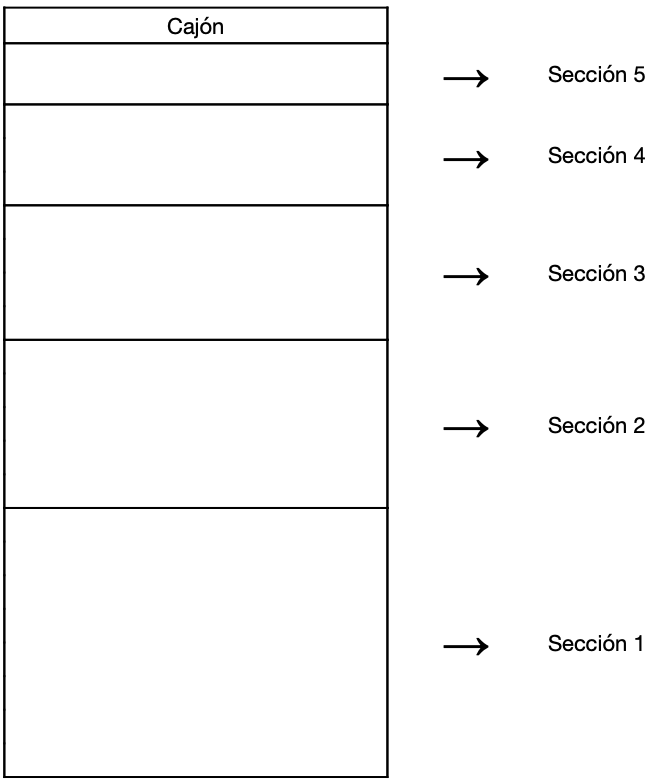

El clasificador (comprado o cualquier caja que se tenga) se divide en cinco secciones. En la primera sección se colocan todas las tarjetas nuevas que se pretende estudiar. En este caso se colocaría por order de frecuencia (las más frecuentes antes) o por orden de creación (según aparezcan las palabras en los textos que se están traduciendo). Se coge la primera tarjeta y, (i) si el alumno conoce el signidficado de la palabra, pasa la tarjeta a la segunda sección, y, (ii) si no la conoce, la vuelve a poner en la primera sección, pero al final del todo. Al día siguiente se procede de la misma manera, pero se procesa no solo la sección 1, sino también la 2 y se aplica el mismo procedimiento: las tarjetas cuyo significado se conoce se pasan a la 3ª sección y las que no, al final de la 2ª. Este sistema se va aplicando a cada sección. Al final habrá 5 secciones que procesar todos los días.


---


## 1.5. Referencias

Aunque no se mencionan en su totalidad en la presente memoria, estas son algunas de las referencias bibliográficas empleadas en este proyecto:

- [Anki](https://apps.ankiweb.net).
- [Diogenes](https://d.iogen.es).
- Krashen, Stephen D. (2002): ‘The Comprehension Hypothesis and its Rivals’. In T. Piske and M. Young-Scholten (Eds.) Input Matters in SLA. Bristol: Multilingual Matters. pp. 81-94.
- Krashen, Stephen D. (2004): The Power of Reading: Insights from the Research. Libraries Unlimited.
- Learning With Texts: (i) [Desktop](https://github.com/edoreld/learning-with-texts#); (ii) [Web (gratuito)](https://learningwithtexts.com).
- [Lingq](https://www.lingq.com).
- [Logeion](https://logeion.uchicago.edu/lexidium).
- [Memrise](https://www.memrise.com).
- Memrise: [1.000 lemas de frecuencia](https://app.memrise.com/course/5276../Vocabulario/-griego-antiguo-15/).
- Nation, I.S.P. (2001): Learning vocabulary in another language. Cambridge University Press. (Libro teórico sobre el aprendizaje y enseñanza de vocabulario de segundas lenguas).
- [Perseus texts](http://www.perseus.tufts.edu/hopper/collection?collection=Perseus:collection:Greco-Roman).
- [Perseus vocabulary tool](https://www.perseus.tufts.edu/hopper/vocablist).
- [Scaife Viewer](https://scaife.perseus.org).

---
---

## 1.6. Datos y procesamiento

---

### 1.6.1. Perseus project

El listado de los mil (1.000) lemas más frecuentes se ha tomado de la versión del diccionario Liddell-Scott-Jones (LSJ) del Perseus Project tal y como ha sido editado por Helma Dik (Chicago) para Logeion (un sitio web que incluye diversos diccionarios de latín y griego).

- [Perseus Project](https://github.com/gcelano/LSJ_GreekUnicode) (editado por Celano).
- [Logeion](https://github.com/helmadik/LSJLogeion) (editado por Helma Dik).

En la siguiente captura de Logeion (versión web) se puede observar que el LSJ incluye la frecuencia de los lemas griegos que hemos empleado:


---

### 1.6.2. Filemaker

El diccionario proporcionado por Logeion se ha importado a una base de datos en Filemaker para su procesamiento. Los mil lemas más frecuentes se han traducido al español y se ha añadido la información adicional pertienen (morfología irrgular, etc.). Las traducciones tienen una serie de restricciones: (i) se limitan a los usos más básicos y frecuentes de cada lema; (ii) la redacción de las traducciones se ha reducido lo más posible para facilitar que el material sea fácilmente memorizable por los alumnos. El campo "Traducción_Length" nos ha permitido controlar el número de caracteres de las traducciones.

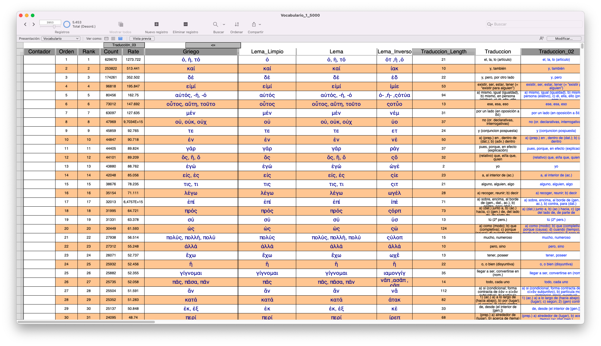

---
