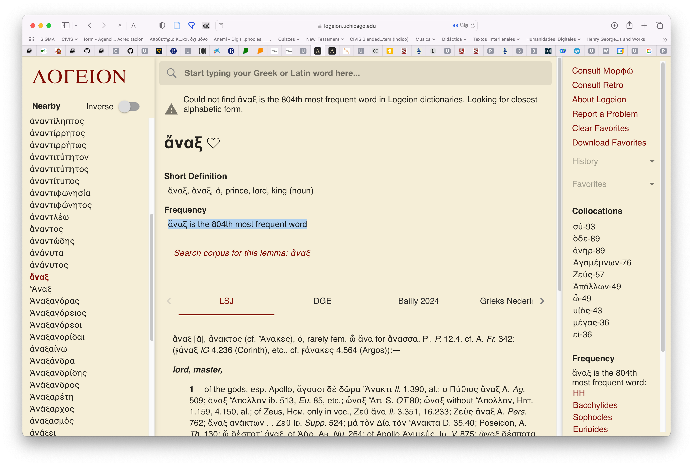
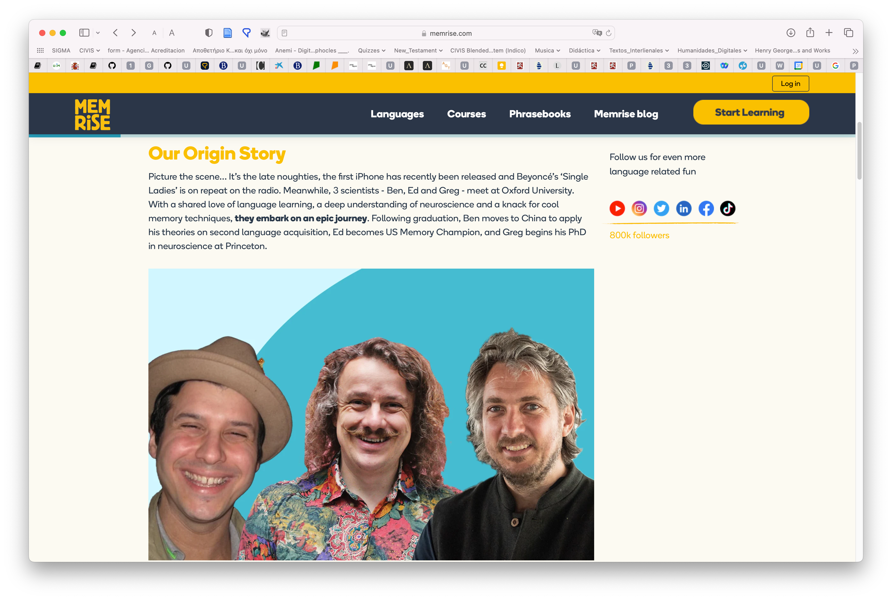

# 1. Proyecto

Esta documento es la memoria final del  Proyecto de Innovación docente de la UAM 2023-2024 "Vocabulario básico de frecuencia del griego antiguo (FYL_019.23_INN)".

No solo se ha presentado en la web correspondiente de Innovación Docente, sino que aparece albergada también en la web docente del coordinador principal en [GitHub](https://pajaro1966.github.io/My_Mk_Docs/).

Se solicita a los revisores que empleen la versión online, dado que la web es parte integrante del proyecto, como se explicará en la presente memoria. La sección dedicada a la memoria final se puede encontrarte en este enlace: [Memoria final del proyecto](https://pajaro1966.github.io/My_Mk_Docs/Vocabulario/Vocab_Intro/).

Este documento se ha creado en Visual Studio Code empleando [MARP](https://marp.app).

---

## 1.1. Problema inicial

Probablemente uno de los mayores problemas de los estudiantes de Filología Clásica es su bajo nivel de vocabulario. Esa situación hace que, pese a tener en muchas ocasiones mayores conocimientos de gramática que estudiantes de otras filologías, su capacidad para enfrentarse a textos en griego (para comprenderlos, leerlos o traducirlos) sea mucho menor. El propósito de este proyecto es crear el material preciso para remediar esa situación y facilitar que el progreso de los alumnos en el aprendizaje de esta lengua sea más fácil.

---

## 1.2. Vocabulario de frecuencia

Según Nation (2001) el porcentaje de texto cubierto por cada millar de lemas más frecuentes en el Brown Corpus (inglés) es el indicado en la siguiente tabla.

Como se puede observar, el porcentaje de texto cubierto por cada millar va disminuyendo. Mientras que el primer millar cubre un 72% de cualquier texto, el segundo cubre solamente un 7,7,%, el tercero un 4,3% y así sucesivamente hasta que el 10,1% del texto es cubierto por entre 6.000 y 20.000 lemas.

---

---

La siguiente tabla muestra el crecimiento marginal del rendimiento:

---

Esas estadísticas son aplicables aproximadamente a cualquier lengua. Eso supone que la memorización de los 1.000 lemas más frecuente del griego antiguo permitirían que una alumno pudiera entender el 72% de cualquier texto, como se puede observar en la siguiente figura:

---

La siguiente imagen ofrece una representación gráfica de lo que supondría este porcentaje en un texto cualquiera de griego antiguo:

---

El objetivo del presente proyecto de innovación docente se centra en ese primer millar de lemas cuyo conocimiento proporciona al estudiante un buen control de una gran extensión de cualquier texto que traduzca y supone una empresa factible. Sin duda se trata de una inversión en tiempo y esfuerzo (la memorización la requiere), pero centrada en el segmento de vocabulario que proporciona al estudiante un mayor rendimiento.

En los siguientes apartados se describirá cómo se ha recopilado ese listado de lemas y cómo se ha procesado para que sea estudiado por los alumnos de la manera más efectiva posible.

---

## 1.3. Datos y procesamiento

### 1.3.1. Perseus project

El listado de los mil (1.000) lemas más frecuentes se ha tomado de la versión del diccionario Liddell-Scott-Jones (LSJ) del Perseus Project tal y como ha sido editado por Helma Dik (Chicago) para Logeion (un sitio web que incluye diversos diccionarios de latín y griego).

- [Perseus Project](https://github.com/gcelano/LSJ_GreekUnicode) (editado por Celano).
- [Logeion](https://github.com/helmadik/LSJLogeion) (editado por Helma Dik).

---

En la siguiente captura de Logeion (versión web) se puede observar que el LSJ incluye la frecuencia de los lemas griegos que hemos empleado:

---

### 1.3.2. Filemaker

El diccionario proporcionado por Logeion se ha importado a una base de datos en Filemaker para su procesamiento. Los mil lemas más frecuentes se han traducido al español y se ha añadido la información adicional pertienen (morfología irrgular, etc.). Las traducciones tienen una serie de restricciones: (i) se limitan a los usos más básicos y frecuentes de cada lema; (ii) la redacción de las traducciones se ha reducido lo más posible para facilitar que el material sea fácilmente memorizable por los alumnos. El campo ‘Traducción_Length’ nos ha permitido controlar el número de caracteres de las traducciones.

---

---

## 1.4. Métodos de estudio

El listado de los mil (1.000) lemas más frecuentes se ha exportado a diferentes formatos para que sea estudiado por los estudiantes de diferentes maneras de acuerdo con sus intereses y sus necesidades. En las siguientes secciones se describirán algunos de ellos. En el futuro el material se convertirá a otros formatos según sea necesario.

---

### 1.4.1. Memrise

Esta sección está dedicada a la plataforma Memrise. Dado que es el sistema favorecido por los profesores será el que se describa de manera más detallada.

---

#### 1.4.1.1. Presentación

Los mil lemas se han subido a la plataforma [Memrise](https://community-courses.memrise.com/community/course/527684/vocabulario-griego-antiguo-15/), como se puede ver en la siguiente captura de pantalla:

---

Memrise es una plataforma empleada fundamentalmente —pero no de manera exclusiva— para el aprendizaje de lenguas. Empezó siendo un sistema de creación y estudio de flashcards (‘tarjetas de memorización’) dirigida a la memorización de datos puros, pero en los últimos años se ha ampliado para estudiar no solo vocabulario, sino diferentes aspectos de la lengua y actualmente incluye todo tipo de material, incluidos vídeos con conversaciones entre hablantes nativos de la lengua correspondiente.

---

#### 1.4.1.2. Sistemas operativos

La plataforma se puede emplear en diferentes sistemas operativos mediante un navegador o a través de aplicaciones específicas:

- Navegador.
- [iOS](https://apps.apple.com/us/app/memrise-easy-language-learning/id635966718).
- [Android](https://play.google.com/store/apps/details?id=com.memrise.android.memrisecompanion.&pcampaignid=web_share)

El uso de todos los dispositivos está sincronizado en la nube, de modo que el estudiante puede comenzar en el navegador de su ordenador y luego retomar el estudio exactamente en el mismo punto en cualquier otro de sus dispositivos.

---

#### 1.4.1.3. Ordenación del material por paquetes

Las tarjetas que constituyen el curso se presentan en paquetes (stacks) ordenados por orden de frecuencia creciente (de más frecuente a menos frecuente) para que los alumnos las vayan estudiando de la manera más efectiva.

---

#### 1.4.1.4. Ejercicios

La plataforma presenta diferentes tipos de ejercicios al estudiantes, que tiene que resolverlos para ir avanzando en el curso:

---

La plataforma puntúa las tarjetas según el grado de acierto del usuario, y le presenta con más frecuencia las que sabe peor y con menor frecuencia aquellas en las que ha estado más acertado, pero realiza con todas ellas un sistema de repaso continuo.

---

#### 1.4.1.5. Repetición espaciada

Memrise está basado en los sistemas de repetición espaciada cuyo impulsor fue Hermann Ebbinghaus (1850-1909) y que se siguen empleando en la actualidad para la memorización de datos puros.

---

El recuerdo de los datos (memoria) se degrada a lo largo del tiempo, como muestra la línea roja descendente en el gráfico precedente. Sin embargo, si esos datos se repasan de manera espaciada y repetida a lo largo del tiempo (dejando un período entre repaso y repaso), la degradación de su recuerdo disminuye (líneas verdes) hasta que los datos son incorporados en gran parte a la memoria a largo plazo.

Memrise incorpora un algoritmo optimizado para favorecer dicha memorización y lo aplica de manera automática, de modo que el estudiante no necesita preocuparse de organizar el material: Memrise lo hace por él, y además de la manera más efectiva.

---

#### 1.4.1.6. Competición colaborativa

Los usuarios, que tienen su avatar, reciben puntuación por el tiempo que dedican al estudio y por su grado de éxito. Esa puntuación se adjudica de manera semanal, mensual e histórica:

---

El objetivo es que los usuarios puedan compararse con otros usuarios y compitan entre sí estimulándose así mutuamente. Hay un tanteador semanal de modo que los usuarios se pueden comparar continuamente de diferentes maneras: a corto, medio y largo plazo. Todos los usuarios comienzan el lunes con el mismo número de puntos (cero) y, por tanto, la competición a corto plazo comienza de nuevo. Desde el punto de vista psicológico este hecho (estar en un momento dado en el mismo punto de partida) estimula tanto a los estudiantes que van peor (cada semana tienen una nueva oportunidad y pueden quedar primeros) como a los que van mejor (no se pueden dormir en los laureles, porque cada semana les pueden superar otros). El resultado es una sana competencia y, sobre todo, la conversión de una tarea ingrata en una actividad lúdica.

---

#### 1.4.1.7. Bases científicas de Memrise

Memrise fue creado por tres antiguos estudiantes de Oxford (psicología y neurociencia) y está basada en el conocimiento profundo de la neurociencia (uno de los fundadores hizo su tesis doctoral sobre la memoria), la adquisición práctica de segundas lenguas (otro fue a China para dedicarse a este área) y el uso práctico de la memorización (uno de los fundadores fue Campeón de Memoria en EEUU). La historia completa se puede encontrar en este [página](https://www.memrise.com/blog/the-memrise-story).

---

### 1.4.2. Archivo en Excel

Uno de los problemas a la hora de utilizar este vocabulario es que los alumnos, pese a que se les explica que van a estudiar palabras que se encontrarán frecuentemente, no son realmente conscientes de ello y no encuentran en ocasiones la motivación interna necesaria para estudiar el vocabulario.

Con el objetivo de que ellos mismos comprueben la utilidad de este vocabulario, se ha creado un archivo en Excel que les permitirá (i) comprobar la utilidad del listado y (ii) estudiarlo por el orden en que los lemas les aparezcan en los textos que lean y traduzcan, como se puede observar en la siguiente captura de pantalla:

---

---

El archivo incluye columnas para el orden de frecuencia (A), el lema (B), los significados (C), la clase de palabra (D) y su morfología irregular (E).

Las columnas G a N están reservadas para cada uno de los semestres en que los alumnos estudian griego: ocho semestres de 1º a 4º curso de cada grado. Cuando el alumno se encuentra un lema, va a la columna del semestre actual e introduce un 1. De manera automática la celda correspondiente se pone en verde, al igual que las celdas A-G donde aparecen los datos correspondientes a ese lema. Asimismo, en la cabecera de cada columna puede ver el número total de palabras que le han aparecido en cada semestre de entre los mil (1.000) estudiados. Todas estos datos se actualizan automáticamente.

En la columna F aparece el cómputo de todos los semestres en que el alumno se ha encontrado cada lema y, por tanto, esta columna puede tener un valor de 0 a 8 y proporciona al estudiante una idea muy clara de la importancia de esa palabra para su propio estudio.

---

Dado que el archivo se puede ordenar por diferentes criterios, el alumno puede ordenar los registros por (i) orden de frecuencia absoluto (A), para estudiar por este criterio los lemas, (ii) por aparición en el semestre en que se encuentre (columnas G-N, según el autor que estén estudiando los órdenes de frecuencia pueden variar), (iii) o por la frecuencia de aparición en todos los semestres que lleva estudiados (columna F).

La presentación del material en un archivo Excel no solo permite mayor flexibilidad para que el alumno estudie el vocabulario según sus preferencias, sino también que estudie específicamente el subconjunto de ese vocabulario que sea más adecuado para los textos que está traduciendo en un semestre concreto. Sobre todo, lo importante de este formato de presentación es que gracias a él el alumno es más consciente —por su propia experiencia— de la importancia de este vocabulario y, por tanto, de la necesidad y ventajas de estudiarlo.

El archivo se puede encontrar en este enlace: [vocabulario de frecuencia (Excel)](Vocabulario/../Vocabulario_1_1000_Estudiantes.xlsx).

---

### 1.4.3. Tarjetas de papel

Para los alumnos más tecnófobos o que tengan dificultades para utilizar dispositivos electrónicos (carencia de medios, falta de conexión, etc.), una propuesta alternativa es la utilización de tarjetas de papel: en el anverso presentan el lema y en el reverso la traducción y restante información descrita en las secciones anteriores.

#### 1.4.3.1. Desventajas

El uso de papel tiene una serie de desventajas: (i) las tarjetas se deterioran con el tiempo, (ii) solo cabe en ellas una cantidad fija de información, (iii) no son tan claras (según la caligrafía del estudiante), (iv) son más difíciles de estudiar de una manera ordenada, (v) no siempre están disponibles (el estudiante no puede llevarlas a todas partes consigo).

---

#### 1.4.3.2. Formato

El formato más conveniente para estas tarjetas es el A8, que se puede comprar en cualquier papelería u online:

---

#### 1.4.3.3. Impresión

Otra opción es formatear los archivos de Word de manera que la tabla tenga solamente dos columnas (izquierda, lema griego, y, derecha, traducción e información) de un tamaño parecido al A8, tal y como se muestra en la imagen:

Las páginas se imprimen, se recortan por la línea de puntos y se dobla cada pieza resultante por la línea continua, de manera que se obtiene una tarjeta con mucho menor esfuerzo que haciéndola a mano.

---

#### 1.4.3.4. Almacenamiento

Estas tarjetas se pueden almacenar en cajas de cualquier tipo o en tarjeteros específicos al efecto:

---

#### 1.4.3.5. Gestión

A diferencia de los programas de las plataformas que tienen un algoritmo que presenta al estudiante todas las tarjetas para su repaso, pero con más frecuencia las que peor se sabe, las tarjetas en papel es necesario procesarlas siguiendo un método para que el estudio sea más efectivo, como se muestra en la siguiente imagen:

---

El clasificador (comprado o cualquier caja que se tenga) se divide en cinco secciones. En la primera sección se colocan todas las tarjetas nuevas que se pretende estudiar. En este caso se colocaría por order de frecuencia (las más frecuentes antes) o por orden de creación (según aparezcan las palabras en los textos que se están traduciendo). Se coge la primera tarjeta y, (i) si el alumno conoce el signidficado de la palabra, pasa la tarjeta a la segunda sección, y, (ii) si no la conoce, la vuelve a poner en la primera sección, pero al final del todo. Al día siguiente se procede de la misma manera, pero se procesa no solo la sección 1, sino también la 2 y se aplica el mismo procedimiento: las tarjetas cuyo significado se conoce se pasan a la 3ª sección y las que no, al final de la 2ª. Este sistema se va aplicando a cada sección. Al final habrá 5 secciones que procesar todos los días.

---

### 1.4.4. Listados ordenados

El material también se ofrece como listados en formato de tabla para que los alumnos puedan estudiarlos como deseen: pueden estudiarlos sobre el propio archivo o imprimirlo en papel.

- [Listado en formato PDF](Vocabulario/../Vocabulario_1_1000_Alumnos.pdf).
- [Listado en formato Word](Vocabulario/../Vocabulario_1_1000_Alumnos.docx).

---

## 1.5. Aplicación

Este curso hemos dedicado todo el tiempo a la creación del listado de mil (1.000) lemas y a su adaptación a los diferentes formatos descritos en las secciones anteriores.

El próximo año el material se aplicará de manera exhaustiva en los dos primeros semestres del primer curso (impartidos por los profesores Jesús Polo y Luis Calero) y en el segundo semestre del tercer curso (impartido por el profesor Antonio Revuelta). Los alumnos no solo dispondrán del material, sino que se aplicará a las pruebas específicas de vocabulario que están organizadas en cada uno de los cursos. De este modo obtendremos unos resultados que se podrán comparar con los de cursos precedentes y que nos mostrarán si el proyecto supone alguna mejora o no, y mediante la retroalimentación de los alumnos podremos introducir las correcciones y adaptaciones que sean necesarias.

---

Esta iniciativa se pondrá en conocimiento de los restantes profesores del área de griego para su implantación en todos los cursos de lengua giega antigua impartidos por el Departamento de Filología Clásica en todos los grados en los que participa.

El resultado que se espera es una clara mejoría en el nivel de vocabulario de los alumnos. Hemos llevado a cabo una experiencia semejante con las asignaturas de griego moderno impartidas por los mismos profesores en diversos grados de la Facultad y se ha logrado que los alumnos controlen un vocabulario básico de casi 3.000 lemas. En la siguiente URL se puede localizar el curso de Memrise, que incluye 2713 lemas más su audio grabado por un hablante nativo:

- [Griego Moderno: vocabulario y audio](https://community-courses.memrise.com/community/course/165860/griego-moderno-vocabulario-audio/).

---

## 1.6. Web

La web creada para albergar esta memoria final es parte fundamental del proyecto. Esta memoria no solo es una rendición de cuentas de las actividades realizadas, sino que incluye la información que trasmitiremos a los alumnos cuando les presentemos el vocabulario y sus diferentes métodos de estudio.
Una de las ventajas de esta web y las explicaciones que acompañan a los archivos es que permite su fácil reutilización por parte del resto de profesores del departamento e incluso de profesores y estudiantes de fuera de la UAM.

---

## 1.7. Referencias

Aunque no se mencionan en su totalidad en la presente memoria, estas son algunas de las referencias bibliográficas empleadas en este proyecto:

- [Anki](https://apps.ankiweb.net).
- [Diogenes](https://d.iogen.es).
- Krashen, Stephen D. (2002): ‘The Comprehension Hypothesis and its Rivals’. In T. Piske and M. Young-Scholten (Eds.) Input Matters in SLA. Bristol: Multilingual Matters. pp. 81-94.
- Krashen, Stephen D. (2004): The Power of Reading: Insights from the Research. Libraries Unlimited.
- Learning With Texts: (i) [Desktop](https://github.com/edoreld/learning-with-texts#); (ii) [Web (gratuito)](https://learningwithtexts.com).
- [Lingq](https://www.lingq.com).

---

- [Logeion](https://logeion.uchicago.edu/lexidium).
- [Memrise](https://www.memrise.com).
- Memrise: [1.000 lemas de frecuencia](https://app.memrise.com/course/527684/vocabulario-griego-antiguo-15/).
- Nation, I.S.P. (2001): Learning vocabulary in another language. Cambridge University Press. (Libro teórico sobre el aprendizaje y enseñanza de vocabulario de segundas lenguas).
- [Perseus texts](http://www.perseus.tufts.edu/hopper/collection?collection=Perseus:collection:Greco-Roman).
- [Perseus vocabulary tool](https://www.perseus.tufts.edu/hopper/vocablist).
- [Scaife Viewer](https://scaife.perseus.org).

---
