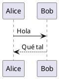
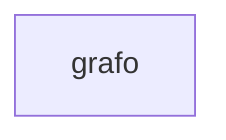

# About

Aquí aparece el about.

```plantuml
@startuml
Alice -> Bob: Hola
Bob --> Alice: Qué tal
@enduml
```

```plantuml
@startuml
Alice -> Bob: Hola
Bob --> Alice: Qué tal
@enduml
```

- javascripts/mermaid.min.js

```mermaid
graph LR

grafo 

```