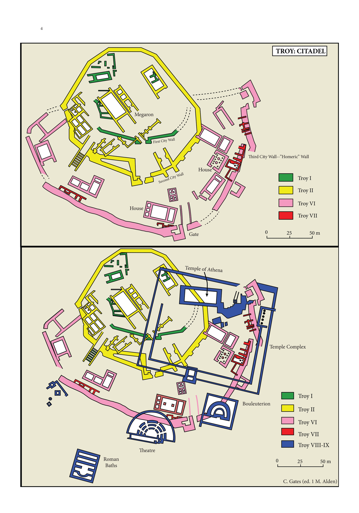
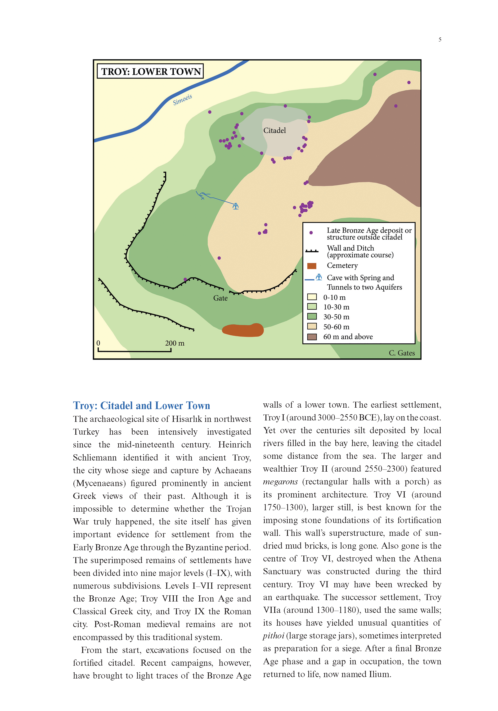
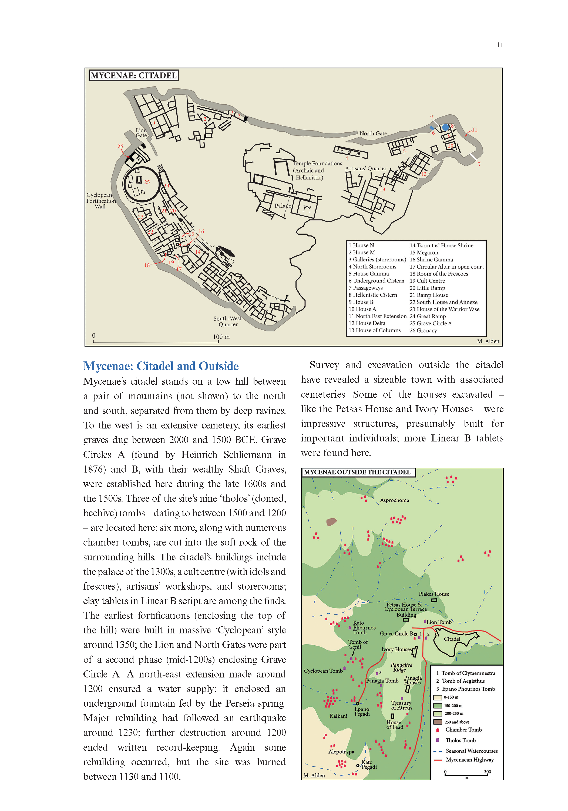
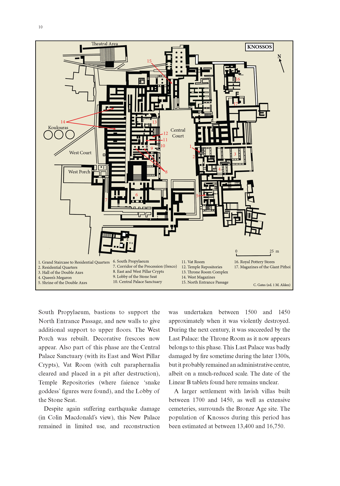
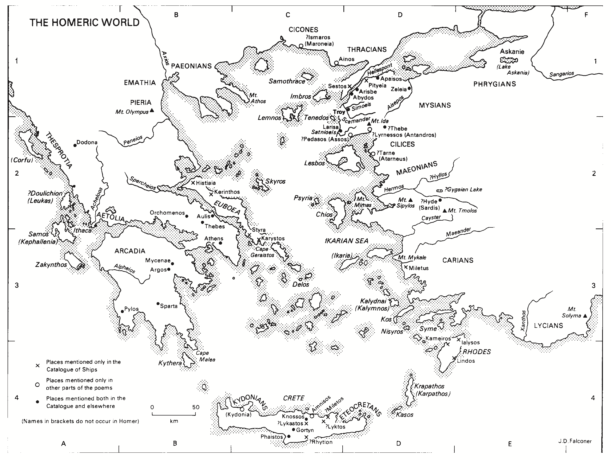
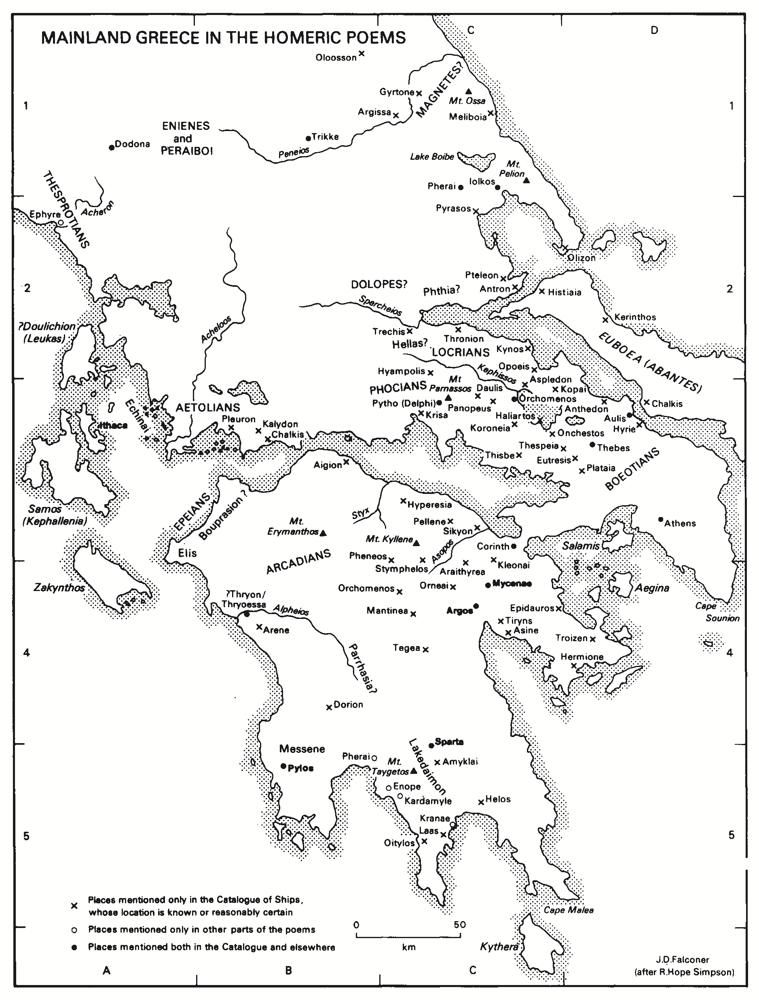

[**MENÚ PRINCIPAL**](index.md)

# Geografía

---

- [Geografía](#geografía)
  - [1. Troya](#1-troya)
  - [2. Mundo homérico](#2-mundo-homérico)
  - [3. Mundo homérico (continente)](#3-mundo-homérico-continente)
  - [4. Palacios](#4-palacios)
    - [4.1. Micenas](#41-micenas)
    - [4.2. Cnoso](#42-cnoso)
    - [4.3. Pilo](#43-pilo)
  - [5. Mundo homérico continental](#5-mundo-homérico-continental)
  - [6. Mundo homérico continental](#6-mundo-homérico-continental)

---

## 1. Troya

---

## 2. Mundo homérico

---

## 3. Mundo homérico (continente)

---

## 4. Palacios

---

### 4.1. Micenas

---

### 4.2. Cnoso

---

### 4.3. Pilo

## 5. Mundo homérico continental

<!-- Image Map Generated by http://www.image-map.net/ -->

<map name="image-map">
    <area target="_self" alt="Micenas" title="Micenas" href="" coords="658,1011,25" shape="circle">
    <area target="_self" alt="Argos" title="Argos" href="" coords="NaN" shape="circle">
    <area target="_self" alt="Tebas" title="Tebas" href="" coords="776,856,NaN" shape="circle">
</map>

## 6. Mundo homérico continental

