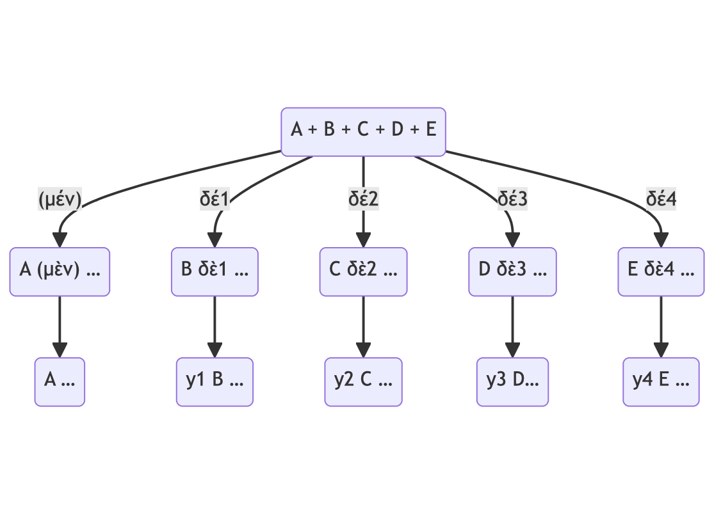

# δέ (F-3)

## 1. Conjunción coordinante

1. Coordinación copulativa: ‘y’, ‘e’.

2. Coordinación adversativa: ‘pero’, ‘por otro lado’.

## 2. Posición

- Aparece detrás del segundo o ulterior miembro de la coordinación

  - A, B δὲ1 … C δὲ2 …, D δὲ3, E δὲ4 …

graph TB

Coord("A + B + C + D + E")

A("A (μὲν) …")
B("B δὲ1 …")
C("C δὲ2 …")
D("D δὲ3 …")
E("E δὲ4 …")

A2("A …")
B2("y1 B …")
C2("y2 C …")
D2("y3 D…")
E2("y4 E …")

Coord-->|"(μέν)"|A -->A2
Coord-->|"δέ1"|B -->B2
Coord-->|"δέ2"|C -->C2
Coord-->|"δέ3"|D -->D2
Coord-->|"δέ4"|E -->E2

---

## 3. Contextos

Aparece frecuentemente después de pausa fuerte uniendo la unidad que introduce a todo lo anterior. En español no suele traducirse.

## 4. Combinaciones

- A (μὲν) … B δὲ …

## 5. Uso apodótico

1. Introduce la oración principal después de una subordinada a la izquierda.

2. Aparece con diferentes tipos de subordinadas:

- 2.1. **Condicionales**: εἰ ..., (τότε) δὲ ... (‘si … (entonces) …’)

>(1) **εἰ** μὴ αὐτὴ Σμέρδιν τὸν Κύρου γινώσκεις, σὺ **δὲ** παρὰ Ἀτόσσης πύθεο ὅτεῳ τούτῳ συνοικέει αὐτή τε ἐκείνη καὶ σύ («Si no conoces personalmente a Esmerdis, el hijo de Ciro, pregunta a Atosa con quién cohabitáis ella misma y tú», Hdt. 3.68.18).

- 2.2. **Causales**: ἐπειδὴ ...,  (τούτου ἕνεκα) δὲ ... (‘como … (por eso) …’)

>(2) **ἐπεὶ** τοίνυν οὐ δύναμαί σε πείθειν μὴ ἐκθεῖναι, σὺ **δὲ** ὧδε ποίησον («Puesto que no te puedo convender de que no lo expongas, actúa de la siguiente manera», Hdt. 1.112.2).

- 2.3. **Comparativas**: ὥσπερ ...,  (οὕτω) δὲ ... (como … (así también) …’)

>(3) ἐκάθευδον δὲ αὐτῷ ἐν τάξει **ὥσπερ** οἱ ὁπλῖται, **οὕτω δὲ** καὶ οἱ πελτασταὶ καὶ οἱ τοξόται («Dormían en el mismo orden que los hoplitas también los peltastas y los arqueros», X. Cyr. 8.5.12).

- 2.4. **Relativas**: ὃς ...,  (τοῦτον) δὲ ... (‘quien … (a ese) …’)

>(4) **οὓς** γὰρ νεωστὶ συμμάχους τε ἔχομεν καὶ πειρώμεθα ἡμῖν αὐτοῖς ὁμοίους ποιεῖν, **τούτους δὲ** ἡμᾶς δεῖ ὑπομιμνῄσκειν… («A aquellos que recientemente tuvimos como aliados y a quienes intentamos convertir en nuestros iguales, a esos debemos recordarles…», X. Cyr. 3.3.36).
