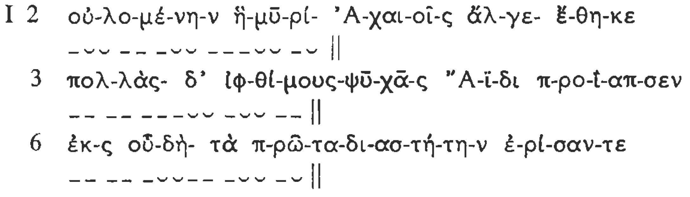
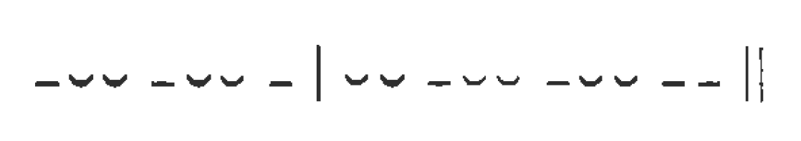
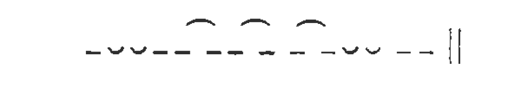
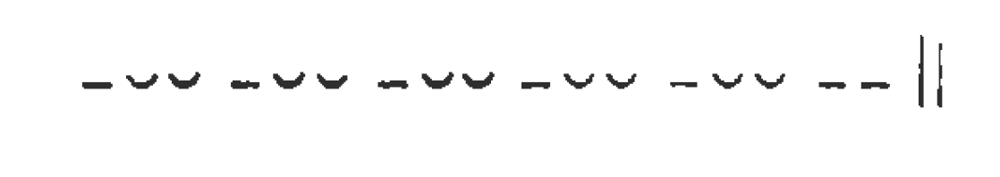

# MÉTRICA

## 1. Cantidad

- La métrica tiene por objeto el estudio de la versificación y ésta consiste en la **regulación rítmica** de ciertos **elementos fonéticos** de la lengua.
- La versificación griega (y latina) se diferenciaba fundamentalmente de la española en que regulaba la **cantidad silábica**. Y ello era así porque las **diferencias de cantidad** eran llamativas en griego, ya que con ellas se formaban palabras y formas distintas: λέγειν (con e breve) "decir", pero λήγειν (con e larga) "cesar"; λόγον acusativo singular, pero λόγων genitivo plural. Además, la versificación griega **no** tenía en cuenta el **acento** (que era musical e implicaba que la **vocal acentuada** se pronunciaba en **nota musical más alta**). La **rima**, tan frecuente y casi imprescindible en nuestros versos, no era tampoco utilizada en la versificación griega. Lo que sí tenía de **común** con la nuestra era la **regulación** de las **pausas** y las **cesuras**.

## 2. Verso 

- El **verso** puede definirse como la porción de **"cadena hablada"** comprendida **entre dos pausas**. La regulación de las pausas a intervalos iguales o aproximadamente iguales presta al verso una **extensión determinada**. El **latín** *versus* es nombre formado sobre el verbo vertor "dar vueltas" y alude a la **repetición** constante de algo que vuelve de nuevo. En **griego**, verso se dice **στίχος** **"línea, fila"**, y una composición de versos repetidos indefinidamente (como los de la Ilíada) se dice que está hecha **κατά στίχον**. 
- La **pausa** existente al final de cada verso (simbolizada por **\|\|**) se advierte por dos **efectos** que produce, cuando la ocasión para ello se presenta:
  - (a) Encuentro de **vocal final ante vocal inicial** del verso siguiente, sin que la primera sufra elisión, si es breve, ni se abrevie, si es larga o diptongo. Obsérvense, en esta antología, los finales de los versos 5. 10, 11, 17, 20, 21, 22, 23 y 24 del canto I de la Iliada.

  - (b) La **sílaba que precede** siempre es **larga**, hasta el punto de que una **sílaba breve**, como no va limitada por el comienzo de una sílaba siguiente, **se alarga**. En el mismo canto I 2, 6, 11, 13, 21, 23, 25, pueden apreciarse las sílabas breves de fin de verso, que equivalen a las sílabas largas en que terminan los versos 5, 7, 8, 9, 10, 12, 15, 16, etc.

- En el interior del verso las sílabas breves y largas no aparecen caprichosamente, sino que también son objeto de regulación. Pero antes de tratar de ésta, hemos de saber qué **sílabas** son **breves** y qué sílabas son **largas**.

## 3. Cantidad silábica

- La **cantidad** no es del todo igual que la **duración**: ésta presenta muchas variaciones de unas silabas a otras (que, en las lenguas actuales, se miden en centésimas de segundo en los laboratorios fonéticos); en griego, la duración de las sílabas variaba también mucho; pero, en lo que se refiere a cantidad, las **sílabas** funcionaban o como **breves** o como **largas**. La breve se simboliza ˘ y la larga ¯.

- Una **sílaba** es **breve** cuando consta **sólo** de **vocal breve** o **termina en vocal breve**. La ε y la o son vocales breves, mientras que la η y la ω son largas. En α, ι , υ la escritura no distingue la breve de la larga (que sí se distinguían en la pronunciación) y hay que recurrir a una buena **gramática** y a un buen **diccionario** para conocer la cantidad. Pero con el hábito se llega a ello sin gran dificultad.

- Una sílaba es larga cuando consta de **vocal larga o diptongo**. Se dice entonces que la sílaba es larga "**por naturaleza**" (**ψύσει**). También es larga cuando, a pesar de llevar **vocal breve**, ésta va **seguida de dos o más consonantes**, de las cuales la primera pertenece a dicha sílaba y la restante o restantes forman parte de la sílaba siguiente. En este caso se dice que la sílaba es **larga "por posición" θέσει** (que estaría más fielmente traducido "por convención"). Las letras **ζ**, **ξ** y **ψ** cuentan, naturalmente, como **dos consonantes**. Dicho de otra manera: cuando dos vocales están separadas por una sola consonante, ésta entra en la sílaba siguiente. Las consonantes que, dentro de una misma sílaba, preceden a la vocal, no afectan a la cantidad (así en Iliada I 53 στρα-τόν tiene la primera sílaba breve).

- He aquí tres versos del comienzo de esta antología divididos en sílabas y medidos:

- A veces sucede que **dos vocales** (que no forman diptongo) **se funden** en **una sola sílaba**, que resulta larga. Este fenómeno recibe el nombre de **sinizesis**:

- En los poemas homéricos, los grupos llamados de **muta cum liquida**, es decir, de **oclusiva** (sorda, sonora o aspirada) seguida de **λ, ρ, μ, ν**, funcionan de tal modo que el límite silábico cae entre las dos consonantes, por lo cual la **sílaba que precede** siempre es **larga**. Obsérvese este fenómeno en I 3 y 6, como en 7 Ἀτ-ρείδης.

- No obstante, la necesidad de disponer de sílabas breves en el verso épico hace que algunas veces se encuentren en Homero grupos de **muta cum liquida** en que la segunda consonante es **λ, ρ**, que **no alargan** la vocal precedente:

  -  Il. I 113 ῥα Κλυταιμήστρης, 
  - 201 πτερόεντᾰ προσηύδα, 
  - XVIII 122 καί τινᾰ Τρωϊάδων.
  -  Igual ocurre dentro de palabras como Ἀφροδίτη (e incluso ἀ-νδροτῆτα ˘˘¯˘ en Ilíada XXII 363), que, de no ser así, no entrarían en el verso. 
  -  Por las mismas razones, en VI 402, a pesar del grupo consonantico, se mide καλέεσκε˘ Σκαμάνδριον.

- En principio, el **hiato** o encuentro de dos vocales en la frase es evitado. La vocal breve final **a, ε, o y a veces i** sufre **elisión**: Il. I 2 μυρί'(α), 3 δ'(ε), 33 ἔφατ(ο), 71 νήεσσ(ι). También ocurre la elisión a **algunos diptongos**: I 117 βούλομ(αι); en los **pronombres personales** μοι, σοι, τοι, oἱ como en I 170 ουδέ σ' óΐω. La vocal larga o diptongo (no elidido) en final de palabra ante vocal inicial se abrevia:   
  - I 61 δὴ ὁμοῦ, 
  - 17 καὶ ἄλλοι ἐϋκνήμιδες.

- Α pesar de estos principios generales, la larga historia de la tradición épica hace coexistir **hechos fonéticos de épocas diversas** y ha creado así una **situación sumamente artificiosa**. He aquí algunas particularidades de los cien primeros versos de nuestra selección de pasajes de la Ilíada.
    
    - La antigua existencia de la **digamma** explica **hiatos** (que no lo eran cuando existía ϝ, pronunciada como w en inglés):
      - 7 τε (ϝ)ἄναξ, 
      - 24 Ἀγαμέμνονι ῾(ϝ)ήνδανε, 
      - 30 ἐνὶ (ϝ)οἴκῳ,
      - 36 Ἀπόλλωνι (ϝ)ἄνακτι, 
      - 38 τε (ϝ)ἶφι (ϝ)ἀνάσσεις,
      -  47 νυκτΐ (ϝ)ε(ϝ)οικώς, 
      -  85 μάλα (ϝ)ειπέ.

    - Explica también que una breve o diptongo final no abrevie:
      - 98 δόμεναι ῾(ϝ)ελικώπιδα, 
      - 40 ἤ(ϝ)᾽ εἰ.

    - que una sílaba breve final resulte alargada por posición:
      - 75 Ἀπόλλωνος ῾(ϝ)εκατηβελέταο,
     
    - y que sea larga la primera sílaba de 33 
      - ἔδ(ϝ)εισεν.

- Pero cuando ese sonido dejó de pronunciarse, los **aedos** se encontraron con esos hiatos legados por la tradición, no los entendieron, los tomaron como **libertades prosódicas** y los extendieron a **otros casos** en que ya no tienen justificación histórica:

  - Vocal **breve** no elidida: 4 δέ έλώρια.
  - Vocal **larga o diptongo** final que **no abrevia**:
      - 24 Ἀτρείδη Ἀγαμέμνονι, 
      - 30 ἡμετέρῳ ἑνί,
      - 42 Δαναοί ἐμὰ,
      - 64 εἴποι ὅ τι.
  - Alargamiento de sílaba breve final ante vocal inicial: 
    - 19 πόλιν εὖ, 
    - 85 θεοπρόπιον ὅ τι.

- Por razones semejantes, **λ, ρ, μ, ν iniciales** pueden hacer **posición** o **no** hacerla, cuando proceden de grupos con **silbante inicial** (μοῖρα, νευρή). Y, a la inversa, palabras que **nunca tuvieron silbante**, a veces **hacen posición** (λείπω, etc.).

## 4. Metro, pie

- Cada verso épico tiene reguladas las sílabas de tal manera que las **largas y las breves** se suceden con arreglo al siguiente **esquema**
ideal:

¯˘˘¯˘˘¯˘˘¯˘˘¯˘˘¯˘˘||

- Al oír un verso así (nosotros tenemos que renunciar a fiamos de nuestro oído porque nuestra lengua no nos tiene acostumbrados a distinguir la cantidad), un griego analizaba su percepción y apreciaba la repetición del grupo seis veces. Este grupo era el **módulo**, la unidad rítmica o medida, el **μέτρον "metro"** (que en este caso coincide con lo que muchos tratadistas llaman **"pie"**). Por eso, el verso era designado con el adjetivo **ἑξάμετρος, "hexámetro"**, atestiguado ya en Heródoto (I 47, 2 y VII 220, 3).

- Cada metro se compone de un **tiempo marcado** (que llama más la atención), la **sílaba larga**, y de un **tiempo no marcado**, las **dos sílabas breves**. Este metro recibía el nombre de **dáctilo**; de ahí que se hable de **hexámetro dactilico** o de ritmo **dactilico**.

- Las dos sílabas breves pueden ser sustituidas por una larga (pero la larga no puede ser resuelta en dos breves). La forma resultante ¯ ¯ constituye el llamado **"pie" espondeo**.

- Sobre esta sustitución hemos de hacer dos observaciones:
   - (a) El **último metro** es siempre de la forma **¯ ¯** . La razón es que ante la pausa del final del verso, dado que una breve necesariamente se hace larga en esa posición, se convertiría en ¯ ˘ ¯ , lo cual ya no es de ninguna manera ritmo dactílico.

    - (b) El **quinto metro** es **dáctilo puro** en el **98%** de los versos homéricos. Como quiera que el último metro no puede ser dáctilo puro, el penúltimo es el que ha de dejar la impresión nítida de ritmo dactilico. En 11, 21 y 74 tenemos un final **¯ ¯ ¯ ¯ ¯ ¯**; siempre se trata de una única palabra que Uega hasta el final del verso. Un verso con espondeo en el quinto metro se llama espondaico. 

- Un verso compuesto todo con dáctilos (salvo el del sexto metro) se llama **holodáctilo** (10. 12, 13) y suele dar impresión de alegre ligereza. Los **holospondeos**, que dan impresión de pesadez, son muy **raros**.

## 5. Cesura

- Básicamente, puesto que al **final del verso** hay **pausa**, hay también **final de sentido** y, por lo tanto, cadencia de la melodía de la frase o entonación. Los versos 53-58 muestran esta coincidencia entre verso y frase. 

- Pero sucede que un hexámetro (con un mínimo de doce sílabas y un máximo de diecisiete) excede con mucho de las **ocho sílabas** que, por término medio, tiene el **grupo melódico** o **miembro de frase musical** en griego. La noción de grupo melódico se ilustra con este ejemplo español: *En un lugar de la Mancha, / de cuyo nombre no quiero acordarme, / no ha mucho tiempo / que vivía un hidalgo / etc*. Por esta razón, el hexámetro tenía que tener al menos un límite de grupo melódico en su interior.

- Pues bien, una **cesura** (**τομή "corte"**) es precisamente un **límite entre dos grupos melódicos** en el interior de un verso. Hay que tener en cuenta las siguientes puntualizaciones:

  - (a) La cesura tiene que ir en final de palabra fonética. Las enclíticas (bien conocidas) y las postpositivas (δέ, γάρ, etc.) se unen a la palabra anterior. Las proclíticas (todo el artículo, todas las preposiciones delante de su régimen, las negaciones ού, μή, muchas conjunciones εἰ, καί, ἀλλά, αὐτάρ, ἐπεί, etc.) se unen a la palabra que sigue.
  - (b) Como en la estructura del verso una cesura no es igual a la pausa del final, en la cesura se da la elisión, el abreviamiento de larga o diptongo ante vocal, etc.
  - (c) Las cesuras que puede tener el hexámetro son las siguientes: 
    - [Tr] **trihemímeres** (a las tres medias partes de dáctilo)

    - [P] **pentemímeres** (a las cinco medias partes de dáctilo)
 
    - [T] **trocaica** (esto es, en el tercer troqueo ¯ ˘) o **femenina** (porque va en **tiempo** no marcado o **"débil"**, en tanto que las otras Tr, P y H son "masculinas")

    - [H] **heptemímeres** (a las siete medias partes de dáctilo)
  
    - [B] **bucólica** (llamada **diéresis** porque, a diferencia de las cesuras anteriores, cae al final de un metro, y bucólica por el uso que de ella hicieron los poetas bucólicos helenísticos para lograr efectos sonoros especiales)

- (d) La **cesura**, que no es pausa, **no parte el verso**, sino que lo **traba**.

- (e) No todo fin de palabra en esos lugares del verso puede ser considerado verdadera cesura. Para que ésta exista, es preciso que el sentido indique **fin de miembro de frase**, es decir, haga cadencia de fin de grupo melódico. Esta **cadencia** podemos apreciarla nosotros mismos al oído, porque el español, como todas las lenguas del mimdo, divide la frase en unidades melódicas de acuerdo con el sentido. Veamos los primeros versos de la Ilíada con indicación de los fines de palabra que coinciden en los lugares típicos de cesura:

---

| Línea | Texto                                      | Cesura |
|-------|--------------------------------------------|--------|
| 1     | Μῆνιν ἄειδε, θεά, Πηληϊάδεω Άχιλῆος        | Ρ      |
|       | οὐλομένην, ἣ μυρί' Ἀχαιοῖς ἄλγε' ἔθηκε,    | Tr-T-B |
| 3     | πολλὰς δ' ἰψθίμους ψυχὰς Ἄϊδι προΐαψεν     | Ρ-Η    |
|       | ἡρώων, αὐτούς δὲ ἑλώρια τεῦχε κύνεσσιν     | Tr-T-H |
| 5     | οἰωνοῖσί τε πᾶσι, Διὸς δ' ἐτελείετο βουλή· | Τ-Η    |
|       | ἐξ οὗ δή τὰ πρῶτα διαστήτην ἐρίσαντε       | Tr-T   |
| 7     | Ἀτρείδης τε ἄναξ ἀνδρῶν καὶ δῖος Ἀχιλλεύς. | Ρ-Η    |

---

1. Notemos que en 4 no hay fin de palabra delante de δέ, que es postpositiva y va unida a la palabra anterior; no hay, pues, posibilidad de cesura P. La misma observación sugiere, en 7, la enclítica τε (que excluye, por consiguiente, la cesura Tr) y la proclitica καñi (que excluye la diéresis B).

2. En 2, el sentido de predominio a Tr, sin hacer perder a Β toda su importancia.

3. En 3, Ρ no tiene existencia real, pues la melodía de la frase une el adjetivo al sustantivo. La verdadera cesura es H.

4. En 4, predomina Tr. Por lo demás, Η se marca más que T.

5. En 5, Τ es evidentemente real, mientras que Η es puramente ilusoria, pues el miembro de frase va desde Τ hasta el final.

6. En 6, Τ es claramente preferible, con exclusión de Tr, pues el grupo introductivo de la oración temporal no debe quedar aislado.

7. En 7, sólo hay H, ya que el genitivo no debe separarse en la melodía de la frase del sustantivo del que depende.

8. Puede, pues, haber más de una cesura real en un verso. Tr y Β nunca van solas. De las restantes, Ρ y Γ son estadísticamente las más frecuentes, sin duda porque dividen al hexámetro en dos miembros, el segundo algo más largo que el primero, y ello satisface la tendencia estética a los miembros crecientes o climax.

## 6. Zeugma

- Por esta misma tendencia estética **se evita** generalmente **fin de palabra después del tercer dáctilo**, que podría dividir al hexámetro en **dos miembros iguales**.

- Para evitar la impresión de que el verso termina después del segundo metro o después del cuarto, se tiende a evitar fin de palabra en esos lugares cuando el pie es espondeo y podría producir la impresión de pausa. Este fenómeno, consistente en **evitar fin de palabra en determinado lugar del verso**, se llama **zeugma**. Los que acabamos de citar se simbolizan:

- Los versos 1, 3 y 7 observan el segundo de dichos zeugmas; 6 y 7 observan el tercero (en 2, la violación puede ser sólo aparente, pues probablemente hay elisión); 3 y 4 observan el primero, que parece violado en 2 y 6 (es, desde luego, el menos riguroso de los tres, acaso por estar muy cerca del comienzo del verso).

- Otro zeugma, que en Homero se observa en el 999 por 1000 de los casos y que en la poesía hexamétrica posterior es de observación rigurosa, es el llamado zeugma de Hermann (por su descubridor); se evita fin de palabra entre las dos breves del cuarto dáctilo:

Véanse los versos 1, 3. 4 y 5.

## 7. Encabalgamiento

- Las **cesuras**, junto con las combinaciones posibles de dáctilos y espondeos, daban gran **variedad melódica y rítmica** a las interminables series de hexámetros.

- A ello contribuía también el hacer que una frase saltase el fin de verso y terminase en medio del verso siguiente, lo cual revela una técnica poética nada primitiva. Este fenómeno se conoce con el nombre de **enjambement**, término francés de uso internacional para el que el profesor don Dámaso Alonso ha propuesto la traducción **"encabalgamiento"**.

- Observemos los encabalgamientos existentes 1-2, 3-4, 4-5, 11-12, 51-52. La palabra o palabras que pasan al verso siguiente adquieren especial relieve expresivo. Generalmente el encabalgamiento es más suave y lo que pasa al verso siguiente es un complemento, bien coordinado a otro anterior (4-5), bien nuevo (14-15). Es frecuente que el verso siguiente esté ocupado entero por un miembro sintáctico (7 contiene los sujetos gramaticales de 6 ; 13 es una oración participial que se agrega a 12 ; igual sucede en 20-21 ; 19 contiene los infinitivos complementos de 18). Queda, pues, de manifiesto que, en la relación entre verso y frase, el engarce es por adición, de acuerdo con el principio de la parataxis que, en buena parte, rige la sintaxis de la lengua homérica.

## 8. Orígenes

- Sobre los orígenes del hexámetro **nada seguro** se puede afirmar.

- Sabemos que primero fue **cantado** y luego **recitado** (§§ 2 y 4) y que debió existir ya en el **II milenio**, a juzgar por las **fórmulas tradicionales** que se remotan a la **época micénica**. También puede darse por seguro que la épica ha estado siempre compuesta en **series indefinidas de versos iguales** (§ 3b) y que el hexámetro **no procede de estrofas**, como alguien ha supuesto.

- Se ha emitido la **hipótesis** de que los griegos tomaron este verso de **culturas no helénicas** (acaso de los cretenses o, menos probablemente, de los egipcios). Las **adaptaciones**, un tanto **violentas**, que ha sufrido la lengua griega (no obstante la mayor abundancia de sílabas breves antes de que se efectuasen las contracciones) para hacerlas entrar en el ritmo dactilico, parecen confirmar ese **origen extraño** que se supone. Ello no obstante, es verosímil que los **griegos indoeuropeos** de la época de las invasiones, antes de entrar en contacto con esas culturas del Mediterráneo, contaron con una **poesía épica** que celebraba sus hechos de guerra.

---

## 9. Ejemplos de versos medidos

[Versos medidos y con explicaciones](https://pajaro1966.github.io/My_Mk_Docs/Charlas/Metrica_Homer/Versos_Medidos.pdf)