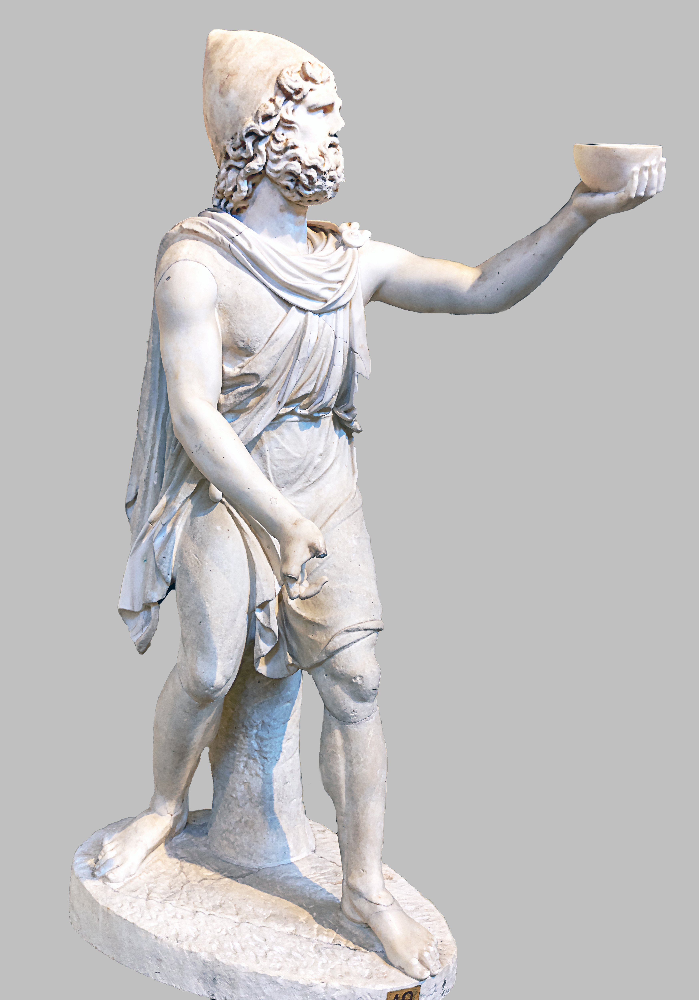
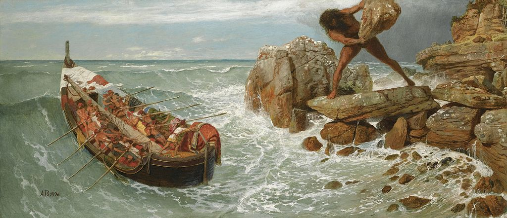

# Odisea

## 1-81 Ulises revela a Alcinoo su nombre y su patria

| V | GRIEGO |
| --- | --- |
| 1 | τὸν δʼ ἀπαμειβόμενος προσέφη πολύμητις Ὀδυσσεύς· |
| 2 | «Ἀλκίνοε κρεῖον, πάντων ἀριδείκετε λαῶν, |
| 3 | ἦ τοι μὲν τόδε καλὸν ἀκουέμεν ἐστὶν ἀοιδοῦ |
| 4 | τοιοῦδʼ οἷος ὅδʼ ἐστί, θεοῖς ἐναλίγκιος αὐδήν. |
| 5 | οὐ γὰρ ἐγώ γέ τί φημι τέλος χαριέστερον εἶναι |
| 6 | ἢ ὅτʼ ἐυφροσύνη μὲν ἔχῃ κάτα δῆμον ἅπαντα, |
| 7 | δαιτυμόνες δʼ ἀνὰ δώματʼ ἀκουάζωνται ἀοιδοῦ |
| 8 | ἥμενοι ἑξείης, παρὰ δὲ πλήθωσι τράπεζαι |
| 9 | σίτου καὶ κρειῶν, μέθυ δʼ ἐκ κρητῆρος ἀφύσσων |
| 10 | οἰνοχόος φορέῃσι καὶ ἐγχείῃ δεπάεσσι· |
| 11 | τοῦτό τί μοι κάλλιστον ἐνὶ φρεσὶν εἴδεται εἶναι. |
| 12 | σοὶ δʼ ἐμὰ κήδεα θυμὸς ἐπετράπετο στονόεντα |
| 13 | εἴρεσθʼ, ὄφρʼ ἔτι μᾶλλον ὀδυρόμενος στεναχίζω· |
| 14 | τί πρῶτόν τοι ἔπειτα, τί δʼ ὑστάτιον καταλέξω; |
| 15 | κήδεʼ ἐπεί μοι πολλὰ δόσαν θεοὶ Οὐρανίωνες. |
| 16 | νῦν δʼ ὄνομα πρῶτον μυθήσομαι, ὄφρα καὶ ὑμεῖς |
| 17 | εἴδετʼ, ἐγὼ δʼ ἂν ἔπειτα φυγὼν ὕπο νηλεὲς ἦμαρ |
| 18 | ὑμῖν ξεῖνος ἔω καὶ ἀπόπροθι δώματα ναίων. |
| 19 | εἴμʼ Ὀδυσεὺς Λαερτιάδης, ὃς πᾶσι δόλοισιν |
| 20 | ἀνθρώποισι μέλω, καί μευ κλέος οὐρανὸν ἵκει. |
| 21 | ναιετάω δʼ Ἰθάκην ἐυδείελον· ἐν δʼ ὄρος αὐτῇ |
| 22 | Νήριτον εἰνοσίφυλλον, ἀριπρεπές· ἀμφὶ δὲ νῆσοι |
| 23 | πολλαὶ ναιετάουσι μάλα σχεδὸν ἀλλήλῃσι, |
| 24 | Δουλίχιόν τε Σάμη τε καὶ ὑλήεσσα Ζάκυνθος. |
| 25 | αὐτὴ δὲ χθαμαλὴ πανυπερτάτη εἰν ἁλὶ κεῖται |
| 26 | πρὸς ζόφον, αἱ δέ τʼ ἄνευθε πρὸς ἠῶ τʼ ἠέλιόν τε, |
| 27 | τρηχεῖʼ, ἀλλʼ ἀγαθὴ κουροτρόφος· οὔ τοι ἐγώ γε |
| 28 | ἧς γαίης δύναμαι γλυκερώτερον ἄλλο ἰδέσθαι. |
| 29 | ἦ μέν μʼ αὐτόθʼ ἔρυκε Καλυψώ, δῖα θεάων, |
| 30 | ἐν σπέσσι γλαφυροῖσι, λιλαιομένη πόσιν εἶναι· |
| 31 | ὣς δʼ αὔτως Κίρκη κατερήτυεν ἐν μεγάροισιν |
| 32 | Αἰαίη δολόεσσα, λιλαιομένη πόσιν εἶναι· |
| 33 | ἀλλʼ ἐμὸν οὔ ποτε θυμὸν ἐνὶ στήθεσσιν ἔπειθον. |
| 34 | ὣς οὐδὲν γλύκιον ἧς πατρίδος οὐδὲ τοκήων |
| 35 | γίγνεται, εἴ περ καί τις ἀπόπροθι πίονα οἶκον |
| 36 | γαίῃ ἐν ἀλλοδαπῇ ναίει ἀπάνευθε τοκήων. |
| 37 | εἰ δʼ ἄγε τοι καὶ νόστον ἐμὸν πολυκηδέʼ ἐνίσπω, |
| 38 | ὅν μοι Ζεὺς ἐφέηκεν ἀπὸ Τροίηθεν ἰόντι. |
| 39 | Ἰλιόθεν με φέρων ἄνεμος Κικόνεσσι πέλασσεν, |
| 40 | Ἰσμάρῳ. ἔνθα δʼ ἐγὼ πόλιν ἔπραθον, ὤλεσα δʼ αὐτούς· |
| 41 | ἐκ πόλιος δʼ ἀλόχους καὶ κτήματα πολλὰ λαβόντες |
| 42 | δασσάμεθʼ, ὡς μή τίς μοι ἀτεμβόμενος κίοι ἴσης. |
| 43 | ἔνθʼ ἦ τοι μὲν ἐγὼ διερῷ ποδὶ φευγέμεν ἡμέας |
| 44 | ἠνώγεα, τοὶ δὲ μέγα νήπιοι οὐκ ἐπίθοντο. |
| 45 | ἔνθα δὲ πολλὸν μὲν μέθυ πίνετο, πολλὰ δὲ μῆλα |
| 46 | ἔσφαζον παρὰ θῖνα καὶ εἰλίποδας ἕλικας βοῦς· |
| 47 | τόφρα δʼ ἄρʼ οἰχόμενοι Κίκονες Κικόνεσσι γεγώνευν, |
| 48 | οἵ σφιν γείτονες ἦσαν, ἅμα πλέονες καὶ ἀρείους, |
| 49 | ἤπειρον ναίοντες, ἐπιστάμενοι μὲν ἀφʼ ἵππων |
| 50 | ἀνδράσι μάρνασθαι καὶ ὅθι χρὴ πεζὸν ἐόντα. |
| 51 | ἦλθον ἔπειθʼ ὅσα φύλλα καὶ ἄνθεα γίγνεται ὥρῃ, |
| 52 | ἠέριοι· τότε δή ῥα κακὴ Διὸς αἶσα παρέστη |
| 53 | ἡμῖν αἰνομόροισιν, ἵνʼ ἄλγεα πολλὰ πάθοιμεν. |
| 54 | στησάμενοι δʼ ἐμάχοντο μάχην παρὰ νηυσὶ θοῇσι, |
| 55 | βάλλον δʼ ἀλλήλους χαλκήρεσιν ἐγχείῃσιν. |
| 56 | ὄφρα μὲν ἠὼς ἦν καὶ ἀέξετο ἱερὸν ἦμαρ, |
| 57 | τόφρα δʼ ἀλεξόμενοι μένομεν πλέονάς περ ἐόντας. |
| 58 | ἦμος δʼ ἠέλιος μετενίσσετο βουλυτόνδε, |
| 59 | καὶ τότε δὴ Κίκονες κλῖναν δαμάσαντες Ἀχαιούς. |
| 60 | ἓξ δʼ ἀφʼ ἑκάστης νηὸς ἐυκνήμιδες ἑταῖροι |
| 61 | ὤλονθʼ· οἱ δʼ ἄλλοι φύγομεν θάνατόν τε μόρον τε. |
| 62 | ἔνθεν δὲ προτέρω πλέομεν ἀκαχήμενοι ἦτορ, |
| 63 | ἄσμενοι ἐκ θανάτοιο, φίλους ὀλέσαντες ἑταίρους. |
| 64 | οὐδʼ ἄρα μοι προτέρω νῆες κίον ἀμφιέλισσαι, |
| 65 | πρίν τινα τῶν δειλῶν ἑτάρων τρὶς ἕκαστον ἀῦσαι, |
| 66 | οἳ θάνον ἐν πεδίῳ Κικόνων ὕπο δῃωθέντες. |
| 67 | νηυσὶ δʼ ἐπῶρσʼ ἄνεμον Βορέην νεφεληγερέτα Ζεὺς |
| 68 | λαίλαπι θεσπεσίῃ, σὺν δὲ νεφέεσσι κάλυψε |
| 69 | γαῖαν ὁμοῦ καὶ πόντον· ὀρώρει δʼ οὐρανόθεν νύξ. |
| 70 | αἱ μὲν ἔπειτʼ ἐφέροντʼ ἐπικάρσιαι, ἱστία δέ σφιν |
| 71 | τριχθά τε καὶ τετραχθὰ διέσχισεν ἲς ἀνέμοιο. |
| 72 | καὶ τὰ μὲν ἐς νῆας κάθεμεν, δείσαντες ὄλεθρον, |
| 73 | αὐτὰς δʼ ἐσσυμένως προερέσσαμεν ἤπειρόνδε. |
| 74 | ἔνθα δύω νύκτας δύο τʼ ἤματα συνεχὲς αἰεὶ |
| 75 | κείμεθʼ, ὁμοῦ καμάτῳ τε καὶ ἄλγεσι θυμὸν ἔδοντες. |
| 76 | ἀλλʼ ὅτε δὴ τρίτον ἦμαρ ἐυπλόκαμος τέλεσʼ Ἠώς, |
| 77 | ἱστοὺς στησάμενοι ἀνά θʼ ἱστία λεύκʼ ἐρύσαντες |
| 78 | ἥμεθα, τὰς δʼ ἄνεμός τε κυβερνῆταί τʼ ἴθυνον. |
| 79 | καί νύ κεν ἀσκηθὴς ἱκόμην ἐς πατρίδα γαῖαν· |
| 80 | ἀλλά με κῦμα ῥόος τε περιγνάμπτοντα Μάλειαν |
| 81 | καὶ Βορέης ἀπέωσε, παρέπλαγξεν δὲ Κυθήρων. |

## 82-115 Entre los lotófagos. Llegada al país de los Cíclopes: sus costumbres

| V | GRIEGO |
| --- | --- |
| 82 | ἔνθεν δʼ ἐννῆμαρ φερόμην ὀλοοῖς ἀνέμοισιν |
| 83 | πόντον ἐπʼ ἰχθυόεντα· ἀτὰρ δεκάτῃ ἐπέβημεν |
| 84 | γαίης Λωτοφάγων, οἵ τʼ ἄνθινον εἶδαρ ἔδουσιν. |
| 85 | ἔνθα δʼ ἐπʼ ἠπείρου βῆμεν καὶ ἀφυσσάμεθʼ ὕδωρ, |
| 86 | αἶψα δὲ δεῖπνον ἕλοντο θοῇς παρὰ νηυσὶν ἑταῖροι. |
| 87 | αὐτὰρ ἐπεὶ σίτοιό τʼ ἐπασσάμεθʼ ἠδὲ ποτῆτος, |
| 88 | δὴ τοτʼ ἐγὼν ἑτάρους προΐειν πεύθεσθαι ἰόντας, |
| 89 | οἵ τινες ἀνέρες εἶεν ἐπὶ χθονὶ σῖτον ἔδοντες |
| 90 | ἄνδρε δύω κρίνας, τρίτατον κήρυχʼ ἅμʼ ὀπάσσας. |
| 91 | οἱ δʼ αἶψʼ οἰχόμενοι μίγεν ἀνδράσι Λωτοφάγοισιν· |
| 92 | οὐδʼ ἄρα Λωτοφάγοι μήδονθʼ ἑτάροισιν ὄλεθρον |
| 93 | ἡμετέροις, ἀλλά σφι δόσαν λωτοῖο πάσασθαι. |
| 94 | τῶν δʼ ὅς τις λωτοῖο φάγοι μελιηδέα καρπόν, |
| 95 | οὐκέτʼ ἀπαγγεῖλαι πάλιν ἤθελεν οὐδὲ νέεσθαι, |
| 96 | ἀλλʼ αὐτοῦ βούλοντο μετʼ ἀνδράσι Λωτοφάγοισι |
| 97 | λωτὸν ἐρεπτόμενοι μενέμεν νόστου τε λαθέσθαι. |
| 98 | τοὺς μὲν ἐγὼν ἐπὶ νῆας ἄγον κλαίοντας ἀνάγκῃ, |
| 99 | νηυσὶ δʼ ἐνὶ γλαφυρῇσιν ὑπὸ ζυγὰ δῆσα ἐρύσσας. |
| 100 | αὐτὰρ τοὺς ἄλλους κελόμην ἐρίηρας ἑταίρους |
| 101 | σπερχομένους νηῶν ἐπιβαινέμεν ὠκειάων, |
| 102 | μή πώς τις λωτοῖο φαγὼν νόστοιο λάθηται. |
| 103 | οἱ δʼ αἶψʼ εἴσβαινον καὶ ἐπὶ κληῖσι καθῖζον, |
| 104 | ἑξῆς δʼ ἑζόμενοι πολιὴν ἅλα τύπτον ἐρετμοῖς. |
| 105 | ἔνθεν δὲ προτέρω πλέομεν ἀκαχήμενοι ἦτορ· |
| 106 | Κυκλώπων δʼ ἐς γαῖαν ὑπερφιάλων ἀθεμίστων |
| 107 | ἱκόμεθʼ, οἵ ῥα θεοῖσι πεποιθότες ἀθανάτοισιν |
| 108 | οὔτε φυτεύουσιν χερσὶν φυτὸν οὔτʼ ἀρόωσιν, |
| 109 | ἀλλὰ τά γʼ ἄσπαρτα καὶ ἀνήροτα πάντα φύονται, |
| 110 | πυροὶ καὶ κριθαὶ ἠδʼ ἄμπελοι, αἵ τε φέρουσιν |
| 111 | οἶνον ἐριστάφυλον, καί σφιν Διὸς ὄμβρος ἀέξει. |
| 112 | τοῖσιν δʼ οὔτʼ ἀγοραὶ βουληφόροι οὔτε θέμιστες, |
| 113 | ἀλλʼ οἵ γʼ ὑψηλῶν ὀρέων ναίουσι κάρηνα |
| 114 | ἐν σπέσσι γλαφυροῖσι, θεμιστεύει δὲ ἕκαστος |
| 115 | παίδων ἠδʼ ἀλόχων, οὐδʼ ἀλλήλων ἀλέγουσιν. |

## 116-344 Odiseo entra en la cueva de Polifemo

| V | GRIEGO |
| --- | --- |
| 116 | νῆσος ἔπειτα λάχεια παρὲκ λιμένος τετάνυσται, |
| 117 | γαίης Κυκλώπων οὔτε σχεδὸν οὔτʼ ἀποτηλοῦ, |
| 118 | ὑλήεσσʼ· ἐν δʼ αἶγες ἀπειρέσιαι γεγάασιν |
| 119 | ἄγριαι· οὐ μὲν γὰρ πάτος ἀνθρώπων ἀπερύκει, |
| 120 | οὐδέ μιν εἰσοιχνεῦσι κυνηγέται, οἵ τε καθʼ ὕλην |
| 121 | ἄλγεα πάσχουσιν κορυφὰς ὀρέων ἐφέποντες. |
| 122 | οὔτʼ ἄρα ποίμνῃσιν καταΐσχεται οὔτʼ ἀρότοισιν, |
| 123 | ἀλλʼ ἥ γʼ ἄσπαρτος καὶ ἀνήροτος ἤματα πάντα |
| 124 | ἀνδρῶν χηρεύει, βόσκει δέ τε μηκάδας αἶγας. |
| 125 | οὐ γὰρ Κυκλώπεσσι νέες πάρα μιλτοπάρῃοι, |
| 126 | οὐδʼ ἄνδρες νηῶν ἔνι τέκτονες, οἵ κε κάμοιεν |
| 127 | νῆας ἐυσσέλμους, αἵ κεν τελέοιεν ἕκαστα |
| 128 | ἄστεʼ ἐπʼ ἀνθρώπων ἱκνεύμεναι, οἷά τε πολλὰ |
| 129 | ἄνδρες ἐπʼ ἀλλήλους νηυσὶν περόωσι θάλασσαν· |
| 130 | οἵ κέ σφιν καὶ νῆσον ἐυκτιμένην ἐκάμοντο. |
| 131 | οὐ μὲν γάρ τι κακή γε, φέροι δέ κεν ὥρια πάντα· |
| 132 | ἐν μὲν γὰρ λειμῶνες ἁλὸς πολιοῖο παρʼ ὄχθας |
| 133 | ὑδρηλοὶ μαλακοί· μάλα κʼ ἄφθιτοι ἄμπελοι εἶεν. |
| 134 | ἐν δʼ ἄροσις λείη· μάλα κεν βαθὺ λήιον αἰεὶ |
| 135 | εἰς ὥρας ἀμῷεν, ἐπεὶ μάλα πῖαρ ὑπʼ οὖδας. |
| 136 | ἐν δὲ λιμὴν ἐύορμος, ἵνʼ οὐ χρεὼ πείσματός ἐστιν, |
| 137 | οὔτʼ εὐνὰς βαλέειν οὔτε πρυμνήσιʼ ἀνάψαι, |
| 138 | ἀλλʼ ἐπικέλσαντας μεῖναι χρόνον εἰς ὅ κε ναυτέων |
| 139 | θυμὸς ἐποτρύνῃ καὶ ἐπιπνεύσωσιν ἀῆται. |
| 140 | αὐτὰρ ἐπὶ κρατὸς λιμένος ῥέει ἀγλαὸν ὕδωρ, |
| 141 | κρήνη ὑπὸ σπείους· περὶ δʼ αἴγειροι πεφύασιν. |
| 142 | ἔνθα κατεπλέομεν, καί τις θεὸς ἡγεμόνευεν |
| 143 | νύκτα διʼ ὀρφναίην, οὐδὲ προυφαίνετʼ ἰδέσθαι· |
| 144 | ἀὴρ γὰρ περὶ νηυσὶ βαθεῖʼ ἦν, οὐδὲ σελήνη |
| 145 | οὐρανόθεν προύφαινε, κατείχετο δὲ νεφέεσσιν. |
| 146 | ἔνθʼ οὔ τις τὴν νῆσον ἐσέδρακεν ὀφθαλμοῖσιν, |
| 147 | οὔτʼ οὖν κύματα μακρὰ κυλινδόμενα προτὶ χέρσον |
| 148 | εἰσίδομεν, πρὶν νῆας ἐυσσέλμους ἐπικέλσαι. |
| 149 | κελσάσῃσι δὲ νηυσὶ καθείλομεν ἱστία πάντα, |
| 150 | ἐκ δὲ καὶ αὐτοὶ βῆμεν ἐπὶ ῥηγμῖνι θαλάσσης· |
| 151 | ἔνθα δʼ ἀποβρίξαντες ἐμείναμεν Ἠῶ δῖαν. |
| 152 | ἦμος δʼ ἠριγένεια φάνη ῥοδοδάκτυλος Ἠώς, |
| 153 | νῆσον θαυμάζοντες ἐδινεόμεσθα κατʼ αὐτήν. |
| 154 | ὦρσαν δὲ νύμφαι, κοῦραι Διὸς αἰγιόχοιο, |
| 155 | αἶγας ὀρεσκῴους, ἵνα δειπνήσειαν ἑταῖροι. |
| 156 | αὐτίκα καμπύλα τόξα καὶ αἰγανέας δολιχαύλους |
| 157 | εἱλόμεθʼ ἐκ νηῶν, διὰ δὲ τρίχα κοσμηθέντες |
| 158 | βάλλομεν· αἶψα δʼ ἔδωκε θεὸς μενοεικέα θήρην. |
| 159 | νῆες μέν μοι ἕποντο δυώδεκα, ἐς δὲ ἑκάστην |
| 160 | ἐννέα λάγχανον αἶγες· ἐμοὶ δὲ δέκʼ ἔξελον οἴῳ. |
| 161 | ὣς τότε μὲν πρόπαν ἦμαρ ἐς ἠέλιον καταδύντα |
| 162 | ἥμεθα δαινύμενοι κρέα τʼ ἄσπετα καὶ μέθυ ἡδύ· |
| 163 | οὐ γάρ πω νηῶν ἐξέφθιτο οἶνος ἐρυθρός, |
| 164 | ἀλλʼ ἐνέην· πολλὸν γὰρ ἐν ἀμφιφορεῦσιν ἕκαστοι |
| 165 | ἠφύσαμεν Κικόνων. ἱερὸν πτολίεθρον ἑλόντες. |
| 166 | Κυκλώπων δʼ ἐς γαῖαν ἐλεύσσομεν ἐγγὺς ἐόντων, |
| 167 | καπνόν τʼ αὐτῶν τε φθογγὴν ὀίων τε καὶ αἰγῶν. |
| 168 | ἦμος δʼ ἠέλιος κατέδυ καὶ ἐπὶ κνέφας ἦλθε, |
| 169 | δὴ τότε κοιμήθημεν ἐπὶ ῥηγμῖνι θαλάσσης. |
| 170 | ἦμος δʼ ἠριγένεια φάνη ῥοδοδάκτυλος Ἠώς, |
| 171 | καὶ τότʼ ἐγὼν ἀγορὴν θέμενος μετὰ πᾶσιν ἔειπον· |
| 172 | «ἄλλοι μὲν νῦν μίμνετʼ, ἐμοὶ ἐρίηρες ἑταῖροι· |
| 173 | αὐτὰρ ἐγὼ σὺν νηί τʼ ἐμῇ καὶ ἐμοῖς ἑτάροισιν |
| 174 | ἐλθὼν τῶνδʼ ἀνδρῶν πειρήσομαι, οἵ τινές εἰσιν, |
| 175 | ἤ ῥʼ οἵ γʼ ὑβρισταί τε καὶ ἄγριοι οὐδὲ δίκαιοι, |
| 176 | ἦε φιλόξεινοι, καί σφιν νόος ἐστὶ θεουδής.» |
| 177 | ὣς εἰπὼν ἀνὰ νηὸς ἔβην, ἐκέλευσα δʼ ἑταίρους |
| 178 | αὐτούς τʼ ἀμβαίνειν ἀνά τε πρυμνήσια λῦσαι. |
| 179 | οἱ δʼ αἶψʼ εἴσβαινον καὶ ἐπὶ κληῖσι καθῖζον, |
| 180 | ἑξῆς δʼ ἑζόμενοι πολιὴν ἅλα τύπτον ἐρετμοῖς. |
| 181 | ἀλλʼ ὅτε δὴ τὸν χῶρον ἀφικόμεθʼ ἐγγὺς ἐόντα, |
| 182 | ἔνθα δʼ ἐπʼ ἐσχατιῇ σπέος εἴδομεν ἄγχι θαλάσσης, |
| 183 | ὑψηλόν, δάφνῃσι κατηρεφές. ἔνθα δὲ πολλὰ |
| 184 | μῆλʼ, ὄιές τε καὶ αἶγες, ἰαύεσκον· περὶ δʼ αὐλὴ |
| 185 | ὑψηλὴ δέδμητο κατωρυχέεσσι λίθοισι |
| 186 | μακρῇσίν τε πίτυσσιν ἰδὲ δρυσὶν ὑψικόμοισιν. |
| 187 | ἔνθα δʼ ἀνὴρ ἐνίαυε πελώριος, ὅς ῥα τὰ μῆλα |
| 188 | οἶος ποιμαίνεσκεν ἀπόπροθεν· οὐδὲ μετʼ ἄλλους |
| 189 | πωλεῖτʼ, ἀλλʼ ἀπάνευθεν ἐὼν ἀθεμίστια ᾔδη. |
| 190 | καὶ γὰρ θαῦμʼ ἐτέτυκτο πελώριον, οὐδὲ ἐῴκει |
| 191 | ἀνδρί γε σιτοφάγῳ, ἀλλὰ ῥίῳ ὑλήεντι |
| 192 | ὑψηλῶν ὀρέων, ὅ τε φαίνεται οἶον ἀπʼ ἄλλων. |
| 193 | δὴ τότε τοὺς ἄλλους κελόμην ἐρίηρας ἑταίρους |
| 194 | αὐτοῦ πὰρ νηί τε μένειν καὶ νῆα ἔρυσθαι, |
| 195 | αὐτὰρ ἐγὼ κρίνας ἑτάρων δυοκαίδεκʼ ἀρίστους |
| 196 | βῆν· ἀτὰρ αἴγεον ἀσκὸν ἔχον μέλανος οἴνοιο |
| 197 | ἡδέος, ὅν μοι ἔδωκε Μάρων, Εὐάνθεος υἱός, |
| 198 | ἱρεὺς Ἀπόλλωνος, ὃς Ἴσμαρον ἀμφιβεβήκει, |
| 199 | οὕνεκά μιν σὺν παιδὶ περισχόμεθʼ ἠδὲ γυναικὶ |
| 200 | ἁζόμενοι· ᾤκει γὰρ ἐν ἄλσεϊ δενδρήεντι |
| 201 | Φοίβου Ἀπόλλωνος. ὁ δέ μοι πόρεν ἀγλαὰ δῶρα· |
| 202 | χρυσοῦ μέν μοι ἔδωκʼ ἐυεργέος ἑπτὰ τάλαντα, |
| 203 | δῶκε δέ μοι κρητῆρα πανάργυρον, αὐτὰρ ἔπειτα |
| 204 | οἶνον ἐν ἀμφιφορεῦσι δυώδεκα πᾶσιν ἀφύσσας |
| 205 | ἡδὺν ἀκηράσιον, θεῖον ποτόν· οὐδέ τις αὐτὸν |
| 206 | ἠείδη δμώων οὐδʼ ἀμφιπόλων ἐνὶ οἴκῳ, |
| 207 | ἀλλʼ αὐτὸς ἄλοχός τε φίλη ταμίη τε μίʼ οἴη. |
| 208 | τὸν δʼ ὅτε πίνοιεν μελιηδέα οἶνον ἐρυθρόν, |
| 209 | ἓν δέπας ἐμπλήσας ὕδατος ἀνὰ εἴκοσι μέτρα |
| 210 | χεῦʼ, ὀδμὴ δʼ ἡδεῖα ἀπὸ κρητῆρος ὀδώδει |
| 211 | θεσπεσίη· τότʼ ἂν οὔ τοι ἀποσχέσθαι φίλον ἦεν. |
| 212 | τοῦ φέρον ἐμπλήσας ἀσκὸν μέγαν, ἐν δὲ καὶ ᾖα |
| 213 | κωρύκῳ· αὐτίκα γάρ μοι ὀίσατο θυμὸς ἀγήνωρ |
| 214 | ἄνδρʼ ἐπελεύσεσθαι μεγάλην ἐπιειμένον ἀλκήν, |
| 215 | ἄγριον, οὔτε δίκας ἐὺ εἰδότα οὔτε θέμιστας. |
| 216 | καρπαλίμως δʼ εἰς ἄντρον ἀφικόμεθʼ, οὐδέ μιν ἔνδον |
| 217 | εὕρομεν, ἀλλʼ ἐνόμευε νομὸν κάτα πίονα μῆλα. |
| 218 | ἐλθόντες δʼ εἰς ἄντρον ἐθηεύμεσθα ἕκαστα. |
| 219 | ταρσοὶ μὲν τυρῶν βρῖθον, στείνοντο δὲ σηκοὶ |
| 220 | ἀρνῶν ἠδʼ ἐρίφων· διακεκριμέναι δὲ ἕκασται |
| 221 | ἔρχατο, χωρὶς μὲν πρόγονοι, χωρὶς δὲ μέτασσαι, |
| 222 | χωρὶς δʼ αὖθʼ ἕρσαι. ναῖον δʼ ὀρῷ ἄγγεα πάντα, |
| 223 | γαυλοί τε σκαφίδες τε, τετυγμένα, τοῖς ἐνάμελγεν. |
| 224 | ἔνθʼ ἐμὲ μὲν πρώτισθʼ ἕταροι λίσσοντʼ ἐπέεσσιν |
| 225 | τυρῶν αἰνυμένους ἰέναι πάλιν, αὐτὰρ ἔπειτα |
| 226 | καρπαλίμως ἐπὶ νῆα θοὴν ἐρίφους τε καὶ ἄρνας |
| 227 | σηκῶν ἐξελάσαντας ἐπιπλεῖν ἁλμυρὸν ὕδωρ· |
| 228 | ἀλλʼ ἐγὼ οὐ πιθόμην, ἦ τʼ ἂν πολὺ κέρδιον ἦεν, |
| 229 | ὄφρʼ αὐτόν τε ἴδοιμι, καὶ εἴ μοι ξείνια δοίη. |
| 230 | οὐδʼ ἄρʼ ἔμελλʼ ἑτάροισι φανεὶς ἐρατεινὸς ἔσεσθαι. |
| 231 | ἔνθα δὲ πῦρ κήαντες ἐθύσαμεν ἠδὲ καὶ αὐτοὶ |
| 232 | τυρῶν αἰνύμενοι φάγομεν, μένομέν τέ μιν ἔνδον |
| 233 | ἥμενοι, ἧος ἐπῆλθε νέμων. φέρε δʼ ὄβριμον ἄχθος |
| 234 | ὕλης ἀζαλέης, ἵνα οἱ ποτιδόρπιον εἴη, |
| 235 | ἔντοσθεν δʼ ἄντροιο βαλὼν ὀρυμαγδὸν ἔθηκεν· |
| 236 | ἡμεῖς δὲ δείσαντες ἀπεσσύμεθʼ ἐς μυχὸν ἄντρου. |
| 237 | αὐτὰρ ὅ γʼ εἰς εὐρὺ σπέος ἤλασε πίονα μῆλα |
| 238 | πάντα μάλʼ ὅσσʼ ἤμελγε, τὰ δʼ ἄρσενα λεῖπε θύρηφιν, |
| 239 | ἀρνειούς τε τράγους τε, βαθείης ἔκτοθεν αὐλῆς. |
| 240 | αὐτὰρ ἔπειτʼ ἐπέθηκε θυρεὸν μέγαν ὑψόσʼ ἀείρας, |
| 241 | ὄβριμον· οὐκ ἂν τόν γε δύω καὶ εἴκοσʼ ἄμαξαι |
| 242 | ἐσθλαὶ τετράκυκλοι ἀπʼ οὔδεος ὀχλίσσειαν· |
| 243 | τόσσην ἠλίβατον πέτρην ἐπέθηκε θύρῃσιν. |
| 244 | ἑζόμενος δʼ ἤμελγεν ὄις καὶ μηκάδας αἶγας, |
| 245 | πάντα κατὰ μοῖραν, καὶ ὑπʼ ἔμβρυον ἧκεν ἑκάστῃ. |
| 246 | αὐτίκα δʼ ἥμισυ μὲν θρέψας λευκοῖο γάλακτος |
| 247 | πλεκτοῖς ἐν ταλάροισιν ἀμησάμενος κατέθηκεν, |
| 248 | ἥμισυ δʼ αὖτʼ ἔστησεν ἐν ἄγγεσιν, ὄφρα οἱ εἴη |
| 249 | πίνειν αἰνυμένῳ καί οἱ ποτιδόρπιον εἴη. |
| 250 | αὐτὰρ ἐπεὶ δὴ σπεῦσε πονησάμενος τὰ ἃ ἔργα, |
| 251 | καὶ τότε πῦρ ἀνέκαιε καὶ εἴσιδεν, εἴρετο δʼ ἡμέας· |
| 252 | «ὦ ξεῖνοι, τίνες ἐστέ; πόθεν πλεῖθʼ ὑγρὰ κέλευθα; |
| 253 | ἦ τι κατὰ πρῆξιν ἦ μαψιδίως ἀλάλησθε, |
| 254 | οἷά τε ληιστῆρες, ὑπεὶρ ἅλα, τοί τʼ ἀλόωνται |
| 255 | ψυχὰς παρθέμενοι κακὸν ἀλλοδαποῖσι φέροντες;» |
| 256 | ὣς ἔφαθʼ, ἡμῖν δʼ αὖτε κατεκλάσθη φίλον ἦτορ, |
| 257 | δεισάντων φθόγγον τε βαρὺν αὐτόν τε πέλωρον. |
| 258 | ἀλλὰ καὶ ὥς μιν ἔπεσσιν ἀμειβόμενος προσέειπον· |
| 259 | «ἡμεῖς τοι Τροίηθεν ἀποπλαγχθέντες Ἀχαιοὶ |
| 260 | παντοίοις ἀνέμοισιν ὑπὲρ μέγα λαῖτμα θαλάσσης, |
| 261 | οἴκαδε ἱέμενοι, ἄλλην ὁδὸν ἄλλα κέλευθα |
| 262 | ἤλθομεν· οὕτω που Ζεὺς ἤθελε μητίσασθαι. |
| 263 | λαοὶ δʼ Ἀτρεΐδεω Ἀγαμέμνονος εὐχόμεθʼ εἶναι, |
| 264 | τοῦ δὴ νῦν γε μέγιστον ὑπουράνιον κλέος ἐστί· |
| 265 | τόσσην γὰρ διέπερσε πόλιν καὶ ἀπώλεσε λαοὺς |
| 266 | πολλούς. ἡμεῖς δʼ αὖτε κιχανόμενοι τὰ σὰ γοῦνα |
| 267 | ἱκόμεθʼ, εἴ τι πόροις ξεινήιον ἠὲ καὶ ἄλλως |
| 268 | δοίης δωτίνην, ἥ τε ξείνων θέμις ἐστίν. |
| 269 | ἀλλʼ αἰδεῖο, φέριστε, θεούς· ἱκέται δέ τοί εἰμεν, |
| 270 | Ζεὺς δʼ ἐπιτιμήτωρ ἱκετάων τε ξείνων τε, |
| 271 | ξείνιος, ὃς ξείνοισιν ἅμʼ αἰδοίοισιν ὀπηδεῖ.» |
| 272 | ὣς ἐφάμην, ὁ δέ μʼ αὐτίκʼ ἀμείβετο νηλέι θυμῷ· |
| 273 | «νήπιός εἰς, ὦ ξεῖνʼ, ἢ τηλόθεν εἰλήλουθας, |
| 274 | ὅς με θεοὺς κέλεαι ἢ δειδίμεν ἢ ἀλέασθαι· |
| 275 | οὐ γὰρ Κύκλωπες Διὸς αἰγιόχου ἀλέγουσιν |
| 276 | οὐδὲ θεῶν μακάρων, ἐπεὶ ἦ πολὺ φέρτεροί εἰμεν· |
| 277 | οὐδʼ ἂν ἐγὼ Διὸς ἔχθος ἀλευάμενος πεφιδοίμην |
| 278 | οὔτε σεῦ οὔθʼ ἑτάρων, εἰ μὴ θυμός με κελεύοι. |
| 279 | ἀλλά μοι εἴφʼ ὅπῃ ἔσχες ἰὼν ἐυεργέα νῆα, |
| 280 | ἤ που ἐπʼ ἐσχατιῆς, ἦ καὶ σχεδόν, ὄφρα δαείω.» |
| 281 | ὣς φάτο πειράζων, ἐμὲ δʼ οὐ λάθεν εἰδότα πολλά, |
| 282 | ἀλλά μιν ἄψορρον προσέφην δολίοις ἐπέεσσι· |
| 283 | «νέα μέν μοι κατέαξε Ποσειδάων ἐνοσίχθων |
| 284 | πρὸς πέτρῃσι βαλὼν ὑμῆς ἐπὶ πείρασι γαίης, |
| 285 | ἄκρῃ προσπελάσας· ἄνεμος δʼ ἐκ πόντου ἔνεικεν· |
| 286 | αὐτὰρ ἐγὼ σὺν τοῖσδε ὑπέκφυγον αἰπὺν ὄλεθρον.» |
| 287 | ὣς ἐφάμην, ὁ δέ μʼ οὐδὲν ἀμείβετο νηλέι θυμῷ, |
| 288 | ἀλλʼ ὅ γʼ ἀναΐξας ἑτάροις ἐπὶ χεῖρας ἴαλλε, |
| 289 | σὺν δὲ δύω μάρψας ὥς τε σκύλακας ποτὶ γαίῃ |
| 290 | κόπτʼ· ἐκ δʼ ἐγκέφαλος χαμάδις ῥέε, δεῦε δὲ γαῖαν. |
| 291 | τοὺς δὲ διὰ μελεϊστὶ ταμὼν ὡπλίσσατο δόρπον· |
| 292 | ἤσθιε δʼ ὥς τε λέων ὀρεσίτροφος, οὐδʼ ἀπέλειπεν, |
| 293 | ἔγκατά τε σάρκας τε καὶ ὀστέα μυελόεντα. |
| 294 | ἡμεῖς δὲ κλαίοντες ἀνεσχέθομεν Διὶ χεῖρας, |
| 295 | σχέτλια ἔργʼ ὁρόωντες, ἀμηχανίη δʼ ἔχε θυμόν. |
| 296 | αὐτὰρ ἐπεὶ Κύκλωψ μεγάλην ἐμπλήσατο νηδὺν |
| 297 | ἀνδρόμεα κρέʼ ἔδων καὶ ἐπʼ ἄκρητον γάλα πίνων, |
| 298 | κεῖτʼ ἔντοσθʼ ἄντροιο τανυσσάμενος διὰ μήλων. |
| 299 | τὸν μὲν ἐγὼ βούλευσα κατὰ μεγαλήτορα θυμὸν |
| 300 | ἆσσον ἰών, ξίφος ὀξὺ ἐρυσσάμενος παρὰ μηροῦ, |
| 301 | οὐτάμεναι πρὸς στῆθος, ὅθι φρένες ἧπαρ ἔχουσι, |
| 302 | χείρʼ ἐπιμασσάμενος· ἕτερος δέ με θυμὸς ἔρυκεν. |
| 303 | αὐτοῦ γάρ κε καὶ ἄμμες ἀπωλόμεθʼ αἰπὺν ὄλεθρον· |
| 304 | οὐ γάρ κεν δυνάμεσθα θυράων ὑψηλάων |
| 305 | χερσὶν ἀπώσασθαι λίθον ὄβριμον, ὃν προσέθηκεν. |
| 306 | ὣς τότε μὲν στενάχοντες ἐμείναμεν Ἠῶ δῖαν. |
| 307 | ἦμος δʼ ἠριγένεια φάνη ῥοδοδάκτυλος Ἠώς, |
| 308 | καὶ τότε πῦρ ἀνέκαιε καὶ ἤμελγε κλυτὰ μῆλα, |
| 309 | πάντα κατὰ μοῖραν, καὶ ὑπʼ ἔμβρυον ἧκεν ἑκάστῃ. |
| 310 | αὐτὰρ ἐπεὶ δὴ σπεῦσε πονησάμενος τὰ ἃ ἔργα, |
| 311 | σὺν δʼ ὅ γε δὴ αὖτε δύω μάρψας ὡπλίσσατο δεῖπνον. |
| 312 | δειπνήσας δʼ ἄντρου ἐξήλασε πίονα μῆλα, |
| 313 | ῥηιδίως ἀφελὼν θυρεὸν μέγαν· αὐτὰρ ἔπειτα |
| 314 | ἂψ ἐπέθηχʼ, ὡς εἴ τε φαρέτρῃ πῶμʼ ἐπιθείη. |
| 315 | πολλῇ δὲ ῥοίζῳ πρὸς ὄρος τρέπε πίονα μῆλα |
| 316 | Κύκλωψ· αὐτὰρ ἐγὼ λιπόμην κακὰ βυσσοδομεύων, |
| 317 | εἴ πως τισαίμην, δοίη δέ μοι εὖχος Ἀθήνη. |
| 318 | ἥδε δέ μοι κατὰ θυμὸν ἀρίστη φαίνετο βουλή. |
| 319 | Κύκλωπος γὰρ ἔκειτο μέγα ῥόπαλον παρὰ σηκῷ, |
| 320 | χλωρὸν ἐλαΐνεον· τὸ μὲν ἔκταμεν, ὄφρα φοροίη |
| 321 | αὐανθέν. τὸ μὲν ἄμμες ἐίσκομεν εἰσορόωντες |
| 322 | ὅσσον θʼ ἱστὸν νηὸς ἐεικοσόροιο μελαίνης, |
| 323 | φορτίδος εὐρείης, ἥ τʼ ἐκπεράᾳ μέγα λαῖτμα· |
| 324 | τόσσον ἔην μῆκος, τόσσον πάχος εἰσοράασθαι. |
| 325 | τοῦ μὲν ὅσον τʼ ὄργυιαν ἐγὼν ἀπέκοψα παραστὰς |
| 326 | καὶ παρέθηχʼ ἑτάροισιν, ἀποξῦναι δʼ ἐκέλευσα· |
| 327 | οἱ δʼ ὁμαλὸν ποίησαν· ἐγὼ δʼ ἐθόωσα παραστὰς |
| 328 | ἄκρον, ἄφαρ δὲ λαβὼν ἐπυράκτεον ἐν πυρὶ κηλέῳ. |
| 329 | καὶ τὸ μὲν εὖ κατέθηκα κατακρύψας ὑπὸ κόπρῳ, |
| 330 | ἥ ῥα κατὰ σπείους κέχυτο μεγάλʼ ἤλιθα πολλή· |
| 331 | αὐτὰρ τοὺς ἄλλους κλήρῳ πεπαλάσθαι ἄνωγον, |
| 332 | ὅς τις τολμήσειεν ἐμοὶ σὺν μοχλὸν ἀείρας |
| 333 | τρῖψαι ἐν ὀφθαλμῷ, ὅτε τὸν γλυκὺς ὕπνος ἱκάνοι. |
| 334 | οἱ δʼ ἔλαχον τοὺς ἄν κε καὶ ἤθελον αὐτὸς ἑλέσθαι, |
| 335 | τέσσαρες, αὐτὰρ ἐγὼ πέμπτος μετὰ τοῖσιν ἐλέγμην. |
| 336 | ἑσπέριος δʼ ἦλθεν καλλίτριχα μῆλα νομεύων. |
| 337 | αὐτίκα δʼ εἰς εὐρὺ σπέος ἤλασε πίονα μῆλα |
| 338 | πάντα μάλʼ, οὐδέ τι λεῖπε βαθείης ἔκτοθεν αὐλῆς, |
| 339 | ἤ τι ὀισάμενος, ἢ καὶ θεὸς ὣς ἐκέλευσεν. |
| 340 | αὐτὰρ ἔπειτʼ ἐπέθηκε θυρεὸν μέγαν ὑψόσʼ ἀείρας, |
| 341 | ἑζόμενος δʼ ἤμελγεν ὄις καὶ μηκάδας αἶγας, |
| 342 | πάντα κατὰ μοῖραν, καὶ ὑπʼ ἔμβρυον ἧκεν ἑκάστῃ. |
| 343 | αὐτὰρ ἐπεὶ δὴ σπεῦσε πονησάμενος τὰ ἃ ἔργα, |
| 344 | σὺν δʼ ὅ γε δὴ αὖτε δύω μάρψας ὡπλίσσατο δόρπον. |

## 345-374 Odiseo emborracha a Polifemo

[Copia flavia de original helenístico](https://nl.wikipedia.org/wiki/Odysseus#/media/Bestand:Odysseus_Chiaramonti_Inv1901.jpg)

| V | GRIEGO |
| --- | --- |
| 345 | καὶ τότʼ ἐγὼ Κύκλωπα προσηύδων ἄγχι παραστάς, |
| 346 | κισσύβιον μετὰ χερσὶν ἔχων μέλανος οἴνοιο· |
| 347 | «Κύκλωψ, τῆ, πίε οἶνον, ἐπεὶ φάγες ἀνδρόμεα κρέα, |
| 348 | ὄφρʼ εἰδῇς οἷόν τι ποτὸν τόδε νηῦς ἐκεκεύθει |
| 349 | ἡμετέρη. σοὶ δʼ αὖ λοιβὴν φέρον, εἴ μʼ ἐλεήσας |
| 350 | οἴκαδε πέμψειας· σὺ δὲ μαίνεαι οὐκέτʼ ἀνεκτῶς. |
| 351 | σχέτλιε, πῶς κέν τίς σε καὶ ὕστερον ἄλλος ἵκοιτο |
| 352 | ἀνθρώπων πολέων, ἐπεὶ οὐ κατὰ μοῖραν ἔρεξας;» |
| 353 | ὣς ἐφάμην, ὁ δʼ ἔδεκτο καὶ ἔκπιεν· ἥσατο δʼ αἰνῶς |
| 354 | ἡδὺ ποτὸν πίνων καὶ μʼ ᾔτεε δεύτερον αὖτις· |
| 355 | «δός μοι ἔτι πρόφρων, καί μοι τεὸν οὔνομα εἰπὲ |
| 356 | αὐτίκα νῦν, ἵνα τοι δῶ ξείνιον, ᾧ κε σὺ χαίρῃς· |
| 357 | καὶ γὰρ Κυκλώπεσσι φέρει ζείδωρος ἄρουρα |
| 358 | οἶνον ἐριστάφυλον, καί σφιν Διὸς ὄμβρος ἀέξει· |
| 359 | ἀλλὰ τόδʼ ἀμβροσίης καὶ νέκταρός ἐστιν ἀπορρώξ.» |
| 360 | ὣς φάτʼ, ἀτάρ οἱ αὖτις ἐγὼ πόρον αἴθοπα οἶνον. |
| 361 | τρὶς μὲν ἔδωκα φέρων, τρὶς δʼ ἔκπιεν ἀφραδίῃσιν. |
| 362 | αὐτὰρ ἐπεὶ Κύκλωπα περὶ φρένας ἤλυθεν οἶνος, |
| 363 | καὶ τότε δή μιν ἔπεσσι προσηύδων μειλιχίοισι· |
| 364 | «Κύκλωψ, εἰρωτᾷς μʼ ὄνομα κλυτόν, αὐτὰρ ἐγώ τοι |
| 365 | ἐξερέω· σὺ δέ μοι δὸς ξείνιον, ὥς περ ὑπέστης. |
| 366 | Οὖτις ἐμοί γʼ ὄνομα· Οὖτιν δέ με κικλήσκουσι |
| 367 | μήτηρ ἠδὲ πατὴρ ἠδʼ ἄλλοι πάντες ἑταῖροι.» |
| 368 | ὣς ἐφάμην, ὁ δέ μʼ αὐτίκʼ ἀμείβετο νηλέι θυμῷ· |
| 369 | «Οὖτιν ἐγὼ πύματον ἔδομαι μετὰ οἷς ἑτάροισιν, |
| 370 | τοὺς δʼ ἄλλους πρόσθεν· τὸ δέ τοι ξεινήιον ἔσται.» |
| 371 | ἦ καὶ ἀνακλινθεὶς πέσεν ὕπτιος, αὐτὰρ ἔπειτα |
| 372 | κεῖτʼ ἀποδοχμώσας παχὺν αὐχένα, κὰδ δέ μιν ὕπνος |
| 373 | ᾕρει πανδαμάτωρ· φάρυγος δʼ ἐξέσσυτο οἶνος |
| 374 | ψωμοί τʼ ἀνδρόμεοι· ὁ δʼ ἐρεύγετο οἰνοβαρείων. |

[Terracota boecia V-IV a.C.](https://commons.wikimedia.org/wiki/File:Polyphemos_reclining_and_holding_a_drinking_bowl.jpg)

## 375-400 Odiseo ciega Polifemo

[Esculturas de Sperlonga](https://en.wikipedia.org/wiki/Sperlonga_sculptures)

??? note "(375) καὶ τότʼ ἐγὼ τὸν μοχλὸν ὑπὸ σποδοῦ ἤλασα πολλῆς,"
    - (375) **μόχλον**: es el arma que van a utilizar y a la que ya ha aludido antes el poeta.

??? note "(376) ἧος θερμαίνοιτο· ἔπεσσι δὲ πάντας ἑταίρους"

??? note "(377) θάρσυνον, μή τίς μοι ὑποδείσας ἀναδύη. "
    - (377) **μοι**: dat. ético.
    - (377) **ἀναδύη**: por άναδυΐη. Opt. aor. radical atemátíco. Ver [δύω](verbo.md#143-δύω).
      - West: ἀναδυ-ί-η: conjetura de Bekker.

??? note "(378) ἀλλʼ ὅτε δὴ τάχʼ ὁ μοχλὸς ἐλάινος ἐν πυρὶ μέλλεν"

??? note "(379) ἅψεσθαι, χλωρός περ ἐών, διεφαίνετο δʼ αἰνῶς,"

??? note "(380) καὶ τότʼ ἐγὼν ἆσσον φέρον ἐκ πυρός, ἀμφὶ δʼ ἑταῖροι"
    - **ἆσσον**: 'más cerca' (Odiseo)

??? note "(381) ἵσταντʼ· αὐτὰρ θάρσος ἐνέπνευσεν μέγα δαίμων."
    - (381) **δαίμων**: ver Od. VI 172.

??? note "(382) οἱ μὲν μοχλὸν ἑλόντες ἐλάινον, ὀξὺν ἐπʼ ἄκρῳ,"

??? note "(383) ὀφθαλμῷ ἐνέρεισαν· ἐγὼ δʼ ἐφύπερθεν ἐρεισθεὶς"
    - (383) **ὀφθαλμῷ**: el cíclope tiene un solo ojo. Esta circunstancia hace que el plan de incapacitar a Polifemo cegándole sea el más adecuado, si se tiene en cuenta, además, que el tamaño y la fuerza del gigante harían prácticamente inútil cualquier intento de atentar contra su vida.

??? note "(384) δίνεον, ὡς ὅτε τις τρυπῷ δόρυ νήιον ἀνὴρ"
    - (384) **τρυπῷ**: opt. de τρυπά-ω (τιμά-ο-ι > τιμῷ) que no participa de la extensión del tipo atemático en -ιη- a la categoría de los verbos contractos (at. τιμα-ο-ί-η > τιμῴη).
    - (384-386) Ulises utiliza la estaca como un carpintero el taladro o berbiquí: mientras el carpintero presiona en la parte superior sobre el mango, que permite en su interior el libre juego de la espiga, sus ayudantes imprimen un movimiento en la parte inferior (ἔνερθεν ὑποσσείουσιν) mediante una correa que mantienen asida por uno y otro extremo (ἁψάμενοι ἑκάτερθε) de manera que, con tirones alternativos, imprimen a la espiga un movimiento de vaivén.

??? note "(385) τρυπάνῳ, οἱ δέ τʼ ἔνερθεν ὑποσσείουσιν ἱμάντι"
    - (385) **οἱ δέ**: "los otros", esto es, "los ayudantes" en contraposición a τις ... ἀνήρ "el carpintero".
    - 
    - 

??? note "(386) ἁψάμενοι ἑκάτερθε, τὸ δὲ τρέχει ἐμμενὲς αἰεί."
    - (386) **τὸ δέ**: "el taladro" (τό τρύπανον).

??? note "(387) ὣς τοῦ ἐν ὀφθαλμῷ πυριήκεα μοχλὸν ἑλόντες"
    - (387) **ὣς**: recoge la comparación iniciada en ὡς ὅτε: **ὡς ὅτε** ... **ὣς** ... («como cuando ... así también ...»).
    - (387) **πυριήκεα**:
      - **πυριηκής ές**: πυρι-ηκ-ής: ἀκή 'punta': 'afilado a fuego'.
      - πυρι-ήκεσ-α > πυρι-ήκ**ε**-**α** > πυρι-ήκ**η**

??? note "(388) δινέομεν, τὸν δʼ αἷμα περίρρεε θερμὸν ἐόντα."
    - (388) **τὸν**: la estaca, regido por περι-.

??? note "(389) πάντα δέ οἱ βλέφαρʼ ἀμφὶ καὶ ὀφρύας εὗσεν ἀυτμὴ"
    - (389) **πάντα**: predic. "enteramente";
    - (389) **οἱ**: dat. simpatètico anafórico del cíclope;
    - (389) **ὀψρύας**: pl. poético, pues Polifemo tenía una sola ceja.

??? note "(390) γλήνης καιομένης, σφαραγεῦντο δέ οἱ πυρὶ ῥίζαι."
    - (390) **γλήνης καιομένης**: depende de άϋτμή.
      - Pero también puede ser un genitivo absoluto.
    - (390) **ῥίζαι**: "las raíces" del ojo.

??? danger "(391) ὡς δʼ ὅτʼ ἀνὴρ χαλκεὺς πέλεκυν μέγαν ἠὲ σκέπαρνον"
    - (391) **χαλκεύς**: "herrero" (ver Od. III 432).
    - (391) [**πέλεκυς**](Imagenes/Pelekus.jpg).
    .
    - (391) [**σκέπαρνον**](https://exarc.net/issue-2018-1/at/adze-plane-skeparnon-multipurpose-adze-or-two-handled-adze-practical-work-alleged-predecessor).

??? danger "(392) εἰν ὕδατι ψυχρῷ βάπτῃ μεγάλα ἰάχοντα"
    - (392) **μεγάλα**: ac. adv.
    - (392) **ἰάχοντα**: concierta con πέλεκυν, pues ἠὲ σκέπαρνον es una frase parentètica. Se aplica al chirrido característico del hierro candente cuando se le introduce en agua fría al tratar de darle temple (φαρμάσσων). La metalurgia del hierro es rasgo postmicénico.

??? danger "(393) φαρμάσσων· τὸ γὰρ αὖτε σιδήρου γε κράτος ἐστίν·"
    - (393) **τὸ**: "eso", es decir, "el temple".

??? danger "(394) ὣς τοῦ σίζʼ ὀφθαλμὸς ἐλαϊνέῳ περὶ μοχλῷ."

??? danger "(395) σμερδαλέον δὲ μέγʼ ᾤμωξεν, περὶ δʼ ἴαχε πέτρη,"

??? danger "(396) ἡμεῖς δὲ δείσαντες ἀπεσσύμεθʼ· αὐτὰρ ὁ μοχλὸν"

??? danger "(397) ἐξέρυσʼ ὀφθαλμοῖο πεφυρμένον αἵματι πολλῷ."

??? danger "(398) τὸν μὲν ἔπειτʼ ἔρριψεν ἀπὸ ἕο χερσὶν ἀλύων,"

??? danger "(399) αὐτὰρ ὁ Κύκλωπας μεγάλʼ ἤπυεν, οἵ ῥά μιν ἀμφὶς"

??? danger "(400) ᾤκεον ἐν σπήεσσι διʼ ἄκριας ἠνεμοέσσας."
    - (400) **σπήεσσι**: dat. pl. del neutro σπέος. Forma artificial que equivale métricamente a una originaria **\*σπεε(σ)-εσσιν**, pues **η** puede sustituir a **εε** en tiempo no marcado.
    - (400) **δι'**: "en medio de" ; el valor local de διά con ac. es desconocido de la prosa jónico-ática.
    - (400) **ἄκριας**: [Declinación de los temas en -ι](notas.md#i8-temas-en-i) ἄκρις, ιος: ἄκρι-**νς** > ἄκρι-**ᾰς**.

<!--

| V | GRIEGO |
| --- | --- |
| 375 | καὶ τότʼ ἐγὼ τὸν μοχλὸν ὑπὸ σποδοῦ ἤλασα πολλῆς, |
| 376 | ἧος θερμαίνοιτο· ἔπεσσι δὲ πάντας ἑταίρους |
| 377 | θάρσυνον, μή τίς μοι ὑποδείσας ἀναδύη. |
| 378 | ἀλλʼ ὅτε δὴ τάχʼ ὁ μοχλὸς ἐλάινος ἐν πυρὶ μέλλεν |
| 379 | ἅψεσθαι, χλωρός περ ἐών, διεφαίνετο δʼ αἰνῶς, |
| 380 | καὶ τότʼ ἐγὼν ἆσσον φέρον ἐκ πυρός, ἀμφὶ δʼ ἑταῖροι |
| 381 | ἵσταντʼ· αὐτὰρ θάρσος ἐνέπνευσεν μέγα δαίμων. |
| 382 | οἱ μὲν μοχλὸν ἑλόντες ἐλάινον, ὀξὺν ἐπʼ ἄκρῳ, |
| 383 | ὀφθαλμῷ ἐνέρεισαν· ἐγὼ δʼ ἐφύπερθεν ἐρεισθεὶς |
| 384 | δίνεον, ὡς ὅτε τις τρυπῷ δόρυ νήιον ἀνὴρ |
| 385 | τρυπάνῳ, οἱ δέ τʼ ἔνερθεν ὑποσσείουσιν ἱμάντι |
| 386 | ἁψάμενοι ἑκάτερθε, τὸ δὲ τρέχει ἐμμενὲς αἰεί. |
| 387 | ὣς τοῦ ἐν ὀφθαλμῷ πυριήκεα μοχλὸν ἑλόντες |
| 388 | δινέομεν, τὸν δʼ αἷμα περίρρεε θερμὸν ἐόντα. |
| 389 | πάντα δέ οἱ βλέφαρʼ ἀμφὶ καὶ ὀφρύας εὗσεν ἀυτμὴ |
| 390 | γλήνης καιομένης, σφαραγεῦντο δέ οἱ πυρὶ ῥίζαι. |
| 391 | ὡς δʼ ὅτʼ ἀνὴρ χαλκεὺς πέλεκυν μέγαν ἠὲ σκέπαρνον |
| 392 | εἰν ὕδατι ψυχρῷ βάπτῃ μεγάλα ἰάχοντα |
| 393 | φαρμάσσων· τὸ γὰρ αὖτε σιδήρου γε κράτος ἐστίν· |
| 394 | ὣς τοῦ σίζʼ ὀφθαλμὸς ἐλαϊνέῳ περὶ μοχλῷ. |
| 395 | σμερδαλέον δὲ μέγʼ ᾤμωξεν, περὶ δʼ ἴαχε πέτρη, |
| 396 | ἡμεῖς δὲ δείσαντες ἀπεσσύμεθʼ· αὐτὰρ ὁ μοχλὸν |
| 397 | ἐξέρυσʼ ὀφθαλμοῖο πεφυρμένον αἵματι πολλῷ. |
| 398 | τὸν μὲν ἔπειτʼ ἔρριψεν ἀπὸ ἕο χερσὶν ἀλύων, |
| 399 | αὐτὰρ ὁ Κύκλωπας μεγάλʼ ἤπυεν, οἵ ῥά μιν ἀμφὶς |
| 400 | ᾤκεον ἐν σπήεσσι διʼ ἄκριας ἠνεμοέσσας. |

**NOTAS**

- (375) **μόχλον**: es el arma que van a utilizar y a la que ya ha aludido antes el poeta.
- (377) **μοι**: dat. ético.
- (377) **ἀναδύη**: por άναδυΐη. Opt. aor. radical atemátíco. Ver [δύω](verbo.md#143-δύω).
  - West: ἀναδυ-ί-η: conjetura de Bekker.
- (381) **δαίμων**: ver Od. VI 172.
- (383) **ὀφθαλμῷ**: el cíclope tiene un solo ojo. Esta circunstancia hace que el plan de incapacitar a Polifemo cegándole sea el más adecuado, si se tiene en cuenta, además, que el tamaño y la fuerza del gigante harían prácticamente inútil cualquier intento de atentar contra su vida.
- (384) **τρυπῷ**: opt. de τρυπά-ω que no participa de la extensión del tipo atemático en -ιη- a la categoría de los verbos contractos (at. *τιμα-ο-ί-η > τιμῴη).
- (385) **οἱ δέ**: "los otros", esto es, "los ayudantes" en contraposición a τις ... ἀνήρ "el carpintero".
- (386) **τὸ δέ**: "el taladro" (τό τρύπανον).
- (384-386) Ulises utiliza la estaca como un carpintero el taladro o berbiquí: mientras el carpintero presiona en la parte superior sobre el mango, que permite en su interior el libre juego de la espiga, sus ayudantes imprimen un movimiento en la parte inferior (ἔνερθεν ὑποσσείουσιν) mediante una correa que mantienen asida por uno y otro extremo (ἁψάμενοι ἑκάτερθε) de manera que, con tirones alternativos, imprimen a la espiga un movimiento de vaivén.
- (387) **ὣς**: recoge la comparación iniciada en ὡς ὅτε: **ὡς ὅτε** ... **ὣς** ... («como cuando ... así también ...»).
- (387) **πυριήκεα**:
  - **πυριηκής ές**: πυρι-ηκ-ής: ἀκή 'punta': 'afilado a fuego'.
  - πυρι-ήκεσ-α > πυρι-ήκ**ε**-**α** > πυρι-ήκ**η**  
- (388) **τὸν**: la estaca, regido por περι-.
- (389) **πάντα**: predic. "enteramente";
- (389) **οἱ**: dat. simpatètico anafórico del cíclope;
- (389) **ὀψρύας**: pl. poético, pues Polifemo tenía una sola ceja.
- (390) **γλήνης καιομένης**: depende de άϋτμή.
  - Pero también puede ser un genitivo absoluto.
- (390) **ῥίζαι**: "las raíces" del ojo.
- (391) **χαλκεύς**: "herrero" (ver Od. III 432).
- (391) [**πέλεκυς**](Imagenes/Pelekus.jpg).
.
- (391) [**σκέπαρνον**](https://exarc.net/issue-2018-1/at/adze-plane-skeparnon-multipurpose-adze-or-two-handled-adze-practical-work-alleged-predecessor).
- (392) **μεγάλα**: ac. adv.
- (392) **ἰάχοντα**: concierta con πέλεκυν, pues ἠὲ σκέπαρνον es una frase parentètica. Se aplica al chirrido característico del hierro candente cuando se le introduce en agua fría al tratar de darle temple (φαρμάσσων). La metalurgia del hierro es rasgo postmicénico.
- (393) **τὸ**: "eso", es decir, "el temple".
- (400) **σπήεσσι**: dat. pl. del neutro σπέος. Forma artificial que equivale métricamente a una originaria **\*σπεε(σ)-εσσιν**, pues **η** puede sustituir a **εε** en tiempo no marcado.
- (400) **δι'**: "en medio de" ; el valor local de διά con ac. es desconocido de la prosa jónico-ática.
- (400) **ἄκριας**: [Declinación de los temas en -ι](notas.md#i8-temas-en-i) ἄκρις, ιος: ἄκρι-**νς** > ἄκρι-**ᾰς**.

-->

[Eleusis: ánfora funeraria protoática.](https://es.wikipedia.org/wiki/Archivo:Polyphemus_Eleusis_2630.jpg)

---

## 401-414 Los cíclopes se interesan por Polifemo

??? danger "(401) οἱ δὲ βοῆς ἀίοντες ἐφοίτων ἄλλοθεν ἄλλος,"

??? danger "(402) ἱστάμενοι δʼ εἴροντο περὶ σπέος ὅττι ἑ κήδοι·"
    - (402) **περὶ σπέος**: únese a ἱστάμενοι.

??? danger "(403) «τίπτε τόσον, Πολύφημʼ, ἀρημένος ὧδʼ ἐβόησας"
    - (403) **τόσον ... ἀρημένος**: el participio tiene valor concesivo. Los cíclopes, que no se distinguen por su solidaridad (ver Od. IX 115), están, más que preocupados, molestos por las voces que les han despertado.

??? danger "(404) νύκτα διʼ ἀμβροσίην καὶ ἀύπνους ἄμμε τίθησθα;"
    - (404) **νύκτα διʼ ἀμβροσίην**: "durante". Uso temporal con ac. propio de Homero y limitado a νύκτα.
    - (404) **τίθησθα**: presente (para la desin. ver [o41 a](notas#o41-desinencias-personales)).

??? danger "(405) ἦ μή τίς σευ μῆλα βροτῶν ἀέκοντος ἐλαύνει;"

??? danger "(406) ἦ μή τίς σʼ αὐτὸν κτείνει δόλῳ ἠὲ βίηφιν;»"
    - (406) **μή** (también v. 406): pregunta formulada con un matiz de incredulidad. Se espera respuesta negativa.

??? danger "(407) τοὺς δʼ αὖτʼ ἐξ ἄντρου προσέφη κρατερὸς Πολύφημος·"

??? danger "(408) «ὦ φίλοι, Οὖτίς με κτείνει δόλῳ οὐδὲ βίηφιν.»"
    - (408) Polifemo dice: "intenta matarme Nadie" (Οὖτις), pero los cíclopes entenderán "no intenta matarme nadie" (οὖτις).

??? danger "(409) οἱ δʼ ἀπαμειβόμενοι ἔπεα πτερόεντʼ ἀγόρευον·"

??? danger "(410) «εἰ μὲν δὴ μή τίς σε βιάζεται οἶον ἐόντα,"
    - (410) **μή τις**: la negación debería ser oó, pero Homero emplea μή para evitar una nueva ambigüedad y

??? danger "(411) νοῦσον γʼ οὔ πως ἔστι Διὸς μεγάλου ἀλέασθαι,"

??? danger "(412) ἀλλὰ σύ γʼ εὔχεο πατρὶ Ποσειδάωνι ἄνακτι.»"

??? danger "(413) ὣς ἄρʼ ἔφαν ἀπιόντες, ἐμὸν δʼ ἐγέλασσε φίλον κῆρ,"

??? danger "(414) ὡς ὄνομʼ ἐξαπάτησεν ἐμὸν καὶ μῆτις ἀμύμων."

<!--

| V | GRIEGO |
| --- | --- |
| 401 | οἱ δὲ βοῆς ἀίοντες ἐφοίτων ἄλλοθεν ἄλλος, |
| 402 | ἱστάμενοι δʼ εἴροντο περὶ σπέος ὅττι ἑ κήδοι· |
| 403 | «τίπτε τόσον, Πολύφημʼ, ἀρημένος ὧδʼ ἐβόησας |
| 404 | νύκτα διʼ ἀμβροσίην καὶ ἀύπνους ἄμμε τίθησθα; |
| 405 | ἦ μή τίς σευ μῆλα βροτῶν ἀέκοντος ἐλαύνει; |
| 406 | ἦ μή τίς σʼ αὐτὸν κτείνει δόλῳ ἠὲ βίηφιν;» |
| 407 | τοὺς δʼ αὖτʼ ἐξ ἄντρου προσέφη κρατερὸς Πολύφημος· |
| 408 | «ὦ φίλοι, Οὖτίς με κτείνει δόλῳ οὐδὲ βίηφιν.» |
| 409 | οἱ δʼ ἀπαμειβόμενοι ἔπεα πτερόεντʼ ἀγόρευον· |
| 410 | «εἰ μὲν δὴ μή τίς σε βιάζεται οἶον ἐόντα, |
| 411 | νοῦσον γʼ οὔ πως ἔστι Διὸς μεγάλου ἀλέασθαι, |
| 412 | ἀλλὰ σύ γʼ εὔχεο πατρὶ Ποσειδάωνι ἄνακτι.» |
| 413 | ὣς ἄρʼ ἔφαν ἀπιόντες, ἐμὸν δʼ ἐγέλασσε φίλον κῆρ, |
| 414 | ὡς ὄνομʼ ἐξαπάτησεν ἐμὸν καὶ μῆτις ἀμύμων. |

>**NOTAS**

- (402) **περὶ σπέος**: únese a ἱστάμενοι.
- (403) **τόσον ... ἀρημένος**: el participio tiene valor concesivo. Los cíclopes, que no se distinguen por su solidaridad (ver Od. IX 115), están, más que preocupados, molestos por las voces que les han despertado.
- (404) **νύκτα διʼ ἀμβροσίην**: "durante". Uso temporal con ac. propio de Homero y limitado a νύκτα.
- (404) **τίθησθα**: presente (para la desin. ver [o41 a](notas#o41-desinencias-personales)).
- (406) **μή** (también v. 406): pregunta formulada con un matiz de incredulidad. Se espera respuesta negativa.
- (408) Polifemo dice: "intenta matarme Nadie" (Οὖτις), pero los cíclopes entenderán "no intenta matarme nadie" (οὖτις).
- (410) **μή τις**: la negación debería ser oó, pero Homero emplea μή para evitar una nueva ambigüedad y

-->

## 415-463 Odiseo y los suyos salen de la cueva bajo las ovejas

[Vasija de figuras negras, VI a.C.](https://commons.wikimedia.org/wiki/File:Getty_open_image_Attic_Black-Figure_Column_Krater,_second_half_of_6th_century_B.C.,_Terracotta_11062401_white_bg.png)

| V | GRIEGO |
| --- | --- |
| 415 | Κύκλωψ δὲ στενάχων τε καὶ ὠδίνων ὀδύνῃσι |
| 416 | χερσὶ ψηλαφόων ἀπὸ μὲν λίθον εἷλε θυράων, |
| 417 | αὐτὸς δʼ εἰνὶ θύρῃσι καθέζετο χεῖρε πετάσσας, |
| 418 | εἴ τινά που μετʼ ὄεσσι λάβοι στείχοντα θύραζε· |
| 419 | οὕτω γάρ πού μʼ ἤλπετʼ ἐνὶ φρεσὶ νήπιον εἶναι. |
| 420 | αὐτὰρ ἐγὼ βούλευον, ὅπως ὄχʼ ἄριστα γένοιτο, |
| 421 | εἴ τινʼ ἑταίροισιν θανάτου λύσιν ἠδʼ ἐμοὶ αὐτῷ |
| 422 | εὑροίμην· πάντας δὲ δόλους καὶ μῆτιν ὕφαινον |
| 423 | ὥς τε περὶ ψυχῆς· μέγα γὰρ κακὸν ἐγγύθεν ἦεν. |
| 424 | ἥδε δέ μοι κατὰ θυμὸν ἀρίστη φαίνετο βουλή. |
| 425 | ἄρσενες ὄιες ἦσαν ἐυτρεφέες, δασύμαλλοι, |
| 426 | καλοί τε μεγάλοι τε, ἰοδνεφὲς εἶρος ἔχοντες· |
| 427 | τοὺς ἀκέων συνέεργον ἐυστρεφέεσσι λύγοισιν, |
| 428 | τῇς ἔπι Κύκλωψ εὗδε πέλωρ, ἀθεμίστια εἰδώς, |
| 429 | σύντρεις αἰνύμενος· ὁ μὲν ἐν μέσῳ ἄνδρα φέρεσκε, |
| 430 | τὼ δʼ ἑτέρω ἑκάτερθεν ἴτην σώοντες ἑταίρους. |
| 431 | τρεῖς δὲ ἕκαστον φῶτʼ ὄιες φέρον· αὐτὰρ ἐγώ γε |
| 432 | —ἀρνειὸς γὰρ ἔην μήλων ὄχʼ ἄριστος ἁπάντων— |
| 433 | τοῦ κατὰ νῶτα λαβών, λασίην ὑπὸ γαστέρʼ ἐλυσθεὶς |
| 434 | κείμην· αὐτὰρ χερσὶν ἀώτου θεσπεσίοιο |
| 435 | νωλεμέως στρεφθεὶς ἐχόμην τετληότι θυμῷ. |
| 436 | ὣς τότε μὲν στενάχοντες ἐμείναμεν Ἠῶ δῖαν. |
| 437 | ἦμος δʼ ἠριγένεια φάνη ῥοδοδάκτυλος Ἠώς, |
| 438 | καὶ τότʼ ἔπειτα νομόνδʼ ἐξέσσυτο ἄρσενα μῆλα, |
| 439 | θήλειαι δὲ μέμηκον ἀνήμελκτοι περὶ σηκούς· |
| 440 | οὔθατα γὰρ σφαραγεῦντο. ἄναξ δʼ ὀδύνῃσι κακῇσι |
| 441 | τειρόμενος πάντων ὀίων ἐπεμαίετο νῶτα |
| 442 | ὀρθῶν ἑσταότων· τὸ δὲ νήπιος οὐκ ἐνόησεν, |
| 443 | ὥς οἱ ὑπʼ εἰροπόκων ὀίων στέρνοισι δέδεντο. |
| 444 | ὕστατος ἀρνειὸς μήλων ἔστειχε θύραζε |
| 445 | λάχνῳ στεινόμενος καὶ ἐμοὶ πυκινὰ φρονέοντι. |
| 446 | τὸν δʼ ἐπιμασσάμενος προσέφη κρατερὸς Πολύφημος· |
| 447 | «κριὲ πέπον, τί μοι ὧδε διὰ σπέος ἔσσυο μήλων |
| 448 | ὕστατος; οὔ τι πάρος γε λελειμμένος ἔρχεαι οἰῶν, |
| 449 | ἀλλὰ πολὺ πρῶτος νέμεαι τέρενʼ ἄνθεα ποίης |
| 450 | μακρὰ βιβάς, πρῶτος δὲ ῥοὰς ποταμῶν ἀφικάνεις, |
| 451 | πρῶτος δὲ σταθμόνδε λιλαίεαι ἀπονέεσθαι |
| 452 | ἑσπέριος· νῦν αὖτε πανύστατος. ἦ σύ γʼ ἄνακτος |
| 453 | ὀφθαλμὸν ποθέεις, τὸν ἀνὴρ κακὸς ἐξαλάωσε |
| 454 | σὺν λυγροῖς ἑτάροισι δαμασσάμενος φρένας οἴνῳ, |
| 455 | Οὖτις, ὃν οὔ πώ φημι πεφυγμένον εἶναι ὄλεθρον. |
| 456 | εἰ δὴ ὁμοφρονέοις ποτιφωνήεις τε γένοιο |
| 457 | εἰπεῖν ὅππῃ κεῖνος ἐμὸν μένος ἠλασκάζει· |
| 458 | τῷ κέ οἱ ἐγκέφαλός γε διὰ σπέος ἄλλυδις ἄλλῃ |
| 459 | θεινομένου ῥαίοιτο πρὸς οὔδεϊ, κὰδ δέ κʼ ἐμὸν κῆρ |
| 460 | λωφήσειε κακῶν, τά μοι οὐτιδανὸς πόρεν Οὖτις.» |
| 461 | ὣς εἰπὼν τὸν κριὸν ἀπὸ ἕο πέμπε θύραζε. |
| 462 | ἐλθόντες δʼ ἠβαιὸν ἀπὸ σπείους τε καὶ αὐλῆς |
| 463 | πρῶτος ὑπʼ ἀρνειοῦ λυόμην, ὑπέλυσα δʼ ἑταίρους. |

NOTAS

- (433) **τοῦ κατὰ νῶτα λαβών**: tmesis: «cogiendo (κατὰ λαβών) su (τοῦ) espalda (νῶτα)».
- (433) **ἐλυσθεὶς**: εἰλύω.
- (435) **ἀώτου θεσπεσίοιο ... ἐχόμην**: ἔχομαι + gen. 'cogerse de algo'.
- (439) **μέμηκον**: μηκάομαι 'balar'. περιμηκάομαι
- (439) **ἀν-ήμελκ-τοι**: ἀμέλγω.
- (447) **πέπον**: πέπων, ον, gen. ονος: 'cocinado al sol > 'maduro' > Hom. 'querido amable'.
- (449) **τέρενʼ**(α) ἄνθεα: τέρην, εινᾰ, εν.
- (451) **λιλαίεαι**: λιλαίομαι, λιλαί-ε-σαι > λιλαί-ε-αι.
- (452) **νῦν αὖτε**: 'ahora, en cambio'.
- (453) **ἐξαλάωσε**: ἀλαός, όν 'ciego' > ἐξ-αλαό-ω 'cegar'.
- (456) **εἰ ... ὁμοφρονέοις ... τε γένοιο**: 'ojalá': (a) ático: potencial 'ojalá algo ocurra'; (b) Hom. potencial o irreal ('ojalá algo ocurriera (que no va a ocurrir)').
- (463) **ὑπʼ ἀρνειοῦ**: (a) origen: ὑπό + gen. 'de debajo del carnero.'; (b) dirección: ὑπό + ac. '(ir para estar) debajo de' 433 **λασίην ὑπὸ γαστέρʼ** ἐλυσθεὶς; (c) posición 9.443 ὥς οἱ **ὑπʼ** εἰροπόκων ὀίων **στέρνοισι** δέδεντο.
- (463) **ὑπέλυσα**: ὑπολύω 'desatar de debajo' πρῶτος **ὑπʼ ἀρνειοῦ** λυόμην, **ὑπ**έλυσα δʼ ἑταίρους.

[Eckersberg: _Ulysses Fleeing the Cave of Polyphemus_](https://en.m.wikipedia.org/wiki/File:Eckersberg,_Christoffer_Wilhelm,_Ulysses_Fleeing_the_Cave_of_Polyphemus,_1812.jpg)

## 464-472 Odiseo se dirige a las naves

| V | GRIEGO |
| --- | --- |
| 464 | καρπαλίμως δὲ τὰ μῆλα ταναύποδα, πίονα δημῷ, |
| 465 | πολλὰ περιτροπέοντες ἐλαύνομεν, ὄφρʼ ἐπὶ νῆα |
| 466 | ἱκόμεθʼ. ἀσπάσιοι δὲ φίλοις ἑτάροισι φάνημεν, |
| 467 | οἳ φύγομεν θάνατον, τοὺς δὲ στενάχοντο γοῶντες. |
| 468 | ἀλλʼ ἐγὼ οὐκ εἴων, ἀνὰ δʼ ὀφρύσι νεῦον ἑκάστῳ, |
| 469 | κλαίειν, ἀλλʼ ἐκέλευσα θοῶς καλλίτριχα μῆλα |
| 470 | πόλλʼ ἐν νηὶ βαλόντας ἐπιπλεῖν ἁλμυρὸν ὕδωρ. |
| 471 | οἱ δʼ αἶψʼ εἴσβαινον καὶ ἐπὶ κληῖσι καθῖζον, |
| 472 | ἑξῆς δʼ ἑζόμενοι πολιὴν ἅλα τύπτον ἐρετμοῖς. |

NOTAS

- (468) **εἴων**: pres. ἐάω > imperf. ἐ-έα-ον > εἴων.

## 473-507 Polifemo intenta hundir la nave con un peñasco

[Böckling: _Odiseo y Polifemo_](https://en.wikipedia.org/wiki/Odysseus_and_Polyphemus_(Böcklin))

| V | GRIEGO |
| --- | --- |
| 473 | ἀλλʼ ὅτε τόσσον ἀπῆν, ὅσσον τε γέγωνε βοήσας, |
| 474 | καὶ τότʼ ἐγὼ Κύκλωπα προσηύδων κερτομίοισι· |
| 475 | «Κύκλωψ, οὐκ ἄρʼ ἔμελλες ἀνάλκιδος ἀνδρὸς ἑταίρους |
| 476 | ἔδμεναι ἐν σπῆι γλαφυρῷ κρατερῆφι βίηφι. |
| 477 | καὶ λίην σέ γʼ ἔμελλε κιχήσεσθαι κακὰ ἔργα, |
| 478 | σχέτλιʼ, ἐπεὶ ξείνους οὐχ ἅζεο σῷ ἐνὶ οἴκῳ |
| 479 | ἐσθέμεναι· τῷ σε Ζεὺς τίσατο καὶ θεοὶ ἄλλοι.» |
| 480 | ὣς ἐφάμην, ὁ δʼ ἔπειτα χολώσατο κηρόθι μᾶλλον, |
| 481 | ἧκε δʼ ἀπορρήξας κορυφὴν ὄρεος μεγάλοιο, |
| 482 | κὰδ δʼ ἔβαλε προπάροιθε νεὸς κυανοπρῴροιο |
| 483 | τυτθόν, ἐδεύησεν δʼ οἰήιον ἄκρον ἱκέσθαι, |
| 484 | ἐκλύσθη δὲ θάλασσα κατερχομένης ὑπὸ πέτρης· |
| 485 | τὴν δʼ αἶψʼ ἤπειρόνδε παλιρρόθιον φέρε κῦμα, |
| 486 | πλημυρὶς ἐκ πόντοιο, θέμωσε δὲ χέρσον ἱκέσθαι. |
| 487 | αὐτὰρ ἐγὼ χείρεσσι λαβὼν περιμήκεα κοντὸν |
| 488 | ὦσα παρέξ, ἑτάροισι δʼ ἐποτρύνας ἐκέλευσα |
| 489 | ἐμβαλέειν κώπῃς, ἵνʼ ὑπὲκ κακότητα φύγοιμεν, |
| 490 | κρατὶ κατανεύων· οἱ δὲ προπεσόντες ἔρεσσον. |
| 491 | ἀλλʼ ὅτε δὴ δὶς τόσσον ἅλα πρήσσοντες ἀπῆμεν, |
| 492 | καὶ τότε δὴ Κύκλωπα προσηύδων· ἀμφὶ δʼ ἑταῖροι |
| 493 | μειλιχίοις ἐπέεσσιν ἐρήτυον ἄλλοθεν ἄλλος· |
| 494 | «σχέτλιε, τίπτʼ ἐθέλεις ἐρεθιζέμεν ἄγριον ἄνδρα; |
| 495 | ὃς καὶ νῦν πόντονδε βαλὼν βέλος ἤγαγε νῆα |
| 496 | αὖτις ἐς ἤπειρον, καὶ δὴ φάμεν αὐτόθʼ ὀλέσθαι. |
| 497 | εἰ δὲ φθεγξαμένου τευ ἢ αὐδήσαντος ἄκουσε, |
| 498 | σύν κεν ἄραξʼ ἡμέων κεφαλὰς καὶ νήια δοῦρα |
| 499 | μαρμάρῳ ὀκριόεντι βαλών· τόσσον γὰρ ἵησιν.» |
| 500 | ὣς φάσαν, ἀλλʼ οὐ πεῖθον ἐμὸν μεγαλήτορα θυμόν, |
| 501 | ἀλλά μιν ἄψορρον προσέφην κεκοτηότι θυμῷ· |
| 502 | «Κύκλωψ, αἴ κέν τίς σε καταθνητῶν ἀνθρώπων |
| 503 | ὀφθαλμοῦ εἴρηται ἀεικελίην ἀλαωτύν, |
| 504 | φάσθαι Ὀδυσσῆα πτολιπόρθιον ἐξαλαῶσαι, |
| 505 | υἱὸν Λαέρτεω, Ἰθάκῃ ἔνι οἰκίʼ ἔχοντα.» |

[Turner: _Ulysses Deriding Polyphemus_](https://en.wikipedia.org/wiki/Ulysses_Deriding_Polyphemus)

## 508-525 Profecía de Télemo

[Turner: _Ulysses Deriding Polyphemus_](https://en.wikipedia.org/wiki/Ulysses_Deriding_Polyphemus)

| V | GRIEGO |
| --- | --- |
| 506 | ὣς ἐφάμην, ὁ δέ μʼ οἰμώξας ἠμείβετο μύθῳ· |
| 507 | «ὢ πόποι, ἦ μάλα δή με παλαίφατα θέσφαθʼ ἱκάνει. |
| 508 | ἔσκε τις ἐνθάδε μάντις ἀνὴρ ἠύς τε μέγας τε, |
| 509 | Τήλεμος Εὐρυμίδης, ὃς μαντοσύνῃ ἐκέκαστο |
| 510 | καὶ μαντευόμενος κατεγήρα Κυκλώπεσσιν· |
| 511 | ὅς μοι ἔφη τάδε πάντα τελευτήσεσθαι ὀπίσσω, |
| 512 | χειρῶν ἐξ Ὀδυσῆος ἁμαρτήσεσθαι ὀπωπῆς. |
| 513 | ἀλλʼ αἰεί τινα φῶτα μέγαν καὶ καλὸν ἐδέγμην |
| 514 | ἐνθάδʼ ἐλεύσεσθαι, μεγάλην ἐπιειμένον ἀλκήν· |
| 515 | νῦν δέ μʼ ἐὼν ὀλίγος τε καὶ οὐτιδανὸς καὶ ἄκικυς |
| 516 | ὀφθαλμοῦ ἀλάωσεν, ἐπεί μʼ ἐδαμάσσατο οἴνῳ. |
| 517 | ἀλλʼ ἄγε δεῦρʼ, Ὀδυσεῦ, ἵνα τοι πὰρ ξείνια θείω |
| 518 | πομπήν τʼ ὀτρύνω δόμεναι κλυτὸν ἐννοσίγαιον· |
| 519 | τοῦ γὰρ ἐγὼ πάϊς εἰμί, πατὴρ δʼ ἐμὸς εὔχεται εἶναι. |
| 520 | αὐτὸς δʼ, αἴ κʼ ἐθέλῃσʼ, ἰήσεται, οὐδέ τις ἄλλος |
| 521 | οὔτε θεῶν μακάρων οὔτε θνητῶν ἀνθρώπων.» |
| 522 | ὣς ἔφατʼ, αὐτὰρ ἐγώ μιν ἀμειβόμενος προσέειπον· |
| 523 | «αἲ γὰρ δὴ ψυχῆς τε καὶ αἰῶνός σε δυναίμην |
| 524 | εὖνιν ποιήσας πέμψαι δόμον Ἄϊδος εἴσω, |
| 525 | ὡς οὐκ ὀφθαλμόν γʼ ἰήσεται οὐδʼ ἐνοσίχθων.» |

- (509) **ἐκέκαστο**: καίνυμι 'elsewh. καίνυμαι, surpass, excel, in' > later, to be adorned, equipped.

## 526-535 Súplica de Polifemo a Poseidón

| V | GRIEGO |
| --- | --- |
| 526 | ὣς ἐφάμην, ὁ δʼ ἔπειτα Ποσειδάωνι ἄνακτι |
| 527 | εὔχετο χεῖρʼ ὀρέγων εἰς οὐρανὸν ἀστερόεντα· |
| 528 | «κλῦθι, Ποσείδαον γαιήοχε κυανοχαῖτα, |
| 529 | εἰ ἐτεόν γε σός εἰμι, πατὴρ δʼ ἐμὸς εὔχεαι εἶναι, |
| 530 | δὸς μὴ Ὀδυσσῆα πτολιπόρθιον οἴκαδʼ ἱκέσθαι |
| 531 | υἱὸν Λαέρτεω, Ἰθάκῃ ἔνι οἰκίʼ ἔχοντα. |
| 532 | ἀλλʼ εἴ οἱ μοῖρʼ ἐστὶ φίλους τʼ ἰδέειν καὶ ἱκέσθαι |
| 533 | οἶκον ἐυκτίμενον καὶ ἑὴν ἐς πατρίδα γαῖαν, |
| 534 | ὀψὲ κακῶς ἔλθοι, ὀλέσας ἄπο πάντας ἑταίρους, |
| 535 | νηὸς ἐπʼ ἀλλοτρίης, εὕροι δʼ ἐν πήματα οἴκῳ.» |

## 536-542 Polifemo lanza un segundo peñasco (536)

| V | GRIEGO |
| --- | --- |
| 536 | ὣς ἔφατʼ εὐχόμενος, τοῦ δʼ ἔκλυε κυανοχαίτης. |
| 537 | αὐτὰρ ὅ γʼ ἐξαῦτις πολὺ μείζονα λᾶαν ἀείρας |
| 538 | ἧκʼ ἐπιδινήσας, ἐπέρεισε δὲ ἶνʼ ἀπέλεθρον, |
| 539 | κὰδʼ δʼ ἔβαλεν μετόπισθε νεὸς κυανοπρῴροιο |
| 540 | τυτθόν, ἐδεύησεν δʼ οἰήιον ἄκρον ἱκέσθαι. |
| 541 | ἐκλύσθη δὲ θάλασσα κατερχομένης ὑπὸ πέτρης· |
| 542 | τὴν δὲ πρόσω φέρε κῦμα, θέμωσε δὲ χέρσον ἱκέσθαι. |

## 543-566 Odiseo se reúne con los otros navíos

| V | GRIEGO |
| --- | --- |
| 543 | ἀλλʼ ὅτε δὴ τὴν νῆσον ἀφικόμεθʼ, ἔνθα περ ἄλλαι |
| 544 | νῆες ἐύσσελμοι μένον ἁθρόαι, ἀμφὶ δʼ ἑταῖροι |
| 545 | ἥατʼ ὀδυρόμενοι, ἡμέας ποτιδέγμενοι αἰεί, |
| 546 | νῆα μὲν ἔνθʼ ἐλθόντες ἐκέλσαμεν ἐν ψαμάθοισιν, |
| 547 | ἐκ δὲ καὶ αὐτοὶ βῆμεν ἐπὶ ῥηγμῖνι θαλάσσης. |
| 548 | μῆλα δὲ Κύκλωπος γλαφυρῆς ἐκ νηὸς ἑλόντες |
| 549 | δασσάμεθʼ, ὡς μή τίς μοι ἀτεμβόμενος κίοι ἴσης. |
| 550 | ἀρνειὸν δʼ ἐμοὶ οἴῳ ἐυκνήμιδες ἑταῖροι |
| 551 | μήλων δαιομένων δόσαν ἔξοχα· τὸν δʼ ἐπὶ θινὶ |
| 552 | Ζηνὶ κελαινεφέι Κρονίδῃ, ὃς πᾶσιν ἀνάσσει, |
| 553 | ῥέξας μηρίʼ ἔκαιον· ὁ δʼ οὐκ ἐμπάζετο ἱρῶν, |
| 554 | ἀλλʼ ὅ γε μερμήριξεν ὅπως ἀπολοίατο πᾶσαι |
| 555 | νῆες ἐύσσελμοι καὶ ἐμοὶ ἐρίηρες ἑταῖροι. |
| 556 | ὣς τότε μὲν πρόπαν ἦμαρ ἐς ἠέλιον καταδύντα |
| 557 | ἥμεθα δαινύμενοι κρέα τʼ ἄσπετα καὶ μέθυ ἡδύ· |
| 558 | ἦμος δʼ ἠέλιος κατέδυ καὶ ἐπὶ κνέφας ἦλθε, |
| 559 | δὴ τότε κοιμήθημεν ἐπὶ ῥηγμῖνι θαλάσσης. |
| 560 | ἦμος δʼ ἠριγένεια φάνη ῥοδοδάκτυλος Ἠώς, |
| 561 | δὴ τότʼ ἐγὼν ἑτάροισιν ἐποτρύνας ἐκέλευσα |
| 562 | αὐτούς τʼ ἀμβαίνειν ἀνά τε πρυμνήσια λῦσαι· |
| 563 | οἱ δʼ αἶψʼ εἴσβαινον καὶ ἐπὶ κληῖσι καθῖζον, |
| 564 | ἑξῆς δʼ ἑζόμενοι πολιὴν ἅλα τύπτον ἐρετμοῖς. |
| 565 | ἔνθεν δὲ προτέρω πλέομεν ἀκαχήμενοι ἦτορ, |
| 566 | ἄσμενοι ἐκ θανάτοιο, φίλους ὀλέσαντες ἑταίρους. |
