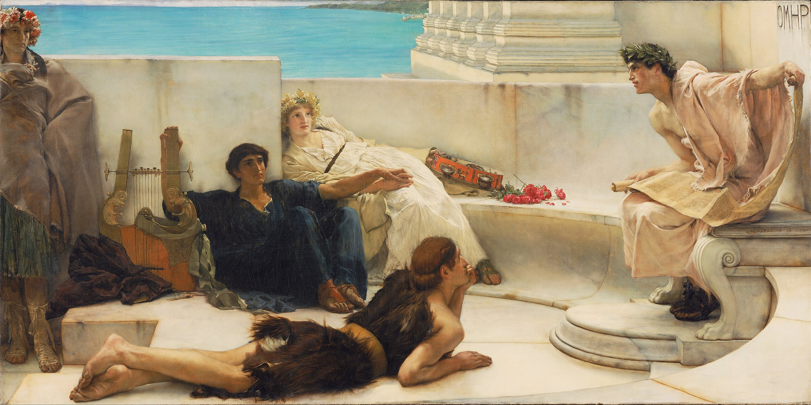
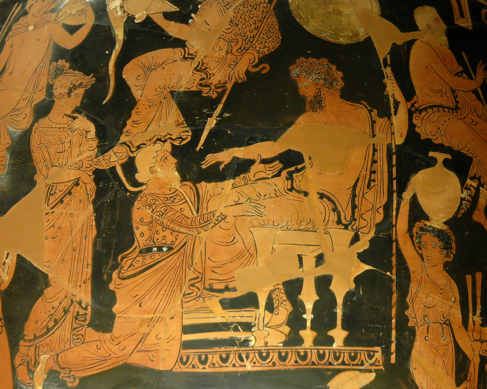
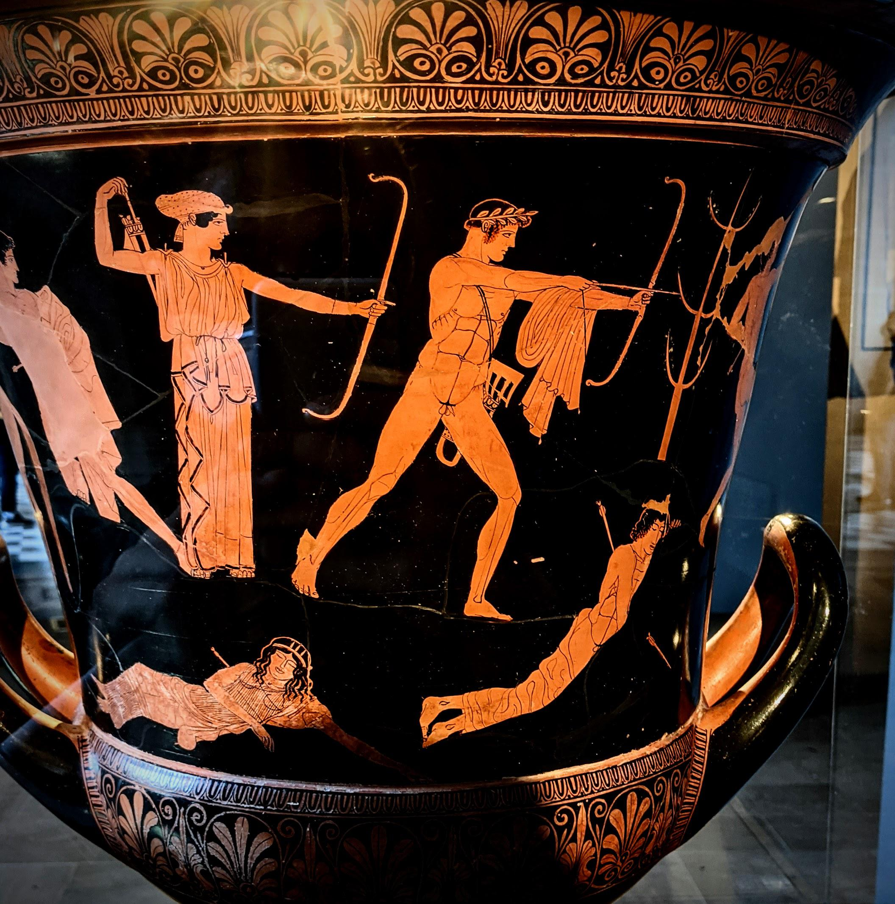
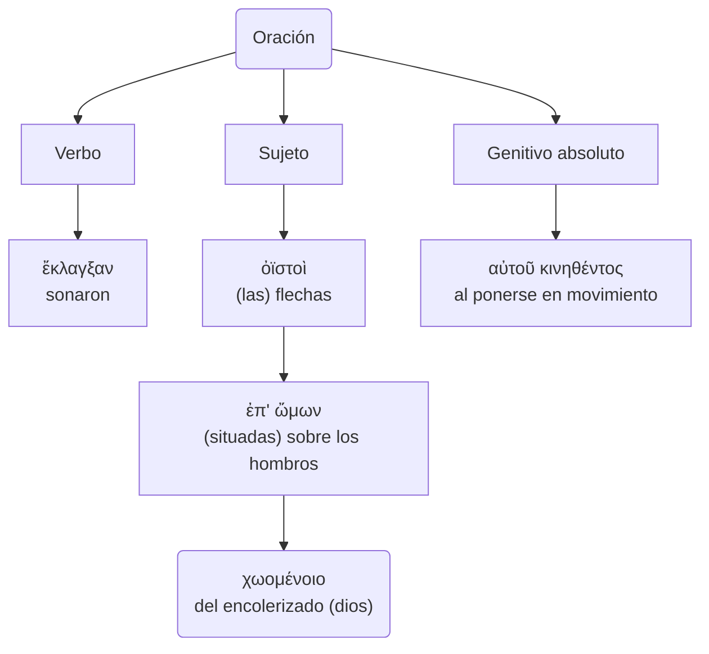
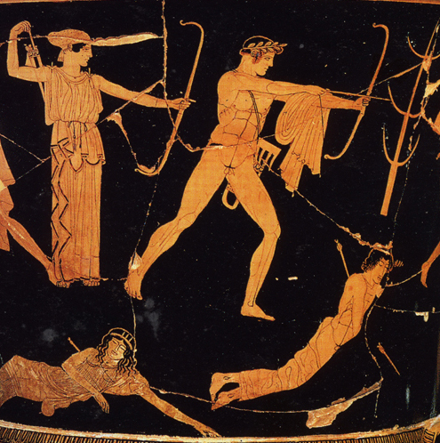
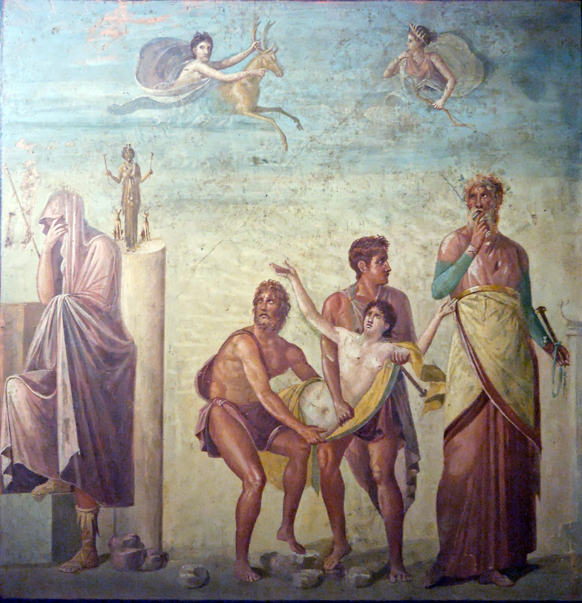
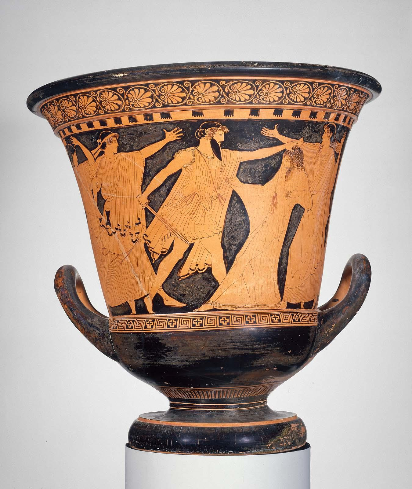
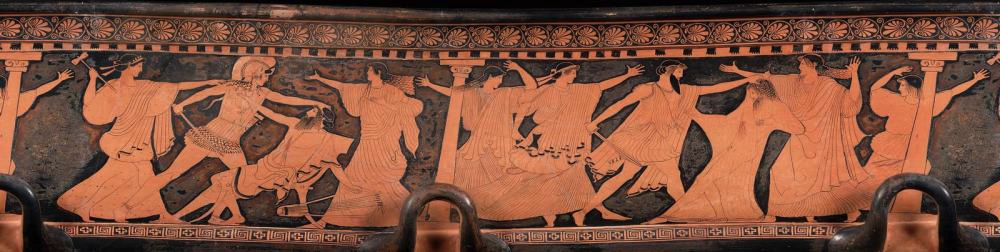

# Ilíada


---

## Ilíada.1.1-7: invocación a la musa


[Alma-Tadema, _A Reading from Homer_](https://en.wikipedia.org/wiki/File:Sir_Lawrence_Alma-Tadema,_English_(born_Netherlands)_-_A_Reading_from_Homer_-_Google_Art_Project.jpg)

(1) Μῆνιν ἄειδε θεὰ Πηληϊάδεω Ἀχιλῆος

(2) οὐλομένην, ἣ μυρί' Ἀχαιοῖς ἄλγε' ἔθηκε,

(3) πολλὰς δ' ἰφθίμους ψυχὰς Ἄϊδι προΐαψεν

(4) ἡρώων, αὐτοὺς δὲ ἑλώρια τεῦχε κύνεσσιν

(5) οἰωνοῖσί τε πᾶσι, Διὸς δ' ἐτελείετο βουλή,

(6) ἐξ οὗ δὴ τὰ πρῶτα διαστήτην ἐρίσαντε

(7) Ἀτρεΐδης τε ἄναξ ἀνδρῶν καὶ δῖος Ἀχιλλεύς.

??? note
    - (1) Adviértase cómo el primer verso enuncia la "cólera de Aquiles", tema principal de la Iliada. Originariamente la poesía épica era realmente cantada por los aedos (§ 2). La Musa canta por su boca.  
    - (1) θε**ά**: [ᾱ rasgo eolio](notas.md#b1-alfa-larga)  
    - (1) Πηληϊάδ**εω**: [genitivo](notas.md#g5) y [patronímico](notas.md#n1).  Πηληϊάδ**α-ο** > Πηληϊάδ**η-ο** > Πηληϊάδ**ε-ω**.  
    - (1) Ἀχιλ**ῆος**: [genitivo](notas.md#i9): Ἀχιλ**ῆ-u-ος** Ἀχιλ**ῆ-ος** > Ἀχιλ**έ-ως**.
    - (2) **οὐ**λ-ο-μένην: [alargamiento](notas.md#b7)  
    - (2) **οὐ**λομένην: part. aor. med. de ὄλ-λυ-μι, aquí con valor modal, "que ojalá perezca, que mal haya".  
    - (2) **ἄλγε'**: ἄλγ-ος > ἄλγ-ε-σ-α > ἄλγ-ε-α > ἄλγ-η
    - (4) **αυτούς**: "a ellos", a sus cuerpos en contraposición a sus almas.  
    - (3) προ**ΐ**αψεν: [aumento](notas.md#p)
    - (4) **ἑλώρια**: ἑλ-ώρια εἷλ-ον (ἑλ-) αἱρέω.
    - (4) κύν**εσσιν**: [dativo eolio](notas.md#i1)  
    - (5) Sobre el "plan de Zeus", ver vv. 517-530, y además § 11.  
    - (5) ἐτελε**ί**ετο: (i) [yod](notas.md#c6); (ii) imperfecto durativo.  
    - (6) **ἐξ οὗ**: La oración temporal debe hacerse depender del imperativo del verso 1 : "canta. Musa, la cólera de Aquiles [comenzando] desde que A. y A. se distanciaron (aor. intransitivo)...", es decir, en el repertorio épico tradicional el aedo selecciona su canto (§ 2e).  
    - (6) ἐρίσαντ-**ε**: [dual](notas.md#i18): ἔρις, ἔριδ-ος ἐρίδ-yω  
    - (6) ἐρίσαντ-**ε**: [dual](notas.md#i18): ἔρις, ἔριδ-ος ἐρίδ-yω  
    - (6) ἐρίσαντ-**ε**: [dual](notas.md#i18): ἔρις, ἔριδ-ος ἐρίδ-yω > ἐρίζω
    - (6) διαστή-**την**: [dual](notas.md#o42):ἀτ. δι-ε-στή-**την**. ἵστημι/ἵσταμαι > ἔ-στη-σα 'yo coloqué'/ἔ-στη-ν 'yo me coloqué/me levanté'.

---

## Ilíada.1.8-16: pregunta por el origen

|V|GRIEGO|
|:---:|---|
|8|Τίς τάρ σφωε θεῶν ἔριδι ξυνέηκε μάχεσθαι;|
|9|Λητοῦς καὶ Διὸς υἱός· ὃ γὰρ βασιλῆϊ χολωθεὶς|
|10|νοῦσον ἀνὰ στρατὸν ὄρσε κακήν, ὀλέκοντο δὲ λαοί,|
|11|οὕνεκα τὸν Χρύσην ἠτίμασεν ἀρητῆρα|
|12|Ἀτρεΐδης· ὃ γὰρ ἦλθε θοὰς ἐπὶ νῆας Ἀχαιῶν|
|13|λυσόμενός τε θύγατρα φέρων τ' ἀπερείσι' ἄποινα,|
|14|στέμματ' ἔχων ἐν χερσὶν ἑκηβόλου Ἀπόλλωνος|
|15|χρυσέῳ ἀνὰ σκήπτρῳ, καὶ λίσσετο πάντας Ἀχαιούς,|
|16|Ἀτρεΐδα δὲ μάλιστα δύω, κοσμήτορε λαῶν·|

NOTAS
  
- (8) Εn la concepción homérica del hombre, éste no es responsable de sus actos, especialmente si sus consecuencias no son las buscadas (Agamenón provoca sin querer la peste y la derrota; Aquiles, la muerte de su camarada íntimo Patroclo); de ahí que el aedo pregunte por la divinidad (o fuerza superior) causante de la disputa.  
- (8) **σφωε**: [dual](notas.md#i18)
- (8)  **ξυν-έ-ηκε**:
- (9) **ὅ**: Apolo.  
- (9) βασιλ**ῆ**-**ϊ**: [dativo](notas.md#i9); nótese βασιλεύς = ἄναξ del ν. 7.  
- (10) **νοῦσον**: [alargamiento](notas.md#b7)  
- (10) **ὄρσε**/**ὦρσε**: [ὄρνυμι](notas.md#o11), [temas](verbo#93-ὄρνυμι)  
- (11) **οὕνεκα**: [crasis](notas.md#b13)
- (11) **ἠτίμασεν**: τιμή 'precio/honor' > ἄ-τιμ-ος 'vil/deshonrado' > ἀ-τιμ-άζω 'deshonrar'.
- (12) **ὅ**: Crises ;  
- (12) **θοάς**: adjetivación ornamental, pues la rapidez de las naves no importa al sentido de este pasaje, en el que están varadas en la costa (§ 20).  
- (12) **νῆας**: [ναῦς](notas.md#i10)  
- (13) **λυσόμενός**: -part. ~~fut. con valor desiderativo~~; participio con valor futuro 'para (intentar) liberar'.  
- (13) **θύγατρα**: [tercera declinación](notas.md#i7)  
- (13) ἀπερ**εί**σι': [alargamiento métrico](notas.md#b7)  
- (14) **στέμματα**: guirnalda de laurel que coronaba el bastón (símbolo de dignidad) del sacerdote de Apolo.  
- (15) **ἀνά**: con dat. loc. "en lo alto de".  
- (15) **λίσσετο**: el imperfecto durativo marca la insistencia de la súplica, "estuvo suplicando".  
- (16) **Ἀτρεΐδᾱ**: [dual](notas.md#g9)  
- (16) κοσμήτορ**ε**: [dual](notas.md#i18)  
- (16) **λαῶν**: [alargamiento](notas.md#b1)  
  
---

## Ilíada 1.17-21: súplicas de Crises



[Chryses attempting to ransom his daughter Chryseis from Agamemnon. Side A of an Apulian red-figure volute-crater, ca. 360 BC–350 BC, found in Taranto.](https://commons.wikimedia.org/wiki/File:Chryses_Agamemnon_Louvre_K1.jpg)

|V|GRIEGO|
|:---:|---|
|17|«Ἀτρεΐδαι τε καὶ ἄλλοι ἐϋκνήμιδες Ἀχαιοί,|
|18| ὑμῖν μὲν θεοὶ δοῖεν Ὀλύμπια δώματ' ἔχοντες|
|19| ἐκπέρσαι Πριάμοιο πόλιν, εὖ δ' οἴκαδ' ἱκέσθαι·|
|20| παῖδα δ' ἐμοὶ λύσαιτε φίλην, τὰ δ' ἄποινα δέχεσθαι,|
|21| ἁζόμενοι Διὸς υἱὸν ἑκηβόλον Ἀπόλλωνα.»|

NOTAS
  
- (18) δο-**ῖ**-εν: [optativo desiderativo](notas.md#t5): 'Ojalá os concedan los dioses ...'.  
- (18) **Ὀλύμπια δώματ'**: el palacio de Zeus en el monte Olimpo.  
- (19) **ἐκ**-πέρσαι: el preverbio, que indica la realización total de la acción, alude a la victoria completa; es curioso que en la lengua homérica
sólo existen términos para designar victorias parciales.  
- (20) δέχε-**σθαι**: [infinitivo pro imperativo](notas.md#t14).  
- (20) λύσα-**ι**-τε: [optativo desiderativo](notas.md#t5): '¡ojalá liberéis!' (deseo) > '¡liberad, por favor!' (petición).  

---

## Ilíada 1.22-25: reacción de Agamenón

|V|GRIEGO|
|:---:|---|
|22| Ἔνθ' ἄλλοι μὲν πάντες ἐπευφήμησαν Ἀχαιοὶ|
|23| αἰδεῖσθαί θ' ἱερῆα καὶ ἀγλαὰ δέχθαι ἄποινα·|
|24| ἀλλ' οὐκ Ἀτρεΐδῃ Ἀγαμέμνονι ἥνδανε θυμῷ,|
|25| ἀλλὰ κακῶς ἀφίει, κρατερὸν δ' ἐπὶ μῦθον ἔτελλε·|

NOTAS
  
- (23) ἱερ**ῆ**-**α**: [acusativo de tema en -εύς](notas.md#i9)  
- (23) **δέχθαι**: δέχ-σθαι > δέχ-θαι; antiguo aoristo atemático de [δέχομαι](notas.md#o13); frente al temático de presente δέχ-ε-σθαι  
- (24) **θυμῷ**: [dativo r2d](notas.md#r2).  
- (25) **ἐπὶ ... ἔτελλε**: tmesis: separación del preverbio = ἐπ-έτελλε (ἐπιτέλλω)  

---

## Ilíada 1.26-32: discursos de Agamenón

|V|GRIEGO|
|:---:|---|
|26| «μή σε, γέρον, κοίλῃσιν ἐγὼ παρὰ νηυσὶ κιχείω|
|27| ἢ νῦν δηθύνοντ' ἢ ὕστερον αὖτις ἰόντα,|
|28| μή νύ τοι οὐ χραίσμῃ σκῆπτρον καὶ στέμμα θεοῖο·|
|29| τὴν δ' ἐγὼ οὐ λύσω· πρίν μιν καὶ γῆρας ἔπεισιν|
|30| ἡμετέρῳ ἐνὶ οἴκῳ ἐν Ἄργεϊ τηλόθι πάτρης|
|31| ἱστὸν ἐποιχομένην καὶ ἐμὸν λέχος ἀντιόωσαν·|
|32| ἀλλ' ἴθι μή μ' ἐρέθιζε σαώτερος ὥς κε νέηαι.»|

NOTAS
  
- (26) **νηυσὶ**: [ναῦς](notas.md#i10).  
- (26) **μή σε κιχείω**: '(procura) que no te pille', '(haz todo lo posible) no sea que te pille'.  
- (26) **Μή... κιχήω**: ~~subj. voluntativo~~.  
- (28) **μή . . . οὐ χραίσμῃ**: equivale a oración dependiente de verbo de temor, "no sea (μή) que no (οὐ)...".  
- (29) **τὴν**: Criseida, la hija de Crises.  
- (29) **πρἰν**: adverbio.  
- (29) **ἔπεισιν**: con valor de futuro (sujeto "la vejez"), "le sobrevendrá".  
- (31) **ἐποιχομένην καὶ ... ἀντιόωσαν**: los participios condertan con μιν.  
- (31) **λέχος**: en acusativo (en lugar del genitivo que se esperaría con ἀντιόωσαν), por cierta tendencia de los neutros a no declinarse.  
- (31) **ἀντιόωσαν**: [vocalismo](notas.md#b12): ἀντιά-ω ἀντι**ά**-**ου**σα >  ἀντι**ό**-**ω**σα/ἀντι**ῶ**σα
- (32) **κε**: [finales](notas.md#u5).  
- (32) **ὥς κε νέηαι**: νέομαι 'regresar' subj. **etim.** νέ-η-σαι > **Hom.** νέ-η-αι (sin contraer) > **át.** νέ-ῃ. (contracción)
  
---

## Ilíada 1.33-42: Crises se marcha y suplica a Apolo

|V|GRIEGO|
|:---:|---|
|33|Ὣς ἔφατ', ἔδεισεν δ' ὃ γέρων καὶ ἐπείθετο μύθῳ·|
|34|βῆ δ' ἀκέων παρὰ θῖνα πολυφλοίσβοιο θαλάσσης·|
|35|πολλὰ δ' ἔπειτ' ἀπάνευθε κιὼν ἠρᾶθ' ὃ γεραιὸς|
|36|Ἀπόλλωνι ἄνακτι, τὸν ἠΰκομος τέκε Λητώ·|
|37|«κλῦθί μευ ἀργυρότοξ', ὃς Χρύσην ἀμφιβέβηκας|
|38|Κίλλάν τε ζαθέην Τενέδοιό τε ἶφι ἀνάσσεις,|
|39|Σμινθεῦ εἴ ποτέ τοι χαρίεντ' ἐπὶ νηὸν ἔρεψα,|
|40|ἢ εἰ δή ποτέ τοι κατὰ πίονα μηρί' ἔκηα|
|41|ταύρων ἠδ' αἰγῶν, τὸ δέ μοι κρήηνον ἐέλδωρ·|
|42|τίσειαν Δαναοὶ ἐμὰ δάκρυα σοῖσι βέλεσσιν.»|

??? note

    ``` mermaid
    graph TB
    
    A0("Oración compuesta<br>ἀμφιβέβηκας Χρύσην Κίλλάν τε1 ζαθέην Τενέδοιό τε2 ἶφι ἀνάσσεις")
    A0-->A1("ἀμφιβέβηκας<br>proteges")
    A1-->A11("Χρύσην<br>Crisa")
    A1-->|"τε1"|A12("Κίλλάν τε1 ζαθέην<br>y la muy divina Cila")
    A0-->|"τε2"|A2("Τενέδοιό τε2 ἶφι ἀνάσσεις<br>y gobiernas con fuerza Ténedo")
    
    ```

    ``` mermaid
    graph TB
    
    A0("Oración compleja")
    A0-->A1("Subordinadas condicionales")
    A1-->A11("εἴ ... ἔρεψα,<br>si")
    A11-->A111("ποτέ<br>alguna vez")
    A11-->A112("τοι<br>para ti")
    A11-->A113("χαρίεντ' ... νηὸν<br>(un) grato templo")
    A11-->A114("ἐπὶ ... ἔρεψα<br>cubrí")
    A1-->A12("ἢ εἰ ... αἰγῶν<br>o si")
    A12-->A121("ποτέ<br>alguna vez")
    A12-->A122("τοι<br>para ti")
    A12-->A123("πίονα μηρί' ... ταύρων ἠδ' αἰγῶν<br>grasientos muslos de toros y cabras")
    A12-->A124("κατὰ ... ἔκηα<br>quemé")

    A0-->|"δέ"|A2("Oración principal")-->A21("τὸ δέ μοι κρήηνον ἐέλδωρ")
    A21-->A211("τὸ δέ<br>esto")
    A21-->A212("μοι<br>a mí")
    A21-->A213("κρήηνον<br>llévame a cabo")
    A21-->A214("ἐέλδωρ<br>como un deseo")
    
    ```
        
    NOTAS
    
    - (33) **ἔφατ'**: [φημί](notas.md#o7 ). 
    - **ἔδεισεν**: aoristo ingresivo, "le entró miedo".  
    - **ἐπείθετο μύθῳ**: 'obedecía a su orden'. πείθω: (a) act. A (nom.) πείθει B (ac.) 'A convence a B'; (b) media: B (nom.) πείθεται A (dat.) 'B obedece/cree a A'.
    - (35) **πολλὰ**: acusativo adverbial 'mucho', ático πολύ.
    - **κιὼν**: [aoristos radicales temáticos](notas.md#o20)  
    - (36) **τὸν**: uso 'relativo' del artículo.
    - **ἠΰκομος**: [ἐΰς/ἠΰς](notas.md#b2): 'de hermosa (εὐ) cabellera (κόμη)'.
    - **τέκε**: (ἔ-)τέκ-ε (sin aumento) de ἔ-τεκ-ον: aoristo radical temático de τί-κτω (τί-τκ-ω).
    - (37) **κλῦθί**: [aoristos radicales atemáticos](notas.md#o19)  
    - **μευ**: με(ι)ο > jon. μευ/át. μου [pronombres personales](notas.md#l1)  
    - **Χρύσην**: f., nombre de ciudad (no confundir con el nombre del sacerdote).  
    - **ἀμφι**βέβηκας: perfecto (que indica el estado resultante) de βαίνω, "doy pasos", literalmente, "estás con un paso dado (con las piernas abiertas) a uno y otro lado (ἀμφι-) de Crise" = "proteges a Crise".  
    - (38) **ζαθέην**: [yod secundaria](notas.md#c7)  
    - **ἶφι**: [-φι](notas.md#j1) 
    - **ἀνάσσεις**: ἄναξ, ἄνακτ-ος ἄνα**κτ-y**ω > ἀνά**σσ**εις
    - (39) La plegaria comienza recordando al dios los servicios que le ha prestado Crises ; xap. : predicado, "con agrado tuyo" ; se refiere evidentemente a un tipo de templo muy primitivo, un mero techo para proteger la imagen del dios, colocada en una gruta (Leaf); los templos surgen en Grecia en época post-micénica y son raros en Homero (ver νηός; en el glosario).  
    - (39) **νηὸν**: ν**ᾱ**ός > jón-át. ν**η**ός > át. ν**εώ**ς (metátesis de cantidad) [νηός/νεώς](notas.md#h3); [declinación ática](https://pajaro1966.github.io/Paradigmas_Griegos/paradigmsNouns.html#par17)  
    - (40) **μηρί'(μηρία)**: los huesos de los muslos con la carne que queda adherida, recubiertos con grasa (por eso son **πίονα** "grasientos").  
    - **κατὰ ... ἔκηα**: κατα-καίω 'quemar del todo' [aoristos sigmáticos](notas.md#o24)  κα**υ**-**y**ω κα**ί**ω, ἔ-καυ-σα > ἔ-κη-α.
    - **ἠδ'**: [conjunciones](notas.md#m3)  
    - (41) **κρήηνον**: [κρᾱαίνω](notas.md#o18): κρᾱα**ν**-**y**ω > κραα**ίν**ω; κρᾱα**ν**-**σ**ον > κρᾱα**ν**-**σ**ον > κρᾱ**ᾱν**-ον (alargamiento compensatorio) > κρή**η**νον (alfa larga a eta).
    - **δέ**: apodótico: aparece en principales, tras subordinadas que las anteceden, para marcar su inicio: 'si ..., entonces ...'.  
    - **ἐέλδωρ**: [prótesis vocálica](notas.md#b16)  
    - (42) τί**σειαν**: [optativo desiderativo sin partícula](notas.md#t5): τίνω, τίν-σαι-εν > τίν-**σειαν**.  
    - **βέλεσσιν**: β**α**λ-yω > βαλλω, β**ο**λ-ή, β**έ**λος/βέλεσ-σιν > βέλε**σ**-**σ**ιν > βέλε**σ**ιν  

---

## Ilíada 1.43-56: Apolo lanza la peste contra los aqueos

  

|V|GRIEGO|
|:---:|---|
|43|Ὣς ἔφατ' εὐχόμενος, τοῦ δ' ἔκλυε Φοῖβος Ἀπόλλων,|
|44|βῆ δὲ κατ' Οὐλύμποιο καρήνων χωόμενος κῆρ,|
|45|τόξ' ὤμοισιν ἔχων ἀμφηρεφέα τε φαρέτρην·|
|46|ἔκλαγξαν δ' ἄρ' ὀϊστοὶ ἐπ' ὤμων χωομένοιο,|
|47|αὐτοῦ κινηθέντος· ὃ δ' ἤϊε νυκτὶ ἐοικώς.|
|48|ἕζετ' ἔπειτ' ἀπάνευθε νεῶν, μετὰ δ' ἰὸν ἕηκε·|
|49|δεινὴ δὲ κλαγγὴ γένετ' ἀργυρέοιο βιοῖο·|
|50|οὐρῆας μὲν πρῶτον ἐπῴχετο καὶ κύνας ἀργούς,|
|51|αὐτὰρ ἔπειτ' αὐτοῖσι βέλος ἐχεπευκὲς ἐφιεὶς|
|52|βάλλ'· αἰεὶ δὲ πυραὶ νεκύων καίοντο θαμειαί.|
|53|Ἐννῆμαρ μὲν ἀνὰ στρατὸν ᾤχετο κῆλα θεοῖο,|
|54|τῇ δεκάτῃ δ' ἀγορὴν δὲ καλέσσατο λαὸν Ἀχιλλεύς·|
|55|τῷ γὰρ ἐπὶ φρεσὶ θῆκε θεὰ λευκώλενος Ἥρη·|
|56|κήδετο γὰρ Δαναῶν, ὅτι ῥα θνήσκοντας ὁρᾶτο.|

NOTAS
  
- (43) **ἔφατ'**: [φημί](notas.md#o7)  
- (44) **Οὐλύμποιο**: [alargamiento métrico](notas.md#b7)
- **κατ' Οὐλύμποιο καρήνων**:  'desde (lo alto de) las cimas del Olimpo'.
- **κῆρ**: acus. de relación o de parte, "en su corazón": (a) act. 'A encoleriza a B (ac. todo) su corazón C (ac. parte)'; (b) pas. 'B es/está encolerizado en C (ac. parte)'
- (45) **τόξ'(α)**: el arco (plural poético).
- **ἀμφηρεφέα**:  el carcaj 'con tapadera (ἐρέφω 'cubrir') por ambas partes (ἀμφι-)': ἐρέφω > ἀμφ-**η**ρεφ-ής, ές, ac. ἀμφ-ηρεφ-έσ-α > ἀμφ-ηρεφ-**έ**-**α** > át. ἀμφ-ηρεφ-**ῆ**.
- **ὤμοισιν**: [dativo](notas.md#r2)  
- (46) **ἄρ'**: [partículas](notas.md#m3).  
- (46) χωομέν**οιο**: se refiere a Apolo: (a) «sonaban las flechas sobre los hombros (de Apolo) (Ἀπόλλων-**ος**), que estaba encolerizado (χωομέν-**οιο**)»; (b) 'del encolerizado (dios)'.  
- (47) **αὐτοῦ κινηθέντος**: puede ser aposición al posesivo («de él, que se estaba moviendo») o genitivo absoluto ('al moverse').  
- (47) **ἤϊε**: [εἶμι](notas.md#o2)  
- **νεῶν**: [ναῦς](notas.md#i10)  
- **νυκτὶ ἐοικώς**: «igual a la noche» porque estaba como negro de ira. ϝείκ-ω > εἴκω, ϝέ-ϝοικ-α > ἔοικ-α 'parecer(se)'.
- (48) **μετὰ ... ἕηκε**: [tmesis](notas.md#) [ἵημι](notas.md#o6); [temas](verbo.md#60-ἵημι)
- (49) **ἀργυρέοιο βιοῖο**: genitivo de origen sin preposición.
- (50) **οὐρῆας**: [alargamiento métrico](notas.md#b7): **ὀ**ρεύς > Ion. **οὐ**ρεύς, [-ευς](notas.md#i9): ὀρ**ῆ**(ϝ)-**ᾰ** > ὀρ**ῆ**-**ᾰ** > ὀρ**έ**-**ᾱ**.
- (51) **αὐτοῖσι**: a los hombres, en contraste con los mulos y perros.  
- **ἐφιεὶς**: ἐφ-(σ)ι-(σ)ε-ντ-ς > ἐφ-(σ)ι-(σ)**ει**-ς
- **ἐχεπευκές**: el adjetivo (sólo en este verso y en IV 129) es un compuesto con primer elemento verbal ἐχε- y *πεῦκος, tema en -s no atestiguado, pero evidentemente relacionado con πεύκη "pino"; propiamente describía una flecha con vastago de pino (y punta de bronce, ver ὀϊστός en el glosario); se trata de un singular colectivo, pues Apolo no lanzó sólo una flecha.  
- (52) **βάλλ'(ε)**: imperfecto durativo; [βάλλω](verbo.md#24-βάλλω): (a) 'βάλλω A (nom) lanza B (ac.) a C (dat.)'; (b) 'βάλλω A (nom) alcanzar C (ac.) a B (dat.)'.
- **αἰεὶ**: 'contiuamente'.
- **καίοντο**: (ἐ)καί-ο-ντο (a) act. 'A (nom.) quema (καί-ει) B (ac.)'; (b) 'B (nom.) arde  (καί-ε-ται)'. Sobre la incineración de cadáveres ver §9c.
- (53) **Ἐννῆμαρ**: [neutros en -r-/-t-](notas.md#i6)  
- (54) **τῇ δεκάτῃ**: aunque en el verso anterior el aedo ha usado el neutro ἦμαρ, que es arcaísmo, aquí está pensando en ἡμέρη, que es la forma usual en jonio; como se ve, la asamblea podía ser convocada no sólo por el soberano, sino por uno de los γέροντες (ver glosario).
- **ἀγορὴν δὲ**: = ἀγορήν-δε adv. de dirección 'llamó a asamblea'.
- **καλέσσατο**: [Αlternancia σ/σσ](notas.md#e1); [καλέω](Verbos/kalew.png): se trata de una doble sigma analógica con los verbos que sí la tienen etimológicamente: τέλος, ους τελέσ-yω ἐ-τέλε**σ**-**σ**α > át. ἐ-τέλε**σ**α.  
- (55) **θεὰ λευκώλενος Ἥρη**: otra vez una divinidad es la causa de un acto humano.
- (56) **ῥα**: [conjunciones](notas.md#m3)  



  

---

## Ilíada 1.57-67: los aqueos se reúnen y Aquiles propone consultar a un adivino

|V|GRIEGO|
|:---:|---|
|57|οἳ δ' ἐπεὶ οὖν ἤγερθεν ὁμηγερέες τε γένοντο,|
|58|τοῖσι δ' ἀνιστάμενος μετέφη πόδας ὠκὺς Ἀχιλλεύς·|
|59|«Ἀτρεΐδη, νῦν ἄμμε παλιμπλαγχθέντας ὀΐω|
|60|ἂψ ἀπονοστήσειν, εἴ κεν θάνατόν γε φύγοιμεν,|
|61|εἰ δὴ ὁμοῦ πόλεμός τε δαμᾷ καὶ λοιμὸς Ἀχαιούς·|
|62|ἀλλ' ἄγε δή τινα μάντιν ἐρείομεν ἢ ἱερῆα|
|63|ἢ καὶ ὀνειροπόλον, καὶ γάρ τ' ὄναρ ἐκ Διός ἐστιν,|
|64|ὅς κ' εἴποι ὅ τι τόσσον ἐχώσατο Φοῖβος Ἀπόλλων,|
|65|εἴ ταρ ὅ γ' εὐχωλῆς ἐπιμέμφεται ἠδ' ἑκατόμβης,|
|66|αἴ κέν πως ἀρνῶν κνίσης αἰγῶν τε τελείων|
|67|βούλεται ἀντιάσας ἡμῖν ἀπὸ λοιγὸν ἀμῦναι.|

NOTAS

- (57) ἤγερθ**εν**: [desinencias personales](notas.md#o41): ἤγερθ**εν**/ἤγερ-**θησαν**
- **ὁμηγερέες**:  ὁμ-ηγερ-έες
- (58) **τοῖσι**: [dativo](notas.md#r2)  
- (58) **δ'**: [partículas apodóticas](notas.md#v1)  
- (59) **Ἀτρεΐδη**: [nominativo masculino η](notas.md#g3)  
- (60) **κεν**: [condicionales y concesivas](notas.md#u7)  
- (61) **δαμᾷ**: [futuro](notas.md#o27); [δάμνημι](verbo.md#35-δάμνημι)  
- (62) **ἐρείομεν**: [subjuntivo](notas.md#o39)  
- (62) **ἱερῆα**: [sustantivos en -ευς](notas.md#i9)  
- (63) **ὄναρ**: el sueño es enviado por Zeus, y, por lo tanto, el intérprete de sueños profetiza (habla προ- "en lugar de").  
- (63) **τ'**: [τε](notas.md#m4)  
- (65) **ἑκατόμβης**: [genitivo](notas.md#r1).  
- (66) **αἴ κέν πως**: 'por si de alguna manera': condicional final. En ático se construyen con ἐάν+subjuntivo (verbo principal en presente o futuro) y εἰ + optativo (verbo principal en pasado).  
- (66) **κνίση**: es el olor de la grasa quemada en los sacrificios, del que participan (ἀντιάω v. 67) los dioses.  
- (66) **τελείων**: adjetivo que se aplica a las víctimas "impecables" y aptas para el sacrificio (las prescripciones rituales podían referirse a la especie animal, al sexo, al color de la piel, a su integridad física, etc.).  
- (65-67) **εἴ ... ἠδ' ...**: (≈ εἴτε ... εἴτε ...): interrogativa indirecta; acaso se ha cometido alguna falta ritual en una oración o en un sacrificio.  
- (68) τοῖσι: [dativo](notas.md#r2)  

---

## Ilíada 1.68-83: interviene el adivino Calcante



[Museo Arqueológico de Nápoles: Casa del Poeta trágico, Pompeii (VI, 8, 3.5): _Calcante y el sacrificio de Ifigenia_](https://commons.wikimedia.org/wiki/File:Fresco_Iphigeneia_MAN_Naples.jpg)

|V|GRIEGO|
|:---:|---|
|68|corr. Ἤτοι ὅ γ' ὣς εἰπὼν κατ' ἄρ' ἕζετο· τοῖσι δ' ἀνέστη|
|69|Κάλχας Θεστορίδης οἰωνοπόλων ὄχ' ἄριστος,|
|70|ὃς ᾔδη τά τ' ἐόντα τά τ' ἐσσόμενα πρό τ' ἐόντα,|
|71|καὶ νήεσσ' ἡγήσατ' Ἀχαιῶν Ἴλιον εἴσω|
|72|ἣν διὰ μαντοσύνην, τήν οἱ πόρε Φοῖβος Ἀπόλλων·|
|73|ὅ σφιν ἐὺ φρονέων ἀγορήσατο καὶ μετέειπεν·|
|74|«ὦ Ἀχιλεῦ κέλεαί με Διῒ φίλε μυθήσασθαι|
|75|μῆνιν Ἀπόλλωνος ἑκατηβελέταο ἄνακτος·|
|76|τοὶ γὰρ ἐγὼν ἐρέω· σὺ δὲ σύνθεο καί μοι ὄμοσσον|
|77|ἦ μέν μοι πρόφρων ἔπεσιν καὶ χερσὶν ἀρήξειν·|
|78|ἦ γὰρ ὀΐομαι ἄνδρα χολωσέμεν, ὃς μέγα πάντων|
|79|Ἀργείων κρατέει καί οἱ πείθονται Ἀχαιοί·|
|80|κρείσσων γὰρ βασιλεὺς ὅτε χώσεται ἀνδρὶ χέρηϊ·|
|81|εἴ περ γάρ τε χόλον γε καὶ αὐτῆμαρ καταπέψῃ,|
|82|ἀλλά τε καὶ μετόπισθεν ἔχει κότον, ὄφρα τελέσσῃ,|
|83|ἐν στήθεσσιν ἑοῖσι· σὺ δὲ φράσαι εἴ με σαώσεις».|

NOTAS
  
- (69) **ὄχ'**: [-α](notas.md#j10)  
- (70) **ἐόντα**: [εἰμί](notas.md#o5)  
- (71) **νήεσσ'**: [ναῦς](notas.md#i10); νήεσσι: regido por ἡγήσατ';  
- (71) **εἴσω**: adv. "adentro", completa el sentido del acusativo precedente.  
- (71) **Ἴλιον**: [acusativo](notas.md#r3)  
- (72) **ἣν**: [posesivos](notas.md#l2)  
- (72) **τήν**: [ὁ, ἡ, τό](notas.md#l4)  
- (73) **ὅ**: [ὁ, ἡ, τό](notas.md#l4): Calcante.  
- (73) **σφιν**: [pronombres personales](notas.md#l1)  
- (73) **μετέειπεν**: [aoristos temáticos reduplicados](notas.md#o21)  
- (74) **μυθήσασθαι**: "explicar".  
- (74) **ἦ μέν**: combinación de partículas fuertemente afirmativa después de verbo de "jurar" (ático ἦ μήν).  
- **κέλεαί**: κέλε(ϝ)ε-σαί  
- (76) **τοὶ**: [pronombres personales](notas.md#l1)  
- (76) **ἐγὼν**: [pronombres personales](notas.md#l1)  
- (77-78) **ἦ**: partícula empleada en aseveraciones enfáticas, como p.ej. juramentos.  
- (78) χολωσ-**έμεν**: [infinitivo](notas.md#o40)  
- (78) **μέγα**: acus. adv.  
- (78-79) **ὃς** (Agamenón) μέγα πάντων / Ἀργείων κρατέει **καί** **οἱ** (Agamenón) πείθονται Ἀχαιοί: nótese cómo la oración subordinada relativa se interrumpe y da paso a una independiente, por relajación de la tensión necesaria para sostener la subordinación a cierta distancia del pronombre que la introduce.  
  - A.R.: es un caso parecido al español 'que su': «vino Pedro, el chico **que** (el chico) vimos ayer y **que su**  (el chico) padre trabaja en un banco»  
- (79) **οἱ**: [pronombres personales](notas.md#l1)  
- (80) **ὅτε χώσεται**: Oración temporal eventual universal sin necesidad de partícula modal.  
- (80) χώσ**εται**: [subjuntivo](notas.md#o39)  
- (80) **χέρηϊ**: [comparativos](notas.md#k2)  
- (81) **εἴ**: [condicionales y concesivas](notas.md#u7)  
- (81) **τε**: [partículas apodóticas](notas.md#v1); [τε](grammar#grammar/τε.md)  
- (81) **χόλος**: propiamente "hiél" (complemento directo de "digerir"); en sentido figurado, "ira", "cólera" momentánea y pasajera, en oposición a κότος "rencor".  
- (81) **αὐτῆμαρ**: [neutros en -r-/-t-](notas.md#i6).  
- (82) **ὄφρα**: [temporales](notas.md#u4).  
- (82) **ἑοῖσι**: [posesivos](notas.md#l2).  
- (82) **ὄφρα τελέσσῃ**: entiéndase, "hasta que satisfaga su rencor".  
- (83)**στήθεσσιν**: στῆθος ους (στήθ**ο**σ-/στήθ**ε**σ-), στήθε**σ**-**σ**ιν > στήθε**σ**ιν.  

---

## Ilíada 1.84-91: réplica de Aquiles

|V|GRIEGO|
|:---:|---|
|84|Τὸν δ' ἀπαμειβόμενος προσέφη πόδας ὠκὺς Ἀχιλλεύς·|
|85|«θαρσήσας μάλα εἰπὲ θεοπρόπιον ὅ τι οἶσθα·|
|86|οὐ μὰ γὰρ Ἀπόλλωνα Διῒ φίλον, ᾧ τε σὺ Κάλχαν|
|87|εὐχόμενος Δαναοῖσι θεοπροπίας ἀναφαίνεις,|
|88|οὔ τις ἐμεῦ ζῶντος καὶ ἐπὶ χθονὶ δερκομένοιο|
|89|σοὶ κοίλῃς παρὰ νηυσὶ βαρείας χεῖρας ἐποίσει|
|90|συμπάντων Δαναῶν, οὐδ' ἢν Ἀγαμέμνονα εἴπῃς,|
|91|ὃς νῦν πολλὸν ἄριστος Ἀχαιῶν εὔχεται εἶναι.»|

NOTAS
  
- (84) **τὸν**: regido por el preverbio de **προσ**-έφη.  
- (85) **μάλα**: va con el participio.  
- (85) **ὅ τι**: [relativas](notas.md#u1)  
- (86) **οὐ**: negación recogida en el v. 88;  
- (86) **ᾧ τε**: [relativas](notas.md#u1); dat. regido por εὐχόμενος.  
- (88) **ἐμεῦ**: [pronombres personales](notas.md#l1)  
- (88) **δερκομένοιο**: "teniendo los ojos abiertos".  
- (89) **βαρείας**: predicado, "con todo su peso".  
- (90) **συμπάντων Δαναῶν**: gen. partitivo dependiente de τις (ν. 88).  
- (91) **πολλὸν**: [πολύς](notas.md#k1)  
- (91) **εΰχεται**: "se jacta"; no implica fanfarronería, sino meramente una conciencia ingenua de su posición; la falsa modestia es desconocida de los héroes homéricos (Leaf; cf. § 21).  

---

## Ilíada 1.92-100: Calcante explica el origen de la peste

|V|GRIEGO|
|:---:|---|
|92|Καὶ τότε δὴ θάρσησε καὶ ηὔδα μάντις ἀμύμων·|
|93|«οὔ ταρ ὅ γ' εὐχωλῆς ἐπιμέμφεται οὐδ' ἑκατόμβης,|
|94|ἀλλ' ἕνεκ' ἀρητῆρος ὃν ἠτίμησ' Ἀγαμέμνων,|
|95|οὐδ' ἀπέλυσε θύγατρα καὶ οὐκ ἀπεδέξατ' ἄποινα,|
|96|τοὔνεκ' ἄρ' ἄλγε' ἔδωκεν ἑκηβόλος ἠδ' ἔτι δώσει·|
|97|οὐδ' ὅ γε πρὶν Δαναοῖσιν ἀεικέα λοιγὸν ἀπώσει|
|98|πρίν γ' ἀπὸ πατρὶ φίλῳ δόμεναι ἑλικώπιδα κούρην|
|99|ἀπριάτην ἀνάποινον, ἄγειν θ' ἱερὴν ἑκατόμβην|
|100|ἐς Χρύσην· τότε κέν μιν ἱλασσάμενοι πεπίθοιμεν.»|

NOTAS
  
- (94)  ἀτιμάω
- (95) **θύγατρα**: [nombres de parentesco en -ρ](notas.md#i7)  
- (95) Nótese la interrupción de la subordinación (cf. v. 79).  
- (96) **τοὔνεκ'**: [crasis](notas.md#b13)  
- (96) **ἄρα**: "como es natural".  
- (96) **ἠδ'**: [conjunciones](notas.md#m3)  
- (97) **ὁ**: Apolo.  
- (97) **πρίν**: adv., anticipando la oración temporal del verso siguiente.  
- (97) **Δαναοῖσιν**: dat. commodi.  
- (98) κ**ού**ρην: [alargamiento por caída de wau](notas.md#c3)  
- (98) **ἀπο ... δόμεναι**: el preverbio indica que lo que se da es debido, "devolver"; tmesis: ἀποδίδωμι.  
- (98) ἑλικῶπις κ . : "muchacha de ojos negros", según los comentaristas antiguos y, modernamente, Page (pero no "que mueve o gira los ojos"), cf. XXIII 166.  
- (100) **πεπίθοιμεν**: [aoristos radicales temáticos](notas.md#o20); aor. tem. reduplicado con sentido factitivo, "entonces... podríamos hacerle atendemos (en nuestras súplicas)".  
- (100) **μιν**: Apolo.  

---

## Ilíada 1.101-120: intervención de Agamenón: pide una compensación por la entrega de Criseida

|V|GRIEGO|
|:---:|---|
|101|Ἤτοι ὅ γ' ὣς εἰπὼν κατ' ἄρ' ἕζετο· τοῖσι δ' ἀνέστη|
|102|ἥρως Ἀτρεΐδης εὐρὺ κρείων Ἀγαμέμνων|
|103|ἀχνύμενος· μένεος δὲ μέγα φρένες ἀμφιμέλαιναι|
|104|πίμπλαντ', ὄσσε δέ οἱ πυρὶ λαμπετόωντι ἐΐκτην·|
|105|Κάλχαντα πρώτιστα κάκ' ὀσσόμενος προσέειπε·|
|106|«μάντι κακῶν οὐ πώ ποτέ μοι τὸ κρήγυον εἶπας·|
|107|αἰεί τοι τὰ κάκ' ἐστὶ φίλα φρεσὶ μαντεύεσθαι,|
|108|ἐσθλὸν δ' οὔτέ τί πω εἶπας ἔπος οὔτ' ἐτέλεσσας·|
|109|καὶ νῦν ἐν Δαναοῖσι θεοπροπέων ἀγορεύεις|
|110|ὡς δὴ τοῦδ' ἕνεκά σφιν ἑκηβόλος ἄλγεα τεύχει,|
|111|οὕνεκ' ἐγὼ κούρης Χρυσηΐδος ἀγλά' ἄποινα|
|112|οὐκ ἔθελον δέξασθαι, ἐπεὶ πολὺ βούλομαι αὐτὴν|
|113|οἴκοι ἔχειν· καὶ γάρ ῥα Κλυταιμνήστρης προβέβουλα|
|114|κουριδίης ἀλόχου, ἐπεὶ οὔ ἑθέν ἐστι χερείων,|
|115|οὐ δέμας οὐδὲ φυήν, οὔτ' ἂρ φρένας οὔτέ τι ἔργα.|
|116|ἀλλὰ καὶ ὧς ἐθέλω δόμεναι πάλιν εἰ τό γ' ἄμεινον·|
|117|βούλομ' ἐγὼ λαὸν σῶν ἔμμεναι ἢ ἀπολέσθαι·|
|118|αὐτὰρ ἐμοὶ γέρας αὐτίχ' ἑτοιμάσατ' ὄφρα μὴ οἶος|
|119|Ἀργείων ἀγέραστος ἔω, ἐπεὶ οὐδὲ ἔοικε·|
|120|λεύσσετε γὰρ τό γε πάντες ὅ μοι γέρας ἔρχεται ἄλλῃ.»|

NOTAS
  
- (101) **τοῖσι**: [dativo](notas.md#r2)  
- (102) **εὐρύ** (acus. adv. de extensión) **κρείων** (como si fuese un participio): "señor de anchos dominios".  
- (103) **μένεος**: gen. partitivo.  
- (103) **μέγα**: acus. adv.  
- (103) **άμφὶ**: adv. "por ambos lados".  
- (104) **ὄσσε**: [dual](notas.md#i18)  
- (104) **οἱ**: dat. simpatètico "sus ojos".  
- (104) **ἐΐκτην**: [perfecto](notas.md#o29)  
- (105) **Κάλχαντα**: acus. regido por el preverbio de **προσ**-έειπε.  
- (105) **κάκ'** (con acento pasado a la sflaba anterior al sufrir elisión la vocal final acentuada): acus. adv. dependiente del participio "teniendo mala mirada", "poniendo mala cara".  
- (105) **πρώτιστα**: [ordinales](notas.md#k4).  
- (108) **ἐσθλὸν ... ἔπος**: "presagio favorable"; Agamenón intenta desprestigiar a Calcante como adivino.  
- (110) **ὡς**: completiva.  
- (110) **σφιν**: [pronombres personales](notas.md#l1)  
- (110) **τοῦδ' ἕνεκα**: anuncia οὕνεκα.  
- (110) **Κλυτ.**: genit. regido por προ-.  
- (111) **κούρης**: [alargamiento por caída de wau](notas.md#c3)  
- (113) **ῥα**: [conjunciones](notas.md#m3)  
- (113) **προβέβουλα**: [preposiciones](notas.md#m1)  
- (114) **ἑθέν**: [pronombres personales](notas.md#l1)  
- (114) **χερείων**: [comparativos](notas.md#k2)  
- (114) **κουριδίη ἄλοχος**: fórmula frecuente de adj. (de sentido oscuro) y sustantivo.  
- (115) **Acusativos de relación**. Para el sentido de δέμας, no "cuerpo", ver glosario.  
- (115) **ἂρ**: [conjunciones](notas.md#m3)  
- (116) **δόμεναι**: [infinitivo](notas.md#o40)  
- (116) **καὶ ώς**: "aun así.  
- (117) **βούλομ' A ἢ B**: con idea de comparación "prefiero... a...".  
- (117) **ἔμμεναι**: [εἰμί](notas.md#o5)  
- (118) **ὄφρα**: [finales](notas.md#u5)  
- (119) **ἔω**: [εἰμί](notas.md#o5)  
- (119) **ἔοικε**: "está bien", "es decoroso".  
- (120) **τό**: pronominal, anunciando ὅ.  
- (120) **ἄλλη**: adv. "por otro camino".  
- (120) **ὅ**: [completivas declarativas](notas.md#u9)  
- (120) **μοι**: [dativo](notas.md#r2)  

---

## Ilíada 1.121-129: Aquiles replica a Agamenón

|V|GRIEGO|
|:---:|---|
|121|Τὸν δ' ἠμείβετ' ἔπειτα ποδάρκης δῖος Ἀχιλλεύς·|
|122|Ἀτρεΐδη κύδιστε φιλοκτεανώτατε πάντων,|
|123|πῶς γάρ τοι δώσουσι γέρας μεγάθυμοι Ἀχαιοί;|
|124|οὐδέ τί που ἴδμεν ξυνήϊα κείμενα πολλά·|
|125|ἀλλὰ τὰ μὲν πολίων ἐξεπράθομεν, τὰ δέδασται,|
|126|λαοὺς δ' οὐκ ἐπέοικε παλίλλογα ταῦτ' ἐπαγείρειν.|
|127|ἀλλὰ σὺ μὲν νῦν τῆνδε θεῷ πρόες· αὐτὰρ Ἀχαιοὶ|
|128|τριπλῇ τετραπλῇ τ' ἀποτείσομεν, αἴ κέ ποθι Ζεὺς|
|129|δῷσι πόλιν Τροίην εὐτείχεον ἐξαλαπάξαι.|

NOTAS
  
- (124) **ἴδμεν**: [οἶδα](notas.md#o4)  
- (124) **τί**: indefinido, acus. adv. para suavizar la expresión.  
- (124) **που**: adv. de lugar; el botín sin repartir es todavía propiedad común y está amontonado en el suelo.  
- (125) **τὰ (relativo)... τὰ (demostrativo)**: "las cosas que hemos obtenido de las ciudades al saquearlas, esas cosas..,".  
- (125) **πολίων**: [temas en -i](notas.md#i8)  
- (125) **τὰ**: [ὁ, ἡ, τό](notas.md#l4)  
- (126) **παλίλλογα**: predicado, "recogiéndolas de nuevo".  
- (127) **τήνδε**: Criseida.  
- (127) **θεῷ**: Apolo.  
- (128) **ἀποτείσομεν**: "pagar lo debido", cf. v. 98.  
- (128) **πόθι**: adv. generalmente local, pero aquí temporal, "algún día".  
- (128) **κέ**: [condicionales y concesivas](notas.md#u7)  
- (128) **ποθι**: [-θι](notas.md#j5)  
- (129) **δῷσι**: [subjuntivo](notas.md#o39)  

---

## Ilíada 1.130-147: Agamenón replica a Aquiles

|V|GRIEGO|
|:---:|---|
|130|Τὸν δ' ἀπαμειβόμενος προσέφη κρείων Ἀγαμέμνων·|
|131|μὴ δ' οὕτως ἀγαθός περ ἐὼν θεοείκελ' Ἀχιλλεῦ|
|132|κλέπτε νόῳ, ἐπεὶ οὐ παρελεύσεαι οὐδέ με πείσεις.|
|133|ἦ ἐθέλεις ὄφρ' αὐτὸς ἔχῃς γέρας, αὐτὰρ ἔμ' αὔτως|
|134|ἧσθαι δευόμενον, κέλεαι δέ με τήνδ' ἀποδοῦναι;|
|135|ἀλλ' εἰ μὲν δώσουσι γέρας μεγάθυμοι Ἀχαιοὶ|
|136|ἄρσαντες κατὰ θυμὸν ὅπως ἀντάξιον ἔσται·|
|137|εἰ δέ κε μὴ δώωσιν ἐγὼ δέ κεν αὐτὸς ἕλωμαι|
|138|ἢ τεὸν ἢ Αἴαντος ἰὼν γέρας, ἢ Ὀδυσῆος|
|139|ἄξω ἑλών· ὃ δέ κεν κεχολώσεται ὅν κεν ἵκωμαι.|
|140|ἀλλ' ἤτοι μὲν ταῦτα μεταφρασόμεσθα καὶ αὖτις,|
|141|νῦν δ' ἄγε νῆα μέλαιναν ἐρύσσομεν εἰς ἅλα δῖαν,|
|142|ἐν δ' ἐρέτας ἐπιτηδὲς ἀγείρομεν, ἐς δ' ἑκατόμβην|
|143|θείομεν, ἂν δ' αὐτὴν Χρυσηΐδα καλλιπάρῃον|
|144|βήσομεν· εἷς δέ τις ἀρχὸς ἀνὴρ βουληφόρος ἔστω,|
|145|ἢ Αἴας ἢ Ἰδομενεὺς ἢ δῖος Ὀδυσσεὺς|
|146|ἠὲ σὺ Πηλεΐδη πάντων ἐκπαγλότατ' ἀνδρῶν,|
|147|ὄφρ' ἥμιν ἑκάεργον ἱλάσσεαι ἱερὰ ῥέξας.|

NOTAS
  
- (131) **οὕτως**: "de esa manera", es decir, con la propuesta que me haces.  
- (131) **περ**: [condicionales y concesivas](notas.md#u7)  
- (131) **ἐὼν**: [εἰμί](notas.md#o5)  
- (132) **μή. . . κλέπτε** : sobreentiéndase como complemento directo "esta mujer"; sentido conativo del tema de presente, "no intentes robármela . . . ".  
- (132) **νόω**: dat. instrum., "con el pensamiento", es decir, con la idea que tú propones.  
- (133) **ὄφρ'**: [finales](notas.md#u5)  
- (134) **ἧσθαι**: "estar sentado", es decir, "estar inactivo". - (134) **δευόμενον**: [notación de wau](notas.md#c2)  
- (135) εἰ μέν . . . , εἰ δέ . . . , έγώ δέ . . . : nótese que, en esta sucesión de dos períodos condicionales, la principal sólo va expresada en el segundo ; el sentido del contexto invita a suplir claramente la del primero, "si los aqueos me dan una parte del botín . . . , [bien está], pero si...".  
- (136) **ἄρσαντες**: [sonante más sigma mantenida](notas.md#d1)  
- (136) **ἄρσαντες**: porque el botín antes del reparto está en el suelo (cf. 124).  
- (136) **κατά θυμόν**: "según mi deseo". 137 ἕλωμαι : nótese cómo se coordina este subjuntivo eventual con el futuro ἄξω del v. 139.  
- (137) **δέ**: [partículas apodóticas](notas.md#v1)  
- (137) **ἕλωμαι**: [subjuntivo eventual en principal](notas.md#t2)  
- (138) **τεὸν**: [posesivos](notas.md#l2)  
- (139) **ὁ**: pron. antecedente de ὅv.  
- (139) **μετάφρ.**: "reconsideremos", con idea de cambio (μετά) de opinión.  
- (139) **κεχολώσεται ... κεν**: [futuro con ἄν](notas.md#t4)  
- (139) **ὅν**: [acusativo](notas.md#r3)  
- (140) **μεταφρασόμεσθα**: [desinencias personales](notas.md#o41)  
- (141) **ἐρύσσομεν**: [subjuntivo](notas.md#o39) voluntativo anunciado por ἄγε.  
- (141) La nave está negra por estar recubierta con pez para tapar las juntaras de las tablas.  
- (142) **ἀγείρομεν**: [subjuntivo](notas.md#o39)  
- (142) **ἐς**: el preverbio expresa la noción de "adentro", con movimiento.  
- (143) **θείομεν/θήομεν**: [subjuntivo](notas.md#o39)  
- (143) **ἂν**: [apócope](notas.md#b14)  
- (143) **αὐτήν**: únase a Χρ. a la que presta énfasis, pues es lo más importante de la expedición.  
- (144) **βήσομεν**: [subjuntivo](notas.md#o39); aor. sigm. factitivo "hagamos subir".
- (146) **ἠὲ**: [conjunciones](notas.md#m3)  
- (147) **ἱερά**: η. pl. "víctimas".  
- (147) **ἱλάσσεαι**: [subjuntivo](notas.md#o39)  

---

## Ilíada 1.148-171: Aquiles replica a Agamenón

|V|GRIEGO|
|:---:|---|
|148|Τὸν δ' ἄρ' ὑπόδρα ἰδὼν προσέφη πόδας ὠκὺς Ἀχιλλεύς·|
|149|ὤ μοι ἀναιδείην ἐπιειμένε κερδαλεόφρον|
|150|πῶς τίς τοι πρόφρων ἔπεσιν πείθηται Ἀχαιῶν|
|151|ἢ ὁδὸν ἐλθέμεναι ἢ ἀνδράσιν ἶφι μάχεσθαι;|
|152|οὐ γὰρ ἐγὼ Τρώων ἕνεκ' ἤλυθον αἰχμητάων|
|153|δεῦρο μαχησόμενος, ἐπεὶ οὔ τί μοι αἴτιοί εἰσιν·|
|154|οὐ γὰρ πώποτ' ἐμὰς βοῦς ἤλασαν οὐδὲ μὲν ἵππους,|
|155|οὐδέ ποτ' ἐν Φθίῃ ἐριβώλακι βωτιανείρῃ|
|156|καρπὸν ἐδηλήσαντ', ἐπεὶ ἦ μάλα πολλὰ μεταξὺ|
|157|οὔρεά τε σκιόεντα θάλασσά τε ἠχήεσσα·|
|158|ἀλλὰ σοὶ ὦ μέγ' ἀναιδὲς ἅμ' ἑσπόμεθ' ὄφρα σὺ χαίρῃς,|
|159|τιμὴν ἀρνύμενοι Μενελάῳ σοί τε κυνῶπα|
|160|πρὸς Τρώων· τῶν οὔ τι μετατρέπῃ οὐδ' ἀλεγίζεις·|
|161|καὶ δή μοι γέρας αὐτὸς ἀφαιρήσεσθαι ἀπειλεῖς,|
|162|ᾧ ἔπι πολλὰ μόγησα, δόσαν δέ μοι υἷες Ἀχαιῶν.|
|163|οὐ μὲν σοί ποτε ἶσον ἔχω γέρας ὁππότ' Ἀχαιοὶ|
|164|Τρώων ἐκπέρσωσ' εὖ ναιόμενον πτολίεθρον·|
|165|ἀλλὰ τὸ μὲν πλεῖον πολυάϊκος πολέμοιο|
|166|χεῖρες ἐμαὶ διέπουσ'· ἀτὰρ ἤν ποτε δασμὸς ἵκηται,|
|167|σοὶ τὸ γέρας πολὺ μεῖζον, ἐγὼ δ' ὀλίγον τε φίλον τε|
|168|ἔρχομ' ἔχων ἐπὶ νῆας, ἐπεί κε κάμω πολεμίζων.|
|169|νῦν δ' εἶμι Φθίην δ', ἐπεὶ ἦ πολὺ φέρτερόν ἐστιν|
|170|οἴκαδ' ἴμεν σὺν νηυσὶ κορωνίσιν, οὐδέ σ' ὀΐω|
|171|ἐνθάδ' ἄτιμος ἐὼν ἄφενος καὶ πλοῦτον ἀφύξειν.|

NOTAS
  
- (148) **ὑπόόδρα**: adv., lit. "mirando (cf. έδρακον) de abajo a arriba (ΰπο-)", "con torva mirada".  
- (149) **ἐπιειμένε**: [preverbios](notas.md#b15); "revestido de", con acusativo como los verbos que significan "vestirse"; en la concepción homérica, ciertas facultades son fuerzas externas que recubren a la persona (cf. ἐπιειμ. ἀλκήν, μένος ἀμφιβάλλειν, δύναμιν περιθεῖναι).  
- (150) **τις** (indef.)... Ἀχαιῶν.  
- (150) **πείθηται**: [subjuntivo eventual en principal](notas.md#t2)  
- (151) **ἶφι**: [-φι](notas.md#j1)  
- (151) **όδόν**: acus. interno.  
- (152) **ἤλυθον**: [ἔρχομαι](notas.md#o23)  
- (152) **αἰχμητάων**: [yod](notas.md#c6): ????  
- (153) **μαχησόμενος**: [futuro](notas.md#o27)  
- (153) **οὔ τι**: acus. adv., "en nada".  
- (154) **βοῦς**: [βοῦς](notas.md#i11); "vacas", según se deduce del género del posesivo; el robar ganado y el arrasar campos era frecuentemente causa de guerra.
- (155) **ἐρι-**: prefijo con valor intensivo o ponderativo.  
- (156) **καρτιός**: "fruto"; aquí, entiéndase "los sembrados y las plantaciones".  
- (157) **οὔρεά**: [alargamiento métrico](notas.md#b7)  
- (157) **σκιόεντα**: adjetivación no ornamental; los montes son "umbrosos" gracias al abundante arbolado, cf. v. 156.  
- (157) **σκιόεντα**: [εις, εσσα, εν](notas.md#k6)  
- (157) **ἠχήεσσα**: [εις, εσσα, εν](notas.md#k6)  
- (158) **ἑσπόμεθ'**: [aoristos temáticos reduplicados](notas.md#o21)  
- (159) **ἀρνύμενοι**: tema de presente con sentido de conato, "intentando conseguir".  
- (159) **κυνῶπα**: [nominativo masculino η](notas.md#g3); "cara de perro", animal modelo de desvergüenza.  
- (162) **ᾧ**: tiene por antecedente γέρας.
- (162) **ἔπι**: [anástrofe](notas.md#s2)  
- (163) **σοί**: dat. con adjetivo de igualdad o semejanza, "igual que tú".  
- (163) **ἶσον**: [-σϝ-](notas.md#c5)  
- (164) **ἐκπέρσωσ'**: [temporales](notas.md#u4)  
- (164) **πτολίεθρον**: [π-/πτ-](notas.md#e5)  
- (167) **ὀλίγον τε φίλον τε (γέρας)**: expresión afectiva.  
- (169) **φέρτερόν**: [comparativos](notas.md#k2)  
- (170) **σ᾽**: Elisión de σ᾽ (οι).  
- (170) **ἴμεν**: [infinitivo](notas.md#o40)  
- (171) **ἐὼν**: [εἰμί](notas.md#o5)  

---

## Ilíada 1.172-187: Agamenón replica a Aquiles


[Museo del Louvre: copa ática de figuras rojas (± 490 a.C.): Briseida y Fénix](https://commons.wikimedia.org/wiki/File:Briseis_Phoinix_Louvre_G152.jpg)

|V|GRIEGO|
|:---:|---|
|172|Τὸν δ' ἠμείβετ' ἔπειτα ἄναξ ἀνδρῶν Ἀγαμέμνων·|
|173|«φεῦγε μάλ' εἴ τοι θυμὸς ἐπέσσυται, οὐδέ σ' ἔγωγε|
|174|λίσσομαι εἵνεκ' ἐμεῖο μένειν· πάρ' ἔμοιγε καὶ ἄλλοι|
|175|οἵ κέ με τιμήσουσι, μάλιστα δὲ μητίετα Ζεύς.|
|176|ἔχθιστος δέ μοί ἐσσι διοτρεφέων βασιλήων·|
|177|αἰεὶ γάρ τοι ἔρις τε φίλη πόλεμοί τε μάχαι τε·|
|178|εἰ μάλα καρτερός ἐσσι, θεός που σοὶ τό γ' ἔδωκεν·|
|179|οἴκαδ' ἰὼν σὺν νηυσί τε σῇς καὶ σοῖς ἑτάροισι|
|180|Μυρμιδόνεσσιν ἄνασσε, σέθεν δ' ἐγὼ οὐκ ἀλεγίζω,|
|181|οὐδ' ὄθομαι κοτέοντος· ἀπειλήσω δέ τοι ὧδε·|
|182|ὡς ἔμ' ἀφαιρεῖται Χρυσηΐδα Φοῖβος Ἀπόλλων,|
|183|τὴν μὲν ἐγὼ σὺν νηΐ τ' ἐμῇ καὶ ἐμοῖς ἑτάροισι|
|184|πέμψω, ἐγὼ δέ κ' ἄγω Βρισηΐδα καλλιπάρῃον|
|185|αὐτὸς ἰὼν κλισίην δὲ τὸ σὸν γέρας ὄφρ' ἐῢ εἰδῇς|
|186|ὅσσον φέρτερός εἰμι σέθεν, στυγέῃ δὲ καὶ ἄλλος|
|187|ἶσον ἐμοὶ φάσθαι καὶ ὁμοιωθήμεναι ἄντην.»|

**NOTAS:**

- (173) **μάλα**: únase al imperativo que precede, al que presta vigor; precisamente para no incurrir en el posible reproche de haber huido, Aquiles no se aleja de Troya, sino que, apartado del combate, permanece en sus naves.  
- (173) **εἴ τοι ...** : "si te ha sobrevenido el deseo".  
- (173) ἐπ**έ**-σσυ-ται: [aumento de perfecto](notas.md#o34): επι-σεύω.  
- (174) **εἵ**νεκ': [alargamiento métrico](notas.md#b7).  
- (174) **ἐμεῖο**: [pronombres personales](notas.md#l1)  
- (175) **κέ ... τιμήσουσι**: [futuro con ἄν](notas.md#t4)  
- (175) **μητίετα**: [nominativo masculino ᾰ](notas.md#g2).  
- (175) De Zeus, en efecto, los reyes han recibido su cetro y su poder.  - (176) **ἐσ-σι**: [εἰμί](notas.md#o5).  
- (178) El verso es una clara ilustración de lo que se comenta en el glosario, s. v. μένος; el mérito no es, pues, de Aquiles.  
- (178) **τό**: "eso", tu valor, implicado en el adjetivo καρτερός.
- (179) **ἑτάροισι**: [vocalismo especial](notas.md#b18)  
- (180) **Μυρμιδόν-εσσιν**: [dativo](notas.md#r2) r2d.  
- (180) σέ-**θεν**: [pronombres personales](notas.md#l1)  
- (181) **ὄθομαι**: 'preocuparse de alguien (gen.)'.  
- (181) **κοτέοντος**: únase a σέθεν.  
- (181) **ἀπειλήσω**: en futuro, porque la amenaza se proyecta al porvenir.
- (183) **τήν**: Criseida.  
- (183) **νηΐ**: [ναῦς](notas.md#i10)  
- (186) **φέρτερός**: [comparativos](notas.md#k2); "más poderoso", comparativo homérico, sin positivo, formado sobre la raíz de φέρω; se ha sugerido (Palmer) que originariamente expresaba la noción de recibir más tributos (φόροι), lo que, al menos en este pasaje, conviene al wánax Agamenón y, en VI 158, al rey Preto.  
- (186) **στυγέω**: 'odiar'.
- (187) **ἐμοί**: cf. V. 163.  
- (187) **φάσθαι**: [φημί](notas.md#o7)  
- (187) **ὁμοιωθή-μεναι**: [infinitivo](notas.md#o40)  

.jpg)

[Ánfora ática de figuras rojas (±ca. 520-510 a.C.): _Briseida oliendo una flor_](https://commons.wikimedia.org/wiki/File:Oltos_ARV_54_4_Achilles_and_Briseis_(03).jpg)

---

## Ilíada 1.188-205: Atenea se acerca a Aquiles para calmarlo

|V|GRIEGO|
|:---:|---|
|188|Ὣς φάτο· Πηλεΐωνι δ' ἄχος γένετ', ἐν δέ οἱ ἦτορ|
|189|στήθεσσιν λασίοισι διάνδιχα μερμήριξεν,|
|190|ἢ ὅ γε φάσγανον ὀξὺ ἐρυσσάμενος παρὰ μηροῦ|
|191|τοὺς μὲν ἀναστήσειεν, ὃ δ' Ἀτρεΐδην ἐναρίζοι,|
|192|ἦε χόλον παύσειεν ἐρητύσειέ τε θυμόν.|
|193|ἧος ὃ ταῦθ' ὥρμαινε κατὰ φρένα καὶ κατὰ θυμόν,|
|194|ἕλκετο δ' ἐκ κολεοῖο μέγα ξίφος, ἦλθε δ' Ἀθήνη|
|195|οὐρανόθεν· πρὸ γὰρ ἧκε θεὰ λευκώλενος Ἥρη|
|196|ἄμφω ὁμῶς θυμῷ φιλέουσά τε κηδομένη τε·|
|197|στῆ δ' ὄπιθεν, ξανθῆς δὲ κόμης ἕλε Πηλεΐωνα|
|198|οἴῳ φαινομένη· τῶν δ' ἄλλων οὔ τις ὁρᾶτο·|
|199|θάμβησεν δ' Ἀχιλεύς, μετὰ δ' ἐτράπετ', αὐτίκα δ' ἔγνω|
|200|Παλλάδ' Ἀθηναίην· δεινὼ δέ οἱ ὄσσε φάανθεν·|
|201|καί μιν φωνήσας ἔπεα πτερόεντα προσηύδα·|
|202|«τίπτ' αὖτ' αἰγιόχοιο Διὸς τέκος εἰλήλουθας;|
|203|ἦ ἵνα ὕβριν ἴδῃ Ἀγαμέμνονος Ἀτρεΐδαο;|
|204|ἀλλ' ἔκ τοι ἐρέω, τὸ δὲ καὶ τελέεσθαι ὀΐω·|
|205|ᾗς ὑπεροπλίῃσι τάχ' ἄν ποτε θυμὸν ὀλέσσῃ».|
  
**NOTAS:**

- (188) **ἐν**: [preposiciones como adverbios](notas.md#m2).  
- (188) **οἱ**: anafórico, dat. simpatètico, "su corazón".  
- (189) **στήθεσσιν**: [dativo](notas.md#r2) r2d.  
- (190) **ὁ**: Aquiles.  
- (190-192) **ἢ ... ἦε ...**: interrogativa indirecta doble.  
- (191) **τους μέν**: contrasta con Ἀτρ.  
- (191) **ὁ**: Aquiles; άναστήσ.: aor. sigm. transitivo "hacer levantarse". "5 anterioridad de la acción verbal es sugerida por el contexto.  
- (191) **ἀναστήσειεν**: [optativo oblicuo](notas.md#t10).  
- (191) **ἐναρίζοι**: [optativo oblicuo](notas.md#t10).  
- (192) **ἦε**: [conjunciones](notas.md#m3).  
- (193) **ἧος**: [temporales](notas.md#u4).  
- (194) **δ'**: [partículas apodóticas](notas.md#v1).  
- (195) **οὐρανόθεν**: [-θεν](notas.md#j2).  
- (197) **ὄπιθεν**: [-θεν](notas.md#j4).  
- (197) **ξανθῆς κόμης**: gen. con verbo de "tocar" o "agarrar" ; los héroes homéricos eran en su mayoría rubios, como procedentes de Europa Central (cf. XXIII 141).  
- (199) **θάμβησεν**: aor. ingresivo, "se quedó pasmado".  
- (200) **δεινὼ**: [dual -ω/-οιιν](notas.md#h5); predicado..  
- (200) **οἱ**: anafórico, dat. simpatètico, "sus ojos".  
- (200) **ὄσσε**: [dual](notas.md#i18).  
- (200) **φάανθεν·**: [diéctasis](notas.md#b12); [libertad de concordancia con duales](notas.md#q1).  
- (202) **εἰλήλουθας**: [perfecto](notas.md#o28)  
- (205) **ᾗς**: [posesivos](notas.md#l2)  
- (205) **ὀλέσσῃ**: [subjuntivo eventual en principal](notas.md#t2)  




[Cratera con el asesinato de Agamenón (± 460 a.C.)](https://collections.mfa.org/download/153661;jsessionid=D9518F02A55B7E168662828546F6FCB5)

---

## Ilíada 1.206-214: discurso de Atenea

|V|GRIEGO|
|:---:|---|
|206|Τὸν δ' αὖτε προσέειπε θεὰ γλαυκῶπις Ἀθήνη·|
|207|«ἦλθον ἐγὼ παύσουσα τὸ σὸν μένος, αἴ κε πίθηαι,|
|208|οὐρανόθεν· πρὸ δέ μ' ἧκε θεὰ λευκώλενος Ἥρη|
|209|ἄμφω ὁμῶς θυμῷ φιλέουσά τε κηδομένη τε·|
|210|ἀλλ' ἄγε λῆγ' ἔριδος, μηδὲ ξίφος ἕλκεο χειρί·|
|211|ἀλλ' ἤτοι ἔπεσιν μὲν ὀνείδισον ὡς ἔσεταί περ·|
|212|ὧδε γὰρ ἐξερέω, τὸ δὲ καὶ τετελεσμένον ἔσται·|
|213|καί ποτέ τοι τρὶς τόσσα παρέσσεται ἀγλαὰ δῶρα|
|214|ὕβριος εἵνεκα τῆσδε· σὺ δ' ἴσχεο, πείθεο δ' ἡμῖν.»|

NOTAS

- (207) **παύσουσα**: part. fut. desiderativo equivalente a una construcción final.  
- (211) **ἔσεταί**: [εἰμί](notas.md#o5)  
- (211) **ὀνείδισον ὡς ...**: "dile en son de reproche cómo va a suceder".
  - "dile en son de reproche **cómo**/**la manera en que** va a suceder".
- (211) **ὡς ἔσεται**:
  - Traducciones:
    - Seymour: «**as opportunity shall offer**.»
    - Estalella: «é injúriale de palabra **como te parezca**.»
    - Murray (Loeb): «With words indeed taunt him, telling him **how it shall be**.»
    - Crespo (Gredos): «Mas si, injúrialo de palabra e indícale **lo que sucederá**.»
  - Hom.Od. 19.312: ἀλλά μοι ὧδ᾽ ἀνὰ θυμὸν ὀΐεται, **ὡς ἔσεταί περ**
    - Murray (Loeb): «Yet in my heart I forebode it thus, even as it shall be.».
    - Estalella: «Pero mi ánimo presiente lo que ha de ocurrir.»
  - Hom.Od. 21.212 σφῶϊν δ', **ὡς ἔσεταί περ**, ἀληθείην καταλέξω·
    - Murray (Loeb): «But to you two will I tell the truth, even as it shall be.».
    - Estalella: «Os voy á revelar con sinceridad lo que ha de llevarse á efecto».
- (213) **τοι**: pron., regido por el preverbio παρ-.  
- (213) **παρέσσεται**: [εἰμί](notas.md#o5).
- (213-214) Kirk: «213-14 Actually Akhilleus will receive far more than the value of Briseis, if she can be so valued; 24.686 suggests that 'three times' is a conventional factor, which also has legal overtones (cf. 128 and comment, also on 203), as well as reinforcing the passionate sibilation. The resumptive σὺ δ᾽ἴσχεο... provides typical closing contrast after the more leisurely pace and discursive tone of the preceding verse-and-a-half.»
- (214) **ἡμῖν**: Atena y Hera, que la había enviado (cf. vv. 195, 208).  

---

## Ilíada 1.215-222: Aquiles se dirige a Atenea y envaina su espada

  

|V|GRIEGO|
|:---:|---|
|215|Τὴν δ' ἀπαμειβόμενος προσέφη πόδας ὠκὺς Ἀχιλλεύς·|
|216|«χρὴ μὲν σφωΐτερόν γε θεὰ ἔπος εἰρύσσασθαι|
|217|καὶ μάλα περ θυμῷ κεχολωμένον· ὧς γὰρ ἄμεινον·|
|218|ὅς κε θεοῖς ἐπιπείθηται μάλα τ' ἔκλυον αὐτοῦ».|
|219|Ἦ καὶ ἐπ' ἀργυρέῃ κώπῃ σχέθε χεῖρα βαρεῖαν,|
|220|ἂψ δ' ἐς κουλεὸν ὦσε μέγα ξίφος, οὐδ' ἀπίθησε|
|221|μύθῳ Ἀθηναίης· ἣ δ' Οὔλυμπον δὲ βεβήκει|
|222|δώματ' ἐς αἰγιόχοιο Διὸς μετὰ δαίμονας ἄλλους.|

NOTAS
  
- (216) **σφωΐτερόν**: [posesivos](notas.md#l2).  
- (216) **εἰρύσσασθαι**: [ῥύομαι, ἔρυμαι](notas.md#o10).  
- (216) Como sujeto en acusativo del infinitivo puede sobreentenderse la primera persona.  
- (217) **περ**: [condicionales y concesivas](notas.md#u7).  
- (218) **ὅς**: refiérase a αὐτοῦ.  
- (218) **τ'**: [τε](notas.md#m4)  
- (218) **κλυον**: aor. gnómico o general; no indica tiempo pasado y lleva generalmente aumento; sujeto "los dioses".  
- (219) **Ἦ**: [ἦ](notas.md#o3).  
- (221) **βεβήκει**: [desinencias personales](notas.md#o41); [perfecto pro presente](notas.md#t1); perfecto intensivo, "se marchó a grandes pasos" (contrastar con V . 37).  
- (222) **μετὰ**: [particularidades de las preposiciones](notas.md#s1)  

---

## Ilíada 1.223-244: Aquiles se dirige a Agamenón y abandona la lucha

|V|GRIEGO|
|:---:|---|
|223|Πηλεΐδης δ' ἐξαῦτις ἀταρτηροῖς ἐπέεσσιν|
|224|Ἀτρεΐδην προσέειπε, καὶ οὔ πω λῆγε χόλοιο·|
|225|«οἰνοβαρές, κυνὸς ὄμματ' ἔχων, κραδίην δ' ἐλάφοιο,|
|226|οὔτέ ποτ' ἐς πόλεμον ἅμα λαῷ θωρηχθῆναι|
|227|οὔτε λόχον δ' ἰέναι σὺν ἀριστήεσσιν Ἀχαιῶν|
|228|τέτληκας θυμῷ· τὸ δέ τοι κὴρ εἴδεται εἶναι.|
|229|ἦ πολὺ λώϊόν ἐστι κατὰ στρατὸν εὐρὺν Ἀχαιῶν|
|230|δῶρ' ἀποαιρεῖσθαι ὅς τις σέθεν ἀντίον εἴπῃ·|
|231|δημοβόρος βασιλεὺς ἐπεὶ οὐτιδανοῖσιν ἀνάσσεις·|
|232|ἦ γὰρ ἂν, Ἀτρεΐδη, νῦν ὕστατα λωβήσαιο.|
|233|ἀλλ' ἔκ τοι ἐρέω καὶ ἐπὶ μέγαν ὅρκον ὀμοῦμαι·|
|234|ναὶ μὰ τόδε σκῆπτρον, τὸ μὲν οὔ ποτε φύλλα καὶ ὄζους|
|235|φύσει, ἐπεὶ δὴ πρῶτα τομὴν ἐν ὄρεσσι λέλοιπεν,|
|236|οὐδ' ἀναθηλήσει· περὶ γάρ ῥά ἑ χαλκὸς ἔλεψε|
|237|φύλλά τε καὶ φλοιόν· νῦν αὖτέ μιν υἷες Ἀχαιῶν|
|238|ἐν παλάμῃς φορέουσι δικασπόλοι, οἵ τε θέμιστας|
|239|πρὸς Διὸς εἰρύαται· ὃ δέ τοι μέγας ἔσσεται ὅρκος·|
|240|ἦ ποτ' Ἀχιλλῆος ποθὴ ἵξεται υἷας Ἀχαιῶν|
|241|σύμπαντας· τότε δ' οὔ τι δυνήσεαι ἀχνύμενός περ|
|242|χραισμεῖν, εὖτ' ἂν πολλοὶ ὑφ' Ἕκτορος ἀνδροφόνοιο|
|243|θνήσκοντες πίπτωσι· σὺ δ' ἔνδοθι θυμὸν ἀμύξεις|
|244|χωόμενος ὅ τ' ἄριστον Ἀχαιῶν οὐδὲν ἔτισας.|

NOTAS
  
- (225) **κυνός**: cf. v. 159.  
- (225) **κραδίην**: [vocalismo de sonantes](notas.md#b3).  
- (226) **λαῷ**: [dativo](notas.md#r2).  
- (227) **λόχον δ'**: [-δε](notas.md#j7); **λόχος**: es la emboscada o golpe de mano, verdadera prueba de valor reservada sólo a los mejores.  
- (229) **λώϊόν**: [comparativos](notas.md#k2).  
- (230) **ἀποαιρεῖσθαι**: [preverbios](notas.md#b15).  
- (230) **σέθεν**: [pronombres personales](notas.md#l1).  
- (230) **εἴπῃ·**: [subjuntivo eventual en subordinada](notas.md#t3).  
- (231) οὐτιδαν**οῖσιν**: [dativo](notas.md#r2).  
- (234) **τὸ**: [ὁ, ἡ, τό](notas.md#l4) l4c.
- (236) **ῥά**: [conjunciones](notas.md#m3).  
- (236) **ἑ**: [pronombres personales](notas.md#l1)  
- (238) **τε**: [relativas](notas.md#u1)  
- (239) **εἰρύαται·**: [desinencias personales](notas.md#o41); [ῥύομαι, ἔρυμαι](notas.md#o10).  
- (239) **ἔσσεται**: [εἰμί](notas.md#o5).  
- (240) **ἵξεται**: [acusativo](notas.md#r3).  
- (241) **περ**: [condicionales y concesivas](notas.md#u7): concesivo ≈ át. καίπερ.
- (241) **ἂν**: [temporales](notas.md#u4)  
- (243) ἔνδο**θι**: [-θι](notas.md#j5)  
- (244) **τ'**: [causales](notas.md#u8); [completivas declarativas](notas.md#u9)  
- (228) **τὸ**: "eso".  

---

## Aquiles entrega a Briseida


.jpg)

[Bayerische Staatsbibliothek pap. gr. 128: papiro (s. IV d.C.): Taltibio y Euríbates se llevan a Briseida](https://iiif.biblissima.fr/collections/manifest/234a65d8401d6bd09019f69e47f919e5c707cc66)

.jpg)

.jpg)

[Museo Británico: vaso (cílice) de figuras rojas (±485-480 a.C.): un heraldo lleva a Briseida a Agamenón o de vuelta a Aquiles](https://commons.wikimedia.org/wiki/User:ArchaiOptix)

[MFA de Boston](https://collections.mfa.org/objects/153661/mixing-bowl-calyx-krater-with-the-killing-of-agamemnon)

o28 o28

o29

o30

o31

o32

o33

o34

o35

o36

o37

-->