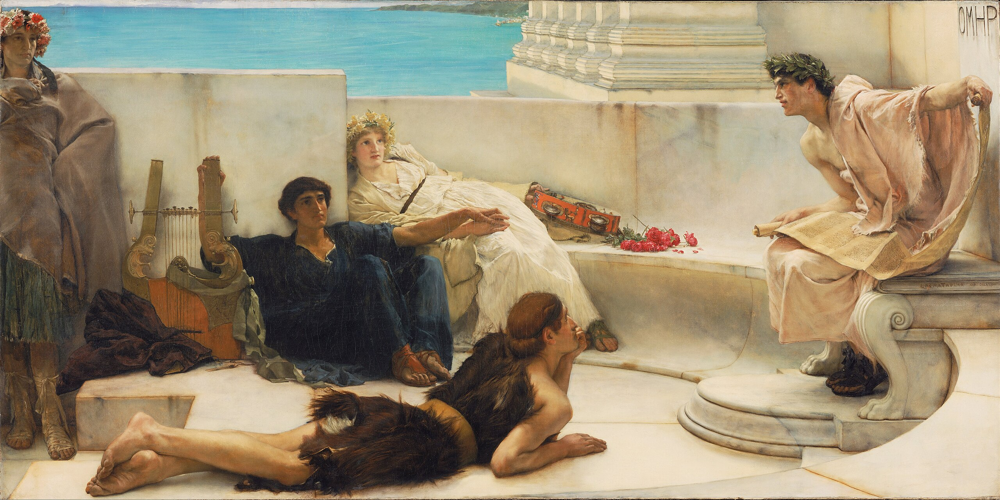
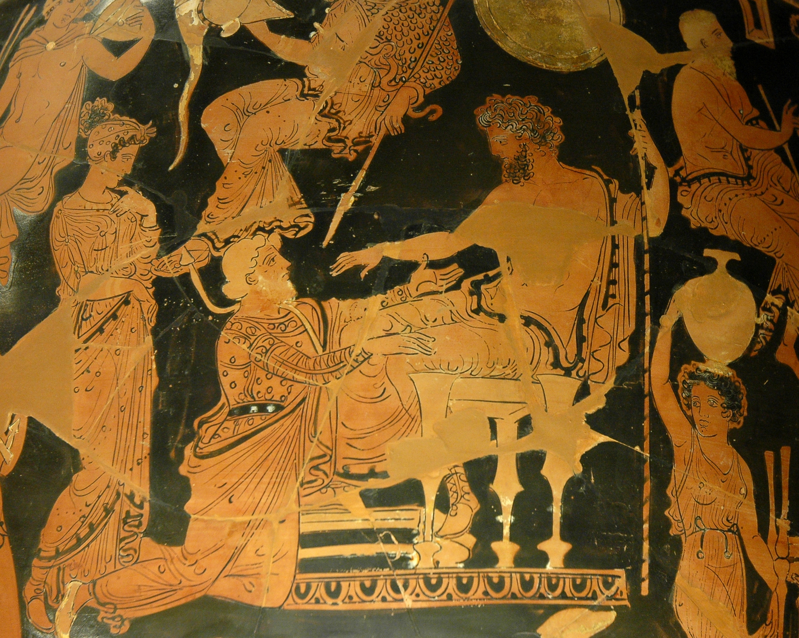
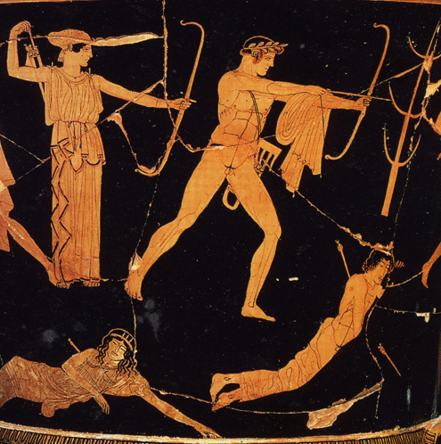
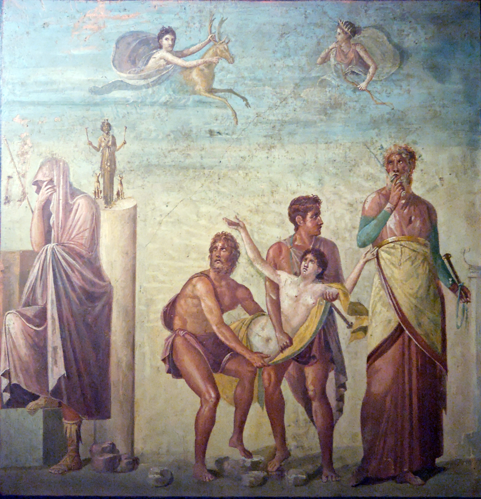
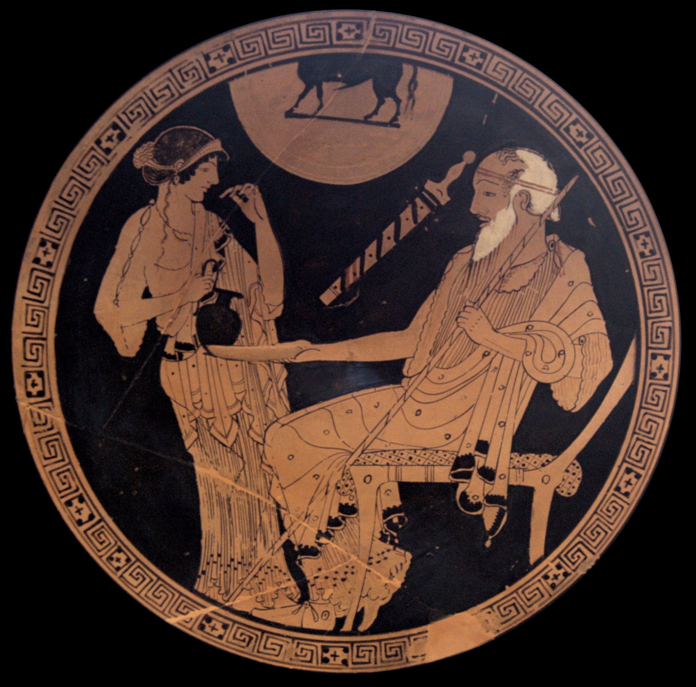
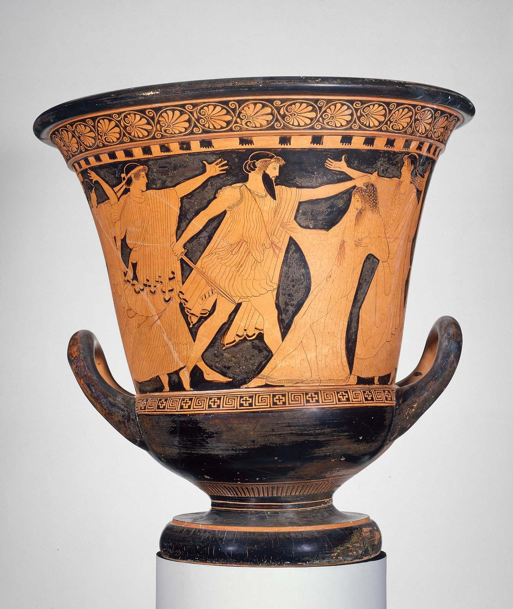
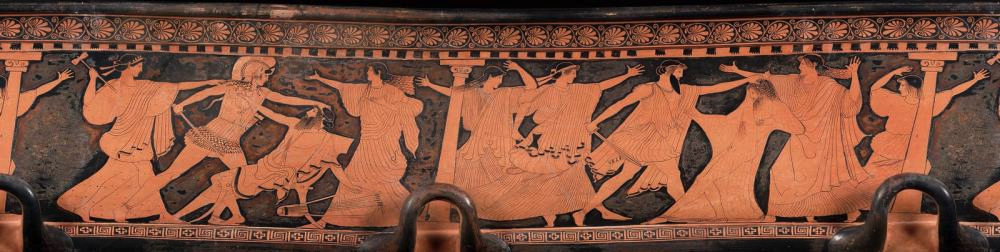

# Ilíada


---

## Ilíada.1.1-7: invocación a la musa


[Alma-Tadema, _A Reading from Homer_](https://en.wikipedia.org/wiki/File:Sir_Lawrence_Alma-Tadema,_English_(born_Netherlands)_-_A_Reading_from_Homer_-_Google_Art_Project.jpg)

??? note  "(1) Μῆνιν ἄειδε θεὰ Πηληϊάδεω Ἀχιλῆος"
    - (1) Adviértase cómo el primer verso enuncia la "cólera de Aquiles", tema principal de la Iliada. Originariamente la poesía épica era realmente cantada por los aedos (§ 2). La Musa canta por su boca.
    - (1) θε**ά**: [ᾱ rasgo eolio](notas.md#b1-alfa-larga)  
    - (1) Πηληϊάδ**εω**: [genitivo](notas.md#g5) y [patronímico](notas.md#n1).  Πηληϊάδ**α-ο** > Πηληϊάδ**η-ο** > Πηληϊάδ**ε-ω**.  
    - (1) Ἀχιλ**ῆος**: [genitivo](notas.md#i9): Ἀχιλ**ῆ-u-ος** Ἀχιλ**ῆ-ος** > Ἀχιλ**έ-ως**.

??? note  "(2) οὐλομένην, ἣ μυρί' Ἀχαιοῖς ἄλγε' ἔθηκε,"
    - (2) **οὐ**λ-ο-μένην: [alargamiento](notas.md#b7)  
    - (2) **οὐ**λομένην: part. aor. med. de ὄλ-λυ-μι, aquí con valor modal, "que ojalá perezca, que mal haya".  
    - (2) **ἄλγε'**: ἄλγ-ος > ἄλγ-ε-σ-α > ἄλγ-ε-α > ἄλγ-η

??? note  "(3) πολλὰς δ' ἰφθίμους ψυχὰς Ἄϊδι προΐαψεν"
    - (3) προ**ΐ**αψεν: [aumento](notas.md#p)

??? note  "(4) ἡρώων, αὐτοὺς δὲ ἑλώρια τεῦχε κύνεσσιν"
    - (4) **αυτούς**: "a ellos", a sus cuerpos en contraposición a sus almas.  

    - (4) **ἑλώρια**: ἑλ-ώρια εἷλ-ον (ἑλ-) αἱρέω.
    - (4) κύν**εσσιν**: [dativo eolio](notas.md#i1)

??? note  "(5) οἰωνοῖσί τε πᾶσι, Διὸς δ' ἐτελείετο βουλή,"
    - (5) Sobre el "plan de Zeus", ver vv. 517-530, y además § 11.  
    - (5) ἐτελε**ί**ετο: (i) [yod](notas.md#c6); (ii) imperfecto durativo.  

??? note  "(6) ἐξ οὗ δὴ τὰ πρῶτα διαστήτην ἐρίσαντε"
    - (6) **ἐξ οὗ**: La oración temporal debe hacerse depender del imperativo del verso 1 : "canta. Musa, la cólera de Aquiles [comenzando] desde que A. y A. se distanciaron (aor. intransitivo)...", es decir, en el repertorio épico tradicional el aedo selecciona su canto (§ 2e).
    - (6) ἐρίσαντ-**ε**: [dual](notas.md#i18): ἔρις, ἔριδ-ος ἐρίδ-yω > ἐρίζω
    - (6) διαστή-**την**: [dual](notas.md#o42):ἀτ. δι-ε-στή-**την**. ἵστημι/ἵσταμαι > ἔ-στη-σα 'yo coloqué'/ἔ-στη-ν 'yo me coloqué/me levanté'.

??? note  "(7) Ἀτρεΐδης τε ἄναξ ἀνδρῶν καὶ δῖος Ἀχιλλεύς."

---

## Ilíada.1.8-16: pregunta por el origen

??? note  "(8) Τίς τάρ σφωε θεῶν ἔριδι ξυνέηκε μάχεσθαι;"
    - (8) Εn la concepción homérica del hombre, éste no es responsable de sus actos, especialmente si sus consecuencias no son las buscadas (Agamenón provoca sin querer la peste y la derrota; Aquiles, la muerte de su camarada íntimo Patroclo); de ahí que el aedo pregunte por la divinidad (o fuerza superior) causante de la disputa.  
    - (8) **σφωε**: [dual](notas.md#i18)
    - (8)  **ξυν-έ-ηκε**:

??? note  "(9) Λητοῦς καὶ Διὸς υἱός· ὃ γὰρ βασιλῆϊ χολωθεὶς"
    - (9) **ὅ**: Apolo.  
    - (9) βασιλ**ῆ**-**ϊ**: [dativo](notas.md#i9); nótese βασιλεύς = ἄναξ del ν. 7.  

??? note  "(10) νοῦσον ἀνὰ στρατὸν ὄρσε κακήν, ὀλέκοντο δὲ λαοί,"
    - (10) **νοῦσον**: [alargamiento](notas.md#b7)  
    - (10) **ὄρσε**/**ὦρσε**: [ὄρνυμι](notas.md#o11), [temas](verbo#93-ὄρνυμι)

??? note  "(11) οὕνεκα τὸν Χρύσην ἠτίμασεν ἀρητῆρα"
    - (11) **οὕνεκα**: [crasis](notas.md#b13)
    - (11) **ἠτίμασεν**: τιμή 'precio/honor' > ἄ-τιμ-ος 'vil/deshonrado' > ἀ-τιμ-άζω 'deshonrar'.

??? note  "(12) Ἀτρεΐδης· ὃ γὰρ ἦλθε θοὰς ἐπὶ νῆας Ἀχαιῶν"
    - (12) **ὅ**: Crises ;  
    - (12) **θοάς**: adjetivación ornamental, pues la rapidez de las naves no importa al sentido de este pasaje, en el que están varadas en la costa (§ 20).  
    - (12) **νῆας**: [ναῦς](notas.md#i10)

??? note  "(13) λυσόμενός τε θύγατρα φέρων τ' ἀπερείσι' ἄποινα,"
    - (13) **λυσόμενός**: -part. ~~fut. con valor desiderativo~~; participio con valor futuro 'para (intentar) liberar'.  
    - (13) **θύγατρα**: [tercera declinación](notas.md#i7)  
    - (13) ἀπερ**εί**σι': [alargamiento métrico](notas.md#b7)

??? note  "(14) στέμματ' ἔχων ἐν χερσὶν ἑκηβόλου Ἀπόλλωνος"
    - (14) **στέμματα**: guirnalda de laurel que coronaba el bastón (símbolo de dignidad) del sacerdote de Apolo.

??? note  "(15) χρυσέῳ ἀνὰ σκήπτρῳ, καὶ λίσσετο πάντας Ἀχαιούς,"
    - (15) **ἀνά**: con dat. loc. "en lo alto de".  
    - (15) **λίσσετο**: el imperfecto durativo marca la insistencia de la súplica, "estuvo suplicando".

??? note  "(16) Ἀτρεΐδα δὲ μάλιστα δύω, κοσμήτορε λαῶν·"
    - (16) **Ἀτρεΐδᾱ**: [dual](notas.md#g9)  
    - (16) κοσμήτορ**ε**: [dual](notas.md#i18)  
    - (16) **λαῶν**: [alargamiento](notas.md#b1)

---

## 1.17-21: súplicas de Crises



[Chryses attempting to ransom his daughter Chryseis from Agamemnon. Side A of an Apulian red-figure volute-crater, ca. 360 BC–350 BC, found in Taranto.](https://commons.wikimedia.org/wiki/File:Chryses_Agamemnon_Louvre_K1.jpg)

??? note  "(17) «Ἀτρεΐδαι τε καὶ ἄλλοι ἐϋκνήμιδες Ἀχαιοί,"

??? note  "(18) ὑμῖν μὲν θεοὶ δοῖεν Ὀλύμπια δώματ' ἔχοντες"
    - (18) δο-**ῖ**-εν: [optativo desiderativo](notas.md#t5): 'Ojalá os concedan los dioses ...'.  
    - (18) **Ὀλύμπια δώματ'**: el palacio de Zeus en el monte Olimpo.

??? note  "(19) ἐκπέρσαι Πριάμοιο πόλιν, εὖ δ' οἴκαδ' ἱκέσθαι·"
    - (19) **ἐκ**-πέρσαι: el preverbio, que indica la realización total de la acción, alude a la victoria completa; es curioso que en la lengua homérica sólo existen términos para designar victorias parciales.  

??? note  "(20) παῖδα δ' ἐμοὶ λύσαιτε φίλην, τὰ δ' ἄποινα δέχεσθαι,"
    - (20) δέχε-**σθαι**: [infinitivo pro imperativo](notas.md#t14).  
    - (20) λύσα-**ι**-τε: [optativo desiderativo](notas.md#t5): '¡ojalá liberéis!' (deseo) > '¡liberad, por favor!' (petición).

??? note  "(21) ἁζόμενοι Διὸς υἱὸν ἑκηβόλον Ἀπόλλωνα.»"

---

## 1.22-25: reacción de Agamenón

??? note  "(22) Ἔνθ' ἄλλοι μὲν πάντες ἐπευφήμησαν Ἀχαιοὶ"

??? note  "(23) αἰδεῖσθαί θ' ἱερῆα καὶ ἀγλαὰ δέχθαι ἄποινα·"
    - (23) ἱερ**ῆ**-**α**: [acusativo de tema en -εύς](notas.md#i9)  
    - (23) **δέχθαι**: δέχ-σθαι > δέχ-θαι; antiguo aoristo atemático de [δέχομαι](notas.md#o13); frente al temático de presente δέχ-ε-σθαι

??? note  "(24) ἀλλ' οὐκ Ἀτρεΐδῃ Ἀγαμέμνονι ἥνδανε θυμῷ,"
    - (24) **θυμῷ**: [dativo r2d](notas.md#r2).

??? note  "(25) ἀλλὰ κακῶς ἀφίει, κρατερὸν δ' ἐπὶ μῦθον ἔτελλε·"
    - (25) **ἐπὶ ... ἔτελλε**: tmesis: separación del preverbio = ἐπ-έτελλε (ἐπιτέλλω)

---

## 1.26-32: discursos de Agamenón

??? note  "(26) «μή σε, γέρον, κοίλῃσιν ἐγὼ παρὰ νηυσὶ κιχείω"
    - (26) **νηυσὶ**: [ναῦς](notas.md#i10).  
    - (26) **μή σε κιχείω**: '(procura) que no te pille', '(haz todo lo posible) no sea que te pille'.  
    - (26) **Μή... κιχήω**: ~~subj. voluntativo~~.

??? note  "(27) ἢ νῦν δηθύνοντ' ἢ ὕστερον αὖτις ἰόντα,"

??? note  "(28) μή νύ τοι οὐ χραίσμῃ σκῆπτρον καὶ στέμμα θεοῖο·"
    - (28) **μή . . . οὐ χραίσμῃ**: equivale a oración dependiente de verbo de temor, "no sea (μή) que no (οὐ)...".

??? note  "(29) τὴν δ' ἐγὼ οὐ λύσω· πρίν μιν καὶ γῆρας ἔπεισιν"
    - (29) **τὴν**: Criseida, la hija de Crises.  
    - (29) **πρἰν**: adverbio.  
    - (29) **ἔπεισιν**: con valor de futuro (sujeto "la vejez"), "le sobrevendrá".

??? note  "(30) ἡμετέρῳ ἐνὶ οἴκῳ ἐν Ἄργεϊ τηλόθι πάτρης"

??? note  "(31) ἱστὸν ἐποιχομένην καὶ ἐμὸν λέχος ἀντιόωσαν·"
    - (31) **ἐποιχομένην καὶ ... ἀντιόωσαν**: los participios condertan con μιν.  
    - (31) **λέχος**: en acusativo (en lugar del genitivo que se esperaría con ἀντιόωσαν), por cierta tendencia de los neutros a no declinarse.  
    - (31) **ἀντιόωσαν**: [vocalismo](notas.md#b12): ἀντιά-ω ἀντι**ά**-**ου**σα >  ἀντι**ό**-**ω**σα/ἀντι**ῶ**σα

??? note  "(32) ἀλλ' ἴθι μή μ' ἐρέθιζε σαώτερος ὥς κε νέηαι.»"
    - (32) **κε**: [finales](notas.md#u5).  
    - (32) **ὥς κε νέηαι**: νέομαι 'regresar' subj. **etim.** νέ-η-σαι > **Hom.** νέ-η-αι (sin contraer) > **át.** νέ-ῃ. (contracción)
  
---

## 1.33-42: Crises se marcha y suplica a Apolo

??? note  "(33) Ὣς ἔφατ', ἔδεισεν δ' ὃ γέρων καὶ ἐπείθετο μύθῳ·"
    - (33) **ἔφατ'**: [φημί](notas.md#o7 ).
    - **ἔδεισεν**: aoristo ingresivo, "le entró miedo".  
    - **ἐπείθετο μύθῳ**: 'obedecía a su orden'. πείθω: (a) act. A (nom.) πείθει B (ac.) 'A convence a B'; (b) media: B (nom.) πείθεται A (dat.) 'B obedece/cree a A'.

??? note  "(34) βῆ δ' ἀκέων παρὰ θῖνα πολυφλοίσβοιο θαλάσσης·"

??? note  "(35) πολλὰ δ' ἔπειτ' ἀπάνευθε κιὼν ἠρᾶθ' ὃ γεραιὸς"
    - (35) **πολλὰ**: acusativo adverbial 'mucho', ático πολύ.
    - **κιὼν**: [aoristos radicales temáticos](notas.md#o20)  

??? note  "(36) Ἀπόλλωνι ἄνακτι, τὸν ἠΰκομος τέκε Λητώ·"
    - (36) **τὸν**: uso 'relativo' del artículo.
    - **ἠΰκομος**: [ἐΰς/ἠΰς](notas.md#b2): 'de hermosa (εὐ) cabellera (κόμη)'.
    - **τέκε**: (ἔ-)τέκ-ε (sin aumento) de ἔ-τεκ-ον: aoristo radical temático de τί-κτω (τί-τκ-ω).

??? note  "(37) «κλῦθί μευ ἀργυρότοξ', ὃς Χρύσην ἀμφιβέβηκας"
    - (37) **κλῦθί**: [aoristos radicales atemáticos](notas.md#o19)  
    - **μευ**: με(ι)ο > jon. μευ/át. μου [pronombres personales](notas.md#l1)  
    - **Χρύσην**: f., nombre de ciudad (no confundir con el nombre del sacerdote).  
    - **ἀμφιβέβηκας**: perfecto (que indica el estado resultante) de βαίνω, "doy pasos", literalmente, "estás con un paso dado (con las piernas abiertas) a uno y otro lado (ἀμφι-) de Crise" = "proteges a Crise".
    ``` mermaid
    graph TB

    A0("Oración compuesta
    ἀμφιβέβηκας Χρύσην Κίλλάν τε1 ζαθέην Τενέδοιό τε2 ἶφι ἀνάσσεις")
    A0-->A1("ἀμφιβέβηκας
    proteges")
    A1-->A11("Χρύσην
    Crisa")
    A1-->|"τε1"|A12("Κίλλάν τε1 ζαθέην
    y la muy divina Cila")
    A0-->|"τε2"|A2("Τενέδοιό τε2 ἶφι ἀνάσσεις
    y gobiernas con fuerza Ténedo")
    ```

??? note  "(38) Κίλλάν τε ζαθέην Τενέδοιό τε ἶφι ἀνάσσεις,"
    - (38) **ζαθέην**: [yod secundaria](notas.md#c7)  
    - **ἶφι**: [-φι](notas.md#j1)
    - **ἀνάσσεις**: ἄναξ, ἄνακτ-ος ἄνα**κτ-y**ω > ἀνά**σσ**εις

??? note  "(39) Σμινθεῦ εἴ ποτέ τοι χαρίεντ' ἐπὶ νηὸν ἔρεψα,"
    - (39) La plegaria comienza recordando al dios los servicios que le ha prestado Crises ; xap. : predicado, "con agrado tuyo" ; se refiere evidentemente a un tipo de templo muy primitivo, un mero techo para proteger la imagen del dios, colocada en una gruta (Leaf); los templos surgen en Grecia en época post-micénica y son raros en Homero (ver νηός; en el glosario).  
    - (39) **νηὸν**: ν**ᾱ**ός > jón-át. ν**η**ός > át. ν**εώ**ς (metátesis de cantidad) [νηός/νεώς](notas.md#h3); [declinación ática](https://pajaro1966.github.io/Paradigmas_Griegos/paradigmsNouns.html#par17)  

??? note  "(40) ἢ εἰ δή ποτέ τοι κατὰ πίονα μηρί' ἔκηα"
    - (40) **μηρί'(μηρία)**: los huesos de los muslos con la carne que queda adherida, recubiertos con grasa (por eso son **πίονα** "grasientos").  
    - **κατὰ ... ἔκηα**: κατα-καίω 'quemar del todo' [aoristos sigmáticos](notas.md#o24)  κα**υ**-**y**ω κα**ί**ω, ἔ-καυ-σα > ἔ-κη-α.
    - **ἠδ'**: [conjunciones](notas.md#m3)  

??? note  "(41) ταύρων ἠδ' αἰγῶν, τὸ δέ μοι κρήηνον ἐέλδωρ·"
    - (41) **κρήηνον**: [κρᾱαίνω](notas.md#o18): κρᾱα**ν**-**y**ω > κραα**ίν**ω; κρᾱα**ν**-**σ**ον > κρᾱα**ν**-**σ**ον > κρᾱ**ᾱν**-ον (alargamiento compensatorio) > κρή**η**νον (alfa larga a eta).
    - **δέ**: apodótico: aparece en principales, tras subordinadas que las anteceden, para marcar su inicio: 'si ..., entonces ...'.  
    - **ἐέλδωρ**: [prótesis vocálica](notas.md#b16)
    ``` mermaid
    graph TB
    A0("Oración compleja")
    A0-->A1("Subordinadas condicionales")
    A1-->A11("εἴ ... ἔρεψα,
    si")
    A11-->A111("ποτέ
    alguna vez")
    A11-->A112("τοι
    para ti")
    A11-->A113("χαρίεντ' ... νηὸν
    (un) grato templo")
    A11-->A114("ἐπὶ ... ἔρεψα
    cubrí")
    A1-->A12("ἢ εἰ ... αἰγῶν
    o si")
    A12-->A121("ποτέ
    alguna vez")
    A12-->A122("τοι
    para ti")
    A12-->A123("πίονα μηρί' ... ταύρων ἠδ' αἰγῶν
    grasientos muslos de toros y cabras")
    A12-->A124("κατὰ ... ἔκηα
    quemé")

    A0-->|"δέ"|A2("Oración principal")-->A21("τὸ δέ μοι κρήηνον ἐέλδωρ")
    A21-->A211("τὸ δέ
    esto")
    A21-->A212("μοι
    a mí")
    A21-->A213("κρήηνον
    llévame a cabo")
    A21-->A214("ἐέλδωρ
    como un deseo")
    
    ```

??? note  "(42) τίσειαν Δαναοὶ ἐμὰ δάκρυα σοῖσι βέλεσσιν.»"
    - (42) τί**σειαν**: [optativo desiderativo sin partícula](notas.md#t5): τίνω, τίν-σαι-εν > τίν-**σειαν**.  
    - **βέλεσσιν**: β**α**λ-yω > βαλλω, β**ο**λ-ή, β**έ**λος/βέλεσ-σιν > βέλε**σ**-**σ**ιν > βέλε**σ**ιν  

---

## 1.43-56: Apolo lanza la peste contra los aqueos

  

??? note  "(43) Ὣς ἔφατ' εὐχόμενος, τοῦ δ' ἔκλυε Φοῖβος Ἀπόλλων,"
    - (43) **ἔφατ'**: [φημί](notas.md#o7)  

??? note  "(44) βῆ δὲ κατ' Οὐλύμποιο καρήνων χωόμενος κῆρ,"
    - (44) **Οὐλύμποιο**: [alargamiento métrico](notas.md#b7)
    - **κατ' Οὐλύμποιο καρήνων**:  'desde (lo alto de) las cimas del Olimpo'.
    - **κῆρ**: acus. de relación o de parte, "en su corazón": (a) act. 'A encoleriza a B (ac. todo) su corazón C (ac. parte)'; (b) pas. 'B es/está encolerizado en C (ac. parte)'

??? note  "(45) τόξ' ὤμοισιν ἔχων ἀμφηρεφέα τε φαρέτρην·"
    - (45) **τόξ'(α)**: el arco (plural poético).
    - **ἀμφηρεφέα**:  el carcaj 'con tapadera (ἐρέφω 'cubrir') por ambas partes (ἀμφι-)': ἐρέφω > ἀμφ-**η**ρεφ-ής, ές, ac. ἀμφ-ηρεφ-έσ-α > ἀμφ-ηρεφ-**έ**-**α** > át. ἀμφ-ηρεφ-**ῆ**.
    - **ὤμοισιν**: [dativo](notas.md#r2)  

??? note  "(46) ἔκλαγξαν δ' ἄρ' ὀϊστοὶ ἐπ' ὤμων χωομένοιο,"
    - (46) **ἄρ'**: [partículas](notas.md#m3).  
    - (46) χωομέν**οιο**: se refiere a Apolo: (a) «sonaban las flechas sobre los hombros (de Apolo) (Ἀπόλλων-**ος**), que estaba encolerizado (χωομέν-**οιο**)»; (b) 'del encolerizado (dios)'.  
    ```mermaid
    graph TB

    A("Oración")
    node_1["Verbo"]
    node_2["ἔκλαγξαν
    sonaron"]
    node_3["Sujeto"]
    node_4["ὀϊστοὶ
    (las) flechas"]
    node_5["ἐπ#39; ὤμων
    (situadas) sobre los hombros"]-->node_51("χωομένοιο
    del encolerizado (dios)")
    node_6["Genitivo absoluto"]
    node_7["αὐτοῦ κινηθέντος
    al ponerse en movimiento"]
    A --> node_1
    node_1 --> node_2
    A --> node_3
    node_3 --> node_4
    node_4 --> node_5
    A --> node_6
    node_6 --> node_7
    ```

??? note  "(47) αὐτοῦ κινηθέντος· ὃ δ' ἤϊε νυκτὶ ἐοικώς."
    - (47) **αὐτοῦ κινηθέντος**: puede ser aposición al posesivo («de él, que se estaba moviendo») o genitivo absoluto ('al moverse').  
    - (47) **ἤϊε**: [εἶμι](notas.md#o2)  
    - **νεῶν**: [ναῦς](notas.md#i10)  
    - **νυκτὶ ἐοικώς**: «igual a la noche» porque estaba como negro de ira. ϝείκ-ω > εἴκω, ϝέ-ϝοικ-α > ἔοικ-α 'parecer(se)'.

??? note  "(48) ἕζετ' ἔπειτ' ἀπάνευθε νεῶν, μετὰ δ' ἰὸν ἕηκε·"
    - (48) **μετὰ ... ἕηκε**: [tmesis](notas.md#) [ἵημι](notas.md#o6); [temas](verbo.md#60-ἵημι)

??? note  "(49) δεινὴ δὲ κλαγγὴ γένετ' ἀργυρέοιο βιοῖο·"
    - (49) **ἀργυρέοιο βιοῖο**: genitivo de origen sin preposición.

??? note  "(50) οὐρῆας μὲν πρῶτον ἐπῴχετο καὶ κύνας ἀργούς,"
    - (50) **οὐρῆας**: [alargamiento métrico](notas.md#b7): **ὀ**ρεύς > Ion. **οὐ**ρεύς, [-ευς](notas.md#i9): ὀρ**ῆ**(ϝ)-**ᾰ** > ὀρ**ῆ**-**ᾰ** > ὀρ**έ**-**ᾱ**.

??? note  "(51) αὐτὰρ ἔπειτ' αὐτοῖσι βέλος ἐχεπευκὲς ἐφιεὶς"
    - (51) **αὐτοῖσι**: a los hombres, en contraste con los mulos y perros.  
    - **ἐφιεὶς**: ἐφ-(σ)ι-(σ)ε-ντ-ς > ἐφ-(σ)ι-(σ)**ει**-ς
    - **ἐχεπευκές**: el adjetivo (sólo en este verso y en IV 129) es un compuesto con primer elemento verbal ἐχε- y *πεῦκος, tema en -s no atestiguado, pero evidentemente relacionado con πεύκη "pino"; propiamente describía una flecha con vastago de pino (y punta de bronce, ver ὀϊστός en el glosario); se trata de un singular colectivo, pues Apolo no lanzó sólo una flecha.  

??? note  "(52) βάλλ'· αἰεὶ δὲ πυραὶ νεκύων καίοντο θαμειαί."
    - (52) **βάλλ'(ε)**: imperfecto durativo; [βάλλω](verbo.md#24-βάλλω): (a) 'βάλλω A (nom) lanza B (ac.) a C (dat.)'; (b) 'βάλλω A (nom) alcanzar C (ac.) a B (dat.)'.
    - **αἰεὶ**: 'contiuamente'.
    - **καίοντο**: (ἐ)καί-ο-ντο (a) act. 'A (nom.) quema (καί-ει) B (ac.)'; (b) 'B (nom.) arde  (καί-ε-ται)'. Sobre la incineración de cadáveres ver §9c.

??? note  "(53) Ἐννῆμαρ μὲν ἀνὰ στρατὸν ᾤχετο κῆλα θεοῖο,"
    - (53) **Ἐννῆμαρ**: [neutros en -r-/-t-](notas.md#i6)  

??? note  "(54) τῇ δεκάτῃ δ' ἀγορὴν δὲ καλέσσατο λαὸν Ἀχιλλεύς·"
    - (54) **τῇ δεκάτῃ**: aunque en el verso anterior el aedo ha usado el neutro ἦμαρ, que es arcaísmo, aquí está pensando en ἡμέρη, que es la forma usual en jonio; como se ve, la asamblea podía ser convocada no sólo por el soberano, sino por uno de los γέροντες (ver glosario).
    - **ἀγορὴν δὲ**: = ἀγορήν-δε adv. de dirección 'llamó a asamblea'.
    - **καλέσσατο**: [Αlternancia σ/σσ](notas.md#e1); [καλέω](Verbos/kalew.png): se trata de una doble sigma analógica con los verbos que sí la tienen etimológicamente: τέλος, ους τελέσ-yω ἐ-τέλε**σ**-**σ**α > át. ἐ-τέλε**σ**α.  

??? note  "(55) τῷ γὰρ ἐπὶ φρεσὶ θῆκε θεὰ λευκώλενος Ἥρη·"
    - (55) **θεὰ λευκώλενος Ἥρη**: otra vez una divinidad es la causa de un acto humano.

??? note  "(56) κήδετο γὰρ Δαναῶν, ὅτι ῥα θνήσκοντας ὁρᾶτο."
    - (56) **ῥα**: [conjunciones](notas.md#m3)  

  

---

## 1.57-67: los aqueos se reúnen y Aquiles propone consultar a un adivino

??? note  "(57) οἳ δ' ἐπεὶ οὖν ἤγερθεν ὁμηγερέες τε γένοντο,"
    - (57) ἤγερθ**εν**: [desinencias personales](notas.md#o41): ἤγερθ**εν**/ἤγερ-**θησαν**
    - (57) οἳ δ' ἐπεὶ **οὖν** ἤγερθεν ὁμηγερέες τε γένοντο ...: la partícula οὖν remite a la reunión de los aqueos de la que se ha apartado la atención al explicar mediante la partícula γάρ que se trataba de una iniciativa inspirada por Hera a Aquiles.
    - **ὁμηγερέες**:  ὁμ-ηγερ-έες
    ```mermaid

    graph TB

    A("Discurso")
    A-->B("Convocatoria de Aquiles")-->B1("54 τῇ δεκάτῃ δ' ἀγορὴν δὲ καλέσσατο λαὸν Ἀχιλλεύς·")
    A-->|"γὰρ"|C(Excursos sobre Hera)-->C1("55 τῷ γὰρ ἐπὶ φρεσὶ θῆκε θεὰ λευκώλενος Ἥρη·/
     56 κήδετο γὰρ Δαναῶν, ὅτι ῥα θνήσκοντας ὁρᾶτο.")
    A-->|"οὖν"|D("Retorno a la asamble")-->D1("οἳ δ' ἐπεὶ οὖν ἤγερθεν ὁμηγερέες τε γένοντο ...")

    ```

    ```mermaid
    graph TB

    O1("Discurso")
    O1-->O2
    O1-->|"δ'1 (coordinador)"|O
    O2("Oraciones previas")-->O21("...")
    O("Oración")
    O-->A
    O-->|"δ'2 (apodótico)"|B
    A("Subordinada")-->A1("οἳ δ'1 ἐπεὶ οὖν
    ellos cuando")
    A1-->A11("ἤγερθεν
    se reunieron")
    A1-->|"τε"|A12("ὁμηγερέες τε γένοντο
    y llegaron a quedar juntos")
    B("Principal")-->B10("τοῖσι δ'2
    entre ellos")
    B-->B11("ἀνιστάμενος
    levantándose")
    B-->B12("μετέφη
    habló entre ellos")
    B-->B13("πόδας ὠκὺς Ἀχιλλεύς
    Aquiles rápido de pies")

    ```

??? note  "(58) τοῖσι δ' ἀνιστάμενος μετέφη πόδας ὠκὺς Ἀχιλλεύς·"
    - (58) **τοῖσι**: [dativo](notas.md#r2)  
    - (58) **δ'**: [partículas apodóticas](notas.md#v1)  

??? note  "(59) «Ἀτρεΐδη, νῦν ἄμμε παλιμπλαγχθέντας ὀΐω"
    - (59) **Ἀτρεΐδη**: [nominativo masculino η](notas.md#g3)
    - **παλιμπλαγχθέντας**: πάλιν πλαγχθέντας < πλάζω ἔπλαγξα πλάζομαι 'vagar'.

    ```mermaid

    graph TB

    A("Discurso")
    A-->B
    A-->C
    B("Vocativo")-->B1("Ἀτρεΐδη,
    Atrida,")
    C("Oración")-->D("Verbo")-->D1("ὀΐω
    creo que")
    D1-->E("Completiva de infinitivo")
    E-->E1("νῦν
    ahora")
    E-->E2("ἄμμε
    nosotros")
    E-->E3("παλιμπλαγχθέντας
    vagando de vuelta")
    E-->E4("ἂψ
    de vuelta")
    E-->E5("ἀπονοστήσειν
    vamos a regresar")
    E-->E6("εἴ κεν θάνατόν γε φύγοιμεν
    por si podemos huir de la muerte")
    C-->F("Condicional")-->F1("εἰ δὴ ὁμοῦ πόλεμός τε δαμᾷ καὶ λοιμὸς Ἀχαιούς
    si en el mismo lugar guerra y peste van a domar a los aqueos")

    ```

??? note  "(60) ἂψ ἀπονοστήσειν, εἴ κεν θάνατόν γε φύγοιμεν,"
    - (60) **εἴ κεν**: [condicionales y concesivas](notas.md#u7): 'por si': depende de ἀπονοστήσειν ('regresaremos')
    - **εἰ ...**:esta condicional depende del verbo principal ὀΐω ('creo'): «si nos va a dominar la guerra y la peste entonces creo que vamos a regresar, porque (si regresamos) quizá podamos librarnos de la muerte.»

??? note  "(61) εἰ δὴ ὁμοῦ πόλεμός τε δαμᾷ καὶ λοιμὸς Ἀχαιούς·"
    - (61) **δαμᾷ**: [futuro](notas.md#o27); [δάμνημι](verbo.md#35)

??? note  "(62) ἀλλ' ἄγε δή τινα μάντιν ἐρείομεν ἢ ἱερῆα"
    - (62) **ἐρείομεν**: [subjuntivo](notas.md#o39)  
    - (62) **ἱερῆα**: [sustantivos en -ευς](notas.md#i9) ἱερηύς ἱερῆu-α > ἱερῆ-α > ἱερέ-ᾱ

??? note  "(63) ἢ καὶ ὀνειροπόλον, —καὶ γάρ τ' ὄναρ ἐκ Διός ἐστιν—"
    - (63) **ὄναρ**: el sueño es enviado por Zeus, y, por lo tanto, el intérprete de sueños profetiza (habla προ- "en lugar de").  
    - **γάρ**: es un inciso, y debería ir entre paréntesis o guiones.
    - (63) **τ'**: [τε](notas.md#m4)  

??? note  "(64) ὅς κ' εἴποι ὅ τι τόσσον ἐχώσατο Φοῖβος Ἀπόλλων,"

??? note  "(65) εἴ ταρ ὅ γ' εὐχωλῆς ἐπιμέμφεται ἠδ' ἑκατόμβης,"
    - (65) **ἑκατόμβης**: [genitivo](notas.md#r1).  

??? note  "(66) αἴ κέν πως ἀρνῶν κνίσης αἰγῶν τε τελείων"
    - (66) **αἴ κέν πως**: 'por si de alguna manera': condicional final. En ático se construyen con ἐάν+subjuntivo (verbo principal en presente o futuro) y εἰ + optativo (verbo principal en pasado).  
    - (66) **κνίση**: es el olor de la grasa quemada en los sacrificios, del que participan (ἀντιάω v. 67) los dioses.  
    - (66) **τελείων**: adjetivo que se aplica a las víctimas "impecables" y aptas para el sacrificio (las prescripciones rituales podían referirse a la especie animal, al sexo, al color de la piel, a su integridad física, etc.).  

??? note  "(67) βούλεται ἀντιάσας ἡμῖν ἀπὸ λοιγὸν ἀμῦναι."
    - (65-67) **εἴ ... ἠδ' ...**: (≈ εἴτε ... εἴτε ...): interrogativa indirecta; acaso se ha cometido alguna falta ritual en una oración o en un sacrificio.
    - (67) **ἀμῦναι**: in. aor. act. ἀμυνω, ἤμυ**ν**-**σ**α > ἤμῡ**ν**-*α.
    - **ἡμῖν ἀπὸ λοιγὸν ἀμῦναι**: tmesis ἡμῖν λοιγὸν ἀποἀμῦναι: 'apartarnos la ruina' > 'protegernos de la ruina': la imagen es que alguien aparta algo a alguien y de esta manera lo protege de ello: 'apártame la muerte (aléjala de mí)' > 'protégeme de la muerte'

---

## 1.68-83: interviene el adivino Calcante



[Museo Arqueológico de Nápoles: Casa del Poeta trágico, Pompeii (VI, 8, 3.5): _Calcante y el sacrificio de Ifigenia_](https://commons.wikimedia.org/wiki/File:Fresco_Iphigeneia_MAN_Naples.jpg)

??? note  "(68) corr. Ἤτοι ὅ γ' ὣς εἰπὼν κατ' ἄρ' ἕζετο· τοῖσι δ' ἀνέστη"
    - (68) **τοῖσι**: [dativo](notas.md#r2)  
    - (68) **κατ' ... ἕζετο**: tmesis 'se sentaba'.

??? note  "(69) Κάλχας Θεστορίδης οἰωνοπόλων ὄχ' ἄριστος,"
    - (69) **ὄχ'**: [-α](notas.md#j10)

??? note  "(70) ὃς ᾔδη τά τ' ἐόντα τά τ' ἐσσόμενα πρό τ' ἐόντα,"
    - (70) **ἐόντα**: [εἰμί](notas.md#o5)

??? note  "(71) καὶ νήεσσ' ἡγήσατ' Ἀχαιῶν Ἴλιον εἴσω"
    - (71) **νήεσσ'**: [ναῦς](notas.md#i10); νήεσσι: regido por ἡγήσατ'.
    - (71) **εἴσω**: adv. "adentro", completa el sentido del acusativo precedente.  
    - (71) **Ἴλιον**: [acusativo](notas.md#r3)

??? note  "(72) ἣν διὰ μαντοσύνην, τήν οἱ πόρε Φοῖβος Ἀπόλλων·"
    - (72) **ἣν**: [posesivos](notas.md#l2)  
    - (72) **τήν**: [ὁ, ἡ, τό](notas.md#l4)
    - (72) **πόρε**: aor. rad. temático ἔπορον (inf. πορεῖν), pf. pass. πέπρωμαι, fut. πορῶ.

??? note  "(73) ὅ σφιν ἐὺ φρονέων ἀγορήσατο καὶ μετέειπεν·"
    - (73) **ὅ**: [ὁ, ἡ, τό](notas.md#l4): Calcante.  
    - (73) **σφιν**: [pronombres personales](notas.md#l1)  
    - (73) **μετέειπεν**: [aoristos temáticos reduplicados](notas.md#o21)

??? note  "(74) «ὦ Ἀχιλεῦ, κέλεαί με, Διῒ φίλε, μυθήσασθαι"
    - (74) **μυθήσασθαι**: "explicar".  
    - (74) **ἦ μέν**: combinación de partículas fuertemente afirmativa después de verbo de "jurar" (ático ἦ μήν).  
    - **κέλεαί**: κέλε(ϝ)ε-σαί

??? note  "(75) μῆνιν Ἀπόλλωνος ἑκατηβελέταο ἄνακτος·"

??? note  "(76) τοὶ γὰρ ἐγὼν ἐρέω· σὺ δὲ σύνθεο καί μοι ὄμοσσον"
    - (76) **τοὶ**: [pronombres personales](notas.md#l1)  
    - (76) **ἐγὼν**: [pronombres personales](notas.md#l1)
    - (76) **ὄμοσσον**: [analógico](verbo.md#91): ὄμοσον -> ὄμοσσον.

??? note  "(77) ἦ μέν μοι πρόφρων ἔπεσιν καὶ χερσὶν ἀρήξειν·"
    - (77-78) **ἦ**: partícula empleada en aseveraciones enfáticas, como p.ej. juramentos.  

??? note  "(78) ἦ γὰρ ὀΐομαι ἄνδρα χολωσέμεν, ὃς μέγα πάντων"
    - (78) χολωσ-**έμεν**: [infinitivo](notas.md#o40)  
    - (78) **μέγα**: acus. adv.  
    - (78-79) **ὃς** (Agamenón) μέγα πάντων / Ἀργείων κρατέει **καί** **οἱ** (Agamenón) πείθονται Ἀχαιοί: nótese cómo la oración subordinada relativa se interrumpe y da paso a una independiente, por relajación de la tensión necesaria para sostener la subordinación a cierta distancia del pronombre que la introduce.  
      - A.R.: es un caso parecido al español 'que su': «vino Pedro, el chico **que** (el chico) vimos ayer y **que su**  (el chico) padre trabaja en un banco»  

??? note  "(79) Ἀργείων κρατέει καί οἱ πείθονται Ἀχαιοί·"
    - (79) **οἱ**: [pronombres personales](notas.md#l1)
    - (79) **πείθονται**: (a) act. πείθω A (nom.) convence a B (ac.); med. πείθεται B (nom) obedece/cree a A (dat)

??? note  "(80) κρείσσων γὰρ βασιλεὺς ὅτε χώσεται ἀνδρὶ χέρηϊ·"
    - (80) **ὅτε χώσεται**: Oración temporal eventual universal sin necesidad de partícula modal. = át. ὅταν χώσηται.  
    - (80) χώσ**εται**: [subjuntivo](notas.md#o39)  
    - (80) **χέρηϊ**: [comparativos](notas.md#k2): χερ-ίων,  χείρων, ον, χείρ-ον-ι.  

??? note  "(81) εἴ περ γάρ τε χόλον γε καὶ αὐτῆμαρ καταπέψῃ,"
    - (81) **εἴ**: [condicionales y concesivas](notas.md#u7)  
    - (81) **τε**: [partículas apodóticas](notas.md#v1); [τε](grammar#grammar/τε.md)  
    - (81) **χόλος**: propiamente "hiél" (complemento directo de "digerir"); en sentido figurado, "ira", "cólera" momentánea y pasajera, en oposición a κότος "rencor".  
    - **καταπέψῃ**: καταπέσσω.
    - (81) **αὐτῆμαρ**: [neutros en -r-/-t-](notas.md#i6).

??? note  "(82) ἀλλά τε καὶ μετόπισθεν ἔχει κότον, ὄφρα τελέσσῃ,"
    - (82) **ὄφρα**: [temporales](notas.md#u4).  
    - (82) **ἑοῖσι**: [posesivos](notas.md#l2).  
    - (82) **ὄφρα τελέσσῃ**: entiéndase, "hasta que satisfaga su rencor".

??? note  "(83) ἐν στήθεσσιν ἑοῖσι· σὺ δὲ φράσαι εἴ με σαώσεις»."
    - (83) **σαώσεις**: (a) σαϝος > σαϝος > σῶς: (b) σαϝος σαϝό-yω / σῶς + ίζω > σῴζω; (c) σαϝώ-σεις > σαώ-σεις > σώ-σεις

---

## 1.84-91: réplica de Aquiles

??? note  "(84) Τὸν δ' ἀπαμειβόμενος προσέφη πόδας ὠκὺς Ἀχιλλεύς·"
    - (84) **τὸν**: regido por el preverbio de **προσ**-έφη.
    - (84) **προσ-έφη**: reden, an-reden.

??? note  "(85) «θαρσήσας μάλα εἰπὲ θεοπρόπιον ὅ τι οἶσθα·"
    - (85) **μάλα**: va con el participio.  
    - (85) **ὅ τι**: [relativas](notas.md#u1)  

??? note  "(86) οὐ μὰ γὰρ Ἀπόλλωνα Διῒ φίλον, ᾧ τε σὺ Κάλχαν"
    - (86) **οὐ**: negación recogida en el v. 88;  
    - (86) **ᾧ τε**: [relativas](notas.md#u1); dat. regido por εὐχόμενος.  

??? note  "(87) εὐχόμενος Δαναοῖσι θεοπροπίας ἀναφαίνεις,"

??? note  "(88) οὔ τις ἐμεῦ ζῶντος καὶ ἐπὶ χθονὶ δερκομένοιο"

    - (88) **ἐμεῦ**: [pronombres personales](notas.md#l1)  
    - (88) **δερκομένοιο**: "teniendo los ojos abiertos".  

??? note  "(89) σοὶ κοίλῃς παρὰ νηυσὶ βαρείας χεῖρας ἐποίσει"
    - (89) **βαρείας**: predicado, "con todo su peso".  

??? note  "(90) συμπάντων Δαναῶν, οὐδ' ἢν Ἀγαμέμνονα εἴπῃς,"
    - (90) **συμπάντων Δαναῶν**: gen. partitivo dependiente de τις (ν. 88).  

??? note  "(91) ὃς νῦν πολλὸν ἄριστος Ἀχαιῶν εὔχεται εἶναι.»"
    - (91) **πολλὸν**: [πολύς](notas.md#k1)  
    - (91) **εΰχεται**: "se jacta"; no implica fanfarronería, sino meramente una conciencia ingenua de su posición; la falsa modestia es desconocida de los héroes homéricos (Leaf; cf. § 21).  

---

## 1.92-100: Calcante explica el origen de la peste

??? note  "(92) Καὶ τότε δὴ θάρσησε καὶ ηὔδα μάντις ἀμύμων·"

??? note  "(93) «οὔ ταρ ὅ γ' εὐχωλῆς ἐπιμέμφεται οὐδ' ἑκατόμβης,"

??? note  "(94) ἀλλ' ἕνεκ' ἀρητῆρος ὃν ἠτίμησ' Ἀγαμέμνων,"
    - (94)  **ἀτιμάω**: τιμή 'honor, valor' [ἀ- [τιμή] -yω] 'des-honra-r'

??? note  "(95) οὐδ' ἀπέλυσε θύγατρα καὶ οὐκ ἀπεδέξατ' ἄποινα,"
    - (95) **θύγατρα**: [nombres de parentesco en -ρ](notas.md#i7)
    - (95) Nótese la interrupción de la subordinación (cf. v. 79).

??? note  "(96) τοὔνεκ' ἄρ' ἄλγε' ἔδωκεν ἑκηβόλος ἠδ' ἔτι δώσει·"
    - (96) **τοὔνεκ'**: [crasis](notas.md#b13)
    - (96) **ἄρα**: "como es natural".
    - (96) **ἠδ'**: [conjunciones](notas.md#m3)

??? note  "(97) οὐδ' ὅ γε πρὶν Δαναοῖσιν ἀεικέα λοιγὸν ἀπώσει"
    - (97) **ὁ**: Apolo.
    - (97) **πρίν**: adv., anticipando la oración temporal del verso siguiente.
    - (97) **Δαναοῖσιν**: dat. commodi.

??? note  "(98) πρίν γ' ἀπὸ πατρὶ φίλῳ δόμεναι ἑλικώπιδα κούρην"
    - (98) κ**ού**ρην: [alargamiento por caída de wau](notas.md#c3)
    - (98) **ἀπο ... δόμεναι**: el preverbio indica que lo que se da es debido, "devolver"; tmesis: ἀποδίδωμι.
    - (98) ἑλικῶπις κ . : "muchacha de ojos negros", según los comentaristas antiguos y, modernamente, Page (pero no "que mueve o gira los ojos"), cf. XXIII 166.

??? note  "(99) ἀπριάτην ἀνάποινον, ἄγειν θ' ἱερὴν ἑκατόμβην"

??? note  "(100) ἐς Χρύσην· τότε κέν μιν ἱλασσάμενοι πεπίθοιμεν.»"
    - (100) **πεπίθοιμεν**: [aoristos radicales temáticos](notas.md#o20); aor. tem. reduplicado con sentido factitivo, "entonces... podríamos hacerle atendemos (en nuestras súplicas)". πείθω ἔ-πει-σα, ἐ-πιθ-ό-μην.
    - (100) **μιν**: Apolo.
    -  **ἱλασσάμενοι**: ἱλά-σκ-ο-μαι.

---

## 1.101-120: intervención de Agamenón: pide una compensación por la entrega de Criseida

??? note  "(101) Ἤτοι ὅ γ' ὣς εἰπὼν κατ' ἄρ' ἕζετο· τοῖσι δ' ἀνέστη"
    - (101) **τοῖσι**: [dativo](notas.md#r2)

??? note  "(102) ἥρως Ἀτρεΐδης εὐρὺ κρείων Ἀγαμέμνων"
    - (102) **εὐρύ** (acus. adv. de extensión) **κρείων** (como si fuese un participio): "señor de anchos dominios".

??? note  "(103) ἀχνύμενος· μένεος δὲ μέγα φρένες ἀμφιμέλαιναι"
    - (103) **μένεος**: gen. partitivo.
    - (103) **μέγα**: acus. adv.
    - (103) **άμφὶ**: adv. "por ambos lados".

??? note  "(104) πίμπλαντ', ὄσσε δέ οἱ πυρὶ λαμπετόωντι ἐΐκτην·"
    - (104) **ὄσσε**: [dual](notas.md#i18)
    - (104) **οἱ**: dat. simpatètico "sus ojos".
    - (104) **ἐΐκτην**: [perfecto](notas.md#o29)
    - (104) **λαμπετόωντι**: λαμπετά-ο-ντ-ι > λαμπετό-ω-ντ-ι > -at. λαμπετῶ-ντ-ι.

??? note  "(105) Κάλχαντα πρώτιστα κάκ' ὀσσόμενος προσέειπε·"
    - (105) **Κάλχαντα**: acus. regido por el preverbio de **προσ**-έειπε.
    - (105) **κάκ'** (con acento pasado a la sflaba anterior al sufrir elisión la vocal final acentuada): acus. adv. dependiente del participio "teniendo mala mirada", "poniendo mala cara".
    - (105) **πρώτιστα**: [ordinales](notas.md#k4).

??? note  "(106) «μάντι κακῶν οὐ πώ ποτέ μοι τὸ κρήγυον εἶπας·"
    - (106) μάντι: μάντις, μάντει. -ηι-, -ι-.

??? note  "(107) αἰεί τοι τὰ κάκ' ἐστὶ φίλα φρεσὶ μαντεύεσθαι,"
    1. ἐστὶ φίλα: He was likely to come. él era probable venir/era probable que viniera

??? note  "(108) ἐσθλὸν δ' οὔτέ τί πω εἶπας ἔπος οὔτ' ἐτέλεσσας·"
    - (108) **ἐσθλὸν ... ἔπος**: "presagio favorable"; Agamenón intenta desprestigiar a Calcante como adivino.
    - ἐτέλεσσας: τέλoς/ (1) τελέσ-yω  > τελέ-ω; (1) ἐ-τέλεσ-σα > (2) ἐ-τέλεσα.

??? note  "(109) καὶ νῦν ἐν Δαναοῖσι θεοπροπέων ἀγορεύεις"

??? note  "(110) ὡς δὴ τοῦδ' ἕνεκά σφιν ἑκηβόλος ἄλγεα τεύχει,"
    - (110) **ὡς**: completiva.
    - (110) **σφιν**: [pronombres personales](notas.md#l1)
    - (110) **τοῦδ' ἕνεκα**: anuncia οὕνεκα.
    - (110) **Κλυτ.**: genit. regido por προ-.

??? note  "(111) οὕνεκ' ἐγὼ κούρης Χρυσηΐδος ἀγλά' ἄποινα"
    - (111) **κούρης**: [alargamiento por caída de wau](notas.md#c3)

??? note  "(112) οὐκ ἔθελον δέξασθαι, ἐπεὶ πολὺ βούλομαι αὐτὴν"

??? note  "(113) οἴκοι ἔχειν· καὶ γάρ ῥα Κλυταιμνήστρης προβέβουλα"
    - (113) οἴκοι: loc. de οἶκος nom.pl. οἶκοι
    -  **ῥα**: [conjunciones](notas.md#m3)
    - (113) **προβέβουλα**: [preposiciones](notas.md#m1)

??? note  "(114) κουριδίης ἀλόχου, ἐπεὶ οὔ ἑθέν ἐστι χερείων,"
    - (114) **ἑθέν**: [pronombres personales](notas.md#l1)
    - (114) **χερείων**: [comparativos](notas.md#k2): (a) 2º término de comparación: a1 genitivo, a2. ἤ + mismo caso; (b) dimensión: b1 acusativo; b2 (ἐν) dativo
    - **Ὁ Σωκράτης** (1ºtérm.) **κρείττων** (comp.) ἔστι Πλατωνος/**ἤ Πλάτων**  (2ºtérm.) (ἐν) εἰρωνείᾳ/εἰρωνείαν (dimensión) .
    - νομίζω **τὸν Σωκράτη** (1ºtérm.) **κρείττονα** (κρείττω) (comp.) Πλατωνος/**ἤ Πλάτωνα**  (2ºtérm.) (ἐν) εἰρωνείᾳ/εἰρωνείαν (dimensión).
    - (114) **κουριδίη ἄλοχος**: fórmula frecuente de adj. (de sentido oscuro) y sustantivo.

??? note  "(115) οὐ δέμας οὐδὲ φυήν, οὔτ' ἂρ φρένας οὔτέ τι ἔργα."
    - (115) **Acusativos de relación**. Para el sentido de δέμας, no "cuerpo", ver glosario.
    - (115) **ἂρ**: [conjunciones](notas.md#m3)

??? note  "(116) ἀλλὰ καὶ ὧς ἐθέλω δόμεναι πάλιν εἰ τό γ' ἄμεινον·"
    - (116) **δόμεναι**: [infinitivo](notas.md#o40)
    - (116) **καὶ ὧς**: 'aun así' > 'pese a ello'.

??? note  "(117) βούλομ' ἐγὼ λαὸν σῶν ἔμμεναι ἢ ἀπολέσθαι·"
    - (117) **βούλομ' A ἢ B**: con idea de comparación "prefiero... a...".
    - (117) **ἔμμεναι**: [εἰμί](notas.md#o5)

??? note  "(118) αὐτὰρ ἐμοὶ γέρας αὐτίχ' ἑτοιμάσατ' ὄφρα μὴ οἶος"
    - (118) **ὄφρα**: [finales](notas.md#u5)
    - **ἑτοιμάσατ'**: ἑτοιμά**Χ**-**σ**ατε: Χ + σ = σ ; X = {ø | σ | δ | τ | θ | ττ/σσ, ζ}: {ἑτοιμ**άω** | ἑτοιμά**σω** | ἑτοιμά**δω** | ἑτοιμά**θω** | ἑτοιμά**τω** | ἑτοιμά**ττ**/**σσω** | ἑτοιμά**ζω**}: ἕτοιμ-ος 'preparado' > ἑτοιμ-άζω 'preparar'.
    - **οἶος**: 'solo, único': 'yo fui único/solo a clase' > 'yo fui **el** único/solo **que** fui a clase'

??? note  "(119) Ἀργείων ἀγέραστος ἔω, ἐπεὶ οὐδὲ ἔοικε·"
    - (119) **ἔω**: [εἰμί](notas.md#o5): (1) ἔσ-ω > (2) ἔ-ω  > (3) ὦ
    - (119) **ἔοικε**: "está bien", "es decoroso".
    - **ἀγέραστος**: γέρας, αος 'regalo de honor' > ἀ-γέρασ-τος 'sin regalos de honor': esp. cabeza > des-cabeza-do.

??? note  "(120) λεύσσετε γὰρ τό γε πάντες ὅ μοι γέρας ἔρχεται ἄλλῃ.»"
    - (120) **τό**: pronominal, anunciando ὅ.
    - (120) **ἄλλη**: adv. "por otro camino".
    - (120) **ὅ**: [completivas declarativas](notas.md#u9) o relativa: (a) 'esto (τό γε): que (ὅ = ὅτι = conjunción) ...'; (b) 'esto (τό γε): lo que (ὅ = relativo) (es) para mí botín se va por otro lado'.
    - (120) **μοι**: [dativo](notas.md#r2)
    ```mermaid
    graph TB
    A("Oración")-->|"Verbo"|B("λεύσσετε<br>estáis viendo")
    A-->|"OD"|C("τό γε<br>esto")
    A-->|"Sujeto"|D("πάντες<br>todos")
    C-->|"Aposición<br>Subordinada"|E("ὅ μοι γέρας ἔρχεται ἄλλῃ<br>que mi regalo de honor se me va por otro lado")
    ```
    ```mermaid
    graph TB
    0("Discurso")
    0-->A
    0-->E
    A("Oración1")-->|"Verbo"|B("λεύσσετε<br>estáis viendo")
    A-->|"OD"|C("τό γε<br>esto")
    A-->|"Sujeto"|D("πάντες<br>todos")
    E("Oración2")
    E-->|"OD<br>Relativa"|F("ὅ μοι γέρας<br>lo que ‹es› para mí un regalo de honor")
    E-->G("ἔρχεται<br>se va")
    E-->H("ἄλλῃ<br>por otro lado")
    ```

---

## 1.121-129: Aquiles replica a Agamenón

??? note  "(121) Τὸν δ' ἠμείβετ' ἔπειτα ποδάρκης δῖος Ἀχιλλεύς·"

??? note  "«(122) Ἀτρεΐδη κύδιστε φιλοκτεανώτατε πάντων,"
    - **κύδιστε**: κῦδος, εος, τό 'gloria' > κυδρός, ά, όν 'glorioso'.
    - φιλοκτέανος: φιλο-κτέ-ανος κτά-ομαι

??? note  "(123) πῶς γάρ τοι δώσουσι γέρας μεγάθυμοι Ἀχαιοί;"

??? note  "(124) οὐδέ τί που ἴδμεν ξυνήϊα κείμενα πολλά·"
    - (124) **ἴδμεν**: [οἶδα](notas.md#o4):  ἴδ-μεν >  ἴσ-μεν. Completiva de participio: BA §347.
    - (124) **τί**: indefinido, acus. adv. para suavizar la expresión.
    - (124) **που**: adv. de lugar; el botín sin repartir es todavía propiedad común y está amontonado en el suelo.
    ```mermaid
    graph TB
    A("Oración")
    A-->B("οὐδέ<br>ni")
    A-->|"Intensidad"|C("τί<br>para nada")
    A-->|"Verbo"|E("ἴδμεν<br>sabemos/hemos visto")
    A-->|"OD<br>Ac"|F("ξυνήϊα ... πολλά<br>muchos objetos comunes")
    A-->|"Participio<br>Pred-OD<br>Ac"|G("κείμενα<br>existentes")
    G-->|"Lugar"|D("που<br>en algún lugar")

    H("Oración")
    H-->I("οὐδέ<br>ni")
    H-->|"Intensidad"|J("τί<br>para nada")
    H-->|"Verbo"|L("ἴδμεν<br>sabemos")
    H-->|"OD"|M("Completiva")
    M-->|"Conj"|N("ὅτι/ὡς<br>que")
    M-->|"Sujeto<br>Nom"|O("ξυνήϊα ... πολλά<br>muchos objetos comunes")
    M-->|"Verbo"|Q("κεῖται<br>existen")
    M-->|"Lugar"|K("που<br>en algún lugar")
    
    F:::SN
    G:::VERB
    N:::CONJ
    O:::SN
    Q:::VERB
    D:::ADV
    K:::ADV
    M:::SUB
    classDef SN fill:orange
    classDef VERB fill:lightblue
    classDef CONJ fill:lightgreen
    classDef ADV fill:lightyellow
    classDef SUB fill:lightgray
    ```
    ```mermaid
    graph TB
    A-->|"Sujeto<br>Nom"|0("ἐγὼ<br>yo")
    A-->|"Verbo"|C("ὁρῶ<br>veo")
    A("Oración<br>Te veo correr")-->|"CD<br>Ac"|B("σε<br>te/a ti")
    A-->|"Verbo<br>Participio<br>Pred-Ac"|D("τρέχοντα<br>correr")
    
    E-->|"Sujeto<br>Nom"|1("ἐγὼ<br>yo")
    E("Oración<br>Veo que tú corres")-->|"verbo"|F("ὁρῶ<br>veo")
    E-->|"CD"|G("Completiva")
    G-->|"Conj"|H("ὅτι/ὡς<br>que")
    G-->|"Sujeto<br>Nom"|I("σὺ<br>tú")
    G-->|"Verbo"|J("τρέχεις<br>corres")

    B:::SN
    I:::SN
    D:::VERB
    J:::VERB
    H:::CONJ
    G:::SUB

    classDef SN fill:orange
    classDef VERB fill:lightblue
    classDef CONJ fill:lightgreen
    classDef ADV fill:lightyellow
    classDef SUB fill:lightgray

    ```

??? note  "(125) ἀλλὰ τὰ μὲν πολίων ἐξεπράθομεν, τὰ δέδασται,"
    - (125) **τὰ** (relativo)... **τὰ** (demostrativo) ... : "**las cosas que** hemos obtenido de las ciudades al saquearlas, **esas cosas**..,".
    - (125) **πολίων**: [temas en -i](notas.md#i8)
    - **ἐξεπράθομεν**: ἐκ-πέρθ-ω πέρ-σω ἔ-πρᾰθ-ον
    - (125) **τὰ**: [ὁ, ἡ, τό](notas.md#l4).
    - **δέδασται**: δατ-έ-ο-μαι δε-δατ-ται > δέ-δασ-ται.

??? note  "(126) λαοὺς δ' οὐκ ἐπέοικε παλίλλογα ταῦτ' ἐπαγείρειν."
    - (126) **παλίλλογα**: predicado, "recogiéndolas de nuevo": πάλιν 'hacia atrás' + λέγω 'reunir'.
    - λαοὺς: ac. sujeto de ἐπαγείρειν.

??? note  "(127) ἀλλὰ σὺ μὲν νῦν τῆνδε θεῷ πρόες· αὐτὰρ Ἀχαιοὶ"
    - (127) **τήνδε**: Criseida.
    - (127) **θεῷ**: Apolo.
    - **πρόες**: ἕς imperativo de aoristo de ἵημι.

??? note  "(128) τριπλῇ τετραπλῇ τ' ἀποτείσομεν, αἴ κέ ποθι Ζεὺς"
    - (128) **ἀποτείσομεν**: "pagar lo debido", cf. v. 98.
    - (128) **πόθι**: adv. generalmente local, pero aquí temporal, "algún día".
    - (128) **κέ**: [condicionales y concesivas](notas.md#u7)
    - (128) **ποθι**: [-θι](notas.md#j5)

??? note  "(129) δῷσι πόλιν Τροίην εὐτείχεον ἐξαλαπάξαι."
    - (129) **δῷσι**: [subjuntivo](notas.md#o39)
    - (129) **ἐξαλαπάξαι**: ἐξ-αλαπάζω 'saquear, asaltar', ἐξ-αλάπαγ-σαι.
    - εὐτείχεον: τεῖχος, ους (**τείχεσ**-ος), εὐ-**τειχεσ**-ιος ιον > εὐ-τείχε-ιος > εὐ-τείχε-ος.

---

## 1.130-147: Agamenón replica a Aquiles

??? note  "(130) Τὸν δ' ἀπαμειβόμενος προσέφη κρείων Ἀγαμέμνων·"

??? note  "(131) «μὴ δ' οὕτως ἀγαθός περ ἐὼν, θεοείκελ' Ἀχιλλεῦ,"
    - (131) **οὕτως**: "de esa manera", es decir, con la propuesta que me haces.
    - (131) **περ**: [condicionales y concesivas](notas.md#u7): = ático καίπερ + participio.
    - (131) **ἐὼν**: [εἰμί](notas.md#o5): (a) A (sust nom) es B (adj, sust); (b) A (sust nom) está en/sober/cerca de B (lugar); (c) A (sust nom) existe

??? note  "(132) κλέπτε νόῳ, ἐπεὶ οὐ παρελεύσεαι οὐδέ με πείσεις."
    - (132) **μή. . . κλέπτε** : sobreentiéndase como complemento directo "esta mujer"; sentido conativo del tema de presente, "no intentes robármela . . . ".
    - (132) **νόω**: dat. instrum., "con el pensamiento", es decir, con la idea que tú propones.
    - **παρελεύσεαι**: παρ-ελεύσ-ε-**σ**αι > παρελεύσεαι > παρελεύσει/ῇ 'sobrepasar, adelantar' (en inteligencia). Probablemente se establece una comparación con un corredor que sobre pasa a otro.

??? note  "(133) ἦ ἐθέλεις ὄφρ' αὐτὸς ἔχῃς γέρας, αὐτὰρ ἔμ' αὔτως"
    - (133) **ὄφρ'**: [finales](notas.md#u5)
    - **ἦ**: '¿De verdad ....?'
    - **αὐτὰρ**: 'en cambio': contrasta el με con σύ.

??? note  "(134) ἧσθαι δευόμενον, κέλεαι δέ με τήνδ' ἀποδοῦναι;"
    - (134) **ἧσθαι**: "estar sentado", es decir, "estar inactivo".
    - (134) **δευόμενον**: [notación de wau](notas.md#c2): δευ-ό-μενον > át. δε-ό-μενον

??? note  "(135) ἀλλ' εἰ μὲν δώσουσι γέρας μεγάθυμοι Ἀχαιοὶ"
    - (135) εἰ μέν . . . , εἰ δέ . . . , έγώ δέ . . . : nótese que, en esta sucesión de dos períodos condicionales, la principal sólo va expresada en el segundo ; el sentido del contexto invita a suplir claramente la del primero, "si los aqueos me dan una parte del botín . . . , [bien está], pero si...".

??? note  "(136) ἄρσαντες κατὰ θυμὸν ὅπως ἀντάξιον ἔσται·"
    - (136) **ἄρσαντες**: [sonante más sigma mantenida](notas.md#d1): (1) ἄρ-σα-ντ-ες > (2) ἄρ-α-ντ-ες.
    - (136) **ἄρσαντες**: porque el botín antes del reparto está en el suelo (cf. 124).
    - (136) **κατά θυμόν**: "según mi deseo". 137 ἕλωμαι : nótese cómo se coordina este subjuntivo eventual con el futuro ἄξω del v. 139.
    - **ὅπως**: (a) ἵνα, ὄφρα + subjuntivo; (b) ὅπως + futuro ind. /subj.

??? note  "(137) εἰ δέ κε μὴ δώωσιν, ἐγὼ δέ κεν αὐτὸς ἕλωμαι"
    - (137) **δέ**: [partículas apodóticas](notas.md#v1)
    - (137) **ἕλωμαι**: [subjuntivo eventual en principal](notas.md#t2)

??? note  "(138) ἢ τεὸν ἢ Αἴαντος ἰὼν γέρας, ἢ Ὀδυσῆος"
    - (138) **τεὸν**: [posesivos](notas.md#l2)

### EDICIÓN

??? note  "(139) ἄξω ἑλών· ὃ δέ κεν κεχολώσεται ὅν κεν ἵκωμαι."
    - (139) **ὁ**: pron. antecedente de ὅv.
    - (139) **μετάφρ.**: "reconsideremos", con idea de cambio (μετά) de opinión.
    - (139) **κεχολώσεται ... κεν**: [futuro con ἄν](notas.md#t4)
    - **κεχολώσεται**: κε-χολ**ώ**-σ-ε-ται
    - (139) **ὅν**: [acusativo](notas.md#r3)
    ```mermaid
    graph TB
    A("Dicurso")-->B("Discurso anterior")--->B1("...")
    A-->|"<b>δέ1</b><br>(coordinante)"|D("Oración compuesta")
    D-->E(Subordinada)-->E1("εἰ <b>δέ1</b> κε μὴ δώωσιν<br>Pero en caso de que no me lo den")
    D-->|"<b>δέ2</b><br>(apodótico)"|F("Principal")-->G("ἐγὼ <b>δέ2</b> κεν αὐτὸς ἕλωμαι ἢ τεὸν ἢ Αἴαντος ἰὼν γέρας<br>yo, yendo en persona, cogeré o tu botín o ‹el› de Ayante")
    F-->H("ἢ Ὀδυσῆος ἄξω ἑλών<br>o tras coger ‹el› de Odiseo me ‹lo› llevaré")
    ```
    ```mermaid
    graph
    A("Oración")-->B("ὃ δέ κεν κεχολώσεται")
    A-->C("ὅν κεν ἵκωμαι")
    ```

??? note  "(140) ἀλλ' ἤτοι μὲν ταῦτα μεταφρασόμεσθα καὶ αὖτις,"
    - (140) **μεταφρασόμεσθα**: [desinencias personales](notas.md#o41)

??? note  "(141) νῦν δ' ἄγε νῆα μέλαιναν ἐρύσσομεν εἰς ἅλα δῖαν,"
    - (141) **ἐρύσσομεν**: [subjuntivo](notas.md#o39) voluntativo anunciado por ἄγε.
    - (141) La nave está negra por estar recubierta con pez para tapar las juntaras de las tablas.

??? note  "(142) ἐν δ' ἐρέτας ἐπιτηδὲς ἀγείρομεν, ἐς δ' ἑκατόμβην"
    - (142) **ἀγείρομεν**: [subjuntivo](notas.md#o39)
    - (142) **ἐς**: el preverbio expresa la noción de "adentro", con movimiento.

??? note  "(143) θείομεν, ἂν δ' αὐτὴν Χρυσηΐδα καλλιπάρῃον"
    - (143) **θείομεν/θήομεν**: [subjuntivo](notas.md#o39)
    - (143) **ἂν**: [apócope](notas.md#b14) por ἀνα-.
    - (143) **αὐτήν**: únase a Χρ. a la que presta énfasis, pues es lo más importante de la expedición.

??? note  "(144) βήσομεν· εἷς δέ τις ἀρχὸς ἀνὴρ βουληφόρος ἔστω,"
    - (144) **βήσομεν**: [subjuntivo](notas.md#o39); aor. sigm. factitivo "hagamos subir".

??? note  "(145) ἢ Αἴας ἢ Ἰδομενεὺς ἢ δῖος Ὀδυσσεὺς"

??? note  "(146) ἠὲ σὺ Πηλεΐδη πάντων ἐκπαγλότατ' ἀνδρῶν,"
    - (146) **ἠὲ**: [conjunciones](notas.md#m3)

??? note  "(147) ὄφρ' ἥμιν ἑκάεργον ἱλάσσεαι ἱερὰ ῥέξας."
    - (147) **ἱερά**: η. pl. "víctimas".
    - (147) **ἱλάσσεαι**: [subjuntivo](notas.md#o39):  ἱλάσσ-η/ε-σαι > ἱλάσσ-η/ε-αι > ἱλάσσ-ῇ.

---

## 1.148-171: Aquiles replica a Agamenón

??? note  "(148) Τὸν δ' ἄρ' ὑπόδρα ἰδὼν προσέφη πόδας ὠκὺς Ἀχιλλεύς·"
    - (148) **ὑπόδρα**: adv., lit. "mirando (cf. έδρακον) de abajo a arriba (ΰπο-)", "con torva mirada".

??? note  "(149) «ὤ μοι ἀναιδείην ἐπιειμένε κερδαλεόφρον"
    - (149) **ἐπιειμένε**: [preverbios](notas.md#b15); "revestido de", con acusativo como los verbos que significan "vestirse"; en la concepción homérica, ciertas facultades son fuerzas externas que recubren a la persona (cf. ἐπιειμ. ἀλκήν, μένος ἀμφιβάλλειν, δύναμιν περιθεῖναι).
        - ἐπιειμένε1: ἐπι-έν-νυμι 'sobre-vestir'; [ἕννυμι](verbo.md#50)
        - ἐπιειμένε2: ἐφ-ίη-μι: ἐπι-ει-μέν-ε;  [ἵημι](verbo.md#60)
        - ἐπιμένω ἐπ-έ-μεν-σα

??? note  "(150) πῶς τίς τοι πρόφρων ἔπεσιν πείθηται Ἀχαιῶν"
    - (150) **τις** (indef.)... Ἀχαιῶν.
    - (150) **πείθηται**: [subjuntivo eventual en principal](notas.md#t2)

??? note  "(151) ἢ ὁδὸν ἐλθέμεναι ἢ ἀνδράσιν ἶφι μάχεσθαι;"
    - (151) **ἶφι**: [-φι](notas.md#j1)
    - (151) **όδόν**: acus. interno.

??? note  "(152) οὐ γὰρ ἐγὼ Τρώων ἕνεκ' ἤλυθον αἰχμητάων"
    - (152) **ἤλυθον**: [ἔρχομαι](notas.md#o23)
    - (152) **αἰχμητάων**: [yod](notas.md#c6): ????

??? note  "(153) δεῦρο μαχησόμενος, ἐπεὶ οὔ τί μοι αἴτιοί εἰσιν·"
    - (153) **μαχησόμενος**: [futuro](notas.md#o27)
    - (153) **οὔ τι**: acus. adv., "en nada".

??? note  "(154) οὐ γὰρ πώποτ' ἐμὰς βοῦς ἤλασαν οὐδὲ μὲν ἵππους,"
    - (154) **βοῦς**: [βοῦς](notas.md#i11); "vacas", según se deduce del género del posesivo; el robar ganado y el arrasar campos era frecuentemente causa de guerra.

??? note  "(155) οὐδέ ποτ' ἐν Φθίῃ ἐριβώλακι βωτιανείρῃ"
    - (155) **ἐρι-**: prefijo con valor intensivo o ponderativo.

??? note  "(156) καρπὸν ἐδηλήσαντ', ἐπεὶ ἦ μάλα πολλὰ μεταξὺ"
    - (156) **καρτιός**: "fruto"; aquí, entiéndase "los sembrados y las plantaciones".

??? note  "(157) οὔρεά τε σκιόεντα θάλασσά τε ἠχήεσσα·"
    - (157) **οὔρεά**: [alargamiento métrico](notas.md#b7)
    - (157) **σκιόεντα**: adjetivación no ornamental; los montes son "umbrosos" gracias al abundante arbolado, cf. v. 156.
    - (157) **σκιόεντα**: [εις, εσσα, εν](notas.md#k6) σκιά 'sombra' > σκιά + εις/εσσα/εν > σκιόεις, εσσα, εν
    - (157) **ἠχήεσσα**: [εις, εσσα, εν](notas.md#k6): ἦχος/ἠχή 'sonido' > ἠχή + εις/εσσα/εν > σκιόεις, εσσα, εν.

??? note  "(158) ἀλλὰ σοὶ ὦ μέγ' ἀναιδὲς ἅμ' ἑσπόμεθ' ὄφρα σὺ χαίρῃς,"
    - (158) **ἑσπόμεθ'**: [aoristos temáticos reduplicados](notas.md#o21)

??? note  "(159) τιμὴν ἀρνύμενοι Μενελάῳ σοί τε κυνῶπα"
    - (159) **ἀρνύμενοι**: tema de presente con sentido de conato, "intentando conseguir".
    - (159) **κυνῶπα**: [nominativo masculino η](notas.md#g3); "cara de perro", animal modelo de desvergüenza.

??? note  "(160) πρὸς Τρώων· τῶν οὔ τι μετατρέπῃ οὐδ' ἀλεγίζεις·"

??? note  "(161) καὶ δή μοι γέρας αὐτὸς ἀφαιρήσεσθαι ἀπειλεῖς,"

??? note  "(162) ᾧ ἔπι πολλὰ μόγησα, δόσαν δέ μοι υἷες Ἀχαιῶν."
    - (162) **ᾧ**: tiene por antecedente γέρας.
    - (162) **ἔπι**: [anástrofe](notas.md#s2)

??? note  "(163) οὐ μὲν σοί ποτε ἶσον ἔχω γέρας ὁππότ' Ἀχαιοὶ"
    - (163) **σοί**: dat. con adjetivo de igualdad o semejanza, "igual que tú".
    - (163) **ἶσον**: [-σϝ-](notas.md#c5)
    - **ὁππότ' ... ἐκπέρσωσ'**: ὁπότε. En ático se esperaría ἄν + subjuntivo para indicar repetición: 'cada vez que saquean ...'.

??? note  "(164) Τρώων ἐκπέρσωσ' εὖ ναιόμενον πτολίεθρον·"
    - (164) **ἐκπέρσωσ'**: [temporales](notas.md#u4)
    - (164) **πτολίεθρον**: [π-/πτ-](notas.md#e5)

??? note  "(165) ἀλλὰ τὸ μὲν πλεῖον πολυάϊκος πολέμοιο"

??? note  "(166) χεῖρες ἐμαὶ διέπουσ'· ἀτὰρ ἤν ποτε δασμὸς ἵκηται,"
    - **ἀτὰρ**: responde a μέν.

??? note  "(167) σοὶ τὸ γέρας πολὺ μεῖζον, ἐγὼ δ' ὀλίγον τε φίλον τε"
    - (167) **ὀλίγον τε φίλον τε (γέρας)**: expresión afectiva.

??? note  "(168) ἔρχομ' ἔχων ἐπὶ νῆας, ἐπεί κε κάμω πολεμίζων."
    - **ἐπεί κε κάμω**: 'cada vez que yo ...'. Ático ἐπεί +  ἄν > ἐπάν/ἐπήν

??? note  "(169) νῦν δ' εἶμι Φθίην δ', ἐπεὶ ἦ πολὺ φέρτερόν ἐστιν"
    - (169) **φέρτερόν**: [comparativos](notas.md#k2)
    - **Φθίην δ'**: Φθίην δ' > Φθίην**δε**. -δε posposición

??? note  "(170) οἴκαδ' ἴμεν σὺν νηυσὶ κορωνίσιν, οὐδέ σ' ὀΐω"
    - (170) **σ᾽**: Elisión de σ᾽ (οι).
    - (170) **ἴμεν**: [infinitivo](notas.md#o40)

??? note  "(171) ἐνθάδ' ἄτιμος ἐὼν ἄφενος καὶ πλοῦτον ἀφύξειν."
    - (171) **ἐὼν**: [εἰμί](notas.md#o5); [temas](verbo.md#eimi)
    - **ἀφύξειν**: ἀφύ**G**-**y**ω > ἀφύ**σσ**ω.
    - (171) **ἐὼν**: [εἰμί](notas.md#o5); [temas](verbos.md#eimi).

---

## 1.172-187: Agamenón replica a Aquiles


[Museo del Louvre: copa ática de figuras rojas (± 490 a.C.): Briseida y Fénix](https://commons.wikimedia.org/wiki/File:Briseis_Phoinix_Louvre_G152.jpg)

??? note "(172) Τὸν δ' ἠμείβετ' ἔπειτα ἄναξ ἀνδρῶν Ἀγαμέμνων·"

??? note "(173) «φεῦγε μάλ' εἴ τοι θυμὸς ἐπέσσυται, οὐδέ σ' ἔγωγε"
    - (173) **μάλα**: únase al imperativo que precede, al que presta vigor; precisamente para no incurrir en el posible reproche de haber huido, Aquiles no se aleja de Troya, sino que, apartado del combate, permanece en sus naves.
    - (173) **εἴ τοι ...** : "si te ha sobrevenido el deseo".
    - (173) ἐπ**έ**-σσυ-ται: [aumento de perfecto](notas.md#o34): επι-σεύ-ω, ἐσ-συ-μαι.

??? note "(174) λίσσομαι εἵνεκ' ἐμεῖο μένειν· πάρ' ἔμοιγε καὶ ἄλλοι"
    - (174) **εἵ**νεκ': [alargamiento métrico](notas.md#b7).
    - (174) **ἐμεῖο**: [pronombres personales](notas.md#l1)

??? note "(175) οἵ κέ με τιμήσουσι, μάλιστα δὲ μητίετα Ζεύς."
    - (175) **κέ ... τιμήσουσι**: [futuro con ἄν](notas.md#t4)
    - (175) **μητίετα**: [nominativo masculino ᾰ](notas.md#g2).
    - (175) De Zeus, en efecto, los reyes han recibido su cetro y su poder.  - (176) **ἐσ-σι**: [εἰμί](notas.md#o5).

??? note "(176) ἔχθιστος δέ μοί ἐσσι διοτρεφέων βασιλήων·"
    - **ἔχθιστος**: ἔχθ-ιστος -τατος/-ιστος -τερος/ίων ιον
    - βασιλήων:βασιλήϝ-ων > βασιλή-ων > βασιλέ-ων
    - διοτρεφέων: {Διός + τρέφω + ης, ης ες} > διο-τρεφ-ής, ής, ές: (1) διο-τρεφ-έσ-ων > (2) **διο-τρεφ-έων** > (3)διο-τρεφ-ῶν: 

??? note "(177) αἰεὶ γάρ τοι ἔρις τε φίλη πόλεμοί τε μάχαι τε·"

??? danger "(178) εἰ μάλα καρτερός ἐσσι, θεός που σοὶ τό γ' ἔδωκεν·"
    - (178) El verso es una clara ilustración de lo que se comenta en el glosario, s. v. μένος; el mérito no es, pues, de Aquiles.
    - (178) **τό**: "eso", tu valor, implicado en el adjetivo καρτερός.

??? danger "(179) οἴκαδ' ἰὼν σὺν νηυσί τε σῇς καὶ σοῖς ἑτάροισι"
    - (179) **ἑτάροισι**: [vocalismo especial](notas.md#b18)

??? danger "(180) Μυρμιδόνεσσιν ἄνασσε, σέθεν δ' ἐγὼ οὐκ ἀλεγίζω,"
    - (180) **Μυρμιδόν-εσσιν**: [dativo](notas.md#r2) r2d.
    - (180) σέ-**θεν**: [pronombres personales](notas.md#l1)

??? danger "(181) οὐδ' ὄθομαι κοτέοντος· ἀπειλήσω δέ τοι ὧδε·"
    - (181) **ὄθομαι**: 'preocuparse de alguien (gen.)'.
    - (181) **κοτέοντος**: únase a σέθεν.
    - (181) **ἀπειλήσω**: en futuro, porque la amenaza se proyecta al porvenir.

??? danger "(182) ὡς ἔμ' ἀφαιρεῖται Χρυσηΐδα Φοῖβος Ἀπόλλων,"

??? danger "(183) τὴν μὲν ἐγὼ σὺν νηΐ τ' ἐμῇ καὶ ἐμοῖς ἑτάροισι"
    - (183) **τήν**: Criseida.
    - (183) **νηΐ**: [ναῦς](notas.md#i10)

??? danger "(184) πέμψω, ἐγὼ δέ κ' ἄγω Βρισηΐδα καλλιπάρῃον"

??? danger "(185) αὐτὸς ἰὼν κλισίην δὲ τὸ σὸν γέρας ὄφρ' ἐῢ εἰδῇς"

??? danger "(186) ὅσσον φέρτερός εἰμι σέθεν, στυγέῃ δὲ καὶ ἄλλος"
    - (186) **φέρτερός**: [comparativos](notas.md#k2); "más poderoso", comparativo homérico, sin positivo, formado sobre la raíz de φέρω; se ha sugerido (Palmer) que originariamente expresaba la noción de recibir más tributos (φόροι), lo que, al menos en este pasaje, conviene al wánax Agamenón y, en VI 158, al rey Preto.
    - (186) **στυγέω**: 'odiar'.

??? danger "(187) ἶσον ἐμοὶ φάσθαι καὶ ὁμοιωθήμεναι ἄντην.»"
    - (187) **ἐμοί**: cf. V. 163.
    - (187) **φάσθαι**: [φημί](notas.md#o7)
    - (187) **ὁμοιωθή-μεναι**: [infinitivo](notas.md#o40)

<!-- |172|Τὸν δ' ἠμείβετ' ἔπειτα ἄναξ ἀνδρῶν Ἀγαμέμνων·|

|173|«φεῦγε μάλ' εἴ τοι θυμὸς ἐπέσσυται, οὐδέ σ' ἔγωγε|
|174|λίσσομαι εἵνεκ' ἐμεῖο μένειν· πάρ' ἔμοιγε καὶ ἄλλοι|
|175|οἵ κέ με τιμήσουσι, μάλιστα δὲ μητίετα Ζεύς.|
|176|ἔχθιστος δέ μοί ἐσσι διοτρεφέων βασιλήων·|
|177|αἰεὶ γάρ τοι ἔρις τε φίλη πόλεμοί τε μάχαι τε·|
|178|εἰ μάλα καρτερός ἐσσι, θεός που σοὶ τό γ' ἔδωκεν·|
|179|οἴκαδ' ἰὼν σὺν νηυσί τε σῇς καὶ σοῖς ἑτάροισι|
|180|Μυρμιδόνεσσιν ἄνασσε, σέθεν δ' ἐγὼ οὐκ ἀλεγίζω,|
|181|οὐδ' ὄθομαι κοτέοντος· ἀπειλήσω δέ τοι ὧδε·|
|182|ὡς ἔμ' ἀφαιρεῖται Χρυσηΐδα Φοῖβος Ἀπόλλων,|
|183|τὴν μὲν ἐγὼ σὺν νηΐ τ' ἐμῇ καὶ ἐμοῖς ἑτάροισι|
|184|πέμψω, ἐγὼ δέ κ' ἄγω Βρισηΐδα καλλιπάρῃον|
|185|αὐτὸς ἰὼν κλισίην δὲ τὸ σὸν γέρας ὄφρ' ἐῢ εἰδῇς|
|186|ὅσσον φέρτερός εἰμι σέθεν, στυγέῃ δὲ καὶ ἄλλος|
|187|ἶσον ἐμοὶ φάσθαι καὶ ὁμοιωθήμεναι ἄντην.»|

**NOTAS:**

- (173) **μάλα**: únase al imperativo que precede, al que presta vigor; precisamente para no incurrir en el posible reproche de haber huido, Aquiles no se aleja de Troya, sino que, apartado del combate, permanece en sus naves.  
- (173) **εἴ τοι ...** : "si te ha sobrevenido el deseo".  
- (173) ἐπ**έ**-σσυ-ται: [aumento de perfecto](notas.md#o34): επι-σεύω.  
- (174) **εἵ**νεκ': [alargamiento métrico](notas.md#b7).  
- (174) **ἐμεῖο**: [pronombres personales](notas.md#l1)  
- (175) **κέ ... τιμήσουσι**: [futuro con ἄν](notas.md#t4)  
- (175) **μητίετα**: [nominativo masculino ᾰ](notas.md#g2).  
- (175) De Zeus, en efecto, los reyes han recibido su cetro y su poder.  - (176) **ἐσ-σι**: [εἰμί](notas.md#o5).  
- (178) El verso es una clara ilustración de lo que se comenta en el glosario, s. v. μένος; el mérito no es, pues, de Aquiles.  
- (178) **τό**: "eso", tu valor, implicado en el adjetivo καρτερός.
- (179) **ἑτάροισι**: [vocalismo especial](notas.md#b18)  
- (180) **Μυρμιδόν-εσσιν**: [dativo](notas.md#r2) r2d.  
- (180) σέ-**θεν**: [pronombres personales](notas.md#l1)  
- (181) **ὄθομαι**: 'preocuparse de alguien (gen.)'.  
- (181) **κοτέοντος**: únase a σέθεν.  
- (181) **ἀπειλήσω**: en futuro, porque la amenaza se proyecta al porvenir.
- (183) **τήν**: Criseida.  
- (183) **νηΐ**: [ναῦς](notas.md#i10)  
- (186) **φέρτερός**: [comparativos](notas.md#k2); "más poderoso", comparativo homérico, sin positivo, formado sobre la raíz de φέρω; se ha sugerido (Palmer) que originariamente expresaba la noción de recibir más tributos (φόροι), lo que, al menos en este pasaje, conviene al wánax Agamenón y, en VI 158, al rey Preto.  
- (186) **στυγέω**: 'odiar'.
- (187) **ἐμοί**: cf. V. 163.  
- (187) **φάσθαι**: [φημί](notas.md#o7)  
- (187) **ὁμοιωθή-μεναι**: [infinitivo](notas.md#o40)  
-->
.jpg)

[Ánfora ática de figuras rojas (±ca. 520-510 a.C.): _Briseida oliendo una flor_](https://commons.wikimedia.org/wiki/File:Oltos_ARV_54_4_Achilles_and_Briseis_(03).jpg)

---

## 1.188-205: Atenea se acerca a Aquiles para calmarlo

??? danger "(188) Ὣς φάτο· Πηλεΐωνι δ' ἄχος γένετ', ἐν δέ οἱ ἦτορ"
    - (188) **ἐν**: [preposiciones como adverbios](notas.md#m2).
    - (188) **οἱ**: anafórico, dat. simpatètico, "su corazón".

??? danger "(189) στήθεσσιν λασίοισι διάνδιχα μερμήριξεν,"
    - (189) **στήθεσσιν**: [dativo](notas.md#r2) r2d.

??? danger "(190) ἢ ὅ γε φάσγανον ὀξὺ ἐρυσσάμενος παρὰ μηροῦ"
    - (190) **ὁ**: Aquiles.
    - (190-192) **ἢ ... ἦε ...**: interrogativa indirecta doble.

??? danger "(191) τοὺς μὲν ἀναστήσειεν, ὃ δ' Ἀτρεΐδην ἐναρίζοι,"
    - (191) **τους μέν**: contrasta con Ἀτρ.
    - (191) **ὁ**: Aquiles; άναστήσ.: aor. sigm. transitivo "hacer levantarse". "5 anterioridad de la acción verbal es sugerida por el contexto.
    - (191) **ἀναστήσειεν**: [optativo oblicuo](notas.md#t10).
    - (191) **ἐναρίζοι**: [optativo oblicuo](notas.md#t10).

??? danger "(192) ἦε χόλον παύσειεν ἐρητύσειέ τε θυμόν."
    - (192) **ἦε**: [conjunciones](notas.md#m3).

??? danger "(193) ἧος ὃ ταῦθ' ὥρμαινε κατὰ φρένα καὶ κατὰ θυμόν,"
    - (193) **ἧος**: [temporales](notas.md#u4).

??? danger "(194) ἕλκετο δ' ἐκ κολεοῖο μέγα ξίφος, ἦλθε δ' Ἀθήνη"
    - (194) **δ'**: [partículas apodóticas](notas.md#v1).

??? danger "(195) οὐρανόθεν· πρὸ γὰρ ἧκε θεὰ λευκώλενος Ἥρη"
    - (195) **οὐρανόθεν**: [-θεν](notas.md#j2).

??? danger "(196) ἄμφω ὁμῶς θυμῷ φιλέουσά τε κηδομένη τε·"

??? danger "(197) στῆ δ' ὄπιθεν, ξανθῆς δὲ κόμης ἕλε Πηλεΐωνα"
    - (197) **ὄπιθεν**: [-θεν](notas.md#j4).
    - (197) **ξανθῆς κόμης**: gen. con verbo de "tocar" o "agarrar" ; los héroes homéricos eran en su mayoría rubios, como procedentes de Europa Central (cf. XXIII 141).

??? danger "(198) οἴῳ φαινομένη· τῶν δ' ἄλλων οὔ τις ὁρᾶτο·"

??? danger "(199) θάμβησεν δ' Ἀχιλεύς, μετὰ δ' ἐτράπετ', αὐτίκα δ' ἔγνω"
    - (199) **θάμβησεν**: aor. ingresivo, "se quedó pasmado".

??? danger "(200) Παλλάδ' Ἀθηναίην· δεινὼ δέ οἱ ὄσσε φάανθεν·"
    - (200) **δεινὼ**: [dual -ω/-οιιν](notas.md#h5); predicado..
    - (200) **οἱ**: anafórico, dat. simpatètico, "sus ojos".
    - (200) **ὄσσε**: [dual](notas.md#i18).
    - (200) **φάανθεν·**: [diéctasis](notas.md#b12); [libertad de concordancia con duales](notas.md#q1).

??? danger "(201) καί μιν φωνήσας ἔπεα πτερόεντα προσηύδα·"

??? danger "(202) «τίπτ' αὖτ' αἰγιόχοιο Διὸς τέκος εἰλήλουθας;"
    - (202) **εἰλήλουθας**: [perfecto](notas.md#o28)

??? danger "(203) ἦ ἵνα ὕβριν ἴδῃ Ἀγαμέμνονος Ἀτρεΐδαο;"

??? danger "(204) ἀλλ' ἔκ τοι ἐρέω, τὸ δὲ καὶ τελέεσθαι ὀΐω·"

??? danger "(205) ᾗς ὑπεροπλίῃσι τάχ' ἄν ποτε θυμὸν ὀλέσσῃ»."
    - (205) **ᾗς**: [posesivos](notas.md#l2)
    - (205) **ὀλέσσῃ**: [subjuntivo eventual en principal](notas.md#t2)

<!--
|V|GRIEGO|
|:---:|---|
|188|Ὣς φάτο· Πηλεΐωνι δ' ἄχος γένετ', ἐν δέ οἱ ἦτορ|
|189|στήθεσσιν λασίοισι διάνδιχα μερμήριξεν,|
|190|ἢ ὅ γε φάσγανον ὀξὺ ἐρυσσάμενος παρὰ μηροῦ|
|191|τοὺς μὲν ἀναστήσειεν, ὃ δ' Ἀτρεΐδην ἐναρίζοι,|
|192|ἦε χόλον παύσειεν ἐρητύσειέ τε θυμόν.|
|193|ἧος ὃ ταῦθ' ὥρμαινε κατὰ φρένα καὶ κατὰ θυμόν,|
|194|ἕλκετο δ' ἐκ κολεοῖο μέγα ξίφος, ἦλθε δ' Ἀθήνη|
|195|οὐρανόθεν· πρὸ γὰρ ἧκε θεὰ λευκώλενος Ἥρη|
|196|ἄμφω ὁμῶς θυμῷ φιλέουσά τε κηδομένη τε·|
|197|στῆ δ' ὄπιθεν, ξανθῆς δὲ κόμης ἕλε Πηλεΐωνα|
|198|οἴῳ φαινομένη· τῶν δ' ἄλλων οὔ τις ὁρᾶτο·|
|199|θάμβησεν δ' Ἀχιλεύς, μετὰ δ' ἐτράπετ', αὐτίκα δ' ἔγνω|
|200|Παλλάδ' Ἀθηναίην· δεινὼ δέ οἱ ὄσσε φάανθεν·|
|201|καί μιν φωνήσας ἔπεα πτερόεντα προσηύδα·|
|202|«τίπτ' αὖτ' αἰγιόχοιο Διὸς τέκος εἰλήλουθας;|
|203|ἦ ἵνα ὕβριν ἴδῃ Ἀγαμέμνονος Ἀτρεΐδαο;|
|204|ἀλλ' ἔκ τοι ἐρέω, τὸ δὲ καὶ τελέεσθαι ὀΐω·|
|205|ᾗς ὑπεροπλίῃσι τάχ' ἄν ποτε θυμὸν ὀλέσσῃ».|
  
**NOTAS:**

- (188) **ἐν**: [preposiciones como adverbios](notas.md#m2).  
- (188) **οἱ**: anafórico, dat. simpatètico, "su corazón".  
- (189) **στήθεσσιν**: [dativo](notas.md#r2) r2d.  
- (190) **ὁ**: Aquiles.  
- (190-192) **ἢ ... ἦε ...**: interrogativa indirecta doble.  
- (191) **τους μέν**: contrasta con Ἀτρ.  
- (191) **ὁ**: Aquiles; άναστήσ.: aor. sigm. transitivo "hacer levantarse". "5 anterioridad de la acción verbal es sugerida por el contexto.  
- (191) **ἀναστήσειεν**: [optativo oblicuo](notas.md#t10).  
- (191) **ἐναρίζοι**: [optativo oblicuo](notas.md#t10).  
- (192) **ἦε**: [conjunciones](notas.md#m3).  
- (193) **ἧος**: [temporales](notas.md#u4).  
- (194) **δ'**: [partículas apodóticas](notas.md#v1).  
- (195) **οὐρανόθεν**: [-θεν](notas.md#j2).  
- (197) **ὄπιθεν**: [-θεν](notas.md#j4).  
- (197) **ξανθῆς κόμης**: gen. con verbo de "tocar" o "agarrar" ; los héroes homéricos eran en su mayoría rubios, como procedentes de Europa Central (cf. XXIII 141).  
- (199) **θάμβησεν**: aor. ingresivo, "se quedó pasmado".  
- (200) **δεινὼ**: [dual -ω/-οιιν](notas.md#h5); predicado..  
- (200) **οἱ**: anafórico, dat. simpatètico, "sus ojos".  
- (200) **ὄσσε**: [dual](notas.md#i18).  
- (200) **φάανθεν·**: [diéctasis](notas.md#b12); [libertad de concordancia con duales](notas.md#q1).  
- (202) **εἰλήλουθας**: [perfecto](notas.md#o28)  
- (205) **ᾗς**: [posesivos](notas.md#l2)  
- (205) **ὀλέσσῃ**: [subjuntivo eventual en principal](notas.md#t2)  
-->




[Cratera con el asesinato de Agamenón (± 460 a.C.)](https://collections.mfa.org/download/153661;jsessionid=D9518F02A55B7E168662828546F6FCB5)

---

## 1.206-214: discurso de Atenea

??? danger "(206) Τὸν δ' αὖτε προσέειπε θεὰ γλαυκῶπις Ἀθήνη·"

??? danger "(207) «ἦλθον ἐγὼ παύσουσα τὸ σὸν μένος, αἴ κε πίθηαι,"
    - (207) **παύσουσα**: part. fut. desiderativo equivalente a una construcción final.

??? danger "(208) οὐρανόθεν· πρὸ δέ μ' ἧκε θεὰ λευκώλενος Ἥρη"

??? danger "(209) ἄμφω ὁμῶς θυμῷ φιλέουσά τε κηδομένη τε·"

??? danger "(210) ἀλλ' ἄγε λῆγ' ἔριδος, μηδὲ ξίφος ἕλκεο χειρί·"

??? danger "(211) ἀλλ' ἤτοι ἔπεσιν μὲν ὀνείδισον ὡς ἔσεταί περ·"
    - (211) **ἔσεταί**: [εἰμί](notas.md#o5)
    - (211) **ὀνείδισον ὡς ...**: "dile en son de reproche cómo va a suceder".
      - "dile en son de reproche **cómo**/**la manera en que** va a suceder".
    - (211) **ὡς ἔσεται**:Traducciones:
      - Seymour: «**as opportunity shall offer**.»
    - Estalella: «é injúriale de palabra **como te parezca**.»
    - Murray (Loeb): «With words indeed taunt him, telling him **how it shall be**.»
    - Crespo (Gredos): «Mas si, injúrialo de palabra e indícale **lo que sucederá**.»
      - Hom.Od. 19.312: ἀλλά μοι ὧδ᾽ ἀνὰ θυμὸν ὀΐεται, **ὡς ἔσεταί περ**
    - Murray (Loeb): «Yet in my heart I forebode it thus, even as it shall be.».
    - Estalella: «Pero mi ánimo presiente lo que ha de ocurrir.»
      - Hom.Od. 21.212 σφῶϊν δ', **ὡς ἔσεταί περ**, ἀληθείην καταλέξω·
    - Murray (Loeb): «But to you two will I tell the truth, even as it shall be.».
    - Estalella: «Os voy á revelar con sinceridad lo que ha de llevarse á efecto».

??? danger "(212) ὧδε γὰρ ἐξερέω, τὸ δὲ καὶ τετελεσμένον ἔσται·"

??? danger "(213) καί ποτέ τοι τρὶς τόσσα παρέσσεται ἀγλαὰ δῶρα"
    - (213) **τοι**: pron., regido por el preverbio παρ-.
    - (213) **παρέσσεται**: [εἰμί](notas.md#o5).
    - (213-214) Kirk: «213-14 Actually Akhilleus will receive far more than the value of Briseis, if she can be so valued; 24.686 suggests that 'three times' is a conventional factor, which also has legal overtones (cf. 128 and comment, also on 203), as well as reinforcing the passionate sibilation. The resumptive σὺ δ᾽ἴσχεο... provides typical closing contrast after the more leisurely pace and discursive tone of the preceding verse-and-a-half.»

??? danger "(214) ὕβριος εἵνεκα τῆσδε· σὺ δ' ἴσχεο, πείθεο δ' ἡμῖν.»"
    - (214) **ἡμῖν**: Atena y Hera, que la había enviado (cf. vv. 195, 208).

<!--
|V|GRIEGO|
|:---:|---|
|206|Τὸν δ' αὖτε προσέειπε θεὰ γλαυκῶπις Ἀθήνη·|
|207|«ἦλθον ἐγὼ παύσουσα τὸ σὸν μένος, αἴ κε πίθηαι,|
|208|οὐρανόθεν· πρὸ δέ μ' ἧκε θεὰ λευκώλενος Ἥρη|
|209|ἄμφω ὁμῶς θυμῷ φιλέουσά τε κηδομένη τε·|
|210|ἀλλ' ἄγε λῆγ' ἔριδος, μηδὲ ξίφος ἕλκεο χειρί·|
|211|ἀλλ' ἤτοι ἔπεσιν μὲν ὀνείδισον ὡς ἔσεταί περ·|
|212|ὧδε γὰρ ἐξερέω, τὸ δὲ καὶ τετελεσμένον ἔσται·|
|213|καί ποτέ τοι τρὶς τόσσα παρέσσεται ἀγλαὰ δῶρα|
|214|ὕβριος εἵνεκα τῆσδε· σὺ δ' ἴσχεο, πείθεο δ' ἡμῖν.»|

NOTAS

- (207) **παύσουσα**: part. fut. desiderativo equivalente a una construcción final.  
- (211) **ἔσεταί**: [εἰμί](notas.md#o5)  
- (211) **ὀνείδισον ὡς ...**: "dile en son de reproche cómo va a suceder".
  - "dile en son de reproche **cómo**/**la manera en que** va a suceder".
- (211) **ὡς ἔσεται**: Traducciones:
- Seymour: «**as opportunity shall offer**.»
- Estalella: «é injúriale de palabra **como te parezca**.»
- Murray (Loeb): «With words indeed taunt him, telling him **how it shall be**.»
- Crespo (Gredos): «Mas si, injúrialo de palabra e indícale **lo que sucederá**.»
  - Hom.Od. 19.312: ἀλλά μοι ὧδ᾽ ἀνὰ θυμὸν ὀΐεται, **ὡς ἔσεταί περ**
- Murray (Loeb): «Yet in my heart I forebode it thus, even as it shall be.».
- Estalella: «Pero mi ánimo presiente lo que ha de ocurrir.»
  - Hom.Od. 21.212 σφῶϊν δ', **ὡς ἔσεταί περ**, ἀληθείην καταλέξω·
- Murray (Loeb): «But to you two will I tell the truth, even as it shall be.».
- Estalella: «Os voy á revelar con sinceridad lo que ha de llevarse á efecto».
- (213) **τοι**: pron., regido por el preverbio παρ-.  
- (213) **παρέσσεται**: [εἰμί](notas.md#o5).
- (213-214) Kirk: «213-14 Actually Akhilleus will receive far more than the value of Briseis, if she can be so valued; 24.686 suggests that 'three times' is a conventional factor, which also has legal overtones (cf. 128 and comment, also on 203), as well as reinforcing the passionate sibilation. The resumptive σὺ δ᾽ἴσχεο... provides typical closing contrast after the more leisurely pace and discursive tone of the preceding verse-and-a-half.»
- (214) **ἡμῖν**: Atena y Hera, que la había enviado (cf. vv. 195, 208).  
-->

---

## 1.215-222: Aquiles se dirige a Atenea y envaina su espada

  

??? danger "(215) Τὴν δ' ἀπαμειβόμενος προσέφη πόδας ὠκὺς Ἀχιλλεύς·"

??? danger "(216) «χρὴ μὲν σφωΐτερόν γε θεὰ ἔπος εἰρύσσασθαι"
    - (216) **σφωΐτερόν**: [posesivos](notas.md#l2).
    - (216) **εἰρύσσασθαι**: [ῥύομαι, ἔρυμαι](notas.md#o10).
    - (216) Como sujeto en acusativo del infinitivo puede sobreentenderse la primera persona.

??? danger "(217) καὶ μάλα περ θυμῷ κεχολωμένον· ὧς γὰρ ἄμεινον·"
    - (217) **περ**: [condicionales y concesivas](notas.md#u7).

??? danger "(218) ὅς κε θεοῖς ἐπιπείθηται μάλα τ' ἔκλυον αὐτοῦ»."
    - (218) **ὅς**: refiérase a αὐτοῦ.
    - (218) **τ'**: [τε](notas.md#m4)
    - (218) **κλυον**: aor. gnómico o general; no indica tiempo pasado y lleva generalmente aumento; sujeto "los dioses".

??? danger "(219) Ἦ καὶ ἐπ' ἀργυρέῃ κώπῃ σχέθε χεῖρα βαρεῖαν,"
    - (219) **Ἦ**: [ἦ](notas.md#o3).

??? danger "(220) ἂψ δ' ἐς κουλεὸν ὦσε μέγα ξίφος, οὐδ' ἀπίθησε"

??? danger "(221) μύθῳ Ἀθηναίης· ἣ δ' Οὔλυμπον δὲ βεβήκει"
    - (221) **βεβήκει**: [desinencias personales](notas.md#o41); [perfecto pro presente](notas.md#t1); perfecto intensivo, "se marchó a grandes pasos" (contrastar con V . 37).

??? danger "(222) δώματ' ἐς αἰγιόχοιο Διὸς μετὰ δαίμονας ἄλλους."
    - (222) **μετὰ**: [particularidades de las preposiciones](notas.md#s1)

<!--
|V|GRIEGO|
|:---:|---|
|215|Τὴν δ' ἀπαμειβόμενος προσέφη πόδας ὠκὺς Ἀχιλλεύς·|
|216|«χρὴ μὲν σφωΐτερόν γε θεὰ ἔπος εἰρύσσασθαι|
|217|καὶ μάλα περ θυμῷ κεχολωμένον· ὧς γὰρ ἄμεινον·|
|218|ὅς κε θεοῖς ἐπιπείθηται μάλα τ' ἔκλυον αὐτοῦ».|
|219|Ἦ καὶ ἐπ' ἀργυρέῃ κώπῃ σχέθε χεῖρα βαρεῖαν,|
|220|ἂψ δ' ἐς κουλεὸν ὦσε μέγα ξίφος, οὐδ' ἀπίθησε|
|221|μύθῳ Ἀθηναίης· ἣ δ' Οὔλυμπον δὲ βεβήκει|
|222|δώματ' ἐς αἰγιόχοιο Διὸς μετὰ δαίμονας ἄλλους.|

NOTAS
  
- (216) **σφωΐτερόν**: [posesivos](notas.md#l2).  
- (216) **εἰρύσσασθαι**: [ῥύομαι, ἔρυμαι](notas.md#o10).  
- (216) Como sujeto en acusativo del infinitivo puede sobreentenderse la primera persona.  
- (217) **περ**: [condicionales y concesivas](notas.md#u7).  
- (218) **ὅς**: refiérase a αὐτοῦ.  
- (218) **τ'**: [τε](notas.md#m4)  
- (218) **κλυον**: aor. gnómico o general; no indica tiempo pasado y lleva generalmente aumento; sujeto "los dioses".  
- (219) **Ἦ**: [ἦ](notas.md#o3).  
- (221) **βεβήκει**: [desinencias personales](notas.md#o41); [perfecto pro presente](notas.md#t1); perfecto intensivo, "se marchó a grandes pasos" (contrastar con V . 37).  
- (222) **μετὰ**: [particularidades de las preposiciones](notas.md#s1)  
-->

---

## 1.223-244: Aquiles se dirige a Agamenón y abandona la lucha

??? danger "(223) Πηλεΐδης δ' ἐξαῦτις ἀταρτηροῖς ἐπέεσσιν"

??? danger "(224) Ἀτρεΐδην προσέειπε, καὶ οὔ πω λῆγε χόλοιο·"

??? danger "(225) «οἰνοβαρές, κυνὸς ὄμματ' ἔχων, κραδίην δ' ἐλάφοιο,"
    - (225) **κυνός**: cf. v. 159.
    - (225) **κραδίην**: [vocalismo de sonantes](notas.md#b3).

??? danger "(226) οὔτέ ποτ' ἐς πόλεμον ἅμα λαῷ θωρηχθῆναι"
    - (226) **λαῷ**: [dativo](notas.md#r2).

??? danger "(227) οὔτε λόχον δ' ἰέναι σὺν ἀριστήεσσιν Ἀχαιῶν"
    - (227) **λόχον δ'**: [-δε](notas.md#j7); **λόχος**: es la emboscada o golpe de mano, verdadera prueba de valor reservada sólo a los mejores.

??? danger "(228) τέτληκας θυμῷ· τὸ δέ τοι κὴρ εἴδεται εἶναι."
    - (228) **τὸ**: "eso".

??? danger "(229) ἦ πολὺ λώϊόν ἐστι κατὰ στρατὸν εὐρὺν Ἀχαιῶν"
    - (229) **λώϊόν**: [comparativos](notas.md#k2).

??? danger "(230) δῶρ' ἀποαιρεῖσθαι ὅς τις σέθεν ἀντίον εἴπῃ·"
    - (230) **ἀποαιρεῖσθαι**: [preverbios](notas.md#b15).
    - (230) **σέθεν**: [pronombres personales](notas.md#l1).
    - (230) **εἴπῃ·**: [subjuntivo eventual en subordinada](notas.md#t3).

??? danger "(231) δημοβόρος βασιλεὺς ἐπεὶ οὐτιδανοῖσιν ἀνάσσεις·"
    - (231) οὐτιδαν**οῖσιν**: [dativo](notas.md#r2).

??? danger "(232) ἦ γὰρ ἂν, Ἀτρεΐδη, νῦν ὕστατα λωβήσαιο."

??? danger "(233) ἀλλ' ἔκ τοι ἐρέω καὶ ἐπὶ μέγαν ὅρκον ὀμοῦμαι·"

??? danger "(234) ναὶ μὰ τόδε σκῆπτρον, τὸ μὲν οὔ ποτε φύλλα καὶ ὄζους"
    - (234) **τὸ**: [ὁ, ἡ, τό](notas.md#l4) l4c.

??? danger "(235) φύσει, ἐπεὶ δὴ πρῶτα τομὴν ἐν ὄρεσσι λέλοιπεν,"

??? danger "(236) οὐδ' ἀναθηλήσει· περὶ γάρ ῥά ἑ χαλκὸς ἔλεψε"
    - (236) **ῥά**: [conjunciones](notas.md#m3).
    - (236) **ἑ**: [pronombres personales](notas.md#l1)

??? danger "(237) φύλλά τε καὶ φλοιόν· νῦν αὖτέ μιν υἷες Ἀχαιῶν"

??? danger "(238) ἐν παλάμῃς φορέουσι δικασπόλοι, οἵ τε θέμιστας"
    - (238) **τε**: [relativas](notas.md#u1)

??? danger "(239) πρὸς Διὸς εἰρύαται· ὃ δέ τοι μέγας ἔσσεται ὅρκος·"
    - (239) **εἰρύαται·**: [desinencias personales](notas.md#o41); [ῥύομαι, ἔρυμαι](notas.md#o10).
    - (239) **ἔσσεται**: [εἰμί](notas.md#o5).

??? danger "(240) ἦ ποτ' Ἀχιλλῆος ποθὴ ἵξεται υἷας Ἀχαιῶν"
    - (240) **ἵξεται**: [acusativo](notas.md#r3).

??? danger "(241) σύμπαντας· τότε δ' οὔ τι δυνήσεαι ἀχνύμενός περ"
    - (241) **περ**: [condicionales y concesivas](notas.md#u7): concesivo ≈ át. καίπερ.
    - (241) **ἂν**: [temporales](notas.md#u4)

??? danger "(242) χραισμεῖν, εὖτ' ἂν πολλοὶ ὑφ' Ἕκτορος ἀνδροφόνοιο"

??? danger "(243) θνήσκοντες πίπτωσι· σὺ δ' ἔνδοθι θυμὸν ἀμύξεις"
    - (243) ἔνδο**θι**: [-θι](notas.md#j5)

??? danger "(244) χωόμενος ὅ τ' ἄριστον Ἀχαιῶν οὐδὲν ἔτισας."
    - (244) **τ'**: [causales](notas.md#u8); [completivas declarativas](notas.md#u9)

<!--
|V|GRIEGO|
|:---:|---|
|223|Πηλεΐδης δ' ἐξαῦτις ἀταρτηροῖς ἐπέεσσιν|
|224|Ἀτρεΐδην προσέειπε, καὶ οὔ πω λῆγε χόλοιο·|
|225|«οἰνοβαρές, κυνὸς ὄμματ' ἔχων, κραδίην δ' ἐλάφοιο,|
|226|οὔτέ ποτ' ἐς πόλεμον ἅμα λαῷ θωρηχθῆναι|
|227|οὔτε λόχον δ' ἰέναι σὺν ἀριστήεσσιν Ἀχαιῶν|
|228|τέτληκας θυμῷ· τὸ δέ τοι κὴρ εἴδεται εἶναι.|
|229|ἦ πολὺ λώϊόν ἐστι κατὰ στρατὸν εὐρὺν Ἀχαιῶν|
|230|δῶρ' ἀποαιρεῖσθαι ὅς τις σέθεν ἀντίον εἴπῃ·|
|231|δημοβόρος βασιλεὺς ἐπεὶ οὐτιδανοῖσιν ἀνάσσεις·|
|232|ἦ γὰρ ἂν, Ἀτρεΐδη, νῦν ὕστατα λωβήσαιο.|
|233|ἀλλ' ἔκ τοι ἐρέω καὶ ἐπὶ μέγαν ὅρκον ὀμοῦμαι·|
|234|ναὶ μὰ τόδε σκῆπτρον, τὸ μὲν οὔ ποτε φύλλα καὶ ὄζους|
|235|φύσει, ἐπεὶ δὴ πρῶτα τομὴν ἐν ὄρεσσι λέλοιπεν,|
|236|οὐδ' ἀναθηλήσει· περὶ γάρ ῥά ἑ χαλκὸς ἔλεψε|
|237|φύλλά τε καὶ φλοιόν· νῦν αὖτέ μιν υἷες Ἀχαιῶν|
|238|ἐν παλάμῃς φορέουσι δικασπόλοι, οἵ τε θέμιστας|
|239|πρὸς Διὸς εἰρύαται· ὃ δέ τοι μέγας ἔσσεται ὅρκος·|
|240|ἦ ποτ' Ἀχιλλῆος ποθὴ ἵξεται υἷας Ἀχαιῶν|
|241|σύμπαντας· τότε δ' οὔ τι δυνήσεαι ἀχνύμενός περ|
|242|χραισμεῖν, εὖτ' ἂν πολλοὶ ὑφ' Ἕκτορος ἀνδροφόνοιο|
|243|θνήσκοντες πίπτωσι· σὺ δ' ἔνδοθι θυμὸν ἀμύξεις|
|244|χωόμενος ὅ τ' ἄριστον Ἀχαιῶν οὐδὲν ἔτισας.|

NOTAS
  
- (225) **κυνός**: cf. v. 159.  
- (225) **κραδίην**: [vocalismo de sonantes](notas.md#b3).  
- (226) **λαῷ**: [dativo](notas.md#r2).  
- (227) **λόχον δ'**: [-δε](notas.md#j7); **λόχος**: es la emboscada o golpe de mano, verdadera prueba de valor reservada sólo a los mejores.
- (228) **τὸ**: "eso".   
- (229) **λώϊόν**: [comparativos](notas.md#k2).  
- (230) **ἀποαιρεῖσθαι**: [preverbios](notas.md#b15).  
- (230) **σέθεν**: [pronombres personales](notas.md#l1).  
- (230) **εἴπῃ·**: [subjuntivo eventual en subordinada](notas.md#t3).  
- (231) οὐτιδαν**οῖσιν**: [dativo](notas.md#r2).  
- (234) **τὸ**: [ὁ, ἡ, τό](notas.md#l4) l4c.
- (236) **ῥά**: [conjunciones](notas.md#m3).  
- (236) **ἑ**: [pronombres personales](notas.md#l1)  
- (238) **τε**: [relativas](notas.md#u1)  
- (239) **εἰρύαται·**: [desinencias personales](notas.md#o41); [ῥύομαι, ἔρυμαι](notas.md#o10).  
- (239) **ἔσσεται**: [εἰμί](notas.md#o5).  
- (240) **ἵξεται**: [acusativo](notas.md#r3).  
- (241) **περ**: [condicionales y concesivas](notas.md#u7): concesivo ≈ át. καίπερ.
- (241) **ἂν**: [temporales](notas.md#u4)  
- (243) ἔνδο**θι**: [-θι](notas.md#j5)  
- (244) **τ'**: [causales](notas.md#u8); [completivas declarativas](notas.md#u9)   
-->

---

## Aquiles entrega a Briseida


.jpg)

[Bayerische Staatsbibliothek pap. gr. 128: papiro (s. IV d.C.): Taltibio y Euríbates se llevan a Briseida](https://iiif.biblissima.fr/collections/manifest/234a65d8401d6bd09019f69e47f919e5c707cc66)

.jpg)

.jpg)

[Museo Británico: vaso (cílice) de figuras rojas (±485-480 a.C.): un heraldo lleva a Briseida a Agamenón o de vuelta a Aquiles](https://commons.wikimedia.org/wiki/User:ArchaiOptix)

[MFA de Boston](https://collections.mfa.org/objects/153661/mixing-bowl-calyx-krater-with-the-killing-of-agamemnon)

o28 o28

o29

o30

o31

o32

o33

o34

o35

o36

o37

-->